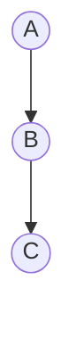
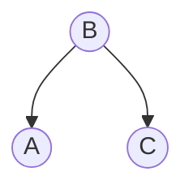
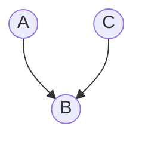
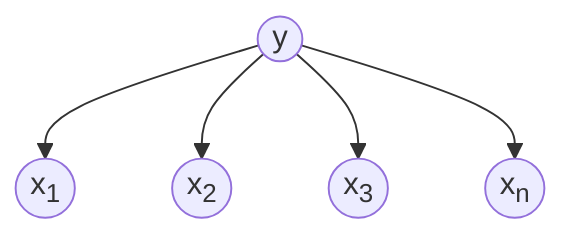
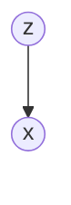
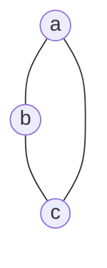
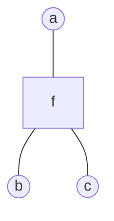
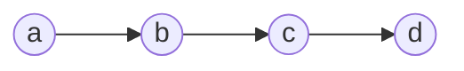
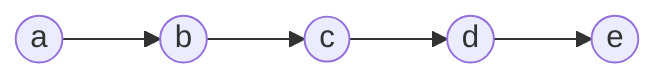
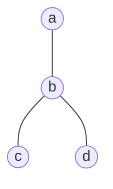

# 概率图模型

概率图模型使用图的方式表示概率分布。为了在图中添加各种概率，首先总结一下随机变量分布的一些规则：
$$\begin{align}
&加法公式:p(x_1)=\int p(x_1,x_2)dx_2\\
&乘法公式:p(x_1,x_2)=p(x_1|x_2)p(x_2)\\
&链式公式:p(x_1,x_2,\cdots,x_p)=\prod\limits_{i=1}^pp(x_i|x_{i+1,x_{i+2} \cdots}x_p)\\
&贝叶斯公式:p(x_1|x_2)=\frac{p(x_2|x_1)p(x_1)}{p(x_2)}
\end{align}$$
可以看到，在链式法则中，如果**数据维度特别高**，那么的**采样和计算非常困难**，我们需要在一定程度上作出简化：
1. **每个维度相互独立**：$P(x_1,\cdots,x_p)=\prod\limits_{i=1}^pP(x_i)$ 
>[!note] 朴素贝叶斯：$P(x_1,\cdots,x_p|y)=\prod\limits_{i=1}^pP(x_i|y)$

2. 在 Markov 假设中，给定数据的维度是**以时间顺序出现**的，给定当前时间的维度，那么下一个维度与之前的维度**独立**。
>[!note] 在 HMM 中，采用了**齐次 Markov 假设**。

3. 在 Markov 假设之上，更一般的，加入**条件独立性假设**，对维度划分集合 $A,B,C$，使得 $X_A\perp X_B|X_C$。

概率图模型采用**图**的特点表示上述的**条件独立性假设**，**节点**表示**随机变量**，**边**表示**条件概率**。概率图模型可以分为三大理论部分：

1.  表示：
    1.  有向图（离散）：贝叶斯网络
    2.  高斯图（连续）：高斯贝叶斯和高斯马尔可夫网路
    3.  无向图（离散）：马尔可夫网络
2.  推断
    1.  精确推断
    2.  近似推断
        1.  确定性近似（如变分推断）
        2.  随机近似（如 MCMC）
3.  学习
    1.  参数学习
        1.  完备数据
        2.  隐变量：E-M 算法
    2.  结构学习

## 有向图-贝叶斯网络

### 因子分解
已知联合分布中，各个随机变量之间的依赖关系，那么可以通过拓扑排序（根据依赖关系）可以获得一个有向图。而如果已知一个图，也可以直接得到联合概率分布的**因子分解**：
$$
p(x_1,x_2,\cdots,x_p)=\prod\limits_{i=1}^pp(x_i|x_{parent(i)})
$$
那么实际的图中条件独立性是如何体现的呢？在局部任何三个节点，可以有三种结构：

1.  

$$\begin{split}
&p(A,B,C)=\textcolor{red}{p(A)p(B|A)p(C|B)=p(A)p(B|A)p(C|B,A)}\\\\
\Rightarrow\ &p(C|B)=p(C|B,A)\\\\
\Leftrightarrow\ &\textcolor{red}{p(C|B)p(A|B)}=p(C|A,B)p(A|B)=\textcolor{red}{p(C,A|B)}\\\\
\Rightarrow\ &C\perp A|B\end{split}$$
2. 

$$\begin{split}
&p(A,B,C)=\textcolor{red}{p(A|B)p(B)p(C|B)=p(B)p(A|B)p(C|A,B)}\\\\
\Rightarrow\ &p(C|B)=p(C|B,A)\\\\
\Leftrightarrow\ &\textcolor{red}{p(C|B)p(A|B)}=p(C|A,B)p(A|B)=\textcolor{red}{p(C,A|B)}\\\\
\Rightarrow\ &C\perp A|B
\end{split}$$

3.  

$$\begin{split}
&p(A,B,C)=\textcolor{red}{p(A)p(C)p(B|C,A)=p(A)p(C|A)p(B|C,A)}\\\\
\Rightarrow\ &p(C)=p(C|A)\\\\
\Leftrightarrow\ &C\perp A\\
\end{split}$$

对这种结构，$A,C$ 不与 $B$ 条件独立。

### D划分

从整体的图来看，可以引入**D 划分**的概念。

对于类似上面图 1和图 2的关系，引入集合A，B，那么：

满足 $A\perp B|C$ 的 $C$ 集合中的点与 $A,B$  中的点的关系都满足图 1，2，

满足图3 关系的点都不在 $C$ 中。

D 划分应用在贝叶斯定理中：
$$p(x_i|x_{-i})
=\frac{P(x_i,x_{-i})}{P(x_{-i})}
=\frac{p(x)}{\int\limits_{x_i}p(x)dx_{i}}
=\frac{\prod\limits_{j=1}^pp(x_j|x_{parents(j)})}{\int\limits_{x_i}\prod\limits_{j=1}^pp(x_j|x_{parents(j)})dx_i}$$
可以发现，上下部分可以分为两部分，一部分是==和 $x_i$ 相关==的，另一部分是==和 $x_i$ 无关==的，而这个无关的部分可以相互约掉。于是计算只涉及和 $x_i$ 相关的部分。

与 $x_i$ 相关的部分可以写成：
$$
p(x_i|x_{parents(i)})p(x_{child(i)}|x_i)
$$
这些相关的部分又叫做 **Markov 毯**。


### 贝叶斯网络的分类： 

实际应用的模型中，对这些条件独立性作出了假设，
- 从单一到混合：
- 从有限到无限
	- 时间：
	- 空间：离散到连续
可以分为：

#### 单一：**朴素贝叶斯**
单一的条件独立性假设 $p(x|y)=\prod\limits_{i=1}^pp(x_i|y)$，在 D 划分后，所有条件依赖的集合就是单个元素。

#### 混合：**高斯混合模型**
混合的条件独立。引入多类别的隐变量 $z_1, z_2,\cdots,z_k$， $p(x|z)=N(\mu,\Sigma)$，条件依赖集合为多个元素。

#### 时间：**Markov 链**、**高斯过程**（无限维高斯分布）

#### 连续：**高斯贝叶斯网络**

#### 组合上面的分类
*   GMM 与时序结合：**动态模型**
	*   **隐马尔科夫模型HMM**（离散）
        *   **线性动态系统 LDS**（Kalman 滤波：连续/高斯、线性）
        *   **粒子滤波**（非高斯，非线性）

## 无向图-马尔可夫网络（马尔可夫随机场）

无向图没有了类似有向图的局部不同结构，在马尔可夫网络中，也存在 D 划分的概念。

1. 直接将条件独立的集合 $x_A\perp x_B|x_C$ 划分为三个集合。这个也叫**全局 Markov**。

2. 对局部的节点，$x\perp (\Omega-x-Neighbour(\mathcal{x}))|Neighbour(x)$。这也叫**局部 Markov**。

>[!note] 例如：$a\perp \{e,f\}|\{b,c,d\}$ 
>
>```mermaid
> graph TB;
> a((a))---b((b));
> a---c((c));
> a---d((d));
> d---e((e));
> b---f((f));
>```

3. 对于成对的节点：$x_i\perp x_j|x_{-i-j}$，其中 $i,j$ 不能相邻。这也叫**成对 Markov**。

事实上上面三个点局部全局成对是**相互等价**的。

### 因子分解

有了这个条件独立性的划分，还需要**因子分解**来实际计算。引入团的概念：

>[!note] **团：** 集合中的节点之间相互都是连接的叫做团，

>[!note] **最大团：** 如果不能再添加节点，那么叫最大团。

将概率无向图模型的**联合概率分布**表示为**其最大团上的随机变量的函数的乘积形式**的操作，称为概率无向图模型的**因子分解**

假设有 $K$ 个团，$Z$ 就是对所有可能取值求和：
$$
\begin{align}p(x)=\frac{1}{Z}\prod\limits_{i=1}^{K}\phi(x_{ci})\\
Z=\sum\limits_{x\in\mathcal{X}}\prod\limits_{i=1}^{K}\phi(x_{ci})
\end{align}
$$
其中：

- $C_i$ 为最大团

- $x_{C_i}$ 为最大团随机变量集合

- $\phi(x_{ci})$ 叫做**势函数**，它必须是一个正值，可以记为：
$$
\phi(x_{ci})=\exp(-E(x_{ci}))
$$
 这个分布叫做 **Gibbs 分布**（玻尔兹曼分布）。于是也可以记为：
 $$p(x)=\frac{1}{Z}\exp(-\sum\limits_{i=1}^KE(x_{ci}))$$
 这个分解和**条件独立性**等价（Hammesley-Clifford 定理），这个分布的形式也和**指数族分布**形式上相同，于是满足最大熵原理。

## 两种图的转换-道德图

我们常常想将有向图转为无向图，从而应用更一般的表达式。

1.  链式：

    ```mermaid
    graph TB;
    	A((A))-->B((B));
    	B-->C((C));
    ```

    直接去掉箭头，$p(a,b,c)=p(a)p(b|a)p(c|b)=\phi(a,b)\phi(b,c)$：

    ```mermaid
    graph TB;
    	A((A))---B((B));
    	B---C((C));
    ```

2.  V 形：

    ```mermaid
    graph TB;
    	B((B))-->A((A));
    	B-->C((C));
    ```

    由于 $p(a,b,c)=p(b)p(a|b)p(c|b)=\phi(a,b)\phi(b,c)$，直接去掉箭头：

    ```mermaid
    graph TB;
    	B((B))---A((A));
    	B---C((C));
    ```

3.  倒 V 形：

    ```mermaid
    graph TB;
    	A((A))-->B((B));
    	C((C))-->B
    ```

    由于 $p(a,b,c)=p(a)p(c)p(b|a,c)=\phi(a,b,c)$，于是在 $a,c$ 之间添加线：

    ```mermaid
    graph TD;
    	a((a))---b((b));
    	b---c((c));
    	a---c;
    ```

    观察着三种情况可以概括为：

    1.  将每个节点的父节点两两相连
    2.  将有向边替换为无向边

## 更精细的分解-因子图

对于一个有向图，可以通过引入环的方式，可以将其转换为无向图（Tree-like graph），这个图就叫做道德图。但是我们上面的 BP 算法只对无环图有效，通过因子图可以变为无环图。

考虑一个无向图：



可以将其转为：



其中 $f=f(a,b,c)$。因子图不是唯一的，这是由于因式分解本身就对应一个特殊的因子图，将因式分解：$p(x)=\prod\limits_{s}f_s(x_s)$ 可以进一步分解得到因子图。

## 推断

推断的主要目的是**求各种概率分布**，包括：

假设联合概率：$P(x)=P(x_1,x_2)$

**求边缘概率：**$P(x_i)=\sum\limits_{x_1}\cdots\sum\limits_{x_{i-1}}\sum\limits_{x_{i+1}}\cdots\sum\limits_{x_p}P(x)$

**求条件概率：**$P(x_A|x_B)$ ，其中 $x_A\cup x_B=x$

**求最大后验：** 使用 MAP 来求得参数 $\hat{z}=\arg\max\limits_{z}P(z|x)\propto\arg\max P(z,x)$

### 推断的分类

通常推断可以分为：
#### 精确推断

1. **变量消除** Variable Elimination(VE)

2.  **信念传播** Belief Propagation(BP, Sum-Product Algo)，从 VE 发展而来

3.  **联合树** Junction Tree

上面两种在==树结构==上应用，Junction Tree 在==普通图结构==上应用

#### 近似推断

1.  **循环信念传播** Loop Belief Propagation（针对==有环图结构==）

2.  **蒙特卡洛推断** Mente Carlo Interference：例如 重要性采样Importance Sampling，MCMC

3.  **变分推断** Variational Inference

### 推断-变量消除（VE）

变量消除的方法是在求解概率分布的时候，**将相关的条件概率先行求和或积分，从而一步步地消除变量**，例如在马尔可夫链中：



$$\begin{split}
p(d)=\sum\limits_{a,b,c}p(a,b,c,d)
&=\sum\limits_cp(d|c)\sum\limits_bp(c|b)\underbrace{\sum\limits_ap(b|a)p(a)}_{\phi_a(b)}\\
&=\sum\limits_cp(d|c)\underbrace{\sum\limits_bp(c|b)\cdot\phi_{a}(b)}_{\phi_b(c)}\\
&=\underbrace{\sum\limits_cp(d|c)\cdot\phi_b(c)}_{\phi_c(d)}\\
&=\phi_c(d)
\end{split}$$
可以看作是**乘法对加法的分配律**
$$P(x)=\prod_{x_c}\phi_c(x_c)$$
变量消除的缺点很明显：

1.  重复计算：计算步骤无法存储

2.  消除的最优次序是一个 NP-hard 问题

### 推断-信念传播（BP）

为了克服 VE 的第一个缺陷-计算步骤无法存储。我们进一步地对上面的马尔可夫链进行观察：



要求 $p(e)$，当然使用 VE，从 $a$ 一直消除到 $d$，

记 $\sum\limits_ap(a)p(b|a)=m_{a\to b(b)}$，表示这是**消除 $a$ 后的关于 $b$ 的概率**，

类似地，记 $\sum\limits_bp(c|b)m_{a\to b}(b)=m_{b\to c}(c)$。

于是 $p(e)=\sum\limits_dp(e|d)m_{b\to c}(c)$。

进一步观察，对 $p(c)$：
$$
p(c)=[\sum\limits_bp(c|b)\sum\limits_ap(b|a)p(a)]\cdot[\sum\limits_dp(d|c)\sum\limits_ep(e)p(e|d)]
$$
即**除了c以外全部约掉**（使用 $\sum$ 实现）

我们发现了和上面计算 $p(e)$ 类似的结构，这个式子可以分成两个部分：

一部分是从 $a$ 传播过来的概率，

第二部分是从 $e$ 传播过来的概率。

一般地，对于图（只对树形状的图）：



这四个团（对于无向图是团，对于有向图就是概率为除了根的节点为1），有四个节点，三个边：
$$
p(a,b,c,d)=\frac{1}{Z}\underbrace{\phi_a(a)\phi_b(b)\phi_c(c)\phi_d(d)}_{四个节点}\cdot\underbrace{\phi_{ab}(a,b)\phi_{bc}(c,b)\phi_{bd}(d,b)}_{三个边}
$$
套用上面关于有向图的观察，如果求解边缘概率 $p(a)$，定义

- $m_{c\to b}(b)=\sum\limits_c\phi_c(c)\phi_{bc}(bc)$
- $m_{d\to b}(b)=\sum\limits_d\phi_d(d)\phi_{bd}(bd)$
- $m_{b\to a}(a)=\sum\limits_b\phi_{ba}(ba)\phi_b(b)m_{c\to b}(b)_{d\to b}m(b)$
>[!tip] $m_{b\to a}(a)$ 意味着消去所有 $b$ ，而与 $b$ 连接的有三条边+它本身一个节点，所以是四项乘积求和

这样概率就一步步地传播到了 $a$：
$$
p(a)=\phi_a(a)m_{b\to a}(a)
$$
写成一般的形式，对于相邻节点 $i,j$：
$$m_{j\to i}(i)=\sum\limits_j\phi_{ij}(ij)\underbrace{\phi_j(j)\prod\limits_{k\in Nb(j)-i}m_{k\to j}(j)}_{Belief(j)}$$
其中：$Belief(j)=\phi_j(j)\prod\limits_{k\in Nb(j)-i}m_{k\to j}(j)$ 表示 $j$ 节点传递给 $i$ 节点的**信念**

对于某一节点：
$$\begin{split}
P(i)&=\phi_i(i)\prod_{j\in Nb(i)}m_{j\to i}(x_i)\\
&=\phi_i(i)\prod_{j\in Nb(i)}\sum_j\phi_{ij}(ij)\cdot Belief(j)\\
&=\phi_i(i)\prod_{j\in Nb(i)}\sum_j\phi_{ij}(ij)\cdot\phi_j(j)\prod_{k\in Nb(j)-i}m_{k\to j}(j)\\
\end{split}$$
>[!tip] 即：$i$ 的概率由她本身($\phi_i(i)$)和所有的($\prod$)子节点传递过来的信念 $\sum\phi_{ij}(ij)\cdot Belief(j)$ 加权组成

这个表达式，就可以保存计算过程了，只要**对每条边的传播分别计算**，对于一个无向树形图可以递归并行实现：

1.  任取一个节点 $a$ 作为**根节点**
2.  对这个根节点的邻居中的每一个节点，**收集信息**（计算入信息）
3.  对根节点的邻居，**分发信息**（计算出信息）

### 推断-Max-Product 算法

在推断任务中，MAP 也是常常需要的，MAP 的目的是寻找最佳参数：
$$
(\hat{a},\hat{b},\hat{c},\hat{d})=\mathop{\arg\max}_{a,b,c,d}\ p(a,b,c,d|E)
$$
类似 BP，我们采用信息传递的方式来求得最优参数，不同的是，我们在所有信息传递中，传递的是最大化参数的概率，而不是将所有可能求和：
$$
m_{j\to i}=\max\limits_{j}\phi_j\phi_{ij}\prod\limits_{k\in Neighbour(j)-i}m_{k\to j}
$$
于是对于上面的图：
$$
\max_a p(a,b,c,d)=\max_a\phi_a\phi_{ab}m_{c\to b}m_{d\to b}
$$
这个算法是 Sum-Product 算法的改进，也是在 HMM 中应用给的 Viterbi 算法的推广。

