# 第1 章 机器学习基础  

首先简单介绍一下机器学习（Machine Learning，ML）和深度学习（Deep Learning，DL）的基本概念。机器学习，顾名思义，机器具备有学习的能力。具体来讲，机器学习就是让机器具备找一个函数的能力。机器具备找函数的能力以后，它可以做很多事。比如语音识别，机器听一段声音，产生这段声音对应的文字。我们需要的是一个函数，该函数的输入是声音信号，输出是这段声音信号的内容。这个函数显然非常复杂，人类难以把它写出来，因此想通过机器的力量把这个函数自动找出来。还有好多的任务需要找一个很复杂的函数，以图像识别为例，图像识别函数的输入是一张图片，输出是这个图片里面的内容。AlphaGo 也可以看作是一个函数，机器下围棋需要的就是一个函数，该函数的输入是棋盘上黑子跟白子的位置，输出是机器下一步应该落子的位置。  

随着要找的函数不同，机器学习有不同的类别。假设要找的函数的输出是一个数值，一个标量（scalar），这种机器学习的任务称为回归。举个回归的例子，假设机器要预测未来某一个时间的PM2.5 的数值。机器要找一个函数 $f$ ，其输入是可能是种种跟预测PM2.5 有关的指数，包括今天的PM2.5 的数值、平均温度、平均的臭氧浓度等等，输出是明天中午的PM2.5的数值，找这个函数的任务称为**回归（regression）**。  

除了回归以外，另一个常见的任务是**分类（classification）**。分类任务要让机器做选择题。人类先准备好一些选项，这些选项称为类别（class），现在要找的函数的输出就是从设定好的选项里面选择一个当作输出，该任务称为分类。举个例子，每个人都有邮箱账户，邮箱账户里面有一个函数，该函数可以检测一封邮件是否为垃圾邮件。分类不一定只有两个选项，也可以有多个选项。  

AlphaGo 也是一个分类的问题，如果让机器下围棋，做一个AlphaGo，给出的选项与棋盘的位置有关。棋盘上有 $19\times19$ 个位置，机器下围棋其实是一个有 $19\times19$ 个选项的选择题。机器找一个函数，该函数的输入是棋盘上黑子跟白子的位置，输出就是从 $19\times19$ 个选项里面，选出一个正确的选项，从 $19\times19$ 个可以落子的位置里面，选出下一步应该要落子的位置。  

在机器学习领域里面，除了回归跟分类以外，还有结构化学习（structured learning）。机器不只是要做选择题或输出一个数字，而是产生一个有结构的物体，比如让机器画一张图，写一篇文章。这种叫机器产生有结构的东西的问题称为结构化学习。  

## 1.1 案例学习  

以视频的点击次数预测为例介绍下机器学习的运作过程。假设有人想要通过视频平台赚钱，他会在意频道有没有流量，这样他才会知道他的获利。假设后台可以看到很多相关的信息，比如：每天点赞的人数、订阅人数、观看次数。根据一个频道过往所有的信息可以预测明天的观看次数。找一个函数，该函数的输入是后台的信息，输出是隔天这个频道会有的总观看的次数.  

机器学习找函数的过程，分成3 个步骤。第一个步骤是写出一个带有未知参数的函数 $f$ ，其能预测未来观看次数。比如将函数写成  

$$
y=b+w x_{1}
$$

其中， $y$ 是准备要预测的东西，要预测的是今天（2 月26 日）这个频道总共观看的人， $y$ 就假设是今天总共的观看次数。 $x_{1}$ 是这个频道，前一天（2 月25 日）总共的观看次数， $y$ 跟 $x_{1}$ 都是数值， $b$ 跟 $w$ 是未知的参数，它是准备要通过数据去找出来的， $w$ 跟 $b$ 是未知的，只是隐约地猜测。猜测往往来自于对这个问题本质上的了解，即领域知识（domain knowledge）。机器学习就需要一些领域知识。这是一个猜测，也许今天的观看次数，总是会跟昨天的观看次数有点关联，所以把昨天的观看次数，乘上一个数值，但是总是不会一模一样，所以再加上一个b 做修正，当作是对于2 月26 日，观看次数的预测，这是一个猜测，它不一定是对的，等一下回头会再来修正这个猜测。总之， $y=b+w*x_{1}$ ，而 $b$ 跟 $w$ 是未知的。带有未知的参数（parameter）的函数称为模型（model）。模型在机器学习里面，就是一个带有未知的参数的函数，特征（feature） $x_{1}$ 是这个函数里面已知的，它是来自于后台的信息，2 月25 日点击的总次数是已知的，而 $w$ 跟 $b$ 是未知的参数。 $w$ 称为权重（weight）， $b$ 称为偏置（bias）。这个是第一个步骤。  

第2 个步骤是定义损失（loss），损失也是一个函数。这个函数的输入是模型里面的参数，模型是 $y=b+w*x_{1}$ ，而 $b$ 跟 $w$ 是未知的，损失是函数 $L(b,w)$ ，其输入是模型参数 $b$ 跟$w$ 。损失函数输出的值代表，现在如果把这一组未知的参数，设定某一个数值的时候，这笔数值好还是不好。举一个具体的例子，假设未知的参数的设定是 $b=500$ ， $w=1$ ，预测未来的观看次数的函数就变成 $y=500+x_{1}$ 。要从训练数据来进行计算损失，在这个问题里面，训练数据是这一个频道过去的观看次数。举个例子，从2017 年1 月1 日到2020 年12 月31 日的观看次数（此处的数字是随意生成的）如图1.1 所示，接下来就可以计算损失。  

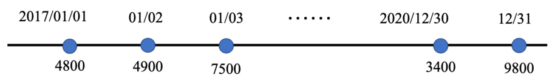  
图1.1 2017 年1 月1 日到2020 年12 月31 日的观看次数  

把2017 年1 月1 日的观看次数，代入这一个函数里面  

$$
\hat{y}=500+1x_{1}
$$

可以判断 $b=500$ ， $w=1$ 的时候，这个函数有多棒。 $x_{1}$ 代入4800，预测隔天实际上的观看次数结果为 $\hat{y}=5300$ ，真正的结果是4900，真实的值称为标签（label），它高估了这个频道可能的点击次数，可以计算一下估测的值 $\hat{y}$ 跟真实值 $y$ 的差距 $e$ 。计算差距其实不只一种方式，比如取绝对值：  

$$
e_{1}=|y-\hat{y}|=400
$$

我们不是只能用1 月1 日，来预测1 月2 日的值，可以用1 月2 日的值，来预测1 月3日的值。根据1 月2 日的观看次数，预测的1 月3 日的观看次数的，值是5400。接下来计算5400 跟跟标签（7500）之间的差距，低估了这个频道。在1 月3 日的时候的观看次数，才可以算出：  

$$
e_{2}=|y-\hat{y}|=2100
$$

我们可以算过这3 年来，每一天的预测的误差，这3 年来每一天的误差，通通都可以算出来，每一天的误差都可以得到 $e$ 。接下来把每一天的误差，通通加起来取得平均，得到损失L  

$$
L=\dfrac{1}{N}\sum_{n}e_{n}
$$

其中， $N$ 代表训验数据的个数，即3 年来的训练数据，就365 乘以3，计算出一个 $L$ ，，$L$ 是每一笔训练数据的误差 $e$ 相加以后的结果。 $L$ 越大，代表现在这一组参数越不好， $L$ 越小，代表现在这一组参数越好。  

估测的值跟实际的值之间的差距，其实有不同的计算方法，计算 $y$ 与 $\hat{y}$ 之间绝对值的差距，如式(1.6) 所示，称为平均绝对误差（Mean Absolute Error，MAE）。  

$$
e=|\hat{y}-y|
$$

如果算 $y$ 与 $\hat{y}$ 之间平方的差距，如式(1.7) 所示，则称为均方误差（Mean SquaredError，MSE）。  

$$
e=(\hat{y}-y)^{2}
$$

有一些任务中 $y$ 和 $\hat{y}$ 都是概率分布，这个时候可能会选择交叉熵（cross entropy），这个是机器学习的第2 步。刚才举的那些数字不是真正的例子，以下的数字是真实的例子，是这个频道真实的后台的数据，所计算出来的结果。可以调整不同的 $w$ 和不同的 $b$ ，求取各种$w$ 和各种 $b$ ，组合起来以后，我们可以为不同的 $w$ 跟 $b$ 的组合，都去计算它的损失，就可以画出图1.2 所示的等高线图。在这个等高线图上面，越偏红色系，代表计算出来的损失越大，就代表这一组 $w$ 跟 $b$ 越差。如果越偏蓝色系，就代表损失越小，就代表这一组 $w$ 跟 $b$ 越好，拿这一组 $w$ 跟 $b$ ，放到函数里面，预测会越精准。假设 $w=-0.25,b=-500$ ，这代表这个频道每天看的人越来越少，而且损失这么大，跟真实的情况不太合。如果 $w=0.75,b=500$ ，估测会比较精准。如果 $w$ 代一个很接近1 的值， $b$ 带一个小小的值，比如说100 多，这个时候估测是最精准的，这跟大家的预期可能是比较接近的，就是拿前一天的点击的总次数，去预测隔天的点击的总次数，可能前一天跟隔天的点击的总次数是差不多的，因此 $w$ 设1， $b$ 设一个小一点的数值，也许估测就会蛮精准的。如图1.2 所示的等高线图，就是试了不同的参数，计算它的损失，画出来的等高线图称为误差表面（error surface）。这是机器学习的第2 步。  

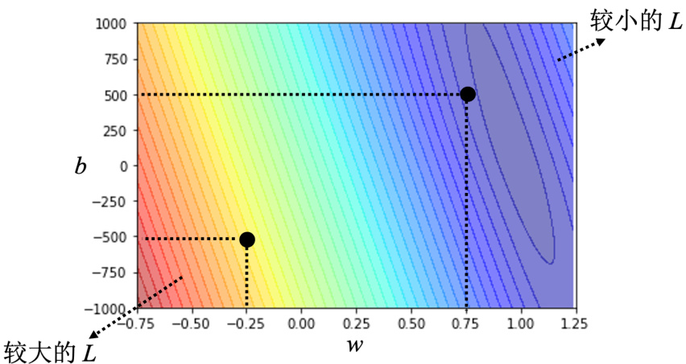  
图1.2 误差表面  

接下来进入机器学习的第3 步：解一个最优化的问题。找一个 $w$ 跟 $b$ ，把未知的参数找一个数值出来，看代哪一个数值进去可以让损失 $L$ 的值最小，就是要找的 $w$ 跟 $b$ ，这个可以让损失最小的 $w$ 跟 $b$ 称为 $w^{*}$ 跟 $b^{*}$ 代表它们是最好的一组 $w$ 跟 $b$ ，可以让损失的值最小。梯度下降（gradient descent）是经常会使用优化的方法。为了要简化起见，先假设只有一个未知的参数 $w$ ， $b$ 是已知的。 $w$ 代不同的数值的时候，就会得到不同的损失，这一条曲线就是误差表面，只是刚才在前一个例子里面，误差表面是2 维的，这边只有一个参数，所以这个误差表面是1 维的。怎么样找一个 $w$ 让损失的值最小呢? 如图1.3 所示，首先要随机选取一个初始的点 $w^{0}$ 。接下来计算 $\dfrac{\partial L}{\partial w}|_{w=w^{0}}$ ，在 $w$ 等于 $w^{0}$ 的时候，损失关于参数 $w$ 的偏导数。计算在这一个点，在 $w^{0}$ 这个位置的误差表面的切线斜率，也就是这一条蓝色的虚线，它的斜率，如果这一条虚线的斜率是负的，代表说左边比较高，右边比较低。在这个位置附近，左边比较高，右边比较低。如果左边比较高右边比较低的话，就把 $w$ 的值变大，就可以让损失变小。如果算出来的斜率是正的，就代表左边比较低右边比较高。左边比较低右边比较高，如果左边比较低右边比较高的话，就代表把 $w$ 变小了， $w$ 往左边移，可以让损失的值变小。这个时候就应该把 $w$ 的值变小。我们可以想像说有一个人站在这个地方，他左右环视一下，算微分就是左右环视，它会知道左边比较高还是右边比较高，看哪边比较低，它就往比较低的地方跨出一步。这一步的步伐的大小取决于两件事情：  

• 第一件事情是这个地方的斜率，斜率大步伐就跨大一点，斜率小步伐就跨小一点。  
• 另外，学习率（learning rate） $\eta$ 也会影响步伐大小。学习率是自己设定的，如果 $\eta$ 设大一点，每次参数更新就会量大，学习可能就比较快。如果 $\eta$ 设小一点，参数更新就很慢，每次只会改变一点点参数的数值。这种在做机器学习，需要自己设定，不是机器自己找出来的，称为超参数（hyperparameter）。  

> Q：为什么损失可以是负的?  

> A：损失函数是自己定义的，在刚才定义里面，损失就是估测的值跟正确的值的绝对值。如果根据刚才损失的定义，它不可能是负的。但是损失函数是自己决定的，比如设置一个损失函数为绝对值再减100，其可能就有负的。这个曲线并不是一个真实的损失，并不是一个真实任务的误差表面。因此这个损失的曲线可以是任何形状。  

把 $w^{0}$ 往右移一步，新的位置为 $w^{1}$ ，这一步的步伐是 $\eta$ 乘上微分的结果，即：  

$$
w^{1}\leftarrow w^{0}-\eta\left.\dfrac{\partial L}{\partial w}\right|_{w=w^{0}}
$$

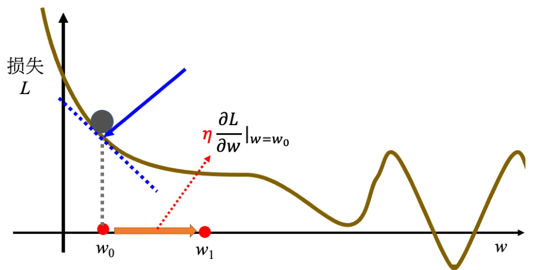  
图1.3 优化过程  

接下来反复进行刚才的操作，计算一下 $w^{1}$ 微分的结果，再决定现在要把 $w^{1}$ 移动多少，再移动到 $w^{2}$ ，再继续反复做同样的操作，不断地移动 $w$ 的位置，最后会停下来。往往有两种情况会停下来。  

• 第一种情况是一开始会设定说，在调整参数的时候，在计算微分的时候，最多计算几次。上限可能会设为100 万次，参数更新100 万次后，就不再更新了，更新次数也是一个超参数。  
• 还有另外一种理想上的，停下来的可能是，当不断调整参数，调整到一个地方，它的微分的值就是这一项，算出来正好是0 的时候，如果这一项正好算出来是0，0 乘上学习率 $\eta$ 还是0，所以参数就不会再移动位置。假设是这个理想的情况，把 $w^{0}$ 更新到 $w^{1}$ ，再更新到 $w^{2}$ ，最后更新到 $w^{T}$ 有点卡， $w^{T}$ 卡住了，也就是算出来这个微分的值是0 了，参数的位置就不会再更新。  

梯度下降有一个很大的问题，没有找到真正最好的解，没有找到可以让损失最小的 $w$ 。在图1.4 所示的例子里面，把 $w$ 设定在最右侧红点附近这个地方可以让损失最小。但如果在梯度下降中， $w^{0}$ 是随机初始的位置，也很有可能走到 $w^{T}$ 这里，训练就停住了，无法再移动 $w$ 的位置。右侧红点这个位置是真的可以让损失最小的地方，称为全局最小值（global minima），而 $w^{T}$ 这个地方称为局部最小值（local minima），其左右两边都比这个地方的损失还要高一点，但是它不是整个误差表面上面的最低点。  

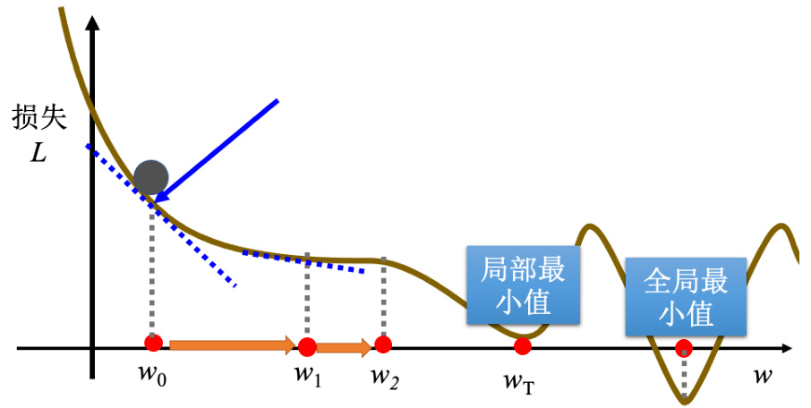  
图1.4 局部最小值  

所以常常可能会听到有人讲到梯度下降不是个好方法，这个方法会有局部最小值的问题，无法真的找到全局最小值。事实上局部最小值是一个假问题，在做梯度下降的时候，真正面对的难题不是局部最小值。有两个参数的情况下使用梯度下降，其实跟刚才一个参数没有什么不同。如果一个参数没有问题的话，可以很快的推广到两个参数。  

假设有两个参数，随机初始值为 $w^{0},b^{0}$ 。要计算损失关于 $w,b$ 的偏导数，计算在 $w=w^{0}$ 的位置， $b=b^{0}$ 的位置，要计算 $L$ 关于 $w$ 的偏导数，计算 $L$ 关于 $b$ 的偏导数：  

$$
\begin{array}{l}{\displaystyle\dfrac{\partial L}{\partial b}\bigg|_{w=w^{0},b=b^{0}}}\\ {\displaystyle\dfrac{\partial L}{\partial w}\bigg|_{w=w^{0},b=b^{0}}}\end{array}
$$

计算完后更新 $w$ 跟 $b$ ，把 $w^{0}$ 减掉学习率乘上微分的结果得到 $w^{1}$ ，把 $b^{0}$ 减掉学习率乘  

上微分的结果得到 $b^{1}$ 。  

$$
\begin{array}{c}{{w^{1}\leftarrow w^{0}-\eta\left.\displaystyle\dfrac{\partial L}{\partial w}\right|_{w=w^{0},b=b^{0}}}}\\ {{b^{1}\leftarrow b^{0}-\eta\left.\displaystyle\dfrac{\partial L}{\partial b}\right|_{w=w^{0},b=b^{0}}}}\end{array}
$$

在深度学习框架里面，比如PyTorch 里面，算微分都是程序自动帮计算的。就是反复同样的步骤，就不断的更新 $w$ 跟 $b$ ，期待最后，可以找到一个最好的 $w$ ， $w^{*}$ 跟最好的 $b^{*}$ . 如图1.5 所示，随便选一个初始的值，先计算一下 $L$ 关于 $w$ 的偏导数，跟计算一下 $L$ 关于 $b$ 的偏导数，接下来更新 $w$ 跟 $b$ ，更新的方向就是 $\partial L/\partial w$ ，乘以 $\eta$ 再乘以一个负号， $\partial L/\partial b$ ，算出这个微分的值，就可以决定更新的方向，可以决定 $w$ 要怎么更新。把 $w$ 跟 $b$ 更新的方向结合起来，就是一个向量，就是红色的箭头，再计算一次微分，再决定要走什么样的方向，把这个微分的值乘上学习率，再乘上负号，我们就知道红色的箭头要指向那里，就知道如何移动 $w$ 跟 $b$ 的位置，一直移动，期待最后可以找出一组不错的 $w,b$ 。实际上真的用梯度下降，进行一番计算以后，这个是真正的数据，算出来的最好的 $w^{\ast}=0.97,b^{\ast}=100$ ，跟猜测蛮接近的。因为 $x_{1}$ 的值可能跟 $y$ 很接近，所以这个 $w$ 就设一个接近1 的值， $b$ 就设一个比较偏小的值。损失 $L(w^{*},b^{*})$ 算一下是480，也就是在2017 到2020 年的数据上，如果使用这一个函数，b代100， $w$ 代0.97，平均的误差是480，其预测的观看次数误差，大概是500 人左右。  

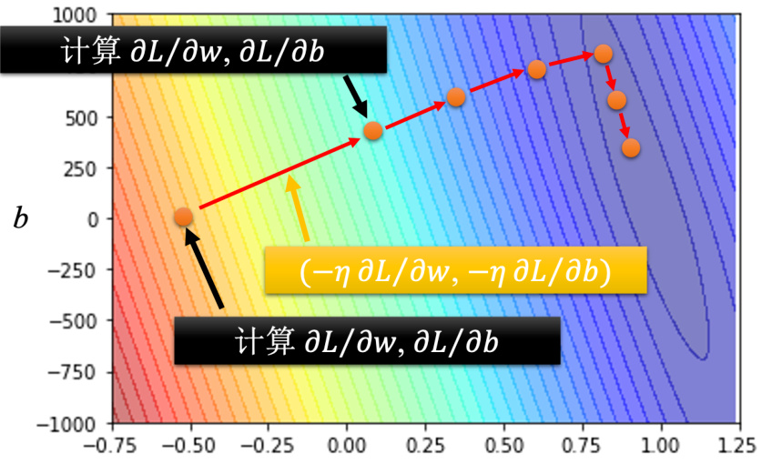  
图1.5 梯度下降优化的过程  

## 1.2 线性模型  

$w$ 跟b 的值刚才已经找出来的，这组 $w$ 跟 $b$ 可以让损失小到480。在已经知道答案的数据上去计算损失，2017 到2020 年每天的观看次数是已知的。所以假装不知道隔天的观看次数，拿这一个函数来进行预测，发现误差是480。接下来使用这个函数预测未来的观看次数。预测从2021 年开始每一天都拿这个函数去预测次日的观看人次：用2020 年的12 月31 日的观看人次预测2021 年1 月1 日的观看人次，用2021 年1 月1 日的观看人次预测1 月2 日的观看人次，用1 月2 日的观看人次去预测1 月3 日的观看人次⋯⋯每天都做这件事，一直做到2 月14 日，得到平均的值，在2021 年数据上的误差值用 $L^{\prime}$ 来表示，它是0.58，所以在有看过的数据上，在训练数据上，误差值是比较小的，在2021 年的数据上，看起来误差值是比较大的，每一天的平均误差有580 人左右，600 人左右。如图1.6 所示，横轴是代表的是时间，所以0 这个点代表的是2021 年1 月1 日，最右边点代表的是2021 年2 月14 日，纵轴就是观看的人次，这边是用千人当作单位。红色线是真实的观看人次，蓝色线是机器用这一个函数预测出来的观看人次。蓝色的线几乎就是红色的线往右平移一天而已，这很合理，因为$x_{1}$ 也就是前一天的观看人次，跟隔天观看人次的，要怎么拿前一天的观看人次，去预测隔天的观看人次呢，前一天观看人次乘以0.97，加上100 加上100，就是隔天的观看人次。机器几乎就是拿前一天的观看人次来预测隔天的观看人次。这个真实的数据有一个很神奇的现象，它是有周期性的，它每隔7 天就会有两天特别低（周五和周六），两天观看的人特别少，每隔7 天，就是一个循环。目前的模型不太行，它只能够看前一天。 每隔7 天它一个循环，如果一个模型参考前7 天的数据，把7 天前的数据，直接复制到拿来当作预测的结果，也许预测的会更准也说不定，所以我们就要修改一下模型。通常一个模型的修改，往往来自于对这个问题的理解，即领域知识。  

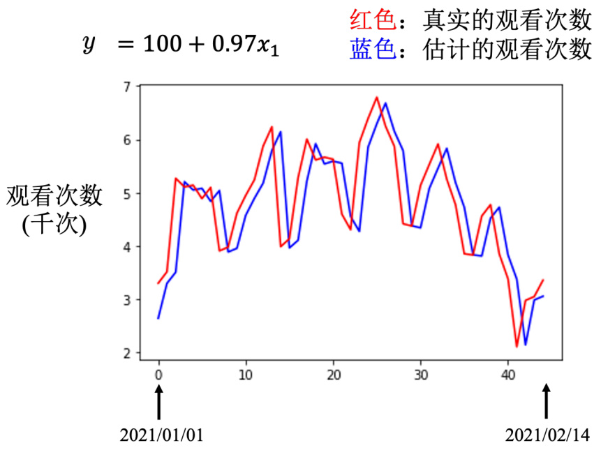  
图1.6 预估曲线图  

开始，对问题完全不理解的时候，胡乱写一个  

$$
y=b+w x_{1}
$$

并没有做得特别好。接下来我们观察了真实的数据以后，得到一个结论是，每隔7 天有一个循环。所以要把前7 天的观看人次都列入考虑，写了一个新的模型  

$$
y=b+\sum_{j=1}^{7}w_{j}x_{j}
$$

其中 $x_{j}$ 代表第 $j$ 天的观看测试，也就是7 天前的数据，通通乘上不同的权重 $w_{j}$ ，加起来，再加上偏置得到预测的结果。使用该模型预测，其在训练数据上的损失是380，而只考虑1 天的模型在训练数据上的损失是480。因为其考虑了7 天，所以在训练数据上会得到比较低的损失。考虑了比较多的信息，在训练数据上应该要得到更好的、更低的损失。在没有看到的数据上的损失有比较好是490。只考虑1 天的误差是580，考虑7 天的误差是490。用梯度下降，算出 $w$ 跟 $b$ 的最优值如表1.1 所示。  

表1.1 $w$ 和 $b$ 的最优值  

| $b$ | $w_1^*$ | $w_2^*$ | $w_3^*$ | $w_4^*$ | $w_5^*$ | $w_6^*$ | $w_7^*$ |
| --- | ------- | ------- | ------- | ------- | ------- | ------- | ------- |
| 50  | 0.79    | -0.31   | 0.12    | -0.01   | -0.10   | 0.30    | 0.18    |

机器的逻辑是前一天跟要预测的隔天的数值的关系很大，所以 $w_1^*$ 是0.79，不过它知道，如果是前两天前四天前五天，它的值会跟未来要预测的，隔天的值是成反比的，所以 $w_{2},w_{4},w_{5}$ 最佳的值（让训练数据上的损失为380 的值）是负的。但是 $w_{1},w_{3},w_{6},w_{7}$ 是正的，考虑前7天的值，其实可以考虑更多天，本来是考虑前7 天，可以考虑28 天，即  
$$
y=b+\sum_{j=1}^{28}w_{j}x_{j}.
$$

28 天是一个月，考虑前一个月每一天的观看人次，去预测隔天的观看人次，训练数据上是330。在2021 年的数据上，损失是460，看起来又更好一点。如果考虑56 天，即  

$$
y=b+\sum_{j=1}^{56}w_{j}x_{j}
$$

在训练数据上损失是320，在没看过的数据上损失还是460。考虑更多天没有办法再更降低损失了。看来考虑天数这件事，也许已经到了一个极限。这些模型都是把输入的特征 $x$ 乘上一个权重，再加上一个偏置就得到预测的结果，这样的模型称为线性模型（linear model）。接下来会看如何把线性模型做得更好。  

### 1.2.1 分段线性曲线  

线性模型也许过于简单， $x_{1}$ 跟 $y$ 可能中间有比较复杂的关系，如图1.7 所示。对于线性模型， $x_{1}$ 跟 $y$ 的关系就是一条直线，随着 $x_{1}$ 越来越高， $y$ 就应该越来越大。设定不同的 $w$ 可以改变这条线的斜率，设定不同的 $b$ 可以改变这一条蓝色的直线跟 $y$ 轴的交叉点。但是无论如何改 $w$ 跟 $b$ ，它永远都是一条直线，永远都是 $x_{1}$ 越大， $y$ 就越大，前一天观看的次数越多，隔天的观看次数就越多。但现实中也许在 $x_{1}$ 小于某一个数值的时候，前一天的观看次数跟隔天的观看次数是成正比；也许当 $x_{1}$ 大于一个数值的时候， $x_{1}$ 太大，前天观看的次数太高，隔天观看次数就会变少；也许 $x_{1}$ 跟 $y$ 中间，有一个比较复杂的、像红色线一样的关系。但不管如何设置 $w$ 跟 $b$ ，永远制造不出红色线，永远无法用线性模型制造红色线。显然线性模型有很大的限制，这一种来自于模型的限制称为模型的偏差，无法模拟真实的情况。  

所以需要写一个更复杂的、更有灵活性的、有未知参数的函数。红色的曲线可以看作是一个常数再加上一群Hard Sigmoid 函数。Hard Sigmoid 函数的特性是当输入的值，当x 轴的值小于某一个阈值（某个定值）的时候，大于另外一个定值阈值的时候，中间有一个斜坡。所以它是先水平的，再斜坡，再水平的。所以红色的线可以看作是一个常数项加一大堆的蓝色函数（Hard Sigmoid）。常数项设成红色的线跟 $\textrm{x}$ 轴的交点一样大。常数项怎么加上蓝色函数后，变成红色的这一条线? 蓝线1 函数斜坡的起点，设在红色函数的起始的地方，第2 个斜坡的终点设在第一个转角处，让第1 个蓝色函数的斜坡和红色函数的斜坡的斜率是一样的，这个时候把0+1 就可以得到红色曲线左侧的线段。接下来，再加第2 个蓝色的函数，所以第2 个蓝色函数的斜坡就在红色函数的第一个转折点到第2 个转折点之间，让第2 个蓝色函数的斜率跟红色函数的斜率一样，这个时候把 $0+1+2$ ，就可以得到红色函数左侧和中间的线段。接下来第3 个部分，第2 个转折点之后的部分，就加第3 个蓝色的函数，第3 个蓝色的函数坡度的起始点设的跟红色函数转折点一样，蓝色函数的斜率设的跟红色函数斜率一样，接下来把 $0+1+2+3$ 全部加起来，就得到完整红色的线。  

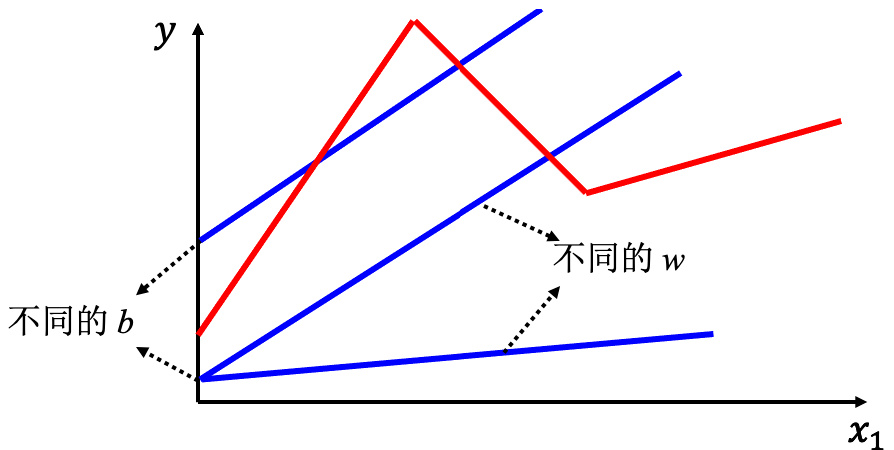  
图1.7 线性模型的局限性  

所以红色线，即分段线性曲线（piecewise linear curve）可以看作是一个常数，再加上一堆蓝色的函数。分段线性曲线可以用常数项加一大堆的蓝色函数组合出来，只是用的蓝色函数不一定一样。要有很多不同的蓝色函数，加上一个常数以后就可以组出这些分段线性曲线。如果分段线性曲线越复杂，转折的点越多，所需的蓝色函数就越多。  

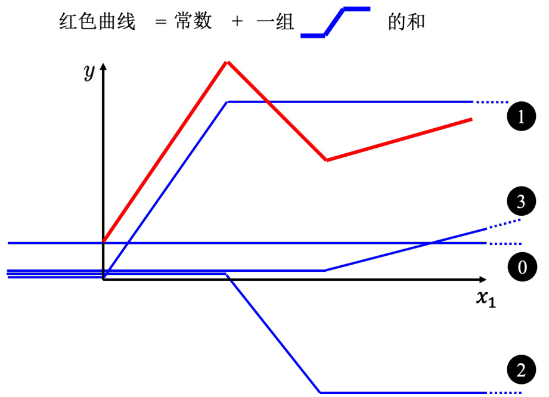  
图1.8 构建红色曲线  

也许要考虑的 $x$ 跟 $y$ 的关系不是分段线性曲线，而是如图1.9 所示的曲线。可以在这样的曲线上面，先取一些点，再把这些点点起来，变成一个分段线性曲线。而这个分段线性曲线跟原来的曲线，它会非常接近，如果点取的够多或点取的位置适当，分段线性曲线就可以逼近这一个连续的曲线，就可以逼近有角度的、有弧度的这一条曲线。 所以可以用分段线性曲线去逼近任何的连续的曲线，而每个分段线性曲线都可以用一大堆蓝色的函数组合起来。也就是说，只要有足够的蓝色函数把它加起来，就可以变成任何连续的曲线。  

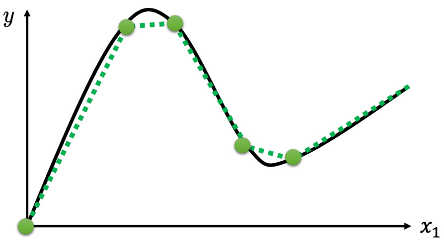  
图1.9 分段曲线可以逼近任何连续曲线  

假设 $x$ 跟 $y$ 的关系非常复杂也没关系，就想办法写一个带有未知数的函数。直接写HardSigmoid 不是很容易，但是可以用一条曲线来理解它，用Sigmoid 函数来逼近Hard Sigmoid，如图1.10 所示。Sigmoid 函数的表达式为  

$$
y=c\dfrac{1}{1+e^{-(b+w x_{1})}}
$$

其横轴输入是 $x_{1}$ ，输出是 $y$ ， $c$ 为常数。  

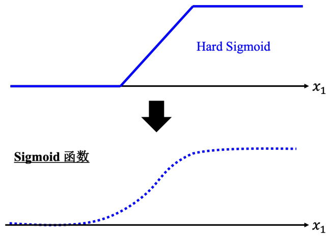  
图1.10 使用Sigmoid 逼近Hard Sigmoid  

如果 $x_{1}$ 的值，趋近于无穷大的时候， $e^{-(b+w x_{1})}$ 这一项就会消失，当 $x_{1}$ 非常大的时候，这一条就会收敛在高度为 $c$ 的地方。如果 $x_{1}$ 负的非常大的时候，分母的地方就会非常大， $y$ 的值就会趋近于0。  

所以可以用这样子的一个函数逼近这一个蓝色的函数，即Sigmoid 函数，Sigmoid 函数就是S 型的函数。因为它长得是有点像是S 型，所以叫它Sigmoid 函数。  

为了简洁，去掉了指数的部分，蓝色函数的表达式为  

$$
y=c\sigma(b+w x_{1})
$$

所以可以用Sigmoid 函数逼近Hard Sigmoid 函数。  

$$
y=c\dfrac{1}{1+e^{-(b+w x_{1})}}
$$

调整这里的 $b,w$ 和 $c$ 可以制造各种不同形状的Sigmoid 函数，用各种不同形状的Sigmoid函数去逼近Hard Sigmoid 函数。如图1.11 所示，如果改 $w$ ，就会改变斜率，就会改变斜坡的坡度。如果改了 $b$ ，就可以把这一个Sigmoid 函数左右移动；如果改 $c$ ，就可以改变它的高度。所以只要有不同的 $w$ 不同的 $b$ 不同的 $c$ ，就可以制造出不同的Sigmoid 函数，把不同的Sigmoid 函数叠起来以后就可以去逼近各种不同的分段线性函数；分段线性函数可以拿来近似各种不同的连续的函数。  

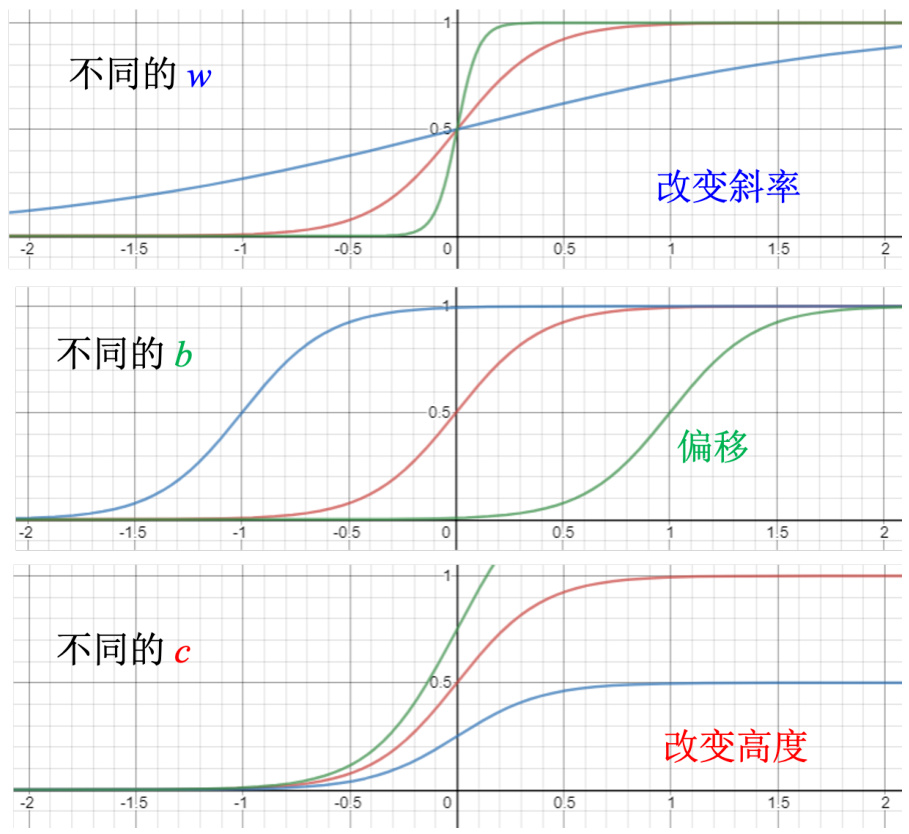  
图1.11 调整参数，制造不同的Sigmoid 函数  

如图1.12 所示，红色这条线就是0 加 $1+2+3$ ，而1、2、3 都是蓝色的函数，其都可写成 $\left(b+w x_{1}\right)$ ，去做Sigmoid 再乘上 $c_{i}1$ ，只是1、2、3 的 $w$ 、 $b$ 、 $c$ 不同。  

$$
y=b+\sum_{i}c_{i}\sigma(b_{i}+w_{i}x_{1})
$$

所以这边每一个式子都代表了一个不同蓝色的函数，求和就是把不同的蓝色的函数相加，再加一个常数 $b$ 。假设里面的 $b$ 跟 $w$ 跟 $c$ ，它是未知的，它是未知的参数，就可以设定不同的$b$ 跟 $w$ 跟 $c$ ，就可以制造不同的蓝色的函数，制造不同的蓝色的函数叠起来以后，就可以制造出不同的红色的曲线，就可以制造出不同的分段线性曲线，逼近各式各样不同的连续函数。  

此外，我们可以不只用一个特征 $x_{1}$ ，可以用多个特征代入不同的 $c,b,w$ ，组合出各种不同的函数，从而得到更有**灵活性（flexibility）** 的函数，如图1.13 所示。用 $j$ 来代表特征的编号。如果要考虑前28 天， $j$ 就是1 到28。  

直观来讲，先考虑一下 $j$ 就是1、2、3 的情况，就是只考虑3 个特征。举个例子，只考虑前一天、前两天跟前3 天的情况，所以 $j$ 等于1,2,3，所以输入就是 $x_{1}$ 代表前一天的观看次数， $x_{2}$ 两天前观看次数， $x_{3}\mathrm{~3~}$ 天前的观看次数，每一个 $i$ 就代表了一个蓝色的函数。每一个蓝色的函数都用一个Sigmoid 函数来比近似它，1,2,3 代表有个Sigmoid 函数。  

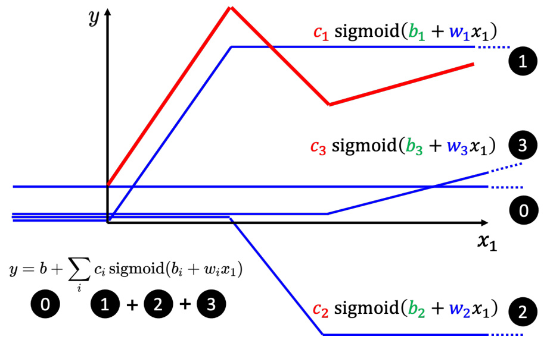  
图1.12 使用Hard Sigmoid 来合成红色  

$$
b_{1}+w_{11}x_{1}+w_{12}x_{2}+w_{13}x_{3}
$$

$w_{i j}$ 代表在第 $i$ 个Sigmoid 里面，乘给第 $j$ 个特征的权重， $w$ 的第一个下标代表是现在在考虑的是第一个Sigmoid 函数。为了简化起见，括号里面的式子为  

$$
\begin{array}{r}{r_{1}=b_{1}+w_{11}x_{1}+w_{12}x_{2}+w_{13}x_{3}}\\ {r_{2}=b_{2}+w_{21}x_{1}+w_{22}x_{2}+w_{23}x_{3}}\\ {r_{3}=b_{3}+w_{31}x_{1}+w_{32}x_{2}+w_{33}x_{3}}\end{array}
$$

$$
{\left[\begin{array}{l}{r_{1}}\\ {r_{2}}\\ {r_{3}}\end{array}\right]}={\left[\begin{array}{l}{b_{1}}\\ {b_{2}}\\ {b_{3}}\end{array}\right]}+{\left[\begin{array}{l l l}{w_{11}}&{w_{12}}&{w_{13}}\\ {w_{21}}&{w_{22}}&{w_{23}}\\ {w_{31}}&{w_{32}}&{w_{33}}\end{array}\right]}{\left[\begin{array}{l}{x_{1}}\\ {x_{2}}\\ {x_{3}}\end{array}\right]}
$$

将其改成线性代数比较常用的表示方式为  

$$
\pmb{r}=\pmb{b}+\pmb{W}\pmb{x}
$$

蓝框里面的括号里面做的如式(1.21) 所示， $r$ 对应的是 $r_{1},r_{2},r_{3\circ}~~r_{1},r_{2},r_{3}$ 分别通过Sig-moid 函数得到 $a_{1},a_{2},a_{3}$ ，即  

$$
\begin{array}{r}{\pmb{a}=\sigma(\pmb{r})}\end{array}
$$

因此蓝色虚线框里面做的事情，是从 $x_{1},x_{2},x_{3}$ 得到了 $a_{1},a_{2},a_{3}$ ，如图1.14 所示。  

上面这个比较有灵活性的函数，如果用线性代数来表示，即  

$$
y=b+c^{\mathrm{T}}\pmb{a}
$$

接下来，如图1.15 所示， $\boldsymbol{x}$ 是特征，绿色的 $\boldsymbol{b}$ 是一个向量，灰色的 $b$ 是一个数值。 $W,b,c^{\mathrm{T}},b$ 是未知参数。把这些东西通通拉直，“拼”成一个很长的向量，我们把 $W$ 的每一行或者是每一列拿出来。无论是拿行或拿列都可以，把 $W$ 的每一列或每一行“拼”成一个长的向量，把 $\boldsymbol{b},\boldsymbol{c}^{\mathrm{T}},\boldsymbol{b}$ “拼” 上来，这个长的向量直接用 $\pmb{\theta}$ 来表示。所有的未知的参数，一律统称 $\pmb{\theta}$ 。  

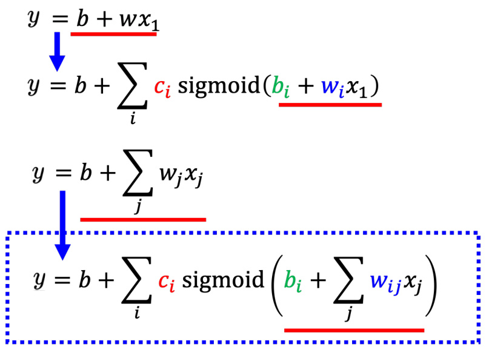  
图1.13 构建更有灵活性的函数  

> Q：优化是找一个可以让损失最小的参数，是否可以穷举所有可能的未知参数的值？
> A：只有 $w$ 跟 $b$ 两个参数的前提之下，可以穷举所有可能的 $w$ 跟 $b$ 的值，所以在参数很少的情况下。甚至可能不用梯度下降，不需要优化的技巧。但是参数非常多的时候，就不能使用穷举的方法，需要梯度下降来找出可以让损失最低的参数。  

> Q：刚才的例子里面有3 个Sigmoid，为什么是3 个，能不能4 个或更多？  
> A：Sigmoid 的数量是由自己决定的，而且Sigmoid 的数量越多，可以产生出来的分段线性函数就越复杂。Sigmoid 越多可以产生有越多段线的分段线性函数，可以逼近越复杂的函数。Sigmoid 的数量也是一个超参数。  

接下来要定义损失。之前是 $L(w,b)$ ，因为 $w$ 跟 $b$ 是未知的。现在未知的参数很多了，再把它一个一个列出来太累了，所以直接用 $\pmb{\theta}$ 来统设所有的参数，所以损失函数就变成 $L(\theta)$ 。损失函数能够判断 $\pmb{\theta}$ 的好坏，其计算方法跟刚才只有两个参数的时候是一样的。  

先给定 $\pmb{\theta}$ 的值，即某一组 $W,\boldsymbol{b},c^{\mathrm{T}},b$ 的值，再把一种特征 $\boldsymbol{x}$ 代进去，得到估测出来的 $y$ ，再计算一下跟真实的标签之间的误差 $e$ 。把所有的误差通通加起来，就得到损失。  

接下来下一步就是优化  

$$
\theta=\left[\begin{array}{c}{{\theta_{1}}}\\ {{\theta_{2}}}\\ {{\theta_{3}}}\\ {{\vdots}}\\ {{\theta_{4}}}\end{array}\right]
$$

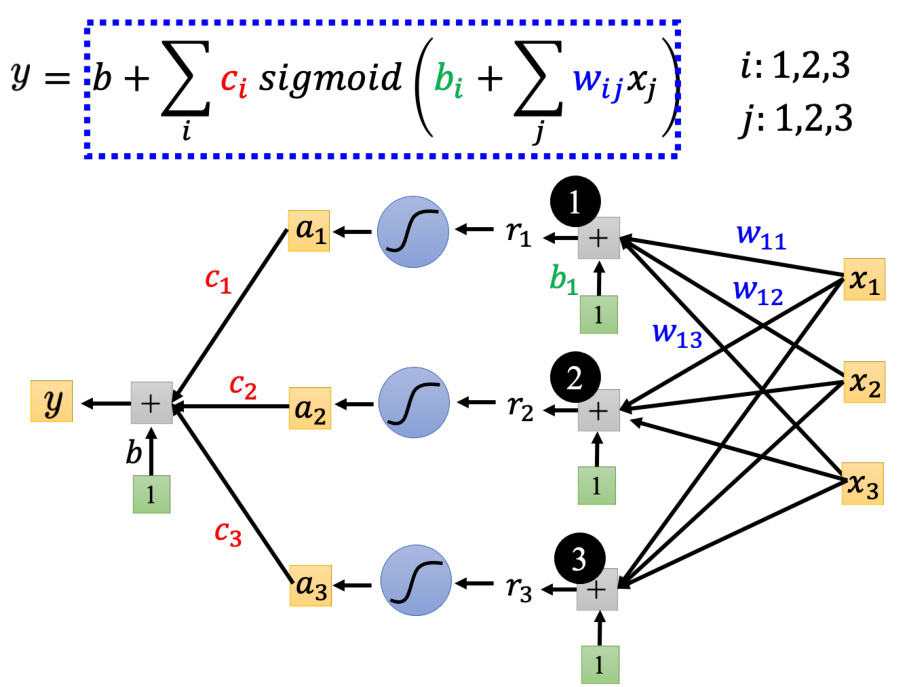  
图1.14 比较有灵活性函数的计算过程  

要找到 $\pmb{\theta}$ 让损失越小越好，可以让损失最小的一组 $\pmb{\theta}$ 称为 $\pmb{\theta}^{*}$ 。一开始要随机选一个初始的数值 $\pmb{\theta}^{0}$ 。接下来计算每一个未知的参数对 $L$ 的微分，得到向量 $\pmb{g}$ ，即可以让损失变低的函数  

$$
\pmb{g}=\nabla L\left(\pmb{\theta}^{0}\right)
$$

$$
g=\left[\begin{array}{c}{\dfrac{\partial L}{\partial\theta_{1}}\bigg|_{\theta=\theta^{0}}}\\ {\dfrac{\partial L}{\partial\theta_{2}}\bigg|_{\theta=\theta^{0}}}\\ {\vdots}\end{array}\right]
$$

假设有1000 个参数，这个向量的长度就是1000，这个向量也称为梯度， $\nabla L$ 代表梯度。$L(\pmb\theta^{0})$ 是指计算梯度的位置，是在 $\pmb{\theta}$ 等于 $\theta^{0}$ 的地方。计算出 $\pmb{g}$ 后，接下来更新参数， $\pmb{\theta}^{0}$ 代表它是一个起始的值，它是一个随机选的起始的值， $\theta^{1}$ 代表更新过一次的结果。 $\theta_{2}^{0}$ 减掉 $\eta$ 乘上微分的值，得到 $\theta_{2}^{1}$ ，以此类推，就可以把1000 个参数都更新了。  

$$
\left[\begin{array}{c}{\theta_{1}^{1}}\\ {\theta_{1}^{2}}\\ {\vdots}\end{array}\right]\leftarrow\left[\begin{array}{c}{\theta_{0}^{1}}\\ {\theta_{0}^{2}}\\ {\vdots}\end{array}\right]-\left[\begin{array}{c}{\eta\dfrac{\partial L}{\partial\theta_{1}}\Big|_{\theta=\theta_{0}}}\\ {\eta\dfrac{\partial L}{\partial\theta_{2}}\Big|_{\theta=\theta_{0}}}\\ {\vdots}\end{array}\right]
$$

$$
\pmb\theta^{1}\leftarrow\pmb\theta^{0}-\eta\pmb g
$$

假设参数有1000 个， $\pmb\theta^{0}$ 就是1000 个数值，1000 维的向量， $\pmb{g}$ 是1000 维的向量， $\theta^{1}$ 也是1000 维的向量。 整个操作就是这样，由 $\theta^{0}$ 算梯度，根据梯度去把 $\theta^{0}$ 更新成 $\theta^{1}$ ，再算一次梯度，再根据梯度把 $\theta^{1}$ 再更新成 $\theta^{2}$ ，再算一次梯度把 $\theta^{2}$ 更新成 $\theta^{3}$ ，以此类推，直到不想做。或者计算出梯度为0 向量，导致无法再更新参数为止，不过在实现上几乎不太可能梯度为0，通常会停下来就是我们不想做了。  

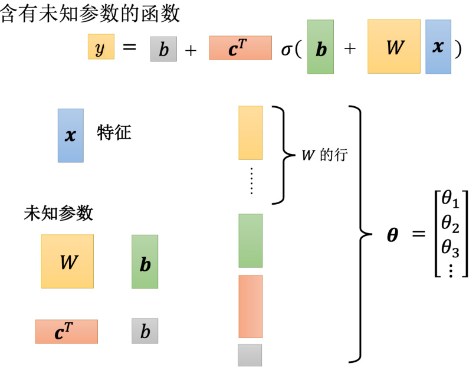  
图1.15 未知参数“拼”成一个向量  

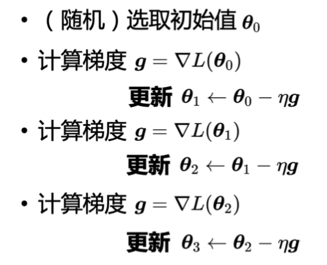
图1.16 使用梯度下降更新参数 ( $\theta$ 下标应改为上标)     

但实现上有个细节的问题，实际使用梯度下降的时候，如图1.17 所示，会把 $N$ 笔数据随机分成一个一个的批量（batch），一组一组的。每个批量里面有 $B$ 笔数据，所以本来有 $N$ 笔数据，现在 $B$ 笔数据一组，一组叫做批量。本来是把所有的数据拿出来算一个损失，现在只拿一个批量里面的数据出来算一个损失，记为 $L_{1}$ 跟 $L$ 以示区别。假设 $B$ 够大，也许 $L$ 跟$L_{1}$ 会很接近。所以实现上每次会先选一个批量，用该批量来算 $L_{1}$ ，根据 $L_{1}$ 来算梯度，再用梯度来更新参数，接下来再选下一个批量算出 $L_{2}$ ，根据 $L_{2}$ 算出梯度，再更新参数，再取下一个批量算出 $L_{3}$ ，根据 $L_{3}$ 算出梯度，再用 $L_{3}$ 算出来的梯度来更新参数。  

所以并不是拿 $L$ 来算梯度，实际上是拿一个批量算出来的 $L_{1},L_{2},L_{3}$ 来计算梯度。把所有的批量都看过一次，称为一个回合（epoch），每一次更新参数叫做一次更新。更新跟回合是不同的东西。每次更新一次参数叫做一次更新，把所有的批量都看过一遍，叫做一个回合。  

更新跟回合的差别，举个例子，假设有10000 笔数据，即 $N$ 等于10000，批量的大小是设10，也就 $B$ 等于10。10000 个样本（example）形成了1000 个批量，所以在一个回合里面更新了参数1000 次，所以一个回合并不是更新参数一次，在这个例子里面一个回合，已经  

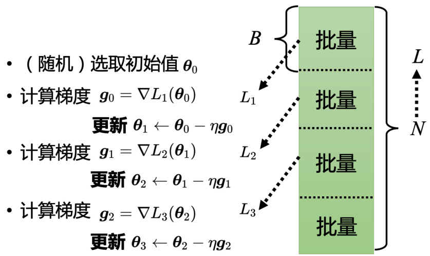  
图1.17 分批量进行梯度下降 ( $\theta$ 下标应改为上标)     

更新了参数1000 次了。  

第2 个例子，假设有1000 个数据，批量大小（batch size）设100，批量大小和Sigmoid的个数都是超参数。1000 个样本，批量大小设100，1 个回合总共更新10 次参数。所以做了一个回合的训练其实不知道它更新了几次参数，有可能1000 次，也有可能10 次，取决于它的批量大小有多大。  

### 1.2.2 模型变形  

其实还可以对模型做更多的变形，不一定要把Hard Sigmoid 换成Soft Sigmoid。HardSigmoid 可以看作是两个修正线性单元（Rectified Linear Unit，ReLU）的加总，ReLU 的图像有一个水平的线，走到某个地方有一个转折的点，变成一个斜坡，其对应的公式为  

$$
c*\operatorname*{max}(0,b+w x_{1})
$$

$\operatorname*{max}(0,b+w x_{1})$ 是指看0 跟 $b+w x_{1}$ 谁比较大，比较大的会被当做输出；如果 $b+w x_{1}<0$ ，输出是0；如果 $b+w x_{1}>0$ ，输出是 $b+w x_{1}$ 。通过 $w,b,c$ 可以挪动其位置和斜率。把两个ReLU 叠起来就可以变成Hard 的Sigmoid，想要用ReLU，就把Sigmoid 的地方，换成$\operatorname*{max}(0,b_{i}+w_{i j}x_{j})$ 。  

如图1.19 所示，2 个ReLU 才能够合成一个Hard Sigmoid。要合成 $i$ 个Hard Sigmoid，需要 $i$ 个Sigmoid，如果ReLU 要做到一样的事情，则需要 $2i$ 个ReLU，因为2 个ReLU 合起来才是一个Hard Sigmoid。因此表示一个Hard 的Sigmoid 不是只有一种做法。在机器学习里面，Sigmoid 或ReLU 称为激活函数（activation function）。  

当然还有其他常见的激活函数，但Sigmoid 跟ReLU 是最常见的激活函数，接下来的实验都选择用了ReLU，显然ReLU 比较好，实验结果如图1.20 所示。如果是线性模型，考虑56 天，训练数据上面的损失是320，没看过的数据2021 年数据是460。连续使用10 个ReLU作为模型，跟用线性模型的结果是差不多的，  

但连续使用100 个ReLU 作为模型，结果就有显著差别了，100 个ReLU 在训练数据上的损失就可以从320 降到280，有100 个ReLU 就可以制造比较复杂的曲线，本来线性就是一直线，但100 个ReLU 就可以产生100 个折线的函数，在测试数据上也好了一些. 接下来使用1000 个ReLU 作为模型，在训练数据上损失更低了一些，但是在没看过的数据上，损失没有变化。  

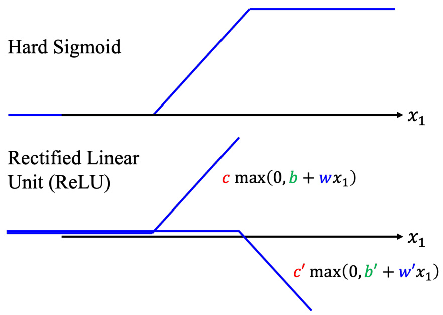  
图1.18 ReLU 函数  

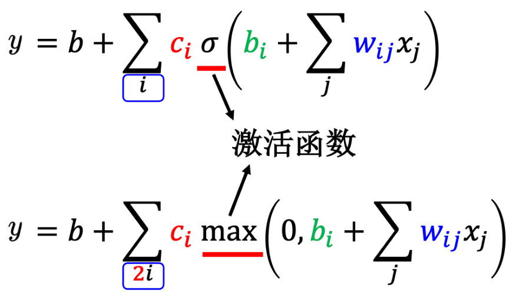  
图1.19 激活函数  

接下来可以继续改模型，如图1.21 所示，从 $x$ 变成 $a$ ，就是把 $x$ 乘上 $w$ 加 $b$ ，再通过Sigmoid 函数。不一定要通过Sigmoid 函数，通过ReLU 也可以得到 $a$ ，同样的事情再反复地多做几次。 所以可以把 $x$ 做这一连串的运算产生 $a$ ，接下来把 $a$ 做这一连串的运算产生 $a^{\prime}$ 。反复地多做的次数又是另外一个超参数。注意， $w,b$ 和 $w^{\prime},b^{\prime}$ 不是同一个参数，是增加了更多的未知的参数。  

每次都加100 个ReLU，输入特征，就是56 天前的数据。如图1.22 所示，如果做两次，损失降低很多，280 降到180。如果做3 次，损失从180 降到140，通过3 次ReLU，从280降到140，在训练数据上，在没看过的数据上，从430 降到了380。  

通过3 次ReLU 的实验结果如图1.23 所示。横轴就是时间，纵轴是观看次数。红色的线是真实的数据，蓝色的线是预测出来的数据在这种低点的地方啊，看红色的数据是每隔一段时间，就会有两天的低点，在低点的地方，机器的预测还算是蛮准确的，机器高估了真实的观看人次，尤其是在红圈标注的这一天，这一天有一个很明显的低谷，但是机器没有预测到这一天有明显的低谷，它是晚一天才预测出低谷。这天最低点就是除夕。但机器只知道看前56 天的值，来预测下一天会发生什么事，所以它不知道那一天是除夕。  

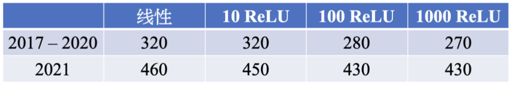
图1.20 激活函数实验结果

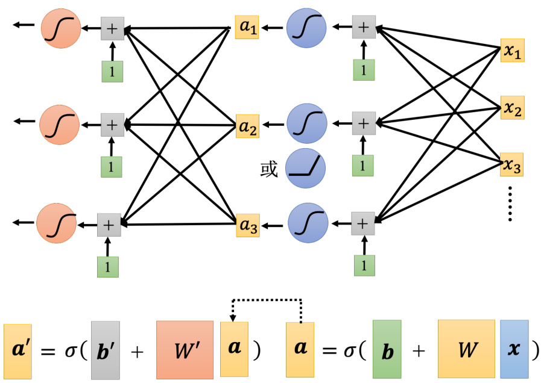  
图1.21 改进模型  

如图1.24 所示，Sigmoid 或ReLU 称为神经元（neuron），很多的神经元称为神经网络（neural network）。人脑中就是有很多神经元，很多神经元串起来就是一个神经网络，跟人脑是一样的。人工智能就是在模拟人脑。神经网络不是新的技术，80、90 年代就已经用过了，后来为了要重振神经网络的雄风，所以需要新的名字。每一排称为一层，称为隐藏层（hiddenlayer），很多的隐藏层就“深”，这套技术称为深度学习。  

所以人们把神经网络越叠越多越叠越深，2012 年的AlexNet 有8 层它的错误率是 $16.4\%$ ，两年之后VGG 有19 层，错误率在图像识别上进步到 $7.3\ \%$ 。这都是在图像识别上一个基准的数据库（ImageNet）上面的结果，后来GoogleNet 有22 层，错误率降到 $6.7\%$ 。而残差网络（Residual Network，ResNet）有152 层，错误率降到 $3.57\%$ 。  

刚才只做到3 层，应该要做得更深，现在网络都是叠几百层的，深度学习就要做更深。但4 层在训练数据上，损失是100，在2021 年的数据上，损失是440。在训练数据上，3 层比4层差，但是在没看过的数据上，4 层比较差，3 层比较好，如图1.25 所示。在训练数据和测试数据上的结果是不一致的，这种情况称为过拟合（overfitting）。  

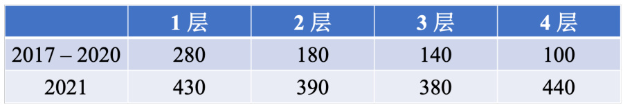  
图1.22 使用ReLU 的实验结果  

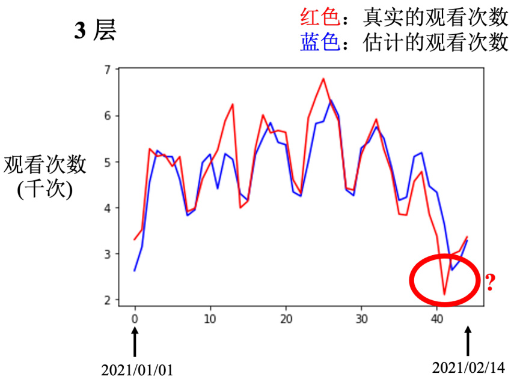  
图1.23 使用3 次ReLU 的实验结果  

但是做到目前为止，还没有真的发挥这个模型的力量，2021 年的数据到2 月14 日之前的数据是已知的。要预测未知的数据，选3 层的网络还是4 层的网络呢？假设今天是2 月26日，今天的观看次数是未知的，如果用已经训练出来的神经网络预测今天的观看次数。要选3 层的，虽然4 层在训练数据上的结果比较好，但在测试数据的结果更重要。应该选一个在训练的时候，测试的数据上表现会好的模型，所以应该选3 层的网络。深度学习的训练会用到反向传播（BackPropagation，BP），其实它就是比较有效率、算梯度的方法。  

### 1.2.3 机器学习框架  

我们会有一堆训练的数据以及测试数据如式(1.30) 所示，测试集就是只有 $x$ 没有 $y$ 。  

训练集就要拿来训练模型，训练的过程是3 个步骤。  

1. 先写出一个有未知数 $\pmb{\theta}$ 的函数， $\pmb{\theta}$ 代表一个模型里面所有的未知参数。 $f_{\theta}(x)$ 的意思就是函数叫 $f_{\boldsymbol\theta}(\boldsymbol x)$ ，输入的特征为 $x$ ；  

2. 定义损失，损失是一个函数，其输入就是一组参数，去判断这一组参数的好坏；  

3. 解一个优化的问题，找一个 $\pmb{\theta}$ ，该 $\pmb{\theta}$ 可以让损失的值越小越好。让损失的值最小的 $\pmb{\theta}$ 为$\pmb{\theta}^{*}$ ，即  

$$
\theta^{*}=\arg\operatorname*{min}_{\theta}L
$$

有了 $\pmb{\theta}^{*}$ 以后，就把它拿来用在测试集上，也就是把 $\pmb{\theta}^{*}$ 带入这些未知的参数，本来 $f_{\theta}(x)$ 里面有一些未知的参数，现在 $\pmb{\theta}$ 用 $\pmb{\theta}^{*}$ 来取代，输入是测试集，输出的结果存起来，上传到Kaggle 就结束了。  

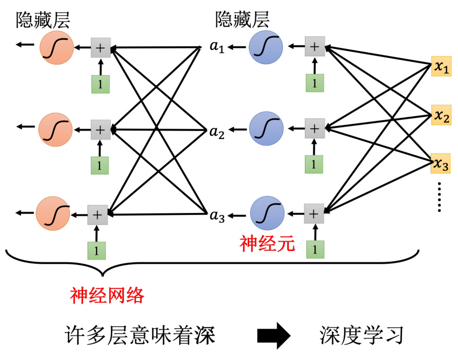  
图1.24 深度学习的结构  

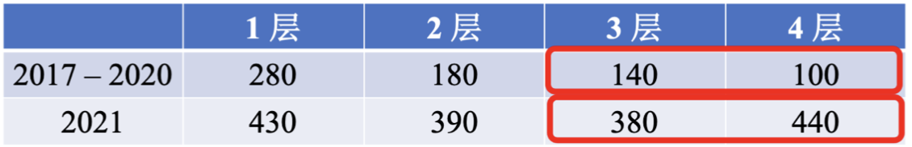
图1.25 模型有过拟合问题 
