# 第4 章 卷积神经网络  

我们从卷积神经网络开始，探讨网络的架构设计。卷积神经网络是一种非常典型的网络架构，常用于图像分类等任务。通过卷积神经网络，我们可以知道网络架构如何设计，以及为什么合理的网络架构可以优化网络的表现。  

所谓图像分类，就是给机器一张图像，由机器去判断这张图像里面有什么样的东西——是猫还是狗、是飞机还是汽车。怎么把图像当做模型的输入呢？对于机器，图像可以描述为三维张量（张量可以想成维度大于2 的矩阵）。一张图像是一个三维的张量，其中一维代表图像的宽，另外一维代表图像的高，还有一维代表图像的通道（channel）的数目。  

> Q：什么是通道？  

> A：彩色图像的每个像素都可以描述为红色（red）、绿色（green）、蓝色（blue）的组合，这3 种颜色就称为图像的3 个色彩通道。这种颜色描述方式称为RGB 色彩模型，常用于在屏幕上显示颜色。  

网络的输入往往是向量，因此，将代表图像的三维张量“丢”到网络里之前，需要先将它“拉直”，如图4.1 所示。在这个例子里面，张量有 $100\times100\times3$ 个数字，所以一张图像是由$100\times100\times3$ 个数字所组成的，把这些数字排成一排就是一个巨大的向量。这个向量可以作为网络的输入，而这个向量里面每一维里面存的数值是某一个像素在某一个通道下的颜色强度。  

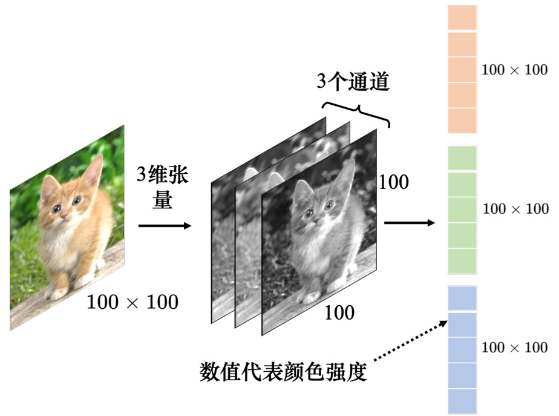  
图4.1 把图像作为模型输入  

图像有大有小，而且不是所有图像尺寸都是一样的。常见的处理方式是把所有图像先调整成相同尺寸，再“丢”到图像的识别系统里面。以下的讨论中，默认模型输入的图像尺寸固定为100像素 $\times\,100$ 像素。

如图4.2 所示，如果把向量当做全连接网络的输入，输入的特征向量（feature vector）的长度就是 $100\times100\times3$ 。这是一个非常长的向量。由于每个神经元跟输入的向量中的每个数值都需要一个权重，所以当输入的向量长度是 $100\times100\times3$ ，且第1 层有1000 个神经元时，第1 层的权重就需要 $1000\times100\times100\times3=3\times10^{7}$ 个权重，这是一个非常巨大的数目。更多的参数为模型带来了更好的弹性和更强的能力，但也增加了过拟合的风险。模型的弹性越大，就越容易过拟合。为了避免过拟合，在做图像识别的时候，考虑到图像本身的特性，并不一定需要全连接，即不需要每个神经元跟输入的每个维度都有一个权重。接下来就是针对图像识别这个任务，对图像本身特性进行一些观察。  

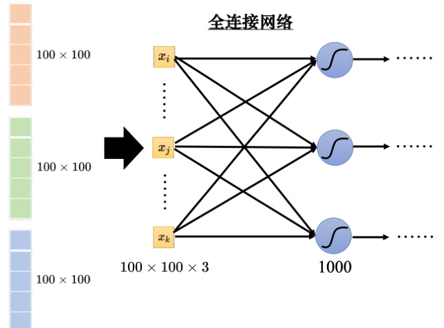  
图4.2 全连接网络  

模型的输出应该是什么呢？模型的目标是分类，因此可将不同的分类结果表示成不同的独热向量 $y^{\prime}$ 。在这个独热向量里面，类别对应的值为1，其余类别对应的值为0。例如，我们规定向量中的某些维度代表狗、猫、树等分类结果，那么若分类结果为猫，则猫所对应的维度的数值就是1，其他东西所对应的维度的数值就是0，如图4.3 所示。独热向量 $y^{\prime}$ 的长度决定了模型可以识别出多少不同种类的东西。如果向量的长度是5，代表模型可以识别出5 种不同的东西。现在比较强的图像识别系统往往可以识别出1000 种以上，甚至上万种不同的东西。如果希望图像识别系统可以识别上万种目标，标签就会是维度上万的独热向量。模型的输出通过softmax 以后，输出是 $\hat{y}$ 。我们希望 $y^{\prime}$ 和 $\hat{y}$ 的交叉熵越小越好。  

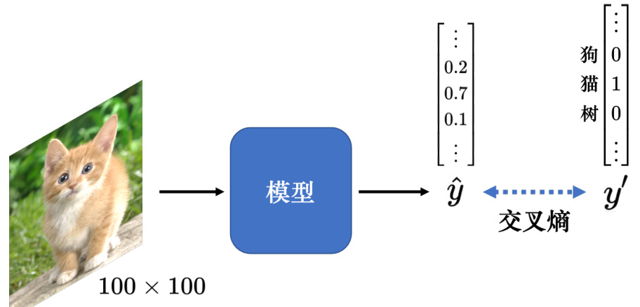  
图4.3 图像分类  

## 4.1 观察1：检测模式不需要整张图像  

假设我们的任务是让网络识别出图像的动物。对一个图像识别的类神经网络里面的神经元而言，它要做的就是检测图像里面有没有出现一些特别重要的模式（pattern），这些模式是代表了某种物体的。比如有三个神经元分别看到鸟嘴、眼睛、鸟爪3 个模式，这就代表类神经网络看到了一只鸟，如图4.4 所示。  

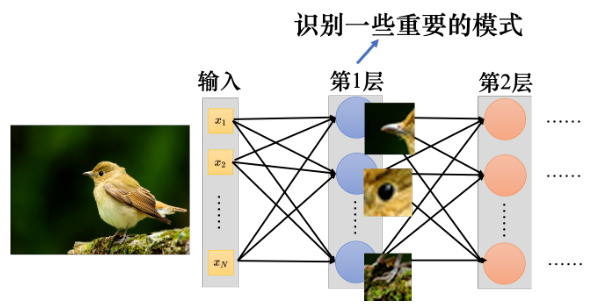  
图4.4 使用神经网络来检测模式  

人在判断一个物体的时候，往往也是抓最重要的特征。看到这些特征以后，就会直觉地看到了某种物体。对于机器，也许这是一个有效的判断图像中物体的方法。但假设用神经元来判断某种模式是否出现，也许并不需要每个神经元都去看一张完整的图像。因为并不需要看整张完整的图像才能判断重要的模式（比如鸟嘴、眼睛、鸟爪）是否出现，如图4.5 所示，要知道图像有没有一个鸟嘴，只要看非常小的范围。这些神经元不需要把整张图像当作输入，只需要把图像的一小部分当作输入，就足以让它们检测某些特别关键的模式是否出现，这是第1 个观察。  

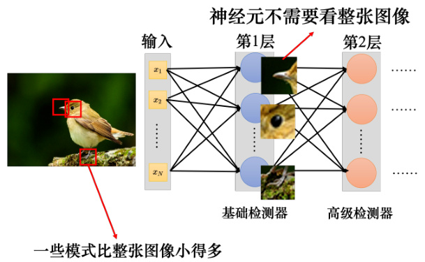  
图4.5 检测模式不需要整张图像  

## 4.2 简化1：感受野  

根据观察1 可以做第1 个简化，卷积神经网络会设定一个区域，即感受野（receptivefield），每个神经元都只关心自己的感受野里面发生的事情，感受野是由我们自己决定的。比如在图4.6 中，蓝色的神经元的守备范围就是红色正方体框的感受野。这个感受野里面有$3\times3\times3$ 个数值。对蓝色的神经元，它只需要关心这个小范围，不需要在意整张图像里面有什么东西，只在意它自己的感受野里面发生的事情就好。这个神经元会把 $3\times3\times3$ 的数值“拉直”变成一个长度是 $3\times3\times3{=}27$ 维的向量，再把这27 维的向量作为神经元的输入，这个神经元会给27 维的向量的每个维度一个权重，所以这个神经元有 $3\times3\times3=27$ 个权重，再加上偏置（bias）得到输出。这个输出再送给下一层的神经元当作输入。  

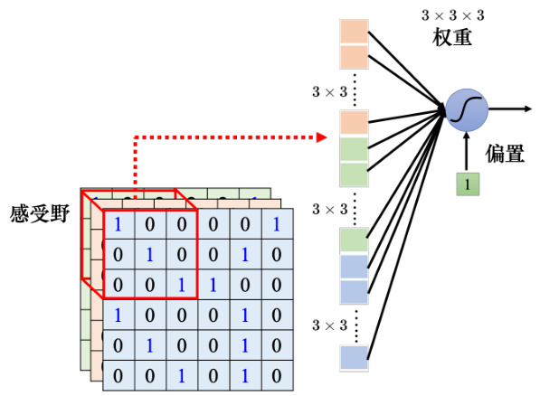  
图4.6 感受野  

如图4.7 所示，蓝色的神经元看左上角这个范围，这是它的感受野。黄色的神经元看右下角 $3\times3\times3$ 的范围。图4.7 中的一个正方形代表 $3\times3\times3$ 的范围，右下角的正方形是黄色神经元的感受野。感受野彼此之间也可以是重叠的，比如绿色的神经元的感受野跟蓝色的、黄色的神经元都有一些重叠的空间。我们没有办法检测所有的模式，所以同个范围可以有多个不同的神经元，即多个神经元可以去守备同一个感受野。接下来我们讨论下如何设计感受野。  

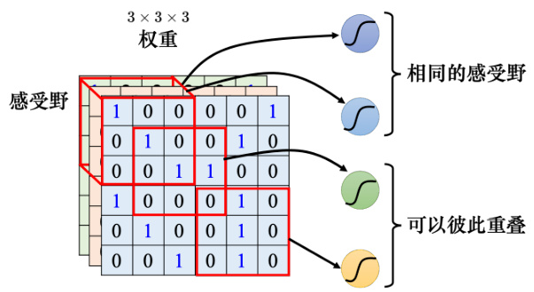  
图4.7 感受野彼此重叠  

感受野可以有大有小，因为模式有的比较小，有的比较大。有的模式也许在 $3\times3$ 的范围内就可以被检测出来，有的模式也许要 $11\times11$ 的范围才能被检测出来。此外，感受野可以只考虑某些通道。目前感受野是RGB 三个通道都考虑，但也许有些模式只在红色或蓝色的通道会出现，即有的神经元可以只考虑一个通道。之后在讲到网络压缩的时候，会讲到这种网络的架构。感受野不仅可以是正方形的，例如刚才举的例子里面 $3\times3$ 、 $11\times11$ ，也可以是长方形的，完全可以根据对问题的理解来设计感受野。虽然感受野可以任意设计，但下面要跟大家讲一下最经典的感受野安排方式。  

> Q：感受野一定要相连吗？  

> A：感受野的范围不一定要相连，理论上可以有一个神经元的感受野就是图像的左上角跟右上角。但是就要想想为什么要这么做，会不会有什么模式也要看一个图像的左上角跟右下角才能够找到。如果没有，这种感受野就没什么用。要检测一个模式，这个模式就出现在整个图像里面的某一个位置，而不是分成好几部分，出现在图像里面的不同的位置。所以通常的感受野都是相连的领地，但如果要设计很奇怪的感受野去解决很特别的问题，完全是可以的，这都是自己决定的。  

一般在做图像识别的时候，可能不会觉得有些模式只出现在某一个通道里面，所以会看全部的通道。既然会看全部的通道，那么在描述一个感受野的时候，只要讲它的高跟宽，不用讲它的深度，因为它的深度就等于通道数，而高跟宽合起来叫做核大小。图4.8 中的核大小就是 $3\times3$ 。在图像识别里面，一般核大小不会设太大， $3\times3$ 的核大小就足够了， $7\times7,\ 9\times9$ 算是蛮大的核大小。如果核大小都是 $3\times3$ ，意味着我们觉得在做图像识别的时候，重要的模式都只在 $3\times3$ 这么小的范围内就可以被检测出来了。但有些模式也许很大，也许 $3\times3$ 的范围没办法检测出来，后面我们会再回答这个问题。常见的感受野设定方式就是核大小为 $3\times3$ 。  

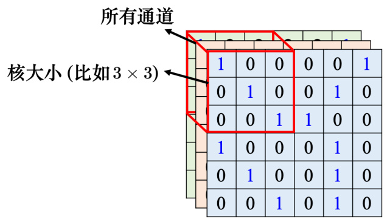  
图4.8 卷积核  

一般同一个感受野会有一组神经元去守备这个范围，比如64 个或者是128 个神经元去守备一个感受野的范围。目前为止，讲的都是一个感受野，接下来介绍下各个不同感受野之间的关系。我们把左上角的感受野往右移一个步幅，就制造出一个新的守备范围，即新的感受野。移动的量称为步幅（stride），图4.9 中的这个例子里面，步幅就等于2。步幅是一个超参数，需要人为调整。因为希望感受野跟感受野之间是有重叠的，所以步幅往往不会设太大，一般设为1 或2。  

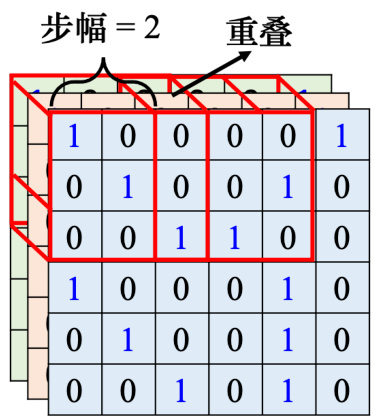  
图4.9 步幅  

> Q：为什么希望感受野之间是有重叠的呢？  

> A：因为假设感受野完全没有重叠，如果有一个模式正好出现在两个感受野的交界上面，就没有任何神经元去检测它，这个模式可能会丢失，所以希望感受野彼此之间有高度的重叠。如令步幅 $=2$ ，感受野就会重叠。  

接下来需要考虑一个问题：感受野超出了图像的范围，怎么办呢？如果不在超过图像的范围“摆”感受野，就没有神经元去检测出现在边界的模式，这样就会漏掉图像边界的地方，所以一般边界的地方也会考虑的。如图4.10 所示，超出范围就做填充（padding），填充就是补值，一般使用零填充（zero padding），超出范围就补0，如果感受野有一部分超出图像的范围之外，就当做那个里面的值都是0。其实也有别的补值的方法，比如补整张图像里面所有值的平均值或者把边界的这些数字拿出来补没有值的地方。  

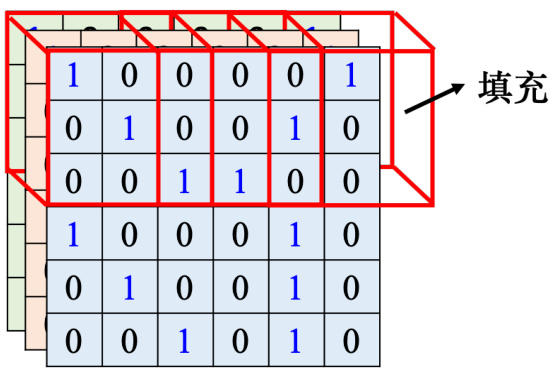  
图4.10 填充  

除了水平方向的移动，也会有垂直方向上的移动，垂直方向步幅也是设2，如图4.11 所示。我们就按照这个方式扫过整张图像，所以整张图像里面每一寸土地都是有被某一个感受野覆盖的。也就是图像里面每个位置都有一群神经元在检测那个地方，有没有出现某些模式。这个是第1 个简化。  

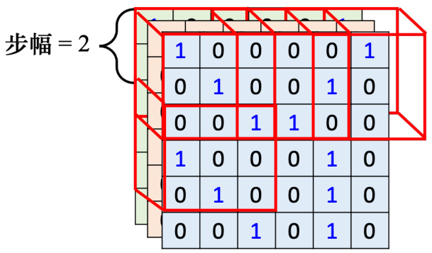  
图4.11 垂直移动  

## 4.3 观察2：同样的模式可能会出现在图像的不同区域  

第2 个观察是同样的模式，可能会出现在图像的不同区域。比如说模式鸟嘴，它可能出现在图像的左上角，也可能出现在图像的中间，同样的模式出现在图像的不同的位置也不是太大的问题。如图4.12 所示，因为出现在左上角的鸟嘴，它一定落在某一个感受野里面。因为感受野是盖满整个图像的，所以图像里面所有地方都在某个神经元的守备范围内。假设在某个感受野里面，有一个神经元的工作就是检测鸟嘴，鸟嘴就会被检测出来。所以就算鸟嘴出现在中间也没有关系。假设其中有一个神经元可以检测鸟嘴，鸟嘴出现在图像的中间也会被检测出来。但这些检测鸟嘴的神经元做的事情是一样的，只是它们守备的范围不一样。既然如此，其实没必要每个守备范围都去放一个检测鸟嘴的神经元。如果不同的守备范围都要有一个检测鸟嘴的神经元，参数量会太多了，因此需要做出相应的简化。  

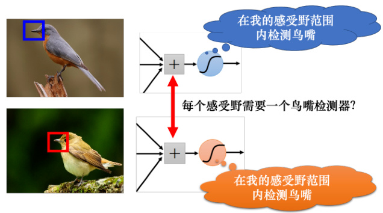  
图4.12 每个感受野都放一个鸟嘴检测器  

## 4.4 简化2：共享参数  

在提出简化技巧前，我们先举个类似的例子。这个概念就类似于教务处希望可以推大型的课程一样，假设每个院系都需要深度学习相关的课程，没必要在每个院系都开机器学习的课程，可以开一个比较大型的课程，让所有院系的人都可以修课。如果放在图像处理上，则可以让不同感受野的神经元共享参数，也就是做参数共享（parameter sharing），如图4.13 所示。所谓参数共享就是两个神经元的权重完全是一样的。  

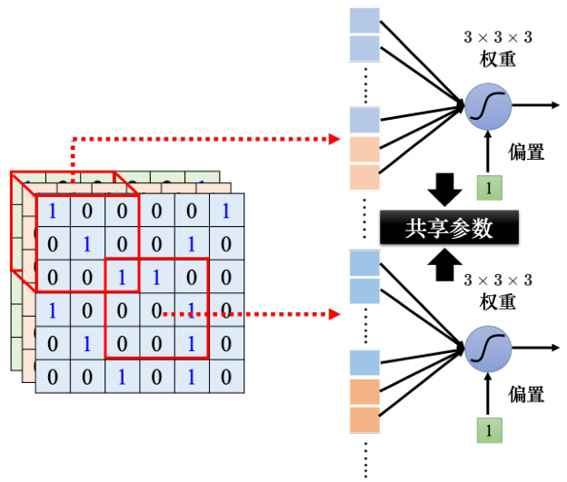  
图4.13 共享参数  

如图4.14 所示，颜色相同，权重完全是一样的，比如上面神经元的第1 个权重是 $w_{1}$ ，下面神经元的第1 个权重也是 $w_{1}$ ，它们是同一个权重，用同一种颜色黄色来表示。上面神经元跟下面神经元守备的感受野是不一样的，但是它们的参数是相同的。虽然两个神经元的参数是一模一样，但它们的输出不会永远都是一样的，因为它们的输入是不一样的，它们照顾的范围是不一样的。上面神经元的输入是 $x_{1},x_{2},\cdot\cdot\cdot\cdot\cdot$ ，下面神经元的输入是 $x_{1}^{\prime},x_{2}^{\prime},\cdots\cdots$ 。上面神经元的输出为  

$$
\sigma\left(w_{1}x_{1}+w_{2}x_{2}+\cdot\cdot\cdot\cdot\cdot+1\right)
$$

下面神经元的输出为  

$$
\sigma\left(w_{1}x_{1}^{\prime}+w_{2}x_{2}^{\prime}+\cdot\cdot\cdot\cdot\cdot+1\right)
$$

因为输入不一样的关系，所以就算是两个神经元共用参数，它们的输出也不会是一样的。所以这是第2 个简化，让一些神经元可以共享参数，共享的方式完全可以自己决定。接下来将介绍图像识别方面，常见的共享方法是如何设定的。  

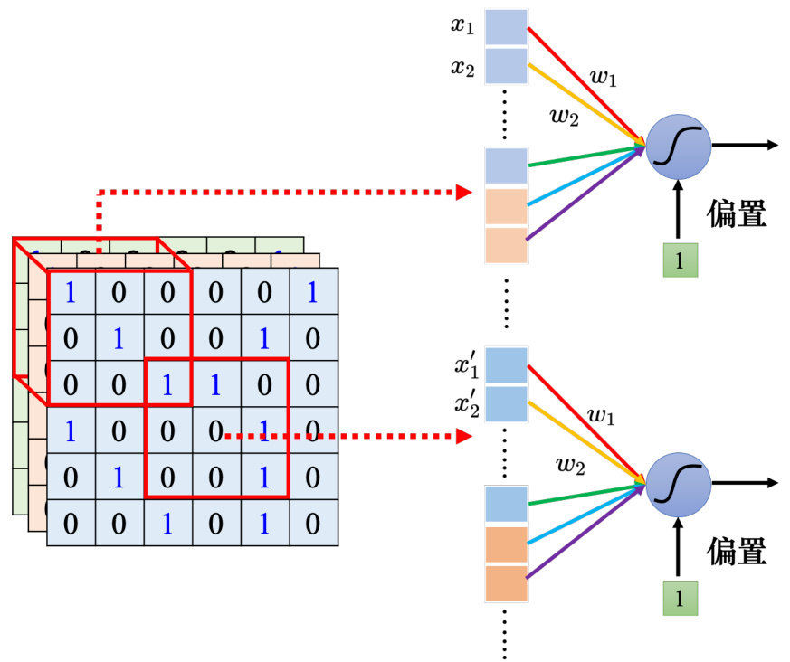  
图4.14 两个神经元共享参数  

如图4.15 所示，每个感受野都有一组神经元在负责守备，比如64 个神经元，它们彼此之间可以共享参数。图4.16 中使用一样的颜色代表这两个神经元共享一样的参数，所以每个感受野都只有一组参数，就是上面感受野的第1 个神经元会跟下面感受野的第1 个神经元共用参数，上面感受野的第2 个神经元跟下面感受野的第2 个神经元共用参数· · · · · · 所以每个感受野都只有一组参数而已，这些参数称为滤波器（filter）。这是第2 个简化的方法。  

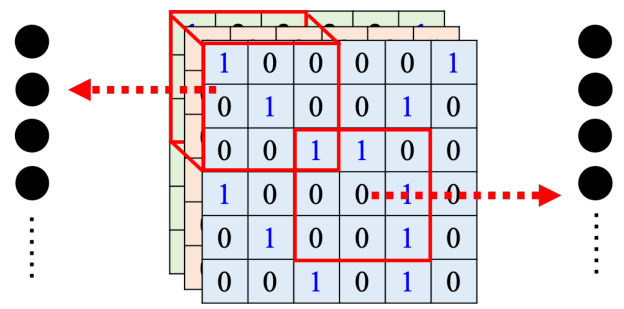  
图4.15 守备感受野的神经元  

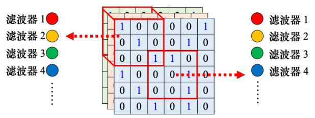  
图4.16 多个神经元共享参数  

## 4.5 简化1 和2 的总结  

目前已经讲了两个简化的方法，我们来总结下。如图4.17 所示，全连接网络是弹性最大的。全连接网络可以决定它看整张图像还是只看一个范围，如果它只想看一个范围，可以把很多权重设成0。全连接层（fully-connected layer，）可以自己决定看整张图像还是一个小范围。但加上感受野的概念以后，只能看一个小范围，网络的弹性是变小的。参数共享又进一步限制了网络的弹性。本来在学习的时候，每个神经元可以各自有不同的参数，它们可以学出相同的参数，也可以有不一样的参数。但是加入参数共享以后，某一些神经元无论如何参数都要一模一样的，这又增加了对神经元的限制。而感受野加上参数共享就是卷积层（convolutional layer），用到卷积层的网络就叫卷积神经网络。卷积神经网络的偏差比较大。但模型偏差大不一定是坏事，因为当模型偏差大，模型的灵活性较低时，比较不容易过拟合。全连接层可以做各式各样的事情，它可以有各式各样的变化，但它可能没有办法在任何特定的任务上做好。而卷积层是专门为图像设计的，感受野、参数共享都是为图像设计的。虽然卷积神经网络模型偏差很大，但用在图像上不是问题。如果把它用在图像之外的任务，就要仔细想想这些任务有没有图像用的特性。  

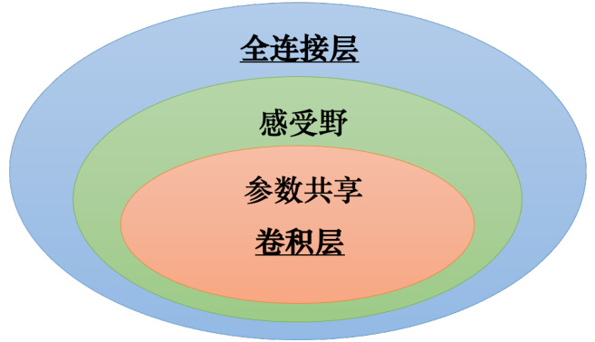  
图4.17 卷积层与全连接层的关系  

接下来通过第2个版本的故事来说明卷积神经网络。如图4.18 所示，卷积层里面有很多滤波器，这些滤波器的大小是 $3\times3\times$ 通道。如果图像是彩色的，它有RGB 三个通道。如果是黑白的图像，它的通道就等于1。一个卷积层里面就是有一排的滤波器，每个滤波器都是一个 $3\times3\times$ 通道，其作用是要去图像里面检测某个模式。这些模式要在 $3\times3\times$ 通道，这个小的范围内，它才能够被这些滤波器检测出来。举个例子，假设通道为1，也就是图像是黑白的。  

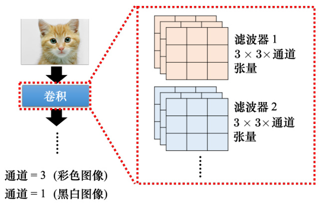  
图4.18 卷积层中的滤波器 

滤波器就是一个一个的张量，这些张量里面的数值就是模型里面的参数。这些滤波器里面的数值其实是未知的，它是可以通过学习找出来的。假设这些滤波器里面的数值已经找出来了，如图4.19 所示。如图4.20 所示，这是一个 $6\times6$ 的大小的图像。先把滤波器放在图像的左上角，接着把滤波器里面所有的9 个值跟左上角这个范围内的9 个值对应相乘再相加，也就是做内积，结果是3。接下来设置好步幅，然后把滤波器往右移或往下移，重复几次，可得到模式检测的结果，图4.20 中的步幅为1。使用滤波器1 检测模式时，如果出现图像 $3\times3$ 范围内对角线都是1 这种模式的时候，输出的数值会最大。输出里面左上角和左下角的值最大，所以左上角和左下角有出现对角线都是1 的模式，这是第1 个滤波器。  
 
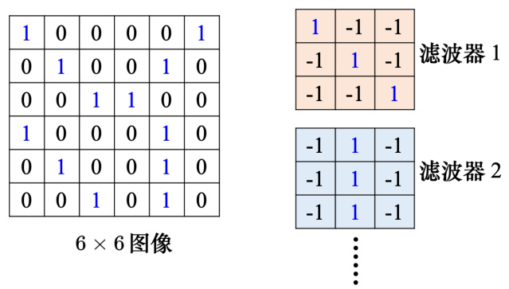  
图4.19 滤波器示例  

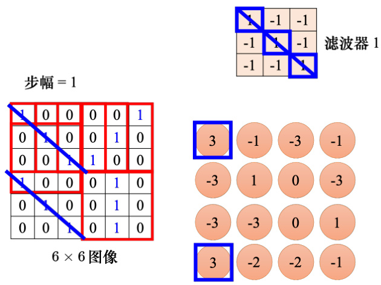  
图4.20 使用滤波器检测模式 

如图4.21 所示，接下来把每个滤波器都做重复的过程。比如说有第2 个滤波器，它用来检测图像 $3\times3$ 范围内中间一列都为1 的模式。把第2 个滤波器先从左上角开始扫起，得到一个数值，往右移一个步幅，再得到一个数值再往右移一个步幅，再得到一个数值。重复同样的操作，直到把整张图像都扫完，就得到另外一组数值。每个滤波器都会给我们一组数字，红色的滤波器给我们一组数字，蓝色的滤波器给我们另外一组数字。如果有64 个滤波器，就可以得到64 组的数字。这组数字称为特征映射（feature map）。当一张图像通过一个卷积层里面一堆滤波器的时候，就会产生一个特征映射。假设卷积层里面有64 个滤波器，产生的特征映射就有64 组数字。在上述例子中每一组是 $4\times4$ ，即第1 个滤波器产生 $4\times4$ 个数字，第2 个滤波器也产生 $4\times4$ 个数字，第3 个也产生 $4\times4$ 个数字，64 个滤波器都产生 $4\times4$ 个数字。特征映射可以看成是另外一张新的图像，只是这个图像的通道不是RGB 3 个通道，有64 个通道，每个通道就对应到一个滤波器。本来一张图像有3 个通道，通过一个卷积变成一张新的有64 个通道图像。  

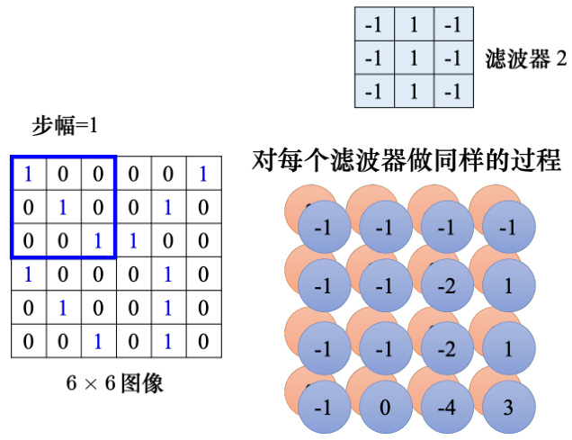  
图4.21 使用多个滤波器检测模式  

卷积层是可以叠很多层的，如图4.22 所示，第2 层的卷积里面也有一堆的滤波器，每个滤波器的大小设成 $3\times3$ 。其高度必须设为64，因为滤波器的高度就是它要处理的图像的通道。如果输入的图像是黑白的，通道是1，滤波器的高度就是1。如果输入的图像是彩色的，通道为3，滤波器的高度就是3。对于第2 个卷积层，它的输入也是一张图像，这个图像的通道是64。这个64 是前一个卷积层的滤波器数目，前一个卷积层的滤波器数目是64，输出以后就是64 个通道。所以如果第2 层想要把这个图像当做输入，滤波器的高度必须是64。所以第2 层也有一组滤波器，只是这组滤波器的高度是64。  

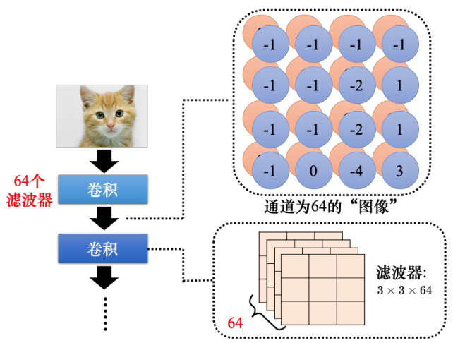  
图4.22 对图像进行卷积  

> Q：如果滤波器的大小一直设 $3\times3$ ，会不会让网络没有办法看比较大范围的模式呢？> A：不会。如图4.23 所示，如果在第2 层卷积层滤波器的大小一样设 $3\times3$ ，当我们看第1 个卷积层输出的特征映射的 $3\times3$ 的范围的时候，在原来的图像上是考虑了一个$5\times5$ 的范围。虽然滤波器只有 $3\times3$ ，但它在图像上考虑的范围是比较大的是 $5\times5$ 。因此网络叠得越深，同样是 $3\times3$ 的大小的滤波器，它看的范围就会越来越大。所以网络够深，不用怕检测不到比较大的模式。  

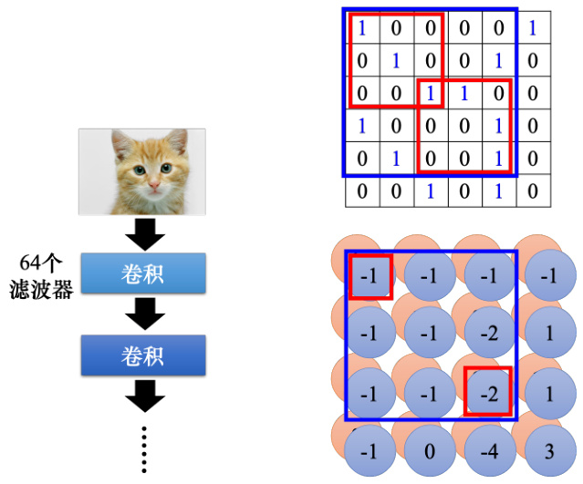  
图4.23 网络越深，可以检测的模式越大  

刚才讲了两个版本的故事，这两个版本的故事是一模一样的。第1个版本的故事里面说到了有一些神经元，这些神经元会共用参数，这些共用的参数就是第2 个版本的故事里面的滤波器。如图4.24 所示，这组参数有 $3\times3\times3$ 个，即滤波器里面有 $3\times3\times3$ 个数字，这边特别还用颜色把这些数字圈起来，权重就是这些数字。为了简化，这边去掉了偏置。神经元是有偏置的，滤波器也是有偏置的。在一般的实践上，卷积神经网络的滤波器都是有偏置的。  

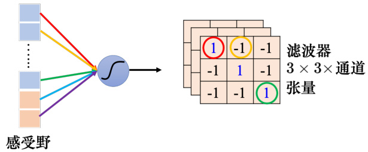  
图4.24 共享参数示例  

如图4.25 所示，在第1个版本的故事里面，不同的神经元可以共享权重，去守备不同的范围。而共享权重其实就是用滤波器扫过一张图像，这个过程就是卷积。这就是卷积层名字的由来。把滤波器扫过图像就相当于不同的感受野神经元可以共用参数，这组共用的参数就叫做一个滤波器。  

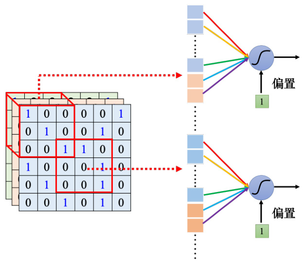  
图4.25 从不同的角度理解参数共享  

## 4.6 观察3：下采样不影响模式检测  

第3 个观察是下采样不影响模式检测。把一张比较大的图像做下采样（downsampling），把图像偶数的列都拿掉，奇数的行都拿掉，图像变成为原来的 $1/4$ ，但是不会影响里面是什么东西。如图4.26 所示，把一张大的鸟的图像缩小，这张小的图像还是一只鸟。  

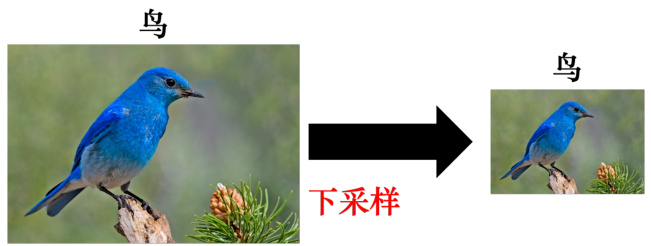  
图4.26 下采样示意 

## 4.7 简化3：汇聚  

根据第3 个观察，汇聚被用到了图像识别中。汇聚没有参数，所以它不是一个层，它里面没有权重，它没有要学习的东西，汇聚比较像Sigmoid、ReLU 等激活函数。因为它里面是没有要学习的参数的，它就是一个操作符（operator），其行为都是固定好的，不需要根据数据学任何东西。每个滤波器都产生一组数字，要做汇聚的时候，把这些数字分组，可以 $2\times2$ 个一组， $3\times3$ 、 $4\times4$ 也可以，这个是我们自己决定的，图4.27 中的例子是 $2\times2$ 个一组。汇聚有很多不同的版本，以最大汇聚（max pooling）为例。最大汇聚在每一组里面选一个代表，选的代表就是最大的一个，如图4.28 所示。除了最大汇聚，还有平均汇聚（mean pooling），平均汇聚是取每一组的平均值。  

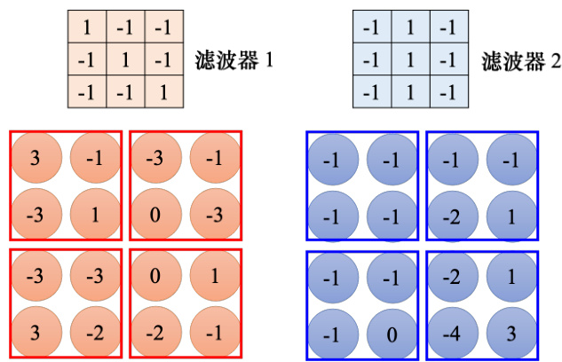  
图4.27 最大汇聚示例  

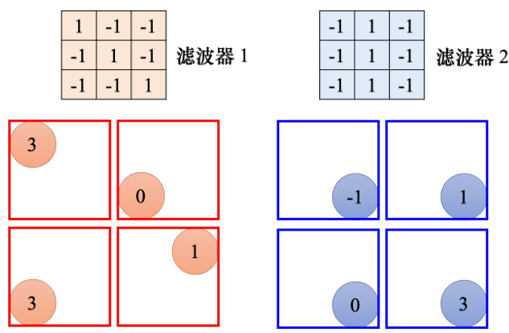  
图4.28 最大汇聚结果  

做完卷积以后，往往后面还会搭配汇聚。汇聚就是把图像变小。做完卷积以后会得到一张图像，这张图像里面有很多的通道。做完汇聚以后，这张图像的通道不变。如图4.29 所示，在刚才的例子里面，本来 $4\times4$ 的图像，如果把这个输出的数值 $2\times2$ 个一组， $4\times4$ 的图像就会变成 $2\times2$ 的图像，这就是汇聚所做的事情。一般在实践上，往往就是卷积跟汇聚交替使用，可能做几次卷积，做一次汇聚。比如两次卷积，一次汇聚。不过汇聚对于模型的性能（performance）可能会带来一点伤害。假设要检测的是非常微细的东西，随便做下采样，性能可能会稍微差一点。所以近年来图像的网络的设计往往也开始把汇聚丢掉，它会做这种全卷积的神经网络，整个网络里面都是卷积，完全都不用汇聚。汇聚最主要的作用是减少运算量，通过下采样把图像变小，从而减少运算量。随着近年来运算能力越来越强，如果运算资源足够支撑不做汇聚，很多网络的架构的设计往往就不做汇聚，而是使用全卷积，卷积从头到尾，看看做不做得起来，看看能不能做得更好。   

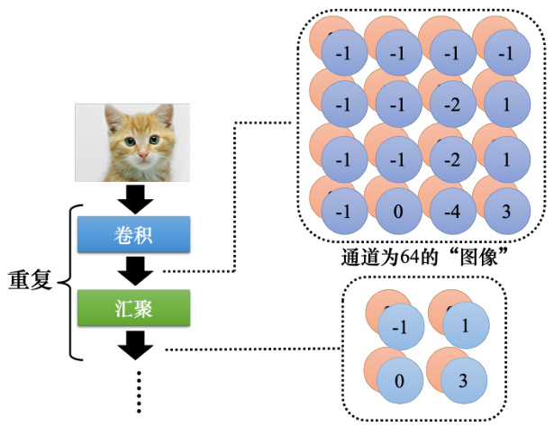  
图4.29 重复使用卷积和汇聚 

一般架构就是卷积加汇聚，汇聚是可有可无的，很多人可能会选择不用汇聚。如图4.30所示，如果做完几次卷积和汇聚以后，把汇聚的输出做扁平化（flatten），再把这个向量丢进全连接层里面，最终还要过个softmax 来得到图像识别的结果。这就是一个经典的图像识别的网络，里面有卷积、汇聚和扁平化，最后再通过几个全连接层或softmax 来得到图像识别的结果。  

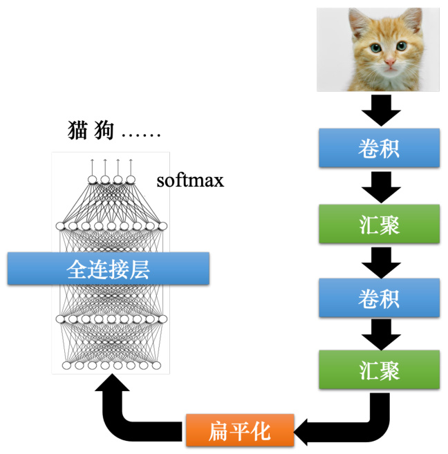  
图4.30 经典的图像识别的网络  

扁平化就是把图像里面本来排成矩阵样子的东西“拉直”，即把所有的数值“拉直”变成个向量。  

## 4.8 卷积神经网络的应用：下围棋  

除了图像识别以外，卷积神经网络另外一个最常见的应用是用来下围棋，以AlphaGo 为例。下围棋其实是一个分类的问题，网络的输入是棋盘上黑子跟白子的位置，输出就是下一步应该要落子的位置。网络的输入是一个向量，棋盘上有 $19\times19$ 个位置，可以把一个棋盘表示成一个 $19\times19$ 维的向量。在这个向量里面，如果某个位置有一个黑子，这个位置就填1，如果有白子，就填-1，如果没有子，就填0。不一定要黑子是1，白子是-1，没有子就是0，这只是一个可能的表示方式。通过把棋盘表示成向量，网络就可以知道棋盘上的盘势。把这个向量输到一个网络里面，下围棋就可以看成一个分类的问题，通过网络去预测下一步应该落子的最佳位置，所以下围棋就是一个有 $19\times19$ 个类别的分类问题，网络会输出 $19\times19$ 个类别中的最好类别，据此选择下一步落子的位置。这个问题可以用一个全连接网络来解决，但用卷积神经网络的效果更好。  

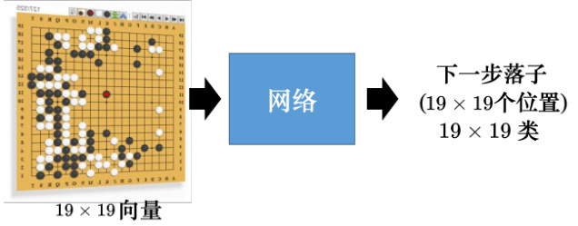  
图4.31 使用卷积神经网络下围棋  

> Q：为什么卷积神经网络可以用在下围棋上？  

> A：首先一个棋盘可以看作是一个分辨率为 $19\times19$ 的图像。一般图像很大， $100\times100$ 的分辨率的图像，都是很小的图像了。但是棋盘是一个更小的图像，其分辨率只有 $19\!\times\!19$ 。这个图像里面每个像素代表棋盘上一个可以落子的位置。一般图像的通道就是RGB。而在AlphaGo 的原始论文里面，每个棋盘的位置，即每个棋盘上的像素是用48 个通道来描述，即棋盘上的每个位置都用48 个数字来描述那个位置发生的事情。48 个数字是围棋高手设计出来的，包括比如这个位置是不是要被叫吃了，这个位置旁边有没有颜色不一样的等等。所以当我们用48 个数字来描述棋盘上的一个位置时，这个棋盘就是 $19\times19$ 的分辨率的图像，其通道就是48。卷积神经网络其实并不是随便用都会好的，它是为图像设计的。如果一个问题跟图像没有共通的特性，就不该用卷积神经网络。既然下围棋可以用卷积神经网络，这意味着围棋跟图像有共同的特性。图像上的第1 个观察是，只需要看小范围就可以知道很多重要的模式。下围棋也是一样的，图4.32中的模式不用看整个棋盘的盘势，就知道发生了什么事（白子被黑子围住了）。接下来黑子如果放在被围住的白子下面，就可以把白子提走。白子如果放在白子下面，被围住的白子才不会被提走。其实AlphaGo 的第1 层的滤波器大小就是 $5\times5$ ，所以显然设计这个网络的人觉得棋盘上很多重要的模式，也许看 $5\times5$ 的范围就可以知道。此外，图像上的第2 个观察是同样的模式可能会出现在不同的位置，在下围棋里面也是一样的。如图4.33 所示，这个叫吃的模式，它可以出现在棋盘上的任何位置，它可以出现在左上角，也可以出现在右下角，所以从这个观点来看图像跟下围棋有很多共同之处。  

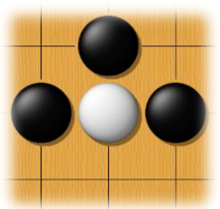  
图4.32 围棋的模式  

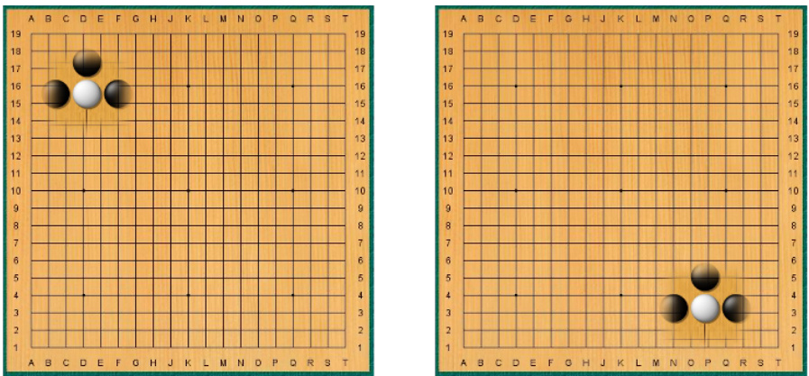  
图4.33 吃的模式  

在做图像的时候都会做汇聚，一张图像做下采样以后，并不会影响我们对图像中物体的判断。但汇聚对于下围棋这种精细的任务并不实用，下围棋时随便拿掉一个列拿掉一个行，整个棋局就不一样。AlphaGo 在Nature 上的论文正文里面没有提它用的网络架构，而是在附件中介绍了这个细节。AlphaGo 把一个棋盘看作 $19\times19\times48$ 大小的图像。接下来它有做零填充。它的滤波器的大小是 $5\times5$ ，然后有 $k=192$ 个滤波器， $k$ 的值是试出来的，它也试了128、256，发现192 的效果最好。这是第1 层，步幅 $=\!1$ ，使用了ReLU。在第2 层到第12 层都有做零填充。核大小都是 $3\times3$ ，一样是 $k$ 个滤波器，也就是每一层都是192 个滤波器，步幅一样设1，这样叠了很多层以后，因为是一个分类的问题，最后加上了一个softmax，没有用汇聚，所以这是一个很好的设计类神经网络的例子。在下围棋的时候不适合用汇聚。所以我们要想清楚，在用一个网络架构的时候，这个网络的架构到底代表什么意思，它适不适合用在这个任务上。卷积神经网络除了下围棋、图像识别以外，近年来也用在语音上和文字处理上。比如论文“Convolutional Neural Networks for Speech Recognition” 将卷积神经网络应用到语音上，论文“UNITN: Training Deep Convolutional Neural Network for Twitter SentimentClassification” 把卷积神经网络应用到文字处理上。如果想把卷积神经网络用在语音和文字处理上，就要对感受野和参数共享进行重新设计，其跟图像不同，要考虑语音跟文字的特性来设计。所以不要以为在图像上的卷积神经网络，直接套到语音上它也奏效（work），可能是不奏效的。要想清楚图像语音有什么样的特性，要怎么设计合适的感受野。  

其实卷积神经网络不能处理图像放大缩小或者是旋转的问题，假设给卷积神经网络看的狗的图像大小都相同，它可以识别这是一只狗。当把这个图像放大的时候，它可能就不能识别这张图像是一只狗。卷积神经网络就是这么“笨”，对它来说，这是两张图像。虽然两张图像的形状是一模一样的，但是如果把它们“拉直”成向量，里面的数值就是不一样的。虽然人眼一看觉得两张图像的形状很像，但对卷积神经网络来说它们是非常不一样的。所以事实上，卷积神经网络并不能够处理图像放大缩小或者是旋转的问题。假设图像里面的物体都是比较小的，当卷积神经网络在某种大小的图像上面学会做图像识别，我们把物体放大，它的性能就会降低不少，卷积神经网络并没有想像的那么强。因此在做图像识别的时候往往都要做数据增强。所谓数据增强就是把训练数据每张图像里面截一小块出来放大，让卷积神经网络看过不同大小的模式；把图像旋转，让它看过某一个物体旋转以后长什么样子，卷积神经网络才会做到好的结果。卷积神经网络不能够处理缩放（scaling）跟旋转（rotation）的问题，但SpatialTransformer Layer 网络架构可以处理这个问题。  

