# 第5 章 循环神经网络  

循环神经网络（Recurrent Neural Network）是深度学习领域中一种非常经典的网络结构，在现实生活中有着广泛的应用。以槽填充（slot filling）为例，如图5.1 所示，假设订票系统听到用户说：“我想在6 月1 日抵达上海。”，系统有一些槽（slot）：目的地和到达时间，系统要自动知道这边的每一个单词是属于哪一个槽，比如“上海”属于目的地槽，“6 月1 号”属于到达时间槽。  

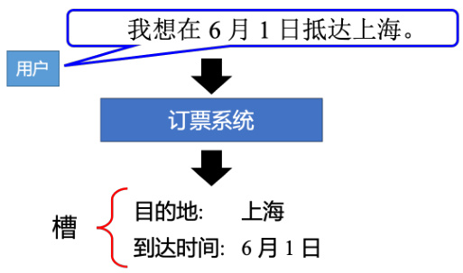  
图5.1 槽填充示例  

这个问题可以使用一个前馈神经网络（feedforward neural network）来解，如图5.2 所示，输入是一个单词，把“上海”变成一个向量，“丢”到这个神经网络里面。要把一个单词丢到一个神经网络里面去，就必须把它变成一个向量。  

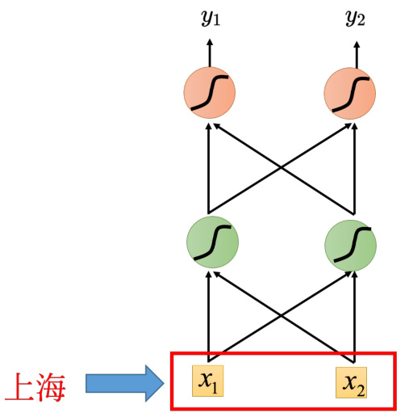  
图5.2 使用神经网络解决槽填充问题  

以下是把单词用向量来表示的方法。  

## 5.1 独热编码  

假设词典中有5 个单词：apple，bag，cat，dog，elephant，如式(5.1)。向量的大小是词典大小。每一个维度对应词典的一个单词。对应单词的维度为1，其他为0。  

$$
\begin{array}{r}{\mathrm{{apple}}=[1,0,0,0,0]}\\ {\mathrm{{bag}}\ =[0,1,0,0,0]}\\ {\mathrm{{cat}}\ =[0,0,1,0,0]}\\ {\mathrm{{dog}}=[0,0,0,1,0]}\\ {\mathrm{{elephant}}\ =[0,0,0,0,1]}\end{array}
$$

如果只是用独热编码来描述一个单词，会有一些问题：因为很多单词可能都没有见过，所以需要在独热编码里面多加维度，用一个维度代表other，如图5.3(a) 所示。如果不是在词表中，有的单词就归类到other 里面去（Pig，Cow 归类到other 里面去）。我们可以用每一个单词的字母来表示它的向量，比如单词是apple，apple 里面有出现app、ple、ppl，在这个向量里面对应到app、ple、ppl 的维度就是1，其他都为0，如图5.3(b) 所示。  

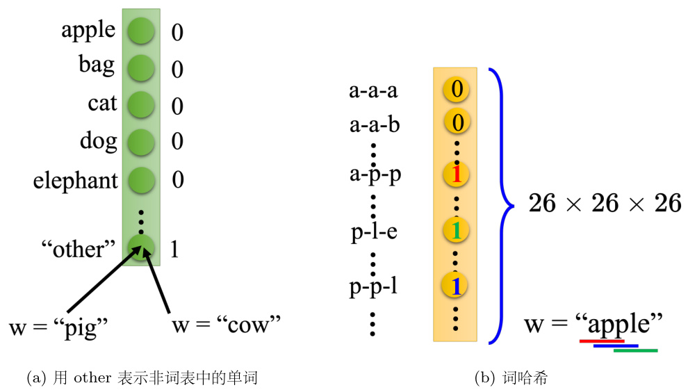  
图5.3 另一种编码方法  

假设把单词表示为向量，把这个向量丢到前馈神经网络里面去，在该任务里面，输出是一个概率分布，该概率分布代表着输入单词属于每一个槽的概率，比如“上海”属于目的地的概率和“上海”属于出发地的概率，如图5.4 所示。但是前馈网络会有问题，如图5.5 所示，假设用户1 说：“在6 月1 号抵达上海”。用户2 说：“在6 月1 号离开上海”，这时候“上海”就变成了出发地。但是对于神经网络，输入一样的东西，输出就应该是一样的东西。在例子中，输入“上海”，输出要么让目的地概率最高，要么让出发地概率最高。不能一会让出发地的概率最高，一会让目的地概率最高。在这种情况下，如果神经网络有记忆力的，它记得它看过“抵达”，在看到“上海”之前；或者它记得它已经看过“离开”，在看到“上海”之前。通过记忆力，它可以根据上下文产生不同的输出。如果让神经网络是有记忆力，其就可以解决输入不同的单词，输出不同的问题。  

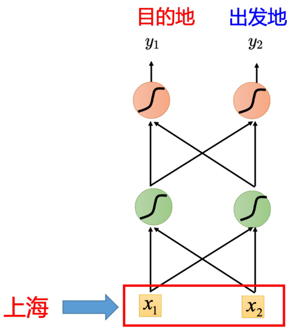  
图5.4 使用前馈神经网络预测概率分布  

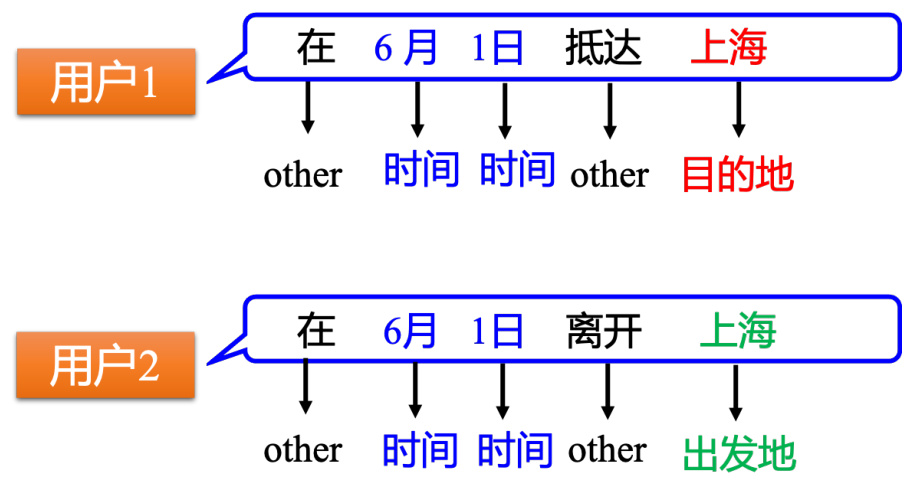  
图5.5 前馈神经网络的问题  

## 5.2 什么是RNN？  

在RNN 里面，每一次隐藏层的神经元产生输出的时候，该输出会被存到记忆元（memorycell），图5.6(a) 中的蓝色方块表示记忆元。下一次有输入时，这些神经元不仅会考虑输入 $x_{1},x_{2}$ ，还会考虑存到记忆元里的值。除了 $x_{1},x_{2}$ ，存在记忆元里的值 $a_{1},a_{2}$ 也会影响神经网络的输出。  

> 记忆元可简称为单元（cell），记忆元的值也可称为隐状态（hidden state）。  

举个例子，假设图5.6(b) 中的神经网络所有的权重都是1，所有的神经元没有任何的偏置（bias）。为了便于计算，假设所有的激活函数都是线性的，输入是序列 $[1,1]^{\mathrm{T}},[1,1]^{\mathrm{T}},[2,2]^{\mathrm{T}},\cdot\cdot\cdot\,,$ 所有的权重都是1。首先设置记忆元的初始值都为0，接着输入第一个 $[1,1]^{\mathrm{T}}$ ，对于左边的神经元（第一个隐藏层），其除了接到输入的 $[1,1]^{\mathrm{T}}$ ，还接到了记忆元（0 跟0），输出就是2。同理，右边神经元的输出为2，第二层隐藏层输出为4。  

接下来循环神经网络会将绿色神经元的输出存在记忆元里去，所以记忆元里面的值被更新为2。如图5.6(c) 所示，接下来再输入[1, 1]T，接下来绿色的神经元输入为 $[1,1]^{\mathrm{T}}$ 、[2, 2]T，输出为[6, 6]T，第二层的神经元输出为[12, 12]T。所以因为循环神经网络有记忆元，就算输入相同，输出也可能不一样。  

如图5.6(d) 所示，[6, 6]T 存到记忆元里去，接下来输入是[2, 2]T，输出为[16, 16]T；第二层隐藏层为[32, 32]T。在做循环神经网络时，它会考虑序列的顺序，输入序列调换顺序之后输出不同。  

> 因为当前时刻的隐状态使用与上一时刻隐状态相同的定义，所以隐状态的计算是循环的（recurrent），基于循环计算的隐状态神经网络被称为循环神经网络。  

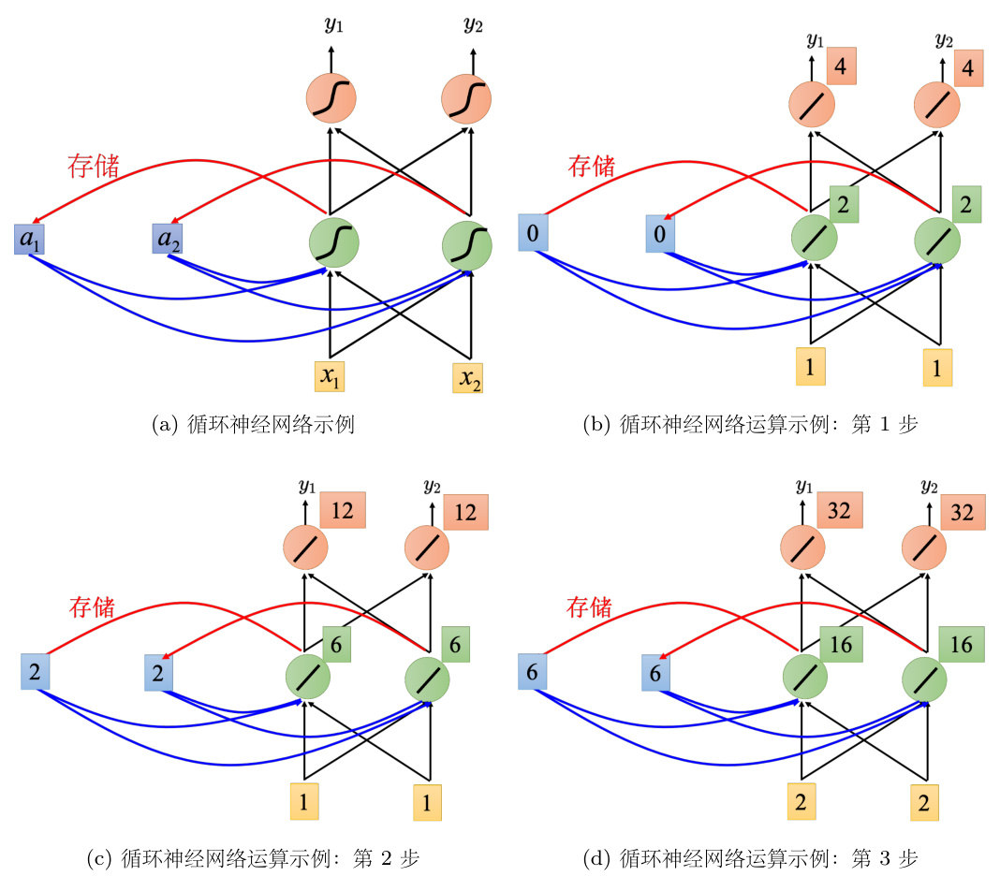  
图5.6 循环神经网络运算示例  

## 5.3 RNN 架构  

使用循环神经网络处理槽填充这件事，如图5.7 所示。用户说：“我想在6 月1 日抵达上海”，“抵达”就变成了一个向量“丢”到神经网络里面去，神经网络的隐藏层的输出为向量 $\pmb{a}_{1}$ ， $\pmb{a}_{1}$ 产生“抵达”属于每一个槽填充的概率 $\pmb{y}_{1}$ 。接下来 $\pmb{a}_{1}$ 会被存到记忆元里面去，“上海”会变为输入，这个隐藏层会同时考虑“上海”这个输入和存在记忆元里面的 $\pmb{a}_{1}$ ，得到 $\pmb{a}_{2}$ 。根据 $\pmb{a}_{2}$ 得到$\pmb{y}_{2}$ ， $\pmb{y}_{2}$ 是属于每一个槽填充的概率。  

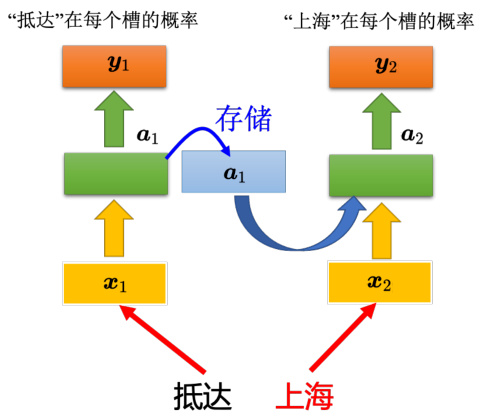  
图5.7 使用循环神经网络处理槽填充  

这个不是三个网络，这是同一个网络在三个不同的时间点被使用了三次，用同样的权重用同样的颜色表示。  

有了记忆元以后，输入同一个单词，希望输出不同的问题就有可能被解决。如图5.8 所示，同样是输入“上海”这个单词，但是因为红色“上海”前接了“离开”，绿色“上海”前接了“抵达”，“离开”和“抵达”的向量不一样，隐藏层的输出会不同，所以存在记忆元里面的值会不同。虽然 $\pmb{x}_{2}$ 的值是一样的，因为存在记忆元里面的值不同，所以隐藏层的输出会不同，所以最后的输出也就会不一样。  

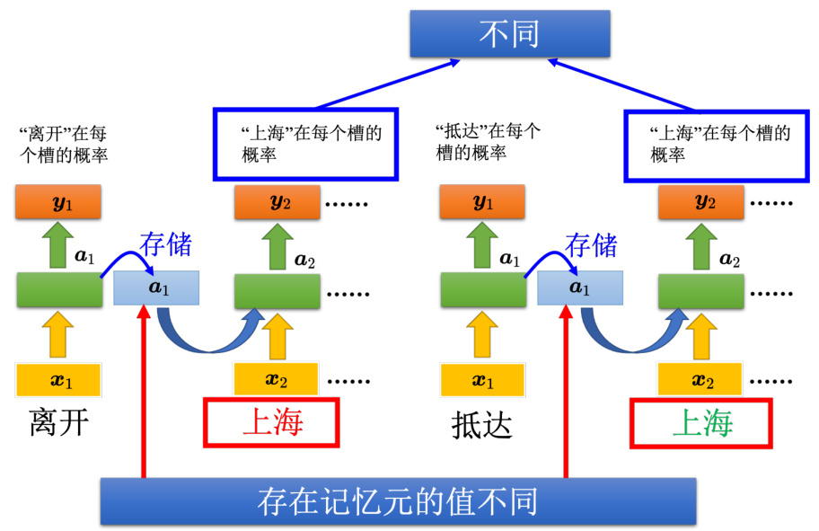  
图5.8 输入相同，输出不同示例  

## 5.4 其他RNN  

循环神经网络的架构是可以任意设计的，之前提到的RNN 只有一个隐藏层，但RNN 也可以是深层的。比如把 $\pmb{x}_{t}$ 丢进去之后，它可以通过一个隐藏层，再通过第二个隐藏层，以此类推(通过很多的隐藏层) 才得到最后的输出。每一个隐藏层的输出都会被存在记忆元里面，  

在下一个时间点的时候，每一个隐藏层会把前一个时间点存的值再读出来，以此类推最后得到输出，这个过程会一直持续下去。  

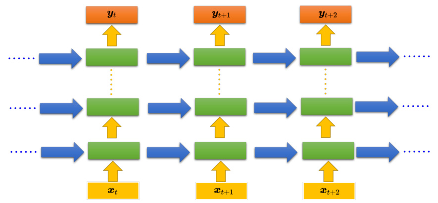  
图5.9 深层循环神经网络  

### 5.4.1 Elman 网络&Jordan 网络  

循环神经网络会有不同的变形，如图5.10 所示，刚才讲的是简单循环网络（Simple Re-current Network，SRN），即把隐藏层的值存起来，在下一个时间点在读出来。还有另外一种叫做Jordan 网络，Jordan 网络存的是整个网络输出的值，它把输出值在下一个时间点在读进来，把输出存到记忆元里。Elman 网络没有目标，很难控制说它能学到什么隐藏层信息（学到什么放到记忆元里），但是Jordan 网络是有目标，比较很清楚记忆元存储的东西。  
> 简单循环网络也称为Elman 网络。 

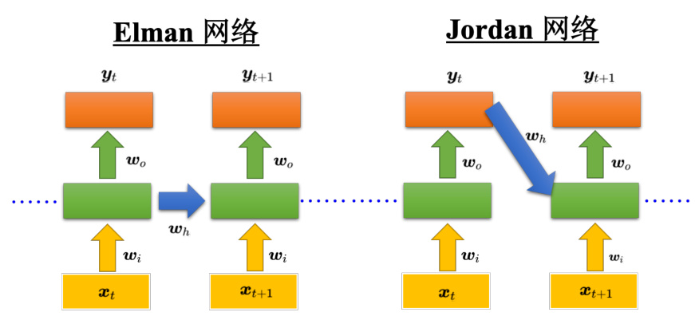  
图5.10 Elman 网络和Jordan 网络  

### 5.4.2 双向循环神经网络  

循环神经网络还可以是双向。刚才RNN 输入一个句子，它就是从句首一直读到句尾。如图5.11 所示，假设句子里的每一个单词用 $\pmb{x}_{t}$ 表示，其是先读 $\pmb{x}_{t}$ ，再读 $x_{t+1}$ 、 $\pmb{x}_{t+2}$ 。但其读取方向也可以是反过来的，它可以先读 $\pmb{x}_{t+2}$ ，再读 $\pmb{x}_{t+1}$ 、 $\pmb{x}_{t}$ 。我们可以同时训练一个正向的循环神经网络，又可以训练一个逆向的循环神经网络，然后把这两个循环神经网络的隐藏层拿出来，都接给一个输出层得到最后的 $\pmb{y}_{t}$ 。所以把正向的网络在输入 $\pmb{x}_{t}$ 的时候跟逆向的网络在输入 $\pmb{x}_{t}$ 时，都丢到输出层产生 $\pmb{y}_{t}$ ，产生 $\pmb{y}_{t+1},\pmb{y}_{t+2}$ ，以此类推。双向循环神经网络（Bidirectional Recurrent Neural Network，Bi-RNN）的好处是，神经元产生输出的时候，它看的范围是比较广的。如果只有正向的网络，再产生 $\pmb{y}_{t}$ 、 $\pmb{y}_{t+1}$ 的时候，神经元只看过 $x_{1}$ 到$\pmb{x}_{t+1}$ 的输入。但双向循环神经网络产生 $\pmb{y}_{t+1}$ 的时候，网络不只是看过 $x_{1}$ , 到 $\pmb{x}_{t+1}$ 所有的输入，它也看了从句尾到 $x_{t+1}$ 的输入。网络就等于整个输入的序列。假设考虑的是槽填充，网络就等于看了整个句子后，才决定每一个单词的槽，这样会比看句子的一半还要得到更好的性能。  

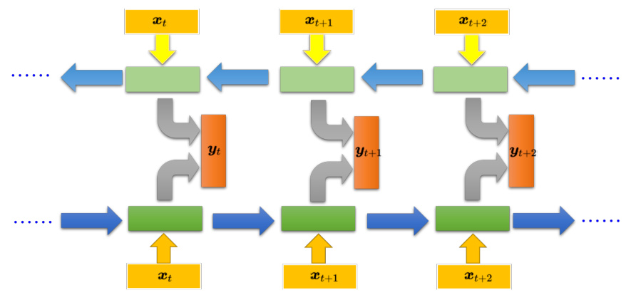  
图5.11 双向循环神经网络  

### 5.4.3 长短期记忆网络  

之前提到的记忆元是最单纯的，可以随时把值存到记忆元去，也可以把值读出来。但最常用的记忆元是长短期记忆网络（Long Short-Term Memory network，LSTM），长时间的短期记忆。LSTM 是比较复杂的。LSTM 有三个门（gate），当外界某个神经元的输出想要被写到记忆元里面的时候，必须通过一个输入门（input gate），输入门要被打开的时候，才能把值写到记忆元里面。如果把这个关起来的话，就没有办法把值写进去。至于输入门的开关是神经网络自己学的，其可以自己学什么时候要把输入门打开，什么时候要把输入门关起来。输出的地方也有一个输出门（output gate），输出门会决定外界其他的神经元能否从这个记忆元里面把值读出来。把输出门关闭的时候是没有办法把值读出来，输出门打开的时候才可以把值读出来。跟输入门一样，输出门什么时候打开什么时候关闭，网络是自己学到的。第三个门称为遗忘门（forget gate），遗忘门决定什么时候记忆元要把过去记得的东西忘掉。这个遗忘门什么时候会把存在记忆元的值忘掉，什么时候会把存在记忆元里面的值继续保留下来，这也是网络自己学到的。整个LSTM 可以看成有4 个输入、1 个输出。在这4 个输入中，一个是想要被存在记忆元的值，但不一定能存进去，还有操控输入门的信号、操控输出门的信号、操控遗忘门的信号，有着四个输入但它只会得到一个输出。  

> “-”应该在short-term 中间，是长时间的短期记忆。之前的循环神经网络，它的记忆元在每一个时间点都会被洗掉，只要有新的输入进来，每一个时间点都会把记忆元洗掉，所以的短期是非常短的，但如果是长时间的短期记忆元，它记得会比较久一点，只要遗忘门不要决定要忘记，它的值就会被存起来。  

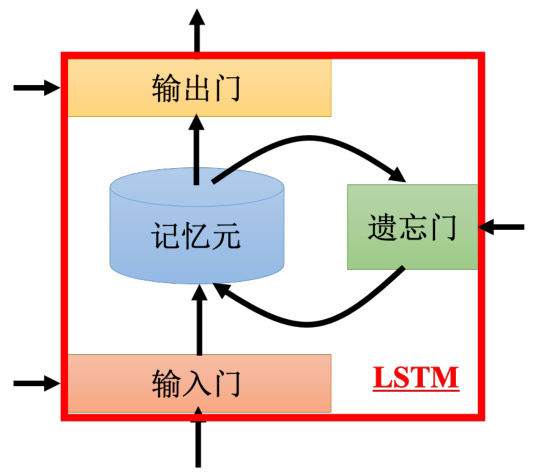  
图5.12 LSTM 结构  

记忆元对应的计算公式为  

$$
c^{\prime}=g(z)f\left(z_{i}\right)+c f\left(z_{f}\right)
$$

如图5.13 所示，底下这个是外界传入单元的输入，还有输入门、遗忘门和输出门。假设要被存到单元的输入叫做 $z$ ，操控输入门的信号为 $z_{i}$ ，操控遗忘门的信号为 $z_{f}$ ，操控输出门为 $z_{o}$ ，综合这些东西会得到一个输出记为 $a$ 。假设单元里面有这四个输入之前，它里面已经存了值 $c$ 。输出 $a$ 会长什么样子，把 $z$ 通过激活函数得到 $g(z)$ ， $z_{i}$ 通过另外一个激活函数得到 $f(z_{i})$ （激活函数通常会选择sigmoid 函数），因为其值介在0 到1 之间的，这个0 到1 之间的值代表了这个门被打开的程度。（如果 $f$ 的输出是1，表示为被打开的状态，反之代表这个门是关起来的）。  

接下来，把 $g(z)$ 乘以 $f(z_{i})$ 得到 $g(z)f(z_{i})$ ，对于遗忘门的 $z_{f}$ ，也通过sigmoid 的函数得到$f(z_{f})$ 接下来把存到记忆元里面的值 $c$ 乘以 $f(z_{f})$ 得到 $\operatorname{c}f(z_{f})$ ，加起来 $c^{'}=g(z)f(z_{i})\!+\!c f(z_{f})$ ，那么 $c^{'}$ 就是重新存到记忆元里面的值。所以根据目前的运算，这个 $f(z_{i})$ 控制这个 $g(z)$ 。假设输入 $f(z_{i})=0$ ，那 $g(z)f(z_{i})$ 就等于0，就好像是没有输入一样，如果 $f(z_{i})$ 等于1 就等于是把 $g(z)$ 当做输入。那这个 $f(z_{f})$ 决定是否要把存在记忆元的值洗掉，假设 $f(z_{f})$ 为1，遗忘门开启的时候，这时候 $c$ 会直接通过，把之前的值还会记得。如果 $f(z_{f})$ 等于0(遗忘门关闭的时候) $|c f(z_{f})\rangle$ 等于0。然后把这个两个值加起来 $(c^{'}=g(z)f(z_{i})+c f(z_{f}))$ 写到记忆元里面得到 $c^{'}$ 。这个遗忘门的开关是跟直觉是相反的，遗忘门打开的时候代表的是记得，关闭的时候代表的是遗忘。那这个 $c^{'}$ 通过 $h(c^{'})$ ，将 $h(c^{'})$ 乘以 $f(z_{o})$ 得到 $a=h(c^{'})f(z_{o})$ 。输出门受$f(z_{o})$ 所操控， $f(z_{o})$ 等于1 的话，就说明 $h(c^{'})$ 能通过， $f(z_{o})$ 等于0 的话，说明记忆元里面存在的值没有办法通过输出门被读取出来。  

### 5.4.4 LSTM 举例  

如图5.14 所示，网络里面只有一个LSTM 的单元，输入都是三维的向量，输出都是一维的输出。这三维的向量跟输出还有记忆元的关系是这样的。假设 $x_{2}$ 的值是1 时， $x_{1}$ 的值就会被写到记忆元里；假设 $x_{2}$ 的值是-1 时，就会重置这个记忆元；假设 $x_{3}$ 的值为1 时，才会把输出打开，才能看到输出，看到记忆元的数字。  

假设原来存到记忆元里面的值是0，当第二个维度 $x_{2}$ 的值是1 时，3 会被存到记忆元里面去。第四个维度的 $x_{2}$ 等于1，所以4 会被存到记忆元里面去，所以会得到7。第六个维度的 $x_{3}$ 等于1，这时候7 会被输出。第七个维度的 $x_{2}$ 的值为-1，记忆元里面的值会被洗掉变为0。第八个维度的 $x_{2}$ 的值为1，所以把6 存进去，因为 $x_{3}$ 的值为1，所以把6 输出。  

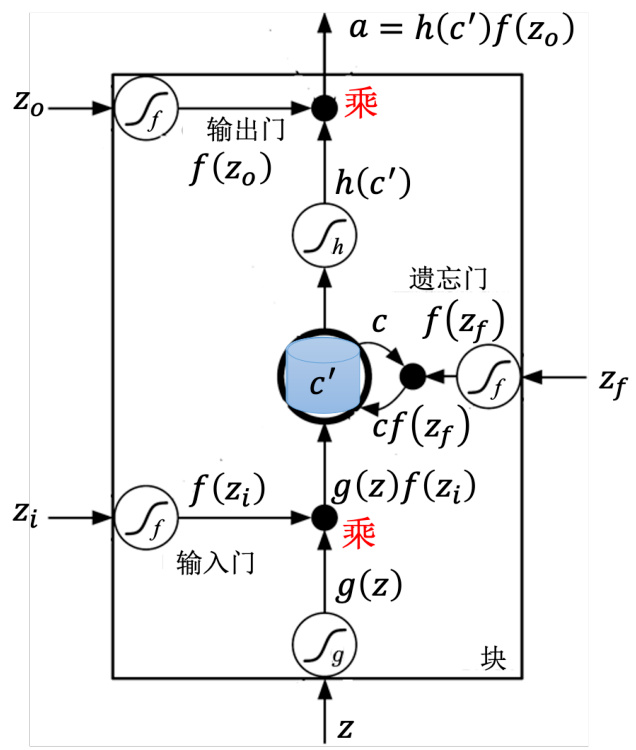  
图5.13 LSTM 记忆元示例  

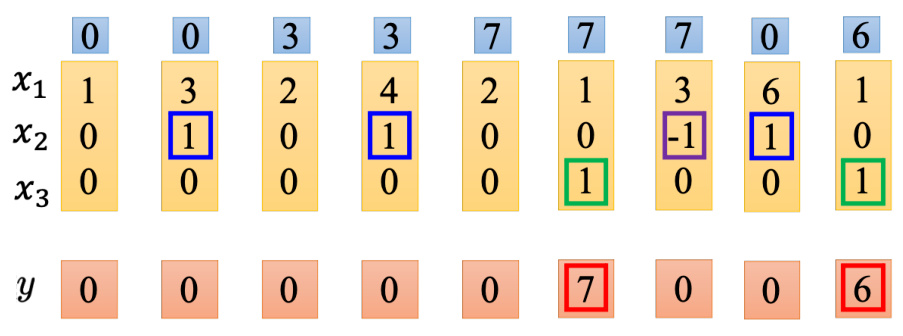  
图5.14 LSTM 示例  

### 5.4.5 LSTM 运算示例  

图5.15 给出了LSTM 实际的运算的例子。记忆元的四个输入标量是这样来的：输入的三维向量乘以线性变换（linear transform）后所得到的结果， $x_{1},x_{2},x_{3}$ 乘以权重再加上偏置。假设这些值是已知的，在实际运算之前，先根据它的输入，分析下可能会得到的结果。底下这个外界传入的单元， $x_{1}$ 乘以1，其他的向量乘以0，所以就直接把 $x_{1}$ 当做输入。在输入门时，$x_{2}$ 乘以100，偏置乘以 $-10$ 。假设 $x_{2}$ 是没有值的话，通常输入门是关闭的（偏置等于 $-10)$ ）。因为 $-10$ 通过sigmoid 函数之后会接近0，所以就代表是关闭的，若 $x_{2}$ 的值大于1 的话，结果会是一个正值，代表输入门会被打开。遗忘门通常会被打开的，因为其偏置等于10，它平常会一直记得东西，只有当 $x_{2}$ 的值为一个很大的负值时，才会把遗忘门关起来。输出门平常是被关闭的，因为偏置是一个很大的负值，若 $x_{3}$ 有一个很大的正值的话，压过偏置把输出打开。  

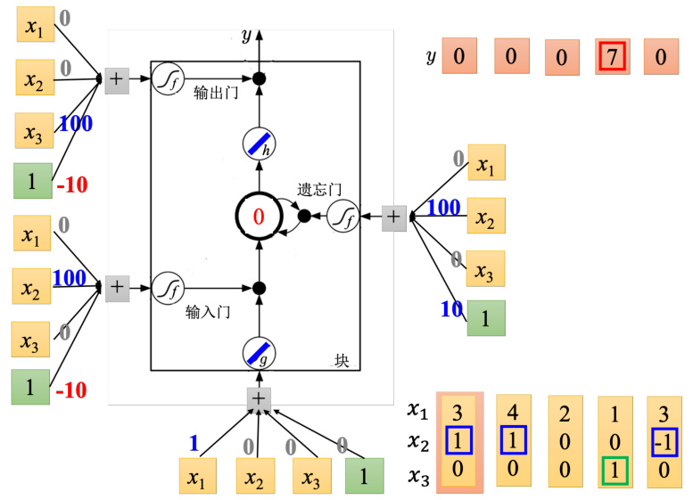  
图5.15 LSTM 运算示例  

接下来，实际的输入一下看看。为了简化计算，假设 $g$ 和 $h$ 都是线性的。假设存到记忆元里面的初始值是0，如图5.16 所示，输入第一个向量 $[3,1,0]^{\mathrm{T}}$ ，输入这边 $3{^{*}}1{=}3$ ，这边输入的是的值为3。输入门这边 $(1*100-10\approx1)$ 是被打开(输入门约等于1)。 $(g(z)*f(z_{i})=3)$ 。遗忘门 $\left(1*100+10\approx1\right)$ 是被打开的(遗忘门约等于1)。 $0^{\;*}1{+}3{=}3(c^{'}=g(z)f(z_{i})+c f(z_{f}))$ ，所以存到记忆元里面的为3。输出门(-10) 是被关起来的，所以3 无关通过，所以输出值为0。  

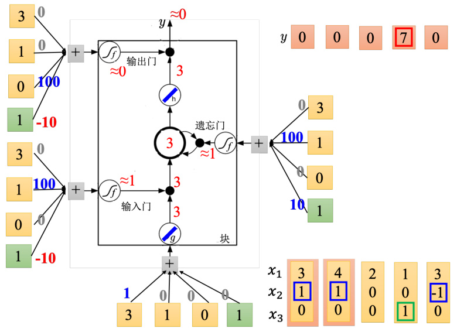  
图5.16 LSTM 运算示例：第1 步  

接下来输入 $[4,1,0]^{\mathrm{T}}$ ，如图5.17 所示，传入输入的值为4，输入门会被打开，遗忘门也会被打开，所以记忆元里面存的值等于7（ $3+4=7$ ），输出门仍然会被关闭的，所以7 没有办法被输出，所以整个记忆元的输出为0。  

接下来输入 $[2,0,0]^{\mathrm{T}}$ ，如图5.18 所示，传入输入的值为2，输入门关闭（ $\left.\approx0\right.$ ），输入被输入门给挡住了（ $0\times2=0)$ ），遗忘门打开（10）。原来记忆元里面的值还是7（ $\left.1\times7+0=7\right)$ ）。输出门仍然为0，所以没有办法输出，所以整个输出还是0。  

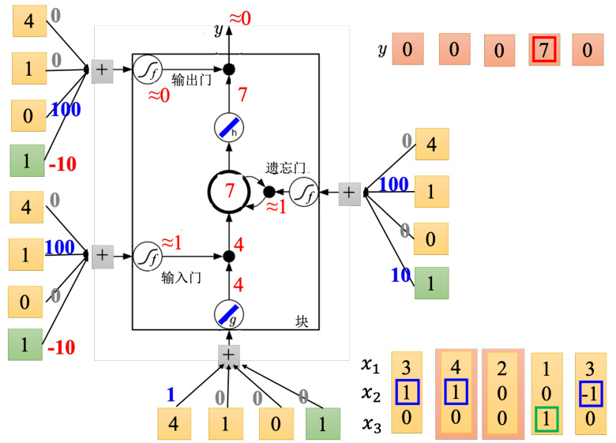  
图5.17 LSTM 运算示例：第2 步  

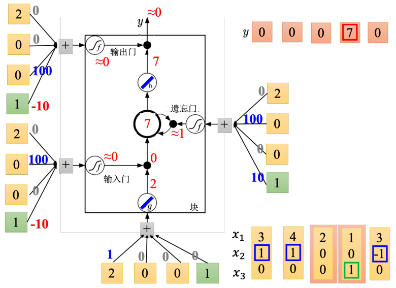  
图5.18 LSTM 运算示例：第3 步  

接下来输入 $[1,0,1]^{\mathrm{T}}$ ，如图5.19 所示，传入输入的值为1，输入门是关闭的，遗忘门是打开的，记忆元里面存的值不变，输出门被打开，整个输出为7，记忆元里面存的7 会被读取出来。  

最后输入 $[3,-1,0]^{\mathrm{T}}$ ，如图5.20 所示，传入输入的值为3，输入门关闭，遗忘门关闭，记忆元里面的值会被洗掉变为0，输出门关闭，所以整个输出为0。  

## 5.5 LSTM 原理  

在原来的神经网络里面会有很多的神经元，我们会把输入乘以不同的权重当做不同神经元的输入，每一个神经元都是一个函数，输入一个值然后输出一个值。但是如果是LSTM 的话，只要把LSTM 想成是一个神经元。所以要用一个LSTM 的神经元，其实就是原来简单的神经元换成LSTM。  

如图5.22 所示，为了简化，假设隐藏层只有两个神经元，输入 $x_{1},x_{2}$ 会乘以不同的权重当做LSTM 不同的输入。输入 $\left(x_{1},x_{2}\right)$ 会乘以不同的权重会去操控输出门，乘以不同的权重操控输入门，乘以不同的权重当做底下的输入，乘以不同的权重当做遗忘门。第二个LSTM也是一样的。所以LSTM 是有四个输入跟一个输出，对于LSTM 来说，这四个输入是不一样的。在原来的神经网络里是一个输入一个输出。在LSTM 里面它需要四个输入，它才能产生一个输出。LSTM 因为需要四个输入，四个输入都是不一样，原来的一个神经元就只有一个输入和输出。假设用的神经元的数量跟LSTM 是一样的，则LSTM 需要的参数量是一般神经网络的四倍。  

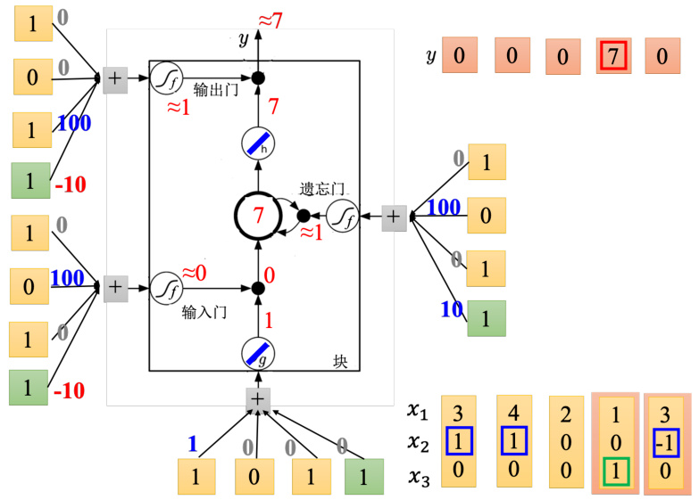  
图5.19 LSTM 运算示例：第4 步  

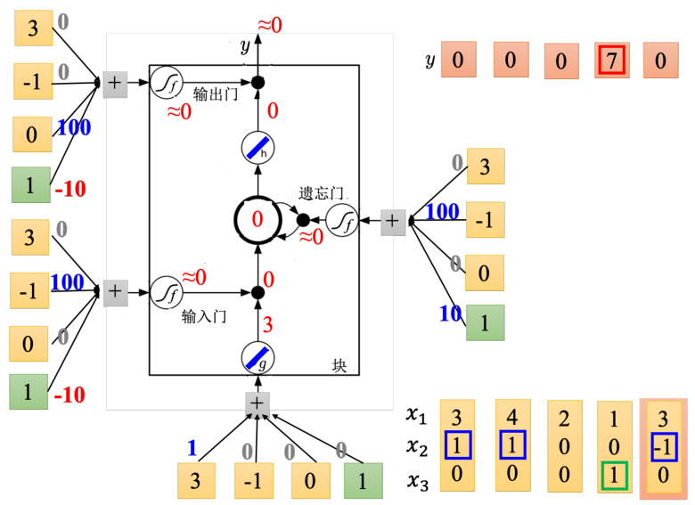  
图5.20 LSTM 运算示例：第5 步  

如图5.23 所示，假设有一整排的LSTM，这些LSTM 里面的记忆元都存了一个值，把所有的值接起来就变成了向量，写为 $c^{t-1}$ （一个值就代表一个维度）。现在在时间点 $t$ ，输入向量 $\pmb{x}_{t}$ ，这个向量首先会乘上一矩阵（线性变换）变成一个向量 ${\mathscr{z}}$ ，向量 ${\textit{\textbf{z}}}$ 的维度就代表了操控每一个LSTM 的输入。 ${\textit{\textbf{z}}}$ 这个维度正好就是LSTM 记忆元的数量。 ${\textit{\textbf{z}}}$ 的第一维就丢给第一个单元。这个 $\pmb{x}_{t}$ 会乘上另外的一个变换得到 $z^{i}$ ，然后这个 $z^{i}$ 的维度也跟单元的数量一样， $z^{i}$ 的每一个维度都会去操控输入门。遗忘门跟输出门也都是一样，不再赘述。所以我们把 $\pmb{x}_{t}$ 乘以四个不同的变换得到四个不同的向量，四个向量的维度跟单元的数量一样，这四个向量合起来就会去操控这些记忆元运作。  

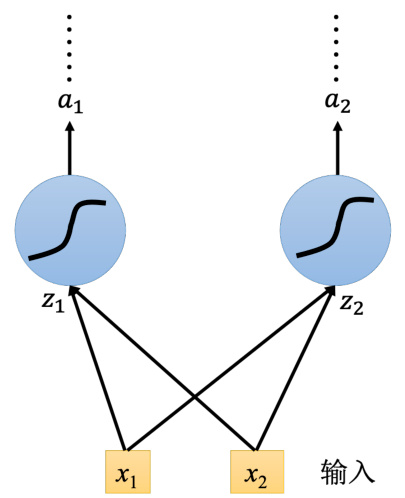  
图5.21 把LSTM 想成一个神经元  

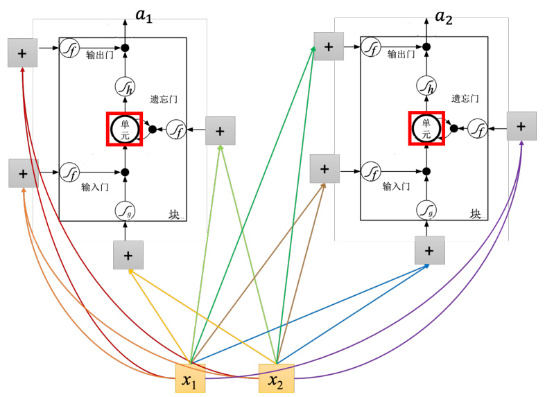  
图5.22 LSTM 需要4 个输入  

如图5.24 所示，输入分别就是 $z,z^{i},z^{o},z^{f}$ (都是向量)，丢到单元里面的值其实是向量的一个维度，因为每一个单元输入的维度都是不一样的，所以每一个单元输入的值都会是不一样。所以单元是可以共同一起被运算的。 $z^{i}$ 通过激活函数跟 ${\mathscr{z}}$ 相乘， $z^{f}$ 通过激活函数跟之前存在单元里面的值相乘，然后将 ${\mathscr{z}}$ 跟 $z^{i}$ 相乘的值加上 $z^{f}$ 跟 $\pmb{c}^{t-1}$ 相乘的值， $z^{o}$ 通过激活函数的结果输出，跟之前相加的结果再相乘，最后就得到了输出 $\pmb{y}_{t}$ 。  

之前那个相加以后的结果就是记忆元里面存放的值 $c^{t}$ ，这个过程反复的进行，在下一个时间点输入 $x_{t+1}$ ，把 ${\textit{\textbf{z}}}$ 跟输入门相乘，把遗忘门跟存在记忆元里面的值相乘，将前面两个值再相加起来，在乘上输出门的值，得到下一个时间点的输出 $\pmb{y}_{t+1}$ 但这还不是LSTM 的最终形态，真正的LSTM 会把上一个时间的输出接进来，当做下一个时间的输入，即下一个时间点操控这些门的值不是只看那个时间点的输入 $x_{t}$ ，还看前一个时间点的输出 $h^{t}$ 。其实还不止这样，还会添加peephole 连接，如图5.25 所示。peephole 就是把存在记忆元里面的值也拉过来。操控LSTM 四个门的时候，同时考虑了 $\boldsymbol{x}_{t+1},\boldsymbol{h}^{t},\boldsymbol{c}^{t}$ ，把这三个向量并在一起乘上不同的变换得到四个不同的向量再去操控LSTM。  

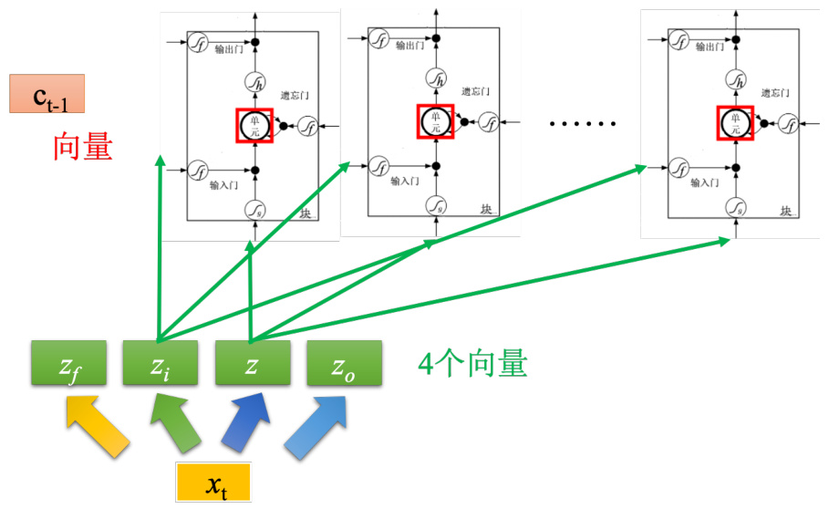  
图5.23 输入向量与记忆元的关系  

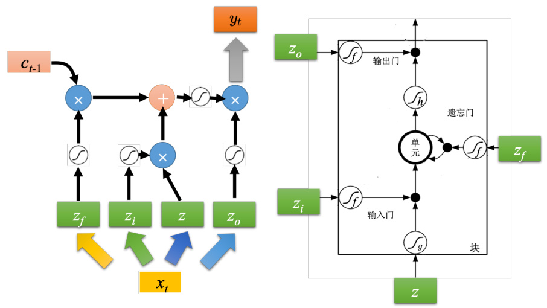  
图5.24 记忆元一起运算示例  

LSTM 通常不会只有一层，若有五六层的话，如图5.26 所示。一般做RNN 的时候，其实指的就用LSTM。  

门控循环单元（Gated Recurrent Unit，GRU）是LSTM 稍微简化的版本，它只有两个门。虽然少了一个门，但其性能跟LSTM 差不多，少了1/3 的参数，也是比较不容易过拟合。  

## 5.6 RNN 学习方式  

如果要做学习，需要定义一个损失函数（loss function）来评估模型的好坏，选一个参数要让损失最小。以槽填充为例，如图5.27 所示，给定一些句子，要给句子一些标签，告诉机器说第一个单词它是属于other 槽，“上海”是目的地槽，“on”属于other 槽，“June”和“1st”属于时间槽。“抵达”丢到循环神经网络的时候，循环神经网络会得到一个输出 $\pmb{y}_{1}$ 。接下来这个 $\pmb{y}_{1}$ 会看它的参考向量（reference vector）算它的交叉熵。我们会期望如果丢进去的是“抵达”，其参考向量应该对应到other 槽的维度，其他为0，这个参考向量的长度就是槽的数量。如果有四十个槽，参考向量的维度就是40。输入的这个单词对应到other 槽的话，对应到other 槽维度为1, 其它为0。把“上海”丢进去之后，因为“上海”属于目的地槽，希望说把 $\pmb{x}_{2}$ 丢进去的话， $\pmb{y}_{2}$ 要跟参考向量距离越近越好。那 $\pmb{y}_{2}$ 的参考向量是对应到目的地槽是1，其它为0。注意，在丢 $x_{2}$ 之前，一定要丢 $x_{1}$ （在丢“上海”之前先把“抵达”丢进去），不然就不知道存到记忆元里面的值是多少。所以在训练的时候，不能够把这些单词序列打散来看，单词序列仍然要当做一个整体来看。把“on”丢进去，参考向量对应的other 的维度是1，其它是0. RNN 的损失函数输出和参考向量的交叉熵的和就是要最小化的对象。  

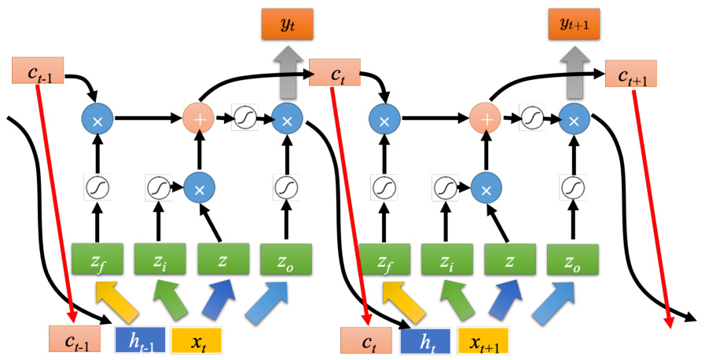  
图5.25 peephole 连接  

有了这个损失函数以后，对于训练也是用梯度下降来做。也就是现在定义出了损失函数$L$ ，要更新这个神经网络里面的某个参数 $w$ ，就是计算关于 $w$ 的偏导数，偏导数计算出来以后，就用梯度下降的方法去更新里面的参数。梯度下降用在前馈神经网络里面我们要用一个有效率的算法称为反向传播。循环神经网络里面，为了要计算方便，提出了反向传播的进阶版，即随时间反向传播（BackPropagation Through Time，BPTT）。BPTT 跟反向传播其实是很类似的，只是循环神经网络它是在时间序列上运作，所以BPTT 它要考虑时间上的信息，如图5.28 所示。  

RNN 的训练是比较困难的，如图5.29 所示。一般而言，在做训练的时候，期待学习曲线是像蓝色这条线，这边的纵轴是总损失（total loss），横轴是回合的数量，我们会希望随着回合的数量越来越多，随着参数不断的更新，损失会慢慢地下降，最后趋向收敛。但是不幸的是，在训练循环神经网络的时候，有时候会看到绿色这条线。如果第一次训练循环神经网络，绿色学习曲线非常剧烈的抖动，然后抖到某个地方，我们会觉得这程序有bug。  

如图5.30 所示，RNN 的误差表面是总损失的变化是非常陡峭的或崎岖的。误差表面有一些地方非常平坦，一些地方非常陡峭。纵轴是总损失，x 和y 轴代表是两个参数。这样会造成什么样的问题呢？假设我们从橙色的点当做初始点，用梯度下降开始调整参数，更新参数，可能会跳过一个悬崖，这时候损失会突然爆长，损失会非常上下剧烈的震荡。有时候我们可能会遇到更惨的状况，就是以正好我们一脚踩到这个悬崖上，会发生这样的事情，因为在悬崖上的梯度很大，之前的梯度会很小，所以措手不及，因为之前梯度很小，所以可能把学习率调的比较大。很大的梯度乘上很大的学习率结果参数就更新很多，整个参数就飞出去了。裁剪（clipping）可以解决该问题，当梯度大于某一个阈值的时候，不要让它超过那个阈值，当梯度大于15 时，让梯度等于15 结束。因为梯度不会太大，所以我们要做裁剪的时候，就算是踩着这个悬崖上，也不飞出来，会飞到一个比较近的地方，这样还可以继续做RNN 的训练。  

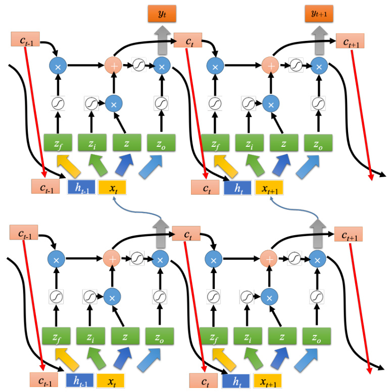  
图5.26 多层LSTM  

之前讲过ReLU 激活函数的时候，梯度消失（vanishing gradient）来源于Sigmoid 函数。但RNN 会有很平滑的误差表面不是来自于梯度消失。把Sigmoid 函数换成ReLU，其实在RNN 性能通常是比较差的，所以激活函数并不是关键点。  

有更直观的方法来知道一个梯度的大小，可以把某一个参数做小小的变化，看它对网络输出的变化有多大，就可以测出这个参数的梯度大小，如图5.31 所示。举一个很简单的例子，只有一个神经元，这个神经元是线性的。输入没有偏置，输入的权重是1，输出的权重也是1，转移的权重是 $w$ 。也就是说从记忆元接到神经元的输入的权重是 $w$ 。  

如图5.32 所示，假设给神经网络的输入是 $[1,0,0,0]^{\mathrm{T}}$ ，比如神经网络在最后一个时间点（1000 个输出值是 $w^{999}$ ）。假设 $w$ 是要学习的参数，我们想要知道它的梯度，所以是改变 $w$ 的值时候，对神经元的输出有多大的影响。假设 $w=1$ ， $y_{1000}=1$ ，假设 $w=1.01$ ， $y_{1000}\approx20000$ ，$w$ 有一点小小的变化，会对它的输出影响是非常大的。所以 $w$ 有很大的梯度。有很大的梯度也没关系，把学习率设小一点就好了。但把 $w$ 设为0.99，那 $y_{1000}\approx0$ 。如果把 $w$ 设为0.01，$y_{1000}\approx0$ 。也就是说在1 的这个地方有很大的梯度，但是在0.99 这个地方就突然变得非常小，这个时候需要一个很大的学习率。设置学习率很麻烦，误差表面很崎岖，梯度是时大时小的，在非常小的区域内，梯度有很多的变化。从这个例子可以看出，RNN 训练的问题其实来自它把同样的东西在转移的时候，在时间按时间的时候，反复使用。所以 $w$ 只要一有变化，它完全由可能没有造成任何影响，一旦造成影响，影响很大，梯度会很大或很小。所以RNN 不好训练的原因不是来自激活函数而是来自于它有时间序列同样的权重在不同的时间点被反复的使用。  

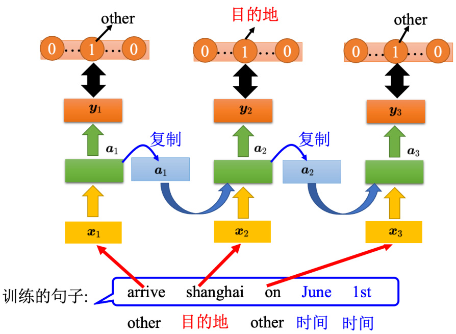  
图5.27 RNN 计算损失示意  

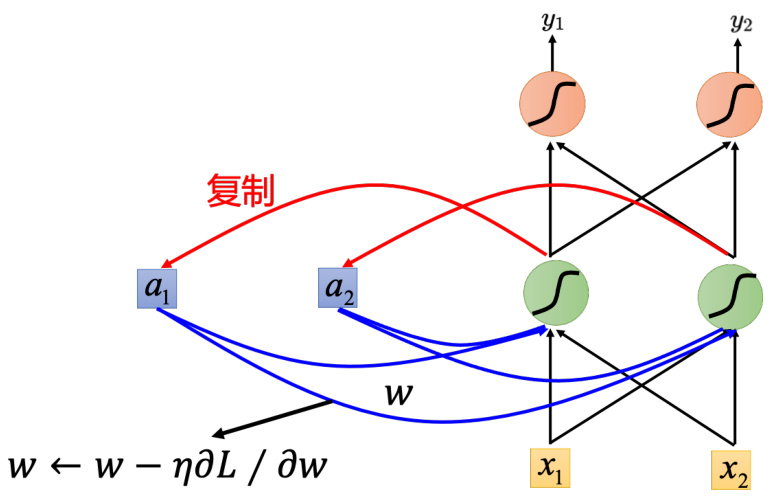  
图5.28 随时间反向传播  

## 5.7 如何解决RNN 梯度消失或者爆炸  

有什么样的技巧可以解决这个问题呢？广泛被使用的技巧是LSTM，LSTM 可以让误差表面不要那么崎岖。它会把那些平坦的地方拿掉，解决梯度消失的问题，不会解决梯度爆炸（gradient exploding）的问题。有些地方还是非常的崎岖的，有些地方仍然是变化非常剧烈的，但是不会有特别平坦的地方。如果做LSTM 时，大部分地方变化的很剧烈，所以做LSTM的时候，可以把学习率设置的小一点，保证在学习率很小的情况下进行训练。  

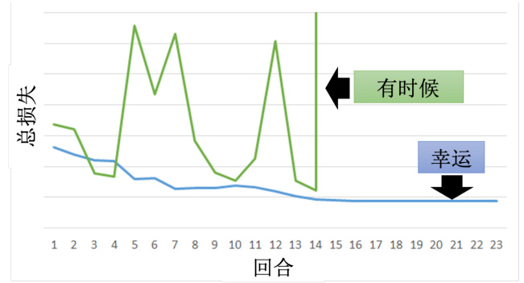  
图5.29 训练RNN 时的学习曲线  

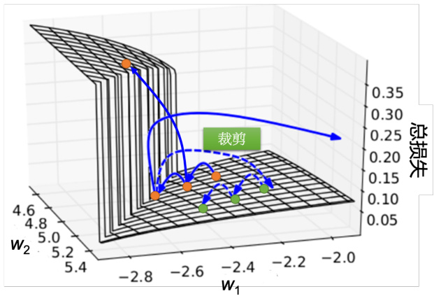  
图5.30 RNN 训练中的裁剪技巧  

> Q：为什么LSTM 可以解决梯度消失的问题，可以避免梯度特别小呢？为什么把RNN换成LSTM？。  

> A：LSTM 可以处理梯度消失的问题。用这边的式子回答看看。RNN 跟LSTM 在面对记忆元的时候，它处理的操作其实是不一样的。在RNN 里面，在每一个时间点，神经元的输出都要记忆元里面去，记忆元里面的值都是会被覆盖掉。但是在LSTM 里面不一样，它是把原来记忆元里面的值乘上一个值再把输入的值加起来放到单元里面。所以它的记忆和输入是相加的。LSTM 和RNN 不同的是，如果权重可以影响到记忆元里面的值，一旦发生影响会永远都存在。而RNN 在每个时间点的值都会被格式化掉，所以只要这个影响被格式化掉它就消失了。但是在LSTM 里面，一旦对记忆元造成影响，影响一直会被留着，除非遗忘门要把记忆元的值洗掉。不然记忆元一旦有改变，只会把新的东西加进来，不会把原来的值洗掉，所以它不会有梯度消失的问题。  

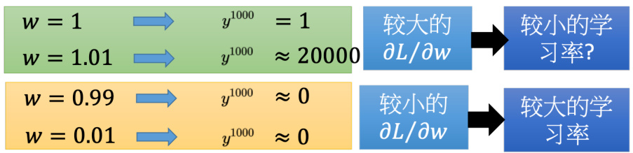  
图5.31 参数变化对网络输出的影响  

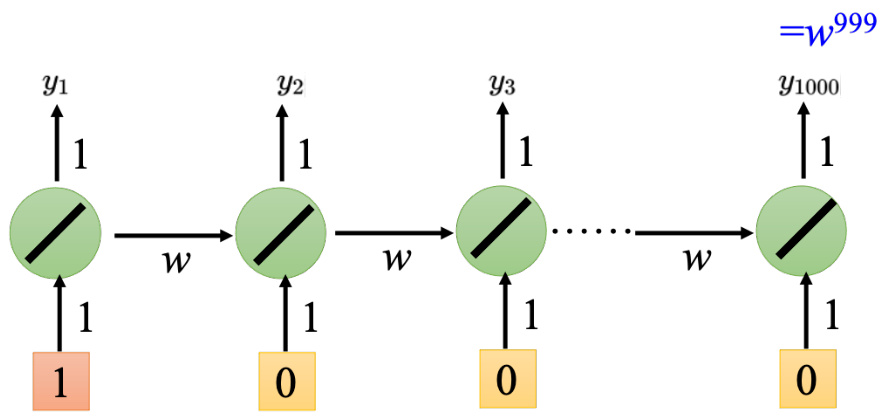  
图5.32 RNN 难以训练的原因  

遗忘门可能会把记忆元的值洗掉。其实LSTM 的第一个版本其实就是为了解决梯度消失的问题，所以它是没有遗忘门，遗忘门是后来才加上去的。甚至有个传言是：在训练LSTM的时候，要给遗忘门特别大的偏置，确保遗忘门在多数的情况下都是开启的，只要少数的情况是关闭的。  

有另外一个版本用门操控记忆元，叫做GRU，LSTM 有三个门，而GRU 有两个门，所以GRU 需要的参数是比较少的。因为它需要的参数量比较少，所以它在训练的时候是比较鲁棒的。如果训练LSTM 的时候，过拟合的情况很严重，可以试下GRU。GRU 的精神就是：旧的不去，新的不来。它会把输入门跟遗忘门联动起来，也就是说当输入门打开的时候，遗忘门会自动的关闭(格式化存在记忆元里面的值)，当遗忘门没有要格式化里面的值，输入门就会被关起来。也就是要把记忆元里面的值清掉，才能把新的值放进来。  

其实还有其他技术可以处理梯度消失的问题。比如顺时针循环神经网络（clockwise RNN） 或结构约束的循环网络（Structurally Constrained Recurrent Network，SCRN） 等等。  

论文“A Simple Way to Initialize Recurrent Networks of Rectified Linear Units” 采用了不同的做法。一般的RNN 用单位矩阵（identity matrix）来初始化转移权重和ReLU 激活函数可以得到很好的性能。刚才不是说用ReLU 的性能会比较差，如果用一般训练的方法随机初始化权重，ReLU 跟sigmoid 函数来比的话，sigmoid 性能会比较好。但是使用了单位矩阵，这时候用ReLU 性能会比较好。  

## 5.8 RNN 其他应用  

槽填充的例子中假设输入跟输出的数量是一样的，也就是说输入有几个单词，我们就给每一个单词槽标签，RNN 可以做到更复杂的事情。  

### 5.8.1 多对一序列  

比如输入是一个序列，输出是一个向量。情感分析（sentiment analysis）是典型的应用，如图5.33 所示，某家公司想要知道，他们的产品在网上的评价是正面的还是负面的。他们可能会写一个爬虫，把跟他们产品有关的文章都爬下来。那这一篇一篇的看太累了，所以可以用一个机器学习的方法学习一个分类器（classifier）来判断文档的正、负面。或者在电影上，情感分析就是给机器看很多的文章，机器要自动判断哪些文章是正类，哪些文章是负类。  

机器可以学习一个循环神经网络，输入是字符序列，循环神经网络把这个序列读过一遍。在最后一个时间点，把隐藏层拿出来，在通过几个变换，就可以得到最后的情感分析。  

> 情感分析是一个分类问题，但是因为输入是序列，所以用RNN 来处理。  

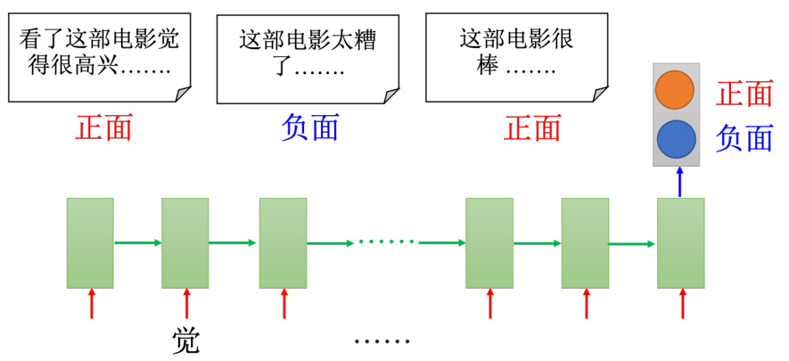  
图5.33 情感分析示例  

用RNN 来作关键术语抽取（key term extraction）。关键术语抽取意思就是说给机器看一个文章，机器要预测出这篇文章有哪些关键单词。如图5.34 所示，如果能够收集到一些训练数据(一些文档，这些文档都有标签，哪些单词是对应的，那就可以直接训练一个RNN)，那这个RNN 把文档当做输入，通过嵌入层（embedding layer），用RNN 把这个文档读过一次，把出现在最后一个时间点的输出拿过来做注意力，可以把这样的信息抽出来再丢到前馈神经网络得到最后的输出。  

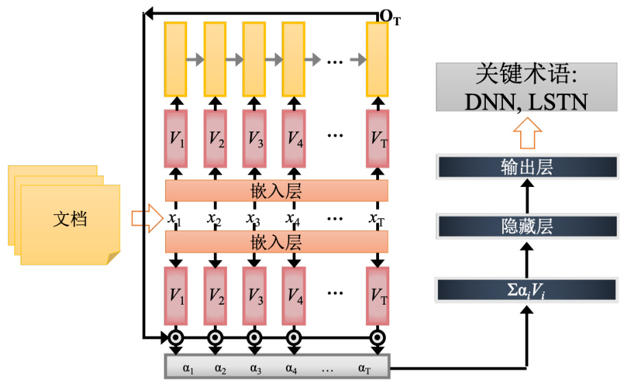  
图5.34 关键术语抽取  

### 5.8.2 多对多序列  

RNN 也可以处理多对多的问题，比如输入和输出都是序列，但输出序列比输入序列短。如图5.35 所示，在语音识别这个任务里面输入是声音序列，一句话就是一段声音信号。一般处理声音信号的方式就是在这个声音信号里面，每隔一小段时间，就把它用向量来表示。这个一小段时间是很短的（比如0.01 秒）。那输出序列是字符序列。  

如果是原来的RNN（槽填充的那个RNN），把这一串输入丢进去，它充其量只能做到，告诉我们每一个向量对应到哪一个字符。加入说中文的语音识别的话，那输出目标理论上就是这个世界上所有可能中文的单词，常用的可能是八千个，RNN 分类器的数量可能就是八千个。虽然很大，但也是没有办法做的。但是充其量只能做到说：每一个向量属于一个字符。每一个输入对应的时间间隔是很小的（0.01 秒），所以通常是好多个向量对应到同一个字符。所以识别结果为“好好好棒棒棒棒棒”，这不是语音识别的结果。有一招叫做修剪（trimming），即把重复的东西拿掉，就变成“好棒”。这样会有一个严重的问题，因为它没有识别“好棒棒”。  

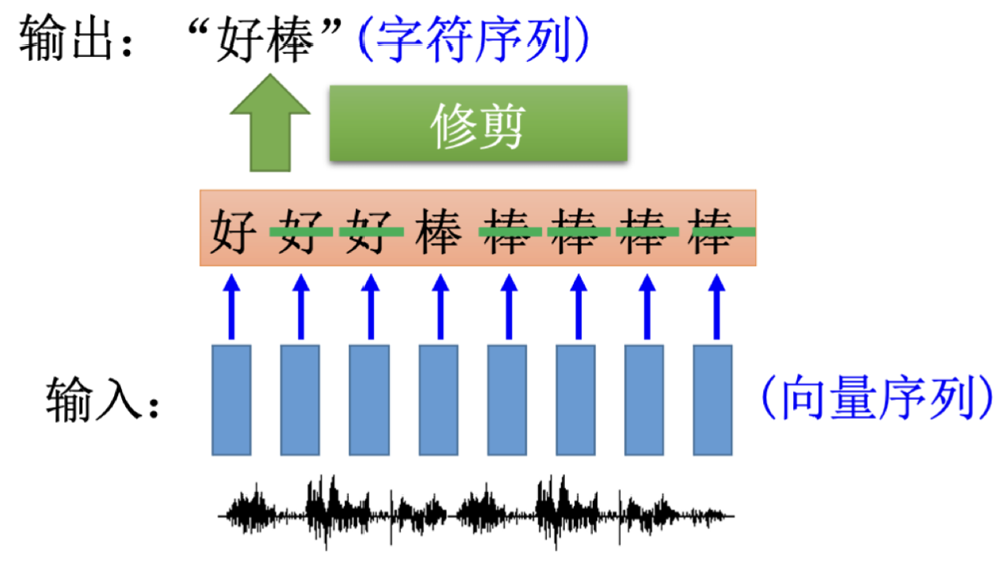
图5.35 语音识别示例  

需要把“好棒”跟“好棒棒”分开来，怎么办，有一招叫做“CTC”，如图5.36 所示，在输出时候，不只是输出所有中文的字符，还可以输出一个符号”null”，其代表没有任何东西。所以输入一段声音特征序列，它的输出是“好null null 棒null null null null”，然后把“null”的部分拿掉，它就变成“好棒”。如果我们输入另外一个序列，它的输出是“好null null 棒null 棒nullnull”，然后把“null”拿掉，所以它的输出就是“好棒棒”。这样就可以解决叠字的问题了。  

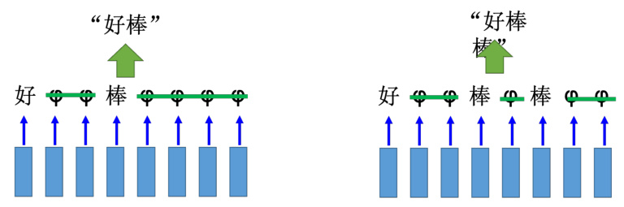  
图5.36 CTC 技巧  

CTC 怎么做训练呢？如图5.37 所示，CTC 在做训练的时候，手上的训练数据就会告诉我们说，这一串声音特征对应到这一串字符序列，但它不会告诉我们说“好”是对应第几个字符到第几个字符。这时候要穷举所有可能的对齐，简单来说，我们不知道“好”对应到那几个字符，“棒”对应到哪几个字符。假设我们所有的状况都是可能的。可能第一个是“好null 棒nullnull null”，可能是“好null null 棒null null”，也可能是“好null null null 棒null”。假设全部都是对的，一起训练。穷举所有的可能，可能性太多了。  

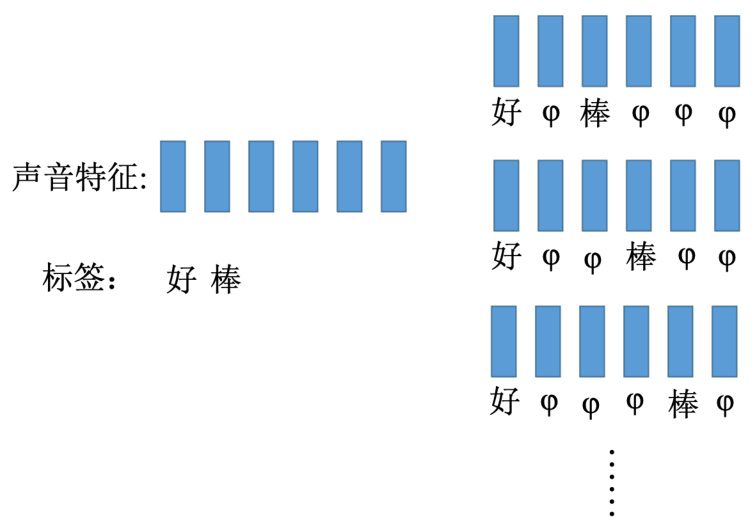  
图5.37 CTC 训练  

在做英文识别的时候，RNN 输出目标就是字符（英文的字母 $+$ 空白）。直接输出字母，然后如果字和字之间有边界，就自动有空白。如图5.38 所示，第一帧是输出H，第二帧是输出null，第三帧是输出null，第四帧是输出I 等等。如果我们看到输出是这样子话，最后把“null”的地方拿掉，这句话的识别结果就是“HIS FRIEND’S”。我们不需要告诉机器说：”HIS”是一个单词，“FRIEND’s”是一个单词, 机器通过训练数据会自己学到这件事情。如果用CTC来做语音识别，就算是有某一个单词在训练数据中从来没有出现过（比如英文中的人名或地名），机器也是有机会把它识别出来。  

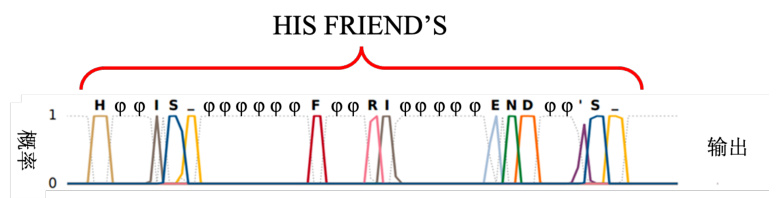  
图5.38 CTC 语音识别示例  

### 5.8.3 序列到序列  

另一个RNN 的应用是序列到序列（Sequence-to-Sequence，Seq2Seq）学习，在序列到序列学习里面,RNN 的输入跟输出都是序列(但是两者的长度是不一样的)。刚在在CTC时，输入比较长，输出比较短。在这边我们要考虑的是不确定输入跟输出谁比较长谁比较短。比如机器翻译（machine translation），输入英文单词序列把它翻译成中文的字符序列。英文和中文序列的长短是未知的。  

假如输入机器学习，然后用RNN 读过去，然后在最后一个时间点，这个记忆元里面就存了所有输入序列的信息，如图5.39 所示。  

接下来，我们让机器吐一个字符（“机”），就让它输出下一个字符，把之前的输出出来的字符当做输入，再把记忆元里面的值读进来，它就会输出“器”。那这个“机”怎么接到这个地方呢，有很多支支节节的技巧。在下一个时间输入“器”，输出“学”，然后输出“习”，然后一直输出下去，如图5.40 所示。  

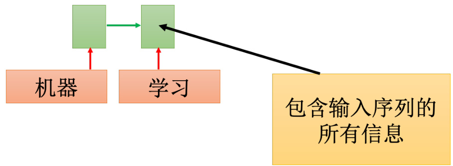  
图5.39 记忆元存储所有序列信息  

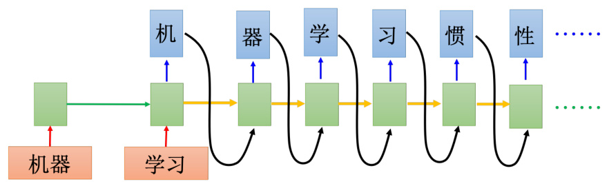  
图5.40 RNN 会一直生成字符  

要怎么阻止让它产生单词呢？要多加一个符号“断”，所以机器的输出不是只有字符，它还有一个可能输出“断”。如果“习”后面是符号 "$\mathrm{=}\mathrm{=}\mathrm{=}$" （断）的话，就停下来了，如图5.41 所示。这是训练的起来的。序列到序列学习，假设做翻译，原来是输入某种语言的文字，翻译成另外一种语言的文字。有没有可能直接输入某种语言的声音信号，输出另外一种语言的文字呢？我们完全不做语音识别。比如把英文翻译成中文，收集一大堆英文的句子，看看它对应的中文翻译。我们完全不要做语音识别，直接把英文的声音信号丢到这个模型里面去，看它能不能输出正确的中文。这一招居然是行得通的。假设要把闽南语转成英文，但是闽南语的语音识别系统不好做，因为闽南语根本就没有标准文字系统。如果训练闽南语转英文语音识别系统的时候，只需要收集闽南语的声音信号跟它的英文翻译就可以了，不需要闽南语语音识别的结果，也不需要知道闽南语的文字。  

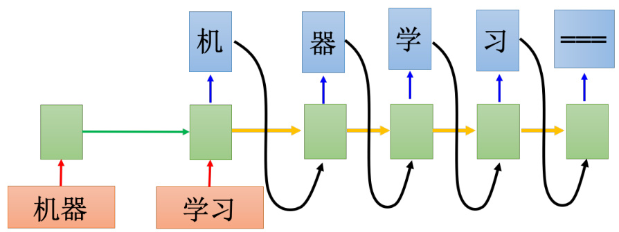  
图5.41 添加截止符号  

序列到序列的技术也被用到句法解析（syntactic parsing）。句法解析，让机器看一个句子，得到句子结构树。如图5.42 所示，只要把树状图描述成一个序列，比如：“John has a dog.”，序列到序列学习直接学习一个序列到序列模型，其输出直接就是句法解析树，这个是可以训练的起来的。LSTM 的输出的序列也是符合文法结构，左、右括号都有。  

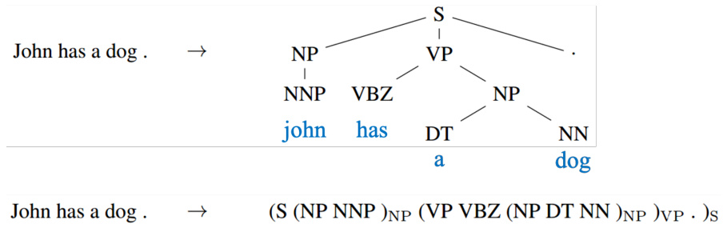  
图5.42 句法解析示例  

要将一个文档表示成一个向量，如图5.43 所示，往往会用词袋（Bag-of-Words，BoW）的方法，用这个方法的时候，往往会忽略掉单词顺序信息。举例来说，有一个单词序列是“whiteblood cells destroying an infection”，另外一个单词序列是：“an infection destroying white bloodcells”，这两句话的意思完全是相反的。但是我们用词袋的方法来描述的话，他们的词袋完全是一样的。它们里面有完全一摸一样的六个单词，因为单词的顺序是不一样的，所以他们的意思一个变成正面的，一个变成负面的，他们的意思是很不一样的。  

可以用序列到序列自编码器这种做法来考虑单词序列顺序的情况下，把一个文档变成一个向量。  

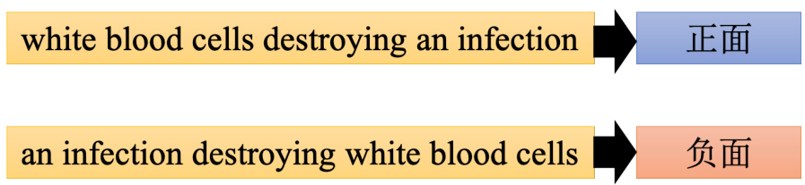  
图5.43 文档转成向量示例  

