# 第10 章 自监督学习  

自监督学习（Self-Supervised Learning，SSL）是一种无标注的学习方式，Yann LeCun最初在2019 年4 月在Facebook（后改名为Meta）上的一篇帖子上提出了“自监督学习”这个词。监督学习与无监督学习是两种常见的学习方式，如果在模型训练期间使用标注的数据，则称之为监督学习. 如果没有使用标注的数据，则称之为无监督学习. 如图10.1(a) 所示，在监督学习中只有一个模型，模型的输入是 $x$ ，输出是 $\hat{y}$ ，标签是 $y$ . 对于情感分析，监督学习就是让机器读一篇文章，机器需要对文章是正面还是负面进行分类. 我们需要有标注的数据，先找到很多文章并对所有文章进行标注. 根据文章的含义将其标注为正面或负面，正面或负面就是标签.  

我们需要有标注的文章数据来训练监督模型，而自监督学习是一种无标注的学习方式. 如图10.1(b) 所示，假设我们有未标注的文章数据，则可将一篇文章 $x$ ，将 $x$ 分为两部分：模型的输入 $x^{\prime}$ 和模型的标签 $x^{\prime\prime}$ ，将 $x^{\prime}$ 输入模型并让它输出 $\hat{y}$ ，想让 $\hat{y}$ 尽可能地接近它的标签 $x^{\prime\prime}$ （学习目标），这就是自监督学习.  

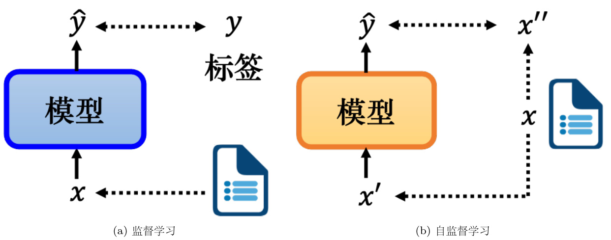  
图10.1 监督学习和自监督学习  

由于自监督学习不使用标注的数据，因此自监督学习可以看作是一种无监督学习方法. 为什么不直接称其为无监督学习？因为无监督学习是一个比较大的家族，里面有很多不同的方法，自监督学习只是其中之一. 为了使定义更清晰，称其为自监督学习.  

自监督学习的模型大多都是以芝麻街的角色命名，来让其名称缩写“凑”成电视节目《芝麻街》中的角色，以下是几个例子.  

• ELMo：来自语言模型的嵌入（Embeddings from Language Modeling），名称来自《芝麻街》的红色小怪兽Elmo，ELMo 是最早的自监督学习的模型；• BERT：来自Transformers 的双向编码器表示（Bidirectional Encoder Represen-tation from Transformers），名称来自《芝麻街》的另一个角色Bert；• BERT 提出后，马上就出现了两个不同的模型，都叫ERNIE，一个模型是知识增强的语义表示模型（Enhanced Representation through Knowledge Integration），另一个模型是具有信息实体的增强语言表示（Enhanced Language Representation withInformative Entities），名称来自Bert 最好的朋友Ernie；• Big Bird：较长序列的Transformer（Transformers for Longer Sequences，Big  

Bird），名称来自《芝麻街》的黄色大鸟Big Bird.  

如表10.1 所示，自监督模型的参数都很大. Megatron 的参数量是生成式预训练-2（Gen-erative Pre Training-2，GPT-2）的8 倍左右.GPT-3 的参数量是Turing NLG 的10 倍. 目前最大的模型是谷歌的Switch Transformer，其参数量比GTP-3 大了10 倍.  

表10.1 自监督模型的参数量  

| 模型 | 参数量 |
| ELMo | (M) 94 |
| BERT | 340 |
| GPT-2 | 1542 |
| Megatron | 8000 |
| T5 | 11000 |
| Turing NLG | 17000 |
| GPT-3 | 175000 |
| Switch Transformer | 1600000 0 (1.6T) |

这里我们主要介绍两种典型的自监督学习模型：BERT 和GPT  

## 10.1 来自Transformers 的双向编码器表示（BERT）  

BERT 模型是自监督学习的经典模型，如图10.2 所示，BERT 是一个Transformer 的编码器，BERT 的架构与Transformer 的编码器完全相同，里面有很多自注意力和残差连接、归一化等等. BERT 可以输入一行向量，输出另一行向量. 输出的长度与输入的长度相同.  

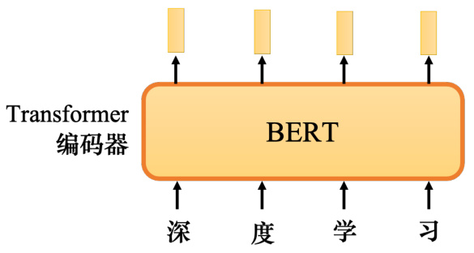  
图10.2 BERT 的架构  

BERT 一般用在自然语言处理中，用在文本场景中，所以一般它的输入是一个文本序列，也是一个数据序列. 不仅文本是一种序列，语音也可以看作是一种序列，甚至图像也可以看作是一堆向量. 因此BERT 不仅可以用在自然语言处理中，也用在文本中，它还可以用于语音和视频. 因为BERT 最早是用在文本中，所以这里都以文本为例（语音或图像也都是一样的）. BERT 的输入是一段文字. 接下来需要随机掩码一些输入文字，被掩码的部分是随机决定的.例如，输入100 个词元. 什么是词元？词元是处理一段文本时的基本单位，词元的单位大小由我们自己决定. 在中文文本中，通常将一个汉字当成一个词元. 当输入一个句子时，里面有一些单词会被随机掩码. 哪些部分需要掩码？它是随机决定的.  

有两种方法来实现掩码，如图10.3 所示. 第一种方法是用特殊符号替换句子中的单词，使用“MASK”词元来表示特殊符号，可以将其看成一个新的汉字，它不在字典里，它的意思是掩码原文. 掩码的目的是对向量中某些值进行掩盖，避免无关位置的数值对运算造成影响. 另一种方法是用另一个字随机替换一个字. 本来是“度”字，可以随机选择另一个汉字来替换它，比如改成“一”/“天”/“大”/“小”，只是用随机选择的某个字替换它. 所以有两种方法可以做掩码：  

• 添加一个名为“MASK”的特殊词元；  

• 用另一个词替换某个词.  

这两种方法都可以使用，使用哪种方法也是随机确定的. 所以在BERT 训练的时候，应该给BERT 输入一个句子，首先随机决定要掩码哪些汉字，之后，再决定如何进行掩码. 掩码部分是要被特殊符号“MASK”代替还是只是被另一个汉字代替？这两种方法都可以使用.  

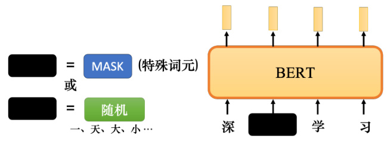  
图10.3 掩码的两种方法  

如图10.4 所示，掩码后，向BERT 输入了一个序列，BERT 的相应输出就是另一个序列.接下来，查看输入序列中掩码部分的对应输出，仍然在掩码部分输入汉字，它可能是“MASK”词元或随机单词，它仍然输出一个向量，对这个向量使用线性变换（线性变换是指输入向量会乘以一个矩阵）. 然后做softmax 并输出一个分布. 输出是一个很长的向量，包含要处理的每个汉字. 每个字对应一个分数，它是通过softmax 函数生成的分布.  

如何训练BERT 模型？如图10.5 所示，我们知道被掩码字符是哪个字符，而BERT 不知道. 因为把句子交给BERT 时，该字符被掩码了，所以BERT 不知道该字符，但我们知道掩码字符“深度”一词中的“度”. 因此，训练的目标是输出一个尽可能接近真实答案的字符，即“度”字符. 独热编码可以用来表示字符，并最小化输出和独热向量之间的交叉熵损失. 这个问题可以看成一个分类问题，只是类的数量和汉字的数量一样多. 如果汉字的数量大约在4000左右，该问题就是一个4000 类的分类问题. BERT 要做的就是成功预测掩码的地方属于的类别，在这个例子里，就是“度”类别. 在训练过程中，在BERT 之后添加一个线性模型并将它们一起训练. 所以，BERT 内部是一个Transformer 的编码器，它有一堆参数. 线性模型是一个矩阵，它也有一些参数，尽管与BERT 相比，其数量要少得多. 我们需要联合训练BERT 和线性模型并尝试预测被掩码的字.  

事实上，训练BERT 时，除了掩码之外，还有另一种方法：下一句预测（next sentenceprediction）. 我们可以通过在互联网上使用爬虫来获得的大量句子来构建数据库，然后从数据库中拿出两个句子. 如图10.6 所示，这两个句子中间加入了一个特殊的词元[SEP] 来代表它们之间的分隔. 这样，BERT 就可以知道这两个句子是不同的句子，因为这两个句子之间有一个分隔符号. 我们还将会在整个序列的最前面加入一个特殊词元分类符号[CLS].  

现在给定一个很长的序列，其中包括两个句子，中间有个[SEP] 词元，前面有一个[CLS]词元. 如果将这个很长的序列输入到BERT，它应该输出一个序列，按理说，输入是一个序列，输出应该是另外一个序列，这是编码器可以做的事情. 而BERT 就是一个Transformer 的编码器，所以BERT 可以做这件事. 我们只取与[CLS] 对应的输出，忽略其他输出，并将[CLS]的输出乘以线性变换. 现在它做一个二元分类问题，它有两个可能的输出：是或否. 这种方法是下一句预测，即需要预测第二句是否是第一句的后一句（这两个句子是不是相接的）. 如果第二句确实是后续句子（这两个句子是相接的），就要训练BERT 输出“是”. 当第二句不是后一句时（这两个句子不是相接的），BERT 需要输出“否”作为预测.  

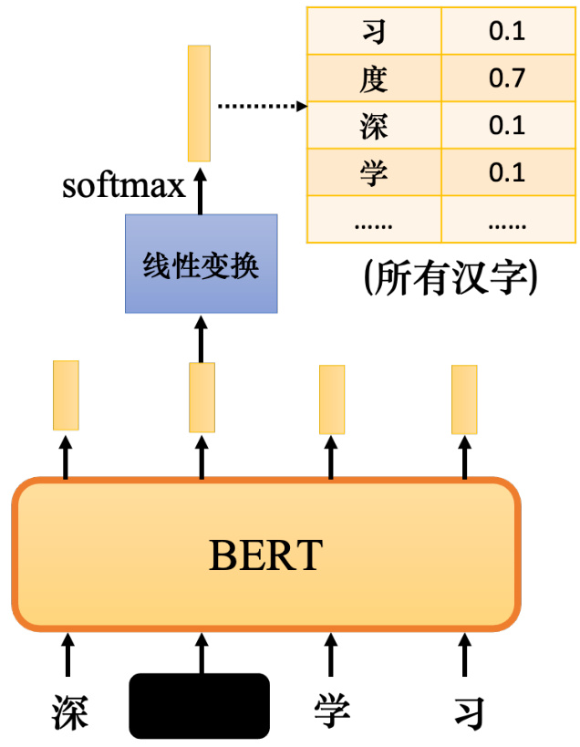  
图10.4 BERT 预测过程  

但后来的研究发现，下一句预测对BERT 将要完成的任务并没有真正的帮助. 有一篇题为“Robustly Optimized BERT Approach（RoBERTa）”的论文明确指出使用下一句预测方法几乎没有帮助，之后，这个想法以某种方式成为主流. 紧接着，另一篇论文说下一句预测没用，后来又有很多论文开始说它也没用，比如SCAN-BERT 和XLNet. 下一句预测没用的可能原因之一是下一句预测这个任务太简单了，这是一项容易的任务，预测两个句子是否相接并不是一项特别困难的任务. 此任务的通常方法是首先随机选择一个句子，然后从数据库中随机选择将要连接到前一个句子的句子. 通常，随机选择一个句子时，它很可能与之前的句子有很大不同. 对于BERT 来说，预测两个句子是否相接并不难. 因此，在训练BERT 完成下一句预测任务时，没有学到太多有用的东西.  

还有一种类似于下一句预测的方法——句序预测（Sentence Order Prediction，SOP），其在文献上似乎更有用. 这种方法的主要思想是最初选择的两个句子本来就是连接在一起，可能有两种可能：要么句子1 连接在句子2 后面，要么句子2 连接在句子1 后面，有两种可能性，BERT 要回答是哪一种可能性. 或许是因为这个任务难度更大，所以句序预测似乎更有效. 它被用于名为ALBERT 的模型中，该模型是BERT 的进阶版本.  

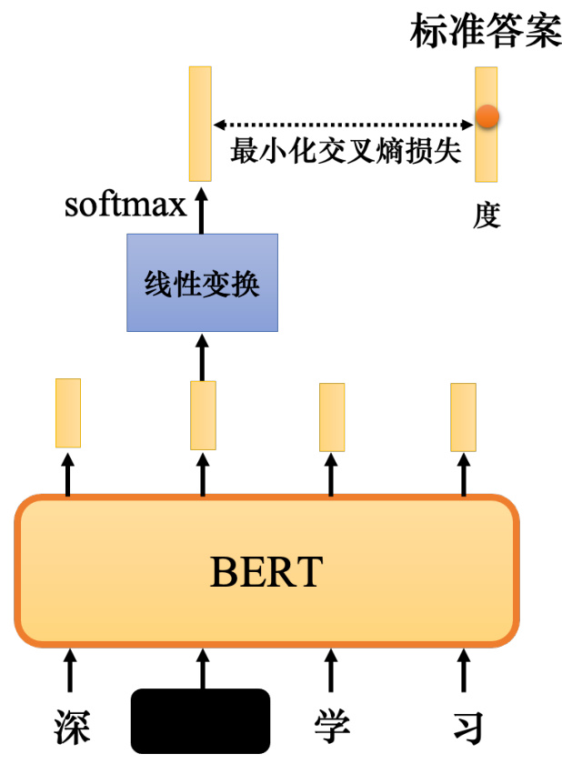  
图10.5 BERT 的训练过程  

### 10.1.1 BERT 的使用方式  

如何使用BERT？在训练时，让BERT 学习两个任务.  

• 把一些字符掩盖起来，让它做填空题，补充掩码的字符.  

• 预测两个句子是否有顺序关系（两个句子是否应该接在一起），这个任务没什么用.通过这两个任务，BERT 学会了如何填空。在训练模型填空后，也可以用于其他任务。如图10.7所示，这些任务不一定与填空有关，它可能是完全不同的东西. 尽管如此，BERT 仍然可以用于这些任务. 这些任务是真正使用BERT 的任务，可称为下游任务（downstream task）.下游任务就是我们实际关心的任务. 但当BERT 学习完成这些任务时，仍然需要一些标注的数据.  

总之，BERT 只是学会了填空，但是，后来它可以用来做各种感兴趣的下游任务. 这就像胚胎中的干细胞，胚胎干细胞可以分化成各种不同的细胞，比如心脏细胞、肌肉细胞等等.BERT 的能力还没有发挥出来，它具有各种无限的潜力，虽然它只会做填空题，但后来它具有解决各种任务的能力.  

给BERT 一些有标注的数据，它可以学习各种任务，将BERT 分化并用于各种任务称为微调（fine-tuning）. 所以微调BERT，也就是对BERT 进行微调，让它可以做某种任务.与微调相反，在微调之前产生此BERT 的过程称为预训练. 所以产生BERT 的过程就是自监督学习，也可以将其称为预训练.  

在谈如何对BERT 进行微调之前，先看看它的能力. 要测试自监督学习模型的能力，通常会在多个任务上进行测试. BERT 就像一个胚胎干细胞，它会分化为做各种任务的细胞，通常不会只测试它在单个任务上的能力，可以让BERT 分化做各种任务来查看它在每个任务上的正确率，再取个平均值. 对模型进行测试的不同任务的这种集合，可以将其称为任务集. 任务集中最著名的标杆（基准测试）称为通用语言理解评估（General Language UnderstandingEvaluation，GLUE）.  

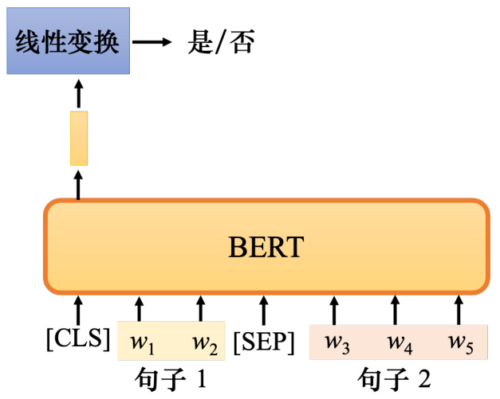  
图10.6 下一句预测  

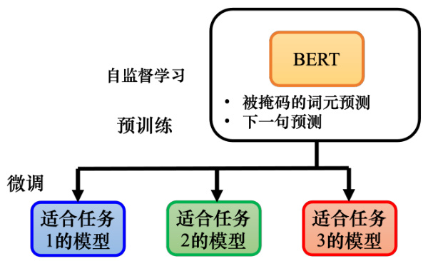  
图10.7 使用BERT 解决下游任务  

GLUE 里面一共有9 个任务：语言可接受性语料库（the Corpus of Linguistic Acceptabil-ity，CoLA），斯坦福情感树库（the Stanford Sentiment Treebank，SST-2），微软研究院释义语料库（the Microsoft Research Paraphrase Corpus，MRPC），语义文本相似性基准测试（theSemantic Textual Similarity Benchmark，STSB），Quora 问题对（the Quora Question Pairs，QQP），多类型自然语言推理数据库（the Multi-genre Natural Language Inference corpus，MNLI），问答自然语言推断（Qusetion-answering NLI，QNLI），识别文本蕴含数据集（theRecognizing Textual Entailment datasets，RTE），Winograd 自然语言推断（Winograd NLI，WNLI）.  

如果我们想知道像BERT 这样的模型是否训练得很好，可以针对9 个单独的任务对其进行微调. 因此，实际上会为9 个单独的任务获得9 个模型. 这9 个任务的平均准确率代表该自监督模型的性能. 自从有了BERT，GLUE 分数（9 个任务的平均分）确实逐年增加.  

如图10.8 所示，横轴表示不同的模型，除了ELMo 和GPT，还有各种BERT. 黑线表示人类在此任务上得到的正确率，可将其视为1. 图10.8 的每个点代表一个任务. 为什么要把它与人类的准确性进行比较？人类的正确率是1. 如果他们比人类好，这些点的值会大于1. 如果他们比人类差，这些点的值会小于1. 用于每个任务的评估指标是不同的，不一定是正确率.  

如果直接比较这些点的值，没什么意思，所以要看模型跟人类之间的差距. 在最初的时候，9 个任务中只有1 个任务，机器比人类做得更好. 随着越来越多的技术被提出，越来越多的其他任务可以比人类做得更好. 对于那些远不如人类的任务，机器的性能也在慢慢追赶. 蓝色曲线表示机器的GLUE 分数的平均值. 最近的一些强模型，例如XLNET，甚至超过了人类，但这并不意味着机器真的超越了人类。XLNET 在这些数据集中超越了人类，这意味着这些数据集还不够难. 在GLUE 之后，有人制作了Super GLUE，让机器解决更难的自然语言处理任务.  

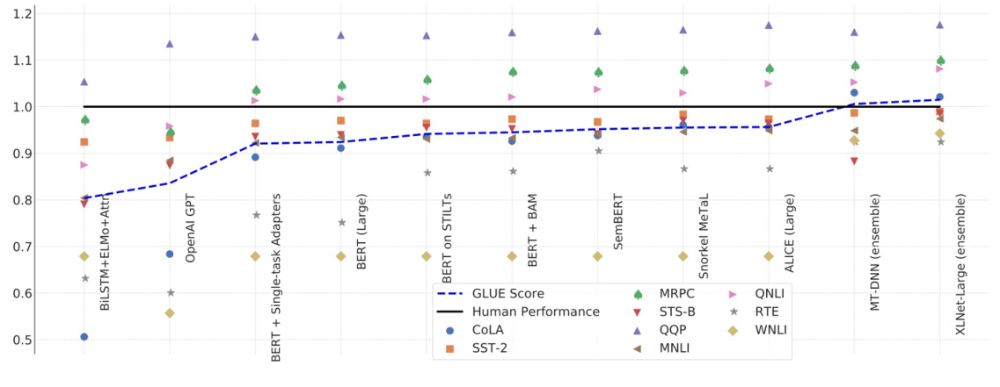  
图10.8 BERT 的训练过程  

BERT 究竟是如何使用的？接下来介绍下4 个使用BERT 的情况.  

情况1：情感分析  

假设下游任务是输入一个序列并输出一个类别. 这是一个分类问题，只是输入是一个序列.输入一个序列并输出一个类是一种什么样的任务？例如，情感分析，给机器一个句子，并告诉它判断句子是正面的还是负面的. 对于BERT，它是如何解决情感分析的问题的？如图10.9所示，只要给它一个句子，把[CLS] 词元放在这个句子前面.[CLS]、 $w_{1}$ 、 $w_{2}$ 、 $w_{3}$ 4 个输入对应于4 个输出. 接着，对[CLS] 对应的向量应用线性变换，将其乘上一个矩阵. 这里省略了softmax，通过softmax 来确定输出类别是正面的或负面的等等. 但是，必须要有下游任务的标注数据。  

BERT 没有办法从头开始解决情感分析问题，其仍然需要一些标注数据，需要提供很多句子以及它们的正面或负面标签来训练BERT 模型. 在训练过程中，BERT 与这种线性变换放在一起，称为完整的情感分析模型. 在训练时，线性变换和BERT 模型都利用梯度下降来更新参数. 线性变换的参数是随机初始化的，而BERT 初始的参数是从学习了做填空题的BERT来的. 在训练模型时，会随机初始化参数，接着利用梯度下降来更新这些参数，最小化损失.  

但在BERT 中不必随机初始化所有参数，随机初始化的参数只是线性变换的参数. BERT的骨干（backbone）是一个巨大的Transformer 编码器，该网络的参数不是随机初始化的. 这里直接拿已经学会填空的BERT 的参数当作初始化的参数，最直观和最简单的原因是它比随机初始化参数的网络表现更好. 把学会填空的BERT 放在这里时，它会获得比随机初始化的BERT 更好的性能.  

如图10.10 所示，横轴是训练的回合，纵轴是训练损失. 随着训练的进行，损失会越来越低. 图10.10 有各种各样的任务，任务的细节不需要关心. “微调”意味着模型有预训练. 网络的BERT 部分（网络的编码器），该部分的参数是由学会做填空的BERT 的参数来做初始化的.从头开始训练（scratch）意味着整个模型，包括BERT 和编码器部分都是随机初始化的. 虚线是从头开始训练，如果是从头开始训练，在训练网络时，与使用会做填空的BERT 进行初始化的模型相比，损失下降的速度相对较慢. 随机初始化参数的网络损失仍然高于使用填空题来初始化BERT 的网络. 所以这就是BERT 的好处.  

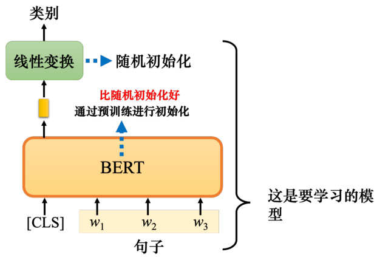  
图10.9 用BERT 做情感分析  

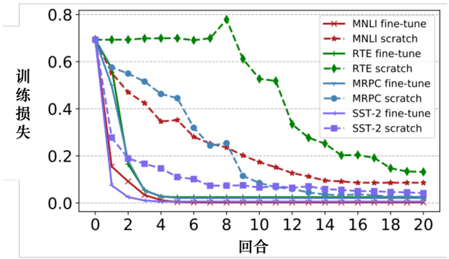  
图10.10 预训练模型的初始化结果对比  

Q：BERT 的训练方法是半监督还是无监督？  

A：在学习填空时，BERT 是无监督的. 但使用BERT 执行下游任务时，下游任务需要有标注的数据. 自监督学习会使用大量未标注的数据，但下游任务有少量有标注的数据，所以合起来是半监督. 半监督是指我们有大量的未标注的数据和少量标注数据，这种情况称为半监督. 所以使用BERT 的整个过程就是使用预训练和微调，它可以被视为一种半监督的方法.  

情况2：词性标注  

第二种情况是输入一个序列，然后输出另一个序列，但输入和输出的长度是一样的. 什么样的任务要求输入输出长度相同？例如，词性标注（Part-Of-Speech tagging，POS tagging）  

. 词性标注是指给定机器一个句子，其可以知道该句子中每个单词的词性. 即使这个词是相同的，它也可能有不同的词性.  

BERT 是如何处理词性标注任务的？如图10.11 所示，只需向BERT 输入一个句子即可.之后，对于这句话中的每个词元，如果是中文，就是每一个字，每个字都有一个对应的向量.然后把这些向量依次通过线性变换和softmax 层. 最后，网络预测给定单词所属的类别. 例如，词性. 如果任务不同，对应的类别也会不同. 接下来和情况1 完全一样. 换句话说，要有一些带标签的数据. 这仍然是一个典型的分类问题. 唯一不同的是BERT 部分，网络的编码器部分，其参数不是随机初始化的，它已经在预训练过程中找到了一组比较好的初始化的参数.  

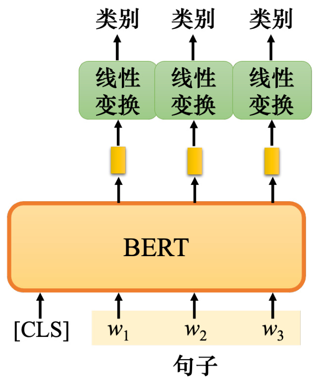  
图10.11 用BERT 做词性标注  

情况3：自然语言推理  

在情况3 中，模型输入两个句子并输出一个类别. 这里的例子都是自然语言处理的例子，但可以将这些例子更改为其他任务，例如语音任务或计算机视觉的任务. 语音、文本和图像可以表示为一行向量，因此该技术不仅限于处理文本，还可以用于其他任务. 情况3 以两个句子作为输入，输出一个类别. 什么样的任务需要这样的输入和输出？  

最常见的一种是自然语言推理（Natural Language Inference，NLI）. 给机器两个输入语句：前提（premise）和假设（hypothesis）. 机器所做的是判断是否可以从前提中推断出假设，即前提与假设矛盾或者不矛盾？例如，如图10.12 所示，前提是“一个骑马的人跳过一架坏掉的飞机（A person on a horse jumps over a broken down airplane）”，这是一个基准语料库中的例子. 而假设是这个人在一家餐馆里（A person is at a diner），这是一个矛盾. 机器要做的就是将两个句子作为输入，输出这两个句子之间的关系. 这种任务很常见，例如，立场分析. 给定一篇文章，其下面有留言，要判断留言是赞成这篇文章的立场还是反对这篇文章的立场. 只需将文章和留言一起放入模型中，模型要预测的是赞成还是反对.  

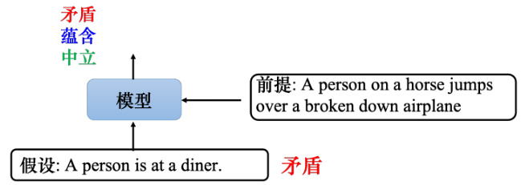  
图10.12 自然语言推理  

BERT 如何解决这个问题？如图10.13 所示，给定两个句子，这两个句子之间有一个特殊的分隔词元[SEP]，并把[CLS] 词元放在最前面的位置. 这个序列是BERT 的输入，然后BERT 将输出另一个长度与输出长度相同的序列. 但只将[CLS] 词元作为线性变换的输入，然后决定输入这两个句子，输出应该是什么类别. 对于NLI，要输出这两个句子是否矛盾，仍然需要一些标注的数据来训练这个模型. BERT 的这部分不再是随机初始化的，它使用预训练的权重进行初始化.  

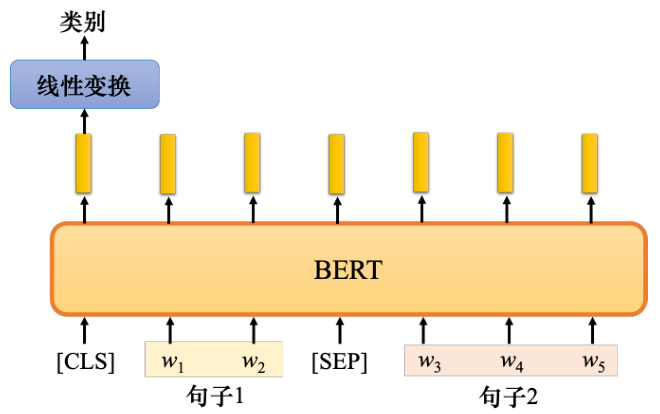  
图10.13 使用BERT 进行自然语言推理  

情况4：基于提取的问答  

第四个情况是问答系统，给机器读一篇文章，问它一个问题，它就会回答一个答案. 但这里的问题和答案有些限制，假设答案必须出现在文章里面，答案一定是文章中的一个片段，这是基于提取的问答（extraction-based question answering）. 在此任务中，输入序列包含一篇文章和一个问题. 文章和问题都是一个序列：  

$$
\begin{array}{l}{{D=\{d_{1},d_{2},\cdot\cdot\cdot\,,d_{N}\}}}\\ {{\quad Q=\{q_{1},q_{2},\cdot\cdot\cdot\,,q_{M}\}}}\end{array}
$$

对于中文，式(10.1) 中每个 $d$ 代表一个汉字，每个 $q$ 代表一个汉字.  

如图10.14 所示，将 $D$ 和 $Q$ 放入问答模型中，希望它输出两个正整数 $s$ 和 $e$ . 根据 $s$ 和$e$ 可以直接从文章中截出一段就是答案，文章中第 $s$ 个单词到第 $e$ 个单词的片段就是正确答案. 这是当今使用的一种非常标准的方法.  

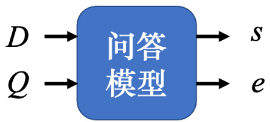  
图10.14 问答模型  

例如，如图10.15 所示，这里有一个问题和一篇文章，正确的答案是“重力（gravity）”. 机器如何输出正确答案？问答模型应该输出 $s=17$ 并且 $e=17$ 来表示重力，因为重力是整篇文章的第17 个字. 所以 $s=17$ ， $e=17$ 表示输出第17 个单词作为答案. 再举个例子，答案是“云中（within a cloud）”，其是文章的第77 到79 个字，模型要做的就是输出两个正整数77和79，文章中第77 个词到第79 个词的文字就是模型的答案.  

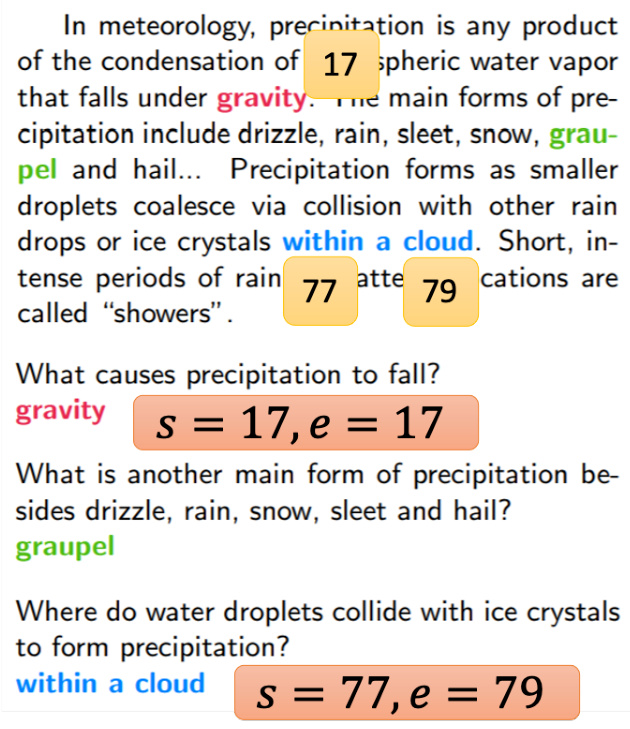  
图10.15 基于提取的问答  

当然，我们不会从头开始训练问答模型，而会使用BERT 预训练模型. 如何用预先训练好的BERT 解决这种问答问题呢？如图10.16 所示，给BERT 看一个问题、一篇文章. 问题和文章之间有一个特殊标记[SEP]. 然后在开头放了一个[CLS] 词元，这与自然语言推理的情况相同. 在自然语言推理中，一个句子是前提，一个句子是结论，而在这里，一个是文章，一个是问题. 在此任务中，唯一需要从头开始训练的只有两个向量（“从头开始训练”是指随机初始化），我们使用橙色向量和蓝色向量来表示它们，这两个向量的长度与BERT 的输出是相同的.  

假设BERT 的输出是768 维向量，这两个向量也就是768 维向量. 如何使用这两个向量呢？如图10.16(a) 所示，首先计算橙色向量和文档对应的输出向量的内积（inner product）.由于有3 个词元代表文章，因此它将输出3 个向量. 计算这3 个向量与橙色向量的内积可以得到3 个值. 然后将它们传递给softmax 函数，将得到另外3 个值. 这种内积与注意力非常相似. 如果把橙色部分可以视为查询，把黄色部分视为键，这就是一种注意力，应该尝试找到得分最高的位置. 橙色向量和 $d_{2}$ 的内积最大，则 $s$ 应等于2，输出的起始位置应为2.  

如图10.16(b) 所示，蓝色部分代表答案结束的地方. 计算蓝色向量和文章对应的黄色向量的内积，接着对内积使用softmax 函数. 最后，找到最大值. 如果第3 个值最大， $e$ 应为3.正确答案是 $d_{2}$ 和 $d_{3}$ ，所以模型要做的实际上是预测正确答案的起始位置，因为答案一定在文章里. 如果文章中没有答案，就不能使用这个技巧. 这里假设答案一定在文章中，必须在文章中找到答案的起始位置和结束位置. 这是问答模型需要做的. 当然，我们需要一些训练数据才能训练这个模型. 请注意，蓝色和橙色向量是随机初始化的，而BERT 是由其预训练的权重初始化的.  

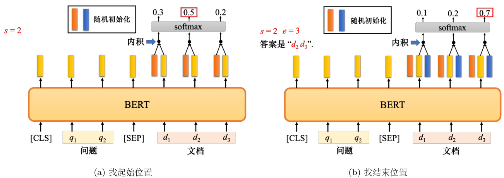  
图10.16 使用BERT 来进行问答  

Q：BERT 的输入长度有限制吗？  

A：理论上没有. 实际上有，理论上，因为BERT 模型是一个Transformer 编码器，所以它可以输入很长的序列. 只要我们有能力做自注意力. 但是自注意力的运算量很高，所以在实践中，BERT 无法真正输入太长的序列，最多可以输入512 长度的序列. 如果输入一个512 长度的序列，中间的自注意力即将生成512 乘以512 大小的注意力度量（metric），计算量会非常大，所以实际上BERT 的长度不是无限长的.  

因为用一篇文章训练需要很长时间，所以文章会被分成几个段落，每一次只取其中一个进行训练，不会将整篇文章输入到BERT 中. 因为如果想要的距离太长，就会在训练中遇到问题. 填空题和问答两件事之间有什么关系？BERT 所能做的事情不仅仅是填空，但我们无法自己训练它. 首先是最早的谷歌BERT，它训练使用的数据量已经很大了，它使用的数据包含了30 亿个词汇. 哈利波特全集大约有100 万词汇，其是哈利波特全集的3000 倍. 最早的BERT 使用的数据量是哈利波特全集的3000 倍.  

如图10.17 所示，纵轴代表GLUE 分数，横轴代表预训练步数.GLUE 有9 个任务，9个任务的平均分数是GLUE 的分数. 绿线是谷歌原始的BERT 的GLUE 分数. 橙线是谷歌的ALBERT 的GLUE 分数，ALBERT 是BERT 的进阶版本，其参数量相比BERT 大大减少. 蓝线是李宏毅团队训练的ALBERT，但是李宏毅团队训练的并不是最大的版本. 原始的BERT 有基础版本（BERT-base）和大版本（BERT-large）.BERT-large 很难训练，所以用最小的版本（ALBERT-base）来训练，看看它是否与谷歌的结果相同.  

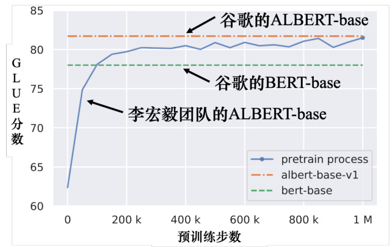  
图10.17 使用ALBERT 训练GLUE  

30 亿数据看起来很多，但它是未标注的数据. 从网络上随便爬取一堆文字就可以有这么多数据，但训练的部分很困难. 总共的预训练步数为一百万次，也就是参数需要更新一百万次. 如果使用TPU，则需要运行8 天；如果使用一般的GPU，这个至少需要运行200 天.  

训练这种BERT 模型真的很难，可以在一般的GPU 上对其进行微调，在一般的GPU上微调，BERT 只需要大约半小时到一个小时. 但如果从头开始训练它. 也就是训练它做填空题，这将花费太多时间，而且无法在一般的GPU 上完成. 为什么要自己训练一个BERT？谷歌已经训练了BERT，这些预训练模型也是公开的. 如果训练BERT 的结果和谷歌的BERT差不多，这没什么意义.  

BERT 的训练过程中需要耗费非常大的计算资源，所以是否有可能节省这些计算资源，有没有可能让它训练得更快. 要知道如何让它训练得更快，或许可以先观察它的训练过程. 过去没有人观察过BERT 的训练过程，因为在谷歌的论文中只提到了BERT 在各种任务中都做得很好，  

但BERT 在学习填空的过程中学到了什么？观察在这个过程中，BERT 学会填动词、学会填名词和学会填代词的时候.所以训练BERT 之后，可以观察BERT 学会填充各种词汇的时候以及它是提高填空能力的方式. 得到的结论与想象得不太一样，大家可以参考论文“Pretrained Language Model Embryology: The Birth of ALBERT”.  

上述任务均不包括Seq2Seq模型. 如果想解决Seq2Seq 问题怎么办？BERT 只有预训练编码器，有没有办法预训练Seq2Seq 模型的解码器？如图10.18 所示，图中有一个编码器和一个解码器. 输入是一串句子，输出是一串句子. 将它们与中间的交叉注意力（cross attention）连接起来，然后对编码器的输入做一些扰动来损坏它. 解码器是想要输出的句子，跟损坏它之前是完全相同的. 编码器看到损坏的结果，然后解码器要输出还原句子被损坏之前的结果. 训练这个模型实际上是预训练一个Seq2Seq 模型.  

损坏句子的方式有多种，如图10.19 所示，有一篇是题为：“MASS: Masked Sequenceto Sequence Pre-training for Language Generation”的论文，它说损坏的方法就像BERT 那样，只要掩盖一些地方，它就结束了. 但其实有多种方法可以损坏句子. 例如，删除一些单词. 打乱词汇顺序（语序）. 把单词的顺序做个旋转. 或既插入MASK，又删除某些单词. 总之，有各种方法把输入句子损坏，再通过Seq2Seq 模型把它还原. 有一篇论文题为“BART:Denoising Sequence-to-Sequence Pre-training for Natural Language Generation, Translation,and Comprehension”. 这篇论文中把这些方法都使用上去，它的结果比MASS 更好.  

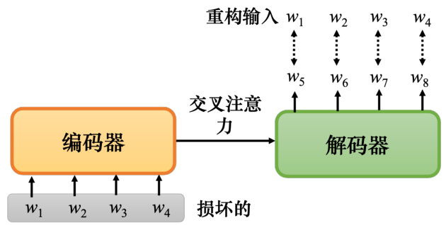  
图10.18 预训练一个Seq2Seq 模型  

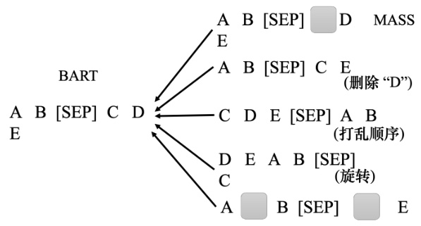  
图10.19 损坏句子的方法  

损坏的方法有很多，掩码的方法也有很多，到底哪种方法更好呢？谷歌在题为“Exploringthe Limits of Transfer Learning with a Unified Text-to-Text Transformer”的论文中做了相关的实验，并提出了预训练模型——转移文本到文本的Transformer（Transfer Text-to-TextTransformer，T5）.  

这篇论文做了各种尝试，完成了可以想象的所有组合. T5 是在巨大干净的爬取语料库（Colossal Clean Crawled Corpus，C4）上进行训练的. C4 是一个公开数据集，可以下载它，但其原始文件大小为7 TB，下载完它，也不一定有足够的存储空间来保存它. 下载完成后，可以通过谷歌提供的脚本进行预处理. 语料库网站上的文档说使用一个GPU 进行预处理需要355 天，即使下载完成，预处理时也是有问题的. 所以，做深度学习使用的数据量和模型非常惊人.  

### 10.1.2 BERT 有用的原因  

为什么BERT 有用？最常见的解释是，当输入一串文字时，每个文字都有一个对应的向量，这个向量称为嵌入. 如图10.20 所示，这个向量很特别，因为这个向量代表了输入字的意思. 例如，模型输入“深度学习”，输出4 个向量. 这4 个向量代表“深”、“度”、“学”和“习”的意思.  

把这些字对应的向量一起画出来并计算它们之间的距离，意思越相似的字，它们的向量就越接近. 如图10.21 所示，例如，“果”和“草”都是植物，它们的向量就比较接近. “鸟”和“鱼”是动物，所以它们可能更接近. “电”既不是动物也不是植物，所以比较远. 中文会有歧义（一字多义），很多语言也都有歧义. BERT 可以考虑上下文，所以同一个字，例如“果”这个字，它的上下文不同，它的向量是不会一样的. 所以吃苹果的果和苹果手机的果都是“果”，但根据上下文，它们的意思不同，所以他们对应的向量就会不一样. 吃苹果的“果”可能更接近“草”，苹果手机的“果”可能更接近“电”.  

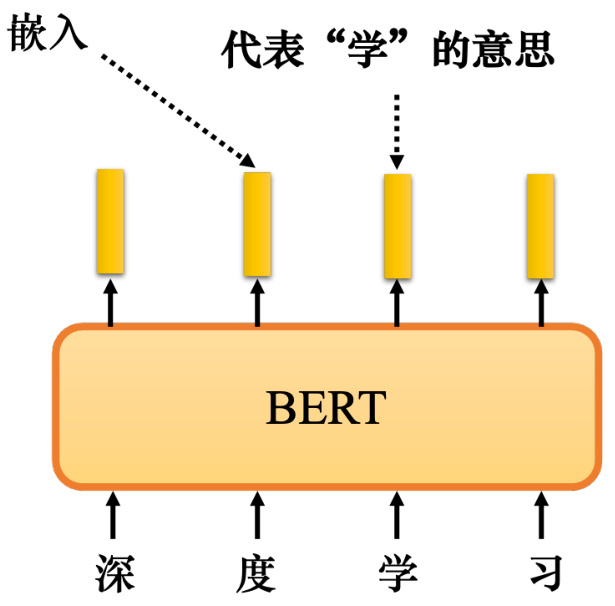  
图10.20 BERT 输出的嵌入代表了输入的字的意思  

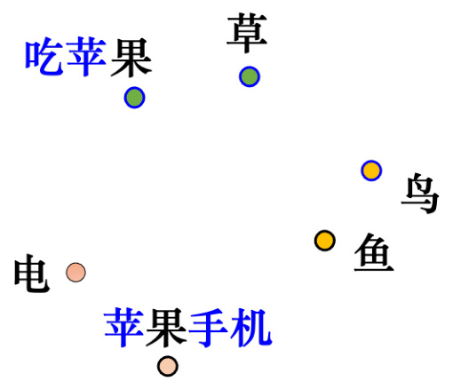  
图10.21 意思相近的字，嵌入更接近  

如图10.22 所示，假设现在考虑“果”这个字，收集很多提到“果”字的句子，比如“喝苹果汁”、“苹果电脑”等等. 把这些句子都放入BERT 里面，接下来，再去计算每个“果”对应的嵌入.输入“喝苹果汁”得到“果”的向量. 输入“苹果电脑”，也得到“果”的向量. 这两个向量不会相同.因为编码器中有自注意力，所以根据“果”字的不同上下文，得到的向量会不同. 接下来，计算这些向量之间的余弦相似度，即计算它们的相似度，结果是这样的.  

如图10.23 所示，这里有10 个句子，前5 句中的“果”代表可以吃的苹果. 例如，第一句话是“今天买了苹果吃”. 这五个句子都有“果”这个字. 接下来的五个句子也有“果”这个字，但都是指苹果公司的“果”. 例如，“苹果即将在下个月发布一款新iPhone.”这边有10 个“果”，两两之间去计算相似度，得到一个 $10\times10$ 的矩阵.  

图10.23 中的每一格代表两个“果”的嵌入之间的相似度. 相似度的值越大，颜色越浅. 前五句中的“果”接近黄色，自己跟自己算相似度，一定是最大的. 自己跟别人的相似度一定要小一些. 前五个“果”算相似度较高，后五个“果”算相似度也较高. 但是前五个“果”和后五个“果”的相似度较低. BERT 知道前五个“果”指的是可以吃的苹果，所以它们比较像. 后五个“果”指的是苹果公司的“果”，所以它们比较像. 但这两堆“果”的意思是不一样的. 所以BERT 的每个输出向量代表输入字的意思，BERT 在填空的过程中学会了每个字的意思. 也许它真的理解中文，对它而言，中文的符号不再是没有关系的. 因为它了解中文的意思，所以它可以在接下来的任务中做得更好.  

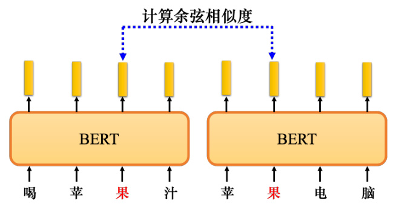  
图10.22 计算余弦相似度  

为什么BERT 可以输出代表输入字意思的向量？1960 年代的语言学家John Rupert Firth提出了一个假设，他说要知道一个词的意思，就要看这个词的“公司（company）”，也就是经常和它一起出现的词汇，也就是它的上下文. 一个词的意思取决于它的上下文. 以苹果中的“果”为例，如果它经常与吃、树等一起出现，它可能指的是可以吃的苹果；如果经常与电、专利、股价等一起出现，可能指的是苹果公司. 因此，可以从上下文中推断出单词的意思.  

如图10.24 所示，而BERT 在学习填空的过程中所做的，也许就是学习从上下文中提取信息. 训练BERT 时，给它 $w_{1}$ 、 $w_{2}$ 、 $w_{3}$ 和 $w_{4}$ ，掩码 $w_{2}$ ，并告诉它预测 $w_{2}$ . 它如何预测 $w_{2}$ ？它会从上下文中提取信息来预测 $w_{2}$ . 所以这个向量就是它的上下文信息的精华，可以用来预测 $w_{2}$ 是什么.  

如图10.25 所示，这样的想法在BERT 之前就已经存在了. 有一种技术是词嵌入，词嵌入中有一种技术称为连续词袋（Continuous Bag Of Words，CBOW）. 连续词袋模型所做的与BERT 完全相同，把中间挖空，预测空白处的内容. 连续词袋模型可以给每个词汇一个向量，代表词汇的意思. 连续词袋模型是一个非常简单的模型，它使用了两个变换.  

Q：为什么CBOW 只用两个变换？能不能再复杂点？为什么连续词袋模型只用线性，不用深度学习?  

A：连续词袋模型的作者Thomas Mikolov 的解释是可以用深度学习，他之所以选择线性模型是因为当时的计算能力（computing power）和现在的数量级不一样，当时还很难训练一个非常大的模型，所以他选择了一个比较简单的模型. 而BERT 相当于一个深度版本的连续词袋模型.  

BERT 还可以根据不同的上下文从相同的词汇中产生不同的嵌入，因为它是词嵌入的高级版本，考虑了上下文. BERT 抽取的这些向量或嵌入也称为语境化的词嵌入（contextualizedword embedding）. 训练在文字上的BERT 也可以用来对蛋白质、DNA 和音乐进行分类.以DNA 链的分类问题为例. 如图10.26 所示，DNA 由脱氧核苷酸组成，脱氧核苷酸由碱基、脱氧核糖和磷酸构成. 其中碱基有4 种：腺嘌呤（A）、鸟嘌呤（G）、胸腺嘧啶（T）和胞嘧啶（C）. 给定一条DNA，尝试确定该DNA 属于哪个类别（EI、IE 和N 是DNA 的类别）. 总之，这是一个分类问题，只需用训练数据和标注数据来训练BERT 就可以了.  

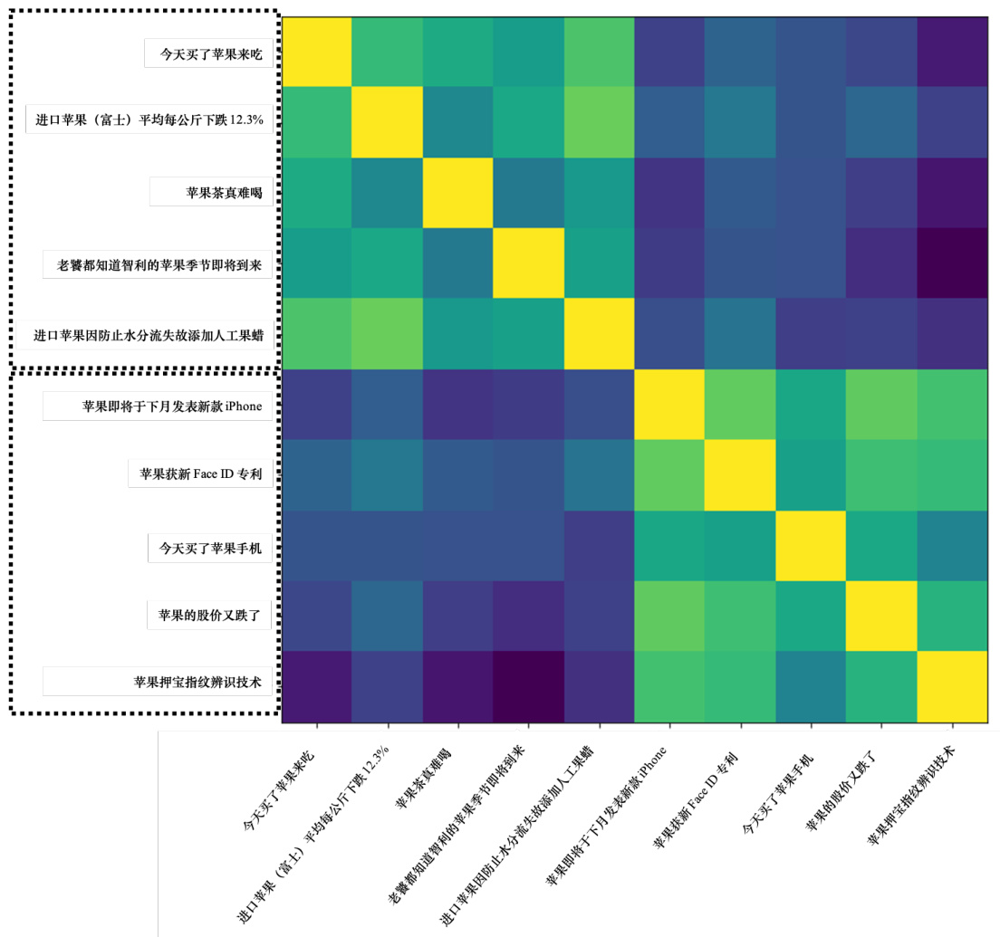  
图10.23 余弦相似度的计算结果  

如图10.27 所示，DNA 可以用ATCG 表示，每个字母可以对应到一个英语单词，例如，“A”是“we”，“T”是“you”，“C”是“he”，“G”是“she”. 对应的单词并不重要，可以随机生成它们. “A”可以对应任何单词，“T”、“C”和“G”也可以，这并不重要，对结果影响不大. 一串DNA 可以变成一串单词，只是这串文字看不懂而已. 例如，“AGAC”变成“we she we he”. 然后，将这串文字放入BERT 中，一样有[CLS]，产生一个向量，然后通过线性变换，一样进行分类，只是分类是DNA 的类别. 和以前一样，线性变换使用随机初始化，BERT 由预训练模型初始化. 但是用于初始化的模型是在英文上学会做填空题的BERT.  

如果将DNA 序列预处理成一个无意义的序列，那么BERT 的目的是什么？BERT 可以分析有效句子的语义，怎么能给它一个难以理解的句子？做这个实验有什么意义？蛋白质是由氨基酸组成的，有十几种氨基酸，给每种氨基酸随便一个词汇. DNA 就是一组ATCG，音乐也是一组音符，可以给每个音符随便一个词汇，将其作为文章分类问题来做，使用BERT 的结果实际上更好[1].  

BERT 可以学到语义，从嵌入中可以清楚地观察到BERT 确实知道每个单词的意思，它知道哪些词汇意思比较像，哪些单词意思比较不像. 即使给它一个乱七八糟的句子，它仍然可以很好地对句子进行分类. 所以也许它的能力并不完全来自他看得懂文章这件事，可能还有其他原因. 例如，BERT 可能本质上只是一组比较好的初始化参数，它不一定与语义有关，也许这组初始参数比较适合训练大型模型，这个问题需要进一步的研究来回答. 目前使用的模型往往是非常新的，它们为什么能成功运作，还有很大的研究空间.  

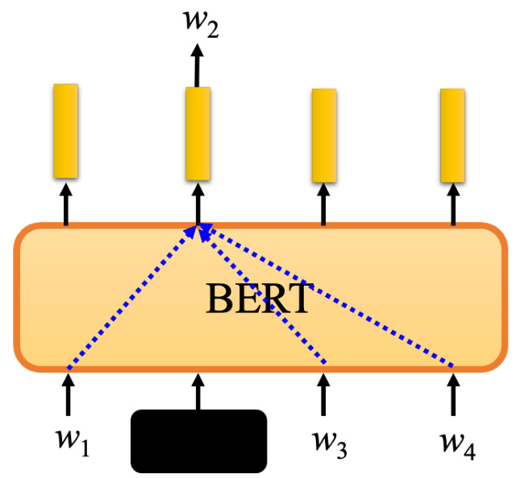  
图10.24 通过上下文信息预测掩码部分  

### 10.1.3 BERT 的变种  

BERT 还有很多其他的变种，比如多语言BERT（multi-lingual BERT）. 如图10.29所示，多语言BERT 使用中文、英文、德文、法文等多种语言进行训练BERT 做填空题. 谷歌发布的多语言BERT 使用104 种不同的语言进行训练，所以它可以做104 种语言的填空题.  

多语言BERT 有一个非常神奇的功能，如果用英文问答数据训练它，它会自动学习如何做中文问答. 表10.2 所示是一个真实实验的例子. 这个例子使用了两种数据集进行微调：英文问答数据集——SQuAD 和台达电的中文数据集——DRCD. 实验中所采用的是F1 分数（F1score），其也称为综合分类率. 在BERT 提出之前，结果并不好. 在BERT 之前，最强的模型是QANet，QANet 的F1 分数为 $78.1\%$ . 如果允许使用中文进行预训练做填空题，然后使用中文问答数据进行微调，BERT 在中文问答测试集上的F1 分数将达到 $89.1\%$ . 事实上，人类在同一个数据集上只能做 $93\%$ ，所以其表现跟人差不多. 神奇的是，如果使用一个多语言的BERT，用英文问答数据对其进行微调，它仍然可以回答中文问答问题，并且有 $78\%$ 的F1 分数，这和QANet 的F1 分数差不多！从未受过中英互译训练，也从未阅读过中文问答数据集.它在没有任何准备的情况下参加了这次中文问答测试.  

有的人可能会说：“多语言BERT 在预训练的时候看了104 种语言，其中包括中文”. 但是在预训练期间，多语言BERT 的学习目标是做填空题，它只学会了中文填空，接下来教它做英文问答，它居然自动学会了中文问答. 一个简单的解释是：对于多语言的BERT，不同的语言的差异不大.  

如图10.30 所示，不管使用中文还是英文，对于意思相同的词，它们的嵌入都会很近. 所以兔子和rabbit 的嵌入很近，跳和jump 的嵌入很近，鱼和fish 的嵌入很近，游和swim 的嵌入很近. 也许多语言BERT 在看过大量语言的过程中自动学会了这件事情.  

如图10.31 所示，我们可以做一些验证. 验证的标准称为平均倒数排名（Mean ReciprocalRanking，MRR）. MRR 的值越高，不同语言的嵌入对齐就越好. 更好的对齐意味着具有相同含义但来自不同语言的单词，它们的向量是接近的. MRR 越高，则同样意思不同语言的单词的向量就越接近.  

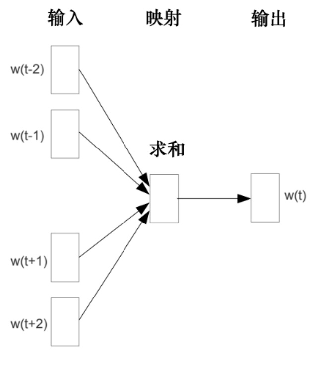  
图10.25 连续词袋模型  

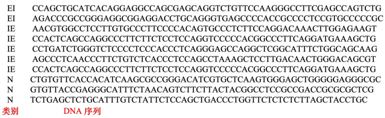  
图10.26 DAN 分类问题  

图10.31 的纵轴是MRR，越高越好. 最右边的深蓝线是谷歌发布的104 种语言的多语言BERT 的MRR，它的值非常高. 这代表对该多语言BERT 来说，不同语言没有太大区别.多语言BERT 只是看意思，不同语言对它来说没有太大区别. 李宏毅团队最先使用的数据较少，每种语言只使用了20 万个句子，训练的模型的结果并不好. 之后，李宏毅团队给每种语言 $1000~\mathrm{K}$ 数据. 有了更多的数据，多语言BERT 可以学习对齐. 所以数据量是不同语言能否成功对齐的关键因素，很多现象只有在数据量足够时才会显现出来. 过去没有模型具有多语言能力，可以在A 语言中进行问答训练，直接转移到B 语言，一个可能的原因是过去没有足够的数据。  

BERT 可以将不同语言中具有相同含义的符号放在一起，并使它们的向量很接近. 但是在训练多语种BERT 的时候，如果给它英文，就可以用英文填空. 如果给它中文，它可以用中文填空，它不会混合在一起. 如果对它来说，不同语言之间没有区别，怎么可能只用英语标记来填充英语句子呢？给它一个英文句子，为什么它不会用中文填空？但是它没有这样做，这意味着它知道语言的信息. 那些来自不同语言的符号毕竟还是不同的，它不会完全抹掉语言  

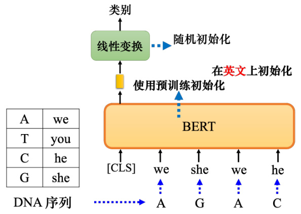  
图10.27 使用BERT 进行DNA 分类  

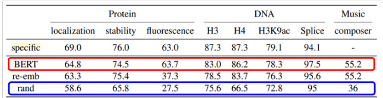  
图10.28 使用BERT 处理不同任务  

信息，语言信息可以被找到.  

语言信息并没有隐藏很深，把所有的英文单词丢到多语言BERT 中，把它们的嵌入平均起来. 如图10.32 所示，把所有中文的嵌入平均起来，两者相减就是中文和英文之间的差距.给多语言BERT 一个英文句子并得到它的嵌入，把这些嵌入加上蓝色的向量，这就是英文和中文的差距. 对多语言BERT 来说，这些向量就变成了中文的句子. 要求它填空时，它实际上可以用中文填答案.  

多语种BERT 可以做一个很棒的无监督翻译，如图10.33 所示，把“The girl that can helpme is all the way across town. There is no one who can help me.”这句话扔进多语种BERT.再把蓝色的向量加到BERT 的嵌入上，本来BERT 读到的是英文句子的嵌入，加上蓝色向量，BERT 会觉得它读到的是中文的句子. 然后，教他做填空题，把嵌入变成句子以后，它得到的结果如图10.33 的表表示，可以某种程度上做到无监督词元级翻译（unsupervised token-leveltranslation）. 这不是很好的翻译，多语言BERT 表面上看起来把不同语言、同样意思的单词拉得很近，但是语言的信息还是藏在多语言BRRT 里面.  

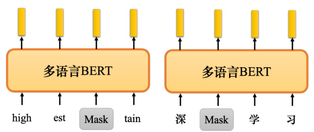  
图10.29 多语言BERT  

表10.2 使用多语言BERT 进行问答[2]  

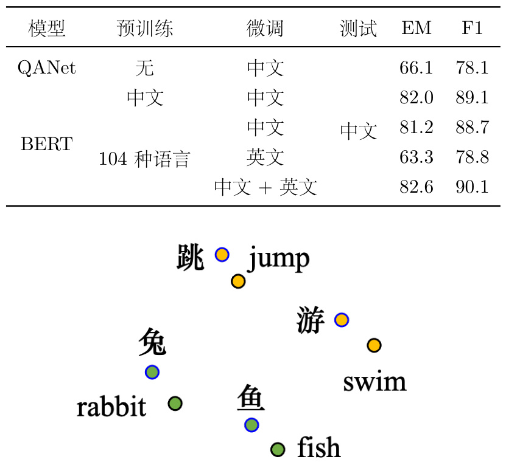  
图10.30 多语言BERT 对比  

## 10.2 生成式预训练（GPT）  

在自监督学习中，除了BERT 系列的模型，还有一个非常有名的模型—–GPT 系列的模型. BERT 做的是填空题，而GPT 就是改一下在自监督学习的时候要模型做的任务. GPT要做的任务是预测接下来会出现的词元. 如图10.34 所示，例如，假设训练数据里面，有一个句子是“深度学习”. 给GPT 输入词元 ${}^{<}\mathrm{BOS}{>}$ （beginning of sentence），GPT 会输出一个嵌入（embedding）. 接下来用这个嵌入去预测下一个应该出现的词元. 在这个句子里面，根据这笔训练数据，下一个应该出现的词元是“深”. 训练模型时，根据第一个词元，根据 ${}^{<}\mathrm{BOS}{>}$ 的嵌入，它要输出词元“深”.  

接下来讲下这个部分的具体操作，对一个嵌入 $h$ 进行一个线性变换，再进行一个softmax操作可以得到一个分布.跟一般做分类的问题是一样的，输出的分布跟正确答案的交叉熵（cross entropy）越小越好. 也就是要去预测下一个出现的词元. 接下来要做的事情就是以此类推了，给GPT 输入 ${}^{-}\mathrm{BOS}{}>$ 跟“深”，它产生嵌入. 接下来它会预测下一个出现的词元，告诉它说下一个应该出现的词元是“度”. 再反复继续下去，给它 ${}^{<}\mathrm{BOS}{>}$ 、“深”和“度”，然后预测下一个应该出现的词元，它应该要预测“学”. 给GPT 输入 ${}^{<}\mathrm{BOS}{>}$ 、“深”“度”和“学”，接下来下一个应该出现的词元是“习”，因此它应该要预测出下一个应该出现的词元是“习”.  

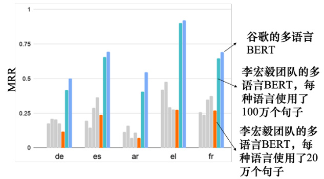  
图10.31 多语言BERT 对比[3]  

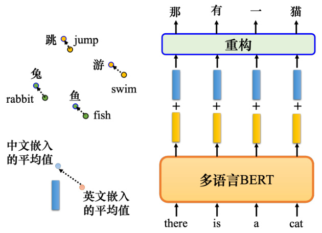  
图10.32 中英文之间的差距  

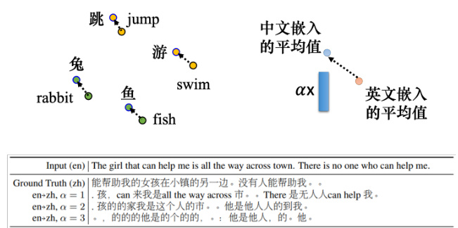  
图10.33 无监督词元级翻译  

实际上不会只用一笔句子训练GPT，而是用成千上万个句子来训练模型，GPT 用了很多数据训练了一个非常大的模型. GPT 模型建立在Transformer 的解码器的基础上，不过其会做mask 的注意力，给定 ${}^{<}\mathrm{BOS}{>}$ 预测“深”的时候，不会看到接下来出现的词汇. 给GPT“深”要预测“度”的时候，其不会看到接下来要输入的词汇，以此类推. 因为GPT 可以预测下一个词元，所以它有生成的能力，可以让它不断地预测下一个词元产生完整的文章，大家提到GPT 的时候，往往会想到独角兽. 因为GPT 系列最知名的一个例子，就是用GPT 写了一篇跟独角兽有关的假新闻，假新闻里面说在安第斯山脉发现了独角兽，  

GPT 系列可以把一句话补完，如何把一句话补完用在下游的任务上呢？例如，怎么把GPT 用在问答或者是其他的跟自然语言处理有关的任务上呢？GPT 可以跟BERT 用一样的做法，BERT 是把Transformer 编码器后面接一个简单的线性的分类器，也可以把GPT 拿出来接一个简单的分类器，这也是会有效的，但是在GPT 的论文没有这样做. GPT 模型太大了，大到连微调可能都有困难.  

在用BERT 的时候，要把BERT 模型后面接一个线性分类器，然后BERT 也是要训练的模型的一部分，所以它的参数也是要调的，只需要微调它就好了，但是微调还是要花时间的. 而GPT 实在是太过巨大，巨大到要微调它，要训练一个轮次可能都有困难. 因此GPT  

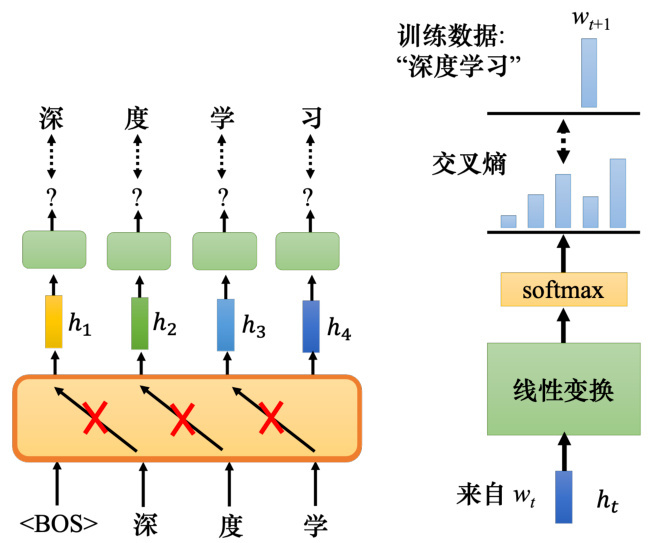  
图10.34 使用GPT 预测下一个词  

系列有一个和人类更接近的使用方式。  

如图10.35 所示，假设考生在进行托福的听力测验，首先有一个题目的说明，让考生从$\mathrm{A/B/C/D}$ 四个选项里面选出正确的答案. 给一个范例，给出题目和正确答案. 看到新的问题，期待考生就可以举一反三开始作答. 我们希望GPT 系列的模型也能够举一反三，可以进行小样本学习（few-shot learning）.  

小样本学习，即在小样本上的快速学习能力. 每个类只有 $k$ 个标注样本， $k$ 非常小.如果 $k=1$ ，称为单样本学习（one-shot learning）；如果 $k=0$ ，称为零样本学习（zero-shot learning）.  

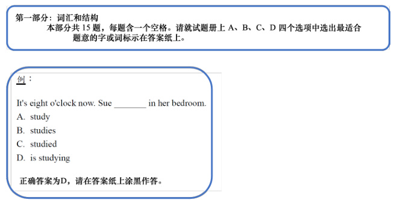  
图10.35 托福听力测验  

假设要GPT 做翻译，如图10.36(a) 所示，先输入“把英语翻译成法语（Translate Englishto French）”，这个句子代表问题的描述. 然后给它几个范例，接下来输入cheese，让它把后面的补完，希望它就可以产生翻译的结果. 在训练的时候GPT 并没有教它做翻译这件事，它唯一学到的就是给一段文字的前半段把后半段补完. 现在直接给它前半段的文字就长这个样子，让它翻译. 给几个例子，告诉模型说翻译是怎么回事，接下来输入单词cheese，后面能不能就直接得到法文的翻译结果. GPT 中的小样本学习不是一般的学习，这里面完全没有梯度下降，训练的时候就是要跑梯度下降，而GPT 中完全没有梯度下降，完全没有要去调GPT 模型参数的意思. 这种训练称为语境学习（in-context learning），代表它不是一种一般的学习，它连梯度下降都没有做.  

我们也可以给GPT 更大的挑战，在考托福听力测验的时候，都只给一个例子. 如图10.36(b)所示，也给GPT 一个例子，就知道它要做翻译这件事，也就是单样本学习. 还有更狂的是零样本学习，如图10.36(c)，直接给它一个叙述说现在要做翻译，GPT 能不能够自己就看得懂就自动知道要来做翻译. GPT 如果能够做到，就非常地惊人了. GPT 系列到底有没有达成这个目标，这是一个见仁见智的问题，它不是完全不可能答对，但是正确率有点低，相较于微调模型，正确率是有点低的.  

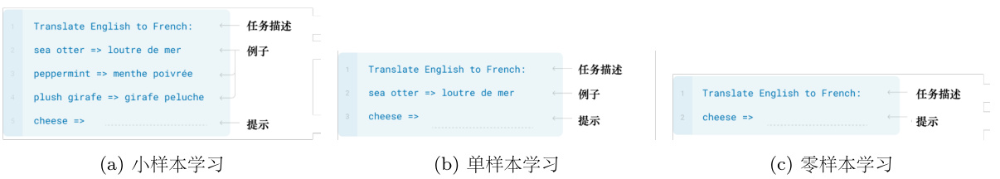  
图10.36 语境学习  

如图10.37 所示，纵轴是正确率. 第3 代的GPT（GPT-3）测试了42 个任务，3 条实线分别代表小样本、单样本跟零样本在42 个任务中的平均正确率. 横轴代表模型的大小，实验中测试了一系列不同大小的模型，从1 亿的参数到1750 亿的参数. 小样本的部分从20 几%的平均正确率一直做到50 几 $\%$ 的平均正确率. 至于50 几 $\%$ 的平均正确率算是有做起来还是没有做起来，这是个见仁见智的问题. 有些任务GPT-3 还真的学会了，例如加减法，GPT-3可以得到两个数字相加的正确结果. 但是有些任务，GPT-3 可能怎么学都学不会. 例如一些跟逻辑推理有关的任务，它的结果就不如人意.  

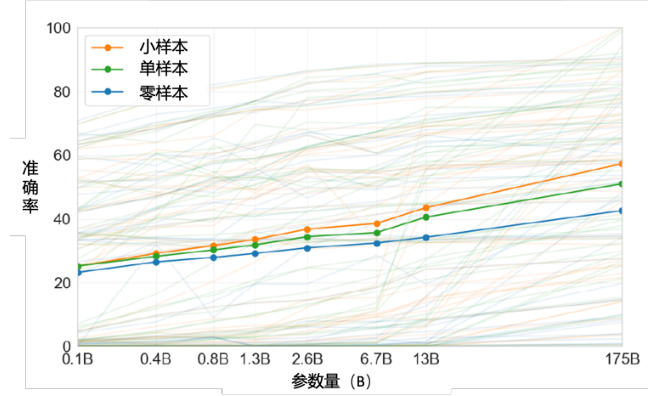  
图10.37 使用GPT-3 进行语境学习  

如图10.38 所示，自监督学习不仅可以用在文字上，还可以用在语音和计算机视觉（Com-puter Vision，CV）上. 自监督学习的技术很多，BERT 跟GPT 系列只是自监督学习的方法的其中一种，它们是属于预测那一类. 计算机视觉中比较典型的模型是SimCLR 和BYOL. 在语音也可以使用自监督学习的概念，可以试着训练语音版的BERT. 怎么训练语音版的BERT呢？我们就看看文字版的BERT 是怎么训练的，例如，做填空题，语音也可以做填空题，就把一段声音信号盖起来，叫机器去猜盖起来的部分是什么，语音也可以预测接下来会出现的内容. GPT 就是预测接下来要出现的词元，语音也可以让模型预测接下来会出现的声音. 所以我们也可以做语音版的GPT，语音版的BERT 都已经有很多相关的研究成果了.  

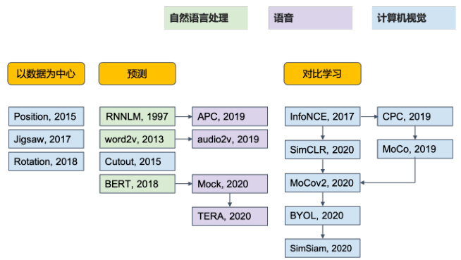  
图10.38 其他领域的自监督学习  

在自然语言处理的领域，有GLUE 语料库，这个基准的资料库里面有9 个自然语言处理的任务. 要知道BERT 做得好不好，就让它去跑那9 个任务，再去取平均值来代表这个自监督学习模型的好坏. 在语音上，有个类似的基准语料库——语言处理通用性能基准（Speechprocessing Universal PERformance Benchmark，SUPERB），可以认为其是一个语音版的GLUE，这个基准语料库里面包含了10 个不同的任务。  

语音有非常多不同的方向，语音相关的技术不只是把语音识别把声音转成文字. 语音包含了非常丰富的信息，除了有内容的信息（就是我们说了什么），还有其他的信息，例如这句话是谁说的，这个人说这句话的时候，他的语气是什么样，还有这句话背后它到底有什么样的语意. 所以SUPERB 里有10 个不同的任务，这些任务有不同的目的，包括去检测一个模型能够识别内容的能力、识别谁在说话的能力、识别他是怎么说的能力，甚至是识别这句话背后语意的能力，从全方位来检测一个自监督学习的模型在理解人类语言上的能力. 而且有一个工具包（toolkit）——s3prl，这个工具包里面就包含了各式各样的自监督学习的模型，它可以做的各式各样语音的下游的任务. 因此自监督学习的技术，不仅能被用在自然语言处理上，还可以用在计算机视觉和语音上.  

