# 第11 章 自编码器  

在讲自编码器（autoencoder）之前，其实自编码器也可以算是自监督学习的一环，因此我们可以再简单回顾一下自监督学习的框架。如图11.1 所示，首先你有大量的没有标注的数据，用这些没有标注的数据，你可以去训练一个模型，你必须设计一些不需要标注数据的任务，比如说做填空题或者预测下一个词元等等，这个过程就是自监督学习，有时也叫做预训练。用这些不用标注数据的任务学完一个模型以后，它可能本身没有什么作用，比如BERT模型只能做填空题，GPT 模型只能够把一句话补完，但是你可以把它用在其他下游的任务里面。  

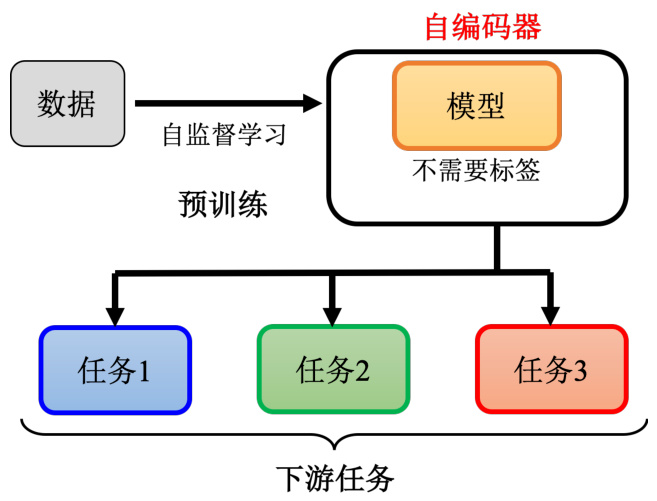  
图11.1 自监督学习框架  

在有BERT 或者GPT 模型之前，其实有一个更古老的，不需要用标注数据的任务，就叫做自编码器，所以你也可以把自编码器看作是一种自监督学习的预训练方法。当然可能不是所有人都会同意这个观点，有人可能会说这个自编码器，不算是自监督学习。因为这个自编码器是早在2006 年就有的概念，然后自监督学习是2019 年才有这个词汇，所以他们认为自编码器不算是自监督学习的一环。这个都是见仁见智的问题，这种名词定义的问题，我们就不用太纠结在这个地方，从自监督学习，即不需要用标注数据来训练这个角度来看，自编码器我们可以认为它算是自监督学习中的一种方法，它就跟填空或者预测接下来的词元是很类似的概念，只是用的是另外一种不一样的思路。  

## 11.1 自编码器的概念  

自编码器的原理，以图像为例，如图11.2 所示，假设我们有非常大量的图片，在自编码器里面有两个网络，一个叫做编码器，另外一个叫做解码器，它们是不同的两个网络。编码器把一张图片读进来，它把这张图片变成一个向量，编码器可能是很多层的卷积神经网络（CNN），把一张图片读进来，它的输出是一个向量，接下来这个向量会变成解码器的输入。而解码器会产生一张图片，所以解码器的网络架构可能会像是GAN 里面的生成器，它是比如11 个向量输出一张图片。  

训练的目标是希望编码器的输入跟解码器的输出越接近越好。换句话说，假设你把图片看作是一个很长的向量的话，我们就希望这个向量跟解码的输出，这个向量，这两个向量他们的距离越接近越好，也有人把这件事情叫做重构（reconstruction）。因为我们就是把一张图片，压缩成一个向量，接下来解码器要根据这个向量，重建出原来的图片，希望原输入的结果跟重建后的结果越接近越好。讲到这里读者可能会发现说，这个概念其实跟前面讲的CycleGAN 模型是类似的。  

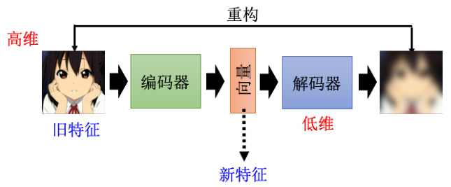  
图11.2 自编码器的流程  

在做Cycle GAN 的时候，我们会需要两个生成器，第一个生成器把X 域的图片转到Y域，另外一个生成器把Y 域的图片转回来，然后希望最原先的图片跟转完两次后的图片越接近越好。那这边编码器和解码器，也就是这个自编码器的概念，跟Cycle GAN 其实是一模一样的，都是希望所有的图片经过两次转换以后，要跟原来的输出越接近越好，而这个训练的过程，完全不需要任何的标注数据，你只需要收集到大量的图片，你就可以做这个训练。因此它是一个无监督学习的方法，跟自监督学习系列中预训练的做法一样，你完全不需要任何的标注数据。那像这样子这个编码器的输出，有时候我们叫它嵌入。嵌入也称为表示或编码，因为编码器是一个编码，所以这个有人把这个向量叫做编码，这些其实指的都是同一件事情。  

怎么把训练好的自编码器用在下游的任务里面呢？常见的用法就是把原来的图片可以看成是一个很长的向量，但这个向量太长了不好处理，这是把这个图片丢到编码器以后，输出另外一个向量，这个向量我们会让它比较短，比如说只有10 维或者100 维。接着拿这个新的向量来做接下来的任务，也就是图片不再是一个很高维度的向量，它通过编码器的压缩以后，变成了一个低维度的向量，我们再拿这个低维度的向量，来做接下来想做的事情，这就是自编码器用在下游任务的常见做法。  

由于通常编码器的输入是一个维度非常高的向量，而其输出也就是我们的嵌入（也称为表示或编码），其是一个非常低维度的向量。比如输入是 $100\times100$ 的图片， $100\times100$ 那就是1 万维的向量。如果是RGB 那就是3 万维的向量，但是通常编码器我们会设得很小，比如说10、100 这样的量级，所以这个这边会有一个特别窄的部分，本来输入是很宽的，输出也是很宽的，但是中间特别窄，因此这一段就叫做瓶颈。而编码器做的事情，是把本来很高维度的东西，转成低维度的东西，把高维度的东西转成低维度的东西又叫做降维。  

## 11.2 为什么需要自编码器？  

自编码器到底好在哪里？当我们把一个高维度的图片，变成一个低维度的向量的时候，到底带来什么样的帮助呢？我们来设想一下，自编码器这件事情它要做的，是把一张图片压缩又还原回来，但是还原这件事情为什么能成功呢？如图11.3 所示，假设本来图片是 $3\times3$ 的维度，此时我们要用9 个数值来描述一张 $3\times3$ 的图片，假设编码器输出的这个向量是二维的，我们怎么才可能从二维的向量去还原 $3\times3$ 的图片，即还原这9 个数值呢？怎么有办法把9 个数值变成2 个数值，又还原成3，又还原回9 个数值呢？  

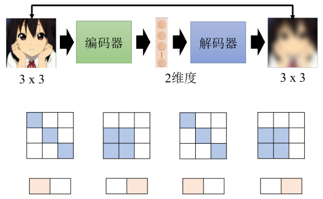  
图11.3 自编码器的原理  

能够做到这件事情是因为，对于图像来说，并不是所有 $3\times3$ 的矩阵都是图片，图片的变化其实是有限的，你随便采样一个随机的噪声，随便采样一个矩阵出来，它通常都不是你会看到的图片。举例来说，假设图片是 $3\times3$ 的，那它的变化，虽然表面上应该要有 $3\times3$ 个数值，才能够描述 $3\times3$ 的图片，但是也许它的变化实际上是有限的。也许我们把图片收集起来发现，它实际上只有如图11.3 所示的白色和橙色方块两种类型。一般在训练的时候就会看到这种状况，就是因为图片的变化还是有限的。因此我们在做编码器的时候，有时只用两个维度就可以描述一张图片，虽然图片是 $3\times3$ ，应该用9 个数值才能够储存，但是实际上它的变化也许只有两种类型，那你就可以说看到这种类型，我就左边这个维度是1 ，右边是0，看到这种类型就左边这个维度是0，右边这个维度是1。  

而编码器做的事情就是化繁为简，有时本来比较复杂的东西，它实际上只是表面上看起来复杂，而本身的变化是有限的。我们只需要找出其中有限的变化，就可以将它本来比较复杂的东西用更简单的方法来表示。如果我们可以把复杂的图片，用比较简单的方法来表示它，那我们就只需要比较少的训练数据，在下游的任务里面，我们可能就只需要比较少的训练数据，就可以让机器学到，这就是自编码器的概念。  

自编码器从来就不是一个新的概念，它具有悠长的历史。举例来说，深度学习之父Hinton早在2006 年的Science 论文里面就有提到自编码器这个概念，只是那个时候用的网络跟今天我们用的有很多不一样的地方。那个时候自编码器的结构还不太成熟，当时人们还并不认为深度的神经网络是能够训练起来的，换句话说就是把网络叠很多层，然后每一层一起训练的方法是不太可能成功的，因此人们普遍认为每一层应该分开训练，所以Hinton 用的是一个叫做受限玻尔兹曼机（Restricted Boltzmann Machine，RBM）的技术。  

这里我们特别把Hinton 教授2006 年的文章里面的图拿出来给大家展示一下过去人们是怎么看待深度学习这个问题的。那个时候要训练一个很深的网络不太可能，每一层分开要训练，虽然这个在现在看来很深也没有很深，只是三层，但是在2006 年这个已经是很深的了。那这个三层要分开来训练才可以，那这边说分开来训练这件事情叫做预训练。但它跟自监督学习中的预训练又不太一样，假设自编码器是预训练，那么这里的预训练就相当于是预训练中的预训练，这里预训练倾向于训练流程的概念，自编码器的预训练倾向于算法流程的概念。这里预训练是要先训练自编码器，每一层用RBM 的技术分开来训练。先把每一层都训练好，再全部接起来做微调这件事情，这边的微调也并不是BERT 模型的微调，它是微调那个预训练的模型。这个RBM 技术我们会发现今天很少有人在提到它了，它其实不是一个深度学习的技术，它有点复杂，我们也没有打算要深入细讲，至于为什么现在都很少人用它，就是因为它没有什么用。但是在2006 年，还是有必要用到这个技术的。其实Hinton 后来在2012 年的时候，有一篇论文呢偷偷在结尾下一个结论说其实RBM 技术也没有什么必要，所以后来就没有什么人再用这个技术了。而且那时候还有一个神奇的信念，即编码器和解码器，它们的结构必须是对称，所以编码器的第一层，跟解码器的最后一层，它们必须对应，不过现在已经没有或者说比较少这样的限制。总之，自编码器从来就不是一个新的概念。  

## 11.3 去噪自编码器  

自编码器有一个常见的变体，叫做去噪自编码器（denoising autoencoder）。如图11.4所示，去噪自编码器就是把原来需要输入到编码器的图片，加上一些噪声，然后一样地通过编码器，再通过解码器，试图还原原来的图片。  

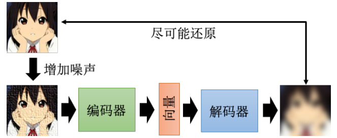  
图11.4 去噪自编码器的结构  

我们现在还原的，不是编码器的输入，编码器的输入的图片是有加噪声的，我们要还原的不是加入噪声之前的结果。所以我们会发现现在编码器跟解码器，除了还原原来的图片这个任务以外，它还多了一个任务，这个任务就是它必须要自己学会把噪声去掉。编码器看到的是有加噪声的图片，但解码器要还原的目标是，没有加噪声的图片，所以编码器加上解码器，他们合起来必须要联手能够把噪声去掉，这样你才能够把去噪的自编码器训练出来。  

其实去噪自编码器也不算是太新的技术，至少在2008 年的时候，就已经有相关的论文了。如果读者看BERT 模型的话，其实也可以把它看成一个去噪自编码器。输入我们会加掩码，掩码其实就是噪声，BERT 的模型就是编码器，它的输出就是嵌入。在讲BERT 的技术的时候，我们说这个输出就叫做嵌入，接下来有一个线性的模型，就是解码器，解码器要做的事情，就是还原原来的句子，也就是把填空题被盖住的地方，把它还原回来，所以我们可以说，BERT 其实就是一个去噪的自编码器。有读者可能会问，为什么这个解码器一定要是线性的呢，其实它不一定要是线性模型。或者换一个说法，如图11.5 所示，这个BERT 它有12 层，最小的那个BERT 有12 层，比较大的有24 层或者是48 层，那最小的BERT 是12 层，如果我们说这个12 层中间，第6 层的输出是嵌入，那其实也可以说剩下的6 层，就是解码器。可以说BERT，就假设在用BERT 的时候，我们用的不是第12 层的输出，而是第6 层的输出，那完全可以说，BERT 的前6 层就是编码器，后面6 层就是解码器，总之这个解码器没有一定要是线性的。  

## 11.4 自编码器应用之特征解耦  

自编码器可应用于在特征解耦（feature disentanglement）。解耦是指把一堆本来纠缠在一起的东西把它解开。为什么需要解耦？我们先看一下自编码器做的事情，如图11.6 所示，如果是图片的话，就是把一张图片变成一个编码，再把编码变回图片，既然这个编码可以变回图片，代表说这个编码里面有很多的信息，包含图片里面所有的信息。举例来说，图片里面的色泽、纹理等等。自编码器这个概念也不是只能用在图像上，如果用在语音上，可以把一段声音丢到编码器里面，变成向量再丢回解码器，变回原来的声音，代表这个向量包含了语音里面所有重要的信息，包括这句话的内容是什么，就是编码器的信息，还有这句话是谁说的，就是语者的信息。如果是一篇文章，丢到编码器里面变成向量，这个向量通过解码器会变回原来的文章，那这个向量里面有什么，它可能包含文章里面，文句的句法的信息，也包含了语义的信息，但是这些信息是全部纠缠在一个向量里面，我们并不知道一个向量的哪些维度代表了哪些信息。  

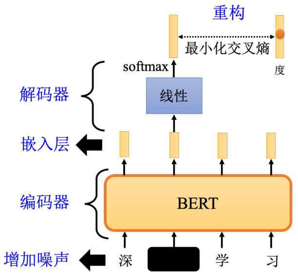  
图11.5 BERT 模型回顾  

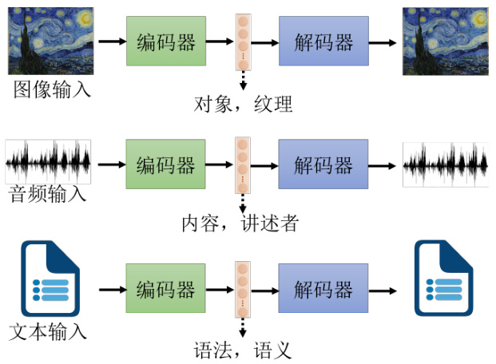  
图11.6 自编码器模型回顾  

而特征解耦想要做到的事情就是，我们有没有可能想办法，在训练一个自编码器的时候，同时有办法知道嵌入（又称为表征或编码）的哪些维度代表了哪些信息。比如100 维的向量，知道前50 维就代表了这句话的内容，后50 维就代表了这句话说话人的特征，这种对应的技术称为特征解耦。  

再举一个特征解耦方面的应用，叫做语音转换，如图11.7 所示。也许读者们没有听过语音转换这个词汇，但是一定看过它的应用，它就相当于是柯南的领结变身器。阿笠博士在做这个变声期也就是语音转换的时候，需要成对的声音信号，也就是假设要把A 的声音转成B的声音，就必须把A 跟B 都找来，叫他念一模一样的句子。  

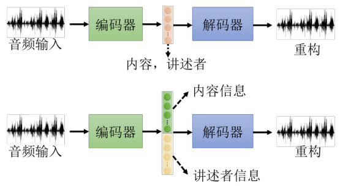  
图11.7 特征解耦应用之语音转换  

如图11.8 所示，A 说好“How are you”，B 也说好“How are you”，A 说“Good morning”，B 也说“Good morning”，他们两个各说一样的句子，说个1000 句，接下来就交给自监督学习去训练了。即现在有成对的数据，训练一个自监督模型，把A 的声音丢进去，输出就变成B的声音。但是如果A 跟B 都需要念一模一样的句子，念个500 或者1000 句，显然是不切实际的。  

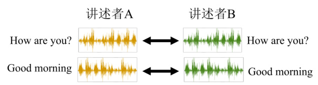  
图11.8 语音转换的挑战  

有了特征解耦的技术以后，我们可以期待机器做到，给它A 的声音和B 的声音，A 跟B不需要念同样的句子，甚至不需要讲同样的语言，机器也有可能学会把A 的声音转成B 的声音。实际的做法如图11.9 所示，假设收集到一大堆人类的声音信号，使用这堆声音信号训练一个自编码器，同时又做了特征解耦，所以我们就知道了在编码器的输出里面，哪些维度代表了语音的内容，哪些维度代表了讲述者的特征，这样就可以把两句话的声音跟内容的部分互换。  

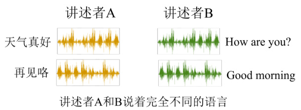  
图11.9 语音转换中特征解耦的作用  

举例来说，如图11.10 所示，讲述者A 的声音（“How are you？”）丢进编码器以后，就可以知道这个编码器的输出里面，某些维度代表“How are you？”的内容，某些维度代表讲述者A 的声音。把讲述者B 的声音丢进编码器里面，它就知道某一些维度代表讲述者B 说的话的内容，某一些维度代表讲述者B 声音的特征。接下来只要把讲述者A 说话的内容的部分取出来，把讲述者B 说话的声音特征的部分取出来，把它拼起来，丢到解码器里面，就可以用讲  

述者A 的声音，讲讲述者B 说的话的内容。  

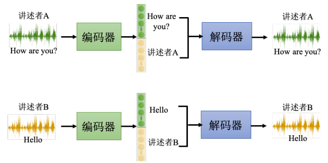  
图11.10 在语音转换中使用特征解耦  

## 11.5 自编码器应用之离散隐表征  

自编码器还可以用于离散隐表征。目前为止我们都假设嵌入是一个向量，这样就是一串实数，那它可不可以是别的东西呢？如图11.11 所示，它可以是二进制，好处就是每一个维度就代表了某种特征的有无。比如输入的图片，如果是女生，可能第一维就是1，男生第一维就是0；如果有戴眼镜，就是第三维是1，没有戴眼镜第三维就是是0。嵌入也可以变成二进制，变成只有0 跟1 的数字，可以让我们在解释编码器输出的时候更为容易。嵌入也可以是独热向量，只有一维是1，其他就是0。  

如果强迫嵌入是独热向量，也就是每一个东西图片丢进去，嵌入里面只可以有一维是1，其他都是0，也许可以做到无监督的分类。比如我们想要做手写数字识别任务，有0 到9 的图片，把这些图片统统收集起来训练一个自编码器，强迫中间的隐表征，也就是中间的这个编码一定要是独热向量。这个编码正好设个10 维，这10 维就有10 种可能的独热的编码，也许每一种正好就对应到一个数字。因此如果用独热向量来当做嵌入，也许就可以做到完全在没有标注数据的情况下让机器自动学会分类。  

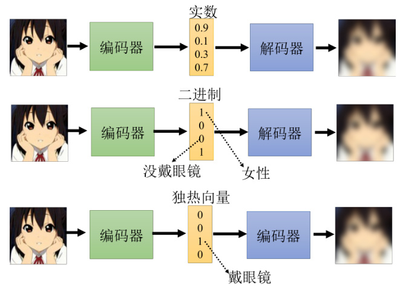  
图11.11 嵌入的多种表示  

其实这种离散的表征技术中，最知名的就是向量量化变分自编码器（vector quantized-variational autoencoder）。它运作的原理就是输入一张图片，然后编码器输出一个向量，这个向量它是一般的向量，并且是连续的，但接下来有一个码本，所谓码本的意思就是一排向量，如图11.12 所示。这排向量也是学出来的，把编码器的输出，去跟这排向量计算一个相似度，然后就会发现这其实跟自注意力有点像，上面这个向量就是查询，下面这些向量就是键，那接下来就看这些向量里面，谁的相似度最大，把相似度最大的那个向量拿出来，让这个键跟那个值共用同一个向量。  

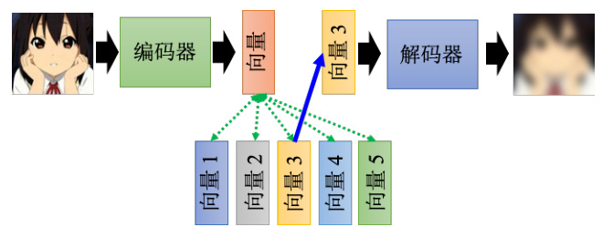  
图11.12 向量量化变分自编码器示例  

如果把这整个过程用自注意力机制来比喻的话，那就等于是键跟值是共同的向量，然后把这个向量丢到解码器里面，然后要它输出一张图片，然后接下来训练时让输入跟输出越接近越好。其中解码器，编码器和码本，都是一起从数据里面被学出来的，这样做的好处就是可以有离散的隐表征，也就是说这边解码器的输入一定是那个码本里面的向量的其中一个。假设码本里面有32 个向量，那解码器的输入就只有32 种可能，相当于让这个嵌入编程离散的，它没有无穷无尽的可能，只有32 种可能而已。这种技术如果把它用在语音上，就是一段声音信号输进来，通过编码器之后产生一个向量，接下来去计算这个相似度，把最像的那个向量拿出来丢给解码器，再输出一样的声音信号，这个时候就会发现说其中的码本可以学到最基本的发音部位。比如最基本的发音单位，又叫做语音，相当于英文的音标或者中文的拼音，而这个码本里面每一个向量，它就对应到某一个发音，就对应到音标里面的某一个符号，这个就是VQ-VAE 的原理。  

其实还有更多疯狂的想法，比如这个表征一定要是向量的形式吗，能不能是一段文字？答案是可以的。如图11.13 所示，假设我们现在要做文字的自编码器，这其实跟语音或者图像没有什么不同，就是有一个编码器，然后把一篇文章丢进去，也许产生一个什么东西比如一个向量，把这个向量丢到解码器中，再让它还原原来的文章。但我们现在可不可以不要用向量来当做嵌入，可不可以说我们的嵌入就是一串文字呢？  

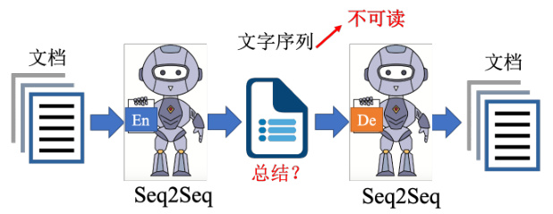  
图11.13 文字形式的离散隐表征  

如果把嵌入变成一串文字又有什么好处呢？也许这串文字就是文章的摘要，如果把一篇文章丢到编码器里面，它输出一串文字，而这串文字，可以通过解码器还原成原来的文章，那代表说这段文字，是这篇文章的精华，即最关键的内容，或者说就是摘要。不过这里的编码器显然是需要一个Seq2Seq 的模型，比如Transformer。因为我们编码器这边输入是文章，输出是一串文字，而解码器输入是一串文字，输出是文章。这些都是输入一串东西，输出一串东西，输入一串文字，输出一串文字，所以编码器跟解码器显然都必须要是一个Seq2Seq 的模型。它不是一个普通的自编码器，而是一个Seq2Seq 的自编码器，它把长的语句转成短的句子，再把短的语句还原回长的语句，而这个自编码器在训练的时候，不需要标注的数据。因为训练这个自编码器只需要收集大量的文章，收集大量没有标注的数据即可。  

如果真的可以训练出这个模型，如果这串文字真的可以代表摘要的话，也就是让机器自动学会做摘要这件事，让机器自动学会做无监督的总结任务真的有这么容易吗？实际上这样训练起来以后发现是行不通的，为什么呢？因为这两个编码器和解码器之间，会发明自己的暗号，它会产生一段文字，那这段文字是我们看不懂的，而我们看不懂的文字解码器可以看得懂，它还原得了原来的文章，但是人看不懂，所以它根本就不是一段摘要。这个时候要怎么办呢？再用GAN 的概念，如图11.14 所示，加上一个判别器，判别器看过人写的句子，所以它知道人写的句子长什么样子，但这些句子不需要是这些文章的摘要。然后编码器要想办法去骗过这个判别器，比如想办法产生一段句子，这段句子不只可以通过解码器还原回原来的文章，还要是判别器觉得像是人写的句子，期待通过这个方法就可以强迫编码器不只产生一段编码可以给解码器去破解，而是产生一段人看得懂的摘要。  

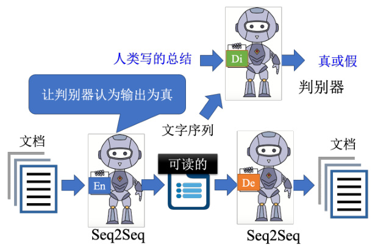  
图11.14 Cycle GAN 自编码解析文字  

那读者可能会问说这个网络要怎么训练呢？这个输出是一串文字，这个文字要怎么接给判别器，跟这个解码器呢？这个时候就可以用强化学习解决。读者可能会觉得这个概念有点像CycleGAN，这其实根本就是CycleGAN，我们期待通过生成器和判别器使得输入跟输出越接近越好，这里我们只是从自编码器的角度来看待CycleGAN 这个思路而已。  

## 11.6 自编码器的其他应用  

自编码器其实还可以做更多的应用，前面主要都在讲编码器，其实解码器也有一定的作用。首先是应用在生成器上，如图11.15 所示，把解码器拿出来就相当于一个生成器。而生成器就是要输入一个向量，然后输出一个东西，比如说一张图片，而解码器的原理也是类似的，因此解码器也可以当做一个生成器来用。我们可以从一个已知的分布比如高斯分布中采样一个向量喂给解码器，然后看看它能不能输出一张图。实际上在前面讲到生成模型的时候有提到除了GAN 以外的另外两种生成模型，其中一个就叫做变分自编码器（variational auto-encoder）。顾名思义显然可以看出它其实跟自编码器有很大的关系，实际上它就是把自编码器中的解码器拿出来当做生成器来用，那实际上它还有做一些其他的事情，就留给读者们自行研究，只是在自编码器训完之后就顺便得到了一个解码器而已。  

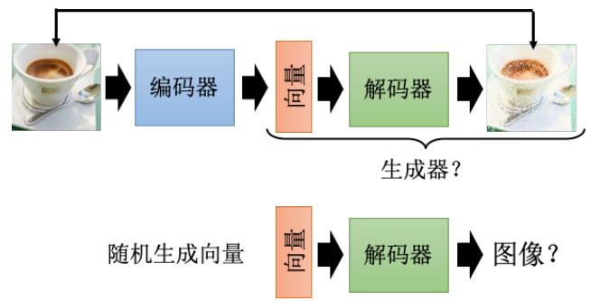  
图11.15 自编码器的应用：生成器  

自编码器还可以用来做压缩，如图11.16 所示，在处理图片的时候，如果图片太大，也会有一些压缩的方法，比如JPEG 的压缩，而自编码器也可以拿来做压缩，我们完全可以把编码器的输出当做是一个压缩的结果。因为一张图片其实是一个非常高维的向量，而一般我们编码器的输出是一个非常低维的向量，此时完全可以把这个向量看作是一个压缩的结果。所以编码器做的事情就是压缩，对应解码器做的事情就是解压缩。只是这个压缩是有损压缩，有损压缩就是它会失真，因为在训练自编码器的时候我们没有办法做到输入的图片跟输出的图片是完全一模一样的。因此通过自编码器压缩出来的图片必然是会是真的，就跟JPEG 图片会失真是一样的。  

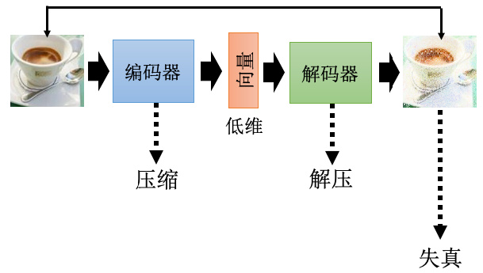  
图11.16 自编码器的应用：压缩  

