# 第14 章 强化学习  

强化学习（Reinforcement Learning，RL）是一种实现通用人工智能的可能方法。之前我们学习过监督学习，可先从监督学习与强化学习的关系来理解强化学习。图14.1 是监督学习（supervised learning）的示例，假设我们要训练一个图像的分类器，给定机器一个输入，要告诉机器对应的输出。目前为止，本书所提及的方法都是基于监督学习的方法。自监督学习只是标签，不需要特别雇用人力去标记，它可以自动产生。即使是无监督的方法，比如自编码器（Auto-Encoder，AE），其没有用到人类的标记。但事实上还有一个标签，只是该标签的产生不需要耗费人类的力量。  

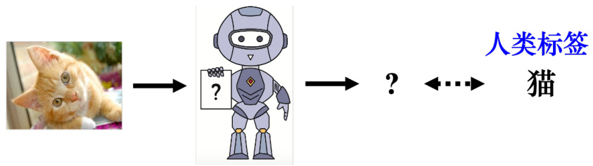  
图14.1 监督学习  

但在强化学习里面，给定机器一个输入，最佳的输出也是未知的。如图14.2 所示，假设要让机器学习下围棋，如果使用监督学习的方法，我们需要告诉机器，给定一个盘势，下一步落子的最佳位置，但该位置也是未知的。即使让机器阅读很多职业高段棋士的棋谱，这些棋谱里面给定某一个盘势，人类下的下一步。但这是一个很好的答案，不一定是最好的位置，因此正确答案是未知的。当正确答案是未知的或者收集有标注的数据很困难，我们可以考虑使用强化学习。强化学习在学习的时候，机器不是一无所知的，虽然其不知道正确的答案，但会跟环境（environment）互动得到奖励（reward），所以其会知道其输出的好坏。通过与环境的互动，机器可以知道输出的好坏，从而学出一个模型。  

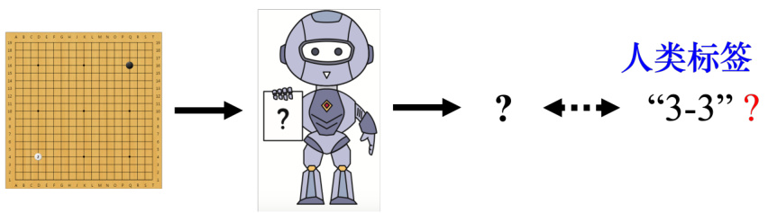  
图14.2 强化学习  

如图14.3 所示，强化学习里面有一个智能体（agent）和一个环境，智能体会跟环境互动。环境会给智能体一个观测（observation，），智能体看到这个观测后，它会采取一个动作。该动作会影响环境，环境会给出新的观测，智能体会给出新的动作。  

观测是智能体的输入，动作是智能体的输出，所以智能体本身就是一个函数。这个函数的输入是环境给它的观测，输出是智能体要采取的动作。在互动的过程中，环境会不断地给智能体奖励，让智能体知道它现在采取的这个动作的好坏。智能体的目标是要最大化从环境获得的奖励总和。  

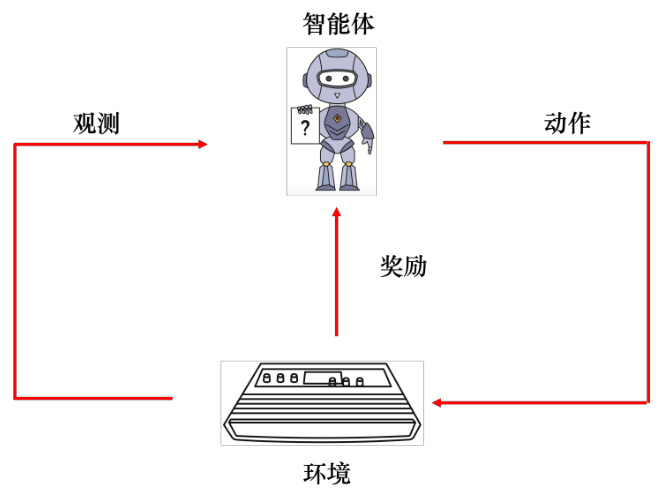  
图14.3 强化学习示意  

## 14.1 强化学习应用  

强化学习有很多的应用，比如玩视频游戏、下围棋等等。  

### 14.1.1 玩电子游戏  

强化学习可以用来玩游戏，强化学习最早的几篇论文都是让机器玩《太空侵略者》。在《太空侵略者》里面，如图14.4 所示，我们要操控太空梭来杀死外星人，可采取的动作有三个：左移、右移和开火，开火击中外星人，外星人就死掉了，我们就得到分数。我们可以躲在防护罩后面来挡住外星人的攻击，如果不小心打到防护罩，防护罩就会消失。在某些版本的《太空侵略者》里面，会有补给包，如果击中补给包，会被加一个很高的分数。分数其实环境给的奖励。当所有的外星人被杀光或者外星人击中母舰的时候，游戏就会终止。  

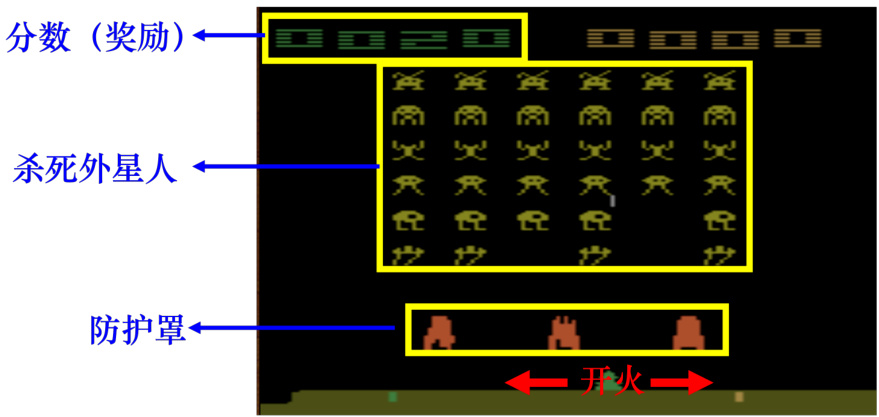  
图14.4 《太空侵略者》游戏  

如果用强化学习玩《太空侵略者》，如图14.5 所示。智能体会去操控摇杆，控制母舰来和外星人对抗。环境是游戏主机，游戏主机操控外星人攻击母舰，所以观测是游戏的画面。输入智能体一个游戏的画面，输出是智能体可以采取的动作。当智能体采取右移动作的时候，不可能杀掉外星人，所以奖励为0。智能体体采取一个动作后，游戏的画面就变了，也就有了新的观测。根据新的观测，智能体会决定采取新的动作。假设如图14.6 所示，智能体采取的动作是开火，这个动作正好杀掉了一只外星人，得到5 分，奖励等于5。在玩游戏的过程中，智能体会不断地采取动作得到奖励，我们想要智能体玩这个游戏得到的奖励的总和最大。  

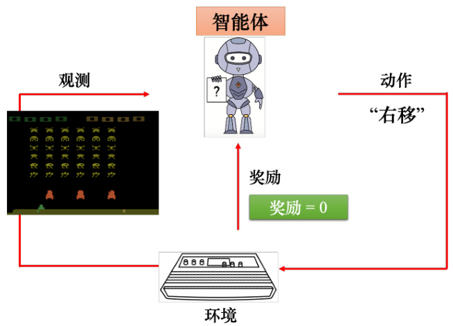  
图14.5 智能体玩《太空侵略者》采取右移的动作  

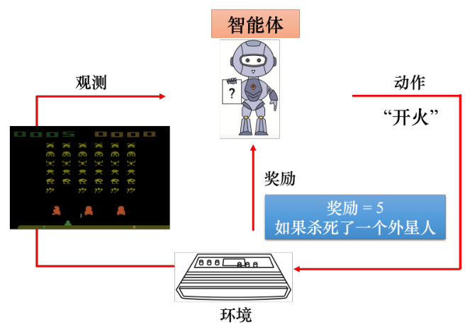  
图14.6 智能体玩《太空侵略者》采取开火的动作  

### 14.1.2 下围棋  

如果用强化学习下围棋，如图14.7(a) 所示，智能体是AlphaGo，环境是AlphaGo 的人类对手，即棋士。智能体的输入是棋盘上黑子跟白子的位置。一开始，棋盘上是空的。根据该棋盘，智能体要决定下一步的落子，有 $19\times19$ 个可能性，每个可能性对应棋盘上的一个位置。  

如图14.7(b) 所示，假设现在智能体决定了落子。新的棋盘会输入给棋士，棋士棋士也会再落一子，产生新的观测。智能体看到新的观测就会产生新的动作，这个过程反复进行。在下围棋里面，智能体所采取的动作都无法得到任何奖励，我们可以定义，如果赢了，就得到1分，如果输了就得到-1 分，只有整场围棋结束，智能体才能够拿到奖励。智能体学习的目标是要最大化它可能得到的奖励。  

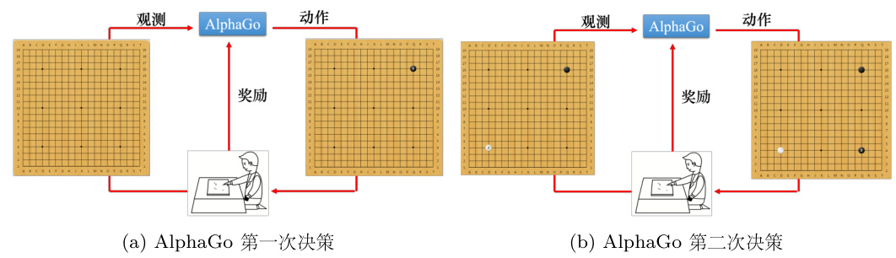  
图14.7 强化学习下围棋  

> Q：下围棋是否需要比较好的启发式函数？  

> A：在下围棋的时候，假设奖励非常地稀疏（sparse），我们可能会需要一个好的启发式函数（heuristic function），深蓝的那篇论文，深蓝其实已经在西洋棋上打爆人类了，深蓝就有蛮多启发式函数，它就不是只有下到游戏的中盘，才知道才得到奖励，中间会有蛮多的状况它都会得到奖励。  

## 14.2 强化学习框架  

强化学习跟机器学习的框架类似，机器学习有三个步骤：第一步是定义函数，函数里面有一些未知变量，这些未知变量是要被学出来的；第二步是定义损失函数；最后一步是优化，即找出未知变量去最小化损失。强化学习也是类似的三个步骤。  

### 14.2.1 第1 步：未知函数  

第一个步骤，有未知数的函数是智能体。在强化学习里面，智能体是一个网络，通常称为策略网络（policy network）。在深度学习未被用到强化学习的时候，通常智能体是比较简单的，其不是网络，它可能只是一个查找表（look-up table），告诉我们给定输入对应的最佳输出。网络是一个很复杂的函数，其输入是游戏画面上的像素，输出是每一个可以采取的动作的分数。  

网络的架构可以自己设计，只要网络能够输入游戏的画面，输出动作。比如如果输入是一张图片，可以用卷积神经网络来处理。如果我们不要只看当前这一个时间点的游戏画面，而是要看整场游戏到目前为止发生的所有画面，可以考虑使用循环神经网络或Transformer。  

如图14.8 所示，输入游戏画面，策略网络的输出是左移0.7 分、右移0.2 分、开火0.1分。这类似于分类网络，分类是输入一张图片，输出是决定这张图片的类别，网络会给每一个类别一个分数。分类网络的最后一层是softmax 层，每个类别有个分数，这些分数的总和是1。机器会决定采取哪一个动作，取决于每一个动作的分数。常见的做法是把这个分数当做一个概率，按照概率采样，随机决定要采取的动作。比如图14.8 中的例子里面，智能体有 $70\%$ 的概率会采取左移， $20\%$ 的概率会采取右移， $10\%$ 的概率会采取开火。  

> Q：为什么不采取分数最大的动作？  

> A：我们可以采取左的动作，但一般都是使用随机采样。采取有一个好处：看到同样的游戏画面，机器每一次采取的动作，也会略有不同，在很多的游戏里面随机性是很重要的，比如玩石头、剪刀、布游戏，如果智能体总是出石头，很容易输。但如果有一些随机性，就比较不容易输。  

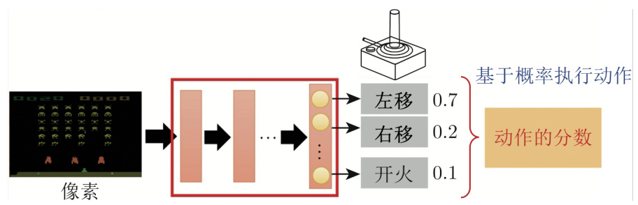  
图14.8 策略网络  

### 14.2.2 第2 步：定义损失  

接下来第二步是定义强化学习中的损失。如图14.9 所示，首先有一个初始的游戏画面 $s_{1}$ ，该游戏画面会被作为智能体的输入。智能体输出了一个动作 $a_{1}$ 右移，得到0 分的奖励。接下来会看到新的游戏画面 $s_{2}$ ，根据 $s_{2}$ ，智能体会采取新的动作 $a_{2}$ 开火，假设开火恰好杀死一个外星人，智能体得到5 分的奖励。  

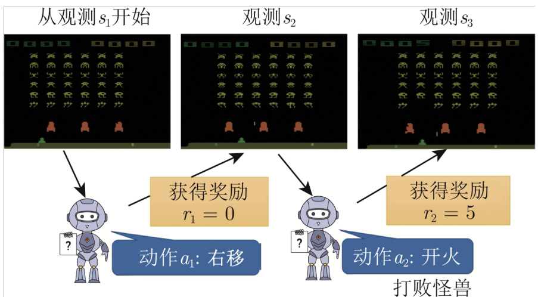  
图14.9 玩视频游戏的例子  

智能体采取开火这个动作以后，接下来会有新的游戏画面，机器又会采取新的动作，这个互动的过程会反复持续下去，直到机器在采取某一个动作以后，游戏结束了。从游戏开始到结束的整个过程称为一个回合（episode）。整个游戏过程中，机器会采取非常多的动作，每一个动作会有奖励，所有的奖励的总和称为整场游戏的总奖励（total reward），也称为回报（return）。回报是从游戏一开始得到的 $r_{1}$ ，一直累加到游戏最后结束的时候得到的 $r_{t}$ 。假设这个游戏里面会互动 $T$ 次，得到一个回报 $R$ 。我们想要最大化回报，这是训练的目标。回报和损失不一样，损失是要越小越好，回报是要越大越好。如果把负的回报当做损失，回报是越大越好，负的回报是越小越好。  

奖励是指智能体采取某个动作的时候，立即得到的反馈。整场游戏里面所有奖励的总和才是回报。  

### 14.2.3 第3 步：优化  

图14.10 给出了智能体与环境互动的示例，环境输出一个观测 $s_{1}$ ， $s_{1}$ 会变成智能体的输入；智能体接下来输出 $a_{1}$ ， $a_{1}$ 又变成环境的输入；环境呢，看到 $a_{1}$ 以后，又输出 $s_{2}$ 。智能体和环境的互动会反复进行，直到满足游戏中止的条件。在一场游戏中，我们把状态和动作全部组合起来得到的一个序列称为轨迹（trajectory） $\tau$ ，即  

$$
\tau=\{s_{1},a_{1},s_{2},a_{2},\cdots\,,s_{t},a_{t}\}
$$

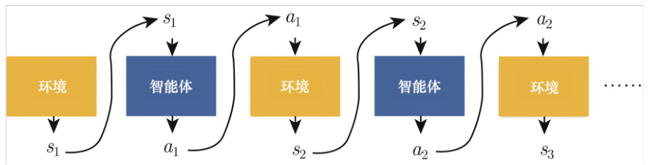  
图14.10 智能体与环境互动  

如图14.11 所示，智能体与环境互动的过程中，会得到奖励，奖励可以看成一个函数。奖励函数有不同的表示方法，在有的游戏里面，智能体采取的动作可以决定奖励。但通常我们在决定奖励的时候，需要动作和观测。比如每次开火不一定能得到分数，外星人在母舰前面，开火要击到外星人才有分数。因此通常定义奖励函数的时候，需要同时看动作跟观测，因此奖励函数的输入是状态和动作。比如图14.11 中奖励函数的输入是 $a_{1}$ 跟 $s_{1}$ ，输出是 $r_{1}$ 。所有奖励的总和是回报，即  

$$
R(\tau)=\sum_{t=1}^{T}r_{t}
$$

我们需要最大化回报，因此优化问题为：学习网络的参数让回报越大越好，可以通过梯度上升（gradient ascent）来最大化回报。但是强化学习困难的地方是，这不是一般的优化的问题，跟一般的网络训练不太一样。第一个问题是，智能体的输出是有随机性的，比如图14.11 中的$a_{1}$ 是用采样产生的，同样的 $s_{1}$ 每次产生的 $a_{1}$ 不一定一样。假设环境、智能体跟奖励合起来当成一个网络，这个网络不是一般的网络，这个网络里面是有随机性的。这个网络里面的某一个层是每次的输出是不一样的。  

另外一个问题是环境跟奖励是一个黑盒子，其很有可能具有随机性。比如环境是游戏机，游戏机里面发生的事情是未知的。在游戏里面，通常奖励是一条规则：给定一个观测和动作，输出对应的奖励。但对有一些强化学习的问题里面，奖励是有可能有随机性的，比如玩游戏也是有随机性的。给定同样的动作，游戏机的回应不一定是一样的。如果是下围棋，即使智能体落子的位置是相同的，对手的回应每次可能也是不一样的。由于环境和奖励的随机性，强化学习的优化问题不是一般的优化的问题。  

强化学习的问题是如何找到一组网络参数来最大化回报。这跟生成对抗网络有异曲同工之妙。在训练生成器（generator）的时候，生成器与判别器（discriminator）会接在一起，我们希望调整生成器的参数，让判别器的输出越大越好。在强化学习里面，智能体就像是生成器，环境跟奖励就像是判别器，我们要调整生成器的参数，让判别器的输出越大越好。但在生成对抗网络里面判别器也是一个神经网络，我可以用梯度下降来训练生成器，让判别器得到最大的输出。但是在强化学习的问题里面，奖励跟环境不是网络，不能用一般梯度下降的方法调整参数来得到最大的输出，所以这是强化学习跟一般机器学习不一样的地方。  

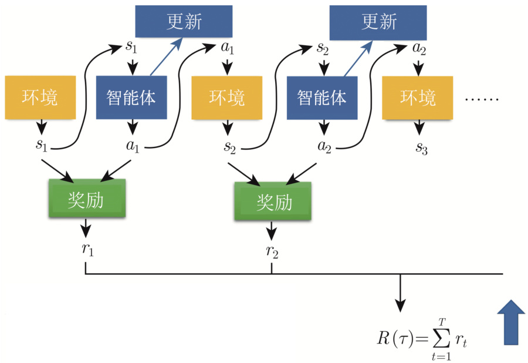  
图14.11 期望的奖励  

让一个智能体在看到某一个特定观测的时候，采取某一个特定的动作，这可以看成一个分类的问题，如图14.12 所示，比如给定智能体的输入是 $s$ ，让其输出动作 $\hat{a}$ ，假设 $a$ 是左移，我们要教智能体看到这个游戏画面左移就是对的。 $s$ 是智能体的输入， $a$ 就是标签，即标准答案。接下来可以计算智能体的输出跟标准答案之间的交叉熵 $e$ ，学习 $\pmb{\theta}$ 让损失（交叉熵）最小，让智能体的输出跟标准答案越接近越好。  

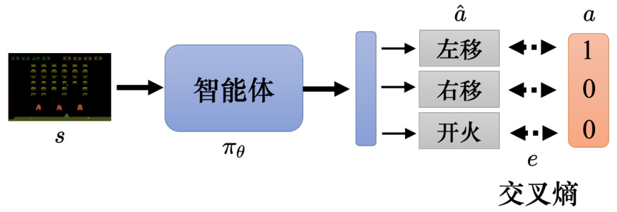  
图14.12 使用交叉熵作为损失  

如果想要让智能体看到某一个观测，不要采取某一个动作，只需要在定义损失的时候使用负的交叉熵。如果希望智能体采取动作 $a$ ，可定义损失 $L$ 等于交叉熵 $e$ 。如果希望智能体不采取动作 $a$ ，可定义损失 $L$ 等于 $-e$ 。假设要让智能体看到 $s$ 的时候采取 $a$ ，看到 $s^{\prime}$ 的时候不要采取 $a^{\prime}$ 。如图14.13 所示，给定观测 $s^{\prime}$ ，标准答案为 $\hat{a}$ ，对这两个标准答案可计算交叉熵$e_{1}$ 跟 $e_{2}$ 。损失可定义为 $e_{1}-e_{2}$ ，即让 $e_{1}$ 越小越好， $e_{2}$ 越大越好。然后找一个 $\pmb{\theta}$ 最小化损失，得到 $\pmb{\theta}^{*}$ ，如式(14.3) 所示。因此给定智能体适当的标签和损失来控制控制智能体的输出。  

$$
\theta^{*}=\arg\operatorname*{min}_{\theta}L
$$

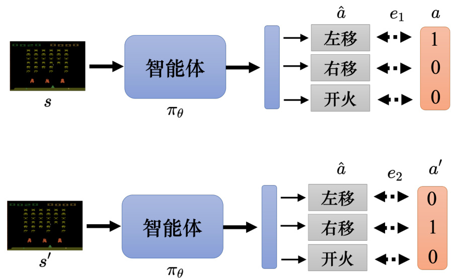  
图14.13 定义合适的损失  

如图14.14 所示，如果我们要训练一个智能体，需要收集一些训练数据，希望在 $s_{1}$ 的时候采取 $a_{1}$ ，在 $s_{2}$ 的时候不要采取 $a_{2}$ 。这个训练过程类似于训练一个图像的分类器， $s$ 可看成图像， $a$ 可看成标签，只是有的动作是想要被采取的，有的动作是不想要被采取的。收集一堆这种数据，定义一个损失函数：  

$$
L=+e_{1}-e_{2}+e_{3}\cdot\cdot\cdot-e_{\mathrm{N}}
$$

接着最小化损失函数，这样我们可以训练一个智能体，期待它执行的动作是我们想要的。而且可以更进一步，每一个动作并不是有想要执行跟不想要执行，而且有程度的差别。如果每一个动作就是要执行或不执行，这是一个二分类的问题，可以用 $+1$ 和−1 来表示。  

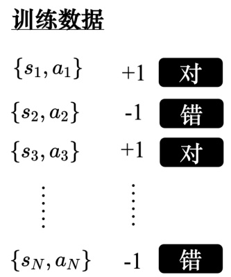  
图14.14 收集训练数据  

但如果考虑动作执行程度的差别，每一个状态-动作对（state-action pair）对应一个分数，这个分数代表希望机器在看到 $s_{1}$ 的时候，执行动作 $a_{1}$ 的程度。比如图14.15 中第一笔数据的分数定为 $+1.5$ ，第三笔数据的分数为 $+0.5$ 。这代表我们期待机器看到 $s_{1}$ ，它可以做 $a_{1}$ ，看到 $s_{3}$ ，它可以做 $a_{3}$ ，但是我们期待它看到 $s_{1}$ 的时候，做 $a_{1}$ 的这个期待更强烈一点，比看到$s_{3}$ 做 $a_{3}$ 的期待更强烈一点。我们希望它在看到 $s_{2}$ 的时候，不要做 $a_{2}$ ，期待它看到 $s_{N}$ 的时候，不要做 $a_{N}$ 。有了这些数据，我们可以定义如式(14.5) 所示的损失函数，之前的交叉熵本来要乘 $+1$ 或 $-1$ ，现在改成乘上 $A_{i}(i=1,\cdots\,,n)$ ，通过 $A_{i}$ 来控制每一个动作执行的程度。  

$$
L=\sum\mathrm{A}_{n}e_{n}
$$

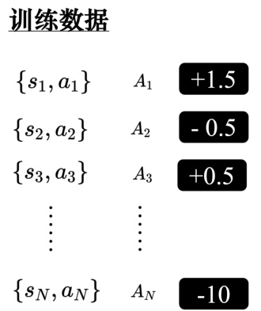  

图14.15 对每个状态-动作对分配不同的分数  

综上，强化学习可分为三个阶段，只是在优化的步骤跟一般的方法不同，其会使用策略梯度（policy gradient）等优化方法。接下来的难点就是，如何定义 $A$ ，先介绍最容易想到的4个版本。  

## 14.3 评价动作的标准  

本节介绍下评价动作的多种标准。  

### 14.3.1 使用即时奖励作为评价标准  

智能体跟环境做互动可以收集一些训练数据（状态-动作对）。智能体可以先看成随机的智能体，它执行的动作都是随机的，每一个 $s$ 执行的动作 $a$ 都记录下来。通常收集数据不会只把智能体跟环境做一个回合，通常需要做多个回合才收集到足够的数据。接下来评价每一个动作的好坏，评价完以后，可以拿评价的结果来训练智能体。 $A$ 可评价在每个状态，智能体采取某一个动作的好坏。最简单的评价方式是，假设在某一个状态 $s_{1}$ ，智能体执行 $a_{1}$ ，得到奖励 $r_{1}$ 。如果奖励是正的，代表该动作是好的；如果奖励是负的，代表该动作是不好的。因此，如图14.16 所示，奖励可当成 $A$ ， $A_{1}=r_{1}$ ， $A_{2}=r_{2}$ ，以此类推。  

以上是版本0，但其并不是一个好的版本。因为把奖励设为 $A$ ，这会让智能体变得短视，不会考虑长期收益。每一个动作，其实都会影响互动接下来的发展。比如智能体在 $s_{1}$ 执行 $a_{1}$ 得到 $r_{1}$ ，这个并不是互动的全部。因为 $a_{1}$ 影响了导致了 $s_{2}$ ， $s_{2}$ 会影响到接下来会执行 $a_{2}$ ，也影响到接下来会产生 $r_{2}$ ，所以 $a_{1}$ 也会影响到会不会得到 $r_{2}$ ，每一个动作并不是独立的，每一个动作都会影响到接下来发生的事情。  

而且在跟环境做互动的时候，有一个问题叫做延迟奖励（delayed reward），即牺牲短期的利益以换取更长期的利益。比如在《太空侵略者》的游戏里面，智能体要先左右移动一下进行瞄准，射击才会得到分数。而左右移动是没有任何奖励的，其得到的奖励是零。只有射击才会得到奖励，但是并不代表左右移动是不重要的，先需要左右移动进行瞄准，射击才会有效果，所以有时候我们会牺牲一些近期的奖励，而换取更长期的奖励。如果使用版本0，左移和右移的奖励为0，开火的奖励为正，智能体会觉得只有开火是对的，它会一直开火。  

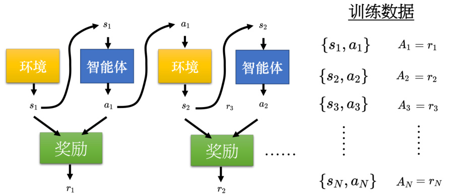  
图14.16 短视的版本  

### 14.3.2 使用累积奖励作为评价标准  

在版本1 里面，把未来所有的奖励加起来即可得到累积奖励 $G$ ，用其来评估一个动作的好坏，如图14.17 所示。 $G_{t}$ 是从时间点 $t$ 开始， $r_{t}$ 一直加到 $r_{N}$ ，即  

$$
G_{t}=\sum_{i=t}^{N}r_{i}
$$

比如 $G_{1}$ 、 $G_{2}$ 、 $G_{3}$ 的定义为  

$$
\begin{array}{l}{G_{1}=r_{1}+r_{2}+r_{3}+\dots.....+r_{N}}\\ {\ \ \ \ G_{2}=r_{2}+r_{3}+\dots.....+r_{N}}\\ {\ \ \ \ G_{3}=r_{3}+\dots.....+r_{N}}\end{array}
$$

$a_{1}$ 的好坏不是取决于 $r_{1}$ ，而是取决于 $a_{1}$ 之后所有发生的事情，即执行完 $a_{1}$ 以后所有得到的奖励 $G_{1}$ ， $A_{1}$ 等于 $G_{1}$ 。使用累积奖励可以解决版本0 遇到的问题，因为可能右移移动以后进行瞄准，接下来开火就有打中外星人。因此右移也有累积奖励，虽然右移没有立即的奖励。假设 $a_{1}$ 是右移， $r_{1}$ 可能是0，但接下来可能会因为右移才能打到外星人，累积的奖励就会正的，因此右移也是一个好的动作。  

但是版本1 也有问题，假设游戏非常长，把 $r_{N}$ 归功于 $a_{1}$ 也不太合适。当智能体采取动作 $a_{1}$ ，立即有影响的是 $r_{1}$ ，接下来才会影响到 $r_{2}$ 和 $r_{3}$ 。假设该过程非常长，智能体采取动作 $a_{1}$ 导致可以得到 $r_{N}$ 的可能性很低，版本2 解决了该问题。  

### 14.3.3 使用折扣累积奖励作为评价标准  

版本2 的累积的奖励用 $G^{\prime}$ 来表示累积的奖励， $G_{t}^{\prime}$ 的定义如式(14.8) 所示， $r$ 前面乘一个折扣因子（discount factor） $\gamma$ 。折扣因子也会设一个小于1 的值，比如0.9 或0.99 之类的。  

$$
G_{t}^{\prime}=\sum_{i=t}^{N}\gamma^{i-t}r_{i}
$$

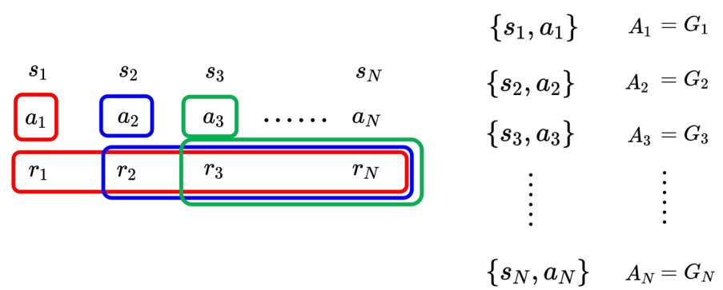  
图14.17 使用累积奖励作为评价标准  

图14.18 给出了折扣累积奖励的示例， $G_{1}^{\prime}$ 与不同，其奖励函数可以定义为  

$$
G_{1}^{\prime}=r_{1}+\gamma r_{2}+\gamma^{2}r_{3}+...\,.\,.\,.
$$

距离采取动作 $a_{1}$ 越远， $\gamma$ 的次方数越多。 $r_{2}$ 距离 $a_{1}$ 一步，就乘个 $\gamma$ ， $r3$ 距离 $a_{1}$ 两步，就乘 $\gamma$ 平方，一直加到 $r_{N}$ 的时候， $r_{N}$ 对 $G_{1}^{\prime}$ 几乎没有影响，因为 $\gamma$ 乘了非常多次， $\gamma$ 是一个小于1 的值，即使 $\gamma$ 设0.9， $0.9^{10}$ 也很小了。  

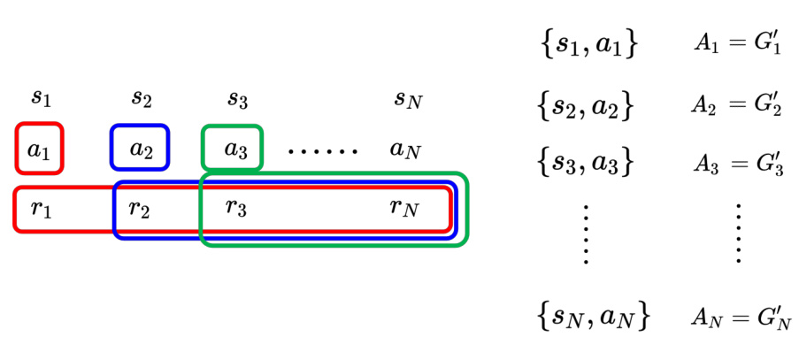  
图14.18 使用折扣奖励作为评价标准  

所以加入折扣因子可以把给离 $a_{1}$ 比较近的奖励比较大的权重，给离 $a_{1}$ 比较远的那些奖励比较小的权重。因此新的 $A$ 等于 $G_{1}^{\prime}$ ，离采取的动作越远的奖励， $\gamma$ 就被乘越多次，它对 $G^{\prime}$ 的影响就越小。  

> Q：越早的动作累积到的分数越多，越晚的动作累积的分数越少吗？  

> A：在游戏等情况里，越早的动作就会累积到越多的分数，因为较早的动作对接下来的影响比较大，其是需要特别在意的。到游戏的终局，外星人基本都没了，智能体做的事情对结果影响都不大。有很多种不同的方法决定 $A$ ，如果不想要较早的动作累积分数比较大，完全可以改变 $A$ 的定义。  

> Q：折扣累积奖励是不是不适合用在围棋之类的游戏（围棋这种游戏只有结尾才有分数）？  

> A：折扣累积奖励可以处理这种结尾才有分数的游戏。假设只有 $r_{N}$ 有分数，其它 $r$ 都是0。智能体采取一系列动作，只要最后赢了，这一系列动作都是好的；如果最后输了，这一系列动作都是不好的。最早版本的AlphaGo 采用这种方法训练网络，但它还有一些其它的方法，比如价值网络（value network）等等。  

### 14.3.4 使用折扣累积奖励减去基线作为评价标准  

因为好或坏是相对的，假设在游戏里面，我们每次采取一个行动的时候，最低分预设是10 分，其实得到10 分的奖励算是差的，奖励是相对的。用 $G^{\prime}$ 来表示评估标准会有一个问题：假设游戏里面，可能永远都是拿到正的分数，每一个动作都会给出正的分数，只是大小的不同， $G^{\prime}$ 算出来都会是正的，有些动作其实是不好的，但是我们仍然会鼓励模型去采取这些动作。因此我们需要做一下标准化，最简单的方法是把所有的 $G^{\prime}$ 都减掉一个基线（baseline） $b$ ，让 $G^{\prime}$ 有正有负，特别高的 $G^{\prime}$ 让它是正的，特别低的 $G^{\prime}$ 让它是负的，如图14.19 所示。  

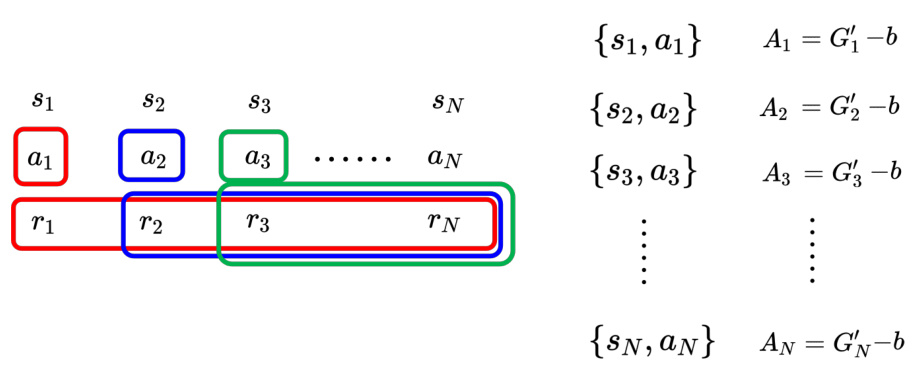  
图14.19 减去基线  

策略梯度算法中的评价标准就是 $G^{\prime}-b$ ，其详细过程如算法14.1 所示。首先要随机初始化智能体，给智能体一个随机初始化的参数 $\theta_{0}$ 。接下来进入训练迭代阶段，假设要跑 $T$ 个训练迭代。一开始智能体什么都不会，其采取的动作都是随机的，但它会越来越好。智能体去跟环境做互动，得到一大堆的状态-动作对。接下来我们就要进行评价，用 $A_{1}$ 到 $A_{N}$ 来决定说这些动作的好坏。接下来定义损失，并更新模型，更新的过程跟梯度下降一模一样。计算 $L$ 的梯度，前面乘上学习率 $\eta$ ，接着用该梯度更新模型，把 $\pmb\theta_{i-1}$ 更新成 $\pmb{\theta}_{i}$ 。  

1 初始化智能体网络参数 $\pmb{\theta}$ ;  
2 for $i=1$ to $T$ do  
3 使用智能体 $\pi_{\theta_{i-1}}$ 进行交互;  
4 获取数据 $\left\{s_{1},a_{1}\right\},\left\{s_{2},a_{2}\right\},\cdots,\left\{s_{N},a_{N}\right\};$   
5 计算 $A_{1},A_{2},\cdot\cdot\cdot,A_{N}$ ;  
6 计算损失 $L$ ;  
7 $\pmb{\theta}_{i}\leftarrow\pmb{\theta}_{i-1}-\eta\nabla L$  

在一般的训练中，收集数据都是在训练迭代之外，比如有一堆数据，用这堆数据拿来做训练，更新模型很多次，最后得到一个收敛的参数，拿这个参数来做测试。但在强化学习不同，其在训练迭代的过程中收集数据。  

如图14.20 所示，可以用一个图像化的方式来表示强化学习训练的过程。训练数据中有很多某个智能体的状态-动作对，对于每个状态-动作对，可以使用评价 $A$ 来判断每一个动作的好坏。通过训练数据训练智能体，使用评价 $A$ 定义出一个损失 $L$ ，并更新参数一次。一旦更新完一次参数，接下来重新要收集数据了才能更新下一次参数，所以这就是往往强化学习训练过程非常花时间的原因。强化学习每次更新完一次参数以后，数据就要重新再收集一次，再去更新参数。如果参数要更新400 次，数据就要收集400 次，这个过程非常消耗时间。  

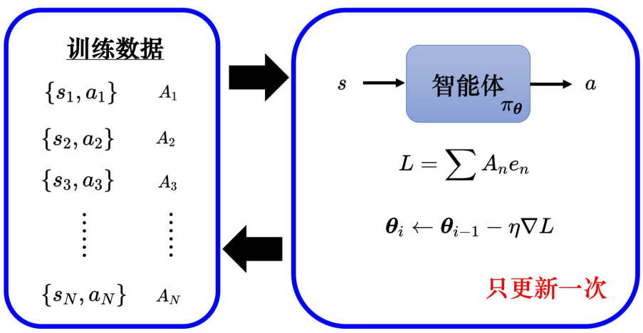  
图14.20 强化学习训练过程  

策略梯度算法中，每次更新完模型参数以后，需要重新再收集数据。如算法14.1 所示，这些数据是由 $\pi_{\theta_{i-1}}$ 所收集出来的，这是 $\pi_{\theta_{i-1}}$ 跟环境互动的结果，这个是 $\pi_{\theta_{i-1}}$ 的经验，这些经验可以拿来更新 $\pi_{\theta_{i-1}}$ ，可以拿来更新 $\pi_{\theta_{i-1}}$ 的参数，但它不一定适合拿来更新 $\pi_{\pmb{\theta}_{i}}$ 的参数。  

举个例子，进藤光跟佐为下棋，进藤光下了小马步飞（棋子斜放一格叫做小马步飞，斜放好几格叫做大马步飞）。下完棋以后，佐为让进藤光这种情况不要下小马步飞，而是要下大马步飞。如果大马步飞有100 手，小马步飞只有99 手。之前走小马步飞是对的，因为小马步飞的后续比较容易预测，也比较不容易出错，大马步飞的下法会比较复杂。但进藤光假设想要变强的话，他应该要学习下大马步飞，或者是进藤光变得比较强以后，他应该要下大马步飞。同样是下小马步飞，对不同棋力的棋士来说，其作用是不一样的。对于比较弱的进藤光，下小马  

步飞是对的，因为这样比较不容易出错，但对于已经变强的进藤光来说，下大马步飞比较好。  
因此同一个动作，对于不同的智能体而言，它的好是不一样的。  

如图14.21 所示，假设用 $\pi_{\theta_{i-1}}$ 收集了一堆的数据，这些数据只能用来训练 $\pi_{\theta_{i-1}}$ ，不能用来训练 $\boldsymbol{\pi}_{\boldsymbol{\theta}_{i}}$ 。假设 $\pi_{\theta_{i-1}}$ 和 $\boldsymbol{\pi}_{\pmb{\theta}_{i}}$ 在 $s_{1}$ 都会采取 $a_{1}$ ，但之后到了 $s_{2}$ 以后，它们采取的动作可能就不一样了。因此 $\pi_{\pmb{\theta}_{i}}$ 跟 $\pi_{\theta_{i-1}}$ 收集的数据根本就不一样。使用 $\pi_{\theta_{i-1}}$ 的收集数据来评估$\boldsymbol{\pi}_{\pmb{\theta}_{i}}$ 接下来会得到的奖励其实是不合适的。如果收集数据的智能体跟被训练的智能体是同一个智能体，当智能体更新以后，就要重新去收集数据，这就是强化学习非常花时间的原因，异策略学习（off-policy learning）可以解决该问题。  

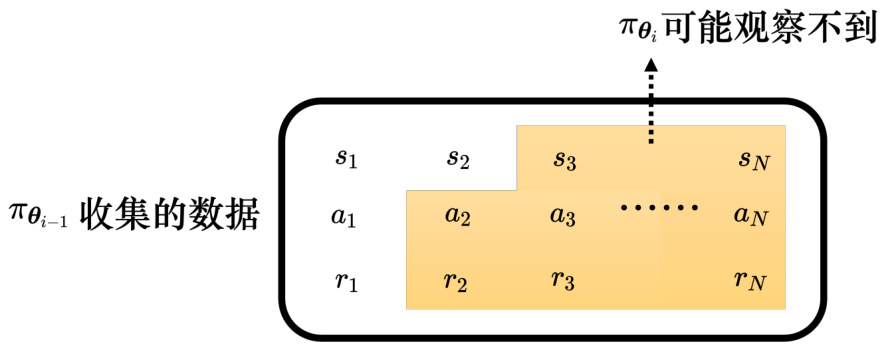  
图14.21 不同智能体收集的数据不能共用  

同策略学习（on-policy learning）是指要训练的智能体跟与环境互动的智能体是同一个智能体，比如策略梯度算法就是同策略的学习算法。而在异策略学习中，与跟环境互动的智能体跟训练的智能体是两个智能体，要训练的智能体能够根据另一个智能体与环境互动的经验进行学习，因此异策略学习不需要一直收集数据。同策略学习每更新一次参数就要收集一次数据，比如更新400 次参数，就要收集400 次数据，而异策略学习收集一次数据，可以更新参数很多次。  

探索（exploration）是强化学习训练的过程中一个非常重要的技巧。智能体在采取动作的时候是有一些随机性的。随机性非常重要，很多时候随机性不够会训练不起来。假设有一些动作从来没被执行过，这些动作的好坏是未知的，很有可能会训练不出好的结果。比如假设一开始初始的智能体永远都只会右移移动，它从来没有开火，动作开火的好坏就是未知的。只有某一个智能体试图做开火这件事得到奖励，才有办法去评估这个动作的好坏。在训练的过程中，与环境互动的智能体本身的随机性是非常重要的，其随机性大一点，才能够收集到比较多的数据，才不会有一些状况的的奖励是未知的。  

为了要让智能体的随机性大一点，甚至在训练的时候会刻意加大它的随机性。比如智能体的输出是一个分布，可以加大该分布的熵（entropy），让其在训练的时候，比较容易采样到概率比较低的动作。或者会直接在这个智能体的参数上面加噪声，让它每一次采取的动作都不一样。  

### 14.3.5 Actor-Critic  

与环境交互的网络可称为Actor（演员，策略网络），而Critic（评论员，价值网络）的工作是要来评估一个智能体的好坏。版本3.5 跟Critic 及其训练方法相关。假设有一个智能体的参数为 $\pi_{\theta}$ ，Critic 的工作是要评估如果智能体看到某个观测，看到某一个游戏画面，接下来它可能会得到的奖励。Critic 有好多种不同的变形，有的Critic 是只看游戏画面来判断，有的Critic 是说看到某一个游戏画面，Actor 采取某一个动作，在这两者都具备的前提下，接下来会得到的奖励。  

Critic 也被称为价值函数（value funciton），可以用 $V_{\pi\theta}(s)$ 来表示。上标 $\pi_{\pmb{\theta}}$ 代表这个 $V$ 观测的Actor 的策略为 $\pi_{\pmb{\theta}}$ 。如图14.22(a) 所示，其输入是 $\pmb{s}$ ， $V_{\pi_{\theta}}$ 就是一个函数，输出是一个标量 $V_{\pi_{\theta}}(s)$ 。价值函数 $V_{\pi_{\theta}}(s)$ 表示智能体 $\pi_{\pmb{\theta}}$ 看到观测接下来得到的折扣累积奖励（discounted cumulated reward） $G^{\prime}$ 。价值函数看到图14.22(b) 所示的游戏画面，直接预测接下来应该会得到很高的累积奖励，因为该游戏画面里面还有很多的外星人，假设智能体很厉害，接下来它就会得到很多的奖励。图14.22(c) 所示的画面已经是游戏的残局，游戏快结束了，剩下的外星人不多了，可以得到的奖励就比较少。价值函数跟其观察的智能体是有关系的，同样的观测，不同的智能体得到的折扣累积奖励应该不同。  

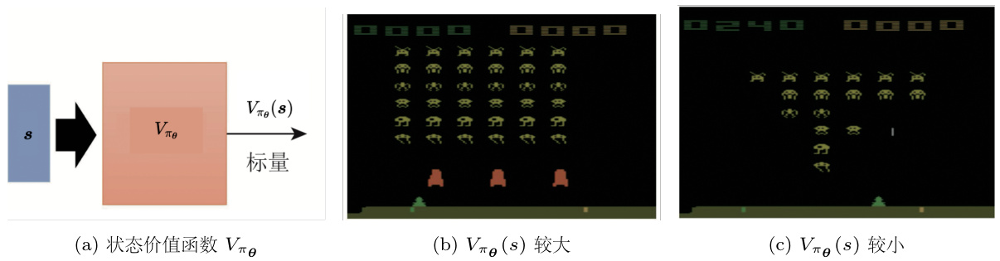  
图14.22 玩《太空侵略者》  

Critic 有两种常用的训练方法：蒙特卡洛和时序差分。智能体跟环境互动很多轮会得到一些游戏的记录。从这些游戏记录可知，看到游戏画面 $s_{a}$ ，累积奖励为 $G_{a}^{\prime}$ ；看到游戏画面 $\pmb{s}_{b}$ ，累积奖励为 $G_{b}^{\prime}$ 。如果使用蒙特卡洛（Monte Carlo，MC）的方法，如图14.23 所示，输入 $s_{a}$ 给价值函数 $V_{\pi_{\theta}}$ ，其输出 $V_{\pi\theta}\left(s_{a}\right)$ 跟 $G_{a}^{\prime}$ 越接近越好。输入 $\pmb{s}_{b}$ 给价值函数 $V_{\pi_{\theta}}$ ，其输出 $V_{\pi_{\theta}}(s_{b})$ 跟 $G_{b}^{\prime}$ 越接近越好。  

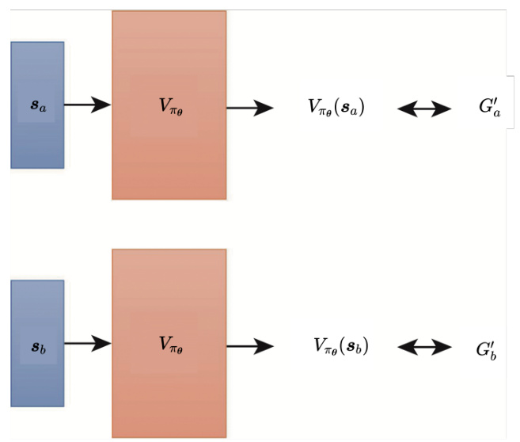  
图14.23 基于蒙特卡洛的方法  

时序差分（Temporal-Difference，TD）方法不用玩完整场游戏，只要看到数据 $\{s_{t},a_{t},r_{t},s_{t+1}\}$ ，就能够训练 $V_{\pi\theta}(s)$ ，就可以更新 $V_{\pi\theta}(s)$ 的参数。蒙特卡洛需要玩完整场游戏，才能得到一笔训练数据。但有的游戏其实很长，甚至有的游戏不会结束，这种游戏不适合用蒙特卡洛方法。而在时序差分方法中， $V_{\pi_{\theta}}(s_{t})$ 跟 $V_{\pi_{\theta}}(s_{t+1})$ 之间的关系如式(14.10) 所示（为了简化，没有取期望值）。  

$$
V_{\pi_{\theta}}\left(s_{t}\right)=r_{t}+\gamma r_{t+1}+\gamma^{2}r_{t+2}+\cdot\cdot\cdot
$$

$$
V_{\pi_{\theta}}\left(s_{t+1}\right)={r_{t+1}}+\gamma{r_{t+2}}+\cdot\cdot.
$$

$$
V_{\pi_{\theta}}\left(s_{t}\right)=\gamma V_{\pi_{\theta}}\left(s_{t+1}\right)+r_{t}
$$

假设有一笔数据为 $\{s_{t},a_{t},r_{t},s_{t+1}\}$ ， $s_{t}$ 代到价值函数里面得到 $V_{\pi_{\theta}}(s_{t})$ ， $s_{t+1}$ 代到价值函数得到 $V_{\pi_{\theta}}(s_{t+1})$ 。虽然 $V_{\pi_{\theta}}(s_{t})$ 和 $V_{\pi_{\theta}}(s_{t+1})$ 具体的值是未知的，但把两者应该满足如下关系  

$$
V_{\pi_{\theta}}\left(s_{t}\right)-\gamma V_{\pi_{\theta}}\left(s_{t+1}\right)\leftrightarrow r_{t}
$$

$V_{\pi_{\theta}}\left(s_{t}\right)-\gamma V_{\pi_{\theta}}\left(s_{t+1}\right)$ 与 $r_{t}$ 越接近越好。  

同样的 $\pi_{\pmb{\theta}}$ 得到的训练数据，用蒙特卡洛跟时序差分计算出的价值很可能是不一样的。图14.24 是某个智能体跟环境互动，玩了某个游戏八次的记录。  

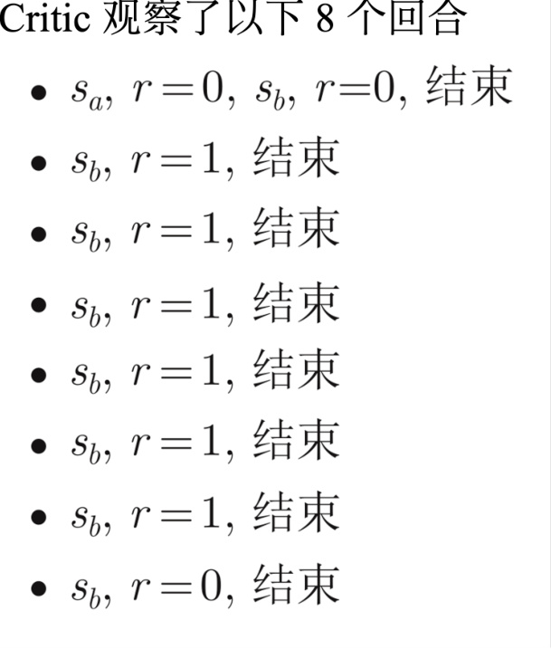  
图14.24 时序差分方法与蒙特卡洛方法的差别  

为了简化计算，假设这些游戏都非常简单，一到两个回合就结束了。比如智能体第一次玩游戏的时候，它先看到画面 $s_{a}$ ，得到奖励0，接下来看到画面 $s_{b}$ ，得到奖励0，游戏结束。接下来有连续六场游戏，都是看到画面 $s_{b}$ ，得到奖励1 就结束了。最后一场游戏，看到画面$s_{b}$ ，得到奖励0 就结束了。  

> Q：如果 $s_{a}$ 后面接的不一定是 $s_{b}$ ，该如何处理？  

> A：如果 $s_{a}$ 后面不一定接 $s_{b}$ ，这个问题在图14.24 中的例子里面是无法处理的。因为在图14.24 中， $s_{a}$ 后面只会接 $s_{b}$ ，没有观察到其它的可能性，所以无法处理这个问题。在做强化学习的时候，采样是非常重要的，强化学习最后学习得好不好，跟采样的好坏关系非常大。  

为了简化起见，先忽略动作，并假设 $\gamma=1$ ，即不做折扣。 $V_{\pi_{\theta}}(s_{b})$ 是指看到画面 $s_{b}$ 得到的奖励的期望值。 $s_{b}$ 画面在这八次游戏中，总共看到了八次，每次游戏都有看到 $s_{b}$ 这个画面，八次游戏里面，有六次得到1 分，两次得到0 分，所以平均分为  

$$
{\dfrac{6\times1+2\times0}{8}}={\dfrac{6}{8}}={\dfrac{3}{4}}
$$

$V_{\pi_{\theta}}(s_{a})$ 可以是0 或 $\dfrac{3}{4}$ 。如果用蒙特卡洛计算，因为看到 $s_{a}$ 只有一次，看到 $s_{a}$ 的得到奖励0，，再看到 $s_{b}$ 得到奖励还是0，所以累积奖励就是0，所以 $V_{\pi_{\theta}}(s_{a})=0$ 。但如果用时序差分算出来的，因为 $V_{\pi_{\theta}}(s_{a})$ 跟 $V_{\pi_{\theta}}(s_{b})$ 中间有关系  

$$
V_{\pi_{\theta}}\left(s_{a}\right)=V_{\pi_{\theta}}\left(s_{b}\right)+r
$$

因此  

$$
\begin{array}{r}{V_{\pi_{\theta}}\left(s_{a}\right)=V_{\pi_{\theta}}\left(s_{b}\right)+r}\\ {=\displaystyle\dfrac{3}{4}+0=\dfrac{3}{4}}\end{array}
$$

蒙特卡洛跟时序差分得出的结果都是对的，它们只是背后的假设是不同的。对蒙特卡洛而言，它就是直接看我们观察到的数据， $s_{a}$ 之后接 $s_{b}$ 得到的，累积奖励就是0，所以 $V_{\pi_{\theta}}(s_{a})$ 是0。但对于时序差分而言，它背后的假设是 $s_{a}$ 跟 $s_{b}$ 是没有关系的，看到 $s_{a}$ 之后再看到 $s_{b}$ ，并不会影响看到 $s_{b}$ 的奖励。看到 $s_{b}$ 以后得到的期望奖励应该是 $\dfrac{3}{4}$ ，所以看到 $s_{a}$ 后看到 $s_{b}$ ，得到的期望奖励也应该是 $\dfrac{3}{4}$ ，所以从时序差分的角度来看， $s_{b}$ 会得到多少奖励跟 $s_{a}$ 是没有关系的，所以 $s_{a}$ 的累积奖励应该是 $\dfrac{3}{4}$ 。  

接下来介绍下如何用Critic 训练Actor。智能体跟环境互动得到一堆如图14.25 所示的状态-动作对。比如 $s_{1}$ 执行 $a_{1}$ 得到一个分数 $A_{1}$ ，可令 $A_{1}=G_{1}^{\prime}-b$ 。  

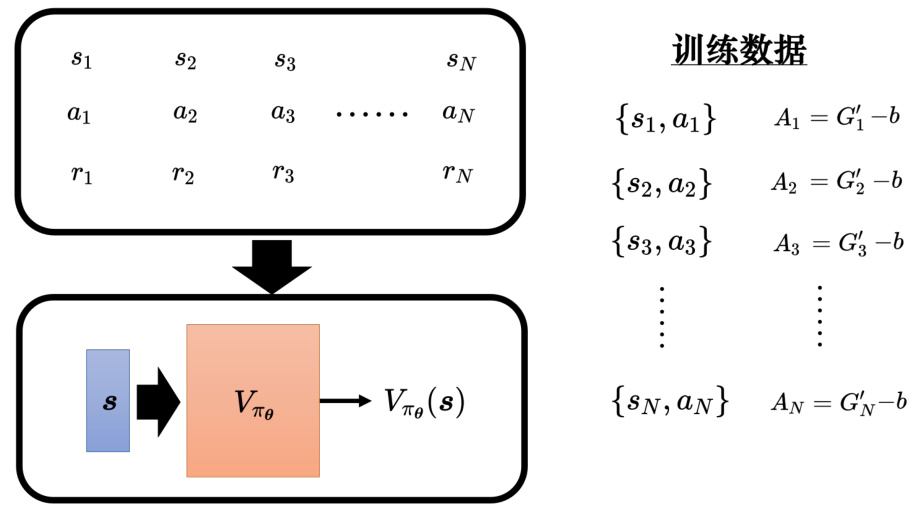  
图14.25 使用折扣累积奖励减去基线作为评价标准  

学习出Critic $V_{\pi_{\theta}}$ 后，给定一个状态 $s$ ，其可以产生分数 $V_{\pi\theta}(s)$ ，基线 $b$ 可设成 $V_{\pi_{\theta}}(s)$ ，因此 $A$ 可设成 $G^{\prime}-V_{\pi_{\theta}}(s)$ ，如图14.26 所示。  

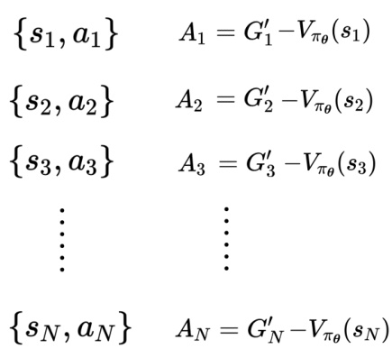  
图14.26 使用 $V_{\pi\theta}(s)$ 作为基线  

$A_{t}$ 代表 $\left\{s_{t},a_{t}\right\}$ 的好坏，智能体是指看到某一个画面 $s_{t}$ 以后，接下来再继续玩游戏，游戏有随机性，每次得到的奖励都不太一样， $V_{\pi_{\theta}}(s_{t})$ 是一个期望值。此外，智能体在看到 $s_{t}$ 的时候，智能体不一定会执行 $a_{t}$ 。因为智能体本身是有随机性的，在训练的过程中，同样的状态，智能体会输出的动作不一定是一样的。智能体的输出是动作的空间上的概率分布，给每一个动作一个分数，按照这个分数去做采样。有些动作被采样到的概率高，有些动作被采样到的概率低，但每一次采样出来的动作，并不保证一定要是一样的，所以如图14.27 所示，看到 $s_{t}$ 之后，接下来有很多的可能，可以计算出不同的累积奖励（此处是无折扣的累积奖励）。  

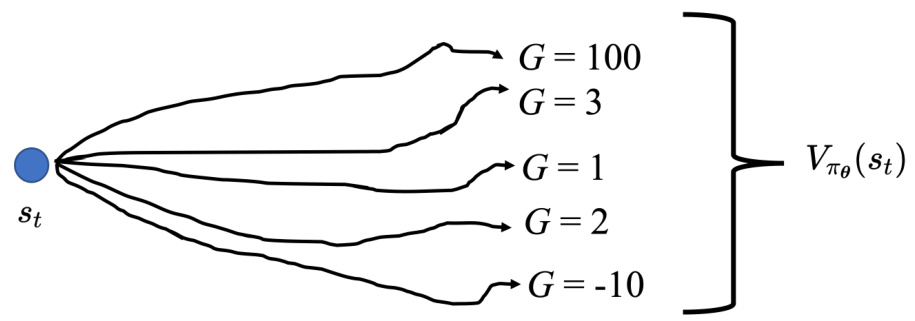  
图14.27 看到 $s_{t}$ 后不同的累积奖励  

把这些可能的结果平均起来，就是 $V_{\pi_{\theta}}(s_{t})$ 。 $G_{t}^{\prime}$ 这一项的含义是，在 $s_{t}$ 这个画面下，执行 $a_{t}$ 以后，接下来会得到的累积奖励。如果 $A_{t}>0$ ，代表 $G_{t}^{\prime}>V_{\pi_{\theta}}(s_{t})$ ，则动作 $a_{t}$ 是比随机采样到的动作还要好，因此给 $a_{t}$ 的评价 $A_{t}>0$ 。如果 $A_{t}<0$ ，这代表随机采样到的动作的累积奖励的期望值大过执行 $a_{t}$ 得到的奖励，因此 $a_{t}$ 是个不太好的动作，其 $A_{t}<0$ 。  

接下来我们还可以做一个改进。 $G_{t}^{\prime}$ 是一个采样的结果，它是执行 $a_{t}$ 以后，一直玩到游戏结束，而 $V_{\pi_{\theta}}(s_{t})$ 是很多个可能性平均以后的结果。用一个采样减掉平均，其实不太准，这个采样可能特别好或特别坏。所以其实可以用平均去减掉平均，也就是版本4，即优势Actor-Critic。  

### 14.3.6 优势Actor-Critic  

执行完 $a_{t}$ 以后得到奖励 $r_{t}$ ，然后跑到下一个画面 $s_{t+1}$ 。把 $s_{t+1}$ 接下来一直玩下去，有很多不同的可能，每个可能通通会得到一个奖励，把这些累积奖励平均就是 $V_{\pi_{\theta}}(s_{t+1})$ 。需要玩很多场游戏，才能够得到这个平均值。但可以训练出一个好的Critic，直接代 $V_{\pi_{\theta}}(s_{t+1})$ ，在 $s_{t+1}$ 这个画面下，接下来会得到的，累积奖励的期望值。在 $s_{t}$ 这边采取 $a_{t}$ 会得到奖励$r_{t}$ ，再跳到 $s_{t+1}$ ， $s_{t+1}$ 会得到期望的奖励为 $V_{\pi_{\theta}}(s_{t+1})$ 。所以 $r_{t}+V_{\pi_{\theta}}(s_{t+1})$ 代表在 $s_{t}$ 这边执行 $a_{t}$ 会得到的奖励的期望值。因此可把 $G_{t}^{\prime}$ 换成 $r_{t}+V_{\pi_{\theta}}(s_{t+1})$ ，如图14.28 所示。用$r_{t}+V_{\pi_{\theta}}(s_{t+1})-V_{\pi_{\theta}}(s_{t})$ ，即采取动作 $a_{t}$ 得到的期望奖励减掉根据某个分布采样动作得到的期望奖励。如果 $r_{t}+V_{\pi_{\theta}}(s_{t+1})>V_{\pi_{\theta}}(s_{t})$ ，代表 $a_{t}$ 比从一个分布随便采样的动作好。反之，则代表 $a_{t}$ 比比从一个分布随便采样的动作差。这就是一个常用的方法，称为优势Actor-Critic（advantage Actor-Critic）。在优势Actor-Critic 里面， $A_{t}$ 就是 $r_{t}\!+\!V_{\pi_{\theta}}(s_{t+1})\;.V_{\pi_{\theta}}(s_{t}).$ 。  

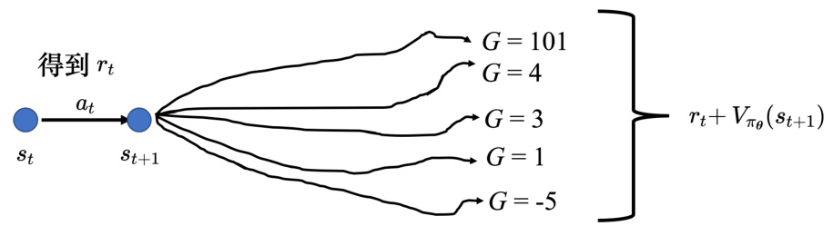  
图14.28 优势Actor-Critic  

Actor-Critic 有一个训练的技巧。Actor 和Critic 都是一个网络，Actor 网络的输入是一个游戏画面，其输出是每一个动作的分数。Critic 的输入是游戏画面，输出是一个数值，代表接下来会得到的累积奖励。图14.29 中有两个网络，它们的输入是一样的东西，所以这两个网络应该有部分的参数可以共用，尤其假设输入又是一个非常复杂的东西，比如说游戏画面，前面几层应该都需要是卷积神经网络。所以Actor 和Critic 可以共用前面几个层，所以在实践的时候往往会这样设计Actor-Critic。  

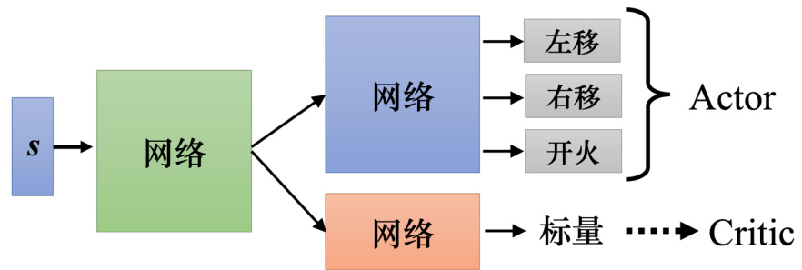  
图14.29 Actor-Critic 训练技巧  

强化学习还可以直接用Critic 决定要执行的动作，比如深度Q 网络（Deep Q-Network，DQN）。DQN 有非常多的变形，有一篇非常知名的论文“Rainbow: Combining Improvementsin Deep Reinforcement Learning”，把DQN 的七种变形集合起来，因为有七种变形集合起来，所以这个方法称为彩虹（rainbow）。  

强化学习里面还有很多技巧，比如稀疏奖励的处理方法以及模仿学习，详细内容可参考《Easy RL：强化学习教程》，此处不再赘述。此外，视觉强化学习（Visual ReinforcementLearning，VRL）是强化学习中非常有潜力的强化学习方向，与之前传统的基于状态的强化学习方法不同，其根据图片来直接学习控制策略，感兴趣的同学可阅读相关的论文，可参考Awesome Visual RL 论文清单：https://github.com/qiwang067/awesome-visual-rl。  

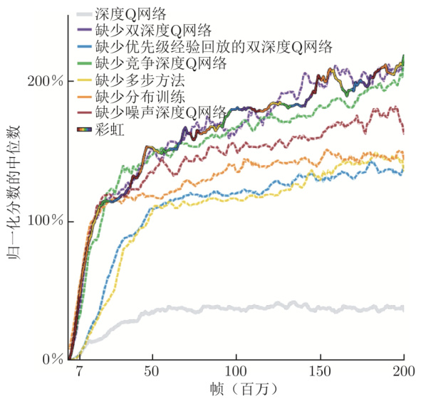  
图14.30 彩虹方法  

