# 第5章 单层网络：分类

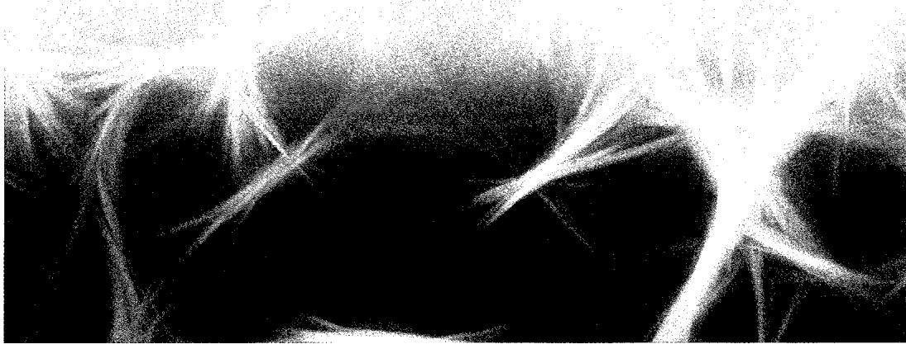

第4章探讨了一类回归模型，其中输出变量是模型参数的线性函数，因此可表示为具有单层权重和偏置参数的简单神经网络。接下来，我们将目光转向分类问题。本章将重点关注类似的一类模型，这类模型同样可以表示为单层神经网络。由此，本章先介绍诸多有关分类的关键概念，以便在后面各章讨论更为通用的深度神经网络。

分类旨在取一个输入向量  $\pmb{x} \in \mathbb{R}^D$ ，并将其归入  $K$  个离散类  $C_k$  中的一个类，其中  $k = 1, \dots, K$ 。在最常见的场景中，这些类是不相交的，因此每个输入向量都只能归入一个类。将输入空间划分为若干决策区域，这些决策区域（decision region）的边界称为决策边界（decision boundary）或决策面（decision surface）。本章使用线性模型进行分类，这意味着决策面是输入向量  $\pmb{x}$  的线性函数，由  $D$  维输入空间内的  $(D-1)$  维超平面定义。可以通过线性决策面进行精确分类的数据集，称为线性可分（linearly separable）数据集。线性分类模型可应用于非线性可分数据集，但并非所有的输入向量都能进行正确的分类。

我们可以大致确定解决分类问题的3种方法（参见5.2.4小节）。其中，最简单的方法是构建一个判别函数（discriminant function），该函数直接将每一个输入向量  $\pmb{x}$  归入一个特定类。然而，一种更有效的方法是在推理阶段依据条件概率  $p\left(\mathcal{C}_k\mid x\right)$  构建分布模型，然后利用这些分布模型做出最优决策。将推理和决策分开能带来很多好处。有两种不同的方法可以确定条件概率  $p\left(\mathcal{C}_k\mid x\right)$  。一种方法是直接建模，例如将它表示为参数模型，然后使用训练集对参数进行优化。这就是判别概率模型（discriminative probabilistic model）。另一种方法是对类-条件概率密度  $p\left(\boldsymbol {x}|\mathcal{C}_k\right)$  以及类的先验概率 $p\left(\mathcal{C}_k\right)$  进行建模，然后使用贝叶斯定理计算所需的后验概率：

$$
p \left(\mathcal {C} _ {k} \mid \boldsymbol {x}\right) = \frac {p \left(\boldsymbol {x} \mid \mathcal {C} _ {k}\right) p \left(\mathcal {C} _ {k}\right)}{p (\boldsymbol {x})} \tag {5.1}
$$

此为生成概率模型（generative probabilistic model），它提供了从每个类-条件概率密度  $p(\boldsymbol{x}|\mathcal{C}_k)$  生成样本的方法。

## 5.1 判别函数

判别式是一种函数，它取输入向量  $\pmb{x}$  并将其归入  $K$  个类（用  $\mathcal{C}_k$  表示）中的一个类。本章仅关注线性判别式（linear discriminant），即决策面为超平面的判别式。为了简化讨论，在研究多分类（ $K > 2$ ）之前，我们首先分析二分类。

### 5.1.1 二分类

线性判别函数的最简单表示是通过取输入向量的线性函数得出的，即

$$
y (\boldsymbol {x}) = \boldsymbol {w} ^ {\mathrm {T}} \boldsymbol {x} + w _ {0} \tag {5.2}
$$

其中， $\pmb{w}$  为权重向量， $w_0$  为偏置参数（请勿与统计学意义上的偏差混淆）。如果  $y(\pmb{x}) \geqslant 0$  ，输入向量  $\pmb{x}$  将被归入  $\mathcal{C}_1$  类，否则归入  $\mathcal{C}_2$  类。因此，相应的决策边界由关系  $y(\pmb{x}) = 0$  定义，对应于  $D$  维输入空间中的  $(D - 1)$  维超平面。考虑两个点  $\pmb{x}_A$  和  $\pmb{x}_B$  ，它们都位于决策面上。因为  $y(\pmb{x}_A) = y(\pmb{x}_B) = 0$  ，所以得出  $\pmb{w}^{\mathrm{T}}(\pmb{x}_A - \pmb{x}_B) = 0$  。向量  $\pmb{w}$  与位于决策面内的每个向量都是正交的， $\pmb{w}$  决定了决策面的朝向。同样，如果  $\pmb{x}$  是决策面上的一点，则  $y(\pmb{x}) = 0$  ，因此从原点到决策面的法向距离为

$$
\frac {\boldsymbol {w} ^ {\mathrm {T}} \boldsymbol {x}}{\| \boldsymbol {w} \|} = - \frac {\boldsymbol {w} _ {0}}{\| \boldsymbol {w} \|} \tag {5.3}
$$

可以看到，偏置参数  $w_{0}$  决定了决策面的位置。图5.1展示了  $D = 2$  情况下的此类特性。

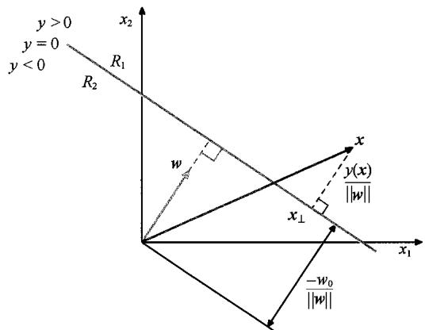  
图5.1二维线性判别函数的几何图解。红色所示的决策面垂直于  $w$  ，它离原点的位移由偏置参数  $\pmb{w}_0$  控制。同样，点  $\pmb{x}$  与决策面的带号正交距离由  $y(x) / \| w\|$  给出

此外，请注意， $y(x)$  的值为点  $x$  到决策面的垂直距离  $r$  的带号测度。为了方便理解，考虑任意一个点  $x$  ，设  $x_{\perp}$  是它在决策面上的正交投影，从而有

$$
x = x _ {\perp} + r \frac {w}{\| w \|} \tag {5.4}
$$

对式（5.4）的两边左乘  $\pmb{w}^{\mathrm{T}}$  并加上  $w_{0}$  ，且利用  $y(\pmb {x}) = \pmb{w}^{\mathrm{T}}\pmb {x} + w_{0}$  和  $y(x_{\perp}) = w^{T}x_{\perp} + w_{0} = 0$  可得

$$
r = \frac {y (\boldsymbol {x})}{\| \boldsymbol {w} \|} \tag {5.5}
$$

结果如图5.1所示。

如同线性回归模型（参见4.1.1小节），有时使用更简洁的符号较为方便，即给出一个额外的虚拟“输入”值  $x_0 = 1$  ，然后定义  $\tilde{\boldsymbol{w}} = (w_0, \boldsymbol{w})$  和  $\tilde{\boldsymbol{x}} = (x_0, \boldsymbol{x})$  ，从而有

$$
y (\boldsymbol {x}) = \tilde {\boldsymbol {w}} ^ {\mathrm {T}} \tilde {\boldsymbol {x}} \tag {5.6}
$$

在此情况下，决策面是通过  $(D + 1)$  维扩展输入空间原点的  $D$  维超平面。

### 5.1.2 多分类

下面将线性判别函数扩展到多分类（ $K > 2$ ）。我们可能会试图通过组合一些二分类判别函数来建立多分类判别式。然而，这将导致一些困难（Duda and Hart, 1973）。

假设一个模型有  $K - 1$  个分类器，每个分类器都要解决一个二分类问题，也就是将特定  $\mathcal{C}_k$  类中的点与其他的点分开。这就是所谓的一对多分类器。图5.2的左图给出了一个涉及3个类的例子，在该例中，这种方法会导致输入空间的区域分类不明确。

另一种方法是使用  $K(K - 1) / 2$  个二元判别函数，且每一对可能的类都有一个二元判别函数。这就是所谓的一对一分类器。然后根据判别函数的多数票对每个点进行分

类。然而，这也会导致区域分类不明确的问题，如图5.2的右图所示。

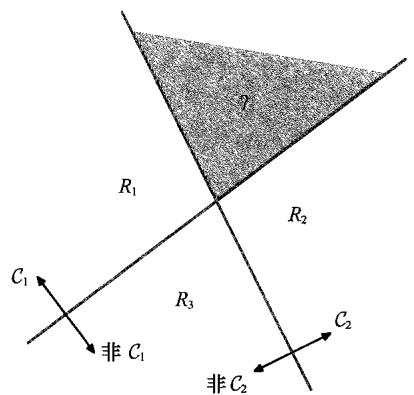  
图5.2 尝试从一组二分类判别函数中构建一个  $K$  类判别式会导致分类不明确的区域，如图中绿色所示。左图给出了一个涉及两个判别函数的例子，旨在对  $\mathcal{C}_k$  类中的点与非  $\mathcal{C}_k$  类中的点进行区分。右图给出了一个涉及3个判别函数的例子，其中的每个判别函数用于区分一对  $\mathcal{C}_k$  类和  $\mathcal{C}_j$  类

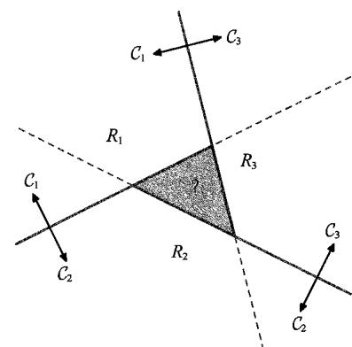

可通过采用  $K$  个线性函数组成的单个  $K$  类判别式来避免这些困难，其形式如下：

$$
y _ {k} (\boldsymbol {x}) = \boldsymbol {w} _ {k} ^ {\mathrm {T}} \boldsymbol {x} + w _ {k 0} \tag {5.7}
$$

然后在所有  $j \neq k$  的情况下，如果  $y_{k}(\pmb{x}) > y_{j}(\pmb{x})$  ，就将点  $\pmb{x}$  归入  $\mathcal{C}_k$  类。因此， $\mathcal{C}_k$  类和  $\mathcal{C}_j$  类之间的决策边界由  $y_{k}(\pmb{x}) = y_{j}(\pmb{x})$  给出，且对应于一个  $(D - 1)$  维的超平面，该超平面定义如下：

$$
\left(\boldsymbol {w} _ {k} - \boldsymbol {w} _ {j}\right) ^ {\mathrm {T}} \boldsymbol {x} + \left(w _ {k 0} - w _ {j 0}\right) = 0 \tag {5.8}
$$

由于它的形式与5.1.1节中讨论的二分类案例的决策边界相同，因此其具有类似的几何特性。

这种判别式的决策区域总是单连且凸出的。考虑两个点  $x_{A}$  和  $x_{B}$ ，它们都位于决策

区域  $R_{k}$  内，如图5.3所示。连接  $\pmb{x}_{A}$  和  $\pmb{x}_{B}$  的直线上的任何点  $\hat{\pmb{x}}$  都可以用如下形式来表示：

$$
\hat {\boldsymbol {x}} = \lambda \boldsymbol {x} _ {A} + (1 - \lambda) \boldsymbol {x} _ {B} \tag {5.9}
$$

其中  $0 \leqslant \lambda \leqslant 1$  。根据判别函数的线性关系，可得

$$
y _ {k} (\widehat {\boldsymbol {x}}) = \lambda y _ {k} \left(\boldsymbol {x} _ {A}\right) + (1 - \lambda) y _ {k} \left(\boldsymbol {x} _ {B}\right) \tag {5.10}
$$

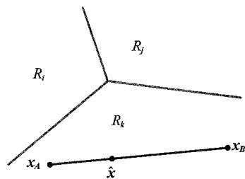  
图5.3 多分类线性判别式的决策区域，决策边界如红色所示。如果两点  $x_{A}$  和  $x_{B}$  都在同一决策区域  $R_{k}$  内，那么连接这两点的直线上的任何一点也必须在决策区域  $R_{k}$  内，从而决策区域必须是单连且凸出的

因为  $x_{A}$  和  $x_{B}$  都在决策区域  $R_{k}$  内，所以在所有 $j\neq k$  的情况下，  $y_{k}(\pmb{x}_{A}) > y_{j}(\pmb{x}_{A})$  且  $y_{k}(x_{B}) > y_{j}(x_{B})$  ，从而  $y_{k}(\hat{\pmb{x}}) > y_{j}(\hat{\pmb{x}})$  ，且  $\hat{\pmb{x}}$  也在决策区域  $R_{k}$  内。决策

区域  $R_{k}$  是单连且凸出的。

请注意，对于二分类问题，我们既可以采用书中讨论的基于两个判别函数  $y_{1}(x)$  和  $y_{2}(x)$  的形式，也可以采用基于单个判别函数  $y(x)$  的更简单但本质上等价的形式（参见5.1.1小节）。

### 5.1.3 1-of-K编码方案

对于回归问题，多元目标变量  $t$  只是我们希望预测其值的实数向量。在分类问题中，有多种使用目标值来表示类标签的方法。对于二分类问题，最方便的是单目标变量  $t \in \{0,1\}$  的二进制表示，所以  $t = 1$  表示  $\mathcal{C}_1$  类， $t = 0$  表示  $\mathcal{C}_2$  类。我们可将  $t$  的值理解为该类是  $\mathcal{C}_1$  类的概率，概率值仅取0和1的极值。对于多分类（ $K > 2$ ）问题，使用1-of- $K$  编码方案较为方便，其也称独热编码方案，其中  $t$  是长度为  $K$  的向量，从而如果该类是  $\mathcal{C}_j$  类，则  $t$  的所有元素  $t_k$  都为0，只有元素  $t_j$  的值为1。例如，假设有  $K = 5$  个类，则来自  $\mathcal{C}_2$  类的数据点将得到目标向量

$$
\boldsymbol {t} = (0, 1, 0, 0, 0) ^ {\mathrm {T}} \tag {5.11}
$$

同样，我们可以把  $t_k$  的值理解为该类是  $C_k$  类的概率，其中概率仅有0和1两种取值。

### 5.1.4 最小二乘分类

在线性回归模型中，通过最小化平方和误差函数，可以得到参数值的简单闭式解（参见4.1.3小节）。因此，我们期待将同样的最小二乘形式应用于分类问题。考虑一个涉及  $K$  个类的一般分类问题，以及目标向量  $\pmb{t}$  的1-of-  $K$  二进制编码方案。在此种情况下使用最小二乘法的一个理由是，它近似于给定输入向量时目标值的条件期望  $\mathbb{E}[t|x]$  。对于二进制编码方案，该条件期望由类的后验概率向量给出（见习题5.1）。遗憾的是，这些概率的近似值通常很低，而且近似值的取值范围实际可能超出(0,1)。但尽管如此，研究这些简单的模型并了解这些局限性是如何产生的仍具有指导意义。

每个  $\mathcal{C}_k$  类都由各自的线性模型描述，所以

$$
y _ {k} (\boldsymbol {x}) = \boldsymbol {w} _ {k} ^ {\mathrm {T}} \boldsymbol {x} + w _ {k 0} \tag {5.12}
$$

其中  $k = 1,\dots ,K$  。我们可以方便地使用向量表示法将它们归为一组，从而

$$
\boldsymbol {y} (\boldsymbol {x}) = \widetilde {\boldsymbol {W}} ^ {\mathrm {T}} \tilde {\boldsymbol {x}} \tag {5.13}
$$

其中  $\widetilde{\pmb{W}}$  是一个矩阵，其第  $k$  列包含  $(D + 1)$  维向量  $\tilde{\boldsymbol{w}}_k = \left(w_{k0},\boldsymbol{w}_k^{\mathrm{T}}\right)^{\mathrm{T}}$  ，  $\tilde{\pmb{x}}$  是相应的增广输入向量  $(1,\pmb{x}^{\mathrm{T}})^{\mathrm{T}}$  ，虚拟输入  $\pmb {x}_0 = 1$  。然后将新输入  $\pmb{x}$  归入输出  $y_{k} = \overline{w}_{k}^{\mathrm{T}}\overline{x}$  最大的类。

下面我们通过将平方和误差函数最小化来确定参数矩阵  $\widetilde{\pmb{W}}$  。考虑一个训练数据集

$\{\pmb{x}_n, \pmb{t}_n\}$ ，其中  $n = 1, \dots, N$ ，并定义一个第  $n$  行为向量  $\pmb{t}_n^{\mathrm{T}}$  的矩阵  $\pmb{T}$  和另一个第  $n$  行为向量  $\widetilde{\pmb{x}}_n^{\mathrm{T}}$  的矩阵  $\widetilde{\pmb{X}}$ 。因此，平方和误差函数可以写成

$$
E _ {D} (\widetilde {\boldsymbol {W}}) = \frac {1}{2} \operatorname {t r} \left\{(\widetilde {\boldsymbol {X}} \widetilde {\boldsymbol {W}} - \boldsymbol {T}) ^ {\mathrm {T}} (\widetilde {\boldsymbol {X}} \widetilde {\boldsymbol {W}} - \boldsymbol {T}) \right\} \tag {5.14}
$$

将与  $\widetilde{W}$  有关的导数设为0并进行重新排列，从而求得  $\widetilde{W}$  的解，其形式为

$$
\widetilde {\boldsymbol {W}} = \left(\widetilde {\boldsymbol {X}} ^ {\mathrm {T}} \widetilde {\boldsymbol {X}}\right) ^ {- 1} \widetilde {\boldsymbol {X}} ^ {\mathrm {T}} \boldsymbol {T} = \widetilde {\boldsymbol {X}} ^ {\dagger} \boldsymbol {T} \tag {5.15}
$$

其中  $\tilde{X}^{\dagger}$  是矩阵  $\tilde{X}$  的伪逆（参见4.1.3小节），从而求得如下形式的判别函数：

$$
\boldsymbol {y} (\boldsymbol {x}) = \widetilde {\boldsymbol {W}} ^ {\mathrm {T}} \tilde {\boldsymbol {x}} = \boldsymbol {T} ^ {\mathrm {T}} \left(\widetilde {\boldsymbol {X}} ^ {\dagger}\right) ^ {\mathrm {T}} \tilde {\boldsymbol {x}} \tag {5.16}
$$

具有多元目标变量的最小二乘解拥有一个有趣的特性，即如果训练集中的每个目标向量都满足某些线性约束条件，如

$$
\boldsymbol {a} ^ {\mathrm {T}} \boldsymbol {t} _ {n} + b = 0 \tag {5.17}
$$

则对于某些常数  $a$  和  $b$ ,  $x$  的任意值的模型预测都将满足相同的约束条件, 从而 (参见习题5.3)

$$
\boldsymbol {a} ^ {\mathrm {T}} \boldsymbol {y} (\boldsymbol {x}) + b = 0 \tag {5.18}
$$

因此，如果我们针对多分类问题使用1-of-  $K$  编码方案，那么模型所做的预测将具有这样的特性：对于任意  $\pmb{x}$  值，  $y(x)$  的元素之和都为1。然而，仅凭该求和约束条件还不足以将模型输出理解为概率，因为它们并没有被限制在区间（0,1）内。

最小二乘法给出了判别函数参数的精确闭式解。然而，即使作为一个判别函数（我们直接用它来做决定，且不需要做任何概率解释），它也存在一些严重的问题。你已经看到，在高斯噪声分布的假设下，平方和误差函数可以看作负对数似然（参见2.3.4小节）。如果数据的真实分布明显不同于高斯分布，则最小二乘法的结果就会很差。特别是，最小二乘法对离群值（与大部分数据点相距甚远的数据点）的存在非常敏感，如图5.4所示。我们可以看到，图5.4右图中的附加数据点使决策边界的位置发生了显著变化，尽管这些数据点会被左图中的原始决策边界正确分类。平方和误差函数对距离决策边界较远的数据点赋予了过高的权重，即使这些数据点是被正确分类的。离群值可能由于罕见事件，或仅仅由于数据集中的错误而产生。由此，对极少数数据点敏感的技术是缺乏鲁棒性的。为便于比较，图5.4还显示了使用一种称为逻辑斯谛回归（logistic regression）的技术（参见5.4.3小节）得出的结果，该技术对离群值的鲁棒性更强。

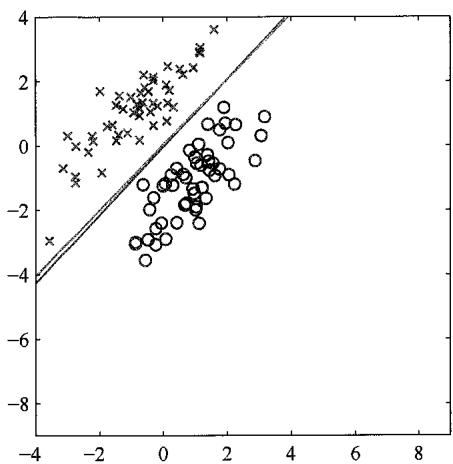  
图5.4左图显示了来自两个类的数据（分别用红色十字和蓝色圆圈表示），以及通过使用最小二乘法（洋红色曲线）和逻辑斯谛回归模型（绿色曲线）得到的决策边界。右图展示了在图的右下方添加额外数据点后得到的相应结果。与逻辑斯谛回归不同的是，最小二乘法对离群值高度敏感

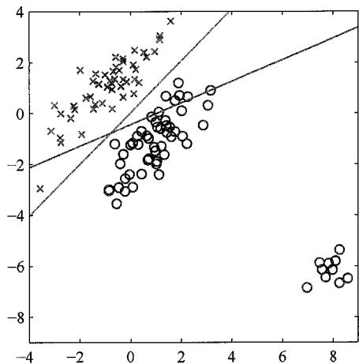

回想一下，最小二乘法对应的是高斯条件分布假设下的最大似然，而二进制目标向量的分布显然远非高斯分布，于是最小二乘法的失败也就不足为奇了。通过采用更合适的概率模型，我们可以获得相比最小二乘法性能更好的分类技术，而且还可以将其扩展以得到灵活的非线性神经网络模型，详见后续章节。

## 5.2 决策理论

在讨论线性回归时，机器学习中的预测过程可分为推理和决策（参见4.2节）两个阶段。下面我们特别结合分类器对这一观点进行更深入的探讨。

假设有一个输入向量  $\pmb{x}$  和一个相应的目标变量  $t$  ，我们想要在给定  $\pmb{x}$  的新值时预测 $t$  。对于回归问题，  $t$  将由连续变量组成且通常是一个向量，因为我们可能希望预测几个相关的量。对于分类问题，  $t$  将代表类标签。同样，如果有两个以上的类，  $t$  通常是一个向量。联合概率分布  $p(\pmb {x},t)$  完整总结了与这些变量相关的不确定性。作为推理的一个例子，从一组训练数据中确定  $p(\pmb {x},t)$  通常是一个解决起来非常困难的问题，本书大部分篇幅讨论的就是如何解决这个问题。然而在实际应用中，我们往往必须对  $t$  的值做出具体预测，或者更一般地说，我们必须根据对  $t$  可能取值的理解而采取具体行动。这正是决策理论的主题。

例如，在之前的医学诊断问题中，我们拍摄了病人皮肤病变的图像，并希望确定病人是否患有癌症。在这种情况下，输入向量  $\pmb{x}$  是图像中像素强度的集合，而输出变量  $t$  要么代表未患癌症，用  $\mathcal{C}_1$  类表示，要么代表患有癌症，用  $\mathcal{C}_2$  类表示。例如，我们可以选择  $t$  作为二进制变量，使得  $t = 0$  对应  $\mathcal{C}_1$  类， $t = 1$  对应  $\mathcal{C}_2$  类。稍后我们将看到，在计算概率时，这种标签值的选择特别方便。一般情况下，推理问题涉及确定联合分布  $p(x, \mathcal{C}_k)$ ，它等价于  $p(x, t)$ ，其对变量进行了完整的概率描述。虽然这是一个非常有

用的信息，但归根结底，我们必须决定是否对患者进行治疗，而且我们希望能够根据某种适当的准则，做出最佳选择（Duda and Hart，1973）。此为决策步骤，而决策理论旨在告诉我们如何在适当的概率条件下做出最优决策。一旦解决了推理问题，你就会发现决策阶段通常非常简单。在此，我们介绍了学习本书其余部分所需了解的决策理论的主要观点。要想了解更多的背景知识和更详细的信息，请参阅 Berger（1985）和 Bather（2000）。

在进行更详细的分析之前，有必要非正式地分析一下我们期望概率在制定决策时如何发挥作用。当获得新患者的皮肤病变图像  $\pmb{x}$  时，需要决定将图像归入两类中的哪一类。因此我们感兴趣的是，在给定图像的情况下， $p(\mathcal{C}_k\mid x)$  给出这两类的概率。利用贝叶斯定理，这些概率可用如下形式表示：

$$
p \left(\mathcal {C} _ {k} \mid x\right) = \frac {p (x \mid \mathcal {C} _ {k}) p \left(\mathcal {C} _ {k}\right)}{p (x)} \tag {5.19}
$$

请注意，贝叶斯定理中出现的任何量都可通过将适当变量边际化或条件化而从联合分布  $p(\boldsymbol{x},\mathcal{C}_k)$  中得到。现在，我们可以将  $p(\mathcal{C}_k)$  解释为  $\mathcal{C}_k$  类的先验概率，并将  $p(\mathcal{C}_k|\boldsymbol{x})$  解释为相应的后验概率。因此， $p(\mathcal{C}_1)$  代表在拍摄皮肤病变图像之前某人患癌的概率。同样， $p(\mathcal{C}_1|\boldsymbol{x})$  是后验概率，我们对其根据图像所含的信息已使用贝叶斯定理进行了修正。如果想要尽量降低将  $\boldsymbol{x}$  归入错误类的概率，则可以根据直觉选择后验概率较高的类。接下来我们将证明这种直觉是正确的并讨论更普遍的决策制定准则。

### 5.2.1 误分类率

假设我们的目标只是尽可能减少误分类，则需要一条规则，以便将  $x$  的每个值归入一个可用的类。该规则会将输入空间划分为若干决策区域  $R_{k}$ ，每个类拥有一个决策区域，从而  $R_{k}$  中的所有点都会被归入  $\mathcal{C}_k$  类。决策区域之间的边界称为决策边界或决策面。需要注意的是，每个决策区域不需要是连续的，但可包含若干不相交的区域。为得到最优决策规则，首先考虑二分类，例如癌症检查。当属于  $\mathcal{C}_1$  类的输入向量被归入  $\mathcal{C}_2$  类或反之时，就会出现错误。发生这种情况的概率为

$$
\begin{array}{l} p (\text {错 误}) = p \left(\boldsymbol {x} \in R _ {1}, \mathcal {C} _ {2}\right) + p \left(\boldsymbol {x} \in R _ {2}, \mathcal {C} _ {1}\right) \tag {5.20} \\ = \int_ {R _ {1}} p (\boldsymbol {x}, \mathcal {C} _ {2}) d \boldsymbol {x} + \int_ {R _ {2}} p (\boldsymbol {x}, \mathcal {C} _ {1}) d \boldsymbol {x} \\ \end{array}
$$

我们可以自由选择将每个点  $\pmb{x}$  归入两个类之一的决策规则。显然，为了将  $p$  （错误）最小化，我们应该将每个点  $\pmb{x}$  归入式（5.20）中被积函数值较小的类。因此，对于给定的  $\pmb{x}$  值，如果  $p(x, \mathcal{C}_1) > p(x, \mathcal{C}_2)$ ，则归入  $\mathcal{C}_1$  类。根据概率的乘积法则，可以得到  $p(x, \mathcal{C}_k) = p(\mathcal{C}_k | x)p(x)$  。由于  $p(x)$  是两个项的公因子，因此我们可以将这一结果重新表述为：如果将  $\pmb{x}$  的每个值归入后验概率  $p(\mathcal{C}_k | x)$  最大的类，则犯错的概率最小。

图5.5展示了二分类和单一输入变量  $x$  的结果。

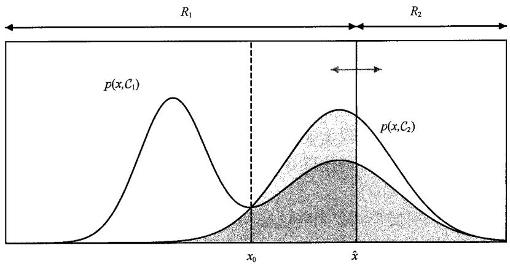  
(a)

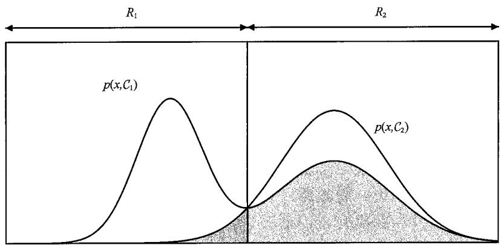  
(b)  
图5.5二分类中每个类的联合概率  $p(x,\mathcal{C}_k)$  与  $\mathcal{X}$  的关系以及决策边界  $x = \hat{x}$  的示意图。  $x\geqslant \hat{x}$  的点被归入  $\mathcal{C}_2$  类，因此属于决策区域  $R_{2}$  ；而  $x <   \hat{x}$  的点被归入  $\mathcal{C}_1$  类，因此属于决策区域  $R_{1}$  。误差来自蓝色、绿色和红色区域，因此当  $x <   \hat{x}$  时，误差是由于属于  $\mathcal{C}_2$  类的点被错误分类为  $\mathcal{C}_1$  类（由红色和绿色区域之和表示）而产生的；而当  $x\geqslant \hat{x}$  时，误差是由于属于  $\mathcal{C}_l$  类的点被错误分类为  $\mathcal{C}_2$  类（由蓝色区域表示）而产生的。通过改变决策边界的位置  $\hat{x}$  如图(a)中红色双箭头所示，可使蓝色和绿色区域的总面积保持不变，而红色区域的面积则有所变化。如图(b)所示，对应于  $\hat{x} = x_0$  ，  $\hat{x}$  的最佳选择是  $p(x,\mathcal{C}_1)$  和  $p(x,\mathcal{C}_2)$  曲线的相交处，因为红色区域在这种情况下消失了。这相当于最小化误分类率决策规则，  $\mathcal{X}$  的每个值被归入后验概率  $p(\mathcal{C}_k|x)$  较高的类

在更一般的多分类情况下，将正确概率最大化稍显容易，其计算公式如下：

$$
p (\text {正 确}) = \sum_ {k = 1} ^ {K} p \left(\boldsymbol {x} \in R _ {k}, \mathcal {C} _ {k}\right) = \sum_ {k = 1} ^ {K} \int_ {R _ {k}} p \left(\boldsymbol {x}, \mathcal {C} _ {k}\right) \mathrm {d} \boldsymbol {x} \tag {5.21}
$$

当决策区域  $R_{k}$  使得每个  $\pmb{x}$  被归入  $p\big(x,\mathcal{C}_k\big)$  最大的类时，正确概率就会最高。同样，利用概率的乘积法则  $p\big(\boldsymbol {x},\mathcal{C}_k\big) = p\big(\mathcal{C}_k\mid \boldsymbol {x}\big)p(\boldsymbol {x})$  ，  $p(\pmb {x})$  是所有项的公因子，每个  $\pmb{x}$  都应被

归入后验概率  $p\left(\mathcal{C}_k \mid x\right)$  最大的类。

### 5.2.2 预期损失

在许多应用中，我们的目标相比仅减少误分类数量更为复杂。让我们再次回到医疗诊断问题。我们注意到，如果一名未患癌症的病人被误诊为患有癌症，后果可能是他会经历一些痛苦，而且还需要接受进一步的检查。相反，如果癌症患者被误诊为身体健康，后果可能是他由于没有接受相应治疗而过早死亡。因此，这两种错误可能导致截然不同的后果。显然，即使冒着犯下更多第一种错误的风险，也不要犯第二种错误。

我们可以通过采用损失函数来将这些问题形式化，损失函数是对采取任何可供选择之决策或行动所造成损失的单一、总体衡量。因此，我们的目标是最大限度地减少总损失。请注意，有些学者考虑使用效用函数（utility function），并希望最大化效用函数的值。如果我们把效用简单地理解为损失的负数，那么这两个概念是等价的。假设一个新的  $x$  值实际上属于  $\mathcal{C}_k$  类，而我们却将  $x$  归入  $\mathcal{C}_j$  类（其中  $j$  可能等于也可能不等于  $k$ ）。在此过程中，我们会遭受一定程度的损失（用  $L_{kj}$  表示），我们可

$$
\begin{array}{c c} \text {n o r m a l} & \text {c a n c e r} \\ \text {n o r m a l} & 0 \\ \text {c a n c e r} & 1 0 0 \end{array}
$$

图5.6 癌症检查示例中元素为  $L_{kj}$  的损失矩阵示例。行代表真实类，而列代表根据决策准则所做的分类

以将其视为损失矩阵的  $(k,j)$  元素。例如，在癌症检查示例中，我们可能得到图5.6所示形式的一个损失矩阵。这个特定的损失矩阵表示，如果决策正确，就不会有任何损失；如果一个身体健康的人被误诊患有癌症，则会遭受1的损失；而如果一个癌症患者被误诊为身体健康，则会遭受100的损失。

将损失函数最小化的解为最优解。然而，损失函数取决于真实类，而真实类是未知的。对于给定的输入向量  $\pmb{x}$ ，我们使用联合概率分布  $p(x, C_k)$  来表示真实类的不确定性。我们可以转而寻求将预期损失最小化，预期损失的计算公式为

$$
\mathbb {E} [ L ] = \sum_ {k} \sum_ {j} \int_ {R _ {j}} L _ {k j} p (x, C _ {k}) d x \tag {5.22}
$$

每个  $\pmb{x}$  可被独立归入决策区域  $R_{j}$  中的一个类。我们想要通过选择决策区域  $R_{j}$  来将预期损失［式（5.22）］最小化，这意味着对于每个  $\pmb{x}$ ，我们都应该将  $\sum_{k}L_{kj}p\bigl (x,\mathcal{C}_{k}\bigr)$  最小化。和前面一样，我们可以使用概率的乘积法则  $p\big(x,\mathcal{C}_k\big) = p\big(\mathcal{C}_k\mid x\big)p(\boldsymbol {x})$  来消除公因子  $p(x)$  。因此，能够最小化期望损失的决策规则会将每个新的  $\pmb{x}$  分配给能使下式最小的类别  $j$  ：

$$
\sum_ {k} L _ {k j} p \left(\mathcal {C} _ {k} \mid x\right) \tag {5.23}
$$

### 5.2.3 拒绝选项

我们已经看到，分类误差产生于输入空间的区域，其中最大后验概率  $p(\mathcal{C}_k|\mathbf{x})$  明显小于1，或等价地，联合分布  $p(x,\mathcal{C}_k)$  存在相近的概率值。在这些区域，我们对归属关系相对不确定。在某些应用中，应避免对疑难案例做出决策，以期在做出分类决策的案例中获得较低的误差率。这就是所谓的拒绝选项（rejection option）。例如，在癌

症检查示例中，我们使用自动系统对那些几乎不需要怀疑是否被正确分类的图像进行分类，而要求通过活检来对较为可疑的病例进行分类，这可能是较为合适的做法。为此，我们可以引入阈值  $\theta$  ，并拒绝那些后验概率  $p\left(\mathcal{C}_k|x\right)$  的最大值小于或等于  $\theta$  的输入变量  $\pmb{x}$  。图5.7以二分类和一个连续输入变量  $\pmb{x}$  为例进行了说明。请注意，通过设置  $\theta = 1$  ，可以确保拒绝所有示例；而如果有  $K$  个类，那么设置  $\theta < 1 / K$  可以确保不拒绝任何示例。因此，被拒绝示例的比例受阈值  $\theta$  的控制。

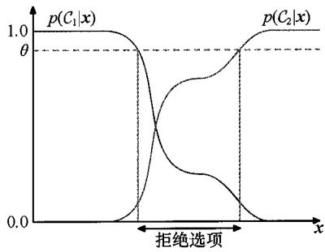  
图5.7拒绝选项的示意图。如果输入变量  $x$  的两个后验概率中的较大值小于或等于某个阈值  $\theta$  ，则  $x$  会被拒绝

在给定损失矩阵的情况下，通过考虑做出拒绝决定时产生的损失，我们可以很容易地扩展拒绝准则以使预期损失最小化（见习题5.10）。

### 5.2.4 推理和决策

解决分类问题的过程分为两个独立的阶段：在推理阶段，我们使用训练数据学习  $p(\mathcal{C}_k|x)$  模型；在随后的决策阶段，我们使用这些后验概率来进行最优分类。另一种可能性是同时解决这两个问题，只需要学习一个能将输入变量  $\pmb{x}$  直接映射为决策的函数即可。这个函数就是所谓的判别函数。

事实上，我们可以找出三种不同的方法来解决决策问题，且每种方法都已得到实际应用，按复杂程度递减的顺序排列如下。

(a) 首先解决确定每个  $\mathcal{C}_k$  类的类-条件概率密度  $p\big(x|\mathcal{C}_k\big)$  的推理问题。分别推断类的先验概率  $p\big(\mathcal{C}_k\big)$  。然后使用贝叶斯定理，其形式为

$$
p \left(\mathcal {C} _ {k} \mid \boldsymbol {x}\right) = \frac {p \left(\boldsymbol {x} \mid \mathcal {C} _ {k}\right) p \left(\mathcal {C} _ {k}\right)}{p (\boldsymbol {x})} \tag {5.24}
$$

求出类的后验概率  $p\big(\mathcal{C}_k|x\big)$  。按照惯例，使用如下公式，式（5.24）中的分母可以根据分子中项的数量求出：

$$
p (\boldsymbol {x}) = \sum_ {k} p \left(\boldsymbol {x} \mid \mathcal {C} _ {k}\right) p \left(\mathcal {C} _ {k}\right) \tag {5.25}
$$

同样，我们可以直接建立联合分布  $p(\mathbf{x},\mathcal{C}_k)$  ，然后进行归一化处理以得出后验概

率。在得出后验概率后，利用决策理论确定每个新输入的  $x$  归入哪个类。对输入和输出的分布进行显式或隐式建模的方法叫作生成式模型，因为通过从它们中采样，我们可以在输入空间中生成合成数据点。

(b) 首先解决确定类的后验概率  $p\left(\mathcal{C}_k \mid x\right)$  的推理问题，然后使用决策理论将每个新输入的  $x$  归入其中一个类。直接对后验概率进行建模的方法称为判别模型。  
(c) 计算出一个称为判别函数的函数  $f(x)$ ，它能将每个新输入的  $x$  直接映射到类标签上。例如，对于二分类问题， $f(\cdot)$  可能是二进制值，从而  $f = 0$  代表  $\mathcal{C}_1$  类，而  $f = 1$  代表  $\mathcal{C}_2$  类。在这种情况下，概率不起任何作用。

让我们来看看这三种方法的相对优势。方法(a)要求最高，因为它需要求出  $\pmb{x}$  和 $\mathcal{C}_k$  的联合分布。在许多应用中，  $\pmb{x}$  是高维度的，因此我们可能需要大量的训练集才能合理、准确地确定类-条件概率密度。请注意，类的先验概率  $p\bigl (\mathcal{C}_k\bigr)$  通常可以通过每个类中的训练集数据点的比例简单估算出来。不过，方法(a)的一个优点是，它可以根据式（5.25）求出  $p(x)$  的边缘密度。这有助于检测模型中概率较低的新数据点，针对这些数据点的预测可能准确性较低。我们将此类检测称作离群值检测（outlier detection）或奇异值检测（novelty detection）（Bishop,1994;Tarassenko,1995）。

但是，如果我们只想做分类决策，那么寻找联合分布  $p(x, \mathcal{C}_k)$  可能会浪费计算资源，而且对数据的要求过高，实际上我们只需要后验概率  $p(\mathcal{C}_k | x)$ ，其可通过方法 (b) 直接获得。如图 5.8 所示，类-条件概率密度可能包含大量对后验概率影响不大的结构。人们一直对探索机器学习的生成法和判别法的相对优势，以及寻找将它们结合起来的方法有着浓厚的兴趣（Jebara, 2004; Lasserre, Bishop, and Minka, 2006）。

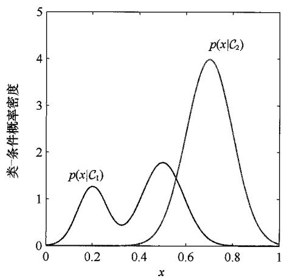  
图5.8具有单一输入变量  $x$  的两个类的类一条件概率密度（左图）和相应的后验概率（右图）。请注意，左图中的类一条件概率密度  $p(x|\mathcal{C}_1)$  （由蓝色曲线所示）的左侧模式对后验概率没有影响。右图中的垂直绿线表示  $x$  的决策边界，假定先验概率  $p(\mathcal{C}_1)$  和  $p(\mathcal{C}_2)$  相等，此时决策边界的误分类率最小

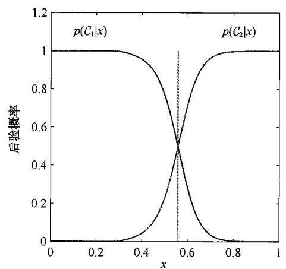

方法(c)更简单：利用训练数据得出一个将每个新输入的  $x$  直接映射到一个类标

签上的判别函数  $f(x)$ ，从而将推理阶段和决策阶段合并为一个单一学习问题。在图5.8中，这相当于求得垂直绿线所示的  $x$  值，因为这是误分类率最小的决策边界。

然而，如果采用方法(c)，我们就无法再获得后验概率  $p\big(\mathcal{C}_k\mid \boldsymbol {x}\big)$  。我们有许多有力的理由计算后验概率，这些理由如下。

（1）降低风险。考虑这样一个问题：损失矩阵的元素时常会被修改（例如修改可能发生在财务应用中）。如果我们知道后验概率，就可以通过适当修改式（5.23）来修订最小风险决策准则。如果我们仅有一个判别函数，那么损失矩阵的任何变化都要求我们返回训练数据并重新解决推理问题。  
（2）拒绝选项。通过后验概率，我们可以确定一个拒绝准则。在给定拒绝数据点比例的情况下，该拒绝准则能使误分类率或预期损失最小化。  
（3）补偿类的先验。仍以癌症检查为例（参见2.1.1小节），假设我们已从普通人群中收集大量皮肤病变图像作为训练数据，并用这些数据建立了一个自动筛查系统。由于癌症在普通人群中罕见，我们可能会发现，每1000个人中只有1人患有癌症。

如果使用这样一个数据集来训练自适应模型，我们可能会遇到严重的困难，因为癌症类数据的比例较小。例如，将每个点都归入正常类的分类器将达到  $99.9\%$  的准确率，而这种无效解可能很难避免。此外，即使是大型数据集，其中包含的与癌症相对应的皮肤病变图像也非常少，学习算法不会接触到很多此类图像，因而不可能达到很好的泛化效果。通过一个均衡的数据集（其中的每个类都有相同数量的示例），我们可以找到更精确的模型。不过，我们还必须对训练数据的修改效果进行补偿。假设我们使用了这样一个修改过的数据集，并找到了后验概率模型。根据贝叶斯定理[式（5.24）]，后验概率与先验概率成正比，我们可以将后验概率解释为每个类中数据点的比例。因此，只需要将我们从人为平衡的数据集中得到的后验概率除以该数据集中的类比例，再乘以我们希望应用该模型的人群中的类比例即可。最后，我们需要进行归一化处理，以确保新的后验概率的和为1。请注意，如果我们直接学习判别函数，而不是确定后验概率，则无法应用这一方法。

（4）模型整合。在复杂的应用中，我们可能希望将问题分解成若干较小的子问题，每个子问题都可以用一个单独的模块来解决。例如，在医疗诊断问题中，我们可以从血液检测和皮肤病变图像中获得信息。与其将所有这些异构信息整合到一个巨大的输入空间中，不如建立一个系统来解释图像，并建立另一个系统来解释血液数据，这样可能会更有效。如果两个模型都给出了类的后验概率，则可以利用概率规则系统地整合输出结果。一种简单的方法是，假设每个类的图像（用  $x_{I}$  表示）和血液数据（用  $x_{B}$  表示）的输入分布是独立的，于是有

$$
p \left(\boldsymbol {x} _ {I}, \boldsymbol {x} _ {B} \mid \mathcal {C} _ {k}\right) = p \left(\boldsymbol {x} _ {I} \mid \mathcal {C} _ {k}\right) p \left(\boldsymbol {x} _ {B} \mid \mathcal {C} _ {k}\right) \tag {5.26}
$$

这是条件独立性（参见11.2节）的一个例子，因为当分布以  $C_k$  类为条件时，独立性保持不变。在给定图像和血液数据的条件下，后验概率为

$$
\begin{array}{l} p \left(\mathcal {C} _ {k} \mid \boldsymbol {x} _ {I}, \boldsymbol {x} _ {B}\right) \propto p \left(\boldsymbol {x} _ {I}, \boldsymbol {x} _ {B} \mid \mathcal {C} _ {k}\right) p \left(\mathcal {C} _ {k}\right) \\ \propto p \left(\boldsymbol {x} _ {I} \mid \mathcal {C} _ {k}\right) p \left(\boldsymbol {x} _ {B} \mid \mathcal {C} _ {k}\right) p \left(\mathcal {C} _ {k}\right) \tag {5.27} \\ \propto \frac {p \left(\mathcal {C} _ {k} \mid \boldsymbol {x} _ {I}\right) p \left(\mathcal {C} _ {k} \mid \boldsymbol {x} _ {B}\right)}{p \left(\mathcal {C} _ {k}\right)} \\ \end{array}
$$

因此，我们需要类的先验概率  $p\left(\mathcal{C}_k\right)$ ，其可以很容易地从每个类的数据点比例中估算出来。然后，我们需要将得到的后验概率归一化，使它们的和为1。特殊的条件独立性假设［式（5.26）］是朴素贝叶斯模型（参见11.2.4小节）的一个例子。注意，在这个模型下，联合边缘分布  $p(\boldsymbol{x}_I,\boldsymbol{x}_B)$  通常不会分解。后续章节将展示如何构建不需要条件独立性假设的数据组合模型。使用输出概率而不是决策的模型的另一个优点是，它们可以很容易地对任何可调参数（例如多项式回归示例中的权重系数）进行微导，从而使用基于梯度（参见第7章）的优化方法来组合和联合训练它们。

### 5.2.5 分类器精度

衡量分类器性能的最简单方法是计算测试集中被正确分类的数据点所占的比例。然而，不同类型的误差会导致不同的后果，正如损失矩阵所表现的那样。因此，我们往往不只是希望尽量减少误分类量。通过改变决策边界的位置，我们可以在不同类型的错误之间做出权衡，例如以最小化预期损失为目标。考虑到该概念的重要性，我们将介绍一些定义和术语，以便更好地描述分类器的性能。

让我们再次回到癌症检查示例（参见2.1.1小节）。每个受测者都有一个是否患有癌症的“真实标签”以及分类器做出的预测。如果分类器对某个特定的人预测出癌症，而这实际上是真实标签，那么称这种预测为真阳性（True Positive，TP）。但是，如果这个人未患癌症，则称这种预测为假阳性（False Positive，FP）。同样，如果分类器预测一个人未患癌症，而且预测是正确的，则称这种预测为真阴性（True Negative，TN），否则就称为假阴性（False Negative，FN）。假阳性也称第一类误差（type 1 error），而假阴性则称第二类误差（type 2 error）。假设  $N$  是参加测试的总人数，那么  $N_{\mathrm{TP}}$  是真阳性人数， $N_{\mathrm{FP}}$  是假阳性人数， $N_{\mathrm{TN}}$  是真阴性人数， $N_{\mathrm{FN}}$  是假阴性人数，其中

$$
N = N _ {\mathrm {T P}} + N _ {\mathrm {F P}} + N _ {\mathrm {T N}} + N _ {\mathrm {F N}} \tag {5.28}
$$

$$
\begin{array}{l} \text {n o r m a l} \\ \text {c a n c e r} \end{array} \left( \begin{array}{l l} N _ {\mathrm {T N}} & N _ {\mathrm {F P}} \\ N _ {\mathrm {F N}} & N _ {\mathrm {T P}} \end{array} \right)
$$

图5.9 癌症治疗问题的混淆矩阵，其中行代表真实类，列代表根据决策准则所做的分类。该混淆矩阵的元素分别表示真阴性、假阳性、假阴性和真阳性的数量

如图5.9所示，这可以用混淆矩阵（confusion matrix）来表示。用正确分类率来衡量的准确率为

$$
\text {准 确 率} = \frac {N _ {\mathrm {T P}} + N _ {\mathrm {T N}}}{N _ {\mathrm {T P}} + N _ {\mathrm {F P}} + N _ {\mathrm {T N}} + N _ {\mathrm {F N}}} \tag {5.29}
$$

正如我们所看到的，如果存在严重失衡的类，则准确率可能会误导人。例如，在癌症检查示例中，每1000个简单的判定无人患有癌症的朴素分类器将达到  $99.9\%$  的准

确率，但它实际上毫无用处。

我们也可以根据这些量来定义其他几个量，其中最常见的如下。

$$
\text {精 确 率} = \frac {N _ {\mathrm {T P}}}{N _ {\mathrm {T P}} + N _ {\mathrm {F P}}} \tag {5.30}
$$

$$
\text {召 回 率} = \frac {N _ {\mathrm {T P}}}{N _ {\mathrm {T P}} + N _ {\mathrm {F N}}} \tag {5.31}
$$

$$
\text {假 阳 性 率} = \frac {N _ {\mathrm {F P}}}{N _ {\mathrm {F P}} + N _ {\mathrm {T N}}} \tag {5.32}
$$

$$
\text {假 发 现 率} = \frac {N _ {\mathrm {F P}}}{N _ {\mathrm {F P}} + N _ {\mathrm {T P}}} \tag {5.33}
$$

在癌症检查示例中，精确率代表对检测结果呈阳性的人确实患有癌症概率的预估，而召回率则是对正确检测出癌症患者概率的预估。假阳性率是对一个身体健康的人被归类为癌症患者概率的预估，而假发现率则代表检查结果呈阳性但实际上没有患癌的比例。

通过改变决策边界的位置，我们可以改变这两种误差之间的权衡。为理解这种权衡，让我们重温一下图5.5。然而，如图5.10所示，我们现在对各个区域进行标记。我们可以将标记的区域与如下各种真假率联系起来：

$$
N _ {\mathrm {F P}} / N = E \tag {5.34}
$$

$$
N _ {\mathrm {T p}} / N = D + E \tag {5.35}
$$

$$
N _ {\mathrm {F N}} / N = B + C \tag {5.36}
$$

$$
N _ {\mathrm {T N}} / N = A + C \tag {5.37}
$$

其中我们隐式地考虑极限  $N \to \infty$ ，从而可以将观测值的数量与概率联系起来。

### 5.2.6 ROC曲线

概率分类器会输出一个后验概率，通过设置阈值可以将其转换为决策。随着阈值的变化，我们可以通过增加第二类误差来减少第一类误差，反之亦然。为更好地理解这种权衡，绘制ROC（Receiver Operating Characteristic，受试者工作特征）曲线（Fawcett, 2006）是非常有用的。图5.11是真阳性率与假阳性率的对比图。

当我们把图5.10中的决策边界从  $-\infty$  移动到  $\infty$  时，通过绘制  $y$  轴上癌症检查正确率的累积比例与  $x$  轴上癌症检查错误率的累积比例的对比图，就能描绘并生成ROC曲线。请注意，特定的混淆矩阵代表ROC曲线上的一个点。最佳分类器将由ROC曲线图左上角的一个点表示。ROC曲线图的左下角表示一个将每个点都归入正常类的简单

分类器，该分类器虽无真阳性，但也无假阳性。同样，ROC曲线图的右上角代表一个将所有点都归入癌症类的分类器，该分类器虽无假阴性，但也无真阴性。在图5.11中，无论选择哪种假阳性率，蓝色曲线表示的分类器都优于红色曲线表示的分类器。不过，这些曲线也有可能交叉，在这种情况下，具体选择哪条曲线更好则取决于操作点的选择。

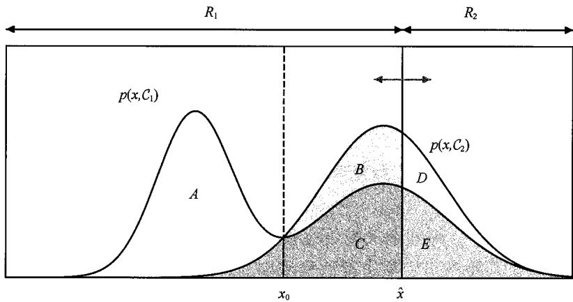  
图5.10 标记各个区域。在癌症治疗问题中，区域  $R_{i}$  被归入正常类，而区域  $R_{j}$  被归入癌症类

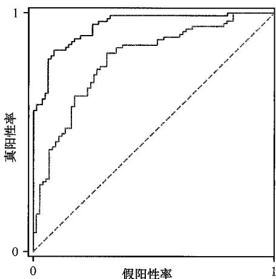  
图5.11ROC曲线图是真阳性率与假阳性率的对比图，它描述了分类问题中第一类误差和第二类误差之间的权衡。上方的蓝色曲线代表比下方的红色曲线更好的分类器。此处，虚线表示简单随机分类器的性能

我们可以考虑使用随机分类器作为基线，该分类器可以简单地将每个数据点以概率  $\rho$  归为癌症类，以概率  $1 - \rho$  归为正常类。如图5.11所示，当我们改变  $\rho$  值时，它将描绘出一条由对角线构成的ROC曲线。任何低于对角线的分类器都比不上随机猜测。

有时，用一个数字来描述整条ROC曲线是非常有用的。一种方法是测量ROC曲线下面积(AreaUndertheCurve，AUC)。AUC值为0.5代表随机猜测，而AUC值为1.0代表完美分类器。

另一种方法是计算  $F$  分数， $F$  分数是精确率和召回率的几何平均，由下式定义：

$$
\begin{array}{l} F \text {分 数} = \frac {2 \times \text {精 确 率} \times \text {召 回 率}}{\text {精 确 率} + \text {召 回 率}} (5.38) \\ = \frac {2 N _ {\mathrm {T P}}}{2 N _ {\mathrm {T P}} + N _ {\mathrm {F P}} + N _ {\mathrm {F N}}} (5.39) \\ \end{array}
$$

当然，我们也可以将图5.9中的混淆矩阵与图5.6中的损失矩阵结合起来，从而通过将元素逐点相乘并求和来计算预期损失。

虽然ROC曲线可以扩展到两个以上的类，但随着类数量的增加，它很快就会变得十分烦琐。

## 5.3 生成分类器

本节将从概率的角度分析分类问题并展示如何通过对数据分布进行简单的假设来建立具有线性决策边界的模型。我们已经讨论过分类的判别法和生成法的区别（参见5.2.4小节）。在这里，我们将采用对类-条件概率密度  $p(\boldsymbol{x}|\mathcal{C}_k)$  以及类的先验概率  $p(\mathcal{C}_k)$  进行建模的生成法，然后通过贝叶斯定理使用这些量来计算后验概率  $p(\mathcal{C}_k|x)$  。

首先考虑二分类问题。  $\mathcal{C}_1$  类的后验概率可以写成

$$
\begin{array}{l} p \left(\mathcal {C} _ {1} \mid x\right) = \frac {p \left(x \mid \mathcal {C} _ {1}\right) p \left(\mathcal {C} _ {1}\right)}{p \left(x \mid \mathcal {C} _ {1}\right) p \left(\mathcal {C} _ {1}\right) + p \left(x \mid \mathcal {C} _ {2}\right) p \left(\mathcal {C} _ {2}\right)} \tag {5.40} \\ = \frac {1}{1 + \exp (- a)} = \sigma (a) \\ \end{array}
$$

其中：

$$
a = \ln \frac {p (x \mid \mathcal {C} _ {1}) p (\mathcal {C} _ {1})}{p (x \mid \mathcal {C} _ {2}) p (\mathcal {C} _ {2})} \tag {5.41}
$$

$\sigma(a)$  是逻辑斯谛 sigmoid 函数，定义如下：

$$
\sigma (a) = \frac {1}{1 + \exp (- a)} \tag {5.42}
$$

逻辑斯谛 sigmoid 函数  $\sigma(a)$  如图 5.12 所示，这类函数有时也称“压缩函数”，因为它们能将整个实轴映射到一个有限区间内。逻辑斯谛 sigmoid 函数  $\sigma(a)$  在许多分类算法中发挥着重要作用，其满足如下对称性：

$$
\sigma (- a) = 1 - \sigma (a) \tag {5.43}
$$

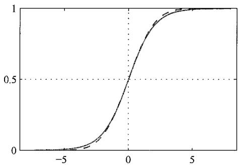  
图5.12 红色实线表示由式（5.42）定义的逻辑斯谛sigmoid函数  $\sigma (a)$  ，蓝色虚线表示  $\lambda^2 = \pi /8$  时的缩放probit函数  $\varPhi(\lambda a)$  ，其中  $\varPhi(a)$  由式（5.86）定义。选择缩放因子  $\pi /8$  是为了使  $a = 0$  时这两条曲线的导数相等

逻辑斯谛 sigmoid 函数  $\sigma(a)$  的倒数为

$$
a = \ln \left(\frac {\sigma}{1 - \sigma}\right) \tag {5.44}
$$

此为logit函数，它表示两个类的概率之比的对数  $\ln \left[p\left(\mathcal{C}_1|\boldsymbol {x}\right) / p\left(\mathcal{C}_2|\boldsymbol {x}\right)\right]$  ，也称对数几率。

请注意，在式（5.40）中，我们只是以等价形式重写了后验概率，因此逻辑斯谛s sigmoid函数的出现似乎是人为的。

不过，只要  $a(x)$  具有约束函数形式，它就具有重要意义。我们很快就会讨论  $a(x)$  是  $\pmb{x}$  的线性函数的情况，在此情况下，后验概率受广义线性模型的控制。

如果存在  $K > 2$  个类，则有

$$
\begin{array}{l} p \left(\mathcal {C} _ {k} \mid x\right) = \frac {p \left(x \mid \mathcal {C} _ {k}\right) p \left(\mathcal {C} _ {k}\right)}{\sum_ {j} p \left(x \mid \mathcal {C} _ {j}\right) p \left(\mathcal {C} _ {j}\right)} \tag {5.45} \\ = \frac {\exp \left(a _ {k}\right)}{\sum_ {j} \exp \left(a _ {j}\right)} \\ \end{array}
$$

这就是归一化指数（normalized exponential），它可以视为逻辑斯谛 sigmoid 函数的多类泛化。在这里，量  $a_{k}$  由下式定义：

$$
a _ {k} = \ln \left(p \left(\boldsymbol {x} \mid \mathcal {C} _ {k}\right) p \left(\mathcal {C} _ {k}\right)\right) \tag {5.46}
$$

归一化指数也叫softmax函数，因为它代表了max函数的平滑版本。如果  $a_{k}\gg a_{j}$  则对于所有  $j\neq k$  ，  $p(\mathcal{C}_k|\boldsymbol {x})\approx 1$  且  $p(\mathcal{C}_j|\boldsymbol {x})\approx 0$  。

接下来研究选择特定形式的类-条件概率密度的后果。首先讨论连续输入变量  $x$ ，然后简要讨论离散输入。

### 5.3.1 连续输入

假设类-条件概率密度是高斯密度。我们将探讨由此产生的后验概率形式。假设所有类共享相同的协方差矩阵  $\pmb{\Sigma}$ ，则  $C_k$  类的密度为

$$
p \left(\boldsymbol {x} \mid \mathcal {C} _ {k}\right) = \frac {1}{(2 \pi) ^ {D / 2}} \frac {1}{\left| \boldsymbol {\Sigma} \right| ^ {1 / 2}} \exp \left\{- \frac {1}{2} \left(\boldsymbol {x} - \boldsymbol {\mu} _ {k}\right) ^ {\mathrm {T}} \boldsymbol {\Sigma} ^ {- 1} \left(\boldsymbol {x} - \boldsymbol {\mu} _ {k}\right) \right\} \tag {5.47}
$$

假设我们有两个类。根据式（5.40）～式（5.41），可得

$$
p \left(\mathcal {C} _ {1} \mid \boldsymbol {x}\right) = \sigma \left(\boldsymbol {w} ^ {\mathrm {T}} \boldsymbol {x} + w _ {0}\right) \tag {5.48}
$$

其中

$$
\boldsymbol {w} = \boldsymbol {\Sigma} ^ {- 1} \left(\boldsymbol {\mu} _ {1} - \boldsymbol {\mu} _ {2}\right) \tag {5.49}
$$

$$
w _ {0} = - \frac {1}{2} \boldsymbol {\mu} _ {1} ^ {\mathrm {T}} \boldsymbol {\Sigma} ^ {- 1} \boldsymbol {\mu} _ {1} + \frac {1}{2} \boldsymbol {\mu} _ {2} ^ {\mathrm {T}} \boldsymbol {\Sigma} ^ {- 1} \boldsymbol {\mu} _ {2} + \ln \frac {p (\mathcal {C} _ {1})}{p (\mathcal {C} _ {2})} \tag {5.50}
$$

可以看到，来自高斯密度指数的  $x$  中的二次项已被消去（缘于共享协方差矩阵的假设），从而在逻辑斯谛 sigmoid函数的变量中形成了  $x$  的线性函数。图5.13展示了二维输入空间  $x$  的结果。由此得出的决策边界对应于后验概率  $p(\mathcal{C}_k|x)$  恒定的曲面，因此后验概率  $p(\mathcal{C}_k|x)$  将由  $x$  的线性函数给出，决策边界在输入空间中是线性的。先验概率  $p(\mathcal{C}_k)$  仅通过偏置参数  $w_0$  进入，因此先验的变化会使决策边界发生平行位移，更一般地说，这会使恒定后验概率的轮廓发生平行位移。

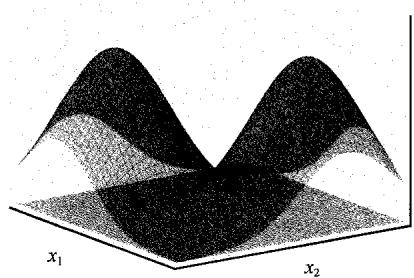  
图5.13 左图显示了两个类的类-条件概率密度，分别用红色和蓝色表示。右图是相应的后验概率  $p(\mathcal{C}_1|x)$ ，由作用于  $x$  的线性函数的逻辑斯谛 sigmoid 函数给出。右图中的面是用红色和蓝色涂色的，红色的比例为  $p(\mathcal{C}_1|x)$ ，蓝色的比例为  $p(\mathcal{C}_2|x) = 1 - p(\mathcal{C}_1|x)$

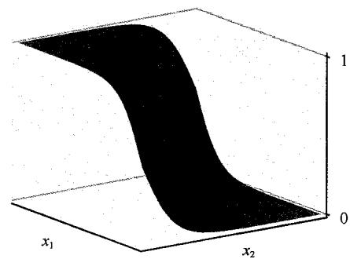

对于  $K$  个类的一般情况，后验概率由式（5.45）得出。根据式（5.46）和式（5.47），得出

$$
a _ {k} (\boldsymbol {x}) = \boldsymbol {w} _ {k} ^ {\mathrm {T}} \boldsymbol {x} + w _ {k 0} \tag {5.51}
$$

其中

$$
\boldsymbol {w} _ {k} = \boldsymbol {\Sigma} ^ {- 1} \boldsymbol {\mu} _ {k} \tag {5.52}
$$

$$
w _ {k 0} = - \frac {1}{2} \boldsymbol {\mu} _ {k} ^ {\mathrm {T}} \boldsymbol {\Sigma} ^ {- 1} \boldsymbol {\mu} _ {k} + \ln p \left(\mathcal {C} _ {k}\right) \tag {5.53}
$$

可以看到， $a_{k}(\pmb{x})$  是  $\pmb{x}$  的线性函数，因为共享协方差矩阵消去了二次项。当两个后验概率（后验概率中最大的两个）相等时，就会出现与最小误分类率对应的决策边界，因此决策边界将由  $\pmb{x}$  的线性函数定义。我们再次得到了一个广义线性模型。

如果我们放宽共享协方差矩阵的假设，并允许每个类-条件概率密度  $p\big(x,\mathcal{C}_k\big)$  有自己的协方差矩阵  $\Sigma_{k}$ ，那么先前的二次项消去将不再发生，我们将得到  $\pmb{x}$  的二次函数，从而产生二次判别式（quadratic discriminant）。线性决策边界和二次方决策边界如

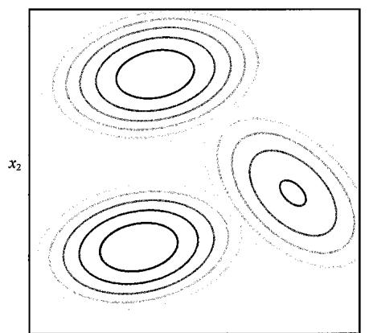  
图5.14所示。  
x1

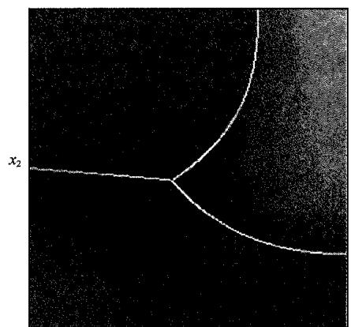  
x1  
图5.14 左图显示了三个类的类-条件概率密度，每个类都符合高斯分布，颜色分别为红色、绿色和蓝色，其中红色类和蓝色类的协方差矩阵相同。右图展示了相应的后验概率，其中图像上的每个点都用红、蓝、绿三种颜色按比例着色，分别对应三个类的后验概率。右图还展示了决策边界，请注意，具有相同协方差矩阵的红色类和蓝色类之间的边界是线性的，而红色类和绿色类以及蓝色类和绿色类之间的边界是二次的

### 5.3.2 最大似然解

在为类-条件概率密度  $p(\boldsymbol{x}|\mathcal{C}_k)$  指定了一个参数函数形式后，就可以使用最大似然法确定参数值和类的先验概率  $p(\mathcal{C}_k)$  。此时需要一个包含  $\mathbf{x}$  的观测值及其相应类标签的数据集。

假设我们有两个类，每个类都有一个共享协方差矩阵的高斯类-条件概率密度。此外，假设我们有一个数据集  $\{x_{n},t_{n}\}$  ，其中  $n = 1,\dots ,N$  。  $t_n = 1$  表示  $\mathcal{C}_1$  类，  $t_n = 0$  表示 $\mathcal{C}_2$  类。将类的先验概率记为  $p(\mathcal{C}_1) = \pi$  ，因此  $p(\mathcal{C}_2) = 1 - \pi$  。对于属于  $\mathcal{C}_1$  类的数据点  $\pmb{x}_{n}$  我们有  $t_n = 1$  ，因此

$$
p \left(\boldsymbol {x} _ {n}, \mathcal {C} _ {1}\right) = p \left(\mathcal {C} _ {1}\right) p \left(\boldsymbol {x} _ {n} \mid \mathcal {C} _ {1}\right) = \pi \mathcal {N} \left(\boldsymbol {x} _ {n} \mid \boldsymbol {\mu} _ {1}, \boldsymbol {\Sigma}\right)
$$

类似地，对于  $C_2$  类，我们有  $t_n = 0$  ，因此

$$
p \left(\boldsymbol {x} _ {n}, \mathcal {C} _ {2}\right) = p \left(\mathcal {C} _ {2}\right) p \left(\boldsymbol {x} _ {n} \mid \mathcal {C} _ {2}\right) = (1 - \pi) \mathcal {N} \left(\boldsymbol {x} _ {n} \mid \boldsymbol {\mu} _ {2}, \boldsymbol {\Sigma}\right)
$$

似然函数由下式给出：

$$
p (\mathbf {t}, X \mid \pi , \boldsymbol {\mu} _ {1}, \boldsymbol {\mu} _ {2}, \Sigma) = \prod_ {n = 1} ^ {N} \left[ \pi \mathcal {N} \left(\boldsymbol {x} _ {n} \mid \boldsymbol {\mu} _ {1}, \Sigma\right) \right] ^ {t _ {n}} \left[ (1 - \pi) \mathcal {N} \left(\boldsymbol {x} _ {n} \mid \boldsymbol {\mu} _ {2}, \Sigma\right) \right] ^ {1 - t _ {n}} \tag {5.54}
$$

其中  $\pmb{t} = (t_{1},\dots ,t_{N})^{\mathrm{T}}$  。按照惯例，最大化似然函数的对数是很方便的。首先考虑关于变量  $\pi$  的最大值。对数似然函数中取决于变量  $\pi$  的项为

$$
\sum_ {n = 1} ^ {N} \left\{t _ {n} \ln \pi + (1 - t _ {n}) \ln (1 - \pi) \right\} \tag {5.55}
$$

设变量  $\pi$  的导数为0并重新排列，可得

$$
\pi = \frac {1}{N} \sum_ {n = 1} ^ {N} t _ {n} = \frac {N _ {1}}{N} = \frac {N _ {1}}{N _ {1} + N _ {2}} \tag {5.56}
$$

其中， $N_{1}$  表示  $\mathcal{C}_1$  类数据点的总数， $N_{2}$  表示  $\mathcal{C}_2$  类数据点的总数。因此，变量  $\pi$  的最大似然估计值就是预期中  $\mathcal{C}_1$  类数据点的比例。我们可以很容易地将这一结果扩展到多类情况，在这种情况下，与  $\mathcal{C}_k$  类相关的先验概率的最大似然估计值同样是由归入该类的训练集数据点的比例计算得出的（见习题5.13）。

下面考虑  $\pmb{\mu}_{1}$  的最大值。同样，我们可以从对数似然函数中挑出那些取决于  $\pmb{\mu}_{1}$  的项：

$$
\sum_ {n = 1} ^ {N} t _ {n} \ln \mathcal {N} \left(\boldsymbol {x} _ {n} \mid \boldsymbol {\mu} _ {1}, \boldsymbol {\Sigma}\right) = - \frac {1}{2} \sum_ {n = 1} ^ {N} t _ {n} \left(\boldsymbol {x} _ {n} - \boldsymbol {\mu} _ {1}\right) ^ {\mathrm {T}} \boldsymbol {\Sigma} ^ {- 1} \left(\boldsymbol {x} _ {n} - \boldsymbol {\mu} _ {1}\right) + \text {c o n s t} \tag {5.57}
$$

设  $\pmb{\mu}_{1}$  的导数为0并重新排列，可得

$$
\boldsymbol {\mu} _ {1} = \frac {1}{N _ {1}} \sum_ {n = 1} ^ {N} t _ {n} \boldsymbol {x} _ {n} \tag {5.58}
$$

此为归入  $\mathcal{C}_1$  类的所有输入向量  $x_{n}$  的平均值。经过类似的论证，  $\pmb{\mu}_{2}$  的相应结果的计算公式为

$$
\boldsymbol {\mu} _ {2} = \frac {1}{N _ {2}} \sum_ {n = 1} ^ {N} \left(1 - t _ {n}\right) \boldsymbol {x} _ {n} \tag {5.59}
$$

此为归入  $\mathcal{C}_2$  类的所有输入向量  $x_{n}$  的平均值。

最后，考虑共享协方差矩阵  $\pmb{\Sigma}$  的最大似然解。选出对数似然函数中依赖于  $\pmb{\Sigma}$  的项：

$$
\begin{array}{l} - \frac {1}{2} \sum_ {n = 1} ^ {N} t _ {n} \ln | \boldsymbol {\Sigma} | - \frac {1}{2} \sum_ {n = 1} ^ {N} t _ {n} \left(\boldsymbol {x} _ {n} - \boldsymbol {\mu} _ {1}\right) ^ {\mathrm {T}} \boldsymbol {\Sigma} ^ {- 1} \left(\boldsymbol {x} _ {n} - \boldsymbol {\mu} _ {1}\right) - \\ \frac {1}{2} \sum_ {n = 1} ^ {N} \left(1 - t _ {n}\right) \ln | \boldsymbol {\Sigma} | - \frac {1}{2} \sum_ {n = 1} ^ {N} \left(1 - t _ {n}\right) \left(\boldsymbol {x} _ {n} - \boldsymbol {\mu} _ {2}\right) ^ {\mathrm {T}} \boldsymbol {\Sigma} ^ {- 1} \left(\boldsymbol {x} _ {n} - \boldsymbol {\mu} _ {2}\right) \tag {5.60} \\ = - \frac {N}{2} \ln | \boldsymbol {\Sigma} | - \frac {N}{2} \operatorname {t r} \left\{\boldsymbol {\Sigma} ^ {- 1} \boldsymbol {S} \right\} \\ \end{array}
$$

其中

$$
\boldsymbol {S} = \frac {N _ {1}}{N} \boldsymbol {S} _ {1} + \frac {N _ {2}}{N} \boldsymbol {S} _ {2} \tag {5.61}
$$

$$
\boldsymbol {S} _ {1} = \frac {1}{N _ {1}} \sum_ {n \in \mathcal {C} _ {1}} \left(\boldsymbol {x} _ {n} - \boldsymbol {\mu} _ {1}\right) \left(\boldsymbol {x} _ {n} - \boldsymbol {\mu} _ {1}\right) ^ {\mathrm {T}} \tag {5.62}
$$

$$
\boldsymbol {S} _ {2} = \frac {1}{N _ {2}} \sum_ {n \in \mathcal {C} _ {2}} \left(\boldsymbol {x} _ {n} - \boldsymbol {\mu} _ {2}\right) \left(\boldsymbol {x} _ {n} - \boldsymbol {\mu} _ {2}\right) ^ {\mathrm {T}} \tag {5.63}
$$

利用高斯分布最大似然解的标准结果，我们可以得出  $\pmb{\Sigma} = \pmb{S}$ ，它表示分别与两个类相关的协方差矩阵的加权平均值。

该结果可以很容易地扩展到多类问题中，从而得出相应参数的最大似然解，其中每个类-条件概率密度都是高斯密度且具有共享协方差矩阵（见习题5.14）。请注意，将高斯分布拟合到类中的方法对离群值不具有鲁棒性，因为高斯分布的最大似然估计并不具有鲁棒性（参见5.1.4小节）。

### 5.3.3 离散特征

接下来让我们看看离散特征值  $x_{i}$  。为简单起见，我们首先考虑二进制特征值 $x_{i}\in \{0,1\}$  ，然后讨论如何扩展到更一般的离散特征。如果有  $D$  个输入，那么一般的分布会对应于每个类的一张包含  $2^{D}$  个数字的表，并且有  $2^{D} - 1$  个自变量（缘于求和约束）。由于这种情况会随着特征数量的增加而呈指数增长，因此我们可以寻求一种限制性更强的表示方法。在这里，我们将做出朴素贝叶斯假设（参见11.2.4小节），将特征值视为独立的并以  $C_k$  类为条件。于是，我们可以得到如下形式的类-条件概率分布：

$$
p \left(\boldsymbol {x} \mid \mathcal {C} _ {k}\right) = \prod_ {i = 1} ^ {D} \mu_ {k i} ^ {x _ {i}} \left(1 - \mu_ {k i}\right) ^ {1 - x _ {i}} \tag {5.64}
$$

其中包含每个类的  $D$  个独立参数。代入式（5.46），可得

$$
a _ {k} (\boldsymbol {x}) = \sum_ {i = 1} ^ {D} \left\{x _ {i} \ln \mu_ {k i} + (1 - x _ {i}) \ln (1 - \mu_ {k i}) \right\} + \ln p \left(\mathcal {C} _ {k}\right) \tag {5.65}
$$

此为输入值  $x_{i}$  的线性函数。对于二分类，我们也可以考虑式（5.40）给出的逻辑斯谛 sigmoid 公式。对于有  $L > 2$  个状态的离散变量，也可以得到类似的结果（见习题 5.16）。

### 5.3.4 指数族分布

正如我们所看到的，对于符合高斯分布且离散的输入，类的后验概率都是由具有逻辑斯谛 sigmoid（ $K = 2$ ）或 softmax（ $K \geqslant 2$ ）激活函数的广义线性模型得出的。这些假设类-条件概率密度  $p(\boldsymbol{x}|\mathcal{C}_k)$  都是如下公式给出的指数族分布（参见3.4节）子集的成员，从而得出的更为普遍结果的特殊情况。

$$
p \left(\boldsymbol {x} \mid \lambda_ {k}, s\right) = \frac {1}{s} h \left(\frac {1}{s} \boldsymbol {x}\right) g \left(\lambda_ {k}\right) \exp \left\{\frac {1}{s} \lambda_ {k} ^ {\mathrm {T}} \boldsymbol {x} \right\} \tag {5.66}
$$

在这里，缩放参数  $s$  可在所有类之间共享。

对于二分类问题，将类-条件概率密度的表达式代入式（5.41），我们发现类的后

验概率由作用于线性函数  $a(x)$  的逻辑斯谛 sigmoid 函数给出，线性函数  $a(x)$  定义如下：

$$
a (\boldsymbol {x}) = \left(\lambda_ {1} - \lambda_ {2}\right) ^ {\mathrm {T}} \boldsymbol {x} + \ln g \left(\lambda_ {1}\right) - \ln g \left(\lambda_ {2}\right) + \ln p \left(\mathcal {C} _ {1}\right) - \ln p \left(\mathcal {C} _ {2}\right) \tag {5.67}
$$

同样，对于多分类问题（简称多类问题），可将类-条件概率密度的表达式代入式（5.46），得到

$$
a _ {k} (\boldsymbol {x}) = \lambda_ {k} ^ {\mathrm {T}} \boldsymbol {x} + \ln g \left(\lambda_ {k}\right) + \ln p \left(\mathcal {C} _ {k}\right) \tag {5.68}
$$

此为  $x$  的线性函数。

## 5.4 判别分类器

对于二分类情况，我们已经看到，针对指数族分布中多种类-条件概率密度  $p\big(x|\mathcal{C}_k\big)$  的选择问题，  $\mathcal{C}_1$  类的后验概率可以写成作用于  $\pmb{x}$  的线性函数的逻辑斯谛sigmoid函数。同样，对于多分类情况，  $\mathcal{C}_k$  类的后验概率由作用于  $\pmb{x}$  的线性函数的softmax变换给出。对于类-条件概率密度  $p\big(x|\mathcal{C}_k\big)$  的具体选择，我们首先使用最大似然法确定密度参数和类的先验概率  $p\big(\mathcal{C}_k\big)$ ，然后使用贝叶斯定理求出类的后验概率。此为生成式模型的一个例子，我们可以利用该模型，通过从边缘分布  $p(x)$  或任何类-条件概率密度  $p\big(x|\mathcal{C}_k\big)$  中取  $\pmb{x}$  值而生成合成数据。

不过，还有一种方法是明确使用广义线性模型的函数形式并通过最大似然法直接确定其参数。在这种直接方法中，我们将似然函数（由条件分布  $p(\mathcal{C}_k|x)$  定义）最大化，此为一种判别概率建模形式。我们很快就能看到，判别法的一个优点是，需要确定的可学习参数通常较少。此外，判别法还可以提高预测性能，尤其当类-条件概率密度的假定形式与真实分布的近似程度较低时。

### 5.4.1 激活函数

在线性回归（参见第4章）中，模型预测值  $y(x, w)$  由参数的线性函数给出：

$$
y (\boldsymbol {x}, \boldsymbol {w}) = \boldsymbol {w} ^ {\mathrm {T}} \boldsymbol {x} + w _ {0} \tag {5.69}
$$

它给出了范围为  $(-\infty, \infty)$  的连续值输出。然而，对于分类问题，我们希望预测离散类标签，或者更一般地说，预测  $(0,1)$  范围内的后验概率。为此，我们考虑对这一模型进行泛化——用非线性函数  $f(\cdot)$  对  $\pmb{w}$  和  $\pmb{w}_0$  的线性函数进行转换，从而得到

$$
y (\boldsymbol {x}, \boldsymbol {w}) = f \left(\boldsymbol {w} ^ {\mathrm {T}} \boldsymbol {w} + w _ {0}\right) \tag {5.70}
$$

在机器学习文献中， $f(\cdot)$  称为激活函数（activation function），它的反函数在统计学文献中则称为连接函数。决策面对应于  $y(x) =$  常数，因此  $\boldsymbol{w}^{\mathrm{T}}\boldsymbol{x} =$  常数，决策面是  $\pmb{x}$

的线性函数，即使函数  $f(\cdot)$  是非线性的。因此，式（5.70）描述的这一类模型名为广义线性模型（McCullagh and Nelder, 1989）。然而，与用于回归的模型相比，由于非线性函数  $f(\cdot)$  的存在，这些模型的参数不再是线性的。这将导致比线性回归模型更复杂的分析和计算特性。不过，与更为灵活的非线性模型（后续章节将对它们展开研究）相比，这些模型仍然相对简单。

### 5.4.2 固定基函数

前面介绍了直接使用原始输入向量  $x$  的分类模型。不过，如果我们首先使用基函数  $\phi(x)$  的向量对输入进行固定的非线性变换，那么所有算法都同样适用。如图 5.15 所示，由此产生的决策边界在特征空间  $\phi$  中是线性的，与原始观测空间  $x$  中的非线性决策边界相对应。特征空间  $\phi$  中可线性分离的类在原始观测空间  $x$  中不必线性可分。

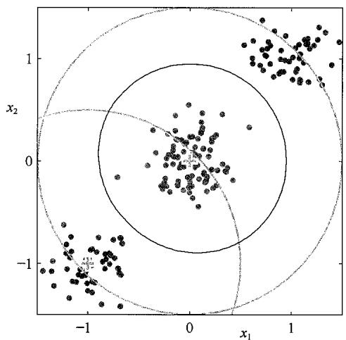  
图5.15非线性基函数在线性分类模型中发挥作用的示意图。左图展示了原始输入空间  $(x_{1},x_{2})$  以及两个类（标记为红色和蓝色）中的数据点。此空间中定义了两个“高斯”基函数  $\phi_1(x)$  和  $\phi_2(x)$  ，中心用绿色十字表示，轮廓用绿色圆圈表示。右图展示了相应的特征空间  $(\phi_1,\phi_2)$  ，以及由5.4.3节所述形式的逻辑斯谛回归模型得到的线性决策边界。这与原始输入空间中的非线性决策边界相对应，如左图中的黑色曲线所示

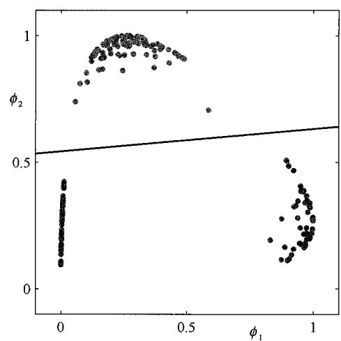

请注意，在线性回归模型中，有一个基函数通常设为常数，例如  $\phi_0(x) = 1$  ，因此相应的参数  $w_{0}$  起到偏置的作用。

在许多实际问题中，类-条件概率密度  $p(\boldsymbol{x}|\mathcal{C}_k)$  在  $\pmb{x}$  空间中存在明显的重叠。这相当于后验概率  $p(\mathcal{C}_k|x)$ ，至少对于  $\pmb{x}$  的某些值，后验概率  $p(\mathcal{C}_k|x)$  不是0或1。在这种情况下，通过对后验概率进行精确建模并应用标准决策理论（参见5.2节），便可得到最优解。请注意，非线性变换  $\phi_0(\boldsymbol{x})$  并不能消除这种重叠，尽管它们可以增加重叠程度，或在原始观测空间中不存在重叠的地方产生重叠。非线性的适当选择可以使后验概率建模过程变得更容易。然而，这种固定的基函数模型有很大的局限性（参见6.2节），在后续章节中，我们将通过让基函数适应数据来解决这些问题。

### 5.4.3 逻辑斯谛回归

首先考虑二分类问题。在5.3节关于生成方法的讨论中，我们看到了在一般假设条件下， $\mathcal{C}_1$  的后验概率可以写成作用于特征空间  $\phi$  的线性函数的逻辑斯谛 sigmoid 函数，从而得到

$$
p \left(\mathcal {C} _ {1} \mid \phi\right) = y (\phi) = \sigma \left(\boldsymbol {w} ^ {\mathrm {T}} \phi\right) \tag {5.71}
$$

$p\left(\mathcal{C}_2|\phi\right) = 1 - p\left(\mathcal{C}_1|\phi\right)$  是由式（5.42）定义的逻辑斯谛 sigmoid函数。在统计学术语中，这种模型又称作逻辑斯谛回归（logistic regression）模型，但需要强调的是，这是一种分类模型，而不是连续变量模型。

对于  $M$  维特征空间  $\phi$  ，该模型有  $M$  个可调参数。相比之下，如果我们使用最大似然法拟合高斯类-条件概率密度，那么我们将使用  $2M$  个参数表示均值，并使用 $M(M + 1) / 2$  个参数表示（共享）协方差矩阵。再加上类的先验概率  $p\big(\mathcal{C}_1\big)$  ，总共有 $M(M + 5) / 2 + 1$  个参数。与逻辑斯谛回归模型中参数数量与  $M$  成线性关系不同，该模型的参数数量随  $M$  呈二次增长。对于较大的  $M$  值，直接使用逻辑斯谛回归模型有明显的优势。

下面我们使用最大似然法确定逻辑斯谛回归模型的参数。为此，我们将利用逻辑斯谛 sigmoid 函数的导数，它可以方便地用 sigmoid 函数本身来表示（见习题 5.18）：

$$
\frac {\mathrm {d} \sigma}{\mathrm {d} a} = \sigma (1 - \sigma) \tag {5.72}
$$

对于数据集  $\{\phi_n, t_n\}$ ，其中  $\phi_n = \phi(x_n)$ ，且  $t_n \in \{0,1\}$ ， $n = 1, \dots, N$ 。似然函数可写成

$$
p (\boldsymbol {t} \mid \boldsymbol {w}) = \prod_ {n = 1} ^ {N} y _ {n} ^ {t _ {n}} \left\{1 - y _ {n} \right\} ^ {1 - t _ {n}} \tag {5.73}
$$

其中  $\pmb{t} = (t_{1},\dots ,t_{N})^{\mathrm{T}}$  ，且  $y_{n} = p\bigl (\mathcal{C}_{1}\mid \phi_{n}\bigr)$  。按照惯例，我们可以通过取似然的负对数来定义误差函数，从而得到交叉熵（cross-entropy）误差函数：

$$
E (\boldsymbol {w}) = - \ln p (\boldsymbol {t} \mid \boldsymbol {w}) = - \sum_ {n = 1} ^ {N} \left\{t _ {n} \ln y _ {n} + \left(1 - t _ {n}\right) \ln \left(1 - y _ {n}\right) \right\} \tag {5.74}
$$

其中，  $y_{n} = \sigma (a_{n})$  且  $a_{n} = w^{\mathrm{T}}\phi_{n}$  。利用误差函数关于  $\pmb{w}$  的梯度，可得（见习题5.19）

$$
\nabla E (\boldsymbol {w}) = \sum_ {n = 1} ^ {N} \left(y _ {n} - t _ {n}\right) \phi_ {n} \tag {5.75}
$$

其中，我们使用了式（5.72）。你可以看到，涉及逻辑斯谛 sigmoid 导数的因子已被消去，从而简化了对数似然梯度的形式。具体来说，数据点  $n$  对梯度的贡献由目标值与模型预测值之间的“误差”  $(y_{n} - t_{n})$  乘以  $\phi_{n}$  给出。此外，通过与式（4.12）进行比

较，我们发现这与线性回归模型的平方和误差函数梯度的形式完全相同。

最大似然解（参见4.1.3小节）对应于  $\nabla E(\boldsymbol{w}) = 0$  。然而，从式（5.75）中可以看出，由于  $y(\cdot)$  的非线性，这不再对应于线性方程组，因此没有闭式解。求最大似然解的一种方法是使用随机梯度下降法（参见第7章），其中  $\nabla E_{n}$  是式（5.75）右侧的第  $n$  项。随机梯度下降法是训练高度非线性神经网络（后续章节将展开讨论）的主要方法。然而，最大似然方程只是“略微”非线性的。事实上，模型由式（5.71）定义的误差函数式（5.74）是参数的凸函数，这使得误差函数可以通过一种称为迭代重加权最小二乘法（Iterative Reweighted Least Squares, IRLS）的简单算法来最小化（Bishop, 2006）。然而，这很难泛化到更复杂的模型，如深度神经网络。

请注意，对于线性可分的数据集，最大似然法可能会表现出严重的过拟合。这是因为当  $\sigma = 0.5$  （相当于  $\boldsymbol{w}^{\mathrm{T}}\boldsymbol {\phi} = 0$  ）所对应的超平面将两个类分开，且  $\pmb{w}$  的大小趋于无穷时，就会出现最大似然解。在这种情况下，逻辑斯谛 sigmoid函数在特征空间中变得无限陡峭，相当于一个单位阶跃函数，因此来自每个类的每个训练点都被赋予一个后验概率  $p\bigl (C_k|x\bigr) = 1$  （见习题5.20）。此外，这样的解通常是连续的，因为任何分离超平面在训练点处都会产生相同的后验概率。最大似然法无法提供最优解，在实践中找到哪个解将取决于优化算法的选择和参数是如何初始化的。注意，只要训练数据集是线性可分的，即使数据点的数量相比模型中参数的数量很大，问题也会出现。在误差函数中加入正则化项（参见第9章）可以避免奇异解。

### 5.4.4 多类逻辑斯谛回归

在讨论用于多分类的生成式模型（参见5.3节）时，我们已经看到，对于指数族分布，后验概率是由作用于特征变量的线性函数的softmax变换给出的，于是有

$$
p \left(\mathcal {C} _ {k} \mid \phi\right) = y _ {k} (\phi) = \frac {\exp \left(a _ {k}\right)}{\sum_ {j} \exp \left(a _ {j}\right)} \tag {5.76}
$$

其中，预激活  $a_{k}$  为

$$
a _ {k} = \boldsymbol {w} _ {k} ^ {\mathrm {T}} \phi \tag {5.77}
$$

此处，我们使用最大似然法分别确定了类-条件概率密度和类的先验，然后使用贝叶斯定理找到了相应的后验概率，从而隐式地确定了参数  $\{w_k\}$  。下面考虑使用最大似然法直接确定参数  $\{w_k\}$  。为此，我们需要  $y_{k}$  相对于所有预激活  $a_{j}$  的导数，计算公式为（见习题5.21）

$$
\frac {\partial y _ {k}}{\partial a _ {j}} = y _ {k} \left(I _ {k j} - y _ {j}\right) \tag {5.78}
$$

其中，  $I_{kj}$  是单位矩阵的元素。

接下来让我们写下似然函数。使用1-of-  $K$  编码方案最容易实现这一目标，在这种编码方案下，属于  $\mathcal{C}_k$  类的  $\phi_{n}$  的目标向量  $\pmb{t}_{n}$  是一个二进制向量，除元素  $k$  等于1外，其他元素均为0。似然函数为

$$
p \left(\boldsymbol {T} \mid \boldsymbol {w} _ {1}, \dots , \boldsymbol {w} _ {K}\right) = \prod_ {n = 1} ^ {N} \prod_ {k = 1} ^ {K} p \left(\mathcal {C} _ {k} \mid \phi_ {n}\right) ^ {t _ {n k}} = \prod_ {n = 1} ^ {N} \prod_ {k = 1} ^ {K} y _ {n k} ^ {t _ {n k}} \tag {5.79}
$$

其中  $y_{nk} = y_k(\phi_n)$ ，且  $\pmb{T}$  是一个包含  $N\times K$  个目标变量的矩阵，其中的元素为  $t_{nk}$ 。取负对数可得

$$
E \left(\boldsymbol {w} _ {1}, \dots , \boldsymbol {w} _ {K}\right) = - \ln p \left(\boldsymbol {T} \mid \boldsymbol {w} _ {1}, \dots , \boldsymbol {w} _ {K}\right) = - \sum_ {n = 1} ^ {N} \sum_ {k = 1} ^ {K} t _ {n k} \ln y _ {n k} \tag {5.80}
$$

此为多分类问题的交叉熵误差函数。

下面求误差函数相对于参数向量  $w_{j}$  的梯度。利用式（5.78）对softmax函数求导可得（见习题5.22）

$$
\nabla_ {w _ {j}} E \left(w _ {1}, \dots , w _ {K}\right) = \sum_ {n = 1} ^ {N} \left(y _ {n j} - t _ {n j}\right) \phi_ {n} \tag {5.81}
$$

其中，我们利用了  $\sum_{k}t_{nk} = 1$  。同样，我们可以利用随机梯度下降法（参见第7章）来优化参数。

我们再次发现，梯度的形式与线性模型的平方和误差函数和逻辑斯谛回归模型的交叉熵误差函数的形式相同，即误差  $\left(y_{nj} - t_{nj}\right)$  与基函数激活度  $\phi_n$  的乘积。我们稍后将探讨更普遍的例子（参见5.4.6小节）。

线性分类模型可表示为单层神经网络，如图5.16所示。如果我们使用误差函数相对于权重  $w_{ik}$  的导数（以便将基函数  $\phi_i(x)$  与输出单元  $t_k$  连接起来），则可以得出

$$
\frac {\partial E \left(\boldsymbol {w} _ {1} , \cdots , \boldsymbol {w} _ {K}\right)}{\partial w _ {i j}} = \sum_ {n = 1} ^ {N} \left(y _ {n k} - t _ {n k}\right) \phi_ {i} \left(\boldsymbol {x} _ {n}\right) \tag {5.82}
$$

与图5.16相比，我们可以看到，对于每个数据点  $n$  ，梯度的形式是权重链路输入端的基函数输出与输出端“误差”  $\left(y_{nk} - t_{nk}\right)$  的乘积。

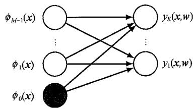  
图5.16 将线性分类模型表示为具有单层连接的神经网络。每个基函数由一个节点表示，实心节点表示“偏置”基函数  $\phi_0$  ，而每个输出  $y_{1},\dots ,y_{N}$  也由一个节点表示。节点之间的连接代表相应的权重和偏置参数

### 5.4.5 probit回归

我们已经看到，对于各种类-条件分布，得到的后验类率（posterior class probability）是由作用于特征变量线性函数的logistic（或softmax）变换给出的。然而，

并不是类-条件概率密度的所有选择都能为后验概率生成如此简单的形式，这表明也许值得探索其他类型的判别概率模型。在广义线性模型的框架内，再次考虑二分类情况，得到

$$
p (t = 1 \mid a) = f (a) \tag {5.83}
$$

其中，  $a = w^{\mathrm{T}}\phi$  且  $f(\cdot)$  为激活函数。

激发替代连接函数的一种方法是使用噪声阈值模型（noisy threshold model）。对于每个输入  $\phi_{n}$ ，评估  $a_{n} = \mathbf{w}^{\mathrm{T}}\phi_{n}$ ，然后根据以下公式设定目标值：

$$
\left\{ \begin{array}{l l} t _ {n} = 1, & a _ {n} \geqslant \theta \\ t _ {n} = 0, & \text {其 他} \end{array} \right. \tag {5.84}
$$

如果  $\theta$  值来自概率密度  $p(\theta)$ ，那么相应的激活函数将由累积分布函数（cumulative distribution function）给出：

$$
f (a) = \int_ {- \infty} ^ {a} p (\theta) \mathrm {d} \theta \tag {5.85}
$$

如图5.17所示。

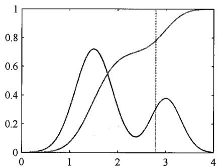  
图5.17蓝色曲线所示为概率密度  $p(\theta)$  ，在本例中由两个高斯混合分布及其累积分布函  $f(a)$  （用红色曲线表示）给出。请注意，蓝色曲线在任何一点的值，例如垂直绿线处的值，对应于红色曲线在同一点的斜率。相反，红色曲线在此点的值对应于绿色阴影区域内蓝色曲线下的面积。在随机阈值模型中，如果  $a = w^{\top}\phi$  的值超过阈值，则类标签取  $t = 1$  ，否则取  $t = 0$  ，这等价于由累积分布函数  $f(a)$  给出的激活函数

举个具体的例子，假设密度  $p(\theta)$  由一个零均值、单位方差的高斯分布给出。相应的累积分布函数为

$$
\Phi (a) = \int_ {- \infty} ^ {a} \mathcal {N} (\theta | 0, 1) \mathrm {d} \theta \tag {5.86}
$$

这就是所谓的probit函数。注意，使用具有一般均值和方差的高斯分布并不会改变模型，因为这等同于重新缩放线性系数  $\pmb{w}$  。许多数值计算程序库都支持计算如下的另一个密切相关的函数：

$$
\operatorname {e r f} (a) = \frac {2}{\sqrt {\pi}} \int_ {0} ^ {a} \exp (- \theta^ {2} / 2) d \theta \tag {5.87}
$$

此为erf函数，它与probit函数的关系如下（见习题5.23）：

$$
\Phi (a) = \frac {1}{2} \left\{1 + \frac {1}{\sqrt {2}} \operatorname {e r f} (a) \right\} \tag {5.88}
$$

基于probit函数的广义线性模型称为probit回归模型。通过对前面讨论的思路直接进行扩展，我们可以利用最大似然法确定模型的参数。实际上，使用probit回归得出的结果往往与使用逻辑斯谛回归得到的结果相似。

实际应用中可能出现的一个问题是离群值。例如，在测量输入向量  $x$  时出现的误差或对目标值  $t$  的错误标记，都可能导致离群值的出现。因为这些点可能离理想的决策边界很远，它们会严重扭曲分类器。逻辑斯谛回归模型和probit回归模型在这方面的表现不同，因为在  $\left|x\right|\rightarrow \infty$  的情况下，逻辑斯谛sigmoid函数的尾部衰减为  $\exp (-x)$  而probit函数的尾部衰减为  $\exp (-x^2)$  ，因此probit模型对离群值更为敏感。

### 5.4.6 规范连接函数

对于高斯噪声分布的线性回归模型来说，与负对数似然对应的误差函数由式（4.11）给出。如果我们在关于数据点  $n$  对误差函数的贡献方面对参数向量  $\pmb{w}$  求导，则得到的形式为“误差”  $(y_{n} - t_{n})$  乘以  $\phi_n$  ，其中  $y_{n} = w^{\mathrm{T}}\phi_{n}$  。同样，对于逻辑斯谛 sigmoid函数与交叉熵误差函数［式（5.74）］的组合以及softmax函数与多类交叉熵误差函数［式（5.80）］的组合，我们也能得到同样的简单形式。需要说明的是，这是假定目标变量的条件分布来自指数族分布以及相应的激活函数选择［即规范连接函数（canonical link function）］的一般结果。

让我们再次使用指数族分布的限制形式[式（3.169）]。请注意，这里我们对目标变量  $t$  采用了指数族分布假设，而在5.3.4小节中，我们对输入向量  $\pmb{x}$  采用了指数族分布假设。因此，考虑目标变量的条件分布，其形式为

$$
p (t \mid \eta , s) = \frac {1}{s} h \left(\frac {t}{s}\right) g (\eta) \exp \left\{\frac {\eta t}{s} \right\} \tag {5.89}
$$

利用推导式（3.172）时的相同论证思路，我们可以看到， $t$  的条件均值（用  $y$  表示）由下式给出：

$$
y \equiv \mathbb {E} [ t \mid \eta ] = - s \frac {\mathrm {d}}{\mathrm {d} \eta} \ln g (\eta) \tag {5.90}
$$

因此， $y$  和  $\eta$  必须相关，它们之间的关系为  $\eta = \psi(y)$ 。

根据Nelder and Wedderburn（1972），我们将广义线性模型定义为  $y$  是输入（或特征）变量线性组合的非线性函数的模型，从而有

$$
y = f \left(\boldsymbol {w} ^ {\mathrm {T}} \phi\right) \tag {5.91}
$$

其中  $f(\cdot)$  在机器学习文献中称为激活函数，而  $f^{-1}(\cdot)$  在统计学中称为连接函数。考虑该模型的对数似然函数，作为  $\eta$  的函数，其计算公式为

$$
\ln p (\mathbf {t} \mid \eta , s) = \sum_ {n = 1} ^ {N} \ln p (t _ {n} \mid \eta , s) = \sum_ {n = 1} ^ {N} \left\{\ln g (\eta_ {n}) + \frac {\eta_ {n} t _ {n}}{s} \right\} + \text {c o n s t} \tag {5.92}
$$

其中，我们假设所有观测值都有一个共同的尺度参数（相当于高斯分布的噪声方差），因此  $s$  与  $n$  无关。对数似然关于模型参数  $\pmb{w}$  的导数为

$$
\begin{array}{l} \nabla_ {w} \ln p (\boldsymbol {\ell} | \eta , s) = \sum_ {n = 1} ^ {N} \left\{\frac {\mathrm {d}}{\mathrm {d} \eta_ {n}} \ln g \left(\eta_ {n}\right) + \frac {t _ {n}}{s} \right\} \frac {\mathrm {d} \eta_ {n}}{\mathrm {d} y _ {n}} \frac {\mathrm {d} y _ {n}}{\mathrm {d} a _ {n}} \nabla_ {w} a _ {n} \\ = \sum_ {n = 1} ^ {N} \frac {1}{S} \left\{t _ {n} - y _ {n} \right\} \psi^ {\prime} \left(y _ {n}\right) f ^ {\prime} \left(a _ {n}\right) \phi_ {n} \tag {5.93} \\ \end{array}
$$

其中  $a_{n} = \pmb{w}^{\mathrm{T}}\pmb{\phi}_{n}$ ，我们使用了  $y_{n} = f(a_{n})$  和  $\mathbb{E}[t|\eta]$  的结果式（5.90）。可以看到，如果我们为连接函数  $f^{-1}(y)$  选择一种特殊的形式，就可以极大地简化计算过程。

$$
f ^ {- 1} (y) = \psi (y) \tag {5.94}
$$

由于  $f\big(\psi (y)\big) = y$  ，因此  $f^{\prime}(\psi)\psi^{\prime}(y) = 1$  。同样，由于  $a = f^{-1}(y)$  ，得出  $a = \psi$  ，因此  $f^{\prime}(a)\psi^{\prime}(y) = 1$  。在这种情况下，误差函数的梯度减小为

$$
\nabla \ln E (\boldsymbol {w}) = \frac {1}{s} \sum_ {n = 1} ^ {N} \left\{y _ {n} - t _ {n} \right\} \phi_ {n} \tag {5.95}
$$

我们已经看到，误差函数的选择与输出－单元激活函数的选择之间存在自然的配对。尽管我们是在单层网络的背景下推导出这一结果的，但同样的考虑因素也适用于后续章节讨论的深度神经网络。

## 习题

5.1（ $\star$ ）考虑一个涉及  $K$  个类和目标向量  $\pmb{t}$  的分类问题，使用1-of-  $K$  二进制编码方案。证明条件期望  $\mathbb{E}[t|\pmb{x}]$  由后验概率  $p\big(\mathcal{C}_k|x\big)$  给出。

5.2（ $\star \star$ ）在给定一组数据点  $\{x_{n}\}$  的情况下，我们可以将凸包定义为所有点  $x$  的集合。

$$
\boldsymbol {x} = \sum_ {n} \alpha_ {n} \boldsymbol {x} _ {n} \tag {5.96}
$$

其中  $\alpha_{n} \geqslant 0$  且  $\sum_{n} \alpha_{n} = 1$  。考虑另一组数据点  $\{\mathbf{y}_{n}\}$  及相应的凸包。根据定义，

如果存在一个向量  $\hat{\pmb{w}}$  和一个标量  $w_{0}$ ，使得对所有  $x_{n}$  而言  $\hat{\pmb{w}}^{\mathrm{T}}\pmb{x}_{n} + w_{0} > 0$ ，并且对所有  $y_{n}$  而言  $\hat{\pmb{w}}^{\mathrm{T}}\pmb{y}_{n} + w_{0} < 0$ ，那么这两组数据点就是线性可分的。证明如果它们的凸包相交，则这两组数据点不可能是线性可分的；反之，如果它们是线性可分的，则它们的凸包不相交。

5.3（ $\star \star$ ）考虑最小化平方和误差函数式（5.14），并假设训练集中所有的目标向量都满足线性约束条件

$$
\boldsymbol {a} ^ {\mathrm {T}} \boldsymbol {t} _ {n} + b = 0 \tag {5.97}
$$

其中  $t_n$  相当于式（5.14）中矩阵  $\pmb{T}$  的第  $n$  行。证明作为以上约束条件的结果，由最小二乘解式（5.16）给出的模型预测  $\pmb{y}(\pmb{x})$  的元素也满足该约束条件，即

$$
\boldsymbol {a} ^ {\mathrm {T}} \boldsymbol {y} (\boldsymbol {x}) + b = 0 \tag {5.98}
$$

为此，假设其中一个基函数  $\phi_0(x) = 1$  ，这样相应的参数  $w_{0}$  就起到了偏置的作用。

5.4（ $\star \star$ ）扩展习题5.3的结果，证明如果目标向量同时满足多个线性约束条件，那么线性模型的最小二乘预测也将满足相同的约束条件。  
5.5（ $\star$ ）利用定义式（5.38）以及式（5.30）和式（5.31）推导  $F$  分数的结果式（5.39）。  
5.6（ $\star \star$ ）考虑两个非负数  $a$  和  $b$ ，并证明如果  $a \leqslant b$ ，则  $a \leqslant (ab)^{1/2}$ 。利用这一结果可以证明，如果选择二分类问题的决策区域是为了最小化误分类概率，则该概率将满足

$$
p (\text {错 误}) \leqslant \int \left\{p \left(\boldsymbol {x}, \mathcal {C} _ {1}\right) p \left(\boldsymbol {x}, \mathcal {C} _ {2}\right) \right\} ^ {1 / 2} \mathrm {d} \boldsymbol {x} \tag {5.99}
$$

5.7（ $\star$ ）给定一个含有元素  $L_{kj}$  的损失矩阵，如果我们为每个  $\pmb{x}$  选择最小化式（5.23）的类，则预期风险最小。验证一下，当损失矩阵为  $L_{kj} = 1 - I_{kj}$  （其中  $I_{kj}$  为单位矩阵的元素）时，则可简化为选择后验概率最大的类的准则。如何解释这种形式的损失矩阵？  
5.8（ $\star$ ）在有类的一般损失矩阵和一般先验概率时，推导最小化预期损失的准则。  
5.9（ $\star$ ）考虑一组  $N$  个数据点的后验概率的平均值，其形式为

$$
\frac {1}{N} \sum_ {n = 1} ^ {N} p \left(\mathcal {C} _ {k} \mid x _ {n}\right) \tag {5.100}
$$

通过取极限  $N \to \infty$  ，证明这个量接近类的先验概率  $p\left(\mathcal{C}_k\right)$  。

5.10（ $\star \star$ ）考虑一个分类问题，其中当来自  $\mathcal{C}_k$  类的输入向量被归入  $\mathcal{C}_j$  类时，产生的损失由损失矩阵  $L_{kj}$  给出，而选择拒绝选项所产生的损失为  $\lambda$  。推导预期损失最小的决策准则。验证一下，当损失矩阵由  $L_{kj} = 1 - I_{kj}$  给出时，所要推导的决策准则可简化为5.2.3小节讨论的拒绝准则。 $\lambda$  和拒绝阈值  $\theta$  之间有何关系？

5.11（ $\star$ ）证明逻辑斯谛 sigmoid 函数 [式 (5.42)] 满足性质  $\sigma(-a) = 1 - \sigma(a)$ ，其逆函数由  $\sigma^{-1}(y) = \ln \left\{ \frac{y}{(1 - y)} \right\}$  给出。  
5.12（ $\star$ ）利用式（5.40）和式（5.41）得出具有高斯密度的二类生成式模型的类的后验概率结果式（5.48），并对参数  $w$  和  $w_0$  的结果式（5.49）和式（5.50）进行验证。  
5.13（ $\star$ ）考虑一个由类的先验概率  $p(\mathcal{C}_k) = \pi_k$  和类-条件概率密度  $p(\phi|\mathcal{C}_k)$  定义的涉及  $K$  个类的分类模型，其中  $\phi$  是输入特征。假设我们得到一个训练数据集  $\{\phi_n, t_n\}$ ，其中  $n = 1, \dots, N$ ， $t_n$  是长度为  $K$  且采用1-of- $K$  编码方案的二进制目标向量。如果数据点  $n$  属于  $\mathcal{C}_k$  类，则  $t_{nj} = I_{jk}$ 。假设数据点是从该模型中独立提取的，证明先验概率的最大似然解为

$$
\pi_ {k} = \frac {N _ {k}}{N} \tag {5.101}
$$

其中  $N_{k}$  是归入  $\mathcal{C}_k$  类的数据点数量。

5.14（ $\star \star$ ）考虑习题5.13中的分类模型，假设类-条件概率密度由具有共享协方差矩阵的高斯分布给出，因此

$$
p (\phi \mid \mathcal {C} _ {k}) = \mathcal {N} (\phi \mid \boldsymbol {\mu} _ {k}, \Sigma) \tag {5.102}
$$

证明  $C_k$  类的高斯分布均值的最大似然解由下式给出：

$$
\boldsymbol {\mu} _ {k} = \frac {1}{N _ {k}} \sum_ {n = 1} ^ {N} t _ {n k} \phi_ {n} \tag {5.103}
$$

它表示归入  $C_k$  类的那些特征向量的均值。类似地，证明共享协方差矩阵的最大似然解由下式给出：

$$
\boldsymbol {\Sigma} = \sum_ {k = 1} ^ {K} \frac {N _ {k}}{N} \boldsymbol {S} _ {k} \tag {5.104}
$$

其中

$$
\boldsymbol {S} _ {k} = \frac {1}{N _ {k}} \sum_ {n = 1} ^ {N} t _ {n k} \left(\phi_ {n} - \boldsymbol {\mu} _ {k}\right) \left(\phi_ {n} - \boldsymbol {\mu} _ {k}\right) ^ {\mathrm {T}} \tag {5.105}
$$

因此， $\Sigma$  由与每个类相关的数据协方差的加权平均值给出，其中加权系数由类的先验概率给出。

5.15（ $\star \star$ ）推导 5.3.3 小节所讲的具有离散二元特征的概率朴素贝叶斯分类器参数  $\{\mu_{ki}\}$  的最大似然解。

5.16（ $\star \star$ ）考虑一个涉及  $K$  个类的分类问题，其中输入特征  $\phi$  有  $M$  个组件，每个组件有  $L$  个离散状态。将组件的值用1-of-  $L$  二进制编码方案表示。进一步假设，

以  $C_k$  类为条件， $\phi$  的  $M$  个组件是独立的，因此关于特征向量组件的类-条件概率密度可以分解。

证明由式（5.46）给出的量  $a_{k}$  （出现在描述类的后验概率的softmax函数的自变量中）是  $\phi$  的组件的线性函数。请注意，这是一个朴素贝叶斯模型（参见11.2.4小节）的示例。

5.17（ $\star \star$ ）推导习题5.16中描述的概率朴素贝叶斯分类器参数的最大似然解。  
5.18（ $\star$ ）验证由式（5.42）定义的逻辑斯谛 sigmoid 函数导数的关系式（5.72）。  
5.19（ $\star$ ）利用逻辑斯谛 sigmoid 函数的导数结果式（5.72），证明逻辑斯谛回归模型的误差函数式（5.74）由式（5.75）给出。  
5.20（ $\star$ ）证明对于线性可分数据集，逻辑斯谛回归模型的最大似然解可以通过计算一个向量  $\pmb{w}$  来获得，该向量的决策边界  $\pmb{w}^{\mathrm{T}}\pmb {\phi}(\pmb {x}) = 0$  可将类分开，然后将  $\pmb{w}$  的大小取到无穷大。  
5.21（ $\star$ ）证明softmax激活函数[式（5.76）]的导数[其中  $a_{k}$  由式（5.77）定义]由式（5.78）给出。  
5.22（ $\star$ ）利用softmax激活函数的导数结果[式（5.78）]，证明交叉熵误差[式（5.80）]的梯度由式（5.81）给出。  
5.23（ $\star$ ）证明probit函数[式（5.86）]和erf函数[式（5.87）]的关系式（5.88）。  
5.24（ $\star \star$ ）假设我们希望用缩放probit函数  $\Phi (\lambda a)$  来近似由式（5.42）定义的逻辑斯谛sigmoid函数  $\sigma (a)$ ，其中  $\varPhi(a)$  由式（5.86）定义。证明如果选择的  $\lambda$  能使这两个函数的导数在  $a = 0$  处相等，则  $\lambda^2 = \pi /8$  。

__________

__________
