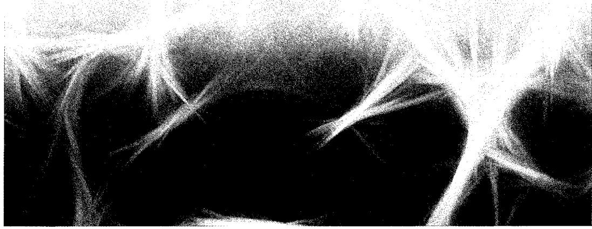
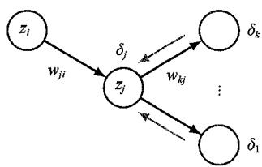
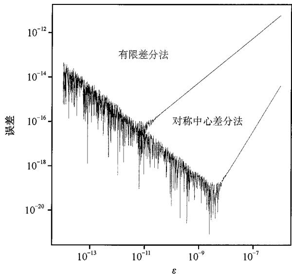
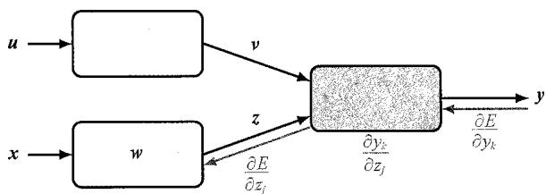
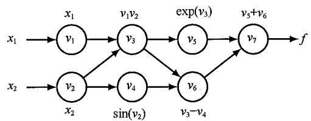
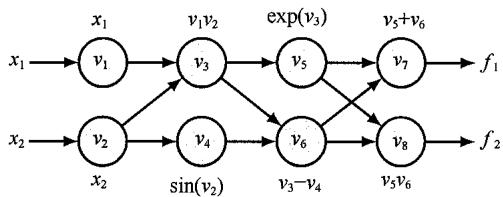

# 第8章 反向传播



本章旨在寻找一种高效的技术，用于评估前馈神经网络误差函数  $E(w)$  的梯度。我们将看到，这可以通过一种本地消息传递方案来实现，在该方案中，信息会通过网络向后发送，称为误差反向传播（error backpropagation）。

在过去，反向传播方程需要手工推导，然后在软件中与前向传播方程一起实现；这两个步骤都很耗费时间，且都容易出错。然而，在现代神经网络软件环境中，我们只需要在原有网络函数的编码基础上稍作扩展，就能高效地计算出任何感兴趣的导数。这种想法称为自动微分（automatic differentiation）（参见8.2节），其在现代深度学习中发挥着关键作用。然而，理解如何进行计算是有价值的，这样我们就不必依赖所谓的“黑盒子”软件解决方案。因此，本章将对反向传播的关键概念进行解释，并详细探讨自动微分的框架。

请注意，“反向传播”一词在神经计算文献中有多种不同的含义。例如，有的神经计算文献可能会把前馈结构称作反向传播网络。此外，“反向传播”一词有时也用来描

述神经网络的端到端训练程序，包括梯度下降参数更新。本书将专门使用“反向传播”来描述用于对导数进行数值计算的计算程序，例如计算关于网络权重和偏置的误差函数梯度。这一程序也可用于计算其他重要导数，如雅可比矩阵和黑塞矩阵。

## 8.1 梯度计算

下面让我们为具有任意前馈拓扑结构、任意可微分非线性激活函数和一大类误差函数的通用网络推导出反向传播算法。然后，我们将使用一个简单的分层网络结构（具有单层S形隐藏单元以及平方和误差）来说明所得公式。

许多具有实际意义的误差函数（例如由一组独立相似分布数据的最大似然定义的误差函数）都包含一些项（其中的每一项对应训练集中的一个数据点）的总和，因此

$$
E (\boldsymbol {w}) = \sum_ {n = 1} ^ {N} E _ {n} (\boldsymbol {w}) \tag {8.1}
$$

在此，我们将考虑如何为误差函数中这样一项的  $\nabla E_{n}(\pmb{w})$  求值。这可以直接用于随机梯度下降法，也可以将结果累积到一组训练数据点上，用于批量处理或小批量处理方法。

### 8.1.1 单层网络

考虑一个简单的线性模型，其中输出  $y_{k}$  是输入变量  $x_{i}$  的线性组合，因此

$$
y _ {k} = \sum_ {i} w _ {k i} x _ {i} \tag {8.2}
$$

对于特定的输入数据点  $n$  ，平方和误差函数的形式为

$$
E _ {n} = \frac {1}{2} \sum_ {k} \left(y _ {n k} - t _ {n k}\right) ^ {2} \tag {8.3}
$$

其中  $y_{nk} = y_k(x_n, w)$ ， $t_{nk}$  是关联的目标值。该误差函数相对于权重  $w_{ji}$  的梯度为

$$
\frac {\partial E _ {n}}{\partial w _ {j i}} = \left(y _ {n j} - t _ {n j}\right) x _ {n i} \tag {8.4}
$$

这可以理解为“本地”计算，涉及与链路输出端  $w_{ji}$  相关的“误差信号”（ $y_{nj} - t_{nj}$ ）和与链路输入端相关的变量  $x_{ni}$  的乘积。5.4.3小节介绍了逻辑斯谛 sigmoid 激活函数与交叉熵误差函数以及 softmax 激活函数和与之匹配的多元交叉熵误差函数是如何产生类似公式的。接下来，我们将探究这一简单结果如何扩展到更复杂的多层前馈网络情境。

### 8.1.2 一般前馈网络

一般来说，前馈网络由一组单元组成，每个单元计算其输入的加权和：

$$
a _ {j} = \sum_ {i} w _ {j i} z _ {i} \tag {8.5}
$$

其中， $z_{i}$  是另一个单元的激活值，或是向单元  $j$  发送连接的输入单元，而  $w_{ji}$  是与该连接相关的权重。此外，可以通过引入一个额外的单元或输入（激活值固定为  $+1$ ）来将偏置包含在该总和中，因此我们不需要显式地处理偏置（参见6.2节）。在通过非线性激活函数  $h(\cdot)$  进行转换后，式（8.5）中的和（称为预激活）给出单元  $j$  的激活值  $z_{j}$ ，其形式为

$$
z _ {j} = h \left(a _ {j}\right) \tag {8.6}
$$

请注意，式（8.5）中参与求和的一个或多个变量  $z_{j}$  可以是一个输入变量。同样，式（8.6）中的单元  $j$  也可以是一个输出变量。

对于训练集中的每个数据点，我们假设已经向网络提供了相应的输入向量，并通过连续应用式（8.5）和式（8.6）计算出了网络中所有隐藏单元和输出单元的激活值。这一过程叫作前向传播（forward propagation），因为它可以被视为信息通过网络的前向流动。

下面让我们来计算相对于权重  $w_{ji}$  的导数  $E_{n}$  。各单元的输出将取决于特定输入数据点  $n$  。不过，为了使符号简洁，我们将省略网络变量的下标  $n$  。首先要注意的是，  $E_{n}$  对  $w_{ji}$  的依赖仅体现在输入  $a_{j}$  对单位  $j$  的求和上。因此，我们可以应用偏导数的链式法则得出

$$
\frac {\partial E _ {n}}{\partial w _ {j i}} = \frac {\partial E _ {n}}{\partial a _ {j}} \frac {\partial a _ {j}}{\partial w _ {j i}} \tag {8.7}
$$

接下来引入一个有用的符号：

$$
\delta_ {j} \equiv \frac {\partial E _ {n}}{\partial a _ {j}} \tag {8.8}
$$

其中  $\delta$  通常称为误差，缘由后续将很快揭晓。利用式（8.5），我们可以写出

$$
\frac {\partial a _ {j}}{\partial w _ {j i}} = z _ {i} \tag {8.9}
$$

将式（8.8）和式（8.9）代入式（8.7），得到

$$
\frac {\partial E _ {n}}{\partial w _ {j i}} = \delta_ {j} z _ {i} \tag {8.10}
$$

根据式（8.10）可知，只需要将权重输出端单元的  $\delta$  值乘以权重输入端单元的  $z$  值（其中偏置的  $z = 1$ ），即可得到所需的导数。请注意，这与式（8.4）中简单线性模型的形式相同。因此，为了计算导数，我们只需要计算网络中每个隐藏单元和输出单元的  $\delta$  值，然后应用式（8.10）即可。

如前所述，对于输出单元，我们得出

$$
\delta_ {k} = y _ {k} - t _ {k} \tag {8.11}
$$

前提是使用规范连接函数作为输出单元激活函数（参见5.4.6小节）。为了计算隐藏单元的  $\delta$  值，我们再次使用偏导数的链式法则：

$$
\delta_ {j} \equiv \frac {\partial E _ {n}}{\partial a _ {j}} = \sum_ {k} \frac {\partial E _ {n}}{\partial a _ {k}} \frac {\partial a _ {k}}{\partial a _ {j}} \tag {8.12}
$$

  
图8.1 通过从单元  $k$  （单元  $j$  会向其发送连接）对  $\delta$  值进行反向传播，计算隐藏单元  $j$  的  $\delta_{j}$  值的示意图。黑色箭头表示前向传播中的信息流方向，红色箭头表示误差信息的反向传播

其中，求和操作遍及所有单元  $k$  ，且单元  $j$  向单元  $k$  发送连接。单元和权重的排列如图8.1所示。请注意，标有  $k$  的单元包括了其他隐藏单元和/或输出单元。在写出式（8.12）时，我们利用了这样一个事实，即只有通过改变变量  $a_{k}$  的值，  $a_{j}$  的变化才会引起误差函数的变化。

如果我们将式（8.8）给出的  $\delta_{j}$  定义代入式（8.12），并利用式（8.5）和式（8.6），即可得出以下反向传播公式（见习题8.1）：

$$
\delta_ {j} = h ^ {\prime} \left(a _ {j}\right) \sum_ {k} w _ {k j} \delta_ {k} \tag {8.13}
$$

由此可知，特定隐藏单元的  $\delta$  值可以通过从网络中较高的单元后向传播误差信息来获得，如图8.1所示。

注意，反向传播［式（8.13）］中的求和取自  $w_{kj}$  上的第一个索引（对应于信息通过网络后向传播），而在前向传播［式（8.5）］中，求和取自第二个索引（见习题8.2）。由于已知输出单元的  $\delta$  值，因此通过递归应用式（8.13），我们可以计算前馈网络中所有隐藏单元的  $\delta$  值，而无须考虑其拓扑结构。算法8.1对反向传播做了总结。

算法8.1: 反向传播  
```txt
Input: Input vector  $x_{n}$  Network parameters w Error function  $E_{n}(w)$  for input  $\pmb{x}_{n}$  Activation function  $h(a)$    
Output: Error function derivatives  $\{\partial E_n / \partial w_{ji}\}$    
//前向传播   
for  $j\in$  all hidden and output units do  $a_j\gets \sum_i w_{ji}z_i / /\{z_i\}$  包括输入  $\{x_i\}$ $z_{j}\gets h(a_{j}) / /$  激活函数   
end for   
//误差评估   
for  $k\in$  all output units do  $\delta_k\gets \frac{\partial E_n}{\partial a_k}$  计算误差   
end for   
//以相反顺序进行反向传播   
for  $j\in$  all hidden units do  $\delta_j\gets h'(a_j)\sum_k w_{kj}\delta_k / /$  递归地进行反向计算  $\frac{\partial E_n}{\partial w_{ji}}\gets \delta_j z_i / /$  计算导数   
end for   
return  $\left\{\frac{\partial E_n}{\partial w_{ji}}\right\}$
```

对于批量处理方法，对训练集中的每个数据点重复上述步骤，然后对批量处理或小批量处理中的所有数据点求和，即可得到总误差  $E$  的导数：

$$
\frac {\partial E}{\partial w _ {j i}} = \sum_ {n} \frac {\partial E _ {n}}{\partial w _ {j i}} \tag {8.14}
$$

在上述推导中，我们隐式地假设网络中的每个隐藏单元或输出单元都具有相同的激活函数  $h(\cdot)$ 。不过，只需要跟踪  $h(\cdot)$  的哪种形式与哪个单元相匹配，就可以轻松地将推导结果拓展到不同的单元，使其拥有单独的激活函数。

### 8.1.3 简单示例

上述推导采用了误差函数、激活函数和网络拓扑的一般形式。为了演示反向传播的应用，考虑图6.9所示的两层网络以及平方和误差。输出单元具有线性激活函数，因此  $y_{k} = a_{k}$  ；而隐藏单元具有sigmoid型激活函数，其计算公式为

$$
h (a) \equiv \tanh  (a) \tag {8.15}
$$

其中  $\tanh(a)$  由式（6.14）定义。该函数的一个有用特征是，它的导数可以用一种特别简单的形式来表示：

$$
h ^ {\prime} (a) = 1 - h (a) ^ {2} \tag {8.16}
$$

考虑平方和误差函数，对于数据点  $n$  ，误差的计算公式为

$$
E _ {n} = \frac {1}{2} \sum_ {k = 1} ^ {K} \left(y _ {k} - t _ {k}\right) ^ {2} \tag {8.17}
$$

其中  $y_{k}$  是输出单元  $k$  的激活值， $t_{k}$  是特定输入向量  $\mathbf{x}$  的相应目标值。

对于训练集中的每个数据点，首先使用以下方法依次进行前向传播：

$$
a _ {j} = \sum_ {i = 0} ^ {D} w _ {j i} ^ {(1)} x _ {i} \tag {8.18}
$$

$$
z _ {j} = \tanh  \left(a _ {j}\right) \tag {8.19}
$$

$$
y _ {k} = \sum_ {j = 0} ^ {M} w _ {k j} ^ {(2)} z _ {j} \tag {8.20}
$$

其中  $D$  是输入向量  $\pmb{x}$  的维度， $M$  是隐藏单元的总数。此外，我们还利用了  $x_0 = z_0 = 1$ ，以便在权重中包含偏置参数。用以下方法计算每个输出单元的  $\delta$  值：

$$
\delta_ {k} = y _ {k} - t _ {k} \tag {8.21}
$$

然后利用如下方法对误差进行反向传播，从而得出隐藏单元的  $\delta$  值：

$$
\delta_ {j} = \left(1 - z _ {j} ^ {2}\right) \sum_ {k = 1} ^ {K} w _ {k j} ^ {(2)} \delta_ {k} \tag {8.22}
$$

式（8.22）可根据式（8.13）和式（8.16）得出。最后，第一层和第二层权重的导数为

$$
\frac {\partial E _ {n}}{\partial w _ {j i} ^ {(1)}} = \delta_ {j} x _ {i}, \quad \frac {\partial E _ {n}}{\partial w _ {k j} ^ {(2)}} = \delta_ {k} z _ {j} \tag {8.23}
$$

### 8.1.4 数值微分法

反向传播最重要的方面之一是计算效率。为此，让我们来看看计算误差函数导数所需的计算操作数是如何随着网络中权重和偏置的总数  $W$  的变化而变化的。

在  $W$  足够大的情况下，计算误差函数导数（给定输入数据点）需要  $\mathcal{O}(W)$  次运算。这是因为除了连接非常稀疏的网络外，权重的数量通常远大于单元的数量，因此前向传播的大部分计算量来自式（8.5）中的求和操作，而计算激活函数的工作量却很小。式（8.5）中参与求和的每一项都需要进行一次乘法和一次加法运算，因此总计算成本为  $\mathcal{O}(W)$  。

计算误差函数导数的另一种反向传播方法是使用有限差分法。具体做法是依次扰动每个权重，并利用该表达式近似求导来实现：

$$
\frac {\partial E _ {n}}{\partial w _ {j i}} = \frac {E _ {n} \left(w _ {j i} + \varepsilon\right) - E _ {n} \left(w _ {j i}\right)}{\varepsilon} + \mathcal {O} (\varepsilon) \tag {8.24}
$$

其中  $\varepsilon \ll 1$  。在软件模拟中，可以通过将  $\varepsilon$  最小化来提高导数近似值的精度，直到出现数值舍入问题为止。使用对称中心差分法可以显著提高有限差分法的精度，形式如下：

$$
\frac {\partial E _ {n}}{\partial w _ {j i}} = \frac {E _ {n} (w _ {j i} + \varepsilon) - E _ {n} (w _ {j i} - \varepsilon)}{2 \varepsilon} + \mathcal {O} (\varepsilon^ {2}) \tag {8.25}
$$

在这种情况下，正如式（8.25）右侧的泰勒展开所验证的， $\mathcal{O}(\varepsilon)$  修正被抵消了，因此残差修正为  $\mathcal{O}\left(\varepsilon^2\right)$  （见习题8.3）。但是请注意，计算步骤的数量相比式（8.24）增加了大约一倍。图8.2显示了利用有限差分法[式（8.24）]和对称中心差分法[式（8.25）]对梯度进行数值计算的结果与分析结果之间的误差。

数值微分法的主要问题是失去了非常理想的  $\mathcal{O}(W)$  缩放。每次前向传播需要执行  $\mathcal{O}(W)$  个步骤，而网络中有  $W$  个权重，每个权重都必须单独扰动，因此总计算成本为  $\mathcal{O}(W^2)$  。

  
图8.2红色曲线显示了使用有限差分法对梯度进行数值计算的结果与分析结果之间的误差。随着  $\varepsilon$  不断减小，误差呈线性减小，且由于坐标轴是对数，因此这代表了一种幂律行为。红色曲线的斜率为1，这表明误差为  $\mathcal{O}(\varepsilon)$  。在某一点上，所计算的梯度达到数值四舍五入的极限，且  $\varepsilon$  的进一步减小会导致出现一条噪声线，该噪声线同样遵循幂律，但误差会随着  $\varepsilon$  的减小而增大。蓝色曲线显示了使用对称中心差分法对梯度进行数值计算的结果与分析结果之间的误差。与有限差分法相比，对称中心差分法的误差要小得多，而且蓝色曲线的斜率为2，这表明误差为  $\mathcal{O}(\varepsilon^2)$

不过，数值微分法在实践中也能发挥重要作用，因为将直接实现反向传播或自动微分法计算出的导数与使用中心差分法计算出的导数进行比较，可以有力地检验软件的正确性。

### 8.1.5 雅可比矩阵

我们已经了解了如何通过网络反向传播误差来获得误差函数相对于权重的导数。反向传播也可用于计算其他导数。在此，我们对雅可比矩阵进行求值，其元素由网络输出相对于输入的导数给出：

$$
J _ {k i} \equiv \frac {\partial y _ {k}}{\partial x _ {i}} \tag {8.26}
$$

其中每个导数都是在所有其他输入值保持不变的情况下求得的。如图8.3所示，雅可比矩阵在由多个不同模块构建的系统中发挥着重要作用。每个模块都可以包含一个固定的或可学习的函数，该函数可以是线性的或非线性的，但必须是可微分的。

假设我们希望最小化图8.3中与参数  $w$  有关的误差函数  $E$  。该误差函数的导数为

$$
\frac {\partial E}{\partial w} = \sum_ {k, j} \frac {\partial E}{\partial y _ {k}} \frac {\partial y _ {k}}{\partial z _ {j}} \frac {\partial z _ {j}}{\partial w} \tag {8.27}
$$

图8.3中红色模块所代表的雅可比矩阵出现在式（8.27）右侧的中间项。

  
图8.3 模块化深度学习架构示意图，其中雅可比矩阵可用于将误差信号从输出反向传播至系统的早期模块

由于雅可比矩阵度量了输出变量对每个输入变量变化的局部灵敏度，因此它还允许与输入相关的任何已知误差  $\Delta x_{i}$  通过经训练的网络进行传播，从而预估它们对输出误差的贡献  $\Delta y_{k}$  ：

$$
\Delta y _ {k} \approx \sum_ {i} \frac {\partial y _ {k}}{\partial x _ {i}} \Delta x _ {i} \tag {8.28}
$$

这里假设  $|\Delta x_{i}|$  很小。一般来说，训练后的神经网络所代表的网络映射是非线性的，因此雅可比矩阵的元素不是常数，而取决于所使用的特定输入向量。因此，式（8.28）只对输入的微小扰动有效，而且必须为每个新输入向量重新计算雅可比矩阵。

我们可以使用反向传播程序来计算雅可比矩阵，该程序与前面计算误差函数相对于权重的导数的程序类似。首先写下元素  $J_{ki}$ ，形式如下：

$$
\begin{array}{l} J _ {k i} = \frac {\partial y _ {k}}{\partial x _ {i}} = \sum_ {j} \frac {\partial y _ {k}}{\partial a _ {j}} \frac {\partial a _ {j}}{\partial x _ {i}} \\ = \sum_ {j} w _ {j i} \frac {\partial y _ {k}}{\partial a _ {j}} \tag {8.29} \\ \end{array}
$$

其中使用了式（8.5）。式（8.29）中的求和操作涉及所有单元  $j$  （例如前面提到的分层拓扑结构中第一隐藏层的所有单元），且输入单元  $i$  向单元  $j$  发送连接。导数  $\partial y_{k} / \partial a_{j}$  的递归反向传播公式如下：

$$
\begin{array}{l} \frac {\partial y _ {k}}{\partial a _ {j}} = \sum_ {l} \frac {\partial y _ {k}}{\partial a _ {l}} \frac {\partial a _ {l}}{\partial a _ {j}} \\ = h ^ {\prime} \left(a _ {j}\right) \sum_ {l} w _ {l j} \frac {\partial y _ {k}}{\partial a _ {l}} \tag {8.30} \\ \end{array}
$$

其中的求和操作涉及所有单元  $l$ ，且单元  $j$  向单元  $l$  发送连接（对应于  $w_{lj}$  的第一个索引）。我们再次使用了式（8.5）和式（8.6）。这种反向传播从输出单元开始，所需导数可直接从输出单元激活函数的函数形式中得到。对于线性输出单元，我们可以得出

$$
\frac {\partial y _ {k}}{\partial a _ {l}} = \delta_ {k l} \tag {8.31}
$$

其中  $\delta_{kl}$  是单位矩阵的元素，定义如下：

$$
\delta_ {k l} = \left\{ \begin{array}{l l} 1, & k = l \\ 0, & \text {其 他} \end{array} \right. \tag {8.32}
$$

如果我们在每个输出单元上都有独立的逻辑斯谛 sigmoid 激活函数（参见 3.4 节），则有

$$
\frac {\partial y _ {k}}{\partial a _ {l}} = \delta_ {k l} \sigma^ {\prime} \left(a _ {l}\right) \tag {8.33}
$$

而对于softmax输出（参见3.4节），可以得出

$$
\frac {\partial y _ {k}}{\partial a _ {l}} = \delta_ {k l} y _ {k} - y _ {k} y _ {l} \tag {8.34}
$$

我们可以将雅可比矩阵的计算程序总结如下。首先，应用与输入空间（在该空间中需要计算雅可比矩阵）中的点相对应的输入向量，并按照常规方法进行前向传播，以得到网络中所有隐藏单元和输出单元的状态。接下来，对于雅可比矩阵中与输出单元  $k$  相对应的每一行  $k$  ，使用递归关系式（8.30），从式（8.31）、式（8.33）或式（8.34）开始，对网络中的所有隐藏单元进行反向传播。最后，使用式（8.29）对输入进行反向传播。雅可比矩阵也可以用另一种前向传播形式来计算，其推导方法与此处的反向传播方法类似（见习题8.5）。

同样，此类算法的实现可以用形式如下的数值微分来检验：

$$
\frac {\partial y _ {k}}{\partial x _ {i}} = \frac {y _ {k} (x _ {i} + \varepsilon) - y _ {k} (x _ {i} - \varepsilon)}{2 \varepsilon} + \mathcal {O} (\varepsilon^ {2}) \tag {8.35}
$$

对于有  $D$  个输入的网络来说，这涉及  $2D$  次前向传播，因此总共需要  $\mathcal{O}(DW)$  个步骤。

### 8.1.6 黑塞矩阵

我们已经展示了如何利用反向传播来获得误差函数相对于网络权重的一阶导数。反向传播也可用于计算误差的二阶导数，表达式如下

$$
\frac {\partial^ {2} E}{\partial w _ {j i} \partial w _ {l k}} \tag {8.36}
$$

方便起见，我们通常将所有权重和偏置参数视为单个向量（用  $\pmb{w}$  表示）的元素 $w_{i}$  。在这种情况下，二阶导数构成黑塞矩阵  $\pmb{H}$  的元素  $H_{ij}$  。

$$
H _ {i j} = \frac {\partial^ {2} E}{\partial w _ {i} \partial w _ {j}} \tag {8.37}
$$

其中  $i,j\in \{1,\dots ,W\}$  是权重和偏置的总数。基于误差表面二阶特性的考虑，黑塞矩阵出现在了用于训练神经网络的几种非线性优化算法中（Bishop,2006）。此外，它

还在神经网络的某些贝叶斯处理中发挥作用（MacKay, 1992; Bishop, 2006），并用于降低大语言模型中权重的精度，从而减少内存占用（Shen et al., 2019）。

在黑塞矩阵的众多应用中，评估黑塞矩阵的效率是十分重要的。如果网络中有  $W$  个参数（权重和偏置），那么黑塞矩阵的维度为  $W \times W$ ，因此对于数据集中的每个数据点，计算黑塞矩阵所需的计算量将缩放为  $\mathcal{O}\left(W^{2}\right)$ （见习题8.6）。通过扩展反向传播程序（Bishop, 1992），可以有效地计算黑塞矩阵，缩放比例实际为  $\mathcal{O}\left(W^{2}\right)$ 。有时，我们并非直接需要黑塞矩阵，而只需要黑塞矩阵与某个向量  $\pmb{\nu}$  的乘积  $\pmb{\nu}^{\mathrm{T}}\pmb{H}$ ；通过扩展反向传播程序，我们可以在  $\mathcal{O}(W)$  个步骤内高效地计算出该乘积（Møller, 1993; Pearlmutter, 1994）。

由于神经网络可能包含数百万个甚至数十亿个参数，因此对许多模型的全黑塞矩阵进行计算，甚至只进行存储，都是不可行的。由于计算量被缩放为  $O(W^3)$ ，求黑塞矩阵的逆将变得更加困难。业内人士对寻找有效的全黑塞矩阵近似值很感兴趣。

一种近似法是只对黑塞矩阵的对角元素进行计算，并隐式地将非对角元素设为零。这需要  $\mathcal{O}(W)$  的存储空间，并允许在  $\mathcal{O}(W)$  个步骤内进行求逆，但仍需要  $\mathcal{O}\left(W^{2}\right)$  个计算步骤（Ricotti, Ragazzini, and Martinelli, 1988），不过通过进一步近似，计算步骤可以减少到  $\mathcal{O}(W)$  个（Becker and LeCun, 1989; LeCun, Denker, and Solla, 1990）。但实际上，黑塞矩阵通常具有重要的非对角项，因此必须谨慎对待这一近似值。

另一种更有说服力的方法是外积近似法，原理如下。考虑使用平方和误差函数的回归应用，平方和误差函数如下：

$$
E = \frac {1}{2} \sum_ {n = 1} ^ {N} \left(y _ {n} - t _ {n}\right) ^ {2} \tag {8.38}
$$

其中只使用了一个单一输出，以保持符号简洁（扩展到多个输出也很简单）。然后写下黑塞矩阵（见习题8.8），形式如下：

$$
\boldsymbol {H} = \nabla \nabla E = \sum_ {n = 1} ^ {N} \nabla y _ {n} \left(\nabla y _ {n}\right) ^ {\mathrm {T}} + \sum_ {n = 1} ^ {N} \left(y _ {n} - t _ {n}\right) \nabla \nabla y _ {n} \tag {8.39}
$$

其中  $\nabla$  表示相对于  $w$  的梯度。如果网络已在数据集上经过训练，则输出  $y_{n}$  将非常接近目标值  $t_{n}$ ，式（8.39）中末尾的项很小，可以忽略不计。不过，从更广泛的意义上讲，根据以下推论，忽略这一项可能是合适的。回顾4.2节，最优函数是使平方和损失最小化的目标数据的条件平均值。量  $(y_{n} - t_{n})$  是一个均值为零的随机变量。如果假设它的值与式（8.39）右侧二阶导数项的值无关，那么在对  $n$  求和时，整个导数项的平均值将为零（见习题8.9）。

忽略式（8.39）右侧的二阶导数项，即可得到列文伯格－马夸尔特近似法，也叫作外积近似法，因为黑塞矩阵是由向量的外积之和构成的，值为

$$
\boldsymbol {H} \approx \sum_ {n = 1} ^ {N} \nabla a _ {n} \nabla a _ {n} ^ {\mathrm {T}} \tag {8.40}
$$

求黑塞矩阵的外积近似值非常简单，因为仅涉及误差函数的一阶导数，使用标准反向传播法即可在  $\mathcal{O}(W)$  个步骤内高效地计算出误差函数的一阶导数。而通过进行简单的乘法运算，只需要  $\mathcal{O}(W^2)$  个步骤即可求出矩阵的元素。需要强调的是，这种近似法可能只适用于经过适当训练的网络，且对于一般的网络映射，式（8.39）右侧的二阶导数项通常是不可忽略的。

对于具有逻辑斯谛 sigmoid 输出单元激活函数的网络，其交叉熵误差函数的相应近似值为

$$
\boldsymbol {H} \approx \sum_ {n = 1} ^ {N} y _ {n} \left(1 - y _ {n}\right) \nabla a _ {n} \nabla a _ {n} ^ {\mathrm {T}} \tag {8.41}
$$

对于具有softmax输出单元激活函数的多类网络，均可以得到类似的结果（见习题8.11）。外积近似法还可用于开发一种高效的序列程序，用于近似黑塞矩阵的逆（Hassibi and Stork, 1993）（见习题8.12）。

## 8.2 自动微分法

我们已经了解到利用梯度信息高效训练神经网络的重要性（参见7.2.1小节）。评估神经网络误差函数梯度的方法主要有4种。

第1种方法是手工推导反向传播方程，然后在软件中将其显式地实现。这种方法多年来一直是神经网络的中流砥柱。如果能认真地实施这种方法，就能产生高效的代码，从而给出达到数值精度要求的结果。然而，推导方程和编码的过程都十分耗费时间且容易出错。前向传播方程与反向传播方程是分开编码的，这会导致代码中的一些冗余。又由于其中往往涉及重复计算，因此如果模型发生变化，就需要同步改变前向实现和反向实现，这容易限制对不同架构进行经验探索的速度和效率。

第2种方法是利用有限差分法对梯度进行数值计算（参见8.1.4小节）。这种方法只需要用软件实现前向传播方程。数值微分法的一个问题是计算精度有限，不过这对于网络训练来说可能不是问题，因为我们可能会使用随机梯度下降法。在随机梯度下降法中，每次计算都只是对局部梯度非常粗略的估计。这种方法的主要缺点是在网络规模的缩放上表现很差。不过，这种技术对于调试其他方法也很有用，因为梯度的计算只使用了前向传播代码，因此可以用来确认反向传播的正确性，以及确认其他用于计算梯度的代码的正确性。

第3种方法是符号微分法，这种方法能利用专业软件将我们在第1种方法中手工完成的分析操作自动化。作为计算机代数或符号计算的一个例子，这一过程涉及在一个完全机械化的过程中自动应用微积分规则（如链式法则）。符号微分法的一个明显优势是避免了人工推导反向传播方程时引入的人为误差。此外，梯度的计算再次达到了

机器精度，避免了数值微分时出现的缩放性差的问题。然而，符号微分法的主要缺点是导数的表达式可能比原始函数的表达式长很多，其长度呈指数级增长，相应的计算时间也很长。考虑由  $u(x)$  和  $v(x)$  的乘积给出的函数  $f(x)$ ，该函数及其导数的计算公式为

$$
f (x) = u (x) v (x) \tag {8.42}
$$

$$
f ^ {\prime} (x) = u ^ {\prime} (x) v (x) + u (x) v ^ {\prime} (x) \tag {8.43}
$$

可以看到，在计算  $f(x)$  和  $f'(x)$  时，必须同时求出  $u(x)$  和  $v(x)$ ，因此存在冗余计算。如果因子  $u(x)$  和  $v(x)$  本身涉及因子，就会出现表达式嵌套重复，复杂性会迅速增加。这个问题叫作“表达式膨胀”。

为了进一步说明，考虑一个结构类似于两层神经网络的函数（Grosse, 2018），该函数有单个输入  $x$  、带激活  $z$  的一个隐藏单元和输出  $y$ ，其中：

$$
z = h \left(w _ {1} x + b _ {1}\right) \tag {8.44}
$$

$$
y = h \left(w _ {2} z + b _ {2}\right) \tag {8.45}
$$

$h(a)$  是软ReLU：

$$
\zeta (a) = \ln (1 + \exp (a)) \tag {8.46}
$$

于是有

$$
y (x) = h \left(w _ {2} h \left(w _ {1} x + b _ {1}\right) + b _ {2}\right) \tag {8.47}
$$

网络输出  $y$  相对于  $w_{1}$  的导数为（见习题8.13）

$$
\frac {\partial y}{\partial w _ {1}} = \frac {w _ {2} x \exp \left(w _ {1} x + b _ {1} + b _ {2} + w _ {2} \ln \left[ 1 + e ^ {w _ {1} x + b _ {1}} \right]\right)}{\left(1 + e ^ {w _ {1} x + b _ {1}}\right) \left(1 + \exp \left(b _ {2} + w _ {2} \ln \left[ 1 + e ^ {w _ {1} x + b _ {1}} \right]\right)\right)} \tag {8.48}
$$

除了比原始函数复杂得多之外，还存在冗余计算，比如像  $w_{1}x + b_{1}$  这样的表达式就出现在了多个地方。

符号微分法的另一个主要缺点是，它需要以封闭形式表示被微分的表达式。因此，这种方法排除了重要的控制流操作，如循环、递归、条件执行和过程调用，而这些都是我们在定义网络函数时可能希望使用的有价值结构。

第4种方法是自动微分法，也称“算法微分法”（Baydin et al., 2018）。与符号微分法不同的是，自动微分法旨在让计算机在仅给定前向传播方程代码的条件下自动生成实现梯度计算的代码，而非得到导数的数学表达式。与符号微分法一样，自动微分法也达到了机器精度，但效率更高，因为它能够利用我们在定义前向传播方程时使用的中间变量，从而避免冗余计算。值得注意的是，自动微分法不仅能处理传统的封闭

式数学表达式，还能处理流程控制元素，如分支、循环、递归和过程调用。因此，自动微分法的功能比符号微分法强大得多。与此同时，自动微分法具有广泛的适用性，是在机器学习领域之外发展起来的。现代深度学习在很大程度上是一个经验过程，涉及对不同架构的计算和比较。因此，自动微分法在准确高效地完成实验方面发挥着关键作用。

自动微分法的主要思想是采用计算函数的代码（例如计算神经网络误差函数的前向传播方程代码），并用附加变量来扩充代码，这些附加变量的值会在代码执行过程中累加，从而获得所需的导数。自动微分法主要有两种形式：前向模式和逆模式。我们首先来看概念上较为简单的前向模式。

### 8.2.1 前向模式自动微分

在前向模式自动微分中，我们在函数（如神经网络的误差函数）计算过程中涉及的每个中间变量  $z_{i}$  （称为“原始”变量）上添加一个附加变量，该附加变量代表中间变量的某个导数值。我们将其记作  $\dot{z}_{i}$ ，即“正切”变量。正切变量及其相关代码由软件环境自动生成。现在，代码不再简单地通过前向传播来计算  $\dot{z}_{i}$ ，而是传播元组  $\{z_{i},\dot{z}_{i}\}$ ，从而同时计算变量和导数。原函数一般用初等算子（包括算术运算和否定运算）以及指数函数、对数函数和三角函数等超越函数来定义，所有这些函数的导数都有简单的计算公式。将这些导数与微积分中的链式法则结合使用，可以自动生成用于计算梯度的代码。

举例来说，如下函数有两个输入变量：

$$
f \left(x _ {1}, x _ {2}\right) = x _ {1} x _ {2} + \exp \left(x _ {1} x _ {2}\right) - \sin \left(x _ {2}\right) \tag {8.49}
$$

在软件中实现时，代码由一系列操作组成，这些操作可以用底层基本操作的求值轨迹（evaluation trace）来表示。如图8.4所示，这种轨迹可以用图形来可视化。此处对以下原始变量进行了定义：

$$
v _ {1} = x _ {1} \tag {8.50}
$$

$$
v _ {2} = x _ {2} \tag {8.51}
$$

$$
v _ {3} = v _ {1} v _ {2} \tag {8.52}
$$

$$
v _ {4} = \sin (v _ {2}) \tag {8.53}
$$

$$
v _ {5} = \exp (v _ {3}) \tag {8.54}
$$

$$
v _ {6} = v _ {3} - v _ {4} \tag {8.55}
$$

$$
v _ {7} = v _ {5} + v _ {6} \tag {8.56}
$$

  
图8.4 利用式（8.50）~式（8.56）对函数式（8.49）进行数值计算的求值轨迹的可视化表示

假设要求导数  $\partial f / \partial x_{1}$  。我们用  $\dot{\nu}_{i} = \partial \nu_{i} / \partial x_{1}$  来定义正切变量。利用微积分中的链式法则，可以自动构造出用于计算这些值的表达式：

$$
\dot {v} _ {i} = \frac {\partial v _ {i}}{\partial x _ {1}} = \sum_ {j \in \mathrm {p a} (i)} \frac {\partial v _ {j}}{\partial x _ {1}} \frac {\partial v _ {i}}{\partial v _ {j}} = \sum_ {j \in \mathrm {p a} (i)} \dot {v} _ {j} \frac {\partial v _ {i}}{\partial v _ {j}} \tag {8.57}
$$

其中， $\mathsf{pa}(i)$  表示求值轨迹中节点  $i$  的父节点的集合，即指向节点  $i$  的变量的集合。例如，在图8.4中，节点  $\nu_{3}$  的父节点是节点  $\nu_{1}$  和  $\nu_{2}$  。将式（8.57）应用于求值轨迹方程[式（8.50）～式（8.56）]，可以得到以下正切变量的求值轨迹方程：

$$
\dot {v} _ {1} = 1 \tag {8.58}
$$

$$
\dot {v} _ {2} = 0 \tag {8.59}
$$

$$
\dot {v} _ {3} = v _ {1} \dot {v} _ {2} + \dot {v} _ {1} v _ {2} \tag {8.60}
$$

$$
\dot {v} _ {4} = \dot {v} _ {2} \cos (v _ {2}) \tag {8.61}
$$

$$
\dot {v} _ {5} = \dot {v} _ {3} \exp (v _ {3}) \tag {8.62}
$$

$$
\dot {v} _ {6} = \dot {v} _ {3} - \dot {v} _ {4} \tag {8.63}
$$

$$
\dot {v} _ {7} = \dot {v} _ {5} + \dot {v} _ {6} \tag {8.64}
$$

我们可以将本例的自动微分总结如下。首先，我们编写代码来对式（8.50）～式（8.56）给出的原始变量进行求值。用于计算正切变量[式（8.58）～式（8.64)]的相关方程和代码会自动生成。为了求导数  $\partial f / \partial x_{1}$  ，我们需要输入  $x_{1}$  和  $x_{2}$  的特定值，然后代码会执行原始方程和正切方程，依次对元组  $(\nu_{i},\dot{\nu}_{i})$  进行数值计算，直至得到所需的导数  $\dot{\nu}_{s}$  （见习题8.17）。

考虑一个有两个输出  $f_{1}(x_{1}, x_{2})$  和  $f_{2}(x_{1}, x_{2})$  的示例，其中  $f_{1}(x_{1}, x_{2})$  由式（8.49）定义，且

$$
f _ {2} \left(x _ {1}, x _ {2}\right) = \left(x _ {1} x _ {2} - \sin \left(x _ {2}\right)\right) \exp \left(x _ {1} x _ {2}\right) \tag {8.65}
$$

从图8.5中可以看出，这只涉及对原始变量和正切变量求值方程的一个小扩展，因此  $\partial f_1 / \partial x_1$  和  $\partial f_2 / \partial x_1$  都可以在一次前向传播中一并求出。不过，这样做的缺点是，如果我们想计算相对于不同输入变量  $x_{2}$  的导数，就必须进行一次单独的前向传播。一

般来说，如果一个函数有  $D$  个输入和  $K$  个输出，那么一次前向模式自动微分就会产生 $K\times D$  大小的雅可比矩阵中的一列：

$$
\boldsymbol {J} = \left[ \begin{array}{c c c} \frac {\partial f _ {1}}{\partial x _ {1}} & \dots & \frac {\partial f _ {1}}{\partial x _ {D}} \\ \vdots & & \vdots \\ \frac {\partial f _ {K}}{\partial x _ {1}} & \dots & \frac {\partial f _ {K}}{\partial x _ {D}} \end{array} \right] \tag {8.66}
$$

  
图8.5 将图8.4中的示例扩展为具有两个输出  $f_{1}$  和  $f_{2}$

若要计算雅可比矩阵的第  $j$  列，则需要对正切变量求值方程的前向传播进行初始化，也就是在  $i \neq j$  时设置  $\dot{x}_j = 1$  和  $\dot{x}_i = 0$  。我们可以将其写成向量形式，即  $\dot{\boldsymbol{x}} = \boldsymbol{e}_i$  ，其中  $\boldsymbol{e}_i$  是第  $i$  个单位向量。若要计算全雅可比矩阵，则需要进行  $D$  次前向传播。然而，若要计算雅可比矩阵与向量  $\boldsymbol{r} = (r_1, \dots, r_D)^{\mathrm{T}}$  的乘积：

$$
\boldsymbol {J} = \left[ \begin{array}{c c c} \frac {\partial f _ {1}}{\partial x _ {1}} & \dots & \frac {\partial f _ {1}}{\partial x _ {D}} \\ \vdots & & \vdots \\ \frac {\partial f _ {K}}{\partial x _ {1}} & \dots & \frac {\partial f _ {K}}{\partial x _ {D}} \end{array} \right] \left[ \begin{array}{c} r _ {1} \\ \vdots \\ r _ {D} \end{array} \right] \tag {8.67}
$$

那么只需要设置  $\dot{\pmb{x}} = \pmb{r}$  ，就可以通过一次前向传播来完成（见习题8.18）。

我们可以看到，前向模式自动微分可以通过  $D$  次前向传播，求出导数的  $K \times D$  大小的全雅可比矩阵。对于具有少量输入和较多输出（ $K \gg D$ ）的网络，这种方法非常有效。然而，我们经常在这样的环境中进行操作：我们通常只有一个函数，即用于训练的误差函数，以及大量我们想要对其进行微分的变量（包括网络中的权重和偏置），这些变量可能有数百万个或数十亿个。在这种情况下，前向模式自动微分具有极低的效率。因此，我们转而采用另一种自动微分法——逆模式自动微分。

### 8.2.2 逆模式自动微分

逆模式自动微分可以看作误差反向传播程序的拓展。和前向模式自动微分一样，我们也在每个中间变量  $\nu_{i}$  中添加附加变量；附加变量在此处称为伴随（adjoint）变量，用  $\overline{\nu}_{i}$  表示。考虑具有单一输出函数  $f$  的情况，其伴随变量定义如下：

$$
\bar {v} _ {i} = \frac {\partial f}{\partial v _ {i}} \tag {8.68}
$$

可以利用微积分中的链式法则，从输出开始，依次反向地对它们进行求值：

$$
\bar {v} _ {i} = \frac {\partial f}{\partial v _ {i}} = \sum_ {j \in \operatorname {c h} (i)} \frac {\partial f}{\partial v _ {j}} \frac {\partial v _ {j}}{\partial v _ {i}} = \sum_ {j \in \operatorname {c h} (i)} \bar {v} _ {j} \frac {\partial v _ {j}}{\partial v _ {i}} \tag {8.69}
$$

其中  $\operatorname{ch}(i)$  表示求值轨迹中节点  $i$  的子节点的集合，即从节点  $i$  指向这些子节点的变量的集合。如前所述，对伴随变量的连续求值代表了通过求值轨迹进行的反向信息流动（参见图8.1）。

再次考虑式（8.50）～式（8.56）给出的具体函数示例，可以得出以下用于计算伴随变量的方程（见习题8.16）：

$$
\bar {v} _ {7} = 1 \tag {8.70}
$$

$$
\bar {v} _ {6} = \bar {v} _ {7} \tag {8.71}
$$

$$
\bar {v} _ {5} = \bar {v} _ {7} \tag {8.72}
$$

$$
\bar {\nu} _ {4} = - \bar {\nu} _ {6} \tag {8.73}
$$

$$
\bar {v} _ {3} = \bar {v} _ {5} v _ {5} + \bar {v} _ {6} \tag {8.74}
$$

$$
\bar {v} _ {2} = \bar {v} _ {2} v _ {1} + \bar {v} _ {4} \cos (v _ {2}) \tag {8.75}
$$

$$
\bar {v} _ {1} = \bar {v} _ {3} v _ {2} \tag {8.76}
$$

请注意，它们从输出端开始，然后通过求值轨迹反向流至输入端。即使有多个输入，也只需要一次反向传播就能求出导数。对于神经网络误差函数， $E$  关于权重和偏置的导数可作为相应的伴随变量。但是，如果出现一个以上的输出变量，则需要为每个输出变量进行一次单独的反向传播（参见图8.5）。

逆模式通常比前向模式占用更多内存，因为必须存储所有中间变量，以便在反向传播过程中根据需要使用中间变量计算伴随变量。与此相反，在前向模式下，原始变量和正切变量在前向传播过程中被一起计算，所以变量一旦用完就可以丢弃。与逆模式相比，前向模式一般更容易实现。

无论是前向模式自动微分还是逆模式自动微分，通过网络的单次传播成本都不会超过单次函数计算成本的6倍。实际上，开销通常接近单次函数计算成本的2倍或3倍（Griewank and Walther, 2008）。前向模式和逆模式的融合也很有趣。前向模式和逆模式的融合在计算黑塞矩阵与向量乘积的情况下很有用（Pearlmutter, 1994）。在此，我们可以使用逆模式来计算代码的梯度，而代码本身是由前向模式生成的。下面让我们从一个向量  $\pmb{b}$  和一个点  $\pmb{x}$  开始计算黑塞矩阵与向量的乘积。通过设置  $x^{\prime} = v$  并使用前向模式，可以得出方向导数  $\pmb{v}^{\mathrm{T}}\nabla f$  。然后使用逆模式进行微分，得到  $\nabla^2 f\nu = H\nu$  。如果

$W$  是神经网络中参数的数量，那么即使黑塞矩阵的大小为  $W \times W$  ，计算复杂度也为  $\mathcal{O}(W)$  。黑塞矩阵本身也可以通过自动微分法进行显式的计算，但计算复杂度为  $\mathcal{O}(W^2)$  。

## 习题

8.1（ $\star$ ）利用式（8.5）、式（8.6）、式（8.8）和式（8.12），验证计算误差函数导数的反向传播公式[式（8.13)]。  
8.2（ $\star \star$ ）采用一个多层网络，并从前向传播公式[式（6.19）]开始，用矩阵符号重写反向传播公式[式（8.13）]。请注意，结果涉及转置矩阵。  
8.3（ $\star$ ）使用泰勒展开，验证  $\mathcal{O}(\varepsilon)$  在式（8.25）的右侧被抵消了。  
8.4（ $\star \star$ ）考虑图6.9所示的两层网络，其中额外增加了与直接从输入到输出的跳层连接相对应的参数。通过拓展8.1.3小节所讨论的内容，写出误差函数关于这些额外参数的导数方程。  
8.5（ $\star \star \star$ ）在8.1.5小节中，我们推导出了一种使用反向传播程序计算神经网络雅可比矩阵的方法。请推导出一种基于前向传播方程计算雅可比矩阵的替代形式。  
8.6（ $\star \star \star$ ）考虑双层神经网络并定义以下数据：

$$
\delta_ {k} = \frac {\partial E _ {n}}{\partial a _ {k}}, \quad M _ {k k ^ {\prime}} \equiv \frac {\partial^ {2} E _ {n}}{\partial a _ {k} \partial a _ {k ^ {\prime}}} \tag {8.77}
$$

对于（i）两个权重都在第二层、（ii）两个权重都在第一层、（iii）每一层都有一个权重的元素，推导出用  $\delta_{k}$  和  $M_{kk'}$  表示的黑塞矩阵的元素表达式。

8.7（ $\star \star \star$ ）将习题8.6中关于双层神经网络的精确黑塞矩阵的结果进行扩展，使其包括直接从输入层到输出层的跳层连接。  
8.8（ $\star \star$ ）使用平方和误差函数的神经网络黑塞矩阵的外积近似值由式（8.40）给出。将这一结果扩展到多个输出。  
8.9（ $\star \star$ ）考虑如下形式的平方损失函数：

$$
E (\boldsymbol {w}) = \frac {1}{2} \iint \left\{y (\boldsymbol {x}, \boldsymbol {w}) - t \right\} ^ {2} p (\boldsymbol {x}, t) d \boldsymbol {x} d t \tag {8.78}
$$

其中  $y(x, w)$  为参数化函数，如神经网络。式（4.37）表明，能使该误差最小化的函数  $y(x, w)$  是由给定  $x$  情况下  $t$  的条件期望给出的。该结果可证明  $E$  相对于向量  $w$  的两个元素  $w_r$  和  $w_s$  的二阶导数为

$$
\frac {\partial^ {2} E}{\partial w _ {r} \partial w _ {s}} = \int \frac {\partial y}{\partial w _ {r}} \frac {\partial y}{\partial w _ {s}} p (x) d x \tag {8.79}
$$

注意，对于  $p(\pmb {x})$  的有限样本，我们可以得到式（8.40）。

8.10（ $\star \star$ ）推导出具有单输出、逻辑斯谛 sigmoid 输出单元激活函数和交叉熵误差函

数的网络的黑塞矩阵的外积近似表达式[式（8.41）]，对应于采用平方误差函数时的结果[式（8.40）]。

8.11（ $\star \star$ ）推导出一个具有  $K$  个输出、softmax 输出单元激活函数和交叉熵误差函数的网络的黑塞矩阵的外积近似表达式，对应于采用平方和误差函数时的结果。

8.12 （ $\star \star \star$ ）考虑矩阵等式

$$
\left(\boldsymbol {M} + \boldsymbol {v} \boldsymbol {v} ^ {\mathrm {T}}\right) ^ {- 1} = \boldsymbol {M} ^ {- 1} - \frac {\left(\boldsymbol {M} ^ {- 1} \boldsymbol {v}\right) \left(\boldsymbol {v} ^ {\mathrm {T}} \boldsymbol {M} ^ {- 1}\right)}{1 + \boldsymbol {v} ^ {\mathrm {T}} \boldsymbol {M} ^ {- 1} \boldsymbol {v}}
$$

它只是伍德伯里等式 [式（A.7）] 的一个特例。将式（8.80）应用于黑塞矩阵的外积近似表达式 [式（8.40）]，推导出一个公式，该公式允许通过训练数据进行一次传播并用每个数据点更新黑塞矩阵，从而计算出黑塞矩阵的逆。需要注意的是，该算法可以采用  $H = \alpha I$  进行初始化，其中  $\alpha$  是一个小的常数，而且结果对  $\alpha$  的精确值并不特别敏感。

8.13（ $\star \star$ ）验证式（8.47）的导数由式（8.48）给出。  
8.14（ $\star \star$ ）逻辑斯谛映射是由  $L_{n + 1}(x) = 4L_n(x)(1 - L_n(x))$  和  $L_{1}(x) = x$  的迭代关系定义的函数。写出  $L_{2}(x)$ 、 $L_{3}(x)$ 、 $L_{4}(x)$  的求值轨迹方程，然后写出相应的导数  $L_1'(x)$ 、 $L_2'(x)$ 、 $L_3'(x)$ 、 $L_4'(x)$  的表达式。请勿简化这些表达式，但需要注意导数公式的复杂度是如何比函数本身的表达式的复杂度增长得更快的。  
8.15（ $\star \star$ ）从示例函数式（8.49）的求值轨迹方程式（8.50）～式（8.56）开始，利用式（8.57）推导出前向模式正切变量求值方程式（8.58）～式（8.64）。  
8.16（ $\star \star$ ）从示例函数式（8.49）的求值轨迹方程式（8.50）～式（8.56）开始，并参考图8.4，利用式（8.69）推导出逆模式伴随变量求值方程式（8.70）～式（8.76）。  
8.17（ $\star \star \star$ ）考虑示例函数式（8.49）。写出  $\partial f / \partial x_{1}$  的表达式，并在  $x_{1} = 1$  和  $x_{2} = 2$  时对该函数进行求值。使用求值轨迹方程式（8.50）～式（8.56）求出变量  $\nu_{1} \sim \nu_{7}$ ，然后使用前向模式自动微分的求值轨迹方程求出正切变量  $\dot{\nu}_{1} \sim \dot{\nu}_{7}$ ，并确认求得的  $\partial f / \partial x_{1}$  值与直接求得的  $\partial f / \partial x_{1}$  值一致。同样，使用逆模式自动微分的求值轨迹方程求出伴随变量  $\overline{\nu}_{1} \sim \overline{\nu}_{2}$ ，并再次确认求得的  $\partial f / \partial x_{1}$  值与直接求得的  $\partial f / \partial x_{1}$  值一致。  
8.18（ $\star \star$ ）将任意向量  $\boldsymbol{r} = (r_1, \dots, r_D)^{\mathrm{T}}$  表示为单位向量  $\boldsymbol{e}_i$  的线性组合，其中  $i = 1, \dots, D$ 。证明可以通过设置  $\dot{\boldsymbol{x}} = \boldsymbol{r}$ ，只需要通过单次前向模式自动微分传播就可以求出形式为式（8.67）的函数与  $\boldsymbol{r}$  的雅可比矩阵的乘积。
