# 第10章卷积网络

最简单的机器学习模型假设观测数据值是非结构化的，这意味着我们事先对数据向量  $\pmb{x} = (x_{1},\dots ,x_{D})$  中各个元素之间可能存在的关系一无所知。如果我们对这些变量进行随机排列，并在所有训练数据和测试数据上一致地应用这种固定排列，那么到目前为止我们所考虑过的模型的性能将不会有任何差异。

然而，机器学习的许多应用涉及结构化数据（structured data），其中输入变量之间存在额外的关系。例如，自然语言中的单词形成一个序列（sequence）（参见第12章），如果我们将语言建模为一个生成式自回归过程，那么我们将期望每个单词与直接邻近出现的单词更相关，而不是依赖于序列中更早出现的单词。同样，图像的像素之间具有良定的空间关系，其中输入变量被安排在二维网格中，相邻像素具有高度相关的值。

我们已经可以通过在训练目标的误差函数中添加正则化项（参见9.1节），以及通过数据增强或修改模型架构来利用我们对特定数据模态结构的知识。这些方法可以帮助引导模型尊重输入数据在变换方面的某些属性，如不变性和等变性（参见9.1.4小

节）。在本章中，我们将介绍一种称为卷积神经网络（Convolutional Neural Network，CNN）的架构方法。CNN可以视为具有参数共享的稀疏连接多层网络，并用于编码特定于图像数据的不变性和等变性。

## 10.1 计算机视觉

图像数据的自动分析和解释是计算机视觉领域的焦点，代表了机器学习的一个主要应用领域（Szeliski, 2022）。计算机视觉主要基于三维投影几何。人们手工构建特征并用作简单学习算法的输入（Hartley and Zisserman, 2004）。然而，计算机视觉是最早被深度学习革命改变的领域之一，这主要归功于CNN架构。虽然该架构最初是在图像分析场景下开发的，但它也被应用于序列数据分析等其他场景。最近，基于Transformer（参见第12章）的替代架构在一些应用中已经与CNN架构形成竞争态势。

机器学习在计算机视觉领域的应用有很多，其中最常见的一些应用如下。

（1）图像分类，例如将一幅皮肤病变的图像分类为良性或恶性（参见图1.1），这有时称为“图像识别”。  
（2）目标检测，检测图像中的目标并确定它们在图像中的位置，例如从自动驾驶汽车收集的相机数据中检测行人（参见图10.19）。  
（3）图像分割，其中每个像素被单独分类，从而将图像划分为共享相同标签的区域。例如，自然场景可能分割成天空、草地、树木和建筑物（参见图10.26），而医学扫描图像可以分割成癌变组织和正常组织。  
(4) 标题生成, 即从图像中自动生成文本描述 (参见图 12.27)。  
（5）图像合成，例如生成人脸图像。也可以根据描述所需图像内容的文本输入来合成图像（参见图1.3）。  
（6）图像修补，将图像的一个区域替换为与图像其余部分一致的合成像素。这可以用于在图像编辑过程中删除不需要的对象（参见图20.9）。  
（7）风格迁移，即将一种风格的输入图像（例如一张照片）转换为不同风格的相应图像，例如一幅油画（参见图10.32）。  
（8）图像超分，通过增加像素数量以及与合成相关的高频信息来提高图像的分辨率（参见图20.8）。  
（9）深度预测，即使用一个或多个视图来预测目标图像中每个像素处场景与相机的距离。  
（10）场景重建，即使用一个或多个场景的二维图像来重建三维表示。

### 图像数据

图像由像素的矩形数组组成，其中每个像素要么具有灰度强度，要么具有更常见的红、绿、蓝通道的三元组强度值。这些强度值是非负数，同时也有最大值，对应于相机或用于捕捉图像的其他硬件设备的限制。大多数情况下，我们将强度视为连续

变量。但在实践中，它们是用有限精度表示的，例如用8比特表示范围  $0\sim 255$  内的整数。一些图像，例如医学诊断中使用的磁共振成像（Magnetic Resonance Imaging，MRI）扫描图像，是包含体素的三维网格。类似地，视频包含一系列二维图像，因此也可以视为三维结构，其中连续的帧随着时间堆叠在一起。

考虑在图像数据上应用神经网络实现上述应用所面临的挑战。图像通常具有高维性，通过相机捕获的图像包含数千万像素。因此，将图像数据视为非结构化数据可能需要一个具有大量参数的模型，而这会导致模型难以训练。更重要的是，这样的方法没有考虑到图像数据的高度结构化性质，其中不同像素的相对位置起着至关重要的作用。我们之所以关注这一点，是因为如果我们将图像的像素随机排列，那么结果就不再像自然图像了。如果我们为每个像素独立地随机采样像素强度来生成合成图像，那么生成的合成图像看起来像自然图像（参见图6.8）的可能性基本为零。局部相关性很重要，在自然图像中，与两个相距很远的像素相比，两个邻近像素具有相似颜色和强度的概率要高得多。这表明我们可以将图像的先验知识通过强大的归纳偏置编码到神经网络中，从而得到参数少得多、泛化精度高得多的模型。

## 10.2 卷积滤波器

引入卷积神经网络的一个动机是，图像数据是卷积神经网络处理的模态，由于其高维特性，标准的全连接架构将需要大量的参数。要了解这一点，考虑具有  $10^{3} \times 10^{3}$  像素的彩色图像，每个像素都有三个值分别对应于红色、绿色和蓝色的强度。如果网络的第一个隐藏层（简称第一层）有1000个隐藏单元，那么我们在第一层就已经有 $3 \times 10^{9}$  个权重。此外，这样的网络必须通过示例来学习任何不变性和等变性，这将需要一些庞大的数据集。通过设计一个包含图像结构归纳偏置的架构，我们可以大大降低对数据集的要求，并提升模型关于图像空间对称性的泛化能力。

为了利用图像数据的二维结构来创建归纳偏置，我们可以使用4个相互关联的概念：层次性、局部性、等变性和不变性。在检测图像中人脸的任务中，存在一个自然的层次结构。因为一个图像可能包含几张人脸，每张人脸都包含眼睛等元素，而每只眼睛都有虹膜等结构，虹膜本身则具有边缘等结构。在层次结构的最低级别，神经网络中的节点可以使用图像小区域的局部信息来检测特征（例如边缘）的存在，因此只需要看到图像像素的一少部分即可。更复杂的结构可以通过组合在前层发现的多个特征来检测。然而，一个关键点是，尽管我们希望在模型中构建层次结构的一般概念，但我们希望包括在每个级别提取的特征类型在内的层次结构细节，都是从数据中学习的，而不是手动编码的。分层模型可以很自然地与深度学习框架结合，其已经能够通过一系列（可能非常多的）处理“层”从原始数据中提取非常复杂的概念。整个系统是端到端训练的。

### 10.2.1 特征检测器

为简单起见，我们最初将重点聚焦在灰度图像（即具有单个通道的图像）上。考虑神经网络第一层中的单个单元，该单元仅将图像中的一个小矩形区域或小块内的像素值作为输入，如图10.1(a)所示。这个小矩形区域或小块称为该单元的感受野(receptive field)，它体现了局部性的概念。我们希望与此单元相关的权重值（简称权值）能够学习检测一些有用的低级特征。该单元的输出以函数的形式给出。该函数首先对输入值进行加权线性组合，然后使用非线性激活函数进行变换：

$$
z = \operatorname {R e L U} \left(\boldsymbol {w} ^ {\mathrm {T}} \boldsymbol {x} + w _ {0}\right) \tag {10.1}
$$

其中  $x$  是感受野的像素值向量，我们假设使用了ReLU激活函数。由于每个输入像素都有一个权重相关联，因此权重本身会形成一个小的称为滤波器（filter）的二维网格，有时也称核（kernel），其本身可以像图像一样可视化，如图10.1(b)所示。

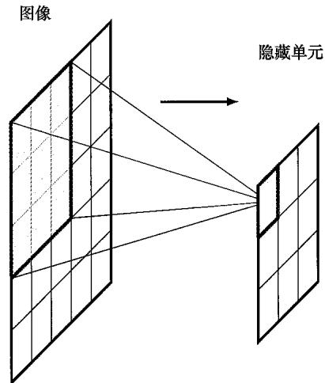  
(a)  
图10.1 (a) 感受野的图示，这里显示了网络隐藏层中的一个单元，该隐藏单元接收来自图像的  $3 \times 3$  小块像素输入，此小块中的像素构成了该隐藏单元的感受野。(b) 与该隐藏单元相关的权重值可以可视化为一个小的  $3 \times 3$  矩阵，称为卷积核。注意，还有一个额外的偏置参数，此处未显示

<table><tr><td>0.4</td><td>1.7</td><td>0.9</td></tr><tr><td>2.3</td><td>-2.1</td><td>4.0</td></tr><tr><td>-1.4</td><td>0.7</td><td>2.1</td></tr></table>

(b)

假设式（10.1）中的  $w$  和  $w_0$  是固定的，我们想知道对于哪一个输入图像小块  $x$ ，这个隐藏单元将给出最大输出响应。为了回答这个问题，我们需要以某种方式约束  $x$ 。假设它的范数  $\| x \|^2$  是固定的，那么对于某个系数  $\alpha$ ，使  $w^{\mathrm{T}}x$  最大化并因此最大化隐藏单位响应的  $x$  的解的形式为  $x = \alpha w$  （见习题10.1）。也就是说，当检测到一个在整体缩放下像核图像的图像小块时，就会产生来自这个隐藏单元的最大输出响应。注意，只有当  $w^{\mathrm{T}}x$  超过  $-w_0$  的阈值时，ReLU才会生成非零输出。因此该隐藏单元充当了特征检测器的角色，它会在找到与其卷积核匹配足够好的图像小块时发出信号。

### 10.2.2 平移等变性

接下来请注意，如果人脸图像中的小块表示处在该位置的眼睛，则图像不同部分的同一组像素值表示新位置的眼睛。我们的神经网络需要能够将其在一个位置学到的知识泛化到图像中的所有可能位置，而不需要在训练集中在每个可能位置见过对应特征的示例。为了实现这一点，我们可以简单地在图像的多个位置复制相同的隐藏单元权值，如图10.2中的一维输入空间所示。

隐藏层的单元形成一个特征图（feature map），其中，所有单元共享相同的权重。因此，如果图像的局部小块在连接到该小块的单元中

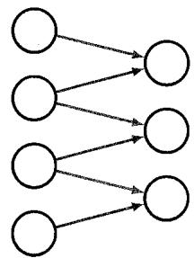  
图10.2 输入值的一维数组以及宽度为2的核卷积示意图。连接是稀疏的，由隐藏单元共享，如红色和蓝色箭头所示，其中具有相同颜色的连接具有相同的权值。因此，该网络有6个连接，但只有两个独立的可学习参数

产生特定响应，则不同位置的同一组像素值将在特征图中的相应变换位置产生相同的响应。这是等变性（equivariance）的一个例子（参见9.1.3小节）。可以看到这个网络中的连接是稀疏的（sparse），因为大多数连接不存在。此外，权值由所有隐藏单元共享，如连接的颜色所示。这一变换是卷积（convolution）的一个例子。

我们可以将卷积的想法扩展到二维图像（Dumoulin and Visin, 2016）。对于像素强度为  $I(j,k)$  的图像  $\pmb{I}$  和像素值为  $K(l,m)$  的滤波器  $\pmb{K}$ ，特征图  $\pmb{C}$  的激活值由下式给出：

$$
C (j, k) = \sum_ {l} \sum_ {m} I (j + l, k + m) K (l, m) \tag {10.2}
$$

为了清晰起见，我们省略了非线性激活函数。这也是卷积的一个例子，且有时可以写作  $C = I^{*}K$  。请注意，严格来说，式（10.2）所示的操作应称为互相关（cross-correlation），它与卷积的传统数学定义略有不同，但在这里我们将遵循机器学习文献中的常见实践，并将式（10.2）所示的操作称为卷积（见习题10.4）。图10.3以  $3\times 3$  图像和  $2\times 2$  滤波器为例，对这种操作做了说明（参见7.4.2小节）。重要的是，当在卷积网络中使用批量归一化时，在归一化单元状态过程中，必须在特征图中的每个空间位置使用相同的均值和方差，以确保特征图的统计量与位置无关。

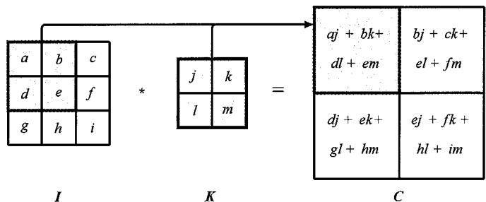  
图10.3 在  $3\times 3$  的图像上使用  $2\times 2$  滤波器卷积的示例，以及得到的  $2\times 2$  特征图

作为卷积应用的一个例子，考虑使用固定的、手工制作的卷积滤波器检测图像边缘的问题。直观上，可以认为垂直边缘是我们在图像上水平移动时，因像素之间的强度发生显著的局部变化而产生的。我们可以通过使用以下形式的  $3 \times 3$  滤波器对图像进行卷积来测量这一点：

<table><tr><td>-1</td><td>0</td><td>1</td></tr><tr><td>-1</td><td>0</td><td>1</td></tr><tr><td>-1</td><td>0</td><td>1</td></tr></table>

类似地，我们也可以使用此滤波器的转置来对图像进行卷积，从而检测图像的水平边缘：

<table><tr><td>-1</td><td>-1</td><td>-1</td></tr><tr><td>0</td><td>0</td><td>0</td></tr><tr><td>1</td><td>1</td><td>1</td></tr></table>

图10.4显示了将这两个卷积滤波器应用于示例图像的结果。注意在图10.4(b)中，如果竖直边缘对应于像素强度的增加，则特征图上的相应点为正（用浅色表示）；而如果竖直边缘对应于像素强度的降低，则特征图上的相应点为负（用深色表示）。图10.4(c)所示水平边缘的结果具有类似的性质。

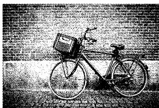  
(a)

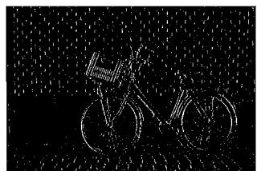  
(b)  
图10.4 使用卷积滤波器检测图像边缘的示意图：(a)原始图像；(b)使用滤波器[式（10.3）]卷积检测竖直边缘的结果；(c)使用滤波器[式（10.4）]卷积检测水平边缘的结果

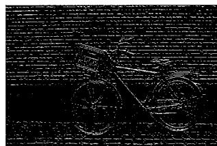  
(c)

通过将这种卷积结构与标准的全连接网络作比较，我们看到了前者的3个优点：首先，连接是稀疏的，即使对于较大的图像，权重也要少得多；其次，权值是共享的，大大减少了独立参数的数量，从而减小了学习这些参数所需的训练集大小；最后，相同的网络可以应用于不同大小的图像，而无需重新训练。我们稍后将重新讨论最后一点，但目前，你只需要注意，改变输入图像的大小只会更改特征图的大小，而不会改变模型中的权重数量或独立可学习参数的数量（参见10.4.3小节）。关于卷积网络的最后一个观察是，通过利用图形处理单元（GraphicsProcessingUnit，GPU）高计算吞吐量的大规模并行特性，卷积在实现中计算效率非常高。

### 10.2.3 填充

从图10.3中可以看出，卷积图比原始图像小。如果原始图像的维度为  $J \times K$  ，并

且我们用维度为  $M \times M$  的核对其进行卷积（滤波器通常是正方形的），则生成的特征图的维度为  $(J - M + 1) \times (K - M + 1)$  。在某些情况下，我们希望特征图具有与原始图像相同的尺寸。这可以通过在原始图像外部填充（padding）额外像素来实现，如图10.5所示。如果我们用  $P$  个像素填充原始图像，则输出的特征图的维度为  $(J + 2P - M + 1) \times (K + 2P - M + 1)$  。如果没有对原始图像进行填充，即  $P = 0$  ，则称为

有效（valid）卷积。当选择的  $P$  值使得输出数组的大小与输入数组的大小相同时，对应于  $P = (M - 1) / 2$  ，则称为等大（same）卷积，因为原始图像和特征图具有相同的维度（见习题10.6）。在计算机视觉中，滤波器的  $M$  通常为奇数，因此填充可以在原始图像的所有边上对称进行，并且滤波器具有一个与位置关联的明确定义的中心像素。最后，我们需要为填充像素选择一个合适的强度值。典型的选择是将填充值设置为零（在先从每个图像中减去平均值之后），这样零就是像素强度的平均值。填充也可以应用于特征图，以便由后续卷积层处理。

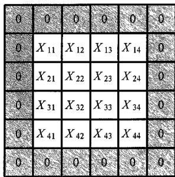  
图10.5  $4\times 4$  图像的填充示意图，该图像已填充了额外像素以创建  $6\times 6$  图像

### 10.2.4 跨步卷积

在典型的图像处理应用中，图像可以有非常多的像素，并且由于卷积核通常相对较小，因此  $M \ll J, K$  ，特征图的大小将与原始图像相似（如果进行等大填充，则大小相同）。有时，我们希望使用比原始图像小得多的特征图，以便在设计卷积网络时更灵活。实现此目的的一种方法是使用跨步卷积（strided convolution），即不再将滤波器一次移动一个像素，而是以较大的步长  $S$  移动滤波器。我们称  $S$  为步幅（stride）。如果在水平和竖直方向上使用相同的步幅，那么特征图中的元素数量为（见习题10.7）

$$
\left\lfloor \frac {J + 2 P - M}{S} - 1 \right\rfloor \times \left\lfloor \frac {K + 2 P - M}{S} - 1 \right\rfloor \tag {10.5}
$$

其中  $\lfloor x\rfloor$  表示将  $x$  向下取整，得到小于或等于  $x$  的最大整数。对于大图像和小尺寸滤波器，特征图将是原始图像大小的  $1 / S$  。

### 10.2.5 多维卷积

到目前为止，我们已经考虑了单个灰度图像上的卷积。彩色图像有三个通道，对应于红色、绿色和蓝色。通过扩展滤波器的维度，我们可以轻松地扩展卷积以支持多个通道。具有  $J \times K$  个像素和  $C$  个通道的图像可以用维度为  $J \times K \times C$  的张量来描述（参见6.3.7小节）。我们可以引入一个用维度为  $M \times M \times C$  的张量来描述的滤波器，该张量对于  $C$  个通道中的每一个通道，都有一个独立的  $M \times M$  滤波器。假设对原始图像没有进行填充且步幅为1，则同样可以得到大小为  $(J - M + 1) \times (K - M + 1)$  的特征图，如图10.6所示。

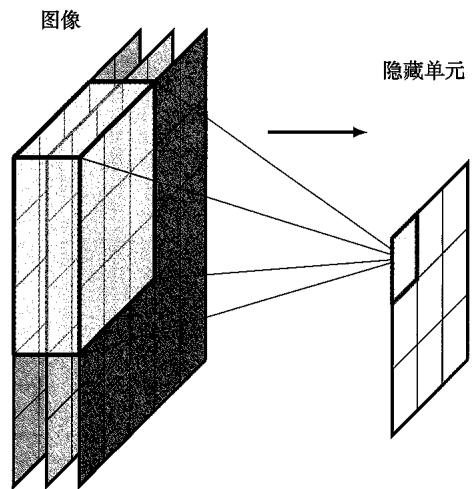  
(a)

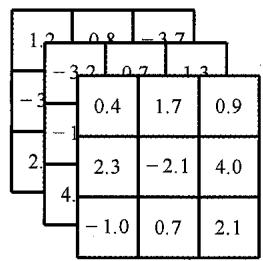  
(b)  
图10.6 (a)从R、G和B通道接收输入的多维滤波器示意图；(b)这里的核有27个权重（加上1个未显示的偏置参数），它可以可视化为一个  $3\times 3\times 3$  大小的张量

下面让我们对卷积进一步进行重要扩展。目前，我们已经创建了单一的特征图，并且特征图中的所有点共享同一组可学习参数。对于维度为  $M \times M \times C$  的滤波器，无论图像大小如何，都将有  $M^2 C$  个权重参数。此外，还有一个与该单元相关的偏置参数。这种滤波器类似于全连接网络中的单个隐藏节点，它只能学习检测一种特征，因此作用非常有限。为了构建更灵活的模型，我们需要使用多个这样的滤波器，其中每个滤波器都有互不相关的参数集，从而产生独立的特征图，如图10.7所示。我们再次将这些独立的特征图称为通道（channel）。滤波器张量现在的维度为  $M \times M \times C \times C_{\mathrm{OUT}}$  ，其中  $C$  是输入通道数， $C_{\mathrm{OUT}}$  是输出通道数。每个输出通道都有自己的相关偏置参数，因此参数总数为  $\left(M^2 C + 1\right)C_{\mathrm{OUT}}$  。

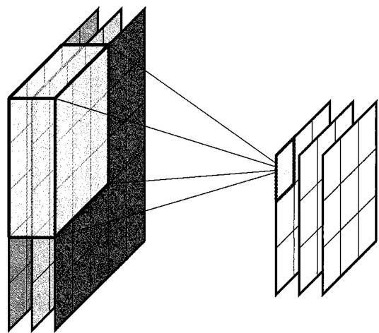  
图10.7 图10.6所示的多维卷积滤波层可以扩展为包括多个独立的滤波通道

设计卷积网络时的一个有用概念是  $1 \times 1$  卷积（Lin, Chen, and Yan, 2013），它是一

个滤波器大小为单个像素的卷积层。滤波器有  $C$  个权重（每个输入通道一个权重），外加一个偏置。 $1 \times 1$  卷积通过将输出通道数设置为与输入通道数不同，可以简单地用来改变通道数（通常用来减少通道数），而不改变特征图的大小。因此，它是对跨步卷积或池化的补充，因为它减少了通道的数量而不是通道的维度。

### 10.2.6 池化

卷积层编码了平移等变性（equivariance），如果将一小块像素（代表隐藏单元的感受野）移动到图像中的不同位置，则特征图的关联输出将移动到特征图中的相应位置。这对于在图像中找到目标的位置等应用很有价值。对于其他应用，例如图像分类，我们希望在输入平移时，输出保持不变。然而，在所有情况下，我们都希望网络能够学习分层结构，其中特定级别的复杂特征是由前一级的简单特征构建而成的。在许多情况下，这些简单特征之间的空间关系非常重要。例如，眼睛、鼻子和嘴巴的相对位置有助于确定面部的存在，而非仅仅表明这些特征在图像中存在。但是，相对位置的微小变化不会影响分类，我们希望对单个特征的这种小平移保持输出不变。这可以通过在卷积层输出之后，应用池化（pooling）来实现。

池化与卷积有相似之处，因为单元阵列排列在网格中，且其中的每个单元都从前一个特征图的感受野中获取输入。此外，池化同样需要选择滤波器大小和步幅。然而，池化与卷积的不同之处在于，池化单元的输出是其输入的简单、固定的函数，因此池化中没有可学习参数。池化的一个常见示例是最大池化（max-pooling）（Zhou and Chellappa, 1988），其中每个单元仅输出对于输入值的“取最大值”函数。图10.8所示的简单示例说明了这一过程。这里的步幅等于滤波器的宽度，因此感受野没有重叠。

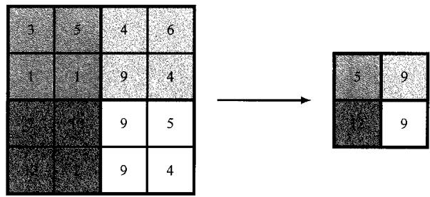  
图10.8 最大池化示意图，其中使用“max”运算符将特征图中的  $2 \times 2$  像素块组合在一起，从而生成较小维度的新特征图

除了构建一些局部平移不变性外，池化通过对特征图下采样，还可用于降低表示的维度。注意，在卷积层中使用大于1的步幅也可以实现对特征图下采样的效果。

我们可以将特征图中单元的激活解释为检测相应特征强度的度量，因此最大池化保留了有关特征是否存在以及特征强度的信息，但丢弃了一些位置信息。池化还有许多其他选择，例如平均池化（average pooling），其中池化函数计算特征图中相应感受野值的平均值。这些都引入了一定程度的局部平移不变性。

池化通常独立地应用于特征图的每个通道。例如，如果我们有一个8通道的特征

图，每个通道的维度为  $64 \times 64$  ，应用感受野大小为  $2 \times 2$  且步幅为 2 的最大池化，则池化运算的输出将是一个维度为  $32 \times 32 \times 8$  的张量。

我们还可以在特征图的多个通道中应用池化，这将使网络有潜力学习简单平移不变性之外的其他不变性。例如，如果卷积层中的多个通道学习检测不同方向上的相同特征，则这些特征图的最大池化将对于旋转变换（几乎）保持不变。

池化还允许卷积网络处理不同大小的图像。归根结底，卷积网络的输出，以及通常的一些中间层，必须具有固定尺寸。根据图像大小改变池化的步幅大小，可以使卷积网络适应可变大小的输入，以确保池化输出的数量保持不变。

### 10.2.7 多层卷积

到目前为止我们描述的卷积网络结构类似于标准全连接神经网络中的单层网络结构。为了允许网络发现和表示数据中的分层结构，现在我们通过使用多个上述类型的层来扩展架构。每个卷积层由维度为  $M \times M \times C_{\mathrm{IN}} \times C_{\mathrm{OUT}}$  的滤波器张量表示，其中独立权重和偏置参数的数量为  $\left(M^{2}C_{\mathrm{IN}} + 1\right)C_{\mathrm{OUT}}$  。每个这样的卷积层都允许我们选择性地在后续加上一个池化层。现在，我们可以连续应用多个这样的卷积层和池化层，其中某个层的输出通道  $C_{\mathrm{OUT}}$  （类似于输入图像的RGB通道）形成下一层的输入通道。注意，特征图中的通道数有时称为特征图的“深度”，但我们更愿意用“深度”来表示多层网络中的层数。

卷积框架的一个关键性质是局部性，特征图中的给定单元仅从前一层的一小块（即感受野）中获取信息。当我们构建一个每一层都是卷积层的深度神经网络时，后面层中单元的有效感受野会比前面层中单元的有效感受野大得多，如图10.9所示。

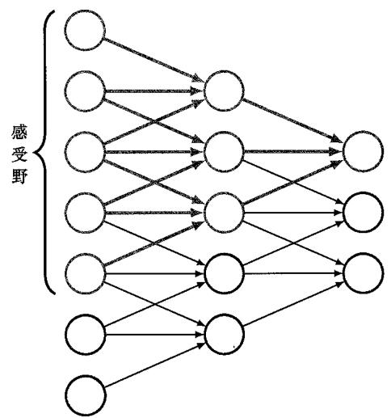  
图10.9 多层卷积网络中有效感受野如何随深度的增加而增大的示意图。在这里，我们看到输出层顶部的红色单元从中间层单元的感受野中获取输入，每个中间层单元在第一层单元中都有一个感受野。因此，输出层中红色单元的激活取决于中间层中3个单元的输出以及输入层中的5个单元的输出

在许多应用中，网络的输出单元需要预测图像整体的信息。例如在图像分类任务中，网络需要组合来自整个输入图像的信息。这通常是通过在网络的最后阶段引入一个或两个标准的全连接层来实现的，其中每个单元都连接到前一层中的每个单元。这种架构中的参数数量是可控的，因为中间池化层的存在，最终卷积层的维度通常比输入层的维度少得多。然而，即使网络中（共享的）连接数量比卷积层中的多，最终全连接层也可能包含网络中大多数独立自由度。

因此，一个完整的CNN包括多层卷积，这些卷积穿插着池化操作，并且通常在网络的最后阶段有传统的全连接层。在设计这样的架构时，需要做出许多选择，包括层数、每层中的通道数、滤波器尺寸、步幅大小以及多个其他此类超参数。在实践中，训练每个候选配置的计算成本很高，很难使用留出法对超参数的值进行系统的比较，研究人员为此探索了各种不同的架构。

### 10.2.8 网络架构示例

卷积网络是第一个成功部署在应用中的深度神经网络（即具有两个以上可学习参数层的神经网络）。一个早期的例子是LeNet，它用于对低分辨率的单色手写数字图像进行分类（LeCun et al., 1989; LeCun et al., 1998）。通过引入名为ImageNet（Deng et al., 2009）的大规模基准数据集，开发更强大的卷积网络得到了加速。该数据集包含约1400万幅自然图像，其中每幅图像都被手工归为近22000个类别之一。这是一个比我们以前使用的所有数据集都大得多的数据集，ImageNet推动的领域进步强调了大规模数据以及设计具有适当归纳偏置的良好模型在构建成功深度学习方案时的重要性。

包含1000个非重叠类别的图像子集构成了年度ImageNet大规模视觉识别挑战赛（ImageNet Large Scale Visual Recognition Challenge）的基础。同样，这比之前通常考虑几十个类别要多得多。拥有如此多的类别使问题变得更加棘手，因为如果类别分布均匀，随机猜测的错误率将达到  $99.9\%$  。该数据集包含超过128万幅训练图像、5万幅验证图像和10万幅测试图像。分类器旨在为测试图像生成预测输出类别的排序列表，并根据Top1和Top5的错误率报告结果。这意味着如果真实类别出现在列表顶部或位于5个排名最靠前的类别预测之中，则视为图像分类正确。该数据集的早期结果实现了Top5的错误率约为  $25.5\%$  。AlexNet卷积网络架构（Krizhevsky,Sutskever,and Hinton,2012）取得了重要进展，赢得了2012年的比赛，并将Top5的错误率降低到  $15.3\%$  的新纪录。AlexNet模型的关键之处在于使用ReLU函数作为激活函数、应用GPU训练网络以及使用dropout正则化（参见9.6.1小节）。该模型随后几年取得了进一步的成功，错误率降低至约  $3\%$  ，在某些数据上，比人类水平（约  $5\%$  ）表现得要好一些（Dodge and Kara,2017)。这可以归因于人类难以区分只有微妙差异的不同类别（例如不同的蘑菇品种）。

作为典型卷积网络架构的一个示例，我们来详细了解一下VGG-16模型（Simonyan and Zisserman, 2014），其中VGG代表开发该模型的Visual Geometry Group，16表示模型中可学习层的数量。VGG-16模型有一些简单的设计原则，旨在得到相对一致的架构，如图10.10所示，即最大限度地减少需要选择的超参数的数量。

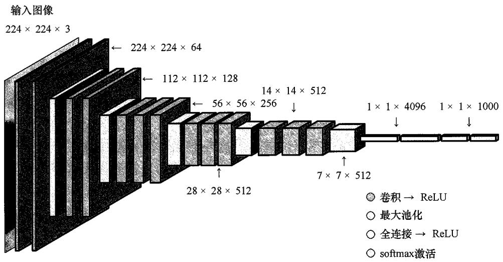  
图10.10 一个典型卷积网络（在本例中是VGG-16模型）的架构

该模型以  $224 \times 224$  像素和三颜色通道的图像作为输入，然后接入穿插有下采样的卷积层集合。所有卷积层都具有尺寸为  $3 \times 3$  、步幅为1的滤波器，执行等大填充并使用ReLU激活函数；而最大池化操作都使用步幅为2、尺寸为  $2 \times 2$  的滤波器，从而将单元数下采样为原先的四分之一。第1个可学习层（简称第1层）是一个卷积层，其中每个单元从输入通道堆叠得到的  $3 \times 3 \times 3$  的“立方体”获取输入，因此包括偏置在内共有28个参数，这些参数在该通道的特征图中的所有单元之间共享。第1层有64个这样的特征通道，从而使输出张量的大小为  $224 \times 224 \times 64$  。第2层也是卷积层，同样有64个通道。紧接着是最大池化层，给出的特征图大小为  $112 \times 112$  。第3层和第4层又是卷积层，维度为  $112 \times 112$  ，每层都有128个通道。通道数量的增加在一定程度上抵消了最大池化层中的下采样，以确保每层表示中的变量数量不会随着所通过网络层数的增加而过快地减少。同样，接下来是最大池化操作，以产生大小为  $56 \times 56$  的特征图。接下来是另外三个卷积层，每个卷积层有256个通道，从而再次将与下采样相关的通道数量增加一倍。接下来是另一个最大池化操作，得到大小为  $28 \times 28$  的特征图。紧接着又是三个卷积层，每个卷积层有512个通道，后面跟着另一个最大池化操作，下采样得到大小为  $14 \times 14$  的特征图。接下来是另外三个卷积层，尽管这三个卷积层中的特征图数量保持在512，但接下来再次进行最大池化操作，从而将特征图的大小减小到  $7 \times 7$  。最后，还有三层是全连接层，这意味着它们是具有完全连接且不共享参数的标准神经网络层。最终的最大池化层有512个通道，每个通道的大小为  $7 \times 7$  ，总共有25088个单元。第一个全连接层有4096个单元，每个单元都连接到每个最大池化单元。接下来是第二个全连接层，它同样有4096个单元。最后是第三个全连接层，它有1000个单元，以便将网络应用于包含1000个类别的分类问题。网络中输出层除外的所有可学习层都具有非线性ReLU激活函数，输出层具有softmax激活函数。总体而言，VGG-16模型中总共有大约1.38亿个可独立学习的参数，其中大部分（近1.03亿个）位于第一个全连接层中，而大多数连接位于第一个卷积层中（参见

习题10.8）。

早期的CNN通常具有较少的卷积层，因为它们具有较大的感受野。例如，AlexNet（Krizhevsky, Sutskever, and Hinton, 2012）具有步幅为4、尺寸为  $11 \times 11$  的感受野。从图10.9中可以看出，通过使用每层只有较小感受野的多层结构，也可以隐式地实现较大的感受野。后者的优点是需要的参数要少得多，并且有效地对较大的滤波器施加了归纳偏置，因为它们必定由卷积子滤波器组成。尽管这是一个高度复杂的架构，但只需要对网络函数本身进行显式编码即可，因为我们可以使用自动微分（参见8.2节）来计算损失函数的导数，并使用随机梯度下降来优化损失函数。

## 10.3 可视化训练好的CNN

本节介绍探索现代深度CNN所学习到的特征，你将看到它们与哺乳动物视觉皮层性质的一些显著相似之处。

### 10.3.1 视觉皮层

研发CNN的大部分动机来自神经科学的开创性研究，这些研究深入了解了包括人类在内的哺乳动物视觉处理的本质。来自视网膜的电信号通过位于大脑后部的视觉皮层中的一系列处理层进行转换，其中神经元组织成二维片，每个二维片形成二维视野的映射。在这些开创性研究中，Hubel and Wiesel（1959）测量了当向猫的眼睛呈现视觉刺激时，猫的视觉皮层中单个神经元的电响应。他们发现，一些称为“简单细胞”的神经元对视觉输入有强烈的响应，这些视觉输入朝向特定角度的简单边缘，位于视野内的特定位置。而其他刺激在这些神经元中产生的响应相对较少。更详细的研究表明，这些简单细胞的响应可以使用Gabor滤波器来建模，Gabor滤波器是由下式定义的二维函数：

$$
G (x, y) = A \exp (- \alpha \tilde {x} ^ {2} - \beta \tilde {y} ^ {2}) \sin (\omega \tilde {x} + \phi) \tag {10.6}
$$

其中

$$
\tilde {x} = \left(x - x _ {0}\right) \cos (\theta) + \left(y - y _ {0}\right) \sin (\theta) \tag {10.7}
$$

$$
\tilde {y} = - \left(x - x _ {0}\right) \sin (\theta) + \left(y - y _ {0}\right) \cos (\theta) \tag {10.8}
$$

式（10.7）和式（10.8）表示坐标系旋转角度  $\theta$  ，因此式（10.6）中的  $\sin (\cdot)$  项表示朝向极角  $\theta$  方向的正弦空间振荡，频率为  $\omega$  ，相位角为  $\phi$  。式（10.6）中的指数因子旨在创建一个衰减包络，将滤波器置于点  $(x_0,y_0)$  的邻域内，衰减速率由  $\alpha$  和  $\beta$  控制。式（10.6）定义的Gabor滤波器示例如图10.11所示。

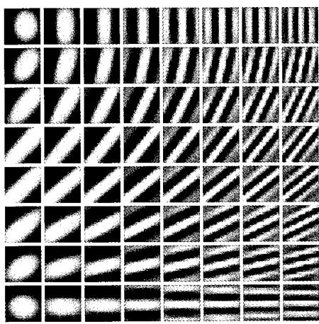  
图10.11式（10.6）定义的Gabor滤波器示例。朝向角  $\theta$  从顶行的0向底行的  $\pi /2$  变化，频率从左列的  $\omega = 1$  向右列的  $\omega = 10$  变化

Hubel和Wiesel还发现了“复杂细胞”的存在，这些细胞会响应更复杂的刺激，并且该刺激似乎是通过组合和处理简单细胞的输出得到的。这些响应对输入中的微小变化（例如位置偏移）表现出一定程度的不变性，类似于深度卷积网络中的池化单元。哺乳动物视觉处理系统的更深层对视觉输入的变换具有更具体的响应和更大的不变性。这种细胞称为“祖母细胞”，因为不论场景的位置、大小、照明或其他变换如何，当且仅当视觉输入与某些特定的概念（如祖母的头像）相对应时，这种细胞才能在理论上做出响应。这项工作直接启发了一种称为新认知机（neocognitron）（Fukushima,1980）的深度神经网络的早期形式，它是卷积神经网络的先驱。新认知机支持多层处理，包括了具有共享权重的局部感受野和紧接着的局部平均或最大池化，以确保位置不变性。然而，新认知机缺乏端到端的训练过程，而依赖于无监督聚类算法进行贪婪的逐层学习。

### 10.3.2 可视化训练好的滤波器

假设我们有一个训练好的深度CNN，我们希望了解隐藏单元学会了检测什么。对于第一个卷积层中的滤波器，这是相对直接的，因为它们对应于原始输入图像空间中的小块，我们可以将这些滤波器的网络权重直接可视化为小的图像块。第一个卷积层计算滤波器和相应图像块的内积，当内积较大时，隐藏单元将具有较大的激活。

图10.12展示了一些在ImageNet数据集上训练好的CNN第一层滤波器示例。我们看到这些滤波器与图10.11中的Gabor滤波器之间存在显著的相似性。然而，这并不意味着卷积神经网络是大脑工作的良好模型，因为我们可以从各种统计方法中获得非常相似的结果（Hyvarinen, Hurri, and Hoyer, 2009）。这些特征滤波器表示的是统计自然图像的一般性质，它们对于自然和人工系统中的图像理解都被证明是有用的。

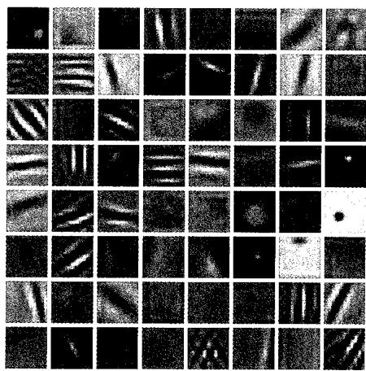  
图10.12 AlexNet第一层学习到的滤波器示例。注意，许多学习到的滤波器与图10.11中的Gabor滤波器具有惊人的相似性，它们对应于哺乳动物视觉皮层中活跃神经元检测到的特征

虽然我们可以直接可视化第一层中的滤波器，但网络中的后续层更难解释，因为它们的输入不是图像小块，而是滤波器响应。一种方法（类似于Hubel和Wiesel使用的方法）是向网络提供大量图像小块，并观察哪些图像小块在任何特定隐藏单元中产生最大的激活值。图10.13显示了在网络的隐藏单元中产生最强激活的图像小块示例。该网络有5个卷积层，紧接着是两个全连接层，在包含1000个类别的130万幅ImageNet图像上完成训练。我们看到一个自然的分层结构，第1层对边缘响应，第2层对纹理和简单形状响应，第3层显示对象的组成部分（如轮子），第5层显示整个对象。

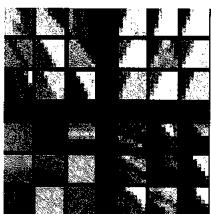  
第1层

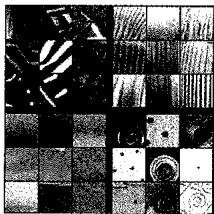  
第2层  
图10.13 在网络的隐藏单元中产生最强激活的图像小块示例（取自验证集）。该网络有5个卷积层，在ImageNet图像上完成训练。针对4个随机选择的通道，每个对应层的特征图中的前9个激活排成了一个  $3 \times 3$  的网格。我们看到复杂性会随着深度的增加稳步增长——从第1层的简单边缘到第5层的完整对象[经Zeiler and Fergus (2013)授权使用]

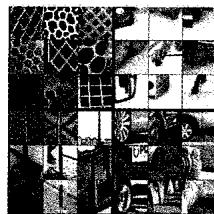  
第3层

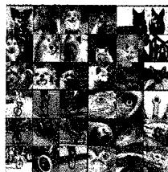  
第5层

我们可以扩展这种技术，使其不仅仅从验证集中选择图像小块，而且对输入变量进行数值优化，以最大限度地激活特定单元（Zeiler and Fergus, 2013; Simonyan, Vedaldi, and, Zisserman, 2013; Yosinski et al., 2015）。如果我们选择某单元作为输出之一，则可以寻找最能代表相应类标签的图像。由于输出单元通常具有 softmax 激活函数，因此最好最大化输入 softmax 激活函数的预激活值，而不是直接最大化类概率，

因为这样可以确保优化仅依赖于一个类。例如，假设我们想要寻找对类别“狗”产生最强烈响应的图像，那么如果我们优化softmax输出，由于softmax激活函数中的分母的存在，可能会使图像变得不那么像猫。这种方法与对抗训练有关（参见第17章）。然而，输出单元激活的无约束优化会导致单个像素值趋于无穷大，并且还会产生难以解释的高频结构，因此需要某种形式的正则化来找到更接近自然图像的解。Yosinski et al. (2015)使用了一种正则化函数，该函数涉及像素值的平方和以及一个变换过程。该过程将基于梯度的更新替换为删除高频结构的模糊操作，并引入剪裁操作来将那些对类标签贡献很小的像素值设置为零，示例结果如图10.14所示。

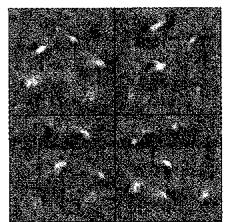  
红鹳

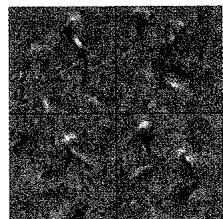  
鹈鹕  
图10.14 通过训练好的卷积分类器，对图像像素通道值最大化类概率生成的合成图像示例。图中显示了对于每一对象类别，通过不同正则化参数设置得到的4个不同的解[经Yosinski et al.(2015)授权使用]

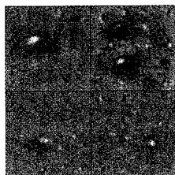  
土鳖虫

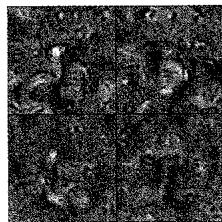  
印度眼镜蛇

### 10.3.3 显著性图

深入了解卷积网络所用特征的另一种方法是使用显著性图（saliency map），目的是在确定类标签时识别图像中最重要的区域。这最好通过研究最终卷积层来完成，因为该卷积层仍然保留了空间定位信息，该信息在随后的全连接层中会丢失，但它们具有最高级别的语义表示。对于给定的输入图像，Grad-CAM（Gradient Class Activation Mapping，梯度类激活图）方法（Selvaraju et al., 2016）首先在softmax输出之前，计算对于给定类别  $c$  的输出单元预激活  $a^{(c)}$  关于最终卷积层通道  $k$  中所有单元预激活  $a_{ij}^{(k)}$  的导数。对于该层中的每个通道，这些导数的平均值形式如下：

$$
\alpha_ {k} = \frac {1}{M _ {k}} \sum_ {i} \sum_ {j} \frac {\partial a ^ {(c)}}{\partial a _ {i j} ^ {(k)}} \tag {10.9}
$$

其中  $i$  和  $j$  用于索引通道  $k$  的行和列， $M_{k}$  是通道  $k$  中的单元总数。然后，这些平均值被用于形成以下形式的加权和：

$$
\boldsymbol {L} = \sum_ {k} \alpha_ {k} \boldsymbol {A} ^ {(k)} \tag {10.10}
$$

其中  $A^{(k)}$  是包含元素  $a_{ij}^k$  的矩阵。生成的数组与最终卷积层具有相同的维度，例如图10.10所示的VGG-16模型的维度为  $14\times 14$  ，并且可以用“热力图”的形式叠加在原始图像上，如图10.15所示。

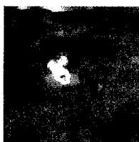  
原始图像  
图10.15 VGG-16模型关于类别“狗”和“猫”的显著性图[经Selvaraju et al. (2016)授权使用]

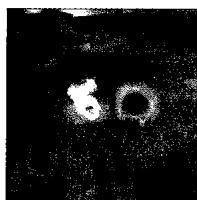  
“狗”的显著性图

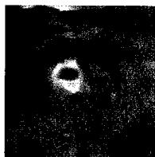  
“猫”的显著性图

### 10.3.4 对抗攻击

与输入图像像素值变化相关的梯度也可用于创建针对卷积网络的对抗攻击（adversarial attack）（Szegedy et al., 2013）。这类攻击以人类无法察觉的水平对图像进行非常小的修改，从而导致神经网络对图像分类错误。创建对抗性图像的一种简单方法是快速梯度符号（fast gradient sign）法（Goodfellow, Shlens, and Szegedy, 2014）。这涉及将图像  $x$  中的每个像素值更改为固定量  $\varepsilon$ ，符号由误差函数  $E(x,t)$  相对于像素值的梯度确定。我们将得到一幅由下式定义的修改后的图像：

$$
\boldsymbol {x} ^ {\prime} = \boldsymbol {x} + \varepsilon \operatorname {s i g n} \left(\nabla_ {\boldsymbol {x}} E (\boldsymbol {x}, t)\right) \tag {10.11}
$$

这里的  $t$  是  $\pmb{x}$  的真实标签，误差  $E(x,t)$  举例来说可以是  $\pmb{x}$  的负对数似然。使用反向传播可以有效地计算所需梯度（参见第8章）。在神经网络的常规训练中，可以通过调整网络参数来最小化误差，而式（10.11）定义的修改会改变图像（同时保持训练好的网络参数固定），从而导致误差增加。通过保持  $\varepsilon$  为较小的值，可以确保人眼无法察觉图像的变化。值得注意的是，这可以使网络以较高的置信度将图像分类错误，如图10.16中的示例所示。

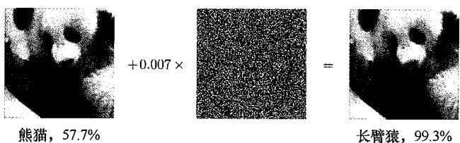  
图10.16针对训练好的卷积网络的攻击示例。左边的图像以  $57.7\%$  的置信度归类为熊猫。添加少量随机扰动（这些扰动本身以  $8.2\%$  的概率归类为线虫），导致右边的图像以  $99.3\%$  的置信度归类为长臂猿[经Goodfellow,Shlens,and Szegedy (2014)授权使用]

以这种方式欺骗神经网络会引发潜在的安全问题，因为它为攻击训练好的分类器创造了机会。这个问题似乎是由过拟合引起的，在过拟合中，具有较高拟合能力的模型已经精确地适应了特定的图像，使得输入中的微小变化会导致预测类概率的大幅变化。然而事实证明，一幅经过调整能使特定训练好的网络产生虚假输出的图像，在被输入其他网络时也会导致类似的虚假输出（Goodfellow, Shlens, and Szegedy, 2014）。此

外，使用灵活性低得多的线性模型可以得到类似的对抗结果。人工对图像进行物理修改也可能导致这种现象。当把一幅规则的、未损坏的人工图像呈现给训练好的神经网络时，该网络也会给出错误的预测，如图10.17所示。虽然这些对抗攻击的基本类型可以通过对网络训练过程进行简单修改来解决，但更复杂的对抗攻击方法处理起来依然较为困难。了解这些结果的含义并缓解隐患仍然是一个开放的研究领域。

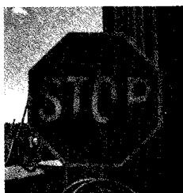  
图10.17 两个修改过的物理停车标志，它们会被CNN以极高的概率归类为限速标志[经Eykholt et al.(2018)授权使用]

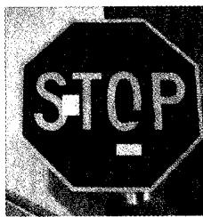

### 10.3.5 合成图像

在关于图像修改的最后一个示例中，我们将讨论一种称为DeepDream的技术（Mordvintsev, Olah, and Tyka, 2015），它为运行训练好的卷积网络提供了额外的见解。它的目标是生成具有夸张特征的合成图像。为此，我们需要确定网络特定隐藏层中的哪些节点对特定图像有较强响应，然后修改图像从而放大这些响应。例如，我们将一些云的图像输入一个在对象检测任务上训练好的网络，并且如果一个特定节点在图像的特定区域检测到类似猫的模式，则将该区域修改得更像“猫”。为此，我们首先将图像输入网络，并前向传播到某个特定层。然后将该层的反向传播  $\delta$  变量设置为等于节点的预激活，并向输入层反向传播，从而获得图像像素的梯度向量（参见8.1.2小节）。最后沿着梯度向量前进一小步来修改图像。该过程可以视作利用一种基于梯度的方法来增大函数的值（见习题10.10）。

$$
F (\boldsymbol {I}) = \sum_ {i, j, k} a _ {i j k} (\boldsymbol {I}) ^ {2} \tag {10.12}
$$

其中  $a_{ijk}(\pmb{I})$  是当输入图像为  $\pmb{I}$  时，所选网络层中通道  $k$  的第  $i$  行和第  $j$  列单元的预激活，求和操作则涉及该层中所有的单元和通道。为了生成平滑的图像，可以使用空间平滑和像素裁剪形式的某些正则化。如果需要更强的增强效果，可以多次重复此过程。将DeepDream技术应用于图像的示例如图10.18所示。有趣的是，即使卷积网络被训练以区分对象类别，但它们似乎至少能够捕获从这些类生成图像所需的一些信息。

这种技术可以应用于照片，或者我们也可以将随机噪声作为输入，从而完全由训练好的网络生成图像。尽管DeepDream技术提供了一些关于训练好的网络运行的见解，但它主要用于生成艺术风格的有趣图像。

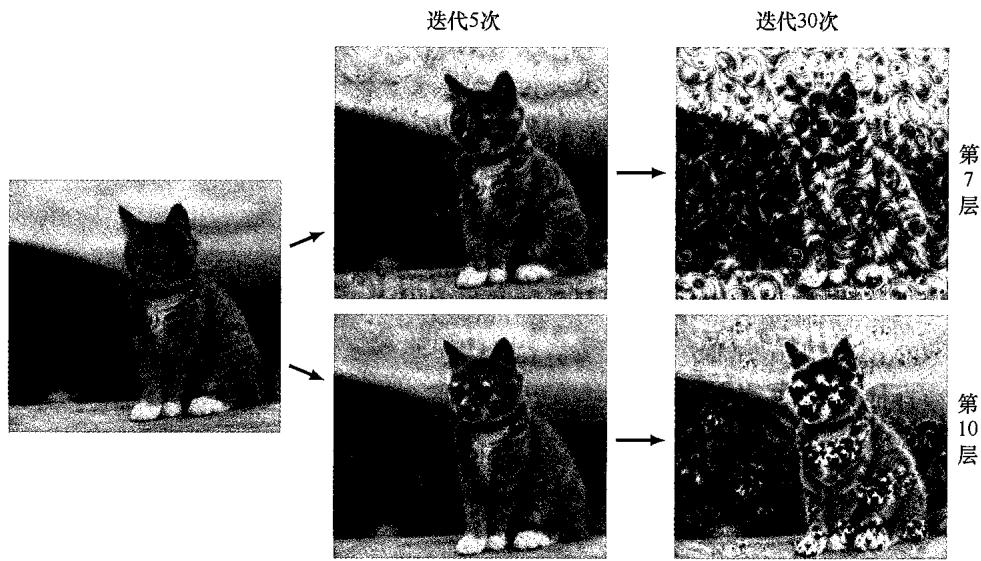  
图10.18 将DeepDream技术应用于图像的示例。上方显示了在经过5次迭代和30次迭代后，应用算法到VGG-16模型的第7个卷积层激活的结果。类似地，下方显示了同样在经过5次迭代和30次迭代后，应用算法到VGG-16模型的第10个卷积层激活的结果

## 10.4 目标检测

前面主要以图像分类问题为例介绍了CNN的设计动机，其中整幅图像被分类为单一类别，例如“猫”或“自行车”。这在诸如ImageNet的数据集上是合理的，因为每幅图像都设计为主要包含单一对象。然而，还有许多其他应用可以利用CNN内建的归纳偏置。更一般地说，如果CNN中的卷积层已经在大型图像数据集的特定任务上训练好，那么CNN就可以学习具有广泛适用性的内部表示。因此，我们可以针对大量的特定任务对CNN进行微调（参见6.3.4小节）。你已经看到了一个在ImageNet数据上训练好的卷积网络的例子，其通过迁移学习能够在皮肤病变图像的分类上达到人类水平（参见1.1.1小节）。

### 10.4.1 边界框

图像中有多个对象属于一个或多个类别的情况很常见，我们可能希望检测其中每个对象的存在及其所属的类别。此外，在许多计算机视觉应用中，我们还需要确定在图像中检测到的任何对象的位置。例如，使用RGB摄像头的自动驾驶车辆可能需要检测行人的存在和位置，并识别道路标志、其他车辆等。

考虑明确图像中对象位置的问题。一种广泛使用的方法是定义一个边界框（bounding box），它是一个紧密贴合对象边界的矩形，如图10.19所示。边界框可以由其中心坐标以及宽度和高度定义，形式为向量  $\pmb{b} = (b_{x}, b_{y}, b_{\mathrm{W}}, b_{\mathrm{H}})$  。这里  $\pmb{b}$  中的元素可以以像素为单位指定，也可以用连续数字表示。按照惯例，图像的左上角对应坐标

$(0,0)$  ，右下角对应坐标  $(1,1)$  。

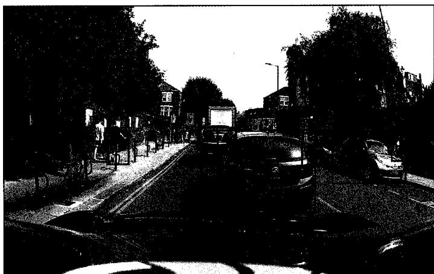  
图10.19包含不同类别的多个对象的图像，其中每个对象的位置由一个称为边界框的紧密贴合矩形标记。蓝色框对应“汽车”类别，红色框对应“行人”类别，橙色框对应“交通信号灯”类别[原始图像由Wayve Technologies Ltd.提供]

当假设图像有且仅有一个对象，且该对象来自一个预定义的类别集合（其中的类别数量为  $C$ ）时，CNN通常会有  $C$  个输出单元，其激活函数由softmax函数定义（参见5.3节）。对象可以由4个额外的具有线性激活函数的输出来定位，用于训练预测边界框坐标  $\left(b_{x}, b_{y}, b_{\mathrm{W}}, b_{\mathrm{H}}\right)$  。由于这些量是连续的，因此可以使用对应输出的平方和误差函数。例如，Redmon et al. (2015) 使用此方法首先将图像划分成一个  $7 \times 7$  的网格；然后对于每个网格单元，使用卷积网络并基于从整个图像中提取的特征，输出与网格单元关联的任意对象的类别和边界框坐标。

### 10.4.2 交并比

我们需要一种有意义的方式来衡量训练好的网络在预测边界框方面的性能。在图像分类中，网络的输出是类别标签的概率分布，我们可以通过查看测试集上真实类别标签的对数似然来衡量性能。然而，在对象定位中，我们需要某种方法来衡量边界框相对于某些真值的准确性，其中后者可以通过像人工标注这样的方式获得。预测框与目标框的重合程度可以用作这种度量的基础，但重叠区域的面积会取决于图像中对象的大小。此外，如果预测的边界框超出实际的边界框，则应该受到惩罚。一种能够较好地解决这两个问题的度量方法称为交并比（Intersection-over-Union，IoU），它是这两个边界框的交集区域面积与并集区域面积的比值，如图10.20所示。注意，IoU度量的取值范围是  $0\sim 1$  。如果IoU度量超过某个阈值（通常为0.5），则可以将预测标记为正确。注意，IoU通常不直接用作训练的损失函数，因为想要通过梯度下降优化它很困难，因此通常使用中心对象来训练，而IoU分数主要用作评价指标。

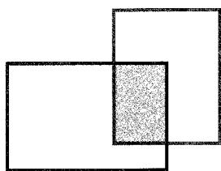  
交集区域

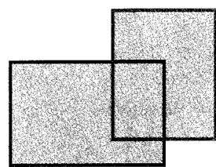  
并集区域  
图10.20 用于量化边界框预测准确性的交并比示意图。如果预测的边界框如蓝色矩形所示，而实际的边界框如红色矩形所示，则将交并比定义为这两个框的交集区域面积（左图的绿色部分）与并集区域面积（右图的绿色部分）的比值

### 10.4.3 滑动窗口

一种进行目标检测和目标定位的方法是，首先创建一个训练集，其中既包括所要检测对象的紧密裁剪的样本，也包括不包含任何对象（“背景”类别）的图像类似裁剪区域的样本。这个训练集用于训练分类器，例如一个深度 CNN，其输出表示输入窗口中存在特定对象类别的概率。然后，训练好的模型通过在图像上“扫描”输入窗口来检测新图像中的对象，并针对每个位置，将图像的结果集合用作分类器的输入。这称为滑动窗口（sliding window）。当以较高概率检测到对象时，窗口位置就是相应的边界框。

这种方法的一个明显缺点是，由于图像中潜在窗口位置的数量十分庞大，因此计算成本可能非常高。此外，为了适应图像中不同大小的对象，可能需要使用不同尺度的窗口重复该过程。我们可以通过在图像上以大于1像素的步幅在水平和垂直方向上移动输入窗口来节省计算成本。然而，使用较小步幅提高定位精度与使用较大步幅降低计算成本之间存在权衡。滑动窗口方法的计算成本对于简单分类器而言可能是合理的，但对于潜在包含数百万参数的深度神经网络来说，计算成本难以承受。

幸运的是，神经网络的卷积结构可以大大提高效率（Sermanet et al., 2013）。我们注意到，这种网络中的卷积层本身就涉及在输入图像中以跨步的方式滑动共享权重的特征检测器。因此，当使用滑动窗口通过卷积网络进行多次前向传播时，计算中存在大量冗余，如图 10.21 所示。

由于滑动窗口的计算结构与卷积的计算结构相似，因此在卷积网络中高效地实现滑动窗口非常简单。考虑图10.22中一个简化的卷积网络，它包括卷积层，后跟最大池化层，然后是全连接层。为简便起见，我们在每层中只显示一个通道，但扩展到多个通道也很容易。网络的输入图像大小为  $6 \times 6$  ，卷积层中的滤波器大小为  $3 \times 3$  ，步幅为1，最大池化层具有大小为  $2 \times 2$  、步幅为1的非重叠感受野。然后是一个具有单个输出

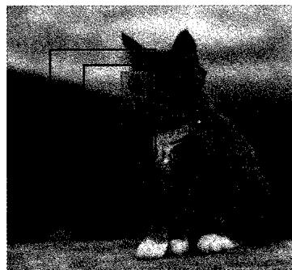  
图10.21 当用CNN处理来自滑动输入窗口的数据时，出现重复计算的示意图。其中红色框和蓝色框显示了有部分位置重叠的两个输入窗口。绿色框表示第一卷积层中隐藏单元感受野的位置之一，对应隐藏单元激活的计算在这两个窗口位置可以共享

单元的全连接层。注意，我们也可以将这个最终层视为另一个滤波器大小为  $2 \times 2$  的卷积层，以使滤波器只有一个位置，从而只产生一个输出。

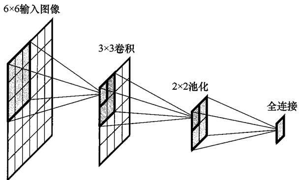  
图10.22 每层具有单通道的简单卷积网络的示例，用以说明用于目标检测的滑动窗口的概念

假设该网络是在对象的中心图像上训练的，然后应用于  $8 \times 8$  大小的更大图像，如图10.23所示。其中，我们只是通过增大卷积层和最大池化层来扩大网络。现在，卷积层的大小为  $6 \times 6$  ，池化层的大小为  $3 \times 3$  ，有4个输出单元，每个输出单元都有自己的softmax函数。输入其中一个输出单元的权重将在这4个输出单元之间共享。我们看到，处理位于输入图像左上角的窗口位置所需的计算与处理训练阶段原始  $6 \times 6$  输入的计算相同。对于其余的窗口位置，则只需要少量的额外计算，如蓝色方块所示。与简单地重复应用完整卷积网络相比，这显著提高了效率（见习题10.12）。注意，现在全连接层本身具有卷积结构。

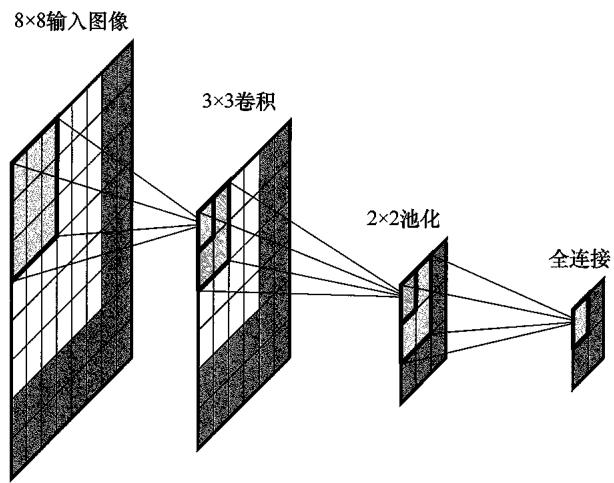  
图10.23 将图10.22所示的简单卷积网络应用于较大的图像，所需的额外计算对应于蓝色区域

### 10.4.4 跨尺度检测

除了在图像中寻找不同位置的对象之外，还需要在不同尺度和不同的宽高比下寻找对象。例如，猫直立时为其绘制的边界框，与其躺下时为其绘制的边界框具有不同

的宽高比。与使用输入窗口具有不同大小和形状的多个检测器相比，使用固定输入窗口并制作多个具有不同水平和垂直缩放因子的输入图像副本的方式更加简单，但是效果相同。后者在每个图像副本上扫描输入窗口以检测对象，并使用关联的缩放因子将边界框坐标转换回原始图像空间，如图10.24所示。

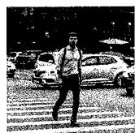  
图10.24 使用固定输入窗口在多个尺度和宽高比下检测和定位对象的示意图。原始图像(a)被复制多次，并且每个副本在水平和/或垂直方向上被缩放，如(b)中的水平缩放所示。然后在缩放的图像上以固定大小的窗口进行扫描。当以高概率检测到对象时，如(b)中的红框所示，可以将相应的窗口坐标投影回原始图像空间，从而确定相应的边界框，如(c)中所示

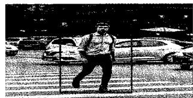

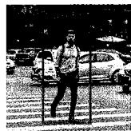

### 10.4.5 非最大抑制

通过在图像上扫描训练好的卷积网络，可以检测图像中同一类别对象的多个实例，以及来自其他类别对象的实例。然而，这也倾向于在相似位置产生同一对象的多个检测结果，如图10.25所示。可以使用非最大抑制（non-max suppression）来解决这个问题，对于每个对象类别，非最大抑制的工作方式如下：首先在整个图像上运行滑动窗口，并计算每个位置存在该对象类别的概率；然后消除所有概率低于某个阈值（例如0.7）的边界框，得到类似于图10.25所示的结果——具有最高概率的框被认为是有效检测，并且将相应的边界框记录作为预测结果；接下来，将任何与有效检测的边界框的IoU超过某个阈值（例如0.5）的其他框丢弃，从而消除针对同一对象的多个邻近检测结果；最后在剩余的框中，将具有最高概率的框选为另一个有效检测，并且重复上述消除步骤。将这个过程持续下去，直至所有边界框要么丢弃，要么选为有效检测。

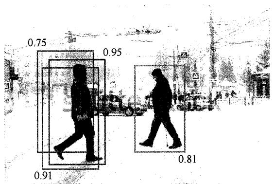  
图10.25同一对象在临近位置被多次检测及关联概率的示意图。红色边界框对应于最高的总体概率。非最大抑制消除了以蓝色显示的其他重合候选边界框，同时保留了以绿色边界框显示的对同一对象类别的另一实例的检测结果

### 10.4.6 快速区域卷积神经网络

扫描窗口方法将深度卷积网络的全部力量应用于图像的所有区域，即使一些区域不太可能包含对象。另一种方法是应用一些计算成本较低的技术，例如分割算法，来识别图像中存在对象可能性较高的区域，然后仅对这些区域应用完整的卷积网络。这种方法称为带有CNN的快速区域提议（fast Region proposals with CNN, fast R-CNN）（Girshick, 2015）。也可以使用区域提议（region proposal）卷积网络来识别最有可能的区域，这种方法称为 faster R-CNN（Ren et al., 2015），该方法允许对区域提议网络和检测定位网络进行端到端训练。

滑动窗口方法的一个缺点是，如果想要非常精确地定位对象，则需要考虑大量的只有细微间隔的窗口位置，这将使计算成本变得很高。一种更高效的方法是将滑动窗口与直接边界框预测结合起来（Sermanet et al., 2013）。在这种情况下，可以连续输出预测边界框相对于窗口位置的位置，以便对预测位置进行一些微调。

## 10.5 图像分割

在图像分类问题中，整个图像被分配了单一类别标签。我们已经看到，如果检测多个对象并使用边界框记录它们的位置，则可以提供更详细的信息（参见10.4节）。语义分割（semantic segmentation）可以让我们获得更详细的分析，其中图像的每个像素被分配给预设的类别之一。这意味着输出空间的维度与输入图像的维度相同，因此可以方便地表示为具有相同像素数量的图像。尽管输入图像通常具有R、G、B三个通道，但输出数组具有  $C$  个通道（假设有  $C$  个类别）以表示每个类别的概率。如果我们将每个类别与不同的（任意选择的）颜色关联起来，那么分割网络的预测可以表示为一幅图像，其中每个像素根据具有最高概率的类别着色，如图10.26所示。

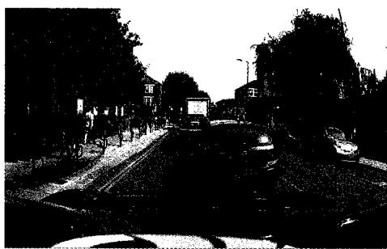  
图10.26 图像及相应语义分割的示例，其中每个像素根据具有最高概率的类别着色。例如，蓝色像素对应“汽车”类别，红色像素对应“行人”类别，橙色像素对应“交通信号灯”类别[由Wayve Technologies Ltd.提供]

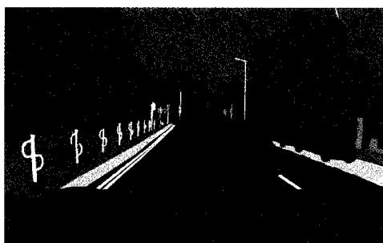

### 10.5.1 卷积分割

一种解决语义分割问题的简单方法是构建一个卷积网络，该网络将图像上以某个像素为中心的矩形部分作为输入，并借助单一softmax输出对该像素进行分类。通过

将这样的网络轮流应用于每个像素，便可以分割整个图像（这需要根据输入窗口的大小在图像周围进行边缘填充）。然而重叠部分会导致冗余计算，使得这种方法十分低效（参见图10.21）。我们可以通过将不同输入位置的前向传播计算组合输入单一网络来消除这种低效性，得到一个最终的全连接层也是卷积层的模型（参见图10.23）。因此，我们可以构建一个在每层都使用步幅为1、做了等大填充且没有池化的CNN，从而使得每一层的维度都与输入图像的维度相同。每个输出单元都具有softmax激活函数，权重在所有输出之间共享。虽然可能有效，但这样的网络仍然需要许多层，且每层中有多个通道，以学习实现高精度所需的复杂内部表示。如果这样做，即使对于常规分辨率的图像，计算成本也是难以承受的。

### 10.5.2 上采样

大多数卷积网络使用多层下采样，从而在通道数量增加的同时，使特征图的大小减小，以及在确保网络整体大小和计算成本可控的同时，允许网络从图像中提取高阶语义特征。我们可以利用这个概念来创建一个更高效的语义分割架构。该架构采用标准的深度卷积网络，并添加了一些额外的可学习层，这些额外的可学习层用于将低维的内部表示转换回原始图像分辨率（Long, Shelhamer, and Darrell, 2014; Noh, Hong, and Han, 2015; Badrinarayanan, Kendall, and Cipolla, 2015），如图 10.27 所示。

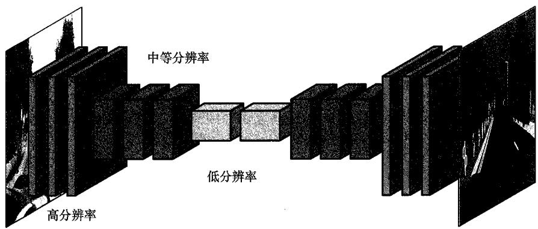  
图10.27 用于图像语义分割的卷积神经网络的示意图。这里首先通过一系列跨步卷积和/或池化操作降低特征图的维度，紧接着通过一系列转置卷积和/或上采样操作，将维度还原为原始图像的维度

为了做到这一点，我们需要一种方法来逆转跨步卷积和池化操作的下采样效果。首先考虑类比于池化的上采样操作，其中输出层的单元数比输入层的单元数多，例如，每个输入单元对应一个  $2 \times 2$  的输出单元块。接下来的问题是输出应该使用什么值。为了找到类比于平均池化的上采样操作，我们可以简单地将每个输入值复制到所有对应的输出单元中，如图10.28(a)所示。可以看到，对这个操作的输出应用平均池化即可重新生成输入。

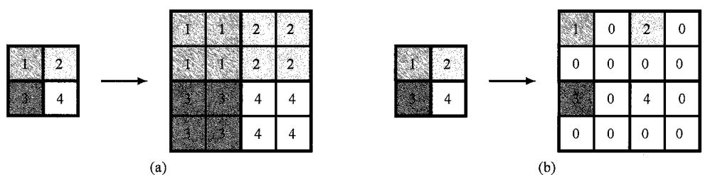  
图10.28 上采样操作的示意图：(a)类比于平均池化的上采样操作；(b)类比于最大池化的上采样操作

对于最大池化，我们可以考虑图10.28(b)中的操作，其中将每个输入值复制到相应输出块的第一个单元中，并将每个输出块中的其余值置零。同样，我们看到对输出层应用最大池化操作会重新得到输入层。这有时称为最大上采样（max-unpooling）。将非零值分配给输出块的第一个单元似乎是任意的，因此可以使用一种保留了更多来自下采样层的空间信息的改进方法（Badrinarayanan, Kendall, and Cipolla, 2015）。这是通过设计一种网络架构来实现的，该架构在每个最大池化下采样层之后都有一个相应的上采样层。在下采样过程中，记录每个输出块中的哪个单元具有最大值，接着在相应的上采样层中，将非零元素设置到相同的位置，如图10.29中的  $2 \times 2$  最大池化所示。

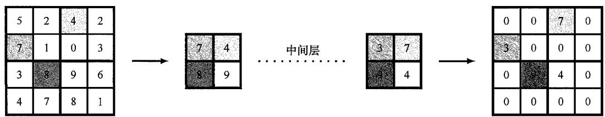  
图10.29 左边显示的最大池化层的一些空间信息可以通过如下方式保留：首先记录输入数组中每个  $2 \times 2$  块最大值的位置，然后在相应的上采样层中将非零元素放置在输出数组中相同的位置

### 10.5.3 全卷积网络

前面讨论的上采样操作都是固定的函数，类似于平均池化和最大池化的下采样操作。我们也可以使用一种称为学习到的（learned）上采样操作，类比于用于下采样的跨步卷积。在跨步卷积中，输出图上的每个单元通过共享可学习权重与输入图上的一小块相连。当我们在输出数组中移动一步时，滤波器在输入数组上将移动两步或更多步，因此输出数组的维度小于输入数组的维度。对于上采样，我们使用一个滤波器将输入数组中的一个像素连接到输出数组中的一小块。然后选择架构，使得当在输入数组中移动一步时，在输出数组中移动两步或更多步（Dumoulin and Visin, 2016）。图10.30说明了应用  $3 \times 3$  滤波器和输出步幅为2的情况。注意，存在多个滤波器位置重合的输出单元，在这种情况下，相应的输出值可以通过对来自各个滤波器位置的贡献进行求和或求平均来计算。

这种上采样称为转置卷积（transpose convolution），因为如果将下采样卷积表示为矩阵形式，则相应的上采样卷积可以由转置矩阵给出（见习题10.13）。这种上

采样又称“分数跨步卷积”，因为标准卷积的步幅是输出层步长与输入层步长的比值。例如，在图10.30中，这个比值是0.5。注意，有时也称这种上采样为“反卷积”，但最好避免使用这个术语，因为在数学中，“反卷积”通常表示泛函分析中卷积的逆操作，概念完全不同。如果我们的网络架构没有池化层，即下采样和上采样纯粹使用卷积来完成，则称这样的网络为全卷积网络（fully convolutional network）（Long, Shelhamer, and Darrell, 2014）。全卷积网络可以接收任意大小的图像，并输出相同大小的分割图。

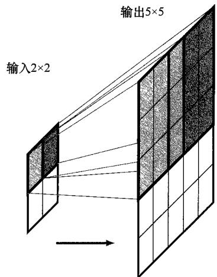  
图10.30 带有  $3 \times 3$  滤波器、输出步幅为2的转置卷积示意图。这可以看作  $3 \times 3$  卷积的逆运算。红色输出小块是通过将卷积核乘以输入层中红色单元的激活得到的，类似地，对于蓝色输出小块也是如此。小块重合单元的激活是通过对单个小块的贡献进行求和或求平均来计算的

### 10.5.4 U-Net架构

我们已经看到，与跨步卷积和池化相关的下采样允许增加通道的数量，而不会使网络的规模变得过大。但这也会降低空间分辨率，导致信号流过网络时丢失位置信息。虽然这对于图像分类来说是可以接受的，但对于图像语义分割来说，丢失空间信息是一个大问题，因为我们想要分类每个像素。解决这个问题的一种方法是使用U-Net架构（Ronneberger, Fischer, and Brox, 2015），如图10.31所示，其名称来自示意图所示的U形结构。其核心概念是，对于每个下采样层，都有一个对应的上采样层，并且每个下采样层的输出被拼接到相应的上采样层，从而使这些上采样层能够获得更高分辨率的空间信息。注意，可以在U-Net架构的最后一层使用  $1 \times 1$  卷积将通道数量减少至类别数量，然后接一个softmax激活函数。

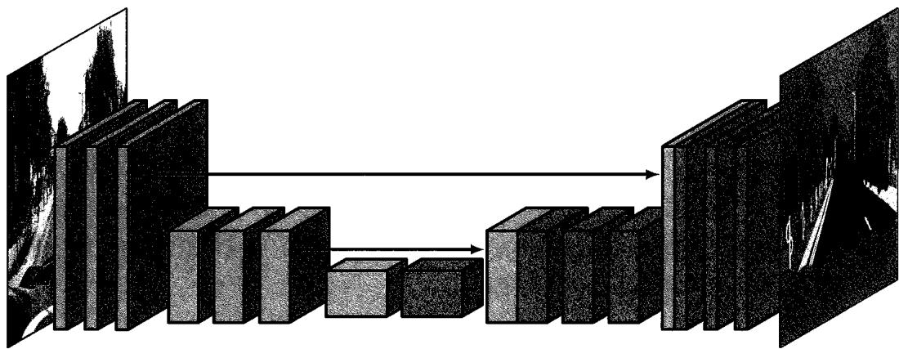  
图10.31 U-Net架构具有下采样层和上采样层的对称排列结构，每个下采样层的输出被拼接到相应的上采样层

## 10.6 风格迁移

深度卷积网络中的早期层学习检测边缘和纹理等简单特征，而后续层则学习检测更复杂的对象等实体（参见10.3节）。我们可以利用这一性质，使用一种称为神经风格迁移（neural style transfer）的过程来以另一种图像的风格重新渲染图像（Gatys, Ecker, and Bethge, 2015），如图10.32所示。

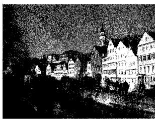  
图10.32 一个神经风格迁移的示例，展示了一张运河场景的照片（左）以J.M.W.Turner的《运输船遇难》（中）风格和Vincent van Gogh的《星月夜》（右）风格渲染后的效果，用于提供样式的图像都显示在小图中［经Gatys,Ecker和Bethge(2015)授权使用]

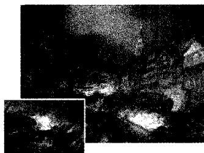

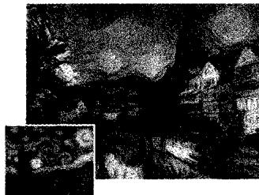

我们的目标是生成合成图像  $G$ ，其“内容”由图像  $C$  定义，其“风格”来自另一幅图像  $S$ 。这可以通过定义由以下两项的和组成的误差函数  $E(G)$  来实现，其中一项促使  $G$  具有与  $C$  相似的内容，另一项则促使  $G$  具有与  $S$  相似的风格：

$$
E (\boldsymbol {G}) = E _ {\text {c o n t e n t}} (\boldsymbol {G}, \boldsymbol {C}) + E _ {\text {s t y l e}} (\boldsymbol {G}, \boldsymbol {S}) \tag {10.13}
$$

图像内容和风格的概念由这两项的函数形式隐含定义。然后，我们可以通过从随机初始化的图像开始，并使用梯度下降最小化  $E(\pmb{G})$  来得到  $\pmb{G}$ 。

为了定义  $E_{\mathrm{content}}(G,C)$  ，我们可以选择网络中特定的卷积层，并将图像  $\pmb{G}$  用作输入，计算该层中单元的激活，对图像  $\pmb{C}$  也执行相同的操作。然后我们可以促使相应的预激活值变得相似，方法是使用如下形式的平方和误差函数：

$$
E _ {\text {c o n t e n t}} (\boldsymbol {G}, \boldsymbol {C}) = \sum_ {i, j, k} \left\{a _ {i j k} (\boldsymbol {G}) - a _ {i j k} (\boldsymbol {C}) \right\} ^ {2} \tag {10.14}
$$

其中  $a_{ijk}(\pmb{G})$  表示当输入图像为  $\pmb{G}$  时，该层中通道  $k$  位置  $(i,j)$  处单元的预激活值；类似地， $a_{ijk}(\pmb{C})$  表示当输入图像为  $\pmb{C}$  时，该层中通道  $k$  位置  $(i,j)$  处单元的预激活值。选择哪层用于定义预激活会影响最终结果，早期层旨在匹配边缘等低级特征，后续层则旨在匹配更复杂的结构甚至整个对象。

在定义  $E_{\mathrm{style}}(G,C)$  时，直觉上图像风格是由卷积层中不同通道的特征共现来确定的。例如，如果风格图像  $\pmb{S}$  中的垂直边缘通常与橙色斑块相关联，那么我们希望生成的图像  $\pmb{G}$  也是如此。然而，尽管  $E_{\mathrm{content}}(G,C)$  尝试匹配  $\pmb{G}$  的特征与  $\pmb{C}$  中相同位置的相

应特征，但对于风格误差  $E_{\mathrm{style}}(G,S)$  ，我们希望  $\pmb{G}$  具有与  $s$  相匹配的特征，因此我们选择对特征图中的位置取平均。与之前一样，考虑一个特定的卷积层。我们可以通过构建互相关矩阵来衡量输入图像  $\pmb{G}$  的通道  $k$  中的特征与通道  $k^{\prime}$  中相应特征的共现程度：

$$
F _ {k k ^ {\prime}} (\boldsymbol {G}) = \sum_ {i = 1} ^ {I} \sum_ {j = 1} ^ {J} a _ {i j k} (\boldsymbol {G}) a _ {i j k ^ {\prime}} (\boldsymbol {G}) \tag {10.15}
$$

其中， $I$  和  $J$  是这个特定卷积层中特征图的维度，乘积  $a_{ijk}a_{ijk'}$  在两个特征均激活时值较大。如果该层有  $K$  个通道，则  $F_{kk'}$  形成一个  $K \times K$  的矩阵，称为风格矩阵（style matrix）。我们可以通过使用下式比较它们的风格矩阵来衡量图像  $G$  和  $S$  具有相同风格的程度：

$$
E _ {\text {s t y l e}} (\boldsymbol {G}, \boldsymbol {S}) = \frac {1}{(2 I J K) ^ {2}} \sum_ {k = 1} ^ {K} \sum_ {k ^ {\prime} = 1} ^ {K} \left\{F _ {k k ^ {\prime}} (\boldsymbol {G}) - F _ {k k ^ {\prime}} (\boldsymbol {S}) \right\} ^ {2} \tag {10.16}
$$

虽然也可以使用单层，但通过使用以下形式多层的贡献可以获得更令人满意的结果：

$$
E _ {\text {s t y l e}} (\boldsymbol {G}, \boldsymbol {S}) = \sum_ {l} \lambda_ {l} E _ {\text {s t y l e}} ^ {(l)} (\boldsymbol {G}, \boldsymbol {S}) \tag {10.17}
$$

其中， $l$  表示卷积层。系数  $\lambda_{l}$  不仅确定了不同层之间的相对权重，也确定了相对于内容误差项的权重。这些权重系数是由主观判断经验性地调整的。

## 习题

10.1（ $\star$ ）考虑一个固定的权重向量  $\pmb{w}$ ，证明使得标量积  $\pmb{w}^{\mathrm{T}}\pmb{x}$  最大化的输入向量  $\pmb{x}$ ，在约束  $\| \pmb{x}\|^2$  为常数时，满足  $\pmb{x} = \alpha \pmb{w}$ ，其中  $\alpha$  为某个标量。这通过使用拉格朗日乘子法最容易完成（参见附录C）。  
10.2（ $\star \star$ ）考虑一个具有一维输入数组和一维特征图的卷积网络层。如图 10.2 所示，其中输入数组的维度为 5，滤波器宽度为 3，步幅为 1。通过写出权重矩阵，证明该层可以表示为全连接层的一个特例，其中缺失的连接用 0 替换，共享参数用重复元素表示，忽略任何偏置参数。  
10.3（ $\star$ ）显式计算在以下  $4 \times 4$  输入矩阵上应用  $2 \times 2$  滤波器的卷积输出：

$$
\begin{array}{c c c c} \hline 2 & 5 & 3 & 0 \\ \hline 0 & 6 & 0 & - 4 \\ \hline - 1 & - 3 & 0 & 2 \\ \hline 5 & 0 & 0 & 3 \\ \hline \end{array} \quad * \quad \begin{array}{c c c c} \hline - 2 & 0 \\ \hline 4 & 6 \\ \hline \end{array} \quad = \quad \begin{array}{c c c c} \hline ? & ? & ? \\ \hline ? & ? & ? \\ \hline ? & ? & ? \\ \hline \end{array} \tag {10.18}
$$

10.4（ $\star \star$ ）如果图像  $I$  有  $J \times K$  个像素，而滤波器  $K$  有  $L \times M$  个元素，写出式（10.2）

中两个求和的极限。在数学文献中，式（10.2）所示的操作称为互相关，卷积则由下式定义：

$$
C (j, k) = \sum_ {l} \sum_ {m} I (j - l, k - m) K (l, m) \tag {10.19}
$$

写出式（10.19）中求和的极限。证明式（10.19）可以写成如下等价的“翻转”形式：

$$
C (j, k) = \sum_ {l} \sum_ {m} I (j + l, k + m) K (l, m) \tag {10.20}
$$

并同样写出式（10.20）中求和的极限。

10.5（★）在数学中，对连续变量  $x$  进行卷积的定义如下：

$$
F (x) = \int_ {- \infty} ^ {\infty} G (y) k (x - y) d y \tag {10.21}
$$

其中  $k(x - y)$  是核函数。通过对该积分进行离散近似，解释由式（10.19）定义的CNN中卷积层与它的关系。

10.6（ $\star$ ）考虑一个大小为  $J \times K$  的图像，在所有边上都填充额外的  $P$  个像素，然后使用大小为  $M \times M$  的卷积核进行卷积，其中  $M$  是一个奇数。证明如果我们选择  $P = (M - 1) / 2$ ，则得到的特征图大小为  $J \times K$ ，即特征图与原始图像大小相同。  
10.7（ $\star$ ）证明如果对大小为  $M \times M$  的卷积核与大小为  $J \times K$  的图像进行卷积，且填充深度为  $P$ ，步幅为  $S$ ，则得到的特征图维度由式（10.5）给出。  
10.8（ $\star \star$ ）对于图 10.10 中显示的 VGG-16 模型中的每一层，计算包括偏置在内的权重数量（即连接数）和独立可学习参数的数量。证实网络中可学习参数的总数约为 1.38 亿。  
10.9（ $\star \star$ ）考虑形为式（10.2）的卷积，并假设卷积核是可分离的，则对于某些函数  $F(\cdot)$  和  $G(\cdot)$ ，有

$$
K (l, m) = F (l) G (m) \tag {10.22}
$$

证明可以不采用单个二维卷积，而是使用两个一维卷积计算得到相同的结果，从而显著提高效率。

10.10（★）DeepDream的更新过程涉及将用于反向传播的损失变量  $\delta$  设置为所选层中节点的预激活值，然后将损失反向传播到输入层以得到图像像素的梯度向量。证明这可以看作函数式（10.12）关于图像  $I$  的像素进行梯度优化的过程。  
10.11（ $\star \star$ ）当设计一个神经网络来检测图像中  $C$  个不同类别的对象时，我们可以使用一个“ $C + 1$  中之一”形式的类别标签，即每个对象类别使用一个变量，另一个变量表示“背景”类别（不包含任何定义对象类别的输入图像区域）。网络将输出一个长度为  $(C + 1)$  的概率向量。也可以使用单个二元变量来表示对象存在与否，然后使用一个单独的“ $C$  中之一”向量来表示对象类别。在这种情况下，网络将输出单个表示对象存在可能性的概率和一组独立的类别标签概率。

写出这两组概率之间的关系。

10.12（ $\star \star$ ）计算图 10.22 中的卷积网络进行一次前向传递所需的计算步骤数量，忽略偏置以及激活函数的计算。同样，计算通过图 10.23 中的扩展网络进行一次前向传递所需的计算步骤数量。最后，计算在  $8 \times 8$  图像上重复应用图 10.22 中的卷积网络 9 次与应用图 10.23 中的扩展网络 1 次所需的计算步骤数量之比。这个比值隐含了使用卷积实现滑动窗口技术所带来的效率提升。  
10.13（ $\star \star$ ）使用一维向量来说明为什么有时候上采样卷积称为转置卷积。考虑一维跨步卷积层，输入具有4个单元，激活值为向量  $\left(x_{1}, x_{2}, x_{3}, x_{4}\right)$ ，用0填充后得到  $\left(0, x_{1}, x_{2}, x_{3}, x_{4}, 0\right)$ ，滤波器的值为  $\left(w_{1}, w_{2}, w_{3}\right)$ 。假设步幅为2，写出输出层的一维激活向量。将这个输出用矩阵  $A$  乘以向量  $\left(0, x_{1}, x_{2}, x_{3}, x_{4}, 0\right)$  的形式表示。考虑上采样卷积，其中输入层具有激活值  $\left(z_{1}, z_{2}\right)$ ，滤波器的值为  $\left(w_{1}, w_{2}, w_{3}\right)$ ，输出步幅为2。假设重叠的滤波器值被求和，并且激活函数仅是恒等函数，写出6维输出向量。证明这可以表示为使用转置矩阵  $A^{\mathrm{T}}$  的矩阵乘法。

__________
