# 第11章结构化分布

我们已经看到，概率是深度学习最重要的基础概念之一。例如，用于二元分类的神经网络可以用一个条件概率分布来描述，其形式为

$$
p (t \mid \boldsymbol {x}, \boldsymbol {w}) = y (\boldsymbol {x}, \boldsymbol {w}) ^ {t} \left\{1 - y (\boldsymbol {x}, \boldsymbol {w}) \right\} ^ {(1 - t)} \tag {11.1}
$$

其中， $y(x, w)$  表示神经网络函数，它以向量  $x$  作为输入，并受可学习参数向量  $w$  的控制。相应的交叉熵似然是构建用于训练神经网络的误差函数的基础。虽然神经网络函数可能极其复杂，但式（11.1）中的条件分布形式却很简单。有许多重要的深度学习模型都具有更丰富的概率结构，如大语言模型、归一化流、变分自编码器、扩散模型等。为了描述和利用这种结构，我们引入了一个强大的框架，称为概率图模型（probabilistic graphical model）或简称图模型（graphical model），它允许以图的形式表达结构化概率分布。当与神经网络相结合来定义相关的概率分布时，图模型为创建可以端到端训练的复杂模型提供了巨大的灵活性，其中梯度可通过自动微分来进行有效

评估，并使用随机梯度下降进行训练。本章将重点讨论应用深度学习所需的概率图模型的核心概念，而对机器学习的概率图模型更为全面的讨论可参阅Bishop（2006）。

## 11.1 概率图模型

概率可以用两个简单的法则来表示，即加和法则和乘积法则（参见2.1节）。本书讨论的所有概率操作，无论多么复杂，都相当于重复应用这两个法则。因此，原则上我们可以纯粹通过代数操作来制定和使用复杂的概率模型。不过，我们发现，使用概率分布的图示法来扩充分析是有好处的，因为图示法具有以下3个有用的特性。

（1）它们提供了一种可视化概率模型结构的简单方法，可用于设计和构思新的模型。  
（2）通过对图进行检查，可以深入了解模型的特性，包括条件独立性。  
（3）在复杂模型中进行推理和学习所需的复杂计算可以用图形操作来表示，如消息传递，其中隐式地进行了基本的数学运算。

虽然这种概率图模型的节点和边与神经网络图很相似，但它们具有特别的概率性解释，并含有更丰富的语义。为了避免混淆，本书用蓝色表示神经网络图，用红色表示概率图模型（后文简称图模型）。

### 11.1.1 有向图

图由节点（也称顶点）构成，这些节点由边来连接。在图模型中，每个节点代表一个随机变量，而连接则表示这些变量之间的概率关系。然后，图就可以记录所有随机变量的联合分布是如何分解成多个因子（每个因子都仅依赖变量的一个子集）的乘积的。本章将重点讨论图模型，在图模型中，图的连接具有箭头指示的特定方向。这些模型称为有向图模型（directed graphical model），也称贝叶斯网络。

图模型的另一大类是马尔可夫随机场（Markov random field），也称无向图模型（undirected graphical model），其中的连接不带箭头，无方向意义。有向图适用于表达随机变量之间的因果关系，而无向图更适合表达随机变量之间的软约束。有向图和无向图都可以看作一种叫作因子图（factor graph）表示法的特例。接下来，我们将重点关注有向图。不过，请注意，在我们讨论图神经网络（Graph Neural Network，GNN）（参见第13章）（其中节点代表标准神经网络中的确定性变量）时，也会出现无概率解释的无向图。

### 11.1.2 分解

为了有利于使用有向图描述概率分布，首先考虑关于3个变量  $a$  、  $b$  和  $c$  的任意联合分布  $p(a, b, c)$  。请注意，在这个阶段，我们不需要进一步说明它们都是些什么变量，比如它们是离散变量还是连续变量。事实上，图模型的一个强大之处在于，一个特定的图可以为多个分布类别做出概率说明。通过应用概率的乘积法则[式（2.9）]，

我们可以写下联合分布，形式如下：

$$
p (a, b, c) = p (c \mid a, b) p (a, b) \tag {11.2}
$$

再次应用乘积法则对式（11.2）右边的第二项进行计算，得到

$$
p (a, b, c) = p (c \mid a, b) p (b \mid a) p (a) \tag {11.3}
$$

请注意，无论选择何种联合分布，以上分解都是成立的。下面让我们用一个简单的图模型来表示式（11.3）的右侧，如图11.1所示。首先为随机变量  $a$  、  $b$  和  $c$  分别引入一个节点，并将每个节点与式（11.3）右侧相应的条件分布联系起来。然后为每个条件分布添加有向连接（如箭头所示），这些连接来自与分布条件变量相对应的节点。

因此，对于因子  $p(c|a,b)$ ，将存在从节点  $a$  和  $b$  到节点  $c$  的连接；而对于因子  $p(a)$  则不存在传入连接。如果节点  $a$  和节点  $b$  之间存在一个连接，那么节点  $a$  是节点  $b$  的父节点，相应地，节点  $b$  是节点  $a$  的子节点。请注意，我们不会对节点以及节点所对应的变量进行任何形式上的区分，而只是使用相同的符号指代两者。

对于式（11.3），重要的一点是，它的左侧变量与变量  $a$ 、 $b$ 、 $c$  是对称的，而右侧变量则不对称。在对式（11.3）进行分解时，我们隐式地选择了一种特定的排序，即  $a$ 、 $b$ 、 $c$ ；如果我们选择不同的排序，就会得到不同的分解，从而得到不同的图形化表示。

下面让我们通过  $p(x_{1},\dots ,x_{K})$  给出的  $K$  个变量的联合分布来扩展图11.1中的示例。通过反复应用乘积法则，该联合分布可以写成条件分布的乘积，  $K$  个变量中的每一个变量都有一个条件分布：

$$
p \left(x _ {1}, \dots , x _ {K}\right) = p \left(x _ {K} \mid x _ {1}, \dots , x _ {K - 1}\right) \dots p \left(x _ {2} \mid x _ {1}\right) p \left(x _ {1}\right) \tag {11.4}
$$

对于给定的  $K$  ，我们可以再次将这表示为一个有向图，其中有  $K$  个节点。式（11.4）右侧的每个条件分布都有一个节点，且每个节点都有来自所有较低编号节点的输入连接。我们称这个图是全连接的（fully connected），因为每一对节点之间都有一个连接。

到目前为止，我们使用的都是完全通用的联合分布，因此它们的分解和相关的全连接图表示适用于任何分布。我们很快就会发现，正是图中没有（absence）的连接传达了关于图所代表的分布类属性的有趣信息，参见图11.2所示的有向图。请注意，这并不是一个全连接图，因为从节点  $x_{1}$  到  $x_{2}$  或者从节点  $x_{3}$  到  $x_{7}$  并不存在连接。从这个有向图中提取出联合（概率）分布的相应表示，该表示由一组条件分布的乘积写成，图中的每个节点都有一个条件分布。每个条件分布都只以图中相应节

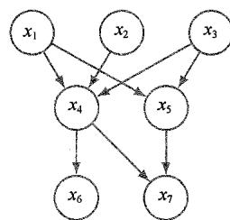  
图11.2 一个描述变量  $x_{1},\dots ,x_{7}$  联合分布的有向图。式（11.5）给出了联合分布的相应分解

点的父节点为条件。例如，节点  $x_{5}$  将以节点  $x_{1}$  和  $x_{3}$  为条件。因此，所有7个变量的联合分布为

$$
p \left(x _ {1}\right) p \left(x _ {2}\right) p \left(x _ {3}\right) p \left(x _ {4} \mid x _ {1}, x _ {2}, x _ {3}\right) p \left(x _ {5} \mid x _ {1}, x _ {3}\right) p \left(x _ {6} \mid x _ {4}\right) p \left(x _ {7} \mid x _ {4}, x _ {5}\right) \tag {11.5}
$$

建议读者花点时间仔细研究一下式（11.5）与图11.2之间的对应关系。

现在，我们可以用一般性术语来说明给定有向图与相应变量分布之间的关系。图定义的联合分布由图中所有节点的条件分布的乘积给出，每个节点的条件分布以图中该节点的父节点所对应的变量为条件。因此，对于一个有  $K$  个节点的图，联合分布的计算公式为

$$
p \left(x _ {1}, \dots , x _ {K}\right) = \prod_ {k = 1} ^ {K} p \left(x _ {k} \mid \operatorname {p a} (k)\right) \tag {11.6}
$$

其中， $\mathfrak{pa}(k)$  表示节点  $x_{k}$  的父节点集。这个关键公式表达了有向图模型联合分布的分解特性。虽然每个节点对应一个变量，但我们同样可以将变量集、向量值变量或张量值变量与图中的节点联系起来。不难看出，只要各个条件分布被归一化，式（11.6）右侧的表示就总是能被正确地归一化（见习题11.1）。

我们现在所讨论的有向图有一个重要的限制条件，即禁止存在有向环（directed cycle）。换句话说，图中不存在闭环路径，这意味着我们不能沿着箭头的方向从一个节点移动到另一个节点，最后回到起始节点。这种图也称有向无环图，或简称 DAG（Directed Acyclic Graph）。这表示存在一种节点排序，使得不存在从任何节点到任何较低编号节点的连接（见习题11.2）。

### 11.1.3 离散变量

我们已经讨论过作为指数族分布成员的概率分布的重要性，并看到指数族分布中包括许多知名分布的特例（参见3.4节）。虽然这些分布相对简单，但它们构成了构建更复杂概率分布的有用构件，而图模型非常有助于表达这些构件是如何相互连接在一起的。对于广泛使用的组件分布，有两种特殊的选择，分别对应于离散变量和高斯变量。我们先来看看离散变量。

具有  $K$  种可能状态（使用1-of-  $K$  表示法）的单个离散变量  $\pmb{x}$  的概率分布  $p(\pmb {x}|\pmb {\mu})$  由下式给出并由参数  $\pmb {\mu} = (\mu_1,\dots ,\mu_K)^{\mathrm{T}}$  控制。

$$
p (\boldsymbol {x} \mid \boldsymbol {\mu}) = \prod_ {k = 1} ^ {K} \mu_ {k} ^ {x _ {k}} \tag {11.7}
$$

由于约束  $\sum_{k}\mu_{k} = 1$  ，因此只需要指定  $\mu_{k}$  的  $K - 1$  个值即可定义分布。

假设有两个离散变量  $x_{1}$  和  $x_{2}$ ，其中每个变量都有  $K$  种状态，希望模拟它们的联合分布。用参数  $\mu_{kl}$  表示同时观测到  $x_{1k} = 1$  和  $x_{2l} = 1$  的概率，其中  $x_{1k}$  表示  $x_{1}$  的第  $k$  个组件， $x_{2l}$  表示  $x_{2}$  的第  $l$  个组件。联合分布可以写为

$$
p \left(\boldsymbol {x} _ {1}, \boldsymbol {x} _ {2} \mid \boldsymbol {\mu}\right) = \prod_ {k = 1} ^ {K} \prod_ {l = 1} ^ {K} \mu_ {k l} ^ {x _ {1 k} x _ {2 l}}
$$

由于参数  $\mu_{kl}$  受到  $\sum_{k}\sum_{l}\mu_{kl} = 1$  的约束，因此以上联合分布受  $K^2 -1$  个参数的控制。不难看出，对于  $M$  个变量的任意联合分布，必须指定的参数总数为  $K^{M} - 1$  ，因此参数总数会随着变量数量  $M$  的增加而呈指数增长。

利用乘积法则，我们可以将联合分布  $p(x_{1},x_{2})$  分解为  $p(\pmb{x}_2|\pmb{x}_1)p(\pmb{x}_1)$  的形式，对应于一个两节点图，其中有一个从节点  $\pmb{x}_{1}$  到节点  $\pmb{x}_{2}$  的连接，如图11.3(a)所示。边缘分布  $p\big(x_1\big)$  和之前一样受  $K - 1$  个参数的控制。同样，条件分布  $p(\pmb{x}_2|\pmb{x}_1)$  需要为  $\pmb{x}_{1}$  的  $K$  个可能取值中的每个值指定  $K - 1$  个参数。因此，在联合分布中必须指定的参数总数依然是  $(K - 1) + K(K - 1) = K^2 -1$  。

假设变量  $x_{1}$  和  $x_{2}$  是独立的，对应于图 11.3(b) 所示的图模型。然后，将每个变量都用一个独立的离散分布来描述，参数总数为  $2(K - 1)$  。对于  $M$  个独立离散变量的分布（每个变量有  $K$  个状态），参数总数为  $M(K - 1)$ ，因此参数总数随着变量数量的增加而呈线性增长。从图的角度来看，我们已经通过放弃图中的连接来减少参数的数量，但这样做的代价是分布的类更加有限了。

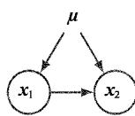  
(a)  
图11.3 (a) 这个全连接图描述了两个  $K$  状态离散变量（共有  $K^2 - 1$  个参数）的一般分布；(b) 通过放弃节点之间的连接，参数数量减少至  $2(K - 1)$

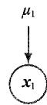

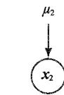  
(b)

更一般地说，如果有  $M$  个离散变量  $x_{1},\dots ,x_{M}$  ，则可以使用有向图对联合分布进行建模，每个节点有一个变量。每个节点上的条件分布由一组非负参数给出，这些参数受限于归一化约束。如果图是全连接的，那么我们就有了一个完全通用的分布，该分布有  $K^{M} - 1$  个参数；而如果图中没有连接，联合分布就会分解为边缘分布的乘积，参数总数为  $M(K - 1)$  。具有中间水平连通性的图比完全分解的图更易于实现一般分布，

且比一般分布需要更少的参数。如图11.4所示，边缘分布  $p(\boldsymbol{x}_1)$  需要  $K - 1$  个参数，而对于  $i = 2,\dots ,M$  ，条件分布  $p(\boldsymbol{x}_i|\boldsymbol{x}_{i - 1})$  中的每个分布都需要  $K(K - 1)$  个参数。因此总的参数数量为  $K - 1 + (M - 1)K(K - 1)$  ，与 $K$  成二次方并随节点链长度  $M$  的增加呈线性增长（而非指数增长）。

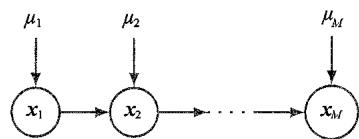  
图11.4 这个具有  $M$  个离散节点（每个节点有  $K$  个状态）的节点链需要指定  $K - 1 + (M - 1)K(K - 1)$  个参数，参数的数量随着节点链长度  $M$  的增加呈线性增长。相比之下，由  $M$  个节点组成的全连接图则有  $K^{M} - 1$  个参数，参数的数量随着  $M$  的增加呈指数增长

共享参数（也称捆绑参数）是减少模型中独立参数数量的另一种方法。例如，在图11.4中，我们可以安排在  $i = 2,\dots ,M$  的情况下，所有条件分布  $p\left(\boldsymbol {x}_i\mid \boldsymbol{x}_{i - 1}\right)$  都受同一组  $K(K - 1)$  个参数的控制，从而得到图11.5所示的模型。再加上控制  $\pmb{x}_{1}$  分布的  $K - 1$  个参数，总共需要指定  $K^2 -1$  个参数来定义联合分布。

在离散变量模型中，控制参数数量增长的另一种方法是使用参数化的条件分布表示法，而非使用完整的条件概率值表。为了阐明这一观点，请看图11.6所示的模型，其中所有节点都代表二进制变量。每个父变量  $x_{i}$  由代表概率  $p(x_{i} = 1)$  的单个参数  $\mu_{i}$  控制，因此父节点共有  $M$  个参数。然而，条件分布  $p(y|x_1,\dots ,x_M)$  需要  $2^{M}$  个参数，用于表示父变量  $2^{M}$  种可能设置中每一种设置的概率  $p(y = 1)$  。因此，一般来说，指定这一条件分布所需的参数数量将随着  $M$  的增加呈指数增长。通过使用作用于父变量线性组合的逻辑斯谛 sigmoid函数（参见3.4节），我们可以得到如下更简洁的条件分布形式：

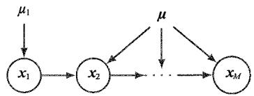  
图11.5 与图11.4相似，但所有条件分布  $p(x_{i}|x_{i} - 1)$  都共享一组参数  $\mu$

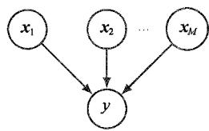  
图11.6 一个由  $M$  个父变量  $x_{1},\dots ,x_{M}$  和一个子变量  $_y$  组成的图，用于说明离散变量参数化条件分布的概念

$$
p \left(y = 1 \mid x _ {1}, \dots , x _ {M}\right) = \sigma \left(w _ {0} + \sum_ {i = 1} ^ {M} w _ {i} x _ {i}\right) = \sigma \left(\boldsymbol {w} ^ {\mathrm {T}} \boldsymbol {x}\right) \tag {11.8}
$$

其中， $\sigma(a) = (1 + \exp(-a))^{-1}$  是逻辑斯谛 sigmoid 函数， $x = (x_0, x_1, \dots, x_M)^{\mathrm{T}}$  是一个  $(M+1)$  维的父状态向量，其中增加了一个变量  $x_0$ ，其值限制为 1，而  $w = (w_0, w_1, \dots, w_M)^{\mathrm{T}}$  是一个包含  $M+1$  个参数的向量。与一般情况相比，这种条件分布的形式更受限制，但它现在受一些随  $M$  的增加呈线性增长的参数的控制。从这个意义上讲，这类似于在多元高斯分布中选择协方差矩阵的限制形式（例如对角矩阵）。

### 11.1.4 高斯变量

让我们回到图模型，其中节点代表具有高斯分布的连续变量。每个分布都以图中父节点的状态为条件。这种依赖关系可以有多种形式，这里我们重点讨论一种特定的选择，即每个高斯分布的均值是高斯父变量状态的某个线性函数。这就产生了另一类模型——线性高斯模型，其中包括许多具有实际意义的案例，如概率主成分分析（参见16.2节）、因子分析和线性动态系统等（Roweis and Ghahramani, 1999）。

考虑  $D$  个变量上的任意一个有向无环图，其中节点  $i$  代表具有高斯分布的单个连续随机变量  $x_{i}$  。该高斯分布的均值是节点  $i$  的父节点  $\mathsf{pa}(i)$  状态的线性组合：

$$
p \left(x _ {i} \mid \operatorname {p a} (i)\right) = \mathcal {N} \left(x _ {i} \left| \sum_ {j \in \operatorname {p a} (i)} w _ {i j} x _ {j} + b _ {i}, v _ {i} \right.\right) \tag {11.9}
$$

其中  $w_{ij}$  和  $b_{i}$  是控制均值的参数，  $\nu_{i}$  是  $x_{i}$  条件分布的方差。联合分布的对数就是图中所有节点的这些条件式乘积的对数，因此其形式为

$$
\begin{array}{l} \ln p (\boldsymbol {x}) = \sum_ {i = 1} ^ {D} \ln p \left(x _ {i} \mid \operatorname {p a} (i)\right) (11.10) \\ = - \sum_ {i = 1} ^ {D} \frac {1}{2 v _ {i}} \left(x _ {i} - \sum_ {j \in \operatorname {p a} (i)} w _ {i j} x _ {j} - b _ {i}\right) ^ {2} + \text {c o n s t} (11.11) \\ \end{array}
$$

其中  $\pmb{x} = (x_{1},\dots ,x_{D})^{\mathrm{T}}$ ，且const表示与  $\pmb{x}$  无关的常数项。可以看到，这是  $\pmb{x}$  的组件的二次函数，因此联合分布  $p(x)$  是多元高斯分布。

我们可以使用以下方法求出该联合分布的均值和协方差。每个变量的均值由递推公式给出（见习题11.6）：

$$
\mathbb {E} \left[ x _ {i} \right] = \sum_ {j \in \operatorname {p a} (i)} w _ {i j} \mathbb {E} \left[ x _ {j} \right] + b _ {i} \tag {11.12}
$$

因此我们可以从最低编号的节点开始，通过图递归地找到  $\mathbb{E}[x] = \left(\mathbb{E}\left[x_1\right],\dots ,\mathbb{E}\left[x_D\right]\right)^{\mathrm{T}}$  的组件，其中我们假设每个节点的编号大于其父节点的编号。同样，联合分布的协方差矩阵元素也满足以下形式的递推公式（见习题11.7）：

$$
\operatorname {c o v} \left[ x _ {i}, x _ {j} \right] = \sum_ {k \in \mathrm {p a} (j)} w _ {j k} \operatorname {c o v} \left[ x _ {i}, x _ {k} \right] + I _ {i j} v _ {j} \tag {11.13}
$$

因此，协方差同样可以从最低编号的节点开始递归求值。

考虑两个可能出现的图结构极端案例。首先，假设图中无连接，因此图由  $D$  个孤立节点构成。在这个情况下，参数  $w_{ij}$  不存在，因此只有  $D$  个参数  $b_{i}$  和  $D$  个参数  $\nu_{i}$  。从递推公式［式（11.12）和式（11.13）］中可以看出， $p(\boldsymbol{x})$  的均值为  $(b_1, \dots, b_D)^{\mathrm{T}}$  ，协方差矩阵为  $\mathrm{diag}(\nu_1, \dots, \nu_D)$  形式的对角矩阵。联合分布共有  $2D$  个参数且代表一组  $D$  个独立的单变量高斯分布。

其次，考虑一个全连接图，其中每个节点都将所有较低编号的节点作为其父节点。在这种情况下，协方差矩阵中独立参数  $w_{ij}$  和  $\nu_{i}$  的总数为  $D(D + 1) / 2$ ，对应于一般的对称协方差（见习题11.8）。

具有某种中等复杂程度的图对应于具有部分约束协方差矩阵的联合高斯分布。例如，图11.7所示的图在高斯变量  $x_{1}$  和  $x_{3}$  之间缺少一个连接。利用递推公式[式（11.12）和式（11.13）]，我们可以得出联合分布的均值和协方差为（见习题11.9）

$$
\boldsymbol {\mu} = \left(b _ {1}, b _ {2} + w _ {2 1} b _ {1}, b _ {3} + w _ {3 2} b _ {2} + w _ {3 2} w _ {2 1} b _ {1}\right) ^ {\mathrm {T}} \tag {11.14}
$$

$$
\boldsymbol {\Sigma} = \left( \begin{array}{c c c} v _ {1} & w _ {2 1} v _ {1} & w _ {3 2} w _ {2 1} v _ {1} \\ w _ {2 1} v _ {1} & v _ {2} + w _ {2 1} ^ {2} v _ {1} & w _ {3 2} \left(v _ {2} + w _ {2 1} ^ {2} v _ {1}\right) \\ w _ {3 2} w _ {2 1} v _ {1} & w _ {3 2} \left(v _ {2} + w _ {2 1} ^ {2} v _ {1}\right) & v _ {3} + w _ {3 2} ^ {2} \left(v _ {2} + w _ {2 1} ^ {2} v _ {1}\right) \end{array} \right) \tag {11.15}
$$

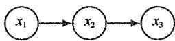  
图11.7 3个高斯变量的有向图，其中缺少一个连接

我们可以很容易地将线性高斯图模型扩展到图节点代表多元高斯变量的情况。在这种情况下，我们可以写下节点  $i$  的条件分布，形式如下：

$$
p \left(\boldsymbol {x} _ {i} \mid \operatorname {p a} (i)\right) = \mathcal {N} \left(\boldsymbol {x} _ {i} \left| \sum_ {j \in \operatorname {p a} (i)} \boldsymbol {W} _ {i j} \boldsymbol {x} _ {j} + \boldsymbol {b} _ {i}, \boldsymbol {\Sigma} _ {i} \right.\right) \tag {11.16}
$$

其中  $W_{ij}$  是一个矩阵（如果  $\pmb{x}_i$  和  $\pmb{x}_j$  的维度不同，则这个矩阵是非正方形的）。同样，我们很容易验证所有变量的联合分布是高斯分布（见习题11.10）。

### 11.1.5 二元分类器

下面我们用一个二元分类器来说明如何使用有向图对概率分布进行描述，该模型的可学习参数具有高斯先验（参见2.6.2小节）。我们可以将其写成如下形式：

$$
p (\boldsymbol {t}, \boldsymbol {w} \mid X, \lambda) = p (\boldsymbol {w} \mid \lambda) \prod_ {n = 1} ^ {N} p \left(t _ {n} \mid \boldsymbol {w}, \boldsymbol {x} _ {n}\right) \tag {11.17}
$$

其中， $\pmb{t} = (t_1, \dots, t_N)^{\mathrm{T}}$  是目标值的向量， $\pmb{X}$  是行  $x_1^{\mathrm{T}}, \dots, x_N^{\mathrm{T}}$  的数据矩阵。分布  $p(t | x, w)$  由式（11.1）给出。我们还假设参数向量  $\pmb{w}$  的高斯先验为

$$
p (\boldsymbol {w} \mid \lambda) = \mathcal {N} (\boldsymbol {w} \mid \mathbf {0}, \lambda I) \tag {11.18}
$$

该模型中的随机变量为  $\{t_1,\dots ,t_N\}$  和  $\pmb{w}$  。此外，该模型还包含噪声方差  $\sigma^2$  和超参数  $\lambda$  ，它们是模型的参数而非随机变量。如果我们暂时只考虑随机变量，那么式（11.17）给出的分布可以用图11.8所示的图模型来表示。

当开始处理更复杂的模型时，要像图11.8那样明确写出  $t_1,\dots ,t_N$  形式的多个节点就会变得很不方便。因此，我们引入了一种图形符号，以便更简洁地表示这样的多个节点。绘制一个具有代表性的节点  $t_n$  ，然后在它的周围用一个方框（称为板块）将其包围起来，并标为  $N$  以表示有  $N$  个此类节点。用此方式修改图11.8，便可得到图11.9。

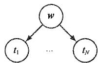  
图11.8 二元分类器的有向图模型，该模型仅显示随机变量  $\{t_1,\dots ,t_N\}$  和  $\pmb{\varpi}$

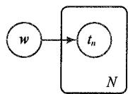  
图11.9 图11.8所示图模型的另一种更紧凑的表示法，其中引入了一个板块（标为  $N$  的方框）来表示 $N$  个节点，这里仅明确展现了一个示例节点  $t_n$

### 11.1.6 参数和观测值

有时我们会发现，用图形化表示法明确表示模型的参数及随机变量是很有帮助的。为此，我们将遵照以下惯例：随机变量用开圆表示，确定性参数用浮动变量表示。如果我们采用图11.9所示的图模型并加入确定性参数，即可得到图11.10所示的图模型。

当我们将图模型应用于机器学习问题时，通常会将一些随机变量设置为特定的观测值。例如，线性回归模型中的随机变量  $t_n$  将设置为等于训练集中给出的特定值。在图模型中。可通过给相应的节点添加阴影来表示这些观测变量。因此，与图11.10所示的图模型（其中变量  $t_n$  被观测）相对应的图模型如图11.11所示。

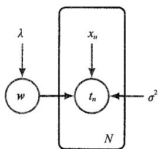  
图11.10 与图11.9所示的图模型相同，但确定性参数用浮动变量来明确表示

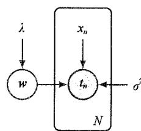  
图11.11 与图11.10所示的图模型相同，但节点  $t_n$  被添加阴影以表示相应的随机变量已设置为训练集中给出的观测值

请注意， $w$  的值是无法观测到的，因此  $w$  是一个潜（latent）变量（也称隐变量）。这些变量在本书讨论的许多模型中都发挥了至关重要的作用。因此，在有向图模型中，我们有3种变量。首先，存在未观测到（也称潜在或隐藏的）的随机变量，用红色圆圈表示。其次，当观测到随机变量并将其设置为特定值时，用蓝色阴影的红圈表示。最后，如图11.11所示，非随机参数用浮动变量表示。

请注意，由于我们最终的目标是对新的输入值进行预测，因此诸如  $\pmb{w}$  的模型参数一般不会与它们自身有直接关系。假设我们得到了一个新的输入值  $\hat{x}$ ，并希望以观测到的数据为条件找到  $\hat{t}$  的相应概率分布。以确定性参数为条件，该模型中所有随机变量的联合分布由下式给出：

$$
p (\hat {t}, \mathbf {t}, w | \hat {x}, X, \lambda) = p (w | \lambda) p (\hat {t} | w, \hat {x}) \prod_ {n = 1} ^ {N} p \left(t _ {n} \mid w, x _ {n}\right) \tag {11.19}
$$

相应的图模型如图11.12所示。

然后，通过对模型参数  $w$  进行积分，就能从加和法则中得到  $\hat{t}$  所需的预测分布。这种对参数的积分是一种完全贝叶斯式的处理方法，在实践中很少使用，尤其是在深度神经网络中。相反，我们通常首先找到能使后验分布最大化的最可能值  $w_{\mathrm{MAP}}$  来近似这个积分，然后仅使用这个单一值并应用  $p(\hat{t} | W_{\mathrm{MAP}}, \hat{x})$  进行预测。

### 11.1.7 贝叶斯定理

当概率模型中的随机变量设定为与观测值相等时，其他未观测到的随机变量的分布也会相应地改变。计算这些更新分布的过程称为推理（inference）。我们可以通过贝叶斯定理的图形解释来说明这一点。假设我们把两个变量  $x$  和  $y$  的联合分布  $p(x, y)$  分解成因子的乘积，形式为  $p(x, y) = p(x)p(y|x)$  。这可以用图11.13(a)中的有向图来表示。假设我们观测到了  $y$  的值，如图11.13(b)中的阴影节点所示。我们可以把边缘分布  $p(x)$  看作潜变量  $x$  的一个先验概率，而我们的目标就是推断出相应的后验概率。利用加和法则与乘积法则，我们可以求出

$$
p (y) = \sum_ {x ^ {\prime}} p \left(y \mid x ^ {\prime}\right) p \left(x ^ {\prime}\right) \tag {11.20}
$$

然后可以用贝叶斯定理计算出

$$
p (x \mid y) = \frac {p (y \mid x) p (x)}{p (y)} \tag {11.21}
$$

因此，联合分布现在可以用  $p(x|y)$  和  $p(y)$  来表示。从图的角度看，联合分布  $p(x, y)$  可以用图11.13(c)所示的图来表示，其中箭头的方向是相反的。这是图模型推理问题的最简单示例。

对于捕获到丰富概率结构的复杂图模型来说，一旦观测到某些随机变量，计算后验分布的过程就会变得复杂而巧妙。从概念上讲，它只涉及系统地应用概率的加和法则与乘积法则，或等同于贝叶斯定理。然而在实践中，利用图结构可以大大提高计算管理的效率。这些计算可以用图（涉及在节点间发送本地信息）上优雅的计算来表示。这些方法不仅对树状结构的图给出了精确答案，也对有环图给出了近似迭代算法。我们不会在此进一步讨论这些问题，感兴趣的读者请参阅Bishop（2006），以了解机器学习方面更全面的探讨。

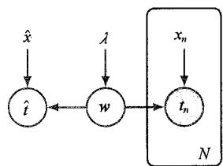  
图11.12 与图11.11所示的图模型相对应的分类模型显示了新输入值  $\hat{x}$  和相应的模型预测值  $\hat{t}$

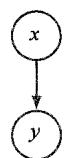  
(a)

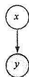  
(b)  
图11.13 贝叶斯定理的图示：(a)以分解形式表示的两个变量  $x$  和  $y$  的联合分布；(b) $y$  设为观测值的情况；(c)贝叶斯定理给出的  $x$  的后验分布

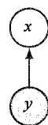  
(c)

## 11.2 条件独立性

多变量概率分布的一个重要概念是条件独立性（Dawid, 1980）。考虑3个变量  $a$ 、 $b$ 、 $c$ ，假设在给定  $b$  和  $c$  的条件下， $a$  的条件分布不依赖于  $b$  的值，即

$$
p (a \mid b, c) = p (a \mid c) \tag {11.22}
$$

我们称之为，在给定  $c$  的条件下， $a$  与  $b$  是条件独立的。如果我们考虑以  $c$  为条件的  $a$  和  $b$  的联合分布，就可以用稍微不同的方式来表示，形式如下：

$$
\begin{array}{l} p (a, b \mid c) = p (a \mid b, c) p (b \mid c) \tag {11.23} \\ = p (a \mid c) p (b \mid c) \\ \end{array}
$$

其中利用了概率的乘积法则和式（11.22）。我们看到，以  $c$  为条件的  $a$  和  $b$  的联合分布可以分解为  $a$  的边缘分布和  $b$  的边缘分布的乘积（后者同样都以  $c$  为条件）。也就是说，在给定  $c$  的条件下，变量  $a$  和  $b$  在统计上是独立的。请注意，我们对条件独立性的定义要求式（11.22）或式（11.23）必须对  $c$  的每一个可能值都成立，而不仅仅对  $c$  的某些值成立。我们有时也会使用条件独立性的速记符号（Dawid, 1979），其中的

$$
a \perp | b | c \tag {11.24}
$$

表示在给定  $c$  的条件下， $a$  和  $b$  是条件独立的。条件独立性在机器学习的概率模型中发挥着重要作用，因为它既简化了模型的结构，也简化了在模型下执行推理和学习所需的计算。

如果能用条件分布的乘积（即有向图的数学表达式）得出一组变量的联合分布的表达式，则原则上可以通过反复应用概率的加和法则与乘积法则来检验任何潜在的条件独立性是否成立。实际上，该方法十分耗时。图模型的一个重要而优雅的特点是，可以直接从图中读取联合分布的条件独立性，而无须执行任何分析操作。实现此过程的一般框架称为d分离（d-separation），其中“d”代表“有向”（Pearl, 1988）。本节将介绍d分离的概念并给出d分离准则的一般说明，形式证法见Lauritzen(1996)。

### 11.2.1 3个示例图

在开始讨论有向图的条件独立性之前，我们先来看3个简单的例子，每个例子都涉及只有3个节点的图。这些将共同促进和说明d分离的关键概念。第1个示例如图11.14所示，利用一般结果［式（11.6）］可以很容易地写出该图所对应的联合分布，即

$$
p (a, b, c) = p (a \mid c) p (b \mid c) p (c) \tag {11.25}
$$

如果未观测到任何变量，则可以通过将式（11.25）的两边相对于  $c$  边缘化来研究  $a$  和  $b$  是否独立，即

$$
p (a, b) = \sum_ {c} p (a \mid c) p (b \mid c) p (c) \tag {11.26}
$$

一般来说，这不会分解为乘积  $p(a)p(b)$  ，因此

$$
a \nmid b | \emptyset \tag {11.27}
$$

其中  $\varnothing$  表示空集，符号  $\mathbb{I}$  表示条件独立性一般不成立。当然，对于特定的分布来说，条件独立性也可能由于与各种条件概率相关的特定数值而成立，但一般来说，这并不是由图的结构得出的。

假设我们以节点  $c$  为条件，如图11.15中的有向图所示。根据式（11.25），我们可以很容易地写出在给定  $c$  的条件下  $a$  和  $b$  的条件分布，其形式为

$$
\begin{array}{l} p (a, b \mid c) = \frac {p (a , b , c)}{p (c)} \\ = p (a \mid c) p (b \mid c) \\ \end{array}
$$

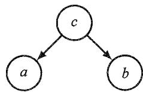  
图11.14 第1个示例用于讨论有向图的条件独立性

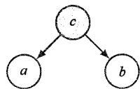  
图11.15 与图11.14相同，但以节点  $c$  为条件

于是，我们得到如下条件独立性：

$$
a \perp \parallel b \mid c
$$

可以考虑从节点  $a$  经过节点  $c$  到达节点  $b$  的路径，从而对这一结果进行简单的图释。节点  $c$  之所以相对于该路径称为尾尾相接（tail-to-tail）节点，就是因为该节点与两个箭头的尾部相连，而连接节点  $a$  和  $b$  的路径的存在会导致这两个节点相互依赖。然而，如图11.15所示，当我们以节点  $c$  为条件时，条件节点会“阻塞”从  $a$  到  $b$  的路径，并使  $a$  和  $b$  变得（条件）独立。

同样，我们也可以考虑图11.16所示的有向图。根据式（11.6），我们可以得到与该有向图相对应的联合分布，即

$$
p (a, b, c) = p (a) p (c \mid a) p (b \mid c) \tag {11.28}
$$

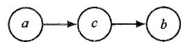  
图11.16 第2个示例用于促进建立有向图的条件独立性框架

假设未观测到任何变量。我们可以通过对  $c$  进行边缘化来检验  $a$  和  $b$  是否独立，从而得出

$$
p (a, b) = p (a) \sum_ {c} p (c \mid a) p (b \mid c) = p (a) p (b \mid a)
$$

一般来说，这不会分解为  $p(a)p(b)$ ，因此

$$
a \nmid \nmid b | \varnothing \tag {11.29}
$$

假设以节点  $c$  为条件，如图11.17中的有向图所示。利用贝叶斯定理和式（11.28），即可得出

$$
\begin{array}{l} p (a, b \mid c) = \frac {p (a , b , c)}{p (c)} \\ = \frac {p (a) p (c \mid a) p (b \mid c)}{p (c)} \\ = p (a \mid c) p (b \mid c) \\ \end{array}
$$

于是，我们再次得到如下条件独立性：

$$
a \perp \perp b \mid c
$$

和以前一样，我们可以用图形来解释这些结果。就节点  $a$  到节点  $b$  的路径而言，节点  $c$  称为头尾相接（head-to-tail）节点。该路径连接了节点  $a$  和  $b$  ，并使它们相互依赖。假设我们现在观测到了节点  $c$  ，如图11.17所示，那么这个观测结果就会“阻塞”从节点  $a$  到  $b$  的路径，从而得到条件独立性  $a \parallel b|c$  。

最后，让我们来看看第3个示例，如图11.18中的有向图所示。利用一般结果[式（11.6）]写出该图所对应的联合分布，即

$$
p (a, b, c) = p (a) p (b) p (c \mid a, b) \tag {11.30}
$$

首先考虑未观测到任何变量的情况。在  $c$  上对式（11.30）的两边进行边缘化，得到

$$
p (a, b) = p (a) p (b)
$$

因此，与前两个例子所不同的是， $a$  和  $b$  是独立的，且未观测到任何变量。我们可以将这一结果写成

$$
a \Vdash b | \emptyset \tag {11.31}
$$

假设我们以节点  $c$  为条件，如图11.19所示，则  $a$  和  $b$  的条件分布如下：

$$
\begin{array}{l} p (a, b \mid c) = \frac {p (a , b , c)}{p (c)} \\ = \frac {p (a) p (b) p (c \mid a , b)}{p (c)} \\ \end{array}
$$

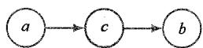  
图11.17 与图11.16相同，但以节点  $c$  为条件

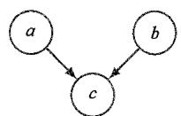  
图11.18 第3个示例具有与前两个示例截然不同的性质

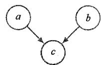  
图11.19 与图11.18相同，但以节点  $c$  为条件，且条件行为导致  $a$  和  $b$  之间的依赖关系

一般来说，这不会分解为乘积  $p(a|c)p(b|c)$  ，因此

$$
a \parallel b \mid c
$$

第3个示例的行为与前两个示例相反。观察图11.8，节点  $c$  相对于从节点  $a$  到节点  $b$  的路径是头头相接（head-to-head）的。节点  $c$  有时也称碰撞节点。当未观测到节点  $c$  时，就会“阻塞”路径，且导致  $a$  和  $b$  是独立的。然而，以  $c$  为条件会“疏通”路径，并使  $a$  和  $b$  相互依赖。

第3个例子还有一个微妙之处。首先，我们来介绍一些术语。如果存在一条从  $x$  到  $y$  的路径，且这条路径上的每一步都遵循箭头的方向，则可以说节点  $y$  是节点  $x$  的后代。然后可以证明，如果节点或其任何后代被观测到，则头头相接的路径就会变得畅通（见习题11.13）。

总而言之，在未观测到尾对尾节点或头对尾节点的情况下，路径会变得畅通；而一旦尾对尾节点或头对尾节点被观测到，路径就会变得阻塞。相比之下，头对头节点在未被观测到时会阻塞路径，而一旦头对头该节点和/或其至少一个后代被观测到，路径就会变得畅通。

### 11.2.2 相消解释

我们有必要花点时间进一步了解图11.19中的有向图的异常行为。如图11.20所示，考虑这样一个图，该图对应的问题是与汽车燃油系统有关的3个二进制随机变量。其中，变量  $B$  代表电池的状态，即满电  $(B = 1)$  或没电  $(B = 0)$ ；变量  $F$  代表油箱的状态，即满油  $(F = 1)$  或没油  $(F = 0)$ ；变量  $G$  代表电动燃油表的读数， $G = 1$  表示油箱满油， $G = 0$  表示油箱没油。电池要么满电要么没电，油箱要么满油要么没油，且先验概率为

$$
p (B = 1) = 0. 9
$$

$$
p (F = 1) = 0. 9
$$

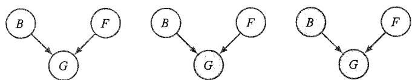  
图11.20 用于说明相消解释的3节点图的示例。3个节点分别代表电池的状态（B）、油箱的状态（F）和电动燃油表的读数（G）

在给定油箱状态和电池状态的情况下，电动燃油表读数为1的概率为

$$
p (G = 1 \mid B = 1, F = 1) = 0. 8
$$

$$
p (G = 1 \mid B = 1, F = 0) = 0. 2
$$

$$
p (G = 1 \mid B = 0, F = 1) = 0. 2
$$

$$
p (G = 1 \mid B = 0, F = 0) = 0. 1
$$

可见这是一个相当不靠谱的燃油表！因为剩下的所有概率都由概率和为1这一要求决定。

在我们观测到任何数据之前，油箱为空的先验概率为  $p(F = 0) = 0.1$  。假设我们观测燃油表并发现它的读数为零，即  $G = 0$ ，与图11.20的中间图相对应。我们可以使用贝叶斯定理来计算油箱为空的后验概率。首先计算

$$
p (G = 0) = \sum_ {B \in \{0, 1 \}} \sum_ {F \in \{0, 1 \}} p (G = 0 \mid B, F) p (B) p (F) = 0. 3 1 5 \tag {11.32}
$$

然后计算

$$
p (G = 0 \mid F = 0) = \sum_ {B \in \{0, 1 \}} p (G = 0 \mid B, F = 0) p (B) = 0. 8 1 \tag {11.33}
$$

利用这些结果，我们得出

$$
p (F = 0 \mid G = 0) = \frac {p (G = 0 \mid F = 0) p (F = 0)}{p (G = 0)} \approx 0. 2 5 7 \tag {11.34}
$$

所以  $p(F = 0|G = 0) > p(F = 0)$ ，从而只要测到燃油表读数为零，就更有可能确定油箱确实是空的，正如我们潜意识里所认为的那样。接下来，假设我们还检查了电池的状态并发现电池没电，即  $B = 0$  。如图11.20的右图所示，我们现在已经观测到燃油表和电池的状态。根据对燃油表状态和电池状态的观测，油箱为空的后验概率为

$$
p (F = 0 \mid G = 0, B = 0) = \frac {p (G = 0 \mid B = 0 , F = 0) p (F = 0)}{\sum_ {F \in \{0 , 1 \}} p (G = 0 \mid B = 0 , F) p (F)} \approx 0. 1 1 1 \tag {11.35}
$$

其中，先验概率  $p(B = 0)$  在式（11.35）的分子和分母之间相互抵消。因此，由于观测到电池的状态，油箱为空的概率降低了（从0.257降至0.111）。这与我们的直觉相吻合，即电池没电可以相消解释（explain away）燃油表读数为零的观测结果。通过观测燃油表的读数，我们发现油箱和电池的状态确实是相互依赖的。事实上，如果我们不直接观测燃油表，而是观测节点  $G$  的某个后代节点的状态，例如一个相当不可靠的目击者说他看到燃油表的读数为零，则情况也会如此（见习题11.14）。请注意，概率  $p(F = 0|G = 0,B = 0)\approx 0.111$  大于先验概率  $p\big(F = 0\big) = 0.1$ ，因为观测到燃油表读数为零仍然提供了一些支持油箱为空的证据。

### 11.2.3 d分离

本小节将对有向图的d分离特性（Pearl,1988)进行一般性阐述。考虑一个有向图，其中  $A$  、  $B$  、  $C$  是任意不相交的节点集（但它们的并集可能小于图中的完整节点集）。我们希望确定给定的有向无环图是否隐含特定的条件独立性  $A\| B|C$  。为此，我们需要考虑从  $A$  中任何节点到  $B$  中任何节点的所有可能路径。如果任何这样的路径包含一

个节点，则任何这样的路径可称为被阻塞路径，并且可能出现如下两种情况之一。

（1）路径上的箭头在节点处头尾相接或尾尾相接，且节点位于集合  $C$  中。  
（2）箭头在节点处头头相接，且节点及其任何后代节点都不在集合  $C$  中。

如果所有路径都被阻塞，那么  $A$  和  $B$  就会被  $C$  分离，图中所有变量的联合分布将满足  $A \parallel B \mid C$ 。

d分离法如图11.21所示。在图11.21(a)中，从  $a$  到  $b$  的路径既没有被节点  $f$  阻塞，因为节点  $f$  是这条路径的尾对尾节点，且未被观测到；也没有被节点  $e$  阻塞，因为尽管节点  $e$  是头对头节点，但它在条件集中只有一个后代节点  $c$  。因此，条件独立性 $A\bot B|C$  从该图中无法得出。在图11.21(b)中，从  $a$  到  $b$  的路径被节点  $f$  阻塞，因为这是一个被观测到的尾对尾节点，所以根据该图进行分解的任何分布都将满足条件独立性  $a\bot b|f$  。请注意，这条路径也被节点  $e$  阻塞了，因为节点  $e$  是一个头对头节点，节点  $e$  及其子节点都不在条件集合中。在d分离中，图11.12中以浮动变量表示的  $\lambda$  等参数的行为与观测节点的行为相同。然而，这些节点不存在边缘分布，因此参数节点本身永远不会有父节点，经过这些节点的所有路径永远是尾尾相接的，因此会被阻塞。这些节点在d分离中不起作用。

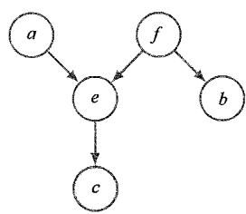  
(a)  
图11.21 d分离示意图

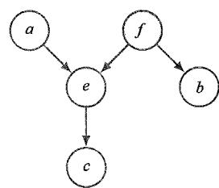  
(b)

独立同分布数据是条件独立性和d分离的另一个示例（参见2.3.2小节）。观察图11.12所示的二元分类模型。这里的随机节点分别对应  $t_n$  、  $\pmb{w}$  和  $\hat{t}$  。我们可以看到，对于从  $\hat{t}$  到任何一个节点  $t_n$  的路径来说，  $\pmb{w}$  的节点是尾对尾的，因此我们具有以下条件独立性：

$$
\hat {t} \parallel t _ {n} \mid w \tag {11.36}
$$

因此，以网络参数  $\pmb{w}$  为条件， $\hat{t}$  的预测分布与训练数据  $\{t_1, \dots, t_N\}$  无关。我们可以首先使用训练数据来确定  $\pmb{w}$  的后验分布（或后验分布的近似值），然后丢弃训练数据，并使用  $\pmb{w}$  的后验分布来预测新输入的观测结果中的  $\hat{t}$ 。

### 11.2.4 朴素贝叶斯

有一种相关的图结构出现在朴素贝叶斯（NaiveBayes）模型中，其中我们使用条

件独立性假设来简化模型结构。假设我们的数据由向量  $\pmb{x}$  的观测值组成，我们希望将 $\pmb{x}$  的观测值归入  $K$  个类别中的一个类别（后文简称类）。我们可以为每个类定义类-条件密度  $p(\boldsymbol {x}|\mathcal{C}_k)$  以及先验类概率  $p(\mathcal{C}_k)$  。朴素贝叶斯模型的关键假设是，以类  $\mathcal{C}_k$  为条件，将输入变量的分布分解为两个或多个密度的乘积。假设我们把  $\pmb{x}$  分成  $L$  个元素，即  $\pmb {x} = \left(\pmb {x}^{(1)},\dots ,\pmb{x}^{(L)}\right)$  ，则朴素贝叶斯模型的形式为

$$
p \left(\boldsymbol {x} \mid \mathcal {C} _ {k}\right) = \prod_ {l = 1} ^ {L} p \left(\boldsymbol {x} ^ {(l)} \mid \mathcal {C} _ {k}\right) \tag {11.37}
$$

假设式（11.37）分别对每个类  $\mathcal{C}_k$  成立。图11.22是该模型的图形化表示。我们可以看到，在  $j\neq i$  的情况下，对  $\mathcal{C}_k$  的观测会阻塞  $\pmb{x}^{(i)}$  和  $\pmb{x}^{(j)}$  之间的路径，因为这种路径在节点  $\mathcal{C}_k$  处是尾尾相接的，所以当给定  $\mathcal{C}_k$  时，  $\pmb{x}^{(i)}$  和  $\pmb{x}^{(j)}$  是条件独立的。然而，如果我们将  $\mathcal{C}_k$  去边缘化，从  $\pmb{x}^{(i)}$  到  $\pmb{x}^{(j)}$  的尾尾相接路径将不再

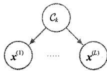  
图11.22 用于分类的朴素贝叶斯模型的图示。以类标签  $\mathcal{C}_k$  为条件，假设观测向量  $x = (x^{(1)},\dots ,x^{(L)})$  中的元素是独立的

受阻。所以一般来说，边缘密度  $p(\pmb{x})$  不会相对于元素  $\pmb{x}^{(1)},\dots ,\pmb{x}^{(L)}$  进行分解。

如果我们得到一个标记训练集，其中包括观测值  $\{x_1, \dots, x_N\}$  以及它们的类标签，我们就可以假设数据是从模型中独立提取的，从而使用最大似然法将朴素贝叶斯模型拟合到训练数据中（见习题11.15）。通过使用相应的标记数据分别拟合每个类的模型，然后将先验类概率  $p(\mathcal{C}_k)$  设置为等于每个类中训练数据点的比例，从而得到解决方案。向量  $\mathbf{x}$  属于类  $\mathcal{C}_k$  的概率由贝叶斯定理给出，其形式为

$$
p \left(\mathcal {C} _ {k} \mid x\right) = \frac {p (x \mid \mathcal {C} _ {k}) p \left(\mathcal {C} _ {k}\right)}{p (x)} \tag {11.38}
$$

其中  $p(\boldsymbol {x}|\mathcal{C}_k)$  由式（11.37）给出，  $p(x)$  可以用下式求出：

$$
p (\boldsymbol {x}) = \sum_ {k = 1} ^ {K} p \left(\boldsymbol {x} \mid \mathcal {C} _ {k}\right) p \left(\mathcal {C} _ {k}\right) \tag {11.39}
$$

用于二维数据空间的朴素贝叶斯模型如图11.23所示，其中  $\pmb{x} = (x_{1}, x_{2})$  。此处，我们假设两个类中每个类的类-条件密度  $p(\pmb{x} | \mathcal{C}_k)$  都是轴对齐的高斯密度，因此它们各自将对  $x_{1}$  和  $x_{2}$  进行分解，从而

$$
p \left(\boldsymbol {x} \mid \mathcal {C} _ {k}\right) = p \left(x _ {1} \mid \mathcal {C} _ {k}\right) p \left(x _ {2} \mid \mathcal {C} _ {k}\right) \tag {11.40}
$$

(a)  
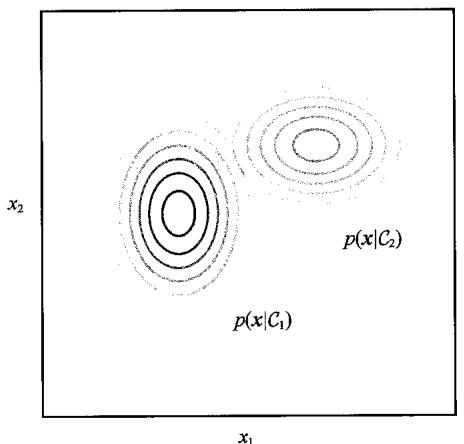  
(a) 两个类中每个类的类-条件密度  $p\big(x|\mathcal{C}_k\big)$ ; (b) 边缘密度  $p(x)$ ，其中我们假设了相等的类先验概率  $p\left(\mathcal{C}_1\right) = p\left(\mathcal{C}_2\right) = 0.5$  。请注意，条件密度会对  $x_{1}$  和  $x_{2}$  进行分解，而边缘密度不会

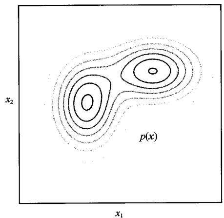  
(b)  
图11.23 用于二维数据空间的朴素贝叶斯模型图解

然而，边缘密度  $p(x)$  由下式给出：

$$
p (\boldsymbol {x}) = \sum_ {k = 1} ^ {K} p \left(\boldsymbol {x} \mid \mathcal {C} _ {k}\right) p \left(\mathcal {C} _ {k}\right) \tag {11.41}
$$

它现在是高斯混合模型且不会对  $x_{1}$  和  $x_{2}$  进行分解。在融合不同来源的数据（如用于医疗诊断的血液检测和皮肤图像）时，将会涉及朴素贝叶斯模型的简单应用（参见5.2.4小节）。

当输入空间的维度  $D$  较高时，在全  $D$  维空间中进行密度估计将更具挑战性，朴素贝叶斯假设会有所帮助。如果输入向量同时包含离散变量和连续变量，这种方法也会很有用，因为每种变量都可以用适当的模型来表示（例如，对于二元观测可以使用伯努利分布，对于实值变量可以使用高斯分布）。该模型的条件独立性假设显然是强假设，可能会导致对类-条件密度的表示相当糟糕。然而，即使这一假设没有得到精确的满足，模型在实际应用中也仍然可以提供良好的分类性能，因为决策边界可能对类-条件密度中的某些细节不敏感。

### 11.2.5 生成式模型

机器学习的许多应用都可以看作逆问题（inverse problem）的示例，其中有一个产生数据的底层过程（通常是物理过程），我们现在的目标是学习如何反转这个过程。例如，一个对象的图像可以看作一个生成过程的输出，在这个生成过程中，对象的类型是从一些可能的对象类分布中选择出来的。对象的位置和方向也从一些先验分布中选择，然后创建图像。在给定一个大型图像数据集的情况下，其中的图像已标记所含对象的类型、位置和大小，我们的目标是训练一个机器学习模型，该模型可以获取新的、未标记的图像，并检测对象是否存在，以及对象在图像中的位置和大小。因此，

机器学习解决方案代表了数据生成过程的逆过程。

一种方法是训练深度神经网络，如卷积网络，从而将图像作为输入并生成描述对象的类型、位置和大小的输出。因此，作为判别模型的一个示例，这种方法试图直接解决逆问题。只要有足够多的标记图像，这种方法就能达到很高的准确率。在实践中，未标记的图像往往很多，而在获得训练集的过程中，大部分工作量耗费在证明标记上，这个证明过程可能需要手动完成。我们的判别模型在训练过程中无法直接使用未标记的图像。

另一种方法是对生成过程进行建模，然后进行计算反转。在我们的图像示例中，如果假设对象的类、位置和大小都是独立选择的，则可以使用有向图模型来表示生成过程，如图11.24所示。请注意，箭头的方向与生成步骤的顺序相对应，因此该模型代表了观测数据生成的因果过程（Pearl, 1988）。这是生成式模型的一个示例，因为一旦经过训练，它就可以用来生成合成图像，方法是首先从学习到的先验分布中选择对象的类、位置和大小，然后从学习到的条件分布中抽取图像样本。稍后我们将看到

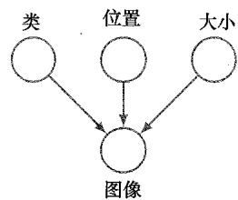  
图11.24表示创建对象图像过程的图模型。对象所属的类（离散变量）与对象的位置和方向（连续变量）具有独立的先验概率。图像（像素强度阵列）的概率分布取决于对象所属的类及其位置和方向

扩散模型和其他生成式模型如何根据对所需图像内容和风格的文字描述，合成令人赞叹的高分辨率图像（参见第20章）。

根据图11.24中的图模型，在未观测到图像时，类、位置和大小变量是独立的。这是因为这些变量中的任何两个变量之间的每条路径就图像变量而言是头头相接的，这是未观测到的。然而，当我们观测到一幅图像时，这些路径就会变得畅通，类、位置和大小变量也不再独立。从直觉上讲，这是合理的，因为被告知图像中对象所属的类可以为我们提供相关信息，从而帮助我们确定对象的位置和大小。

然而，概率模型中的隐变量并不需要有任何明确的物理解释，而引入这些隐变量可能只是为了从更简单的组件中构造出更复杂的联合分布。例如，归一化流、变分自编码器和扩散模型等都使用深度神经网络，从而通过转换具有简单高斯分布的隐变量，在数据空间中创建复杂的分布。

### 11.2.6 马尔可夫毯

在讨论更复杂的有向图时，一个很有用的条件独立性称为马尔可夫毯（Markov blanket）或马尔可夫边界（Markov boundary）。考虑由具有  $D$  个节点的有向图表示的联合分布  $p(x_{1},\dots ,x_{D})$  ，并考虑以所有其余变量  $\pmb{x}_{j\neq i}$  为条件的变量  $\pmb{x}_i$  的特定节点的条件分布。利用分解性质［式（11.6）]，我们可以将这一条件分布表示为如下形式：

$$
p \left(\boldsymbol {x} _ {i} \mid \boldsymbol {x} _ {j \neq i}\right) = \frac {p \left(\boldsymbol {x} _ {1} , \cdots , \boldsymbol {x} _ {D}\right)}{\int p \left(\boldsymbol {x} _ {1} , \cdots , \boldsymbol {x} _ {D}\right) d \boldsymbol {x} _ {i}} = \frac {\prod_ {k} p \left(\boldsymbol {x} _ {k} \mid \operatorname {p a} (k)\right)}{\int \prod_ {k} p \left(\boldsymbol {x} _ {k} \mid \operatorname {p a} (k)\right) d \boldsymbol {x} _ {i}}
$$

其中积分被离散变量的求和取代。现在我们注意到，任何与  $x_{i}$  无函数相关的因子 $p\big(x_k|\mathrm{pa}(k)\big)$  都可以在对  $\pmb{x}_i$  的积分之外取值，因此分子和分母之间会抵消。剩下的因

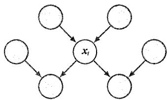  
图11.25节点  $x_{i}$  的马尔可夫毯由该节点的父节点、子节点和共父节点组成。它具有这样一个特性，即节点  $x_{i}$  的条件分布（以图中所有其余节点为条件）仅取决于马尔可夫毯中的变量

子就是节点  $x_{i}$  本身的条件分布  $p\big(x_i \mid \mathrm{pa}(i)\big)$ ，以及任何其他节点  $x_{k}$  的条件分布，从而节点  $x_{i}$  在  $p\big(x_k \mid \mathrm{pa}(k)\big)$  的条件集中，即节点  $x_{i}$  是  $x_{k}$  的父节点。条件分布  $p\big(x_i \mid \mathrm{pa}(i)\big)$  将取决于节点  $x_{i}$  的父节点，而条件  $p\big(x_k \mid \mathrm{pa}(k)\big)$  将取决于  $x_{i}$  的子节点和共父节点[即节点  $x_{k}$  的父节点（节点  $x_{i}$  除外）所对应的变量]。由父节点、子节点和共父节点组成的节点集称为马尔可夫毯，如图11.25所示。

我们可以考虑把节点  $x_{i}$  的马尔可夫毯看作能将节点  $x_{i}$  与图中的其他节点隔离开来的最小节点集。请注意，仅包含节点  $x_{i}$  的父节点和子节点是不够的，因为相消解释意味着观测到子节点不会阻塞通往共父节点的路径。因此，我们还必须观测到共父节点。

### 11.2.7 作为过滤器的图

我们已经看到，一个特定的有向图不仅代表了将联合概率分布分解为条件概率的乘积，还代表了通过d分离准则获得的一组条件独立性。d分离定理实际上表达了这两个特性的等价性。为了说明这一点，不妨把有向图看作一个过滤器。假设我们考虑的是图中（未观测到的）节点所对应的变量  $x$  的特定联合概率分布  $p(x)$  。只有当且仅当该分布可以用图所隐含的分解［式（11.6）］表示时，过滤器才会允许该分布通过。将变量  $x$  上所有可能的分布  $p(x)$  的集合提交给过滤器，对于有向分解（directed factorization），将过滤器允许通过的分布子集记为  $\mathcal{DF}$ ，如图11.26所示。

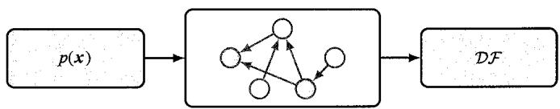  
图11.26 我们可以把图模型（此处为有向图模型）看作一种过滤器，其中的概率分布  $p(x)$  只有在满足有向分解特性时才能通过过滤器。将通过过滤器的所有可能概率分布  $p(x)$  的集合记为  $\mathcal{DF}$  。我们也可以根据是否满足图的d分离特性所隐含的所有条件独立性，使用图（作为第二种过滤器）来过滤分布。d分离定理表明，同样的一组分布  $\mathcal{DF}$  将被允许通过第二种过滤器

我们也可以将图用作另一种过滤器，首先列出通过对图应用d分离准则而得到的所有条件独立性，然后只允许满足所有这些条件独立性的分布通过。如果我们将所有可能的分布  $p(\pmb {x})$  呈现给第二种过滤器，则d分离定理告诉我们，允许通过的分布集合正是集合  $\mathcal{DF}$

需要强调的是，从d-分离得到的条件独立性适用于该特定有向图所描述的任何概率模型。例如，无论变量是离散的还是连续的，抑或是这些变量的组合，情况都是如此。

在一种极端情况下，我们有一个全接连图，它完全不显示条件独立性，并且可以表示给定变量上任何可能的联合概率分布，集合  $\mathcal{DF}$  将包含所有可能的分布  $p(x)$  。在另一种极端情况下，我们有一个全不连接图，即不包含任何连接的图。这相当于联合分布，它可以分解为组成图节点的变量的边缘分布的乘积。请注意，对于任何给定的图，集合  $\mathcal{DF}$  都将包括除图所描述的分布外，还具有其他独立特性的任何分布。例如，一个全分解分布总能通过相应变量集上的任何图所隐含的过滤器。

## 11.3 序列模型

机器学习有许多重要的应用，其中的数据都由一系列的值组成，称为序列数据。例如，文本由一系列单词组成，而蛋白质则由一系列氨基酸组成。序列数据通常是按时间排序的，例如麦克风的音频信号或特定地点的日降雨量。有时，“时间”“过去”“未来”等术语也可以用于描述其他类型的序列数据，而不仅仅是时间序列。涉及序列数据的应用包括语音识别、不同语言间的自动翻译、DNA中的基因检测、合成音乐、编写计算机代码、与现代搜索引擎进行对话等。

我们用  $x_{1},\dots ,x_{N}$  表示序列数据，其中的每个元素  $x_{n}$  都包含一个值向量。请注意，我们可能会有好几个这样的序列数据（后文简称序列），它们分别独立地取自同一个分布。在这种情况下，所有序列的联合分布可以分解为每个序列分布的乘积。由此，我们可以仅关注其中一个序列的建模。

根据式（11.4），我们已经看到，通过反复应用概率的乘积法则， $N$  个变量的一般分布可以写成条件分布的乘积，而这种分解的形式取决于变量的特定排序。对于向量值变量，如果我们选择与序列中变量顺序相对应的排序，则可以写出

$$
p \left(\boldsymbol {x} _ {1}, \dots , \boldsymbol {x} _ {N}\right) = \prod_ {n = 1} ^ {N} p \left(\boldsymbol {x} _ {n} \mid \boldsymbol {x} _ {1}, \dots , \boldsymbol {x} _ {n - 1}\right) \tag {11.42}
$$

这对应于一个有向图，其中每个节点都从序列中的每个前一节点接收一个连接，如图11.27中的4个节点所示。这就是所谓的自回归（autoregressive）模型。

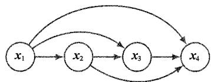  
图11.27 具有4个节点且形式为式（11.42）的一般自回归模型的示意图

这种表示法具有完全的通用性，因此从建模的角度来看没有任何价值，因为它没有表达任何假设。我们可以通过从图中移除连接，或者等效地从式（11.42）右侧因子

的条件集中去除变量，来引入条件独立性，从而限制模型的空间。

最有力的假设是去除所有条件变量，从而得出联合分布，其形式为

$$
p \left(\boldsymbol {x} _ {1}, \dots , \boldsymbol {x} _ {N}\right) = \prod_ {n = 1} ^ {N} p \left(\boldsymbol {x} _ {n}\right) \tag {11.43}
$$

式（11.43）将观测变量视为独立变量，因此完全忽略了排序信息。这对应于一个无连接的概率图模型，如图11.28所示。

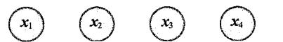  
图11.28 对一系列观测变量进行建模的最简单方法是将它们视为独立变量，这对应于一个无连接的概率图模型

既能捕获到顺序特性，又能引入建模假设的有趣模型介于以上两个极端之间。一个强有力的假设是，每个条件分布都只依赖于序列中的前一个变量，从而得出如下联合分布：

$$
p \left(\boldsymbol {x} _ {1}, \dots , \boldsymbol {x} _ {N}\right) = p \left(\boldsymbol {x} _ {1}\right) \prod_ {n = 2} ^ {N} p \left(\boldsymbol {x} _ {n} \mid \boldsymbol {x} _ {n - 1}\right) \tag {11.44}
$$

请注意，序列中第一个变量的处理方式略有不同，因为它没有条件变量。图11.29所示图模型的函数形式［式（11.44）]称为马尔可夫模型或马尔可夫链，其可用简单节点链组成的图来表示。通过使用d分离（参见11.2.3小节），我们可以看到，在时间  $n$  之前的所有观测值中，观测值  $\pmb{x}_n$  的条件分布为

$$
p \left(\boldsymbol {x} _ {n} \mid \boldsymbol {x} _ {1}, \dots , \boldsymbol {x} _ {n - 1}\right) = p \left(\boldsymbol {x} _ {n} \mid \boldsymbol {x} _ {n - 1}\right) \tag {11.45}
$$

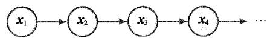  
图11.29 观测值的一阶马尔可夫链，其中特定观测值  $x_{n}$  的分布以前一个观测值  $x_{n - 1}$  为条件

从式（11.44）开始，利用概率的乘积法则，直接求值即可对此轻松验证（见习题11.16）。因此，如果我们使用这样一个模型来预测序列中的下一个观测值，则预测值的分布将只取决于前一个观测值，而与之前的所有观测值无关。

更具体地说，形式为式（11.44）的图模型称为一阶马尔可夫模型，因为每个条件分布中只出现了一个条件变量。我们可以对这个模型进行扩展，方法是让每个条件分布都依赖于前面的两个变量，从而得到一个二阶马尔可夫模型，其形式为

$$
p \left(\boldsymbol {x} _ {1}, \dots , \boldsymbol {x} _ {N}\right) = p \left(\boldsymbol {x} _ {1}\right) p \left(\boldsymbol {x} _ {2} \mid \boldsymbol {x} _ {1}\right) \prod_ {n = 3} ^ {N} p \left(\boldsymbol {x} _ {n} \mid \boldsymbol {x} _ {n - 1}, \boldsymbol {x} _ {n - 2}\right) \tag {11.46}
$$

请注意，前两个变量的处理方法不同，因为它们的条件变量少于两个。图11.30以有向图的形式对该模型进行了展示。

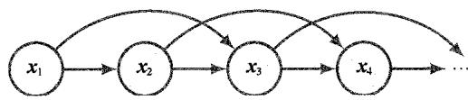  
图11.30 一个二阶马尔可夫链，其中特定观测值  $x_{n}$  的条件分布取决于前两个观测值  $x_{n - 1}$  和  $x_{n - 2}$

通过使用d分离（或使用概率规则进行直接计算），我们可以看到，在二阶马尔可夫模型中，给定所有先前观测值  $x_{1}, \dots, x_{n-1}$  的  $x_{n}$  的条件分布与观测值  $x_{1}, \dots, x_{n-3}$  无关（见习题11.17）。同样，我们可以考虑扩展到  $M$  阶马尔可夫链，其中某个变量的条件分布取决于前  $M$  个变量。不过，我们也为提高灵活性付出了代价，因为模型中的参数数量大大增加了。假设观测值是具有  $K$  种状态的离散变量，此时一阶马尔可夫链中的条件分布  $p(x_{n} | x_{n-1})$  将由一组参数（共  $K-1$  个）指定；在  $x_{n-1}$  的  $K$  个状态中，每个状态都有  $K-1$  个参数，共有  $K(K-1)$  个参数。假设我们将模型扩展为  $M$  阶马尔可夫模型，这样联合分布便可用条件式  $p(x_{n} | x_{n-M}, \dots, x_{n-1})$  来构造。如果变量是离散的且条件分布用一般条件概率来表示，模型将有  $K^{M-1}(K-1)$  个参数。因此，参数数量会随着  $M$  的增加而呈指数增长，一般来说， $M$  的值越大，这种方法就越不实用。

### 潜变量

假设我们希望为序列建立一个模型，这个模型不受马尔可夫假设的任何顺序的限制，但可以使用有限数量的自由参数来指定。我们可以通过引入额外的潜变量（又称隐变量）来实现这一目标，从而允许从简单组件中构建出类别丰富的模型。对于每个观测值  $x_{n}$ ，我们引入一个相应的潜变量  $z_{n}$  （可能与观测变量的类型或维度不同）。现在，我们假设潜变量构成了马尔可夫链，从而产生了状态空间模型的图结构，如图11.31所示。它满足关键的条件独立性要求，即给定  $z_{n}$  时，  $z_{n - 1}$  和  $z_{n + 1}$  是独立的，因此

$$
z _ {n + 1} \parallel z _ {n - 1} \mid z _ {n} \tag {11.47}
$$

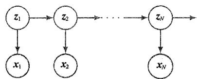  
图11.31 状态空间模型用潜变量  $z_{1},\dots ,z_{N}$  表示一系列观测变量  $x_{1},\dots ,x_{N}$  的联合概率分布，它的形式如式（11.48）所示

$$
p \left(\boldsymbol {x} _ {1}, \dots , \boldsymbol {x} _ {N}, \boldsymbol {z} _ {1}, \dots , \boldsymbol {z} _ {N}\right) = p \left(\boldsymbol {z} _ {1}\right) \left[ \prod_ {n = 2} ^ {N} p \left(\boldsymbol {z} _ {n} \mid \boldsymbol {z} _ {n - 1}\right) \right] \prod_ {n = 1} ^ {N} p \left(\boldsymbol {x} _ {n} \mid \boldsymbol {z} _ {n}\right) \tag {11.48}
$$

通过使用d分离，我们可以发现，在状态空间模型中，总有一条路径能通过潜变量连接任意两个观测变量  $x_{n}$  和  $x_{m}$ ，而且这条路径永远不会阻塞。因此，在给定所有先前观测值的情况下，观测值  $x_{n + 1}$  的预测分布  $p(x_{n + 1}|x_1,\dots ,x_n)$  并不会表现出任何条件独

立性，因此我们对  $x_{n + 1}$  的预测取决于所有先前的观测值。观测变量在任何有限阶（order）都不符合马尔可夫特性。

图11.31描述了两个重要的序列模型。如果潜变量是离散的，我们就会得到一个隐马尔可夫模型（Elliott, Aggoun, and Moore, 1995）。请注意，隐马尔可夫模型中的观测变量既可以是离散的，也可以是连续的，而且可以使用多种不同的条件分布来进行建模。如果潜变量和观测变量都是高斯变量（其条件分布与父变量之间存在线性-高斯依赖关系），我们就可以得到一个线性动态系统，也称卡尔曼滤波器（Zarchan and Musoff, 2005）。Bishop（2006）详细讨论了隐马尔可夫模型和卡尔曼滤波器，以及训练它们的算法。用深度神经网络取代用于定义  $p(\pmb{x}_n \mid \pmb{z}_n)$  的简单离散概率表或线性高斯分布，便可以使这类模型变得更加灵活。

## 习题

11.1（★）通过按顺序将变量边缘化，证明有向图的联合分布［式（11.6）］是正确归一化的，前提是每个条件分布也都是归一化的。  
11.2（ $\star$ ）证明有向图中不存在有向循环这一特性是由以下陈述得出的：存在节点的有序编号，使得每个节点都不存在通往低编号节点的连接。  
11.3（ $\star \star$ ）考虑3个二进制变量  $a, b, c \in \{0, 1\}$ ，其联合分布如表11.1所示。通过直接求值，证明该分布具有以下性质： $a$  和  $b$  边缘相关，因此  $p(a, b) \neq p(a)p(b)$ ；但是当以  $c$  为条件时，它们变得独立，因此在  $c = 0$  和  $c = 1$  时， $p(a, b|c) = p(a|c)p(b|c)$ 。

表 11.1 3 个二进制变量  $a$  、  $b$  、  $c$  的联合分布  

<table><tr><td>a</td><td>b</td><td>c</td><td>p(a,b,c)</td></tr><tr><td>0</td><td>0</td><td>0</td><td>0.192</td></tr><tr><td>0</td><td>0</td><td>1</td><td>0.144</td></tr><tr><td>0</td><td>1</td><td>0</td><td>0.048</td></tr><tr><td>0</td><td>1</td><td>1</td><td>0.216</td></tr><tr><td>1</td><td>0</td><td>0</td><td>0.192</td></tr><tr><td>1</td><td>0</td><td>1</td><td>0.064</td></tr><tr><td>1</td><td>1</td><td>0</td><td>0.048</td></tr><tr><td>1</td><td>1</td><td>1</td><td>0.096</td></tr></table>

11.4（ $\star \star$ ）求出表11.1中给出的联合分布所对应的分布  $p(a)$  、  $p(b|c)$  和  $p(c|a)$  。然后通过直接求值证明  $p(a, b, c) = p(a)p(c|a)p(b|c)$ ，并绘制相应的有向图。  
11.5（ $\star$ ）对于图11.6所示的模型，我们已经看到，通过利用逻辑斯谛sigmoid表示法[式（11.8)]，我们可以将条件分布  $p(y|x_1,\dots ,x_M)$  （其中  $x_{i}\in \{0,1\}$  ）所需的参数数量从  $2^{M}$  减少至  $M + 1$  。另一种表示法（Pearl,1988）如下：

$$
p \left(y = 1 \mid x _ {1}, \dots , x _ {M}\right) = 1 - \left(1 - \mu_ {0}\right) \prod_ {i = 1} ^ {M} \left(1 - \mu_ {i}\right) ^ {x _ {i}} \tag {11.49}
$$

其中，参数  $\mu_{i}$  代表概率  $p(x_{i} = 1)$ ， $\mu_0$  是一个附加参数，满足  $0 \leqslant \mu_0 \leqslant 1$ 。此条件分布[式（11.49）]称为噪声OR。证明这可以解释为逻辑OR函数的“软”（概率）形式（即只要至少有一个  $x_{i} = 1$ ，函数就会给出  $y = 1$ ）。讨论  $\mu_0$  的解释。

11.6（ $\star \star$ ）从条件分布的定义[式（11.9）]出发，推导出线性高斯模型联合分布均值的递推公式[式（11.12）]。

11.7（ $\star \star$ ）从条件分布的定义[式（11.9）]出发，推导出线性高斯模型联合分布协方差矩阵的递推公式[式（11.13）]。

11.8（ $\star \star$ ）证明由式（11.9）定义的  $D$  个变量的全连接线性高斯图模型的协方差矩阵中的参数数量为  $D(D + 1) / 2$ 。

11.9（ $\star \star$ ）用递推公式[式（11.12）和式（11.13）]证明图11.7所示图模型的联合分布的均值和协方差分别由式（11.14）和式（11.15）给出。

11.10（ $\star$ ）验证由线性高斯模型定义的一组向量值变量的联合分布本身就是高斯分布，其中每个节点对应于形式为式（11.16）的分布。

11.11（ $\star$ ）证明  $a \parallel b, c \mid d$  意味着  $a \parallel b \mid d$ 。

11.12（ $\star$ ）通过使用d分离，证明有向图中节点  $\pmb{x}$  的条件分布（以马尔可夫毯中的所有节点为条件）与该图中的其余变量无关。

11.13（ $\star$ ）考虑图11.32所示的有向图，其中未观测到任何变量。证明  $a \parallel b \mid \emptyset$  。假设我们现在观测到变量  $d$  ，证明一般情况下  $a \nparallel b \mid d$  。

11.14（ $\star$ ）以图11.20所示的汽车燃油系统为例，假设驾驶员  $D$  未直接观测到燃油表  $G$  的状态，而是看到了燃油表并向我们报告了燃油表读数。该驾驶员报告指出，燃油表要么显示油箱已满  $(D = 1)$ ，要么显示油箱已空  $(D = 0)$ 。该驾驶员有点不可靠，具体由以下概率可以看出：

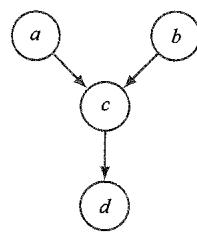  
图11.32 当观测到节点  $c$  的后代节点（即节点  $d$  ）时，用于研究头头相接路径  $a - c - b$  的条件独立性的图模型示例

$$
p (D = 1 \mid G = 1) = 0. 9 \tag {11.50}
$$

$$
p (D = 0 \mid G = 0) = 0. 9 \tag {11.51}
$$

假设该驾驶员告诉我们燃油表显示油箱已空，换句话说， $D = 0$ 。仅根据这一条件，计算油箱为空的概率。同样，在观测到电池没电的情况下，计算相应的概率，注意第二个概率更低。讨论这一结果，并将该结果与图11.32联系起来。

11.15（ $\star \star$ ）用最大似然法训练一个朴素贝叶斯模型，假设条件为式（11.37），并假设每个类-条件密度  $p(\boldsymbol{x}^{(l)}|\mathcal{C}_k)$  都由它们各自独立的参数  $\boldsymbol{w}^{(l)}$  控制。通过最大化与

相应类标签数据相关的似然，然后将先验类概率  $p\left(\mathcal{C}_k\right)$  设置为每个类中训练数据点的比例，证明最大似然求解涉及使用相应的观测数据向量  $x_1^{(l)}, \dots, x_N^{(l)}$  。

11.16（ $\star \star$ ）考虑与图11.29所示的有向图相对应的联合概率分布[式（11.44）]。利用概率的加和法则与乘积法则，验证在  $n = 2,\dots ,N$  时，该联合概率分布满足条件独立性[式（11.45）]。同样，证明形式为式（11.46）的联合分布所描述的二阶马尔可夫模型满足  $n = 3,\dots ,N$  时的条件独立性：

$$
p \left(\boldsymbol {x} _ {n} \mid \boldsymbol {x} _ {1}, \dots , \boldsymbol {x} _ {n - 1}\right) = p \left(\boldsymbol {x} _ {n} \mid \boldsymbol {x} _ {n - 1}, \boldsymbol {x} _ {n - 2}\right) \tag {11.52}
$$

11.17  $(\star)$  通过使用d分离，验证图11.29所示的一阶马尔可夫模型（其中有  $N$  个节点）在  $n = 2,\dots ,N$  时满足条件独立性[式（11.45)]。同样，证明图11.30所示的二阶马尔可夫模型（其中也有  $N$  个节点）在  $n = 3,\dots ,N$  时满足条件独立性[式（11.52)]。  
11.18（ $\star$ ）考虑图11.30所示的二阶马尔可夫过程，通过合并相邻的变量对，证明它可以用新变量的一阶马尔可夫过程来表示。  
11.19（ $\star$ ）通过使用d分离，证明图11.31中的有向图所代表的状态空间模型的观测数据分布  $p(x_1, \dots, x_N)$  不满足任何条件独立性，因此观测变量在任何有限阶都不符合马尔可夫特性。
