# 第12章 Transformer

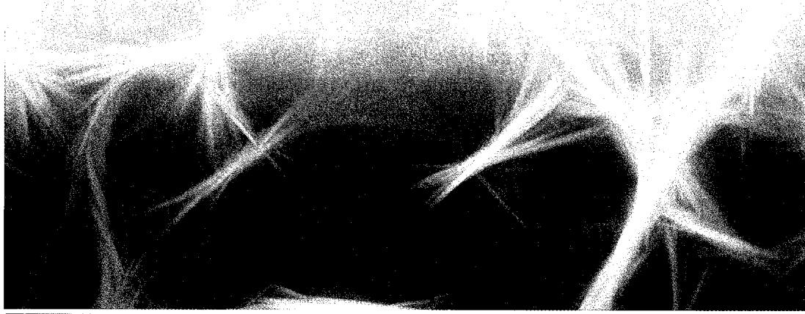

Transformer是深度学习领域最重要的进展之一。基于一种称为注意力（attention）的处理概念，Transformer能使网络对不同的输入赋予不同的权重，而这些加权系数本身又取决于输入值，从而捕捉到与序列数据和其他形式数据相关的强大归纳偏差。

这类模型之所以叫Transformer，是因为它们能将某个表示空间中的一组向量变换成某个新空间中具有相同维度的相应向量的集合。变换旨在使新空间具有更丰富的内部表示，该表示更适合解决下游任务。对于Transformer而言，其输入可以是非结构化的向量集、有序序列或其他更一般的表示形式，从而使Transformer具有广泛的适用性。

Transformer最初是在自然语言处理（Natural Language Processing，NLP）领域引入的，这里的“自然”语言指的是像英语或汉语这样的语言，它大大超越了之前基于递归神经网络（Recurrent Neural Network，RNN）的那些最先进的方法。随后，人们发现Transformer在许多其他领域也取得了优异成果。例如，视觉Transformer在图像

处理任务中的表现往往优于卷积神经网络（Convolutional Neural Network，CNN），而结合文本、图像、音频和视频等多种类型数据的多模态Transformer则是最强大的深度学习模型之一。

Transformer的一大优势在于迁移学习效果显著，所以Transformer可以在大量数据上进行训练，然后通过某种形式的微调，将经过训练的模型应用于众多下游任务。一个大规模模型随后可以进行调整以解决多个不同的任务，它就是所谓的基础模型（foundation model）。此外，Transformer可以使用无标签数据以自监督的方式进行训练，这对语言模型尤其有效，因为Transformer可以利用来自互联网和其他来源的海量文本。缩放假设（scaling hypothesis）认为，只要扩大模型的规模（以可学习参数的数量来衡量），并在相应的大规模数据集上进行训练，即使不改变架构，也能显著提高性能。此外，Transformer特别适用于大规模并行处理硬件，如图形处理单元（Graphics Processing Unit，GPU），从而能在合理的时间内训练出拥有万亿（ $10^{12}$ ）规模参数的超大型神经网络语言模型。这些模型具有非凡的能力，并展现出被描述为通用人工智能早期迹象的涌现特性（Bubeck et al., 2023）。

对于初学者来说，Transformer架构可能看起来很复杂，甚至让人望而却步，因为它涉及多个不同组件的协同工作，其中各种设计构思可能看起来很随意。因此，本章将逐步全面地介绍Transformer背后的所有关键思想，并提供清晰的直观认识以引出各种元素的设计。在介绍完Transformer架构后，我们将重点介绍自然语言处理，并在最后探讨其他应用领域。

## 12.1 注意力

作为Transformer的核心概念，注意力最初是作为机器翻译领域递归神经网络（参见12.2.5小节）的增强版而开发的（Bahdanau, Cho, and Bengio, 2014）。不过，Vaswani et al.（2017）后来证明，如果去除递归结构，转而只专注于注意力机制，就能显著提高性能。如今，在几乎所有应用中，基于注意力的Transformer已完全取代递归神经网络。

虽然注意力具有非常广泛的适用性，但我们仍将以自然语言为例引出注意力的应用。请看如下两个句子。

I swam across the river to get to the other bank.

I walked across the road to get cash from the bank.

“bank”一词在这两个句子中具有不同的含义。不过，这只能通过查看句子中其他词提供的上下文才能发现。我们还看到，在决定“bank”如何翻译时，有些词发挥着尤为重要的作用。在第1个句子中，“swam”和“river”两个词最能说明“bank”指的是河边；而在第2个句子中，“cash”一词最能说明“bank”指的是金融机构。我们发现，为了对“bank”进行适当的翻译，处理这样一个句子的神经网络应该关注（换句话说，更依赖于）句子中其余部分的特定词。注意力的概念如图12.1所示。

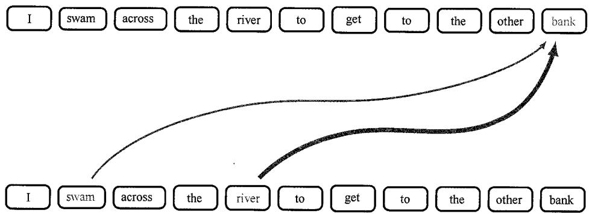  
图12.1“bank”一词的解释受“river”和“swam”影响的注意力示意图，每条线的粗细表示受影响的程度

此外，我们还发现，哪些位置应获得更多注意力取决于输入序列本身：在第1个句子中，重要的是第2和第5个词；而在第2个句子中，重要的是第8个词。在标准神经网络中，不同的输入对输出产生的不同程度的影响，由输入值乘以相应的权重系数来决定。然而，一旦神经网络经过训练，这些权重及相关输入就会固定下来。相比之下，注意力使用的加权因子的值取决于具体的输入数据。在自然语言上经过训练的一个Transformer网络的注意力权重示例见图12.2。

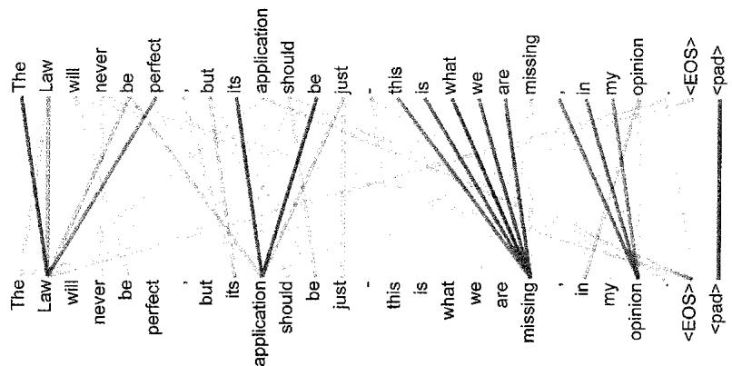  
图12.2 习得的注意力权重示例[经Vaswani等人授权使用]

在讨论自然语言处理时，我们将了解如何使用词嵌入（word embedding）将词映射到嵌入空间中的向量。这些向量可用作后续神经网络处理的输入。这些词嵌入可以捕捉到基本的语义属性，例如，将具有相似含义的词映射到嵌入空间中的邻近位置。这种嵌入的一个特点是，给定的词总是被映射到同一个嵌入向量。

Transformer可以视为一种更丰富的嵌入形式，其中一个给定向量被映射到一个依赖序列中其他向量的位置。因此，上述示例中代表“bank”的向量可以映射到两个不同句子的新嵌入空间中的不同位置。例如，在第1个句子中，变换后的表示可能会使“bank”在嵌入空间中靠近“water”；而在第2个句子中，变换后的表示可能会将“bank”放在靠近“money”的位置。

下面我们以蛋白质建模为例来说明注意力的重要性。我们可以把蛋白质看作由分子单元（称为氨基酸）组成的一维序列。一个蛋白质可能由数百或数千个这样的分子

单元组成，每个分子单元由22种可能性中的一种给定。在活细胞中，蛋白质折叠成三维结构，一维序列中互相远离的氨基酸可以在三维空间中变得接近，从而产生相互作用。Transformer模型允许这些互相远离的氨基酸相互“关注”，从而大大提高了三维结构建模的准确性（Vig et al., 2020）。

### 12.1.1 Transformer处理

Transformer的输入数据是一组  $D$  维向量  $\{x_{n}\}$  ，其中  $n = 1,\dots ,N$  。我们将这些数据向量称为token，一个token可能对应句子中的一个词、图像中的一个小块或者蛋白质中的一个氨基酸。token中的元素  $x_{ni}$  称为特征。稍后我们将了解如何为自然语言数据和图像构建这些token向量。Transformer的一个强大特性是，我们无须设计新的神经

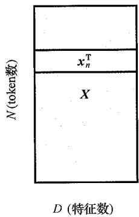  
图12.3  $N\times D$  维的数据矩阵 $X$  的结构，其中第  $_n$  行代表转置后的数据向量  $x_{n}^{\mathrm{T}}$

网络架构来处理不同类型的数据，而只需要将数据变量组合成一组联合 token 即可。

在清楚地了解Transformer的工作原理之前，我们必须准确地使用符号。我们将按照标准惯例，将数据向量组合成一个  $N \times D$  维的矩阵  $\mathbf{X}$ ，其中第  $n$  行是 token 向量  $\mathbf{x}_n^{\mathrm{T}}$ ， $n = 1, \dots, N$ ，如图 12.3 所示。请注意，该矩阵代表一组输入 token，而在大多数应用中，我们需要一个包含多组 token 的数据集，例如每个词都是由一个 token 表示的独立文本段落。Transformer 的基本构件是一个函数，用于将数据矩阵作为输入并创建一个具有相同维度的变换矩阵  $\tilde{\mathbf{X}}$  作为输出。我们可以写下该函数，形式如下。

$$
\tilde {\boldsymbol {X}} = \text {T r a n s f o r m e r L a y e r} [ \boldsymbol {X} ] \tag {12.1}
$$

然后，我们可以连续叠加多个Transformer层来构建能够学习丰富内部表示的深度网络。每个Transformer层都有自己的权重和偏置，可以通过梯度下降法使用适当的损失函数进行学习，这将在本章后续部分（参见12.3节）详细讨论。

Transformer层本身包含两个阶段。在实现注意力机制的第一阶段，将数据矩阵各列中不同token向量的相应特征混合在一起；第二阶段则独立作用于每一行，并对每个token向量中的特征进行变换。下面让我们先来看看注意力机制。

### 12.1.2 注意力系数

假设嵌入空间中有一组输入 token  $x_{1}, \dots, x_{N}$ ，我们希望将它们映射到另一组具有相同数量 token 但位于一个新嵌入空间的  $y_{1}, \dots, y_{N}$ ，这一新的嵌入空间能捕捉到更丰富的语义结构。考虑一个特定的输出向量  $y_{n}$  。  $y_{n}$  的值不仅取决于相应的输入向量  $x_{n}$ ，还取决于集合中所有其他的输入向量。凭借注意力，对于那些在确定  $y_{n}$  的修正表示中发挥特别重要作用的输入向量  $x_{m}$  来说，这种依赖性应该更强。实现这一目标的简单方

法是将每个输出向量  $\mathbf{y}_n$  定义为输入向量  $x_{1},\dots ,x_{N}$  与加权系数  $a_{nm}$  的线性组合：

$$
\mathbf {y} _ {n} = \sum_ {m = 1} ^ {N} a _ {n m} \mathbf {x} _ {m} \tag {12.2}
$$

其中， $a_{nm}$  称为注意力权重（attention weight），又称注意力系数或权重系数。对于对输出  $y_{n}$  影响较小的输入 token，注意力系数应接近于零；而对于对输出  $y_{n}$  影响最大的输入 token，注意力系数应最大。因此，我们限制注意力系数为非负值，以避免出现一个注意力系数变大为正值，而另一个注意力系数补偿变小为负值的情况。我们还希望确保如果一个输出对某一特定输入给予更多注意力，则应该以减少对其他输入的注意力为代价，因此我们限制注意力系数的总和为1。加权系数必须满足以下两个约束条件：

$$
a _ {n m} \geqslant 0 \tag {12.3}
$$

$$
\sum_ {m = 1} ^ {N} a _ {n m} = 1 \tag {12.4}
$$

这意味着每个注意力系数都在  $0 \leqslant a_{nm} \leqslant 1$  的范围内，因此这些注意力系数定义了一个“单位分解”（见习题12.1）。在  $a_{mm} = 1$  且当  $n \neq m$  时  $a_{nm} = 0$  的特殊情况下，由于  $\mathbf{y}_m = \mathbf{x}_m$  ，输入向量在变换后保持不变。一般来说，输出向量  $\mathbf{y}_m$  是输入向量的混合体，其中一些输入向量的权重系数高于其他输入向量。

请注意，我们为每个输出向量  $y_{n}$  设置了一组不同的系数，而约束条件［式（12.3）和式（12.4）］分别适用于每个  $n$  值。这些系数取决于输入数据，后续我们将展示如何计算它们。

### 12.1.3 自注意力

接下来的问题是如何确定权重系数  $a_{nm}$  。在展开详细讨论之前，我们不妨先了解一下信息检索领域的一些术语。以通过线上电影流媒体服务选择观看哪部电影为例。一种方法是将每部电影与一系列属性关联起来，这些属性描述了电影的类型（喜剧、动作片等）、主演姓名、片长等。用户可以通过目录搜索找到自己喜欢看的电影。我们可以将每部电影的属性编码成一个称为键（key）的向量，从而将该过程自动化。相应的电影文件本身叫作值（value）。同样，用户也可以为所需属性提供自己的个人值向量，我们称之为查询（query）。然后，线上电影流媒体服务可以将查询向量与所有键向量作比较，从而找出最佳匹配，并以值文件的形式将相应的电影发送给用户。用户所“关注”的特定电影，其键向量最匹配于用户的查询向量。这可以视为硬注意力（hard attention）的一种形式，其会返回一个单一值向量。对于Transformer，我们可以将其泛化到软注意力（soft attention）中，即使用连续变量来度量查询和键之间的匹配程度，然后使用这些变量来权衡值向量对输出的影响。这也将确保Transformer函数是可微分的，从而可以通过梯度下降法进行训练。

参照信息检索的方法，我们可以将每个输入  $x_{n}$  视为一个值向量，用来创建输出token。我们还可以直接使用  $x_{n}$  作为输入 token  $n$  的键向量。这就好比用电影本身来概括电影的特点。最后，我们可以使用  $x_{m}$  作为输出  $y_{m}$  的查询向量，然后将其与每个键向量作比较。要想知道  $x_{n}$  代表的 token 与  $x_{m}$  代表的 token 有多大的相似度，我们需要计算出这些向量的相似度。度量向量相似度的一种简单方法是求它们的点积  $\mathbf{x}_n^{\mathrm{T}}\mathbf{x}_m$  。为了施加约束条件［式（12.3）和式（12.4）]，使用softmax函数变换点积（参见5.3节）以定义权重系数  $a_{nm}$  ：

$$
a _ {n m} = \frac {\exp \left(\boldsymbol {x} _ {n} ^ {\mathrm {T}} \boldsymbol {x} _ {m}\right)}{\sum_ {m ^ {\prime} = 1} ^ {N} \exp \left(\boldsymbol {x} _ {n} ^ {\mathrm {T}} \boldsymbol {x} _ {m ^ {\prime}}\right)} \tag {12.5}
$$

请注意，在这种情况下，softmax函数不存在概率解释，它只是用来对注意力权重进行适当的归一化。

因此，总的来说，每个输入向量  $\pmb{x}_n$  都是通过形式为式（12.2）的输入向量线性组合而转换为相应的输出向量  $\pmb{y}_n$  的，其中应用于输入向量  $\pmb{x}_m$  的权重系数  $a_{nm}$  由softmax函数给出[式（12.5）]，该softmax函数是根据输入  $n$  的查询向量  $\pmb{x}_n$  与输入  $m$  相关的键向量  $\pmb{x}_m$  之间的点积  $\pmb{x}_n^{\mathrm{T}}\pmb{x}_m$  进行定义的。请注意，如果所有输入向量都是正交的，那么每个输出向量都等于相应的输入向量，从而在  $m = 1,\dots ,N$  的情况下，  $\pmb{y}_m = \pmb{x}_m$  （见习题12.3）。

我们可以使用数据矩阵  $X$  和类似的  $N \times D$  输出矩阵  $Y$ （其行由  $y_{m}$  给出）将式（12.2）用矩阵符号写出：

$$
\boldsymbol {Y} = \operatorname {S o f t m a x} \left[ \boldsymbol {X} \boldsymbol {X} ^ {\mathrm {T}} \right] \boldsymbol {X} \tag {12.6}
$$

其中， $\operatorname{Softmax}[L]$  是一个算子，作用是取矩阵  $L$  中每个元素的指数，然后将每一行独立归一化，使它们的和为1。自此，为了清晰易懂，我们将讨论的重点放在矩阵符号上。

这个过程叫作自注意力（self-attention），因为我们使用相同的序列来确定查询、键和值。在后续内容中，我们还会遇到这种注意力的变体。此外，由于查询向量和键向量之间的相似度度量是由点积给出的，因此这个过程又叫作点积自注意力（dot-product self-attention）。

### 12.1.4 网络参数

目前，由于没有可调整的参数，从输入向量  $\pmb{x}_n$  到输出向量  $\pmb{y}_n$  的变换是固定的，且不具备从数据中学习的能力。此外，token向量  $\pmb{x}_n$  的每个特征值在确定注意力系数时发挥相同的作用，而我们希望网络在确定token相似度时能够灵活地将注意力更多地

集中在某些特征上。通过定义由原始向量（形式如下）的线性变换给出的修正特征向量，我们可以解决这两个问题。

$$
\tilde {\boldsymbol {X}} = \boldsymbol {X} \boldsymbol {U} \tag {12.7}
$$

其中  $U$  是可学习权重参数的  $D \times D$  矩阵，类似于标准神经网络中的“层”，从而得到一个修正后的变换，其形式为

$$
\boldsymbol {Y} = \operatorname {S o f t m a x} \left[ \boldsymbol {X U U} ^ {\mathrm {T}} \boldsymbol {X} ^ {\mathrm {T}} \right] \boldsymbol {X U} \tag {12.8}
$$

虽然这种方法更灵活，但它有一个特性，即如下矩阵是对称的。

$$
\boldsymbol {X} \boldsymbol {U} \boldsymbol {U} ^ {\mathrm {T}} \boldsymbol {X} ^ {\mathrm {T}} \tag {12.9}
$$

而我们希望注意力机制支持明显的不对称。例如，我们可能会认为“斧头”与“工具”的关联性很强，因为每一把斧头都是一个工具；而“工具”与“斧头”的关联性很弱，因为除了斧头，还有许多其他种类的工具。虽然softmax函数意味着得到的注意力权重矩阵本身并不对称，但我们可以通过允许查询和键具有独立参数来创建一个更加灵活的模型。此外，式（12.8）使用相同的参数矩阵  $U$  来定义值向量和注意力系数，这似乎又是一个不受欢迎的限制。

通过定义单独的查询矩阵、键矩阵和值矩阵，并让每个矩阵都有自己独立的线性变换，我们可以克服这些限制：

$$
\boldsymbol {Q} = \boldsymbol {X} \boldsymbol {W} ^ {(q)} \tag {12.10}
$$

$$
\boldsymbol {K} = \boldsymbol {X} \boldsymbol {W} ^ {(k)} \tag {12.11}
$$

$$
\boldsymbol {V} = \boldsymbol {X} \boldsymbol {W} ^ {(v)} \tag {12.12}
$$

其中，权重矩阵  $W^{(q)}$  、  $W^{(k)}$  和  $W^{(\nu)}$  表示在训练最终的Transformer架构时将学习到的参数。矩阵  $W^{(k)}$  的维度为  $D\times D_{k}$  ，其中  $D_{k}$  是键向量的长度。矩阵  $W^{(q)}$  的维度 $D\times D_{q}$  必须与矩阵  $W^{(k)}$  的维度相同，因为只有这样才能在查询向量和键向量之间形成点积。为此，可以设置  $D_{k} = D$  。同样，  $W^{(\nu)}$  是一个维度为  $D\times D_{\nu}$  的矩阵，其中  $D_{\nu}$  是输出向量的长度。如果设置  $D_{\nu} = D$  ，使输出表示和输入表示具有相同的维度，则有助于加入残差连接，我们稍后将对此进行讨论。此外，如果每个层的维度相同，则多个Transformer层可以叠加在一起（参见12.1.7小节）。通过对式（12.6）进行泛化，我们可以得到

$$
\boldsymbol {Y} = \operatorname {S o f t m a x} \left[ \boldsymbol {Q} \boldsymbol {K} ^ {\mathrm {T}} \right] \boldsymbol {V} \tag {12.13}
$$

其中矩阵  $\pmb{Q}\pmb{K}^{\mathrm{T}}$  的维度为  $N\times N$  ，且矩阵  $\mathbf{Y}$  的维度为  $N\times D_{\nu}$  。矩阵  $\pmb{Q}\pmb{K}^{\mathrm{T}}$  的计算如图12.4所示，而矩阵  $\mathbf{Y}$  的计算如图12.5所示。

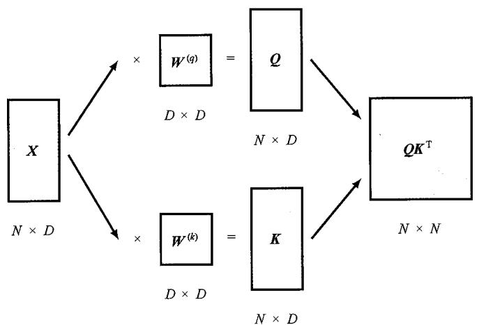  
图12.4 决定Transformer中注意力系数的矩阵  $QK^{\mathrm{T}}$  的计算示意图。分别通过式（12.10）和式（12.11）对输入  $X$  进行变换，得到查询矩阵  $Q$  和键矩阵  $K$ ，然后将它们相乘

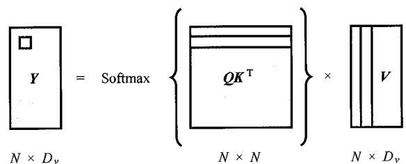  
图12.5 在给定查询矩阵  $Q$  、键矩阵  $\kappa$  和值矩阵  $V$  的情况下计算注意力层输出的示意图。输出矩阵  $Y$  中突出显示位置的条目分别由Softmax  $[\pmb{Q}\pmb{K}^{\mathrm{T}}]$  和  $V$  矩阵中突出显示位置的行和列的点积得出

实际上，我们还可以在这些线性变换中加入偏置参数。不过，偏置参数也可以包含在权重矩阵中，就像我们对标准神经网络所做的那样（参见6.2.1小节），方法是在数据矩阵  $X$  中增加一列1，然后在权重矩阵中增加额外一行参数来表示偏置。自此，我们将把偏置参数视为隐参数，以免混淆符号。

与传统的神经网络相比，信号路径的激活值之间存在乘法关系。标准的神经网络会将激活值乘以固定权重，而这里的激活值则被乘以依赖数据的注意力系数。这意味着如果选择特定的输入向量，其中一个注意力系数接近于零，那么产生的信号路径将忽略相应的输入信号，因此不会对网络输出产生任何影响。相比之下，如果一个标准的神经网络学会了忽略某个特定的输入或隐藏单元变量，那么该神经网络就会对所有的输入向量都这样做。

### 12.1.5 缩放自注意力

我们还可以对自注意力层进行最后一次改进。回想一下，当输入量较大时，softmax函数的梯度会呈指数减小，就像tanh函数或逻辑斯谛sigmoid函数一样。为了避免出现这种情况，我们可以在应用softmax函数之前重新缩放查询向量和键向量的乘积。为了得到合适的缩放结果，请注意，如果查询向量和键向量的元素都是均值为0且方差为单位方差的独立随机数，则点积的方差就是  $D_{k}$  （见习题12.4）。因此，我们

使用  $D_{k}$  的平方根所给出的标准差对Softmax的参数进行归一化处理，从而注意力层的输出形式为

$$
\boldsymbol {Y} = \text {A t t e n t i o n} (\boldsymbol {Q}, \boldsymbol {K}, \boldsymbol {V}) \equiv \operatorname {S o f t m a x} \left[ \frac {\boldsymbol {Q} \boldsymbol {K} ^ {\mathrm {T}}}{\sqrt {D _ {k}}} \right] \boldsymbol {V} \tag {12.14}
$$

这就是所谓的缩放点积自注意力（scaled dot-product self-attention），也是自注意力神经网络层的最终形式。这一层的结构如图12.6所示，算法过程见算法12.1。

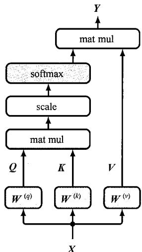  
图12.6缩放点积自注意力神经网络层中的信息流。此处“matmul”表示矩阵乘法，而“scale”指的是使用 $\sqrt{D_k}$  对Softmax的参数进行归一化处理。该结构构成了一个单一注意力“头”

算法12.1：缩放点积自注意力

Input: Set of tokens  $X\in \mathbb{R}^{N\times D}:\{x_1,\dots ,x_N\}$  Weight matrices  $\{\pmb {W}^{(q)},\pmb{W}^{(k)}\} \in \mathbb{R}^{D\times D_k}$  and  $\pmb {W}^{(v)}\in \mathbb{R}^{D\times D_v}$

Output: Attention  $(Q, K, V) \in \mathbb{R}^{N \times D}: \{y_1, \dots, y_N\}$

$Q = XW^{(q)} / /$  计算查询矩阵  $Q\in \mathbb{R}^{N\times D_k}$

$\pmb{K} = \pmb{X}\pmb{W}^{(k)} / / \text{计算键矩阵} K\in \mathbb{R}^{N\times D_k}$

$\pmb{V} = \pmb{X}\pmb{W}^{(v)}$  // 计算值矩阵  $V\in \mathbb{R}^{N\times D}$

$\mathbf{return}$  Attentio  $(Q,K,V) = \mathrm{Softmax}\left[\frac{QK^{\mathrm{T}}}{\sqrt{D_k}}\right]V$

### 12.1.6 多头注意力

注意力层允许输出向量关注输入向量的依赖数据模式，称作注意力头（attention head）。然而，可能同时存在多种相关的注意力模式。例如，在自然语言中，有些注意力模式可能与时态有关，而另一些注意力模式则可能与词汇有关。使用单一注意力头会导致这些效应的平均化。对此，我们可以并行使用多个注意力头。这些注意力头由结构相同的单个注意力头的副本组成，具有独立的可学习参数，用于控制查询矩阵、

键矩阵和值矩阵的计算。这类似于在卷积网络的每一层中使用多个不同的过滤器。

假设我们有  $H$  个注意力头，以  $h = 1, \dots, H$  进行编号，形式为

$$
\boldsymbol {H} _ {h} = \text {A t t e n t i o n} \left(\boldsymbol {Q} _ {h}, \boldsymbol {K} _ {h}, \boldsymbol {V} _ {h}\right) \tag {12.15}
$$

其中Attention  $(\cdot ,\cdot ,\cdot)$  由式（12.14）给出，使用如下方法为每个注意力头定义单独的查询矩阵、键矩阵和值矩阵：

$$
\boldsymbol {Q} _ {h} = \boldsymbol {X} \boldsymbol {W} _ {h} ^ {(q)} \tag {12.16}
$$

$$
\boldsymbol {K} _ {h} = \boldsymbol {X} \boldsymbol {W} _ {h} ^ {(k)} \tag {12.17}
$$

$$
V _ {h} = X W _ {h} ^ {(v)} \tag {12.18}
$$

首先将各个注意力头合并成一个单一矩阵，然后使用矩阵  $\pmb{W}^{(o)}$  对结果进行线性变换，从而得到一个合并输出，形式为

$$
\boldsymbol {Y} (\boldsymbol {X}) = \operatorname {C o n c a t} \left[ \boldsymbol {H} _ {1}, \dots , \boldsymbol {H} _ {H} \right] \boldsymbol {W} ^ {(o)} \tag {12.19}
$$

多头注意力网络的结构如图12.7所示，算法过程见算法12.2。

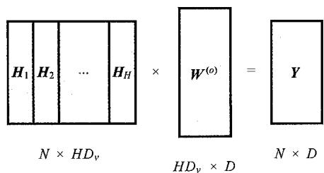  
图12.7 多头注意力网络的结构。每个注意力头都包含图12.6所示的结构，并有自己的键、查询和值参数。将各个注意力头的输出合并起来，然后线性投射回输入数据维度

算法12.2：多头注意力

```latex
Input: Set of tokens  $X\in \mathbb{R}^{N\times D}$  ..  $\{\pmb {x}_1,\dots ,\pmb {x}_N\}$  Query weight matrices  $\{W_1^{(q)},\dots ,W_H^{(q)}\} \in \mathbb{R}^{D\times D}$  Key weight matrices  $\{W_1^{(k)},\dots ,W_H^{(k)}\} \in \mathbb{R}^{D\times D}$  Value weight matrices  $\{W_1^{(v)},\dots ,W_H^{(v)}\} \in \mathbb{R}^{D\times D_v}$  Output weight matrix  $W^{(o)}\in \mathbb{R}^{HD_v\times D}$
```

```latex
Output:  $\mathbf{Y} \in \mathbb{R}^{N \times D} : \{\pmb{y}_1, \dots, \pmb{y}_N\}$
```

//为每个注意力头计算自注意力（参见算法12.1）

```latex
for  $h = 1,\dots ,H$  do  $\begin{array}{rl} & Q_{h} = XW_{h}^{(q)},\quad K_{h} = XW_{h}^{(k)},\quad V_{h} = XW_{h}^{(v)}\\ & H_{h} = \mathrm{Attention}\left(Q_{h},K_{h},V_{h}\right) / / H_{h}\in \mathbb{R}^{N\times D_{v}} \end{array}$
```

```latex
end for  
 $\pmb{H} = \mathrm{Concat}\left[\pmb{H}_{1}, \dots, \pmb{H}_{N}\right] //$  合并注意力头  
return  $Y(X) = HW^{(o)}$
```

每个矩阵  $H_{h}$  的维度为  $N\times D_{\nu}$ ，因此合并矩阵的维度为  $N\times HD_{\nu}$ 。在使用维度为 $HD_{\nu}\times D$  的线性矩阵  $\pmb{W}^{(o)}$  进行变换后，最终得到维度为  $N\times D$  的输出矩阵  $\pmb{Y}$ ，它与原始输入矩阵  $\pmb{X}$  的维度相同。矩阵  $\pmb{W}^{(o)}$  的元素是在训练阶段与查询矩阵、键矩阵和值矩阵一起学习的。通常情况下，  $D_{\nu}$  选择为与  $D / H$  相等，从而使得到的合并矩阵的维度为  $N\times D$ 。图12.8展示了多头注意力层的信息流。

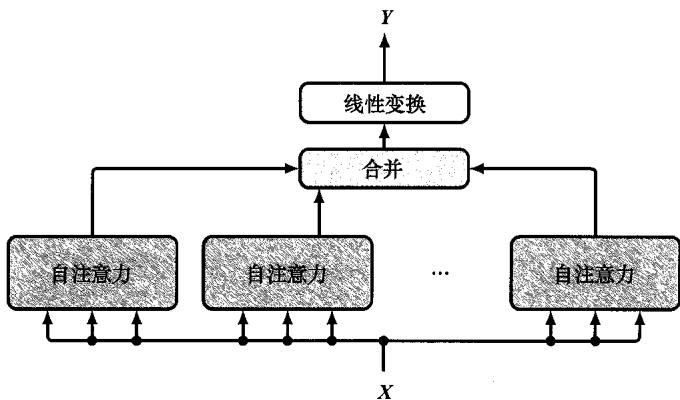  
图12.8 多头注意力层的信息流

请注意，前文给出的多头注意力表述与研究文献中使用的表述相同，我们在每个注意力头的  $W^{(\nu)}$  矩阵与输出矩阵  $W^{(o)}$  的连续乘法中包含了一些冗余。在消除这些冗余后，多头自注意力层就可以写成每个注意力头的贡献之和（见习题12.5）。

### 12.1.7 Transformer层

多头自注意力构成了Transformer网络的核心架构元素。我们知道，神经网络从深度结构中获益匪浅，因此我们希望将多个自注意力层堆叠在一起。为了提高训练效率，我们可以引入绕过多头结构的残差连接（参见9.5节）。为此，我们要求输出维度与输入维度相同（参见7.4.3小节）。然后进行层归一化（layer normalization）（Ba, Kiros, and Hinton, 2016），从而提高训练效率。由此产生的变换可以写成

$$
\boldsymbol {Z} = \text {L a y e r N o r m} [ \boldsymbol {Y} (\boldsymbol {X}) + \boldsymbol {X} ] \tag {12.20}
$$

其中  $Y$  由式（12.19）定义。有时，层归一化会被预归一化取代，即层归一化在多头注意力之前而不是之后进行，因为这可以带来更有效的优化。在这种情况下，我们得出

$$
\pmb {Z} = \pmb {Y} \left(\pmb {X} ^ {\prime}\right) + \pmb {X}, \text {其 中} \pmb {X} ^ {\prime} = \mathrm {L a y e r N o r m} \left[ \pmb {X} \right] \tag {12.21}
$$

在所有情况下， $Z$  的维度都与输入矩阵  $X$  的维度相同。

我们已经看到，注意力机制创建了值向量的线性组合，然后用以产生输出向量。此外，这些值向量是输入向量的线性函数，因此我们可以看到，注意力层的输出受限

于输入的线性组合。非线性通过注意力权重引入，因此输出将通过softmax函数非线性地依赖于输入，但输出向量仍然受限于输入向量所跨的子空间，这限制了注意力

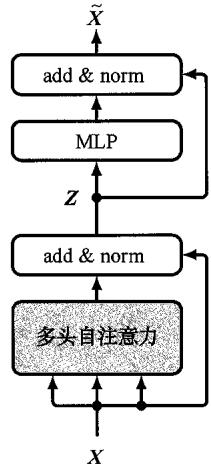  
图12.9 Transformer层的整体架构。此处“MLP”代表多层感知机，“add & norm”则代表残差连接和随后的层归一化

层的表达能力。我们可以使用一个标准的非线性神经网络（有  $D$  个输入和  $D$  个输出）对每一层的输出进行后处理，用  $\mathrm{MLP}[\cdot]$  表示“多层感知机”，从而提高Transformer的灵活性。例如，这可能包括一个具有ReLU隐藏单元的两层全连接网络。当我们这样做时，需要保持Transformer处理不同长度序列的能力。为此，我们需要对每个输出向量（与  $Z$  的行相对应）应用相同的共享网络。同样，也可以通过使用残差连接来改进该神经网络层。它还包括层归一化，从而Transformer层的最终输出形式为

$$
\tilde {\boldsymbol {X}} = \text {L a y e r N o r m} [ \mathrm {M L P} [ \boldsymbol {Z} ] + \boldsymbol {Z} ] \tag {12.22}
$$

这就产生了Transformer层的整体架构，如图12.9所示，算法过程见算法12.3。同样，我们也可以使用预归一化，在这种情况下，Transformer层的最终输出形式为

$$
\tilde {\mathbf {X}} = \mathrm {M L P} [ \mathbf {Z} ^ {\prime} ] + \mathbf {Z}, \text {其 中} \mathbf {Z} ^ {\prime} = \text {L a y e r N o r m} [ \mathbf {Z} ] \tag {12.23}
$$

算法12.3: Transformer层  
```txt
Input: Set of tokens  $X\in \mathbb{R}^{N\times D}$  :  $\{\pmb {x}_1,\dots ,\pmb {x}_N\}$  Multi-head self-attention layer parameters Feed-forward network parameters   
Output:  $\widetilde{X}\in \mathbb{R}^{N\times D}$  ..  $\{\widetilde{x}_1,\dots ,\widetilde{x}_N\}$ $Z =$  LayerNorm  $[Y(X) + X]$  //  $Y(X)$  由算法12.2给出   
 $\widetilde{X} =$  LayerNorm [MLP  $[Z] + Z]$  //共享网络   
return  $\widetilde{X}$
```

在典型的Transformer模型中，有多个这样的层叠加在一起。虽然不同层之间不共享权重和偏置，但各层通常具有相同的结构。

### 12.1.8 计算复杂性

到目前为止我们所讨论的注意力层包含一个向量集（其中有  $N$  个向量，每个向量的长度为  $D$ ），我们将它映射到了另一个具有相同维度的向量集（其中也有  $N$  个向量）。因此，输入和输出的总维度均为  $ND$ 。如果我们使用标准的全连接神经网络将输入值映射到输出值，就会有  $\mathcal{O}\left(N^{2}D^{2}\right)$  个独立参数。同样，计算通过这样一个网络进行一次前向传递的成本也是  $\mathcal{O}\left(N^{2}D^{2}\right)$ 。

在注意力层中，矩阵  $W^{(q)}$  、  $\pmb{W}^{(k)}$  和  $\pmb{W}^{(\nu)}$  在输入token之间共享，因此独立参数的数量为  $\mathcal{O}\big(D^2\big)$  ，这里假设  $D_{k}\approx D_{\nu}\approx D$  。由于有  $N$  个输入token，在自注意力层中计算点积的步骤数为  $\mathcal{O}\big(N^2 D\big)$  。我们可以把自注意力层看作一个稀疏矩阵，其中的参数在矩阵的特定块之间共享。随后的神经网络层（它有  $D$  个输入和  $D$  个输出）的成本为  $\mathcal{O}\big(D^2\big)$  。由于它在token之间共享，其复杂度与  $N$  成线性关系，因此这一层的总成本为  $\mathcal{O}\big(ND^2\big)$  。根据  $N$  和  $D$  的相对大小，Transformer层或多层感知机层有可能支配计算成本。与全连接网络相比，Transformer层的计算效率更高。Transformer架构的许多变体已被提出（Lin et al., 2021; Phuong and Hutter, 2022），包括旨在提高效率的修正版（Tay et al., 2020）。

### 12.1.9 位置编码

在Transformer架构中，矩阵  $W_h^{(q)}$  、  $W_h^{(k)}$  和  $W_h^{(\nu)}$  由输入的所有 token 共用。同样，紧随其后的神经网络（前馈神经网络）也由输入的所有 token 共用。因此，Transformer具有这样的特性，即对输入 token（也就是  $X$  的行）进行排序会导致输出矩阵  $\tilde{X}$  的行也被排序。换句话说，Transformer在输入排列方面是等变化的（equivariant）。网络架构中的参数共享有利于Transformer的大规模并行处理，也使网络能够像学习短距离依赖关系一样有效地学习远距离依赖关系。然而，当我们考虑序列数据（如自然语言中的词）时，不依赖 token 顺序就成了一个主要的限制，因为 Transformer 学习到的表示法将与输入 token 的顺序无关。句子“The food was bad, not good at all”和“The food was good, not bad at all”包含相同的 token，但由于 token 的排序不同，这两个句子的含义也截然不同。显然，token 顺序对于包括自然语言处理在内的大多数顺序处理任务至关重要，因此我们需要找到一种方法来将有关 token 顺序的信息注入网络。

由于想要保留精心构建的注意力层的强大特性，因此我们希望在数据中对 token 顺序进行编码，而不是在网络架构中表示 token 顺序。为此，我们将构建一个与每个输入位置  $n$  相关的位置编码向量  $\mathbf{r}_n$ ，然后将其与相关输入 token 的嵌入向量  $\mathbf{x}_n$  结合起来。一种显而易见的方法是将这些向量合并起来，但这会增加输入空间的维度，进而增加所有后续注意力空间的维度，从而显著增加计算成本。相反，我们可以简单地将位置向量加到 token 向量上，从而得出

$$
\tilde {\boldsymbol {x}} _ {n} = \boldsymbol {x} _ {n} + \boldsymbol {r} _ {n} \tag {12.24}
$$

这就要求位置编码向量的维度与 token 嵌入向量的维度相同。

初看起来，在token向量上添加位置信息会破坏输入向量，使得网络的任务变得更加难以完成。不过，从两个随机选择的不相关向量在高维空间中几乎是正交的这一现象中，我们可以了解到这一方法为什么能够很好地发挥作用，这表明网络能够相对独立地处理token的身份信息和位置信息。另外，请注意，由于Transformer中的层与层之间都有残差连接，因此位置信息从一层转到下一层的过程中不会丢失。此外，Transformer中的线性处理层能使合并表示法与加法表示法具有相似的特性。

接下来的任务是构建嵌入向量  $\mathbf{r}_n$  。一种简单的方法是为每个位置关联一个整数。但这样做的问题是，数值的大小会无限制地增加，因此可能会严重破坏嵌入向量。此外，对于比训练时所用输入序列更长的新输入序列，它可能无法很好地泛化，因为这些输入序列涉及的编码值将超出训练时所用编码值的范围。我们也可以为序列中的每个 token 分配一个介于 0 和 1 之间的数字，从而保持表示法的有界性。然而，这种表示法对于特定位置并不是唯一的，因为它取决于整个序列的长度。

理想的位置编码应该为每个位置提供唯一的表示，其应该是有界的，能泛化为较长的序列，且应该有一致的方法来表示任意两个输入向量之间的步数，而不管它们的绝对位置如何，因为 token 的相对位置往往比绝对位置更重要。

位置编码的方法有很多（Dufter, Schmitt, and Schütze, 2021）。在此，我们介绍一种由 Vaswani et al.（2017）引入的基于正弦函数的技术。对于给定的位置  $n$ ，相关位置的编码向量具有组件  $r_{ni}$ ，其计算公式为

$$
r _ {n i} = \left\{ \begin{array}{l l} \sin \left(\frac {n}{L ^ {i / D}}\right), & \text {当} i \text {是 偶 数 时} \\ \cos \left(\frac {n}{L ^ {(i - 1) / D}}\right), & \text {当} i \text {是 奇 数 时} \end{array} \right. \tag {12.25}
$$

如图12.10(a)所示，嵌入向量  $r_n$  的元素由一系列波长逐渐增大的正弦和余弦函数给出。

这种编码的特点是，向量  $r_n$  的元素都位于  $(-1, 1)$  范围内。这不禁让人联想到二进制数的表示方法，最低阶位高频率地交替出现，而随后的位则以逐渐降低的频率交替出现：

<table><tr><td>1:</td><td>0</td><td>0</td><td>0</td><td>1</td></tr><tr><td>2:</td><td>0</td><td>1</td><td>0</td><td></td></tr><tr><td>3:</td><td>0</td><td>1</td><td>1</td><td></td></tr><tr><td>4:</td><td>0</td><td>0</td><td>0</td><td></td></tr><tr><td>5:</td><td>0</td><td>0</td><td>1</td><td></td></tr><tr><td>6:</td><td>0</td><td>1</td><td>0</td><td></td></tr><tr><td>7:</td><td>0</td><td>1</td><td>1</td><td></td></tr><tr><td>8:</td><td>1</td><td>0</td><td>0</td><td></td></tr><tr><td>9:</td><td>1</td><td>0</td><td>1</td><td></td></tr></table>

不过，对于式（12.25）来说，向量元素是连续变量而非二进制变量。位置编码向量的热图说明见图 12.10(b)。

式（12.25）给出的正弦表示法有一个很好的特性，即对于任何固定偏移  $k$  ，位置 $n + k$  处的编码可以表示为位置  $n$  处编码的线性组合，其中系数不取决于绝对位置，而只取决于  $k$  值（见习题12.10）。因此，网络应该能够学会关注相对位置。请注意，这一特性要求编码同时使用正弦和余弦函数。

另一种常用的位置表示方法是使用习得的位置编码。这是通过在每个 token 位置设置一个权重向量来实现的，该权重向量可在训练过程中与模型的其他参数共同学习，

从而避免使用人工表示法。由于 token位置之间不共享参数，因此token在排列时不再是不变的，而这正是位置编码的目的。不过，这种方法并不符合前述对较长的输入序列进行泛化的标准，因为训练过程中没有出现过的位置编码未经训练。因此，当输入长度在训练和推理过程中都相对固定时，这种方法通常最适用。

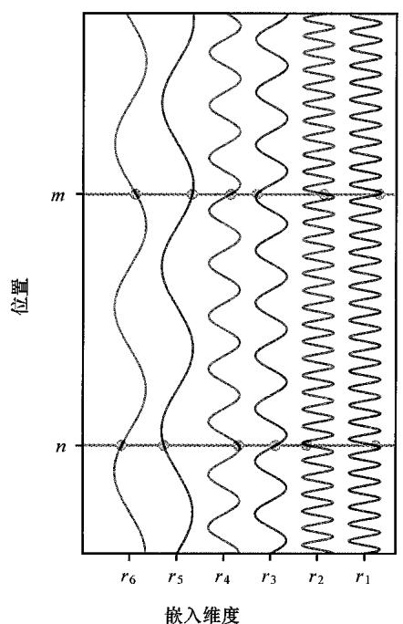  
(a)  
图12.10 由式（12.25）定义并用于构建位置编码向量的函数示意图。(a) 图中横轴表示嵌入向量  $r_n$  的不同组件，纵轴表示序列中的位置。位置  $n$  和位置  $m$  的向量元素值均由相应的正弦和余弦曲线与水平灰线的交点表示。(b) 由式（12.25）定义且对于前  $N = 200$  个位置， $L = 30$  的位置编码向量的热图说明，其中维度为  $D = 100$

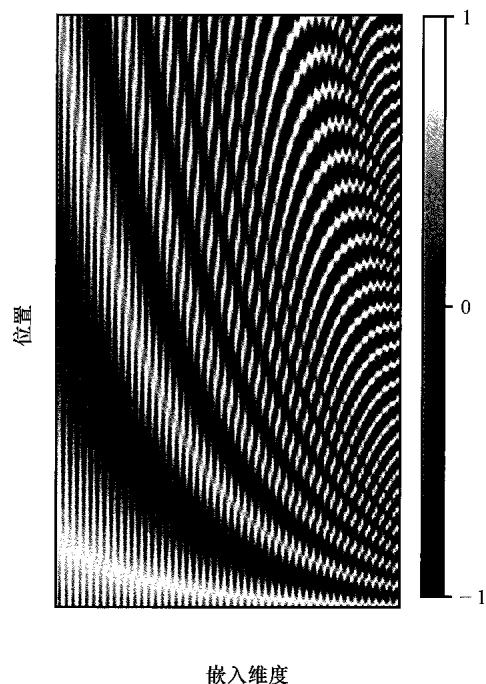  
(b)

## 12.2 自然语言

在研究了Transformer架构之后，我们将探讨如何用它来处理由词、句子和段落组成的语言数据。尽管Transformer模型最初就是针对这种模式开发的，但事实证明，Transformer模型是一类非常通用的模型，并已成为大多数输入数据类型的最先进模型。本章稍后将探讨Transformer在其他领域的应用（参见12.4节）。

包括英语在内的许多语言都由一系列词（用空格分隔）和标点符号组成，语言数据是序列数据的典型代表。我们目前将重点关注词，稍后再讨论标点符号。

我们面临的第一个挑战是将词转换成适合用作深度神经网络输入的数字表示。一种简单的方法是定义一个固定的字典，然后引入长度与这个字典大小相等的向量以及每个词的“独热”表示，其中字典中的第  $k$  个词用一个向量编码，该向量在第  $k$  个位置为1，在其他位置为0。例如，如果“aardwolf”是这个字典中的第三个词，那么它

的向量表示就是  $(0,0,1,0,\dots ,0)$

独热编码有一个明显的问题，即现实中的字典可能有几十万个条目，从而导致向量的维度非常高。此外，独热编码无法捕捉词与词之间可能存在的任何相似性或关系。这两个问题都可以通过将词映射到一个低维空间来解决，这个过程叫作词嵌入（word embedding）。在这个过程中，每个词都可以表示为一个通常只有几百个维度的空间中的密集向量。

### 12.2.1 词嵌入

嵌入过程可以用一个大小为  $D \times K$  的矩阵  $\pmb{E}$  来定义，其中  $D$  是嵌入空间的维度， $K$  是字典的维度。对于每个独热编码的输入向量  $\pmb{x}_n$ ，我们可以用下式计算出相应的嵌入向量：

$$
\boldsymbol {v} _ {n} = \boldsymbol {E} \boldsymbol {x} _ {n} \tag {12.26}
$$

由于  $x_{n}$  具有独热编码，因此向量  $\pmb{\nu}_{n}$  可以由矩阵  $\pmb{E}$  的相应列给出。

我们可以使用很多方法来从文本语料库（即大型数据集）中学习矩阵  $E$  。在此，我们将研究一种名为word2vec的流行技术（Mikolov et al., 2013），它可以视为一种简单的双层神经网络。构建一个训练集，其中每个样本都是通过考虑文本中  $M$  个相邻词的“窗口”获得的，一个典型的值可能是  $M = 5$  。样本被认为是独立的，误差函数则定义为每个样本的误差函数之和。这种方法有两个模型：连续词袋模型和“跳字模型”。在连续词袋（continuous bag of words）模型中，网络训练的目标变量是中间词，其余的上下文（context）词构成输入，因此网络被训练用于“填空”。而“跳字（skip-gram）模型”将输入和输出互换了，也就是将中心词作为输入，而将目标值作为上下文词。这两个模型如图12.11所示。

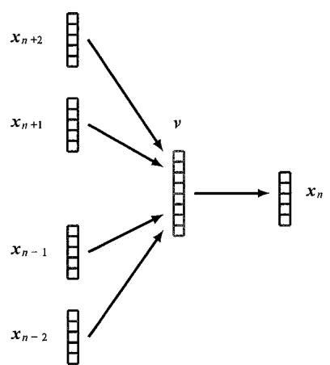  
(a)

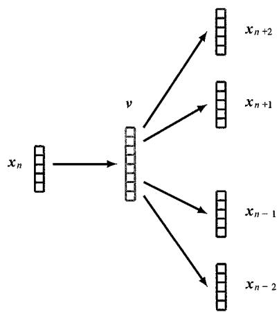  
(b)  
图12.11 用于学习词嵌入的双层神经网络：(a)连续词袋模型；(b)“跳字模型”

这种训练过程可以视为一种自监督（self-supervised）学习，因为数据仅由大规模无标签文本语料组成，可从中随机抽取许多词序列的小窗口。通过“遮掩”那些网络

试图预测其值的词，便可从文本本身获取标签。

模型训练完成后，嵌入矩阵  $E$  在连续词袋模型中由第二层权重矩阵的转置矩阵给出，而在“跳字模型”中则由第一层权重矩阵给出。在嵌入空间中，语义相关的词会被映射到附近的位置。这在意料之中，因为与不相关的词相比，相关的词更有可能与相似的上下文词一起出现。例如，“城市”和“首都”两个词作为“巴黎”或“伦敦”等目标词的上下文词出现的频率可能较高，而作为“橙色”或“多项式”的上下文词出现的频率较低。如果将“巴黎”和“伦敦”映射到附近的嵌入向量上，网络就能更容易地预测缺失词的概率。

事实证明，习得的嵌入空间往往比相关词的邻近性具有更丰富的语义结构，这使得进行简单的向量运算成为可能。例如，“巴黎之于法国就像罗马之于意大利”这一概念可以通过对嵌入向量的运算来表达。如果我们用  $\nu(\text{word})$  来表示“词”的嵌入向量，则可以得到

$$
\boldsymbol {v} (\text {P a r i s}) - \boldsymbol {v} (\text {F r a n c e}) + \boldsymbol {v} (\text {I t a l y}) \approx \boldsymbol {v} (\text {R o m e}) \tag {12.27}
$$

词嵌入本身最初是作为自然语言处理工具开发的。如今，它们更多地用作深度神经网络的预处理步骤。在这方面，它们可以被视为深度神经网络的第一层。它们可以通过一些标准的预训练嵌入矩阵来固定，也可以作为一个自适应层来处理，作为系统整体端到端训练的一部分来学习。在后一种情况下，可以使用随机权值或标准嵌入矩阵对嵌入层进行初始化。

### 12.2.2 分词

使用固定字典的一个问题是，我们无法处理字典中没有的词或拼写错误的词。另外，这种方法不考虑标点符号或其他字符序列，如计算机代码。解决这些问题的另一种方法是在字符层面进行操作而不是使用词来操作，这样我们的字典就包含了大小写字母、数字、标点符号以及其他符号（如空格和制表符等）。但这种方法的缺点是，它忽略了语言中语义上重要的词结构，因此后续的神经网络必须学会从基本字符中重新组合词。此外，对于给定的文本，还需要执行更多的连续步骤，从而增加了处理序列的计算成本。

我们可以通过使用预处理步骤将一串词和标点符号转换成一串 token，从而将字符级和词级表示的优势结合起来。token通常是小的字符组，其中可能包括完整的常用词、较长词的碎片以及可以组合成非常用词的单个字符（Schuster and Nakajima, 2012）。通过进行这种分词，系统便能处理其他类型的序列，如计算机代码，甚至处理其他模式，如图像（参见12.4.1小节）。这也意味着同一个词的变体可以有相关的表示。例如，“cook”“cooks”“cooked”“cooking”和“cooker”都是相关的并共享共同元素“cook”，而“cook”本身也可以表示为 token。

有许多方法可以实现分词。例如，用于数据压缩的字节对编码（byte pair encoding）技术可以通过连接字符而非字节来适应文本分词（Sennrich, Haddow, and

Birch, 2015)。首先用单个字符列表对 token 列表进行初始化。然后搜索文本中出现频率最高的相邻 token 对，并用新 token 替换这些 token。为确保词不被连接，如果第二个 token 以空格开头，则新 token 不是由两个 token 组成的。反复进行上述过程，如图 12.12 所示。

Peter Piper picked a peck of pickled peppers  
Peter Piper picked a peck of pickled peppers  
Peter Piper picked a peck of pickled peppers  
Peter Piper picked a peck of pickled peppers  
Peter Piper picked a peck of pickled peppers  
Peter Piper picked a peck of pickled peppers

图12.12 通过类比字节对编码，说明自然语言token化的过程。此例中，出现频率最高的一对字符是“pe”，共出现4次，因此这对字符组成一个新的token，并取代了所有出现的“pe”。请注意，“Pe”不包括在内，因为大写“P”和小写“p”是两个不同的字符。出现频率第二高的一对字符是“ck”，共出现3次。接着是“pi”“ed”和“per”，它们都出现了两次，以此类推

最初，token数量等于字符数量，因而相对较少。随着token的形成，token的总数也会增加，如果持续时间足够长，token最终将与文本中的词集相对应。作为字符级和词级表示之间的折中方案，token的总数通常是预先确定的。当达到这个数量时，算法就会停止。

在将深度学习运用到自然语言的实际操作中时，输入文本通常首先映射为 token化的表示。不过，在本章的其余部分，我们将使用词级表示法，因为这样更容易说明和引出关键概念。

### 12.2.3 词袋模型

现在，我们要对自然语言中的词（或 token）等有序向量序列的联合分布  $p(x_1, \dots, x_N)$  进行建模。最简单的方法是假定词是从同一分布中独立抽取的，因此联合分布被全分解，形式为

$$
p \left(\boldsymbol {x} _ {1}, \dots , \boldsymbol {x} _ {N}\right) = \prod_ {n = 1} ^ {N} p \left(\boldsymbol {x} _ {n}\right) \tag {12.28}
$$

这可以表示为一个概率图模型，其中节点是孤立的，相互之间无连接。

变量之间共享分布  $p(x)$ ，且在不失通用性的前提下，共享分布  $p(x)$  可以用一个简单的表格来表示，该表格列出了  $x$  的每种可能状态（对应于词或 token 字典）出现的概率。只需要将这些概率中的每个概率设置为该词在训练集中出现的次数，就能得到该模型的最大似然解。这就是所谓的词袋（bag-of-words）模型，因为它完全忽略了词的排序。

我们可以使用词袋法构建一个简单的文本分类器。例如，在情感分析中，可以将一段代表餐厅评论的文本分为正面评论和负面评论。朴素贝叶斯分类器假定每个类  $C_k$

中的词是独立的，但每个类的词分布不同，因此

$$
p \left(\boldsymbol {x} _ {1}, \dots , \boldsymbol {x} _ {N} \mid \mathcal {C} _ {k}\right) = \prod_ {n = 1} ^ {N} p \left(\boldsymbol {x} _ {n} \mid \mathcal {C} _ {k}\right) \tag {12.29}
$$

在给定先验类概率  $p\left(\mathcal{C}_k\right)$  的前提下，新序列的后验类概率为

$$
p \left(\mathcal {C} _ {k} \mid x _ {1}, \dots , x _ {N}\right) \propto p \left(\mathcal {C} _ {k}\right) \prod_ {n = 1} ^ {N} p \left(x _ {n} \mid \mathcal {C} _ {k}\right) \tag {12.30}
$$

类-条件密度  $p(\boldsymbol{x}|\mathcal{C}_k)$  和先验概率  $p\big(\mathcal{C}_k\big)$  都可以使用训练集的频率进行估计。对于一个新的序列，将表格条目相乘以得到所需要的后验概率。请注意，如果测试集中出现一个训练集中没有的词，那么相应的概率估计值将为零，因此通常会在训练后对这些估计值进行“平滑”，即在所有条目中均匀地重新分配一个较小的概率水平，以避免出现零值。

### 12.2.4 自回归模型

词袋模型的一个主要局限在于完全忽略了词序。为了解决这个问题，我们可以采用自回归方法。在不失通用性的前提下，我们可以将词序列的分布分解为条件分布的乘积，其形式为

$$
p \left(\boldsymbol {x} _ {1}, \dots , \boldsymbol {x} _ {N}\right) = \prod_ {n = 1} ^ {N} p \left(\boldsymbol {x} _ {n} \mid \boldsymbol {x} _ {1}, \dots , \boldsymbol {x} _ {n - 1}\right) \tag {12.31}
$$

这可以用一个概率图模型（参见图11.17）来表示，其中序列里的每个节点都会从各自的前一个节点接收一个连接。我们可以用一个表格来表示式（12.31）右侧的每一项，该表格中的条目也是通过训练集的简单频率计数估算出来的。然而，这些表格的大小会随着序列长度的增加呈指数增长（见习题12.12），因此这种方法的成本会高得令人望而却步。

我们可以假设式（12.31）右侧的每个条件分布都与之前的所有观测值无关，但最近的  $L$  个词除外，从而大大简化模型。例如，如果  $L = 2$  ，那么在该模型下，一组  $N$  个观测值的联合分布为

$$
p \left(\boldsymbol {x} _ {1}, \dots , \boldsymbol {x} _ {N}\right) = p \left(\boldsymbol {x} _ {1}\right) p \left(\boldsymbol {x} _ {2} \mid \boldsymbol {x} _ {1}\right) \prod_ {n = 3} ^ {N} p \left(\boldsymbol {x} _ {n} \mid \boldsymbol {x} _ {n - 1}, \boldsymbol {x} _ {n - 2}\right) \tag {12.32}
$$

在相应的图模型中，每个节点都有前两个节点的连接（参见图11.30）。此处，我们假设所有变量共享条件分布  $p\left(\boldsymbol{x}_n \mid \boldsymbol{x}_{n-1}\right)$ 。同样，式（12.32）右侧的每个分布都可以用表格来表示，其值是从抽取自训练语料的连续词的三连音符统计中估算出来的。

$L = 1$  的情况称为二元（bi-gram）模型，因为它取决于相邻的词对。同样，  $L = 2$  的情况涉及相邻词的三连音符，叫作三元（tri-gram）模型。一般来说，这些模型都叫作  $n$  元（  $n$ -gram）模型。

本节到目前为止讨论的所有模型都可以生成式运行，以合成新文本。例如，如果我们提供一个序列中的第1和第2个词，那么我们就可以从三元统计  $p(\pmb{x}_n \mid \pmb{x}_{n-1}, \pmb{x}_{n-2})$  中抽样生成第3个词，然后我们可以使用第2和第3个词来抽样生成第4个词，以此类推。然而，由于每个词都是根据前两个词预测出来的，因此产生的文本将是不连贯的。高质量的文本模型必须考虑语言中的远距离依赖关系。另一方面，我们不能简单地增加  $L$  的值，因为概率表的大小会呈指数级增长，所以成本远远超过三元模型。不过，当我们考虑现代语言模型时，自回归表示法将发挥核心作用，这些模型并不基于概率表，而基于配置为Transformer的深度神经网络。

在避免  $n$  元模型参数数量呈指数增长的同时，允许存在远距离依赖关系的一种方法是使用隐马尔可夫模型（hidden Markov model），其图结构如图11.31所示（参见11.3.1小节）。可学习参数的数量由潜变量的维度决定，而给定观测值  $\pmb{x}_n$  的分布原则上取决于之前的所有观测值。但是，较远的观测值具有非常有限的影响，因为它们的影响必须通过潜态链来实现，而潜态链本身也在被较新的观测值更新。

### 12.2.5 递归神经网络

$n$  元模型等技术在序列长度上的缩放性很差，因为它们存储的是完全通用的条件分布表。通过使用基于神经网络的参数化模型，我们可以实现更好的缩放。设想我们仅仅用标准的前馈神经网络来处理自然语言中的词序列。此时便会出现一个问题，即网络有固定数量的输入和输出，而我们需要网络能够处理训练集和测试集中长度可变的序列。此外，如果序列中某个位置的一个词或一组词代表某个概念，那么处在不同位置的同一个词或同一组词很可能在新的位置代表相同的概念。这会让我们想起之前处理图像数据时遇到的等变性（参见第10章）。如果我们能够构建一个能在序列中共享参数的网络架构，那么我们不仅可以捕捉到等变性，还可以大大减少模型中自由参数的数量，并处理不同长度的序列。

为了解决这个问题，我们可以借鉴隐马尔可夫模型，引入一个与序列中每一步  $n$  相关的显式隐变量  $z_{n}$  。神经网络将当前词  $\pmb{x}_{n}$  和当前隐状态  $z_{n-1}$  作为输入，并产生输出词  $\pmb{y}_{n}$  以及隐变量的下一个状态  $z_{n}$  。然后，我们可以将该网络的各个副本连接起来，其中权重值在各个副本之间共享。由此产生的构架称为递归神经网络（Recurrent Neural

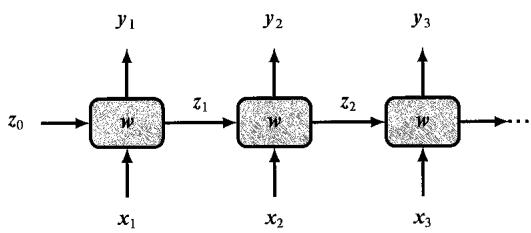  
图12.13 带有参数  $\pmb{\varpi}$  的一般递归神经网络。它将  $x_{1},\dots ,x_{N}$  作为输入，并生成一个序列  $y_{1},\dots ,y_{N}$  作为输出。图中的每个方框对应一个具有非线性隐藏单元的多层网络

Network，RNN），如图12.13所示。此处隐状态的初始值可以初始化为某个默认值，例如  $z_0 = (0,0,\dots ,0)^{\mathrm{T}}$  。

关于如何在实践中使用递归神经网络，请参考将句子从英语翻译成荷兰语的具体任务。句子的长度是可变的，且每个输出句子的长度可能与相应的输入句子的长度不同。此外，网络在开始生成输出句子之前，可能需要看到整个

输入句子。我们可以使用递归神经网络解决这个问题，方法是输入完整的英文句子，然后输入一个特殊的 token（用 <start> 表示），以触发翻译过程的开始。在训练过程中，网络将学会如何将 <start> 与输出句子的开头联系起来。我们还可以将每个连续生成的词输入下一个时间步的输入中，如图 12.14 所示。训练网络以生成特定的 <stop> token，以表示翻译完成。网络的前几个阶段用于吸收输入序列，而相关的输出向量则忽略。网络的这一部分可以看作一个“编码器”，其中整个输入句子都压缩成了隐变量的状态  $z^{\star}$  。其余的网络阶段则充当“解码器”，旨在逐字生成翻译好的句子作为输出。请注意，每个输出词都会作为输入词输入网络的下一阶段，因此这种方法具有类似于式（12.31）的自回归结构。

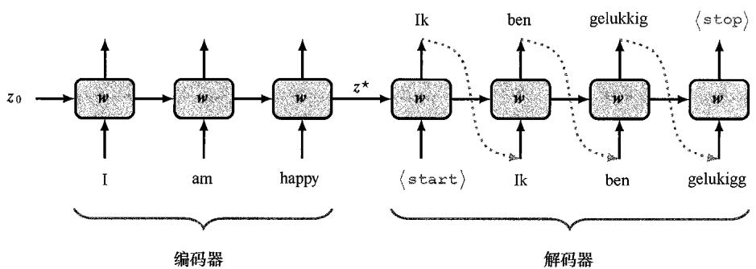  
图12.14 用于语言翻译的递归神经网络示例

### 12.2.6 通过时间反向传播

与普通神经网络一样，递归神经网络可根据反向传播计算出的梯度，通过随机梯度下降法进行训练，并通过自动微分法进行计算。误差函数包括所有输出单元对每个单元误差的求和，其中每个输出单元都有一个softmax激活函数和一个相关的交叉熵误差函数。在前向传播过程中，激活值从序列中的第一个输入节点一直传播到序列中的所有输出节点，然后误差信号沿着相同的路径反向传播。这一过程称为通过时间反向传播（backpropagation through time），其原理简单明了。然而在实践中，由于深度网络架构会出现梯度消失或梯度爆炸的问题，因此训练很长的序列可能会很困难。

标准递归神经网络的另一个问题是，其无法很好地处理远距离依赖关系。这在自然语言中尤为突出，因为这种依赖关系非常普遍。在较长的文本段落中，不妨引入一个概念，这个概念对预测文本后面出现的词起着重要作用。在图12.14所示的架构中，英文句子的整个概念必须在长度固定的单个隐向量  $z^{\star}$  内被捕捉到，而如果序列较长，问题就会越来越严重。这就是所谓的瓶颈问题（bottleneck problem），因为任意长度的序列都必须总结为单个激活的隐向量，而网络只有在处理完整个输入序列后才能开始生成输出。

解决梯度消失和梯度爆炸问题以及有限远距离依赖关系的一种方法是修正神经

网络架构，从而允许额外的信号路径，该路径可以绕过网络每个阶段的许多处理步骤，进而允许在更多的时间步内记忆信息。长短时记忆（Long Short-Term Memory, LSTM）模型（Hochreiter and Schmidhuber, 1997）和门控循环单元（Gated Recurrent Unit, GRU）模型（Cho et al., 2014）是最广为人知的示例。虽然与标准递归神经网络相比，它们的性能有所提高，但在远距离依赖关系建模方面，它们的能力仍然有限，而且每个单元的额外复杂性意味着长短时记忆模型的训练速度相比标准递归神经网络更慢。此外，所有递归神经网络的信号路径都与序列中的步数成线性关系。最后，由于处理过程具有连续性，它们不支持在单个训练示例内进行并行计算。特别是，这意味着递归神经网络难以有效利用基于图形处理单元的现代高度并行硬件。用Transformer取代递归神经网络可以解决这些问题。

## 12.3 Transformer语言模型

Transformer 处理层是一个高度灵活的组件，可用于构建具有广泛适用性的强大神经网络模型。本节将探讨 Transformer 在自然语言中的应用。这促进了称作大语言模型（Large Language Model, LLM）的大规模神经网络的发展，事实证明，这类模型具有非凡的能力（Zhao et al., 2023）。

Transformer语言模型可用于多种不同的语言处理任务，并可根据输入和输出数据的形式分为3类。在情感分析等问题中，我们将一个词序列作为输入，并提供一个代表文本情感（如快乐或悲伤）的变量作为输出。此处，Transformer充当序列的“编码器”。而在其他问题中，我们可能会将单个向量作为输入，并生成一个词序列作为输出。例如，假设我们希望在给定输入图像的情况下生成文本标题。在这种情况下，Transformer作为“解码器”产生一个序列作为输出。最后，在序列到序列的处理任务中，输入和输出都由一个词序列组成。例如，假设我们想要将一种语言翻译成另一种语言。在这种情况下，Transformer同时扮演编码器和解码器的角色。我们将使用模型架构的说明性示例依次讨论上述每一类Transformer语言模型。

### 12.3.1 解码器型Transformer

我们首先考虑解码器型Transformer。此类Transformer语言模型可以用作生成式模型以创建token的输出序列。作为说明性示例，我们将重点讨论一种名为GPT（Generative Pretrained Transformer，生成性预训练Transformer）的模型（Radford et al., 2019; Brown et al., 2020; OpenAI, 2023）。我们想要利用Transformer架构构建一个形式如式（12.31）的自回归模型，其中条件分布  $p\left(x_{n} \mid x_{1}, \dots, x_{n-1}\right)$  是利用从数据中习得的Transformer神经网络来表示的。

该模型将由前  $n - 1$  个 token 组成的序列作为输入，相应的输出表示 token  $n$  的条件分布。从这个分布中抽取一个样本，即可将序列扩展到  $n$  个 token，这个新序列可以通过模型反馈给 token  $n + 1$  的分布，以此类推。可以重复该过程，生成一个序列，该序

列的最大长度由Transformer输入的数量决定。我们稍后将讨论从条件分布中采样的策略（参见12.3.2小节），但目前我们讨论的重点是如何构建和训练网络。

GPT 模型的架构由 Transformer 层堆叠组成，这些层采用 token 的序列  $x_{1}, \dots, x_{N}$  作为输入，维度为  $D$ ，并产生 token 的序列  $\tilde{x}_{1}, \dots, \tilde{x}_{N}$  作为输出，维度同样为  $D$ 。每个输出都需要代表该时间步的 token 字典的概率分布，token 字典的维度为  $K$ ，而 token 的维度为  $D$ 。因此，我们使用维度为  $D \times K$  的矩阵  $W^{(p)}$  对每个输出 token 进行线性变换，然后使用 softmax 激活函数，其形式为

$$
\boldsymbol {Y} = \operatorname {S o f t m a x} \left(\tilde {\boldsymbol {X}} \boldsymbol {W} ^ {(p)}\right) \tag {12.33}
$$

其中  $\mathbf{Y}$  是第  $n$  行为  $\mathbf{y}_n^{\mathrm{T}}$  的矩阵， $\tilde{\mathbf{X}}$  是第  $n$  行为  $\tilde{\mathbf{x}}_n^{\mathrm{T}}$  的矩阵。每个softmax输出单元都有一个相关的交叉熵误差函数（参见5.4.4小节）。模型架构如图12.15所示。

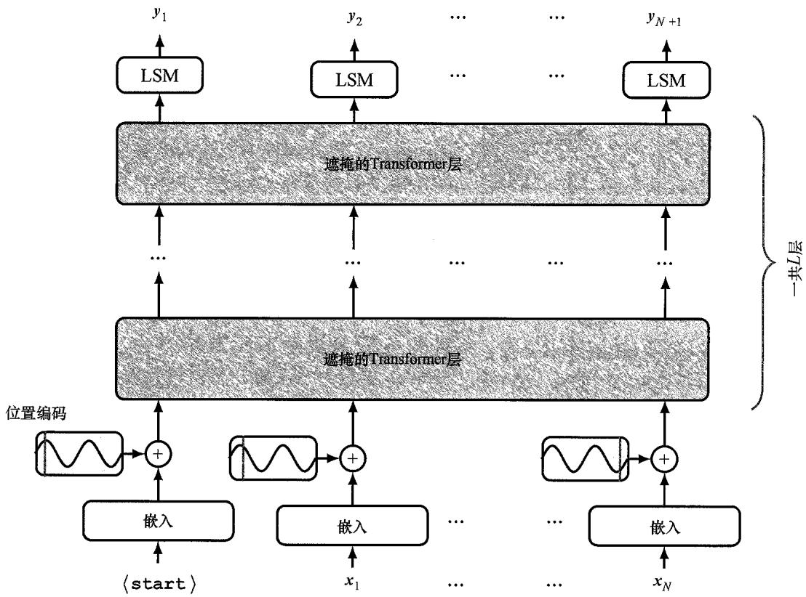  
图12.15GPT解码器型Transformer网络的架构。此处“LSM”代表linear-softmax，记作一种线性变换，它的可学习参数在token位置之间是共享的，然后是一个softmax激活函数

该模型可以采用自监督的方法并使用大规模的无标签自然语言语料进行训练。每个训练样本由 token 的序列  $x_{1}, \dots, x_{n}$  组成，构成网络的输入。每个训练样本还包含序列中下一个 token 组成的相关目标值  $x_{n+1}$  。序列可以认为是独立同分布的，因此用于训

练的误差函数是训练集上的交叉熵误差值之和，并分成适当的小批次。我们可以使用通过模型的前向传递来独立且朴素地处理每个训练样本。不过，我们可以通过一次性处理整个序列来实现更高的效率，从而每个 token 既可以作为前一个 token 序列的目标值，也可以作为后续 token 的输入值。例如，考虑如下词序列：

I swam across the river to get to the other bank.

我们既可以使用“I swam across”作为输入序列，关联目标为“the”；也可以使用“I swam across the”作为输入序列，关联目标为“river”，以此类推。不过，为了并行处理这些数据，我们必须确保网络无法通过提前查看序列来“作弊”，否则它只会学到将下一个输入直接复制到输出。这样的话，它就无法生成新的序列，因为根据定义，测试时后续 token 不可用。为了解决这个问题，我们做了两件事。首先，我们将输入序列向右移动一步，使输入  $x_{n}$  对应于输出  $y_{n+1}$ ，目标为  $x_{n+1}$ ，并在输入序列的第一个位置预置一个额外的 token，标记为 <start>。其次，请注意，Transformer 中的 token 是

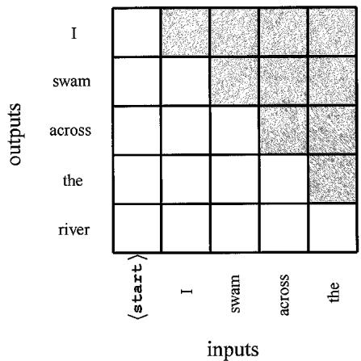  
图12.16 遮掩注意力矩阵的结构。红色元素对应的注意力权重为零。因此，在预测token“across”时，输出只能取决于输入tokens“<start>"“I”和“swam"

独立处理的，除非它们用于计算注意力权重，此时它们会通过点积成对地相互作用。因此，我们在每个注意层中引入了遮掩注意力（masked attention），有时也称因果注意力（casual attention）。在此过程中，我们将每个 token 对于序列中之后的所有 token 的注意力权重设为零。具体来说，只需要将式（12.14）定义的注意力矩阵 Attention  $(Q, K, V)$  的所有相应元素置零，然后对其余元素进行归一化，使每一行的总和再次为 1 即可。为达成这一目标，在实际操作中，可将相应的预激活值设置为  $-\infty$  。这样一来，softmax 函数对相关输出的计算结果为零，并能对非零输出进行归一化处理。遮掩注意力矩阵的结构如图 12.16 所示。

在实践中，我们希望有效利用GPU的大规模并行性，因此可以将多个序列堆叠成一个输入张量，以便在一个批次中进行并行处理。不过，这要求序列的长度相同，而文本序列的长度是可变的。要解决这个问题，我们可以引入一个特定的token（用<pad>表示），用来填充未使用的位置，从而使所有序列达到相同的长度，以便将它们合并成一个单一张量。然后在注意力权重中使用一个额外的掩码，以确保输出向量不对<pad>token占用的任何输入给予注意力。请注意，该掩码的形式取决于特定的输入序列。

训练模型的输出是 token 空间的概率分布，其由输出激活函数 softmax 给出，表示当前 token 序列情况下的下一个 token 的概率。一旦选择了下一个词，就可以将包含新 token 的 token 序列再次输入模型，以生成序列中的后续 token，这个过程可以无限重复，直至生成表示序列结束的 token。这看起来似乎效率很低，因为每个新生成

的 token 都必须通过整个模型输入数据。不过，请注意，由于遮掩注意力，为特定 token 所学习到的嵌入向量只取决于该 token 本身和先前的 token，因此在生成新的、后续的 token 时，该嵌入向量不会发生变化。在处理新的 token 时，大部分计算可以循环使用。

### 12.3.2 抽样策略

我们已经看到，解码器型Transformer的输出是序列中下一个token值的概率分布，必须从中选择一个特定的token值来扩展序列。根据计算出的概率，选择token值的方法有好几种（Holtzman et al., 2019）。一种显而易见的方法称为贪婪搜索，即简单地选择概率最高的token。这使得模型具有确定性，即给定的输入序列总是产生相同的输出序列。请注意，在每个阶段选择概率最高的token并不等于选择概率最高的token序列（见习题12.15）。要找到最有可能的序列，我们需要最大化所有token的联合分布，其计算公式为

$$
p \left(\mathbf {y} _ {1}, \dots , \mathbf {y} _ {N}\right) = \prod_ {n = 1} ^ {N} p \left(\mathbf {y} _ {n} \mid \mathbf {y} _ {1}, \dots , \mathbf {y} _ {n - 1}\right) \tag {12.34}
$$

如果序列中有  $N$  个步骤，而字典中 token 值的数量为  $K$ ，那么序列的总数为  $\mathcal{O}\left(K^{N}\right)$ ，这使得序列的长度呈指数增长，因此寻找单一的最可能序列是不可行的。相比之下，贪婪搜索的成本为  $\mathcal{O}(KN)$ ，与序列长度成线性关系。

与贪婪搜索相比，有一种技术有可能产生更高概率的序列，即束搜索（beam search）。我们不是在每一步都选择一个最有可能的 token 值，而是保留一组  $B$  假设（其中的  $B$  称为束宽度（beam width）），每个假设由直到  $n$  步的 token 值序列组成。然后，我们通过网络将所有这些序列输入，并为每个序列找到  $B$  个最可能的 token 值，从而为扩展序列创建  $B^2$  个可能的假设。最后，根据扩展序列的总概率选择最有可能的  $B$  假设，从而对该序列进行剪枝。因此，束搜索会保留  $B$  个备选序列，跟踪它们的概率，并从考虑过的序列中选出最有可能的序列。由于序列的概率是由序列中每一步的概率相乘得到的，而这些概率总是小于或等于1，因此长序列的概率通常低于短序列的概率，从而使结果偏向于短序列。在进行比较之前，通常需要根据序列的相应长度对序列的概率进行归一化处理。束搜索的成本为  $O(BKN)$ ，也与序列长度成线性关系。然而，生成一个序列的成本会是原来的  $B$  倍，因此对于推理成本可能会变得很高的超大语言模型来说，束搜索的吸引力将大打折扣。

贪婪搜索和束搜索等方法存在的一个问题是，它们限制了潜在输出的多样性，甚至可能导致生成过程陷入循环，即重复出现相同的子序列。从图12.17中可以看出，与自动生成的文本相比，人工生成的文本可能概率较低，因此对于给定的模型来说更不寻常。

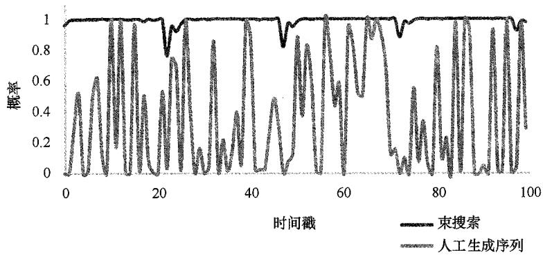  
图12.17 在给定经训练Transformer语言模型和初始输入序列的情况下，比较束搜索和人工生成序列的token概率，得出人工生成序列的token概率要低得多[经Holtzman等人(2019)授权使用]

我们可以在每一步从softmax分布中采样，生成连续的token，而不是试图找到概率最高的序列。然而，这可能导致无意义的序列。这是因为token字典通常非常庞大，其中有许多token状态组成的长尾，每个状态的概率都非常小，但总体上却占总概率的很大一部分。这就导致一个问题，即系统很有可能对下一个token做出错误的选择。

为了在这两个极端之间取得平衡，对于  $K$  的某个选择，我们可以只考虑前  $K$  个概率的状态，然后根据它们的重归一化概率对其进行采样，称为top-  $K$  采样。这种方法的一个变体叫作top-  $p$  采样或核采样（nuclear sampling），用于计算最高输出的累积概率，直至达到一个阈值，然后从这个受限的token状态集中采样。

top-  $K$  采样的一个“更软”版本是在softmax函数的定义中引入一个称为温度的参数  $T$  (Hinton, Vinyals, and Dean, 2015), 从而

$$
y _ {i} = \frac {\exp \left(a _ {i} / T\right)}{\sum_ {j} \exp \left(a _ {j} / T\right)} \tag {12.35}
$$

然后从修正过的分布中采样下一个 token。当  $T = 0$  时，概率质量（probability mass）集中在最有可能的状态上，其他状态的概率为零，因此这就变成了贪婪挑选。当  $T = 1$  时，我们恢复未经修正的 softmax 分布；当  $T \to \infty$  时，分布在所有状态下变得均匀。在  $0 < T < 1$  的范围内选择一个值，概率就会向高值集中。

序列生成面临的一个挑战是，在学习阶段，模型是在人工生成的输入序列上进行训练的；而在生成运行阶段，输入序列本身就是由模型生成的。这意味着模型可能会偏离我们在训练过程中看到的序列分布。

### 12.3.3 编码器型Transformer

接下来，我们将考虑基于编码器的Transformer语言模型，这种模型将序列作为输入，并生成长度固定的向量（如<class>标签）作为输出。作为这种模型的典型代表，BERT（Bidirectional Encoder Representations from Transformers）（Devlin et al., 2018）

旨在利用大规模文本语料预先训练语言模型，然后利用迁移学习（transfer learning）对模型进行微调，以完成各种下游任务，其中每种任务都需要较小的特定应用训练集。模型架构如图12.18所示。这种方法是前面所讲的Transformer层的简单应用（参见12.1.7小节）。

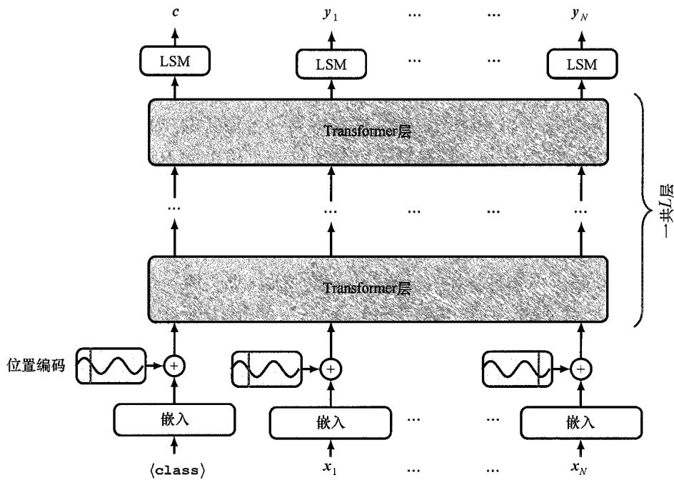  
图12.18GPT编码器型Transformer网络的架构。标有“LSM”的方框表示线性变换，其可学习参数在token位置之间是共享的，然后是一个softmax激活函数。与图12.17相比，主要区别在于输入序列没有向右移动，且省略了遮掩矩阵。因此，在每个自注意力层中，每个输出token都可以关注任何输入token

每个输入字符串的第一个 token 由一个特殊的 token <class> 给出，模型的相应输出在预训练时则被忽略。当我们讨论微调时，它的作用将变得显而易见。通过在输入端呈现 token 序列，可以对模型进行预训练。用一个特殊 token（用 <mask> 表示）代替一个随机选择的 token 子集，比例为  $15\%$  。该模型经过训练后，就可以预测相应输出节点上缺失的 token。这类似于 word2vec 模型中用于学习词嵌入的遮掩（参见 12.2.1 小节）。例如，输入序列可能如下：

 I (mask) across the river to get to the (mask) bank.

网络应该预测输出节点2上的“swam”和输出节点10上的“other”。在这种情况下，只有两个输出有益于误差函数，其他输出则被忽略。

“双向”一词是指网络可以同时看到遮掩词之前和之后的词，并利用这两个信息源进行预测。因此，与解码器型Transformer不同的是，编码器型Transformer不需要将输入向右移动一位，也不需要遮掩每一层的输出，以免看到序列中后续出现的输入token。与解码器模型相比，编码器模型的效率较低，因为只有一部分序列 token用作

训练标签。此外，编码器模型无法生成序列。

用 <mask> 替换随机选择 token 的过程意味着与后续的微调集相比，训练集存在不匹配的问题，因为后者不包含任何 <mask> token。为了减少这种情况可能导致的问题，Devlin et al.（2018）对随机选择 token 的过程稍微做了修改，从而在  $15\%$  的随机选择 token 中， $80\%$  用 <mask> 代替， $10\%$  用词汇表中随机选取的一个词代替， $10\%$  将原始词保留在输入端（但仍需要在输出端对其进行正确预测）。

编码器模型经过训练后，就可以针对各种不同的任务进行微调。为此，需要构建一个新的输出层，其形式与所要解决的任务相匹配。在文本分类任务中，只使用第一个输出位置，其对应于总是出现在输入序列中第一个位置的<class> token。如果输出矩阵的维度为  $D$  ，那么第一个输出节点就会添加一个维度为  $D \times K$  的参数矩阵，其中  $K$  为类的数量，然后将其依次输入一个  $K$  维的softmax函数或一个维度为  $D \times 1$  的向量， $K = 2$  时则将其输入一个逻辑斯谛 sigmoid函数。线性输出变换也可以用更复杂的可微分模型（如多层感知机）替代。如果想要对输入字符串中的每个token进行分类，例如将每个token归入一个类（如人、地点、颜色等），那么第一个输出将被忽略，随后的输出会有一个共享的“线性变换+softmax”层。在微调过程中，包括新输出矩阵在内的所有模型参数都是通过随机梯度下降法并利用正确标签的对数概率来学习的。另

外，预训练模型的输出也可输入复杂的生成式深度学习模型，用于文本到图像合成等应用（参见第20章）。

### 12.3.4 序列到序列Transformer

为完整起见，我们简要讨论一下第三类Transformer模型，此类Transformer模型将编码器与解码器做了结合，正如Vaswani et al.（2017）在最初的Transformer论文中所讨论的那样。请参阅将句子从英语翻译成荷兰语的任务。如前所述，我们可以使用解码器型Transformer逐个生成与荷兰语输出相对应的token序列（参见12.3.1小节）。主要区别在于，该输出需要以与英文句子相对应的整个输入序列为条件。编码器型Transformer可用于将输入token序列映射为合适的内部表示，我们用  $Z$  表示。为了将  $Z$  纳入输出序列的生成过程，我们使用了一种经过修正的注意力机制，称为交叉注意力（cross attention）。交叉注意力与自注意力相似，只是虽然查询向量来自正在生成的序列（在本例中指的是荷兰语输出序列），但键向量和值向量来自  $Z$  所代表的序列，如图12.19所示。回

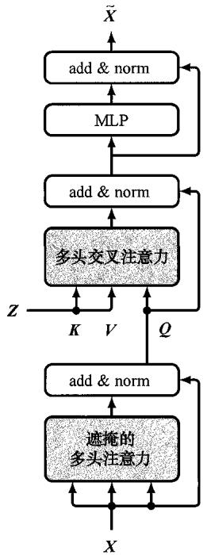  
图12.19 序列到序列Transformer的解码器部分使用的交叉注意力层示意图。此处  $Z$  表示编码器部分的输出，“add&norm”代表残差连接和随后的层归一化，“MLP”代表多层感知机。  $Z$  还表示交叉注意力层的键向量和值向量，而查询向量则由解码器部分决定

到我们对视频流服务的类比，这就好比用户将其查询向量发送给不同的流媒体公司，流媒体公司会将其与自己的键向量集作比较，以找到最佳匹配，然后以电影的形式返回相关的值向量。将编码器和解码器组件结合起来，即得到图12.20所示的模型架构。该模型可以使用成对的输入句子和输出句子进行训练。

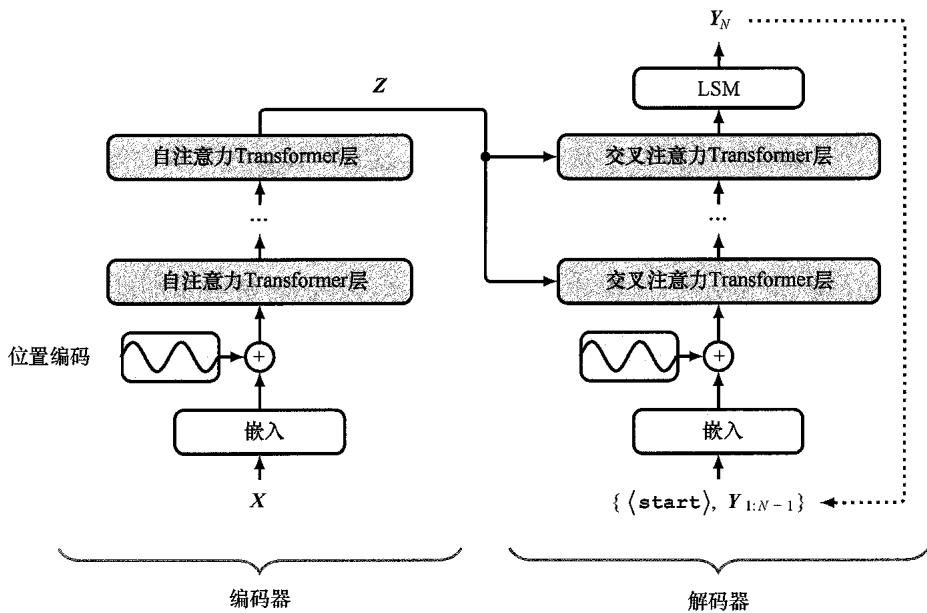  
图12.20 序列到序列Transformer的示意图。在这里，输入token和输出token都显示为方框。位置编码向量被添加到编码器和解码器部分的输入token中。编码器中的每一层都与图12.9所示的结构相对应，每个交叉注意层的形式如图12.19所示

### 12.3.5 大语言模型

机器学习领域最近最重要的发展是为自然语言处理创建了基于Transformer的超大型神经网络——大语言模型（Large Language Model，LLM）。此处的“大”指的是网络中权重和偏置参数的数量规模大，在撰写本书时，这些参数的数量可高达约一万亿 $(10^{12})$ 。这种模型的训练成本很高，但其所拥有的卓越能力促使着人们建立这种模型。

除了大型数据集的可用性，基于图形处理单元和类似处理器的大规模并行训练硬件的出现也为训练更大型的模型提供了便利，这些硬件在配备了快速互联机制和大量内置存储器的大型集群中紧密耦合。Transformer架构在这些模型的开发过程中发挥了关键作用，因为它能够非常有效地利用这些硬件。通常情况下，增加训练集的规模，同时相应增加模型参数的数量，所带来的性能改进会超过架构改进或纳入更多领域知识的方法（Sutton, 2019; Kaplan et al., 2020）。例如，GPT系列模型（Radford et al., 2019; Brown et al., 2020; OpenAI, 2023）连续几代性能的显著提升主要归功于参数规模的扩大。这类性能改进推动了一种新摩尔定律的产生：自2012年以来，训练一个最先进的机器学习模型所需的计算运算次数呈指数增长，倍增的时间约为3.4个月（参见

图1.16)。

早期的语言模型采用监督学习的方法进行训练。例如，为了建立一个翻译系统，训练集将由两种语言的配对句子组成。然而，监督学习的一个主要局限是，数据通常必须经过人工整理，以提供有标签数据，这严重限制了可用数据的数量，因此需要大量使用归纳偏置，如特征工程和架构约束，以实现合理的性能。

相反，大语言模型是通过对超大型文本数据集进行自监督学习来训练的，同时还可能包括计算机代码等其他 token 序列。我们已经了解了如何在 token 序列上训练解码器型 Transformer（参见 12.3.1 小节），其中每个 token 都是一个有标签的目标示例，而前面的序列则是输入，从而学习条件概率分布。这种“自标签”大大增加了可用的训练数据量，因而可以利用具有大量参数的深度神经网络。

使用自监督学习引发了一种范式转变，即首先使用无标签数据对一个大的模型进行预训练（pre-trained），然后使用基于小得多的有标签数据集的监督学习对模型进行微调（fine-tuned）。这实际上是一种迁移学习，同一个预训练模型可用于多个“下游”应用。具有广泛功能且随后可以针对特定任务进行微调的模型称作基础模型（foundation model）（Bommasani et al., 2021）。

我们可以通过在网络输出中增加额外层，或用新参数替换最后几层，然后使用有标签数据训练最后几层来实现微调。在微调阶段，主模型中的权重和偏置既可以保持不变，也可以进行小幅调整。与预训练相比，微调的成本通常较低。

一种非常有效的微调方法叫作低秩自适应（Low-Rank Adaptation，LoRA）（Hu et al., 2021）。这种方法的灵感来自一些结果，这些结果表明，经过训练的过度参数化模型在微调方面具有较低的内在维度，这意味着微调过程中模型参数的变化位于一个流形（manifold）上，该流形的维度远远小于模型中可学习参数的总数（Aghajanyan, Zettlemoyer, and Gupta, 2020）。低秩自适应利用了这一点，做法是冻结原始模型的权重，并以低秩乘积的形式在Transformer的每一层添加额外的可学习权重矩阵。通常只修改注意力层的权重，多层感知机层的权重则保持不变。考虑一个维度为  $D \times D$  的权重矩阵  $W_{0}$ ，它可能代表一个查询矩阵、键矩阵或值矩阵，其中来自多个注意力头的矩阵则视为一个单独的矩阵。如图12.21所示，我们引入了一个平行权重集，它由两个矩阵  $A$  和  $B$  的乘积定义，这两个矩阵的维度分别为  $D \times R$  和  $R \times D$  。然后，该层产生一个由  $X W_{0} + X A B$  给出的输出矩阵。与原始权重矩阵  $W_{0}$  中的  $D^{2}$  个参数相比，附加权重矩阵  $A B$  中的参数数量为  $2R D$  。因此，如果  $R \ll D$  ，则微调过程中需要调整的参数数量远少于原始Transformer中的参数数量。实际上，这可以将需要训练的参数数量减少到原来的万分之一。一旦完成微调，就可以将附加权重添加到原始权重矩阵中，从而得到新的权重矩阵：

$$
\widehat {\boldsymbol {W}} = \boldsymbol {W} _ {0} + \boldsymbol {A} \boldsymbol {B} \tag {12.36}
$$

在推理过程中，与运行原始模型相比，我们不会有额外的计算开销，因为更新后的模型与原始模型大小相同。

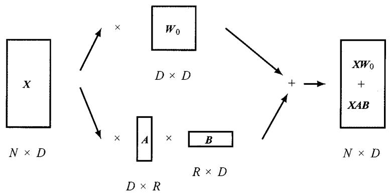  
图12.21 低秩自适应的示意图，这里展示了预训练Transformer中一个注意力层的权重矩阵  $W_{0}$  。在微调过程中，对矩阵  $\pmb{A}$  和  $\pmb{B}$  给出的附加权重进行调整，然后将它们的乘积  $AB$  添加到原始权重矩阵中，用于后续推理

随着语言模型变得越来越大，对微调的需求越来越少，现在只需要通过基于文本的交互，生成式语言模型就能执行广泛的任务。例如，假设给出一个文本串

English: the cat sat on the mat. French:

作为输入序列，自回归语言模型就可以继续生成后续 token，直至生成 <stop> token，其中新生成的 token 代表法语翻译。请注意，该模型并不是专门为翻译而训练的，而是在包括多种语言在内的大量数据语料上训练出来的。

用户可以使用自然语言与这些模型交互。为了改善用户体验和所生成输出的质量，研究人员使用基于人类反馈的强化学习（Reinforcement Learning from Human Feedback RLHF）等方法，开发出了一些通过人工评估生成输出来微调大语言模型的技术（Christiano et al., 2017）。这些技术支持创建具有简单易用对话界面的大语言模型，其中最著名的是 OpenAI 的 ChatGPT。

用户给出的输入 token 序列称为提示（prompt）。例如，它可能包含一个故事的开场白，而模型需要完成这个故事。它也可能包含一个问题，而模型应该提供答案。通过使用不同的提示，同一个经训练的神经网络可以完成多种任务，例如根据简单的文本请求生成计算机代码，或根据要求写出押韵的诗歌。模型的性能取决于提示的形式，这催生了一个叫作提示工程（prompt engineering）的新领域（Liu et al., 2021），其目的是为提示设计一种好的形式，从而为下游任务带来高质量的输出。在将用户提示输入语言模型之前，还可以通过调整用户提示来修改模型的行为，即在用户提示前预置一个称为前缀提示（prefix prompt）的额外 token 序列以修改输出的形式。例如，前缀提示可能包括用标准英语表达的指令，以告诉网络不要在输出中包含攻击性语言。

这样，只需要在提示中提供一些示例，模型就能解决新任务，而无须调整模型参数。这是小样本学习（few-shot Learning）的一个示例。

目前最先进的模型（如GPT-4）已经变得十分强大，以至于它们表现出一些非凡的特性，这些特性被描述为通用人工智能的初步迹象（Bubeck et al., 2023），并正在推

动新一轮的技术创新。此外，这类模型的性能也在以惊人的速度不断提高。

## 12.4 多模态Transformer

虽然Transformer最初是作为处理顺序语言数据的递归网络的替代品而开发的，但Transformer模型已在深度学习的几乎所有领域得到普及。事实证明，它们是通用模型，因为它们对输入数据的假设很少，而对卷积网络的等变性和局部性有很强的假设。由于其通用性，Transformer已成为处理许多不同模态数据（包括文本、图像、视频、点云和音频数据）的最先进技术，并已用于这些领域中每个领域的判别和生成应用（参见第10章）。Transformer层的核心架构在不同时期和不同应用中都保持相对稳定。因此，能够在自然语言以外的领域使用Transformer的关键创新主要集中在输入和输出的表示及编码方面。

能够处理多种不同数据的单一架构有一个巨大优势，就是能使多模态计算变得相对简单。在这种情况下，多模态指的是将两种或两种以上类型的数据结合在一起。例如，我们可能希望根据文字提示生成图像，或者设计一个能将摄像头、雷达和麦克风等多个传感器捕获的信息结合起来的机器人。重要的是，如果我们能对输入进行 token 化并对输出 token 进行解码，那么我们就有可能使用 Transformer。

### 12.4.1 视觉Transformer

Transformer已成功应用于计算机视觉领域，并在许多任务中有着不俗的表现。判别任务最常见的选择是标准Transformer，其在视觉领域又称视觉Transformer（Vision Transformer，简称ViT）（Dosovitskiy et al., 2020）。在使用Transformer时，我们需要决定如何将输入图像转换为 token，最简单的选择是将每个像素作为一个token并按照线性投影进行转换。然而，标准Transformer实现所需的内存与输入token的数量成二次方增长关系，因此这种方法通常是不可行的。相反，最常见的分词方法是将图像分割成一组大小相同的小块。假设图像的尺寸为  $x \in \mathbb{R}^{N \times W \times C}$ ，其中  $H$  和  $W$  分别指的是图像的高度和宽度（以像素为单位）， $C$  是通道数（R、G、B三种颜色的通道数通常为3）。每幅图像被分割成大小为  $P \times P$  的非重叠小块（ $P = 16$  是常见的选择），然后“平铺”成一维向量，这样就得到了图像尺寸的另一种表示  $\pmb{x}_p \in \mathbb{R}^{N \times (P^2 C)}$ ，其中  $N = HW / P^2$  是一幅图像的小块总数。用于分类任务的视觉Transformer的架构如图12.22所示。

另一种分词方法是将图像输入一个小型卷积神经网络（参见第10章）。这样就可以对图像进行采样，从而得到数量可控的token，每个token由一个网络输出表示。例如，一个典型的ResNet18编码器将在高度和宽度两个维度对图像进行8倍的下采样，所得到的token数量是像素数量的1/64。

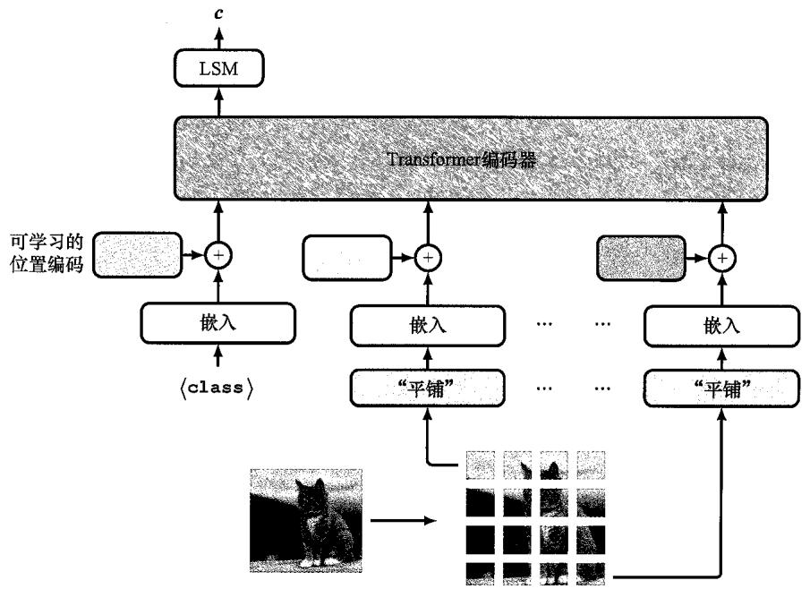  
图12.22 用于分类任务的视觉Transformer的架构。此处将一个可学习的token<class>作为额外的输入，相关的输出由一个具有softmax激活函数的线性层（记作LSM）进行转换，从而得到最终的类-向量输出  $c$

我们还需要一种在 token 中编码位置信息的方法。我们可以构建明确的位置嵌入，对图像小块的二维位置信息进行编码。但在实践中，这一般不会提高性能，因此最常见的做法是只使用习得的位置嵌入。与用于自然语言的 Transformer 不同，视觉 Transformer 通常将固定数量的 token 作为输入，从而避免了习得的位置编码无法泛化到不同大小的输入的问题。

视觉Transformer的架构设计与卷积神经网络截然不同。虽然卷积神经网络中会产生强归纳偏置，但视觉Transformer中唯一的二维归纳偏置是用于token化输入的小块造成的。因此，视觉Transformer通常比卷积神经网络需要更多的训练数据，因为它必须从头开始学习图像的几何特性。不过，由于对输入的结构没有很强的假设，视觉Transformer通常能够收敛到更高的精度。这再次说明了归纳偏置与训练数据规模之间需要权衡（Sutton,2019）。

### 12.4.2 图像生成Transformer

在语言领域，Transformer在用作合成文本的自回归生成式模型时取得了令人瞩目的成果。因此，人们自然会问是否也可以使用Transformer来合成逼真的图像。由于自然语言本身具有顺序性，因此其非常适合自回归框架，而图像的像素没有自然顺序，因此自回归解码是否有用并不那么直观。然而，只要首先定义变量的某种排序，任何分布都可以分解为条件式的乘积（参见11.1.2小节）。有序变量  $x_{1},\dots ,x_{N}$  的联合分布可以写成

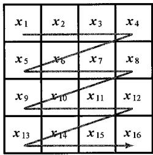  
图12.23 定义二维图像中像素的特定线性排序的栅格扫描示意图

$$
p \left(\boldsymbol {x} _ {1}, \dots , \boldsymbol {x} _ {N}\right) = \prod_ {n = 1} ^ {N} p \left(\boldsymbol {x} _ {n} \mid \boldsymbol {x} _ {1}, \dots , \boldsymbol {x} _ {n - 1}\right) \tag {12.37}
$$

这种分解是完全通用的，对各个条件分布  $p\left(x_{n} \mid x_{1}, \dots, x_{n-1}\right)$  的形式没有任何限制。

对于一幅图像，我们可以选择  $x_{n}$  作为R、G、B值的三维向量来表示第  $n$  个像素。现在我们需要确定像素的排序，其中一种使用广泛的排序方式叫栅格扫描（raster scan），如图12.23所示。使用基于栅格扫描排序的自回归模型生成图像如图12.24所示。

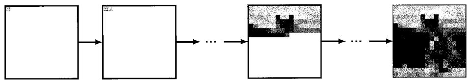  
图12.24 从自回归模型中进行图像采样的示意图。按栅格扫描顺序，第一个像素从边缘分布  $p(x_{11})$  中采样，第二个像素从条件分布  $p(x_{12} | x_{11})$  中采样，以此类推，直至得到一幅完整的图像

请注意，图像自回归生成式模型的使用早于Transformer的引入。例如，PixelCNN（Oord et al., 2016）和PixelRNN（Oord, Kalchbrenner, and Kavukcuoglu, 2016）使用了定制的遮掩卷积层，其保留了式（12.37）右侧相应项为每个像素定义的条件独立性。

使用连续值的图像表示可以很好地完成判别任务。不过，使用离散表示法生成图像的效果要好得多。通过最大似然法习得的连续条件分布，例如负对数似然函数为平方和误差函数的高斯分布，往往会学习到训练数据的均值，从而导致图像模糊（参见4.2节）。相反，离散分布可以轻松处理多模态问题。例如，式（12.37）中的条件分布  $p(x_{n} \mid x_{1}, \dots, x_{n-1})$  可能会得出一个像素应该是黑色或白色的结论，而回归模型可能会得出该像素应该是灰色的结论。

然而，使用离散空间也会带来挑战。图像像素的R、G、B值通常至少用8位精度来表示，因此每个像素都有  $2^{24} \approx 1600$  万个可能值。在维度如此高的空间中学习条件softmax分布是不可行的。

解决高维度问题的一种方法是使用向量量化（vector quantization）技术，它可以视为一种数据压缩形式。假设我们有一组数据向量  $x_{1},\dots ,x_{N}$  ，其中每个向量的维度为 $D$  ，它可能代表图像像素。然后我们引入一组  $K$  个码本向量  $\mathcal{C} = c_1,\dots ,c_K$  ，它们的维度也是  $D$  ，且通常情况下  $K\ll D$  。接下来，我们根据某种相似度度量（通常是欧几里得距离），将每个数据向量近似为其最近的码本向量（codebook vector），从而

$$
\boldsymbol {x} _ {n} \rightarrow \underset {\boldsymbol {c} _ {k} \in C} {\arg \min } \left\| \boldsymbol {x} _ {n} - \boldsymbol {c} _ {k} \right\| ^ {2} \tag {12.38}
$$

由于有  $K$  个码本向量，我们可以用一个独热编码的  $K$  维向量来表示每个  $\pmb{x}_n$  ，而

且又由于我们可以选择  $K$  的值，因此我们可以通过使用较大的  $K$  值来更准确地表示数据，或使用较小的  $K$  值来更大程度地压缩数据，从而进行两者之间的权衡。

我们可以将原始图像的像素映射到低维码本空间，然后训练自回归Transformer以生成一组码本向量，并通过用相应的  $D$  维码本向量  $\pmb{c}_k$  替换每个码本索引  $k$  ，将这组码本向量映射回原始图像空间。

自回归Transformer最早应用于ImageGPT（Chen, Radford, et al., 2020）中的图像。此处，每个像素都可以视为一组离散的三维颜色码本向量之一，每个三维颜色码本向量都与颜色空间的  $k$  均值聚类中的一个聚类相对应（参见15.1节）。因此，独热编码可以提供离散token（类似于语言token），并允许Transformer以与语言模型相同的方式进行训练，以实现下一个token分类目标。这是表示学习的一个强大目标（参见6.3.3小节），可用于后续微调（同样以类似于语言建模的方式进行）。

然而，直接使用单个像素作为 token 可能会导致计算成本过高，因为每个像素都需要进行一次前向传递，这意味着训练和推理的效率都会随着图像分辨率的提高而降低。此外，使用单个像素作为输入意味着必须使用低分辨率图像，以便在栅格扫描后期解码像素时提供合理的上下文长度。正如我们在视觉 Transformer 中看到的那样，最好使用图像的小块而不是像素作为 token，因为这样 token 的数量会大大减少，从而有利于处理更高分辨率的图像。和以前一样，由于条件分布可能具有多模态性，我们需要使用 token 值的离散空间。于是再次出现维度挑战，由于维度与小块中像素的数量成指数关系，因此小块的维度比单个像素的维度大得多。例如，即使只有代表黑色和白色两种可能像素的 token，以及大小为  $16 \times 16$  的小块，我们也会有一个内含  $2^{256} \approx 10^{77}$  个小块的 token 字典。

我们再次使用向量量化技术来解决维度挑战。简单的聚类（如  $k$  均值聚类）方法或更复杂的方法（如全卷积网络）（Oord, Vinyals, and Kavukcuoglu, 2017; Esser, Rombach, and Ommer, 2020），甚至包括视觉Transformer（Yu et al., 2021），都可以用来从图像小块数据集中习得码本向量。将每个小块映射到离散的代码集，之后再映射回来的一个问题是，向量量化是一种不可微分操作。幸运的是，我们可以使用一种称为直通梯度估计的技术（Bengio, Léonard, and Courville, 2013），这是一种简单的近似法，只需要在反向传播过程中通过不可微分函数复制梯度即可。

使用自回归Transformer生成图像也可以扩展到生成视频，方法是将视频视为这类向量量化token的一个长序列（Rakhimov et al., 2020; Yan et al., 2021; Hu et al., 2023）。

### 12.4.3 音频数据

接下来让我们看看Transformer在音频数据中的应用。声音通常以波形的形式存储，它们可以通过在固定时间间隔内测量气压的振幅来获得。虽然这种波形可以直接作为深度学习模型的输入，但在实践中，将其预处理为梅尔频谱（mel spectrogram）更为有效。这是一个矩阵，其中的列代表时间步，行代表频率。这些频段遵循标准惯例（标准惯例是通过主观评估选择的），从而使得连续频率之间的感知差异相等（“mel”

一词来源于旋律）。梅尔频谱如图12.25所示。

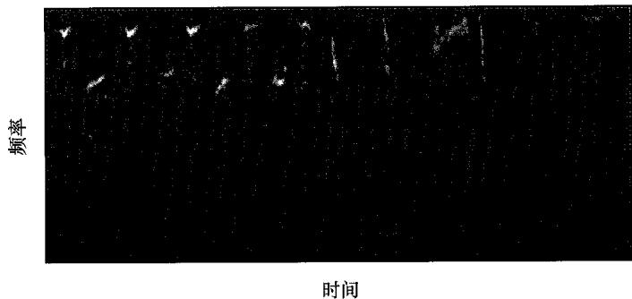  
图12.25 座头鲸叫声的梅尔频谱（librosa开发团队版权所有  $\odot 2013 - 2023$  ）

Transformer在音频领域的一个应用是分类，旨在将音频片段归入若干预定义类别之一。例如，AudioSet数据集（Gemmeke et al., 2017）就是一个使用广泛的基准，其中包含“汽车”“动物”“笑声”等类。在Transformer出现之前，最先进的音频分类方法是将梅尔频谱作为图像进行处理，并将其作为卷积神经网络的输入（参见第10章）。不过，虽然卷积神经网络擅长理解局部关系，但它的一个缺点是难以处理远距离依赖关系，而这在处理音频时可能非常重要。

正如Transformer取代递归神经网络成为自然语言处理领域的最先进技术一样，Transformer在音频分类等任务中也开始取代卷积神经网络。例如，如图12.18所示，编码器型Transformer与用于语言和视觉的Transformer结构相同，可用于预测音频输入的类（Gong, Chung, and Glass, 2021）。此处，梅尔频谱可以视为图像，然后进行token化。具体做法是以类似于视觉Transformer的方式将图像分割成不同的小块，可能会有一些重叠，以避免丢失任何重要的邻域关系。然后对每个小块进行扁平化处理，也就是将它们转换为一维数组，在本例中长度为256。之后为每个token添加唯一的位置编码，并附加特定的token<class>，接下来通过编码器型Transformer输入token。我们可以使用一个线性层和一个softmax激活函数对最后一个转换层中与输入token<class>相对应的输出token进行解码，并使用交叉熵损失对整个模型进行端到端训练。

### 12.4.4 文本语音转换

分类并不是深度学习（更具体地说是Transformer架构）在音频领域带来革命性变化的唯一任务。Transformer成功地合成了模仿特定说话者声音的语音这一事实再次证明了Transformer的多功能性，而Transformer在这项任务中的应用则是关于如何在新环境中应用Transformer的一项内容十分丰富的案例研究。

生成与给定文本段落相对应的语音叫作文本语音合成（text-to-speech synthesis）。一种更传统的方法是收集特定说话者的录音，然后训练一个监督回归模型，从而根据相应的转录文本预测语音输出（可能采用梅尔频谱的形式）。在推理过程中，我们希望将合成语音的文本作为输入，由此产生的梅尔频谱输出则可以解码回音频波形，因为这是一个固定的映射。

不过，这种方法有3个主要不足。首先，如果我们在低层次上预测语音，例如使用叫作音素（phoneme）的子词组件，则需要更大的上下文来使生成的句子听起来流畅。但是，如果我们预测更长的片段，那么可能的输入空间就会显著增大；要达到良好的泛化效果，我们可能需要大量的训练数据。其次，这种方法不能在不同说话者之间传递知识，因此每个新的说话者都需要大量数据。最后，这实际上是一个生成建模任务，因为给定的说话者和文本对有多个正确的语音输出，所以回归可能并不合适，回归倾向于对目标值进行平均（参见4.2节）。

相反，如果我们将语音数据与自然语言同等对待，并将文本语音合成作为一项条件语言建模任务，那么我们就能以与基于文本的大语言模型大致相同的方式训练该模型。此时我们需要解决两个主要的实现细节问题。首先是如何对训练数据进行 token 化并对预测值进行解码，其次是如何根据说话者的声音对模型进行调节。

Vall-E（Wang et al., 2023）是一种利用Transformer和语言建模技术进行文本语音合成的方法。只需要几秒样本语音，就能将新文本映射成新说话者的语音。语音数据通过向量量化获得的字典或码本（codebook）被转换成一组离散token（参见12.4.2小节），我们可以将这类token视为类似于自然语言领域的独热编码token。输入由文本段落中的文本token组成，而用于训练的目标输出则由相应的语音token组成。如图12.26所示，来自同一说话者的一小段无关语音的附加语音token会被添加到输入文本token中。通过加入来自许多不同说话者的额外语音token，系统可以在模仿这些额外

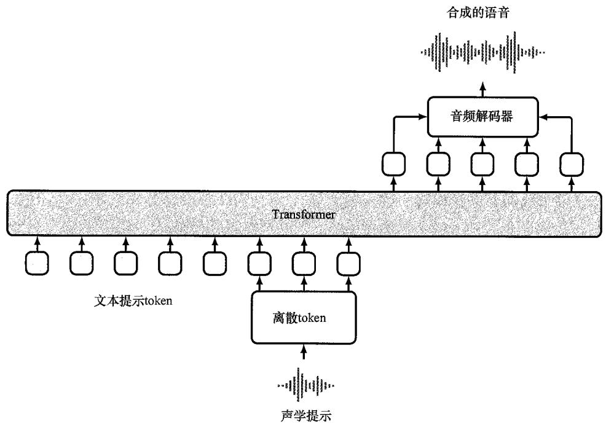  
图12.26 Vall-E高级架构图。Transformer模型的输入包括文本提示token（提示模型合成的语音应包含哪些词）和声学提示token（确定说话者的风格和语调信息）。使用习得的解码器将采样的模型输出token解码为语音。为简单起见，这里没有显示位置编码和线性投影

语音 token所代表的声音时学习朗读一个文本段落。训练完成后，系统就可以显示新的文本，以及从新的说话者那里捕捉到的一段简短语音中的音频 token，并使用训练时的相同码本对输出 token进行解码，以创建语音波形。这样系统就能用新说话者的声音合成与输入文本相对应的语音。

### 12.4.5 视觉和语言Transformer

我们已经了解了如何生成文本、音频和图像的离散 token，接下来的问题是，我们是否可以用一种模态的输入 token 和另一种模态的输出 token 来训练模型。或者说，我们是否可以将不同模态的输入或输出抑或它们两者结合起来，在这里，我们将重点讨论文本和视觉数据的组合，因为这是研究最广泛的示例，但原则上，此处讨论的方法也可应用于其他输入和输出模态的组合。

第一个要求是，我们要有一个庞大的数据集来进行训练。LAION-400M数据集（Schuhmann et al., 2021）极大地促进了文生图和图生文的研究，该数据集与ImageNet数据集一样，对深度图像分类模型的发展起着关键作用。文生图实际上与我们迄今为止研究过的无条件图像生成很相似，只不过我们还允许模型将文本信息作为输入，为生成过程提供条件。使用Transformer时，进行文生图非常简单，因为我们只需要在解码每个图像 token时提供文本 token作为额外输入即可。

这种方法也可视为将文生图问题看作序列到序列的语言建模问题，如机器翻译，只不过目标 token 是离散的图像 token 而不是语言 token。因此，选择一个完整的编码器-解码器 Transformer 模型是合理的，如图 12.20 所示，其中  $X$  对应于输入文本 token， $Y$  对应于输出图像 token。一个名为 Parti 的模型（Yu et al., 2022）就采用了这种方法，其中 Transformer 可扩展至 200 亿个参数，同时随着模型规模的增大，性能也得到了持续改善。

在使用预训练的语言模型并对其进行修改或微调，以使其也能接收视觉数据作为输入方面，业界也开展了大量研究（Alayrac et al., 2022; Li et al., 2022）。这些研究主要使用定制架构和连续值图像 token，因此并不适合同时生成视觉数据。此外，如果我们希望加入音频 token 等新模态，也不能直接使用它们。尽管这是向多模态迈出的一步，但我们还是希望将文本 token 和图像 token 同时用作输入和输出。最简单的方法是将所有内容都视为一组 token，就像自然语言一样，但使用的字典是语言 token 字典和图像 token 码本的组合。这样我们就可以将任何视听数据流简单地视为一组 token 了。

在 CM3（Aghajanyan et al., 2022）和 CM3Leon（Yu et al., 2023）中，语言建模的一种变体用于对 HTML 文档进行训练，这些文档包含了从在线资源中获取的图像和文本数据。当大量的训练数据与可扩展的架构相结合时，模型就会变得非常强大。此外，训练的多模态性质意味着模型非常灵活。这类模型不仅能够完成许多原本需要特定任务模型架构和训练机制才能完成的任务，如文生图、图生文、图像编辑、文本补全等，还能够完成普通语言模型所能完成的任何任务。图 12.27 给出了 CM3Leon 模型在文本和图像联合空间中执行各种不同任务的示例。

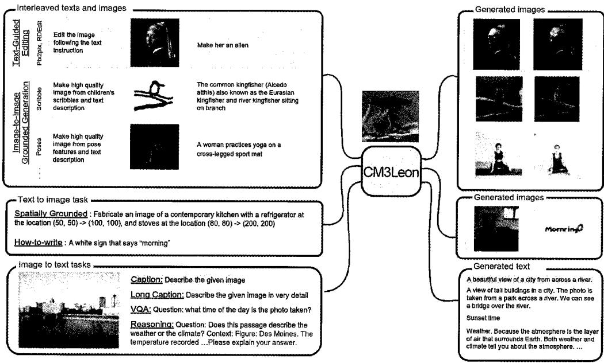  
图12.27 CM3Leon模型在文本和图像联合空间中执行各种不同任务的示例[经Yu等人（2023）授权使用]

## 习题

12.1（ $\star \star$ ）考虑  $m = 1, \dots, N$  时的一组系数  $a_{nm}$ ，它们必须满足

$$
a _ {n m} \geqslant 0 \tag {12.39}
$$

$$
\sum_ {m} a _ {n m} = 1 \tag {12.40}
$$

使用拉格朗日乘子证明它们还必须满足

$$
a _ {n m} \leqslant 1 , \text {其 中} n = 1, \dots , N \tag {12.41}
$$

12.2（ $\star$ ）验证对于向量  $x_{1}, \dots, x_{N}$  的任意值，softmax函数[式（12.5）]满足约束条件[式（12.3）和式（12.4)]。  
12.3（ $\star$ ）考虑式（12.2）定义的简单变换中的输入向量  $\pmb{x}_n$ ，其中加权系数  $a_{nm}$  由式（12.5）定义。证明如果所有输入向量都是正交的，即  $n = m$  时  $\pmb{x}_n^{\mathrm{T}}\pmb{x}_m = 0$ ，则输出向量将等于输入向量，即  $n = 1,\dots,N$  时  $\pmb{y}_n = \pmb{x}_n$ 。  
12.4（ $\star$ ）考虑两个独立的随机向量  $\pmb{a}$  和  $\pmb{b}$ ，这两个向量的长度均为  $D$ ，并且都取自均值为零、方差为单位方差的高期分布  $\mathcal{N}(\cdot|\mathbf{0},\mathbf{I})$ 。证明  $\left(\pmb{a}^{\mathrm{T}}\pmb{b}\right)^{2}$  的期望值由  $D$  给出。  
12.5（\*\*\*）证明式（12.19）定义的多头注意力可以重写为以下形式：

$$
\boldsymbol {Y} = \sum_ {h = 1} ^ {H} \boldsymbol {H} _ {h} \boldsymbol {X} \boldsymbol {W} ^ {(h)} \tag {12.42}
$$

其中  $H_{h}$  由式（12.15）给出，并且我们已经定义了

$$
\boldsymbol {W} ^ {(h)} = \boldsymbol {W} _ {h} ^ {(v)} \boldsymbol {W} _ {h} ^ {(o)} \tag {12.43}
$$

此处我们将矩阵  $W^{(o)}$  横向划分为若干子矩阵（表示为  $\pmb{W}_{h}^{(o)}$ ），每个子矩阵的维度为  $D_{\nu} \times D$ ，与合并的注意力矩阵的纵向段落相对应。由于  $D_{\nu}$  通常小于  $D$ ，例如  $D_{\nu} = D / H$  是一个常见的选择，因此这个组合矩阵存在秩亏。使用完全灵活的矩阵替代  $\pmb{W}_{h}^{(\nu)}\pmb{W}_{h}^{(o)}$  并不等同于文中给出的原始公式。

12.6（ $\star \star$ ）将自注意力函数[式（12.14）]以矩阵的形式表达为一个全连接网络，该矩阵可以将全部输入序列的合并词向量映射为相同维度的输出向量。请注意，这样的矩阵有  $\mathcal{O}\left(N^{2}D^{2}\right)$  个参数。证明自注意力网络对应于参数共享矩阵的稀疏版本。画出该矩阵的结构草图，指出哪些参数块是共享的，以及哪些参数块的所有元素都等于零。

12.7（ $\star$ ）证明如果我们省略输入向量的位置编码，那么式（12.19）定义的多头注意力层的输出对于输入序列的重新排序将是等变化的。

12.8（ $\star \star \star$ ）考虑两个  $D$  维单位向量  $\pmb{a}$  和  $\pmb{b}$ ，它们满足  $\| \pmb{a} \| = 1$  和  $\| \pmb{b} \| = 1$  并且是从随机分布中抽取的。假设该随机分布是围绕原点的对称分布。证明对于  $D$  的较大值，这两个向量之间夹角的余弦值接近零，因此这两个向量在高维空间中几乎是正交的。为此，考虑一个正交基  $\pmb{u}_i$ ，其中  $\pmb{u}_i^{\mathrm{T}} \pmb{u}_j = \delta_{ij}$  并将  $\pmb{a}$  和  $\pmb{b}$  表示为这个正交基中的展开式。

12.9（ $\star \star$ ）考虑一种位置编码，其中输入 token 向量  $x$  与位置编码向量  $e$  已合并为一个向量。证明当这个合并向量在通过矩阵进行一般线性变换时，结果可以表示为线性变换输入向量和线性变换位置向量的和。

12.10（ $\star \star$ ）证明式（12.25）定义的位置编码具有这样的特性：对于固定偏移  $k$ ，位置  $n + k$  的编码可以表示为位置  $n$  的编码的线性组合，其系数取决于  $k$  而非取决于  $n$ 。为此，使用以下三角恒等式：

$$
\cos (A + B) = \cos A \cos B - \sin A \sin B \tag {12.44}
$$

$$
\sin (A + B) = \cos A \sin B + \sin A \cos B \tag {12.45}
$$

证明如果编码只基于正弦函数而非余弦函数，这一特性将不再成立。

12.11（ $\star$ ）考虑词袋模型[式（12.28）]，其中每个组件分布  $p(x_{n})$  都是由所有词共享的通用概率表给出的。证明在给定向量训练集的情况下，最大似然解是由一个表格给出的，该表格中的条目是每个词在训练集中出现的次数。  
12.12（ $\star$ ）考虑式（12.31）给出的自回归模型，并假设式（12.31）右侧的项  $p(x_{n} \mid x_{1}, \dots, x_{n-1})$  可用一般概率表来表示。证明这些表格中的条目数会随着  $n$

值的增大呈指数增长。

12.13（ $\star$ ）在使用  $n$  元模型时，通常会同时训练  $n$  元模型和  $(n - 1)$  元模型，然后使用概率的乘积法则计算条件概率，其形式为

$$
p \left(\boldsymbol {x} _ {n} \mid \boldsymbol {x} _ {n - L + 1}, \dots , \boldsymbol {x} _ {n - 1}\right) = \frac {p _ {L} \left(\boldsymbol {x} _ {n - L + 1} , \cdots , \boldsymbol {x} _ {n}\right)}{p _ {L - 1} \left(\boldsymbol {x} _ {n - L + 1} , \cdots , \boldsymbol {x} _ {n - 1}\right)} \tag {12.46}
$$

解释为什么这样做更方便，并证明在求  $p_{L-1}(\cdots)$  时，必须省略每个序列的最后一个 token 才能得到正确的概率。

12.14（ $\star \star$ ）写出在具有图12.13所示架构的经训练递归神经网络中进行推理的伪代码。  
12.15（ $\star \star$ ）考虑一个由两个 token  $y_{1}$  和  $y_{2}$  组成的序列，其中的每个 token 都可以有  $A$  和  $B$  两种状态。联合概率分布  $p(y_{1}, y_{2})$  如下：

<table><tr><td></td><td>y1=A</td><td>y1=B</td></tr><tr><td>y2=A</td><td>0.0</td><td>0.4</td></tr><tr><td>y2=B</td><td>0.1</td><td>0.25</td></tr></table>

可以看到，最可能序列是  $y_{1} = B, y_{2} = B$ ，概率为0.4。利用概率的加和法则与乘积法则，写出边缘分布  $p(y_{1})$  和条件分布  $p(y_{2} | y_{1})$  的值。证明如果我们先最大化  $p(y_{1})$  而得出一个值  $y_{1}^{*}$ ，再最大化  $p(y_{2} | y_{1}^{*})$ ，那么我们得到的序列将与总体最可能序列不同。求该序列的概率。

12.16（ $\star$ ）BERT-Large模型（Devlin et al., 2018）的最大输入长度为512个token，每个token的维度  $D = 1024$  ，取自30000个词汇。该模型有24个Transformer层，每个Transformer层有16个自注意力头，且  $D_{q} = D_{k} = D_{\nu} = 64$  ；多层感知机定位网络有两层，共有4096个隐节点。证明BERT编码器型Transformer语言模型中的参数总数约为3.4亿。

__________  
  
  
  
  
  
__________
