# 第17章 生成对抗网络

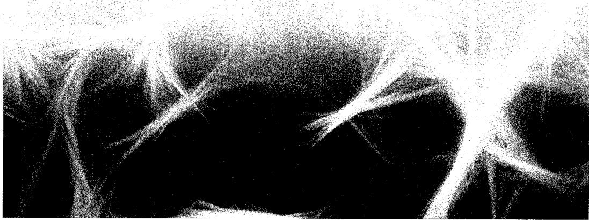

生成式模型使用机器学习算法从一组训练数据中学习潜在的数据分布，然后根据该分布生成新的样本。例如，一个生成式模型可以基于动物图像进行训练，随后用于生成新的动物图像。我们可以将这种生成式模型理解为一个条件分布  $p(x \mid w)$ ，这里  $x$  是数据空间中的向量，而  $w$  代表模型的可学习参数。在很多情况下，我们更倾向于使用形式为  $p(x \mid c, w)$  的条件生成式模型，其中  $c$  代表条件变量的向量。以动物图像生成模型为例，我们希望生成的图像应该是特定动物的，比如猫或狗，而这是由  $c$  的值指定的。

对于像图像生成这样的实际应用而言，其分布极其复杂，深度学习能显著提高生成式模型的性能。在讨论基于Transformer的自回归大语言模型时，我们已经了解了一些重要的深度生成式模型。我们还概述了4种基于非线性潜变量模型的生成式模型（参见第12章和16.4.4小节），本章将讨论其中的第一种——生成对抗网络（Generative Adversarial Network，GAN），其他三种将在后续各章中讨论。

## 17.1 对抗训练

考虑一个基于从潜空间  $z$  到数据空间  $x$  的非线性变换的生成式模型。引入一个潜空间分布  $p(z)$ ，它可能是一个简单的高斯分布：

$$
p (z) = \mathcal {N} (z | \mathbf {0}, I) \tag {17.1}
$$

同时定义一个由深度神经网络实现的非线性变换  $x = g(z, w)$ ，其中可学习参数  $w$  对应的网络称为生成器（generator）网络。它们共同隐式地定义了  $x$  上的分布，我们的目标是将这个分布拟合到一组训练样本  $\{x_{n}\}$  上，其中  $n = 1, \dots, N$  。然而，我们并不能通过优化似然函数来确定  $w$ ，因为这通常无法以封闭形式来计算。生成对抗网络（Goodfellow et al., 2014; Ruthotto and Haber, 2021）的关键思想是引入判别器（critic）网络，判别器网络与生成器网络一起训练，并为更新生成器的权重提供训练信号，如图 17.1 所示。

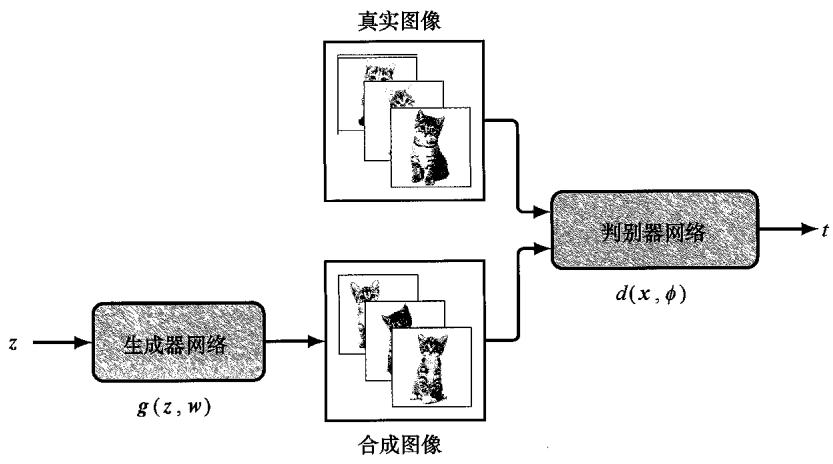  
图17.1 生成对抗网络的示意图。在这样的网络中，训练判别器网络  $d(x, \phi)$  以区分来自训练集的真实样本（小猫的图像）和由生成器网络  $g(z, w)$  产生的合成样本。生成器网络的目标是通过产生逼真的图像来让判别器网络产生更多的误判，而判别器网络的目的是通过更好地区分真实样本和合成样本来减少误判

判别器网络的目标是区分来自数据集的真实样本和由生成器网络的合成（或“假”）样本，它通过最小化传统的分类误差函数来进行训练。相反，生成器网络的目标是通过生成与训练集同分布的样本来最大化这个误差。因此，生成器网络和判别器网络互相对抗，“生成对抗网络”由此得名。这是一种零和博弈（zero-sum game），在这场零和博弈中，任何一个网络的收益都代表另一个网络的损失。生成对抗网络通过允许判别器网络提供一个训练信号来训练生成器网络，从而将无监督的密度建模问题转换成了一种监督学习的形式。

### 17.1.1 损失函数

为了明确这一点，我们定义一个二元目标变量  $t$ ：

$$
t = 1 \text {, 代 表 真 实 数 据} \tag {17.2}
$$

$$
t = 0 \text {, 代 表 合 成 数 据} \tag {17.3}
$$

判别器网络拥有单个输出单元，带有 sigmoid 激活函数，其输出表示数据向量  $x$  为真实数据的概率：

$$
P (t = 1) = d (x, \phi) \tag {17.4}
$$

我们可以使用如下标准的交叉熵损失函数来训练判别器网络：

$$
E (\boldsymbol {w}, \phi) = - \frac {1}{N} \sum_ {n = 1} ^ {N} \left\{t _ {n} \ln d _ {n} + (1 - t _ {n}) \ln (1 - d _ {n}) \right\} \tag {17.5}
$$

其中  $d_{n} = d(x_{n},\phi)$  是判别器网络的输出，我们已经通过数据点的总数对它进行了归一化（参见1.2.4小节）。训练集包括标记为  $\pmb{x}_{n}$  的真实样本和由生成器网络 $\pmb {g}(z_n,\pmb {w})$  输出的合成样本，其中  $z_{n}$  是从潜空间分布  $p(z)$  中采样的随机样本。对于真实样本，  $t_n = 1$  ；对于合成样本，  $t_n = 0$  。我们可以将损失函数［式（17.5）］写成以下形式：

$$
E _ {\text {G A N}} (\boldsymbol {w}, \phi) = - \frac {1}{N _ {\text {r e a l}}} \sum_ {n \in \text {r e a l}} \ln d \left(\boldsymbol {x} _ {n}, \phi\right) - \tag {17.6}
$$

$$
\frac {1}{N _ {\text {s y n t h}}} \sum_ {n \in \text {s y n t h}} \ln (1 - d (g (z _ {n}, w), \phi))
$$

通常情况下，真实数据点的数量  $N_{\mathrm{real}}$  等于合成数据点的数量  $N_{\mathrm{synth}}$  。这种生成器网络和判别器网络的组合可以使用随机梯度下降进行端到端的训练（参见第7章），并通过反向传播来计算梯度。然而，这种训练方式的独特之处在于其对抗性，即误差相对于  $\phi$  最小化，而相对于  $\pmb{\varpi}$  最大化。

这种最大化可以通过标准的基于梯度的方法来完成，通过反转梯度的符号，参数更新为

$$
\Delta \phi = - \lambda \nabla_ {\phi} E _ {n} (w, \phi) \tag {17.7}
$$

$$
\Delta \boldsymbol {w} = \lambda \nabla_ {\boldsymbol {w}} E _ {n} (\boldsymbol {w}, \phi) \tag {17.8}
$$

其中  $E_{n}(w,\phi)$  表示为数据点  $n$  定义的误差，或者更一般地说，是为小批量数据点定义的误差。注意式（17.7）和式（17.8）右侧的符号不同，因为判别器网络的训练目标是降低错误率，而生成器网络的训练目标是提高错误率。实际上，训练交替地在更新生成器网络的参数和更新判别器网络的参数之间进行，每次只使用一个小批量数据，

并采取一个梯度下降步骤，之后生成一组新的合成样本。如果生成器网络成功找到完美解决方案，则判别器网络将无法区分真实数据和合成数据，因此其输出始终为0.5。一旦GAN训练完毕，判别器网络就会被舍弃，生成器网络则用来从潜空间中采样并将这些样本经训练好的生成器网络加以传播，从而在数据空间中合成新的样本。我们可以证明，对于具有无限灵活性的生成器网络和判别器网络，完全优化的GAN将具有与数据分布完全匹配的生成分布（见习题17.1）。图1.3展示了一些由GAN生成的优秀的人脸图像。

到目前为止我们所讨论的GAN都是从无条件分布  $p(x)$  中生成样本的。例如，如果我们用狗的图像对GAN进行训练，它就会生成合成的狗的图像。我们也可以创建条件GAN（Mirza and Osindero, 2014），它从条件分布  $p(x|c)$  中采样，其中条件向量  $\pmb{c}$  可能代表不同品种的狗。为此，生成器网络和判别器网络会将  $\pmb{c}$  作为额外输入，并使用标有标签的图像实例  $\{x_{n}, c_{n}\}$  对GAN进行训练。一旦GAN训练好了，我们就可以通过将  $\pmb{c}$  设置为相应的类向量来生成所需类别的图像。与为每个类别训练单独的GAN相比，这样做有一个优势，就是可以跨所有类别学习共享的内部表示，从而更有效地利用数据。

### 17.1.2 实战中的GAN训练

尽管GAN可以产生高质量的结果，但由于对抗学习的特点，其并不容易训练成功（见习题17.2）。此外，与标准的损失函数最小化不同，由于目标函数的值在训练过程中可能上升也可能下降，因此并没有一个明确的进展指标。

GAN在训练过程中可能出现模式崩溃（mode collapse）的问题，即在训练过程中，生成器网络的权重发生了适应性调整，导致所有潜变量样本  $z$  都被映射到有效输出的一个子集上。在极端情况下，输出可能只对应一个或少数几个输出值  $x$  。判别器网络随后将这些实例的值设置为0.5并停止训练。例如，一个生成手写数字训练的GAN可能学会只生成数字“3”的实例，而判别器网络无法将这些实例与真正的数字“3”的实例区分开来，它没能认识到生成器网络并没有生成所有可能的数字。

通过图17.2，我们可以更深入地理解训练GAN的困难。该图显示了一个简单的一维数据空间  $x$  ，其中样本  $\{x_{n}\}$  来自固定但未知的数据分布  $p_{\mathrm{Data}}(x)$  。该图还显示了初始生成分布  $p_{\mathrm{G}}(x)$  以及从该分布中抽取的样本。因为数据分布和生成分布之间差异显著，最优的判别器函数  $d(x)$  很容易学习，其函数值下降态势急剧，在真实样本或合成样本的邻近区域梯度几乎为零。考虑GAN损失函数［式（17.6）］中的第二项，由于在生成样本跨越的区域内  $d\big(g(z,w),\phi \big)$  值等于零，生成器网络参数  $\boldsymbol{\mathfrak{w}}$  的微小变化在判别器网络的输出上将产生很小的变化，因此梯度较小，导致学习进程缓慢。

这个问题可以通过使用判别器函数的平滑版本  $\tilde{d}(x)$  来解决（见图17.2），从而为生成器网络提供更强的梯度以驱动训练。最小二乘GAN(least-squares, GAN)(Mao et al., 2016）通过修改判别器网络输出一个实值而不是取值范围为  $0 \sim 1$  的概率，并用

平方和损失函数替换交叉熵损失函数来实现平滑。另一种称为实例噪声（instance noise）（Sønderby et al., 2016）的方法则向真实样本和合成样本中添加高斯噪声，这同样能使判别器函数更加平滑。

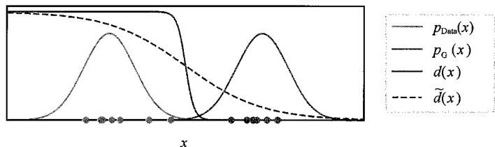  
图17.2为了从概念上说明为什么训练GAN可能会有难度，这里展示了一个简单的一维数据空间  $x$  ，其中有固定但未知的数据分布  $p_{\mathrm{Data}}(x)$  和初始生成分布  $p_{\mathrm{G}}(x)$  。最优的判别函数  $d(x)$  在训练或合成数据点附近几乎没有梯度，使学习变得非常缓慢。判别函数的平滑版本  $\tilde{d} (x)$  可以使学习变得更快

为了改进GAN的训练，研究者们提出了许多对损失函数和训练过程的修改方案（Mescheder, Geiger, and Nowozin, 2018）。其中常见的一个建议是将原始损失函数中的生成器网络

$$
- \frac {1}{N _ {\text {s y n t h}}} \sum_ {n \in \text {s y n t h}} \ln \left(1 - d \left(\mathbf {g} \left(\mathbf {z} _ {n}, \mathbf {w}\right), \phi\right)\right) \tag {17.9}
$$

替换为

$$
\frac {1}{N _ {\text {s y n t h}}} \sum_ {n \in \text {s y n t h}} \ln d (g (z _ {n}, w), \phi) \tag {17.10}
$$

式（17.9）所示的第一种形式最小化了图像为假的概率，式（17.10）所示的第二种形式则最大化了图像为真的概率。这两种形式的不同属性可以通过图17.3来加以理解。当生成分布  $p_{\mathrm{G}}(x)$  与数据分布  $p_{\mathrm{Data}}(x)$  完全不同时， $d(g(z,w))$  接近于零，因此第一种形式具有非常小的梯度，而第二种形式具有较大的梯度，从而能加快训练速度。

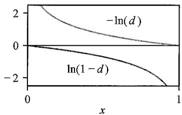  
图17.3  $-\ln (d)$  和  $\ln (1 - d)$  的图像表明，在  $d = 0$  和  $d = 1$  附近，梯度的表现存在非常大的差异

为确保生成分布  $p_{\mathrm{G}}(x)$  向数据分布  $p_{\mathrm{Data}}(x)$  靠拢，更直接的方法是修改误差标准，以反映这两个分布在数据空间中的距离。这可以使用 Wasserstein 距离（也称推土机距离）来衡量。设想生成分布  $p_{\mathrm{G}}(x)$  是一堆土，我们需要分批运输这堆土以构建数据分布  $p_{\mathrm{Data}}(x)$  。Wasserstein 距离就是移动的土壤总量和平均移动距离的积。在重排这堆土以构建  $p_{\mathrm{Data}}(x)$  的许多方式中，能产生最小平均移动距离的方式被用于定义度量。在实践中，这并不能直接实现，需要通过使用一个具有实值输出的判别器网络来近似，然后通过权重裁剪限制判别器函数关于  $x$  的梯度

$\nabla_{x}d(x,\phi)$  ，从而产生了WassersteinGAN（Arjovsky,Chintala,andBottou,2017）。

另一种改进的方法是对梯度引入惩罚，从而产生了梯度惩罚 Wasserstein GAN (Gulrajani et al., 2017)，其损失函数由下式给出：

$$
\begin{array}{l} E _ {\mathrm {W G A N - G P}} (\boldsymbol {w}, \phi) = - \frac {1}{N _ {\text {r e a l}}} \sum_ {n \in \text {r e a l}} \left[ \ln d \left(\boldsymbol {x} _ {n}, \phi\right) - \eta \left(\left\| \nabla_ {\boldsymbol {x} _ {n}} d \left(\boldsymbol {x} _ {n}, \phi\right) \right\| ^ {2} - 1\right) ^ {2} \right] + \tag {17.11} \\ \frac {1}{N _ {\text {s y n t h}}} \sum_ {n \in \text {s y n t h}} \ln d (g (z _ {n}, w, \phi)) \\ \end{array}
$$

其中的  $\eta$  控制了惩罚项的相对重要性。

## 17.2 图像的生成对抗网络

GAN的基本概念催生了大量的研究工作，涵盖了许多算法和众多应用，其中应用广泛且成功的是图像生成。早期的GAN使用全连接网络作为生成器网络和判别器网络（参见第10章）。然而，使用卷积网络有许多好处，尤其是对于更高分辨率的图像而言。判别器网络将图像作为输入，并提供一个标量概率作为输出，因此使用标准的卷积网络非常合适（参见10.5.3小节）。生成器网络需要将低维潜空间映射成高分辨率图像，因此使用了基于转置卷积的网络，如图17.4所示。

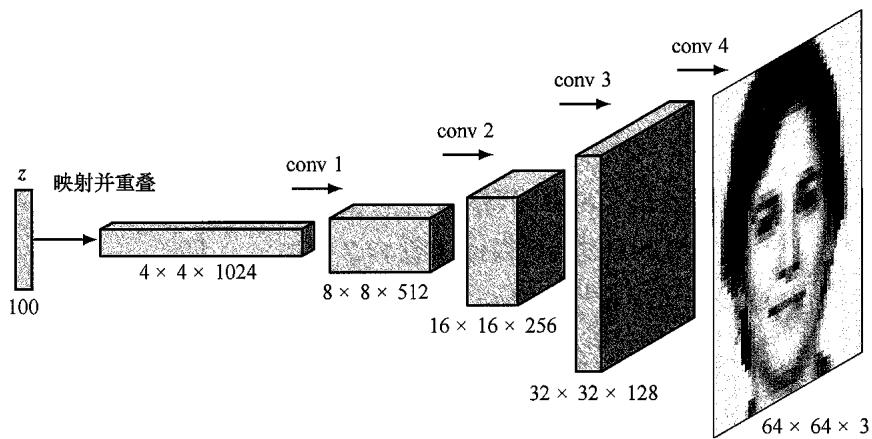  
图17.4 深度卷积GAN的示例架构，这里展示了如何在网络的连续模块中使用转置卷积来扩展维度

从低分辨率开始，随着训练的进行，逐步添加新的卷积层，就能模拟越来越精细的细节（Karras et al., 2017）。这种方法不仅加速了训练过程，而且能够从  $4 \times 4$  大小的图像开始，最终合成  $1024 \times 1024$  大小的高分辨率图像。图17.5展示了用于类别条件图像生成的GAN模型——BigGAN，这是体现GAN架构的规模和复杂性的一个典型例子。

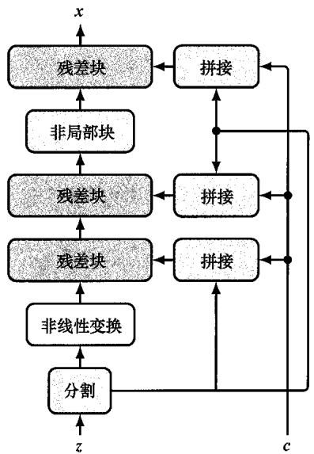  
(a)

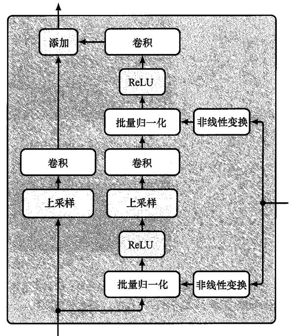  
(b)  
图17.5 (a) BigGAN模型中生成器网络的架构，它拥有超过7000万个参数。(b)生成器网络中每个残差块的细节。拥有8800万个参数的判别器网络具有类似的架构，不同之处在于判别器网络使用平均池化层（average pooling）来降低维度，而不是通过上采样（up-sampling）来增加维度［基于Brock, Donahue, and Simonyan（2018）]

### CycleGAN

作为GAN多样性的一个例子，考虑一种称为CycleGAN（Zhu et al., 2017）的GAN架构，我们将其作为示例以展示深度学习技术如何用于解决传统任务（如分类和密度估计）之外的不同类型的问题。考虑如下问题：如何将一张照片转换为同一场景下的莫奈风格的画作（或者反之）？在图17.6中，我们展示了从一个经过训练的CycleGAN中得到的成对图像示例，该CycleGAN已经学会执行此类图像到图像的转换。

CycleGAN 的目标是学习两个双射（一对一映射），一个是从照片的域  $X$  到莫奈风格画作的域  $Y$ ，另一个则相反。为了实现这一点，CycleGAN 利用了两个条件生成器  $(\pmb{g}_X$  和  $\pmb{g}_Y)$  以及两个判别器  $(d_X$  和  $d_Y)$ 。生成器  $\pmb{g}_X(\pmb{y}, \pmb{w}_X)$  以一幅画作  $\pmb{y} \in Y$  为输入，并生成相应的合成照片，判别器  $d_X(x, \phi_X)$  则区分合成照片和真实照片。类似地，生成器  $\pmb{g}_Y(x, \pmb{w}_Y)$  以一张照片  $\pmb{x} \in X$  为输入并生成一幅合成画作  $\pmb{y}$ ，判别器  $d_Y(y, \phi_Y)$  则区分合成画作和真实画作。因此，对判别器  $d_X$  的训练，需要结合  $\pmb{g}_X$  生成的合成照片和真实照片来进行，而判别器  $d_Y$  则是在  $\pmb{g}_Y$  生成的合成画作和真实画作的组合上进行训练的。

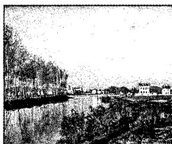  
画作  $\rightarrow$  合成照片

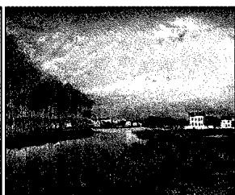

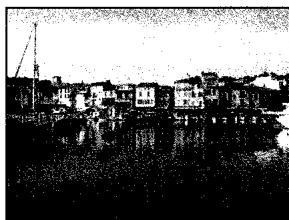  
照片  $\rightarrow$  合成画作

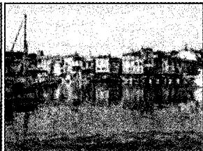

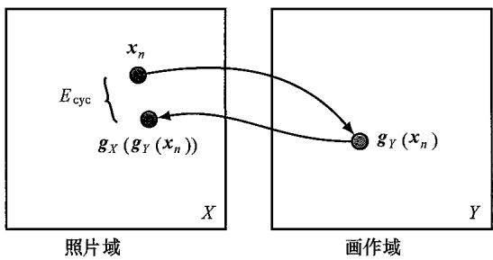  
图17.6 使用CycleGAN进行图像转换的示例：由莫奈风格画作合成摄影风格照片（上排），以及由照片合成莫奈风格画作（下排）[Zhu et al.（2017），经授权使用]  
图17.7 为示例照片  $x_{n}$  计算循环一致性误差。首先使用生成器  $g_{Y}$  将照片映射到画作域，然后将得到的向量映射回照片域，使用的是生成器  $g_{X}$  。结果照片与原始照片  $x_{n}$  之间的差异是由循环一致性误差贡献的。类似地，使用  $g_{X}$  将一幅画作  $y_{n}$  映射成一张照片，然后使用  $g_{Y}$  再映射回一幅画作，即可计算在这个方向上循环一致性误差的贡献

如果我们使用标准的GAN损失函数来训练这种架构，CycleGAN就能学会生成逼真的合成画作和合成照片，但没有什么机制能确保生成的画作看起来像对应的照片，反之亦然。因此，我们在损失函数中引入了一个额外的术语，称为循环一致性误差（cycle consistency error）。它包含两项，其构建过程如图17.7所示。

这一过程的目标是确保当一张照片先被转换成一幅画，再被转换回照片后，结果与原始照片接近，从而确保生成的画作保留了足以恢复原始照

片的初始信息。同样，当一幅画作先被转换成一张合成照片，再被转换回一幅画作时，结果也应该与原始画作接近。将这个理念应用到训练集中的所有照片和画作，就会得到形式如下的循环一致性误差：

$$
\begin{array}{l} E _ {\text {c y c}} \left(\boldsymbol {w} _ {X}, \boldsymbol {w} _ {Y}\right) = \frac {1}{N _ {X}} \sum_ {n \in X} \left\| \boldsymbol {g} _ {X} \left(\boldsymbol {g} _ {Y} \left(\boldsymbol {x} _ {n}\right)\right) - \boldsymbol {x} _ {n} \right\| _ {1} + \tag {17.12} \\ \frac {1}{N _ {Y}} \sum_ {n \in Y} \left\| \mathbf {g} _ {Y} \left(\mathbf {g} _ {X} \left(\mathbf {y} _ {n}\right)\right) - \mathbf {y} _ {n} \right\| _ {1} \\ \end{array}
$$

其中  $\| \cdot \| _1$  表示L1范数。将循环一致性误差添加到式（17.6）定义的GAN损失函数中，便可得到总的损失函数：

$$
E _ {\mathrm {G A N}} \left(\boldsymbol {w} _ {X}, \phi_ {X}\right) + E _ {\mathrm {G A N}} \left(\boldsymbol {w} _ {Y}, \phi_ {Y}\right) + \eta E _ {\text {c y c}} \left(\boldsymbol {w} _ {X}, \boldsymbol {w} _ {Y}\right) \tag {17.13}
$$

其中系数  $\eta$  决定了GAN误差和循环一致性误差的相对重要性。在计算一个图像和一幅画作的损失函数时，通过CycleGAN的信息流如图17.8所示。

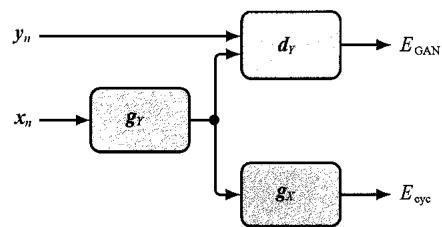  
图17.8 通过CycleGAN的信息流。数据点  $x_{n}$  和  $y_{n}$  的总误差是其4个组成部分误差的总和

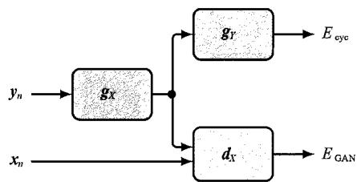

我们已经看到，GAN能胜任生成式模型的工作，它也可用于表示学习（representation learning）（参见6.3.3小节），其通过无监督学习揭示了数据集中丰富的统计结构。当用图17.4所示的深度卷积GAN在一个卧室图像数据集上进行训练，并且从潜空间中随机抽取样本，然后通过已训练的网络加以传播时，生成的图像看起来也像卧室，正如我们预期的那样（Radford, Metz and Chintala, 2015）。此外，潜空间已经以具有语义意义的方式组织起来。例如，如果我们沿着潜空间中的平滑轨迹进行跟踪，并生成相应的一系列图像，就可以实现从一个图像到另一个图像的平滑过渡，如图17.9所示。

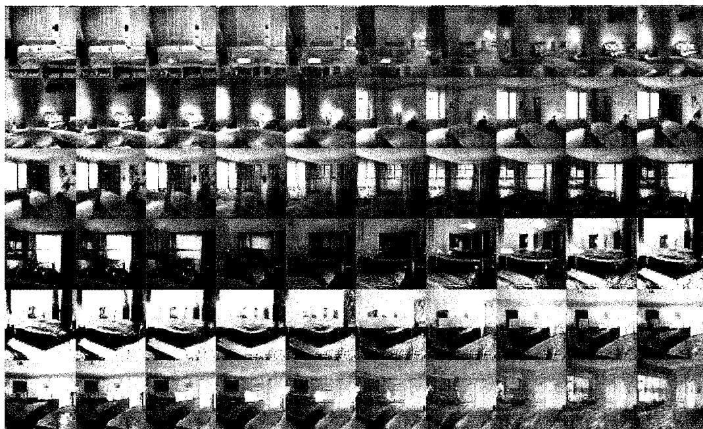  
图17.9 由在卧室图像上训练的深度卷积GAN生成的样本。其中的每一行都是通过在潜空间内部随机生成的位置之间进行平滑移动得到的。图像的过渡很平滑，每幅图像看起来都像是一个合理的卧室。在最下方一行，我们看到墙上的电视逐渐变形成了窗户[Radford, Metz, and Chintala (2015)，经授权使用]

此外，识别潜空间中与具有语义意义的变换相对应的方向也是可能的。例如，对于人脸图像，某个方向可能对应面部朝向的变化，而其他方向可能对应光照变化或面部微笑程度的变化，这称为解耦表示（disentangled representation）。我们可以利用它们来合成具有特定属性的新图像。图17.10是一个关于在面部图像上训练的GAN的例子，可以看到性别或“戴眼镜与否”等语义属性对应于潜空间中特定的方向。

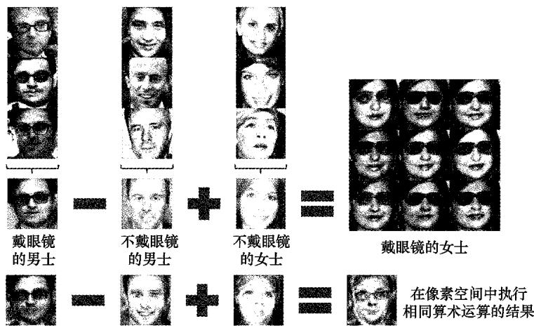  
图17.10 在训练成功的GAN的潜空间中进行向量运算的例子。对左侧三列中的每一列，算法先对生成这些图像的潜空间向量取平均值，再对具有中间值的结果进行向量运算，这样就创建了右侧  $3 \times 3$  阵列中正中的那个新向量。然后向这个向量中添加噪声，产生周围的8个样本图像。最下方一行的4幅图像则展示了直接在数据空间中应用相同的运算是导致不对齐，从而产生模糊的图像［Radford, Metz, and Chintala（2015），经授权使用］

## 习题

17.1（ $\star \star \star$ ）我们希望GAN损失函数[式（17.6）]具有如下性质：在神经网络足够灵活的情况下，当生成分布与真实数据分布匹配时，就能获得驻点。在这个习题中，假设模型具有无限的灵活性，我们将通过在与生成器网络和判别器网络相对应的全部概率分布  $p_{\mathrm{G}}(\boldsymbol{x})$  和全部函数  $d(\boldsymbol{x})$  的空间上对其进行优化来证明这一结果。具体来说，我们假设判别模型在一个内循环中被优化，从而产生用于生成式模型的有效外循环误差函数。首先证明在数据样本无限多的情况下，GAN损失函数[式（17.6）]可以重写为如下形式：

$$
E \left(p _ {\mathrm {G}}, d\right) = - \int p _ {\text {d a t a}} (\boldsymbol {x}) \ln d (\boldsymbol {x}) \mathrm {d} \boldsymbol {x} - \int p _ {\mathrm {G}} (\boldsymbol {x}) \ln (1 - d (\boldsymbol {x})) \mathrm {d} \boldsymbol {x} \tag {17.14}
$$

其中  $p_{\mathrm{data}}(\boldsymbol {x})$  是真实数据点的固定分布。考虑对所有函数  $d(x)$  进行变分优化（参见附录B），证明对于固定的生成器网络，使  $E$  最小化的判别器函数  $d(x)$  的解由下式给出：

$$
d ^ {\star} (\boldsymbol {x}) = \frac {p _ {\text {d a t a}} (\boldsymbol {x})}{p _ {\text {d a t a}} (\boldsymbol {x}) + p _ {\mathrm {G}} (\boldsymbol {x})} \tag {17.15}
$$

进一步证明损失函数  $E$  可以作为生成器网络  $p_{G}(\boldsymbol{x})$  的函数，写成以下形式：

$$
C \left(p _ {\mathrm {G}}\right) = - \int p _ {\text {d a t a}} (\boldsymbol {x}) \ln \left\{\frac {p _ {\text {d a t a}} (\boldsymbol {x})}{p _ {\text {d a t a}} (\boldsymbol {x}) + p _ {\mathrm {G}} (\boldsymbol {x})} \right\} \mathrm {d} \boldsymbol {x} - \tag {17.16}
$$

$$
\int p _ {\mathrm {G}} (\boldsymbol {x}) \ln \left\{\frac {p _ {\mathrm {G}} (\boldsymbol {x})}{p _ {\mathrm {d a t a}} (\boldsymbol {x}) + p _ {\mathrm {G}} (\boldsymbol {x})} \right\} \mathrm {d} \boldsymbol {x}
$$

式（17.16）可以重写为以下形式：

$$
C \left(p _ {\mathrm {G}}\right) = - \ln (4) + \mathrm {K L} \left(p _ {\text {d a t a}} \left\| \frac {p _ {\text {d a t a}} + p _ {\mathrm {G}}}{2}\right) + \mathrm {K L} \left(p _ {\mathrm {G}} \left\| \frac {p _ {\text {d a t a}} + p _ {\mathrm {G}}}{2}\right) \right. \right. \tag {17.17}
$$

其中Kullback-Leibler散度  $\mathrm{KL}(p\| q)$  由式（2.100）定义（参见2.5.5小节）。最后，根据只有在  $p(x) = q(x)$  对所有  $\pmb{x}$  都成立时  $\mathrm{KL}(p\| q)$  才等于零这一性质，证明 $C(p_{G})$  的最小值发生在  $p_{\mathrm{G}}(x) = p_{\mathrm{data}}(x)$  时。注意，式（17.17）中两个Kullback-Leibler散度的总和称为  $p_{\mathrm{data}}$  和  $p_{\mathrm{G}}$  之间的Jensen-Shannon散度。和Kullback-Leibler散度一样，Jensen-Shannon散度也是一个非负的量，当且仅当两个分布相等时它会消失，但不同于KL散度，它对于两个分布是对称的。

17.2（ $\star \star \star$ ）在这个习题中，我们将探讨GAN训练的对抗性可能会引起的问题。考虑一个定义在两个参数  $a$  和  $b$  上的成本函数  $E(a, b) = ab$ ，证明点  $a = 0, b = 0$  是该成本函数的一个驻点。考虑沿着直线  $b = a$  和  $b = -a$  的二阶导数，其中  $a$  和  $b$  分别类比于生成网络和差别网络的参数。证明点  $a = 0, b = 0$  也是一个鞍点。假设我们采取无穷小步骤来优化这个误差函数，使得变量成为连续时间  $a(t)$  和  $b(t)$  的函数，在此过程中生成器网络的参数  $a(t)$  被更新以增加  $E(a, b)$ ，参数  $b(t)$  也被更新以减少  $E(a, b)$ 。证明参数的演变受以下方程的控制：

$$
\frac {\mathrm {d} a}{\mathrm {d} t} = \eta \frac {\partial E}{\partial a}, \quad \frac {\mathrm {d} b}{\mathrm {d} t} = - \eta \frac {\partial E}{\partial b} \tag {17.18}
$$

然后证明  $a(t)$  满足二阶微分方程：

$$
\frac {\mathrm {d} ^ {2} a}{\mathrm {d} t ^ {2}} = - \eta^ {2} a (t) \tag {17.19}
$$

验证以上二阶微分方程的解为

$$
a (t) = C \cos (\eta t) + D \sin (\eta t) \tag {17.20}
$$

其中  $C$  和  $D$  是任意常数。如果系统在  $t = 0$  时初始化为  $a = 1, b = 0$ ，找出  $C$  和  $D$  的值，并由此证明得到的  $a(t)$  和  $b(t)$  的值会在以原点为中心的  $a, b$  空间中描绘

出一个单位半径的圆，并且它们因此永远不会收敛到鞍点。

17.3（ $\star \star$ ）考虑一个GAN模型，其训练集由相等数量的猫和狗的图像构成，并且生成器网络已经学会了产生高质量的狗的图像。证明当我们向判别器网络（训练目标是输出一个图像为真的概率）输入一张狗的图像时，最优输出是  $1/3$ 。
