# 第20章扩散模型

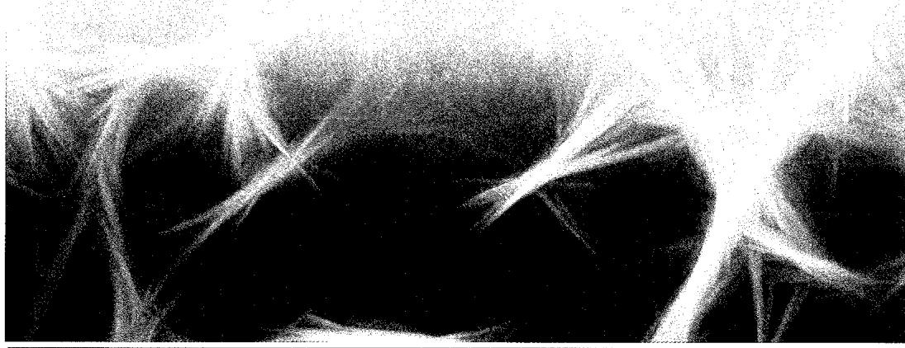

构建丰富的生成式模型的一种行之有效的方法是引入一个潜变量  $z$  上的分布  $p(z)$ ，然后使用深度神经网络将  $z$  转换到数据空间  $\mathbf{x}$  中。我们仅需要使用一个简单的固定分布来表示  $p(z)$ ，例如高斯分布  $\mathcal{N}(z|0,I)$ ，因为神经网络的通用性能够将其转换成一组关于  $\mathbf{x}$  的高度灵活的分布。在前面的章节（参见16.4.4小节）中，我们探讨了多种属于这一框架但基于不同方法定义和训练深度神经网络的模型，包括生成对抗网络、变分自编码器和标准化流。

在本章中，我们将讨论这一通用框架下的第4类模型——扩散模型（diffusion model），也叫去噪扩散概率模型（Denoising Diffusion Probabilistic Model, DDPM）（Sohl-Dickstein et al., 2015; Ho, Jain, and Abbeel, 2020），在许多应用领域，它们已经成为最先进的技术。尽管这个框架有更广泛的适用性，但我们仍将以图像数据为例讲述。这类模型的核心思想是对每一个训练图像，通过多步骤的噪声来损坏它，将其转变为高斯分布的样本，如图20.1所示。然后训练一个深度神经网络来逆转这个过程，一旦

训练完成，该网络就可以基于高斯分布的样本开始生成新的图像。

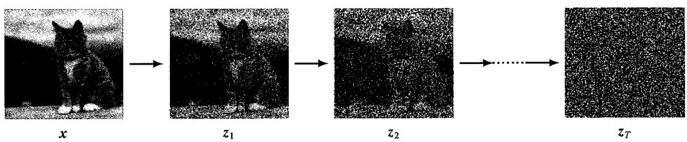  
图20.1扩散模型中编码过程的示意图，一幅图像  $\pmb{x}$  逐渐被叠加的高斯噪声破坏，在经过多个阶段后，得到一系列越来越嘈杂的图像。最后的结果与从高斯分布中抽取的样本已无法区分。我们想要训练一个深度神经网络来逆转这个过程

扩散模型可以视为一种层次化的变分自编码器，其中编码器分布是固定的，并由噪声过程定义，只有生成分布是学习得来的（Luo, 2022）（参见19.2节）。它们易于训练，在并行硬件上具有良好的可扩展性，在避免对抗训练所带来的挑战和不稳定性的同时，可以产生与生成对抗网络相当或更优的结果。然而，由于需要通过解码器网络进行多次前向传播，它在生成新样本时会产生高昂的计算成本（Dhariwal and Nichol, 2021）。

## 20.1 前向编码器

从训练集中选取一个图像，表示为  $x$ ，然后将图像中的每个像素独立地与高斯噪声混合，得到一个被噪声损坏的图像  $z_{1}$ ，其定义如下：

$$
z _ {1} = \sqrt {1 - \beta_ {1}} x + \sqrt {\beta_ {1}} \varepsilon_ {1} \tag {20.1}
$$

其中  $\varepsilon_{1} \sim \mathcal{N}\left(\varepsilon_{1} | \mathbf{0}, \mathbf{I}\right)$  且  $\beta_{1} < 1$  是噪声分布的方差。式（20.1）中的系数  $\sqrt{1 - \beta_{1}}$  和  $\sqrt{\beta_{1}}$  确保了  $z_{t}$  的分布均值比  $z_{t-1}$  的分布均值更接近于零，且  $z_{t}$  的方差比  $z_{t-1}$  的方差更接近于单位矩阵（见习题20.1）。我们可以将式（20.1）写成以下形式（参见习题20.3）：

$$
q \left(\boldsymbol {z} _ {1} \mid \boldsymbol {x}\right) = \mathcal {N} \left(\boldsymbol {z} _ {1} \mid \sqrt {1 - \beta_ {1}} \boldsymbol {x}, \beta_ {1} \boldsymbol {I}\right) \tag {20.2}
$$

然后重复这个过程，加入额外的独立高斯噪声，从而生成一系列越来越多的加噪图像  $z_{2},\dots ,z_{T}$  。注意，在关于扩散模型的文献中，这些加噪图像或潜变量有时表示为 $x_{1}\dots ,x_{T}$  ，而观测变量则表示为  $\pmb{x}_0$  。在本书中，我们使用  $\pmb{z}$  来表示潜变量，并使用  $\pmb{x}$  来表示观测变量。每一个后续图像由下式给出：

$$
z _ {t} = \sqrt {1 - \beta_ {t}} z _ {t - 1} + \sqrt {\beta_ {t}} \varepsilon_ {t} \tag {20.3}
$$

其中  $\varepsilon_t \sim \mathcal{N}(\varepsilon_t | \mathbf{0}, \mathbf{I})$  。同样，我们也可以将式（20.3）写成以下形式：

$$
q \left(z _ {t} \mid z _ {t - 1}\right) = \mathcal {N} \left(z _ {t} \mid \sqrt {1 - \beta_ {t}} z _ {t - 1}, \beta_ {t} I\right) \tag {20.4}
$$

条件分布序列[式（20.4）]形成了一条马尔可夫链，并且可以表示为图20.2所示的概率图模型（参见11.3节）。方差参数  $\beta_{t}\in (0,1)$  ，并且通常是手动设置的，它们按照预定的计划递增，即  $\beta_{1} < \beta_{2} < \dots < \beta_{T}$  。

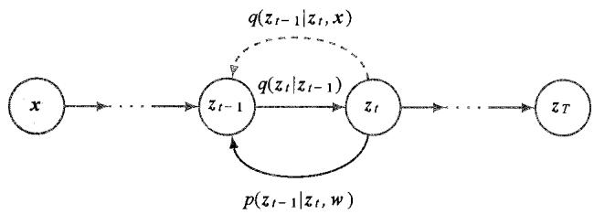  
图20.2 扩散过程可以表示为一个概率图模型。原始图像  $x$  表示为带有底色的节点，因为它是一个观测变量，而加噪图像  $z_{1},\dots ,z_{T}$  则视为潜变量。加噪过程由前向分布  $q(z_{t}|z_{t - 1})$  定义，它可以视为一个编码器。我们的目标是学习一个条件分布  $p(z_{t - 1}|z_t,w)$  并试图逆转这个过程，可以把它视为一个解码器。正如我们稍后将看到的，条件分布  $q(z_{t - 1}|z_t,x)$  在定义训练的过程中扮演了重要角色

### 20.1.1 扩散核

在观测到数据向量  $\pmb{x}$  的条件下，潜变量的联合分布由下式给出：

$$
q \left(z _ {1}, \dots , z _ {t} \mid x\right) = q \left(z _ {1} \mid x\right) \prod_ {\tau = 2} ^ {t} q \left(z _ {\tau} \mid z _ {\tau - 1}\right) \tag {20.5}
$$

对中间变量  $z_{1},\dots ,z_{t - 1}$  进行边缘化，即可得到扩散核（diffusion kernel）（参见习题20.3）：

$$
q \left(\boldsymbol {z} _ {t} \mid \boldsymbol {x}\right) = \mathcal {N} \left(\boldsymbol {z} _ {t} \mid \sqrt {\alpha_ {t}} \boldsymbol {x}, \left(1 - \alpha_ {t}\right) \boldsymbol {I}\right) \tag {20.6}
$$

其中的  $\alpha_{t}$  由下式给出：

$$
\alpha_ {t} = \prod_ {\tau = 1} ^ {t} \left(1 - \beta_ {\tau}\right) \tag {20.7}
$$

可以看到，每一个中间分布都是一个简单的闭式的高斯分布，我们可以直接从中采样，这在训练DDPM时非常有用，因为它允许我们使用马尔可夫链中随机选择的中间项进行高效的随机梯度下降，而不必运行整个马尔可夫链。我们也可以将式（20.6）写成以下形式：

$$
z _ {t} = \sqrt {\alpha_ {t}} x + \sqrt {1 - \alpha_ {t}} \varepsilon_ {t} \tag {20.8}
$$

其中仍然有  $\varepsilon_t \sim \mathcal{N}(\varepsilon_t | \mathbf{0}, \mathbf{I})$  。请注意，这里的  $\varepsilon$  代表添加到原始图像上的总噪声，而不是在马尔可夫链这一步骤中添加的增量噪声。

在经过多个这样的步骤之后，图像变得与高斯噪声无法区分。在  $T \to \infty$  的情况下，我们有（见习题20.4）

$$
q \left(\boldsymbol {z} _ {T} \mid \boldsymbol {x}\right) = \mathcal {N} \left(\boldsymbol {z} _ {T} \mid \boldsymbol {0}, \boldsymbol {I}\right) \tag {20.9}
$$

因此，关于原始图像的所有信息都丢失了。在式（20.3）中，系数  $\sqrt{1 - \beta_t}$  和  $\sqrt{\beta_t}$  确保了一旦马尔可夫链收敛到均值为零、协方差为单位矩阵的分布后，就不会再受进一步更新的影响了（见习题20.5）。

由于式（20.9）的右侧独立于  $\pmb{x}$  ，因此可以得出  $z_{T}$  的边缘分布：

$$
q \left(\mathbf {z} _ {T}\right) = \mathcal {N} \left(\mathbf {z} _ {T} \mid \mathbf {0}, \mathbf {I}\right) \tag {20.10}
$$

马尔可夫链[式（20.4）]通常称为前向过程（forward process），它类似于VAE中的编码器，但这里的马尔可夫链是固定的而不是通过训练得来的。然而请注意，马尔可夫链的相关文献中通常提到的“前向过程”与标准化流相关文献中的不同。在标准化流中，从潜空间到数据空间的映射可以认为是前向过程。

### 20.1.2 条件分布

我们的目标是学会逆转加噪过程，因此很自然地要考虑条件分布  $q\left(z_{t} \mid z_{t-1}\right)$  的逆过程，可以使用贝叶斯定理把它表示为

$$
q \left(z _ {t - 1} \mid z _ {t}\right) = \frac {q \left(z _ {t} \mid z _ {t - 1}\right) q \left(z _ {t - 1}\right)}{q \left(z _ {t}\right)} \tag {20.11}
$$

我们可以将边缘分布  $q\left(z_{t - 1}\right)$  写成如下形式：

$$
q \left(\boldsymbol {z} _ {t - 1}\right) = \int q \left(\boldsymbol {z} _ {t - 1} \mid \boldsymbol {x}\right) p (\boldsymbol {x}) \mathrm {d} \boldsymbol {x} \tag {20.12}
$$

其中  $q(z_{t - 1}|\boldsymbol {x})$  由条件高斯分布[式（20.6）]给出。然而，这个分布是难以计算的，因为我们必须对未知的数据密度  $p(\pmb {x})$  进行积分。如果我们使用训练集中的样本来近似地进行积分，则会得到一个以高斯函数混合形式表示的复杂分布。

换个思路，考虑逆向分布的条件版本，该分布以数据向量  $\pmb{x}$  为条件，定义为  $q(z_{t - 1}|z_t,x)$ ，这实际上是一个简单的高斯分布。从直观上看这是合理的，因为我们很难猜测哪个低噪声图像演变为某个具体的加噪图像，然而如果我们知道原始图像，那么问题解决起来就会变得容易很多。

我们可以使用贝叶斯定理来计算这个条件分布：

$$
q \left(z _ {t - 1} \mid z _ {t}, x\right) = \frac {q \left(z _ {t} \mid z _ {t - 1} , x\right) q \left(z _ {t - 1} \mid x\right)}{q \left(z _ {t} \mid x\right)} \tag {20.13}
$$

利用前向过程的马尔可夫性质，可以得到

$$
q \left(z _ {t} \mid z _ {t - 1}, x\right) = q \left(z _ {t} \mid z _ {t - 1}\right) \tag {20.14}
$$

式（20.14）的右侧由式（20.4）给出。作为  $z_{t-1}$  的函数，这里采用指数的二次型形式。在式（20.13）中，分子中的  $q(z_{t-1} | x)$  是由式（20.6）给出的扩散核，这同样涉及关于  $z_{t-1}$  的指数的二次型形式。我们可以忽略式（20.13）中的分母，因为作为  $z_{t-1}$  的函数，它是一个常数。式（20.13）右侧的形式是一个高斯分布，我们可以使用“配方法”这一技巧来确定其均值和协方差，得到式（20.15）（见习题20.6）：

$$
q \left(\boldsymbol {z} _ {t - 1} \mid \boldsymbol {z} _ {t}, \boldsymbol {x}\right) = \mathcal {N} \left(\boldsymbol {z} _ {t - 1} \mid \boldsymbol {m} _ {t} \left(\boldsymbol {x}, \boldsymbol {z} _ {t}\right), \sigma_ {t} ^ {2} \boldsymbol {I}\right) \tag {20.15}
$$

其中

$$
\boldsymbol {m} _ {t} \left(\boldsymbol {x}, \boldsymbol {z} _ {t}\right) = \frac {\left(1 - \alpha_ {t - 1}\right) \sqrt {1 - \beta_ {t}} \boldsymbol {z} _ {t} + \sqrt {\alpha_ {t - 1}} \beta_ {t} \boldsymbol {x}}{1 - \alpha_ {t}} \tag {20.16}
$$

$$
\sigma_ {t} ^ {2} = \frac {\beta_ {t} (1 - \alpha_ {t - 1})}{1 - \alpha_ {t}} \tag {20.17}
$$

## 20.2 反向解码器

我们已经知道，前向编码器是由一系列高斯条件分布  $q(z_{t}|z_{t - 1})$  定义的，但直接逆转这一过程会导致一个难以处理的分布  $q(z_{t - 1}|z_t)$  ，因为需要对所有可能的起始向量  $\pmb{x}$  的值进行积分，而  $\pmb{x}$  的分布就是我们希望建模的未知数据分布  $p(x)$  。为了解决这个问题，我们将通过使用一个由深度神经网络控制的分布  $p(z_{t - 1}|z_t,w)$  来学习对逆向分布进行近似，其中  $\pmb{w}$  表示网络的权重和偏置。这个逆向步骤类似于变分自编码器中的解码器（参见第19章），可以通过图20.2来理解。一旦网络训练完成，我们就可以从简单的高斯分布  $z_{t}$  中进行采样，并通过一系列逆向采样步骤将其变换成数据分布  $p(x)$  的样本，这些步骤是通过反复应用训练好的网络来完成的。

从直观上看，如果我们保持方差较小，使得  $\beta_{t}$  远小于1，那么潜向量之间的步骤变化将相对较小，因此学会逆转变换应该更容易。更具体地说，如果  $\beta_{t}$  远小于1，那么分布  $q(z_{t - 1}|z_t)$  将近似于关于  $z_{t - 1}$  的高斯分布。这一点从式（20.11）中可以看出，因为等式右边是通过  $q(z_{t}|z_{t - 1})$  和  $q(z_{t - 1})$  与  $z_{t - 1}$  相关联的。如果  $q(z_{t}|z_{t - 1})$  是一个极其狭窄的高斯分布，那么在  $q(z_{t}|z_{t - 1})$  具有显著概率质量的区域， $q(z_{t - 1})$  的变化将非常小，因此  $q(z_{t - 1}|z_t)$  也可以近似认为是高斯分布。这种直觉可以通过图20.3和图20.4所示的简单例子来证实。然而，由于每一步的方差都很小，我们必须使用大量的步骤来确保从前向加噪过程中获得的最终潜变量  $z_{T}$  的分布仍然接近高斯分布，这增加了生成新样本的成本。在实践中， $T$  的值可能达到数千。

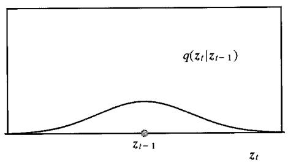  
图20.3用于标量变量的贝叶斯定理［式（20.13）］的逆向分布  $q(z_{t - 1}|z_t)$  的计算示意图。右图中的红色曲线展示了使用三个高斯分布混合而成的边缘分布  $q(z_{t - 1})$  ，左图则展示了以  $z_{t - 1}$  为中心的高斯前向加噪过程  $q(z_{t}|z_{t - 1})$  。通过将这些相乘并归一化，我们得到了特定选择的  $z_{t}$  的分布  $q(z_{t - 1}|z_t)$  ，如蓝色曲线所示。因为左侧的分布相对较宽，对应于一个较大的方差  $\beta_{t}$  ，所以分布  $q(z_{t - 1}|z_t)$  具有复杂的多模态结构

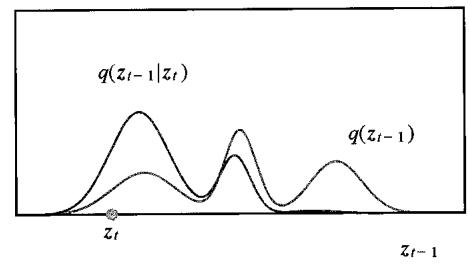

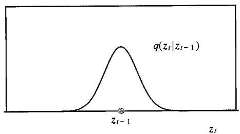  
图20.4和图20.3一样，但左图中的高斯分布  $q(z_{t}|z_{t - 1})$  具有更小的方差  $\beta_{t}$  。右图中用蓝色显示的相应分布 $q(z_{t - 1}|z_t)$  接近于高斯分布，并且具有与  $q(z_{t}|z_{t - 1})$  类似的方差

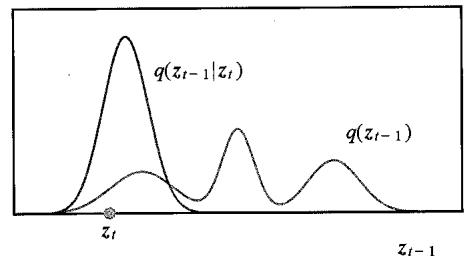

我们可以更形象地看到，通过围绕点  $z_{t}$  将  $\ln q(z_{t - 1}|z_t)$  对  $z_{t - 1}$  进行泰勒级数展开， $q(z_{t - 1}|z_t)$  将近似为高斯分布。这也表明对于小方差，逆向分布  $q(z_{t}|z_{t - 1})$  的协方差将接近前向加噪过程  $q(z_{t - 1}|z_t)$  的协方差  $\beta_{t}I$  。因此，我们可以使用以下形式的高斯分布来模拟逆向过程（见习题20.7）：

$$
p \left(z _ {t - 1} \mid z _ {t}, w\right) = \mathcal {N} \left(z _ {t - 1} \mid \mu \left(z _ {t}, w, t\right), \beta_ {t} I\right) \tag {20.18}
$$

其中， $\mu(z_{t}, w, t)$  是由参数  $w$  控制的一个深度神经网络。注意，该深度神经网络显式地将步骤索引  $t$  作为输入，以便考虑到链中不同步骤之间方差  $\beta_{t}$  的变化。这也使得我们能够使用单个网络来逆转马尔可夫链中的所有步骤，而不必为每个步骤学习一个单独的网络。此外，还可以通过在网络中引入更多的输出来学习去噪过程的协方差（Nichol and Dhariwal, 2021），从而更好地描述  $z_{t}$  邻域内分布  $q(z_{t-1})$  的曲率。用于建模  $\mu(z_{t}, w, t)$  的神经网络在架构选择上有相当大的灵活性，只要输出的维度与输入的维度相同即可（参见 10.5.4 小节）。鉴于这一限制，U-Net 架构是图像处理应用的常见选择。

整个逆向去噪过程采用了一种由下式给出的马尔可夫链形式：

$$
p \left(\boldsymbol {x}, \boldsymbol {z} _ {1}, \dots , \boldsymbol {z} _ {T} \mid \boldsymbol {w}\right) = p \left(\boldsymbol {z} _ {T}\right) \left\{\prod_ {t = 2} ^ {T} p \left(\boldsymbol {z} _ {t - 1} \mid \boldsymbol {z} _ {t}, \boldsymbol {w}\right) \right\} p \left(\boldsymbol {x} \mid \boldsymbol {z} _ {1}, \boldsymbol {w}\right) \tag {20.19}
$$

这里假设分布  $p(z_{T})$  与  $q(z_{T})$  相同，因此也由  $\mathcal{N}(z_T|\mathbf{0},\mathbf{I})$  给出。一旦模型训练好了，采样就变得简单直接了，因为我们可以首先从简单的高斯分布  $p(z_{T})$  中采样，然后依次从每个条件分布  $p(z_{t - 1}|z_t,w)$  中采样，最后从  $p(x|z_1,w)$  中采样，从而获得数据空间中的样本  $\pmb{x}$  。

### 20.2.1 训练解码器

接下来，我们需要决定用来训练神经网络的目标函数。显而易见的选择是似然函数，对于数据点  $x$  ，似然函数由下式给出：

$$
p (\boldsymbol {x} \mid \boldsymbol {w}) = \int \dots \int p (\boldsymbol {x}, \boldsymbol {z} _ {1}, \dots , \boldsymbol {z} _ {T} \mid \boldsymbol {w}) d \boldsymbol {z} _ {1} \dots d \boldsymbol {z} _ {T} \tag {20.20}
$$

其中  $p(x, z_1, \dots, z_T \mid w)$  由式（20.19）定义。这是一般潜变量模型[式（16.81）]的一个实例，其中潜变量是  $z = (z_1, \dots, z_T)$ ，观测变量是  $x$ 。注意，所有的潜变量与数据空间具有相同的维度，这与标准化流一样，但不适用于变分自编码器或生成对抗网络。从式（20.20）中可以看到，似然函数需要对所有可能生成观测数据点的噪声轨迹进行积分。式（20.20）中的积分是难以计算的，因为涉及对高度复杂的神经网络函数进行积分。

### 20.2.2 证据下界

鉴于精确的似然函数是难以计算的，我们可以采取与变分自编码器相似的方法来最大化对数似然的下界，这个下界称为证据下界（Evidence Lower BOund, ELBO）。对于任何选择的分布  $q(z)$ ，以下关系恒成立：

$$
\ln p (\boldsymbol {x} \mid \boldsymbol {w}) = \mathcal {L} (\boldsymbol {w}) + \operatorname {K L} (q (\boldsymbol {z}) \| p (\boldsymbol {z} \mid \boldsymbol {x}, \boldsymbol {w})) \tag {20.21}
$$

其中  $\mathcal{L}$  是证据下界，也称变分下界（variational lower bound），由下式给出：

$$
\mathcal {L} (\boldsymbol {w}) = \int q (z) \ln \left\{\frac {p (\boldsymbol {x} , z \mid \boldsymbol {w})}{q (z)} \right\} d z \tag {20.22}
$$

概率密度  $f(z)$  和  $g(z)$  之间的KL散度  $\mathrm{KL}(f\|g)$  则定义为（参见2.5.7小节）

$$
\operatorname {K L} \left(f (z) \| g (z)\right) = - \int f (z) \ln \left\{\frac {g (z)}{f (z)} \right\} d z \tag {20.23}
$$

下面验证式（20.21）所示的关系始终成立。根据概率的乘积法则，可得

$$
p (x, z \mid w) = p (z \mid x, w) p (x \mid w) \tag {20.24}
$$

将式（20.24）代入式（20.22）并利用式（20.23），便可得到式（20.21）（见习题20.8和2.5.7小节）。由于KL散度满足  $\mathrm{KL}(\cdot \cdot \cdot)\geqslant 0$  ，可以推导出

$$
\ln p (x \mid w) \geqslant \mathcal {L} (w) \tag {20.25}
$$

因为对数似然函数是难以计算的，所以我们通过最大化下界  $\mathcal{L}(\pmb{w})$  来训练神经网络。

为了做到这一点，我们首先为扩散模型的下界推导出一种明确的形式。在定义下界时，我们可以自由选择任何形式的  $q(z)$ ，只要它是一个有效的概率分布即可，即它是非负的并且积分值为1。在ELBO的许多应用（如变分自编码器）中，我们可以选择具有可调参数的  $q(z)$ ，这些参数通常以深度神经网络的形式存在。然后相对于这些参数以及分布  $p(x,z|w)$  的参数最大化ELBO。优化分布  $q(z)$  使下界更接近真实值，从而让  $p(x,z|w)$  中参数的优化更接近最大似然估计。然而在扩散模型中， $q(z)$  由固定分布  $q(z_1,\dots ,z_T|x)$  给出，该分布由马尔可夫链[式（20.5)]定义，因此可调参数仅存在于用于逆马尔可夫链的模型  $p(x,z_1,\dots ,z_T|w)$  中。注意，我们这里利用  $q(z)$  在选择上的灵活性，让它的形式与  $\mathbf{x}$  相关。

因此，我们可以使用式（20.5）替换式（20.21）中的  $q(z_1,\dots ,z_T\mid x)$  。同样，我们也可以使用式（20.19）替换  $p(x,z_1,\dots ,z_T\mid w)$  ，从而得到

$$
\begin{array}{l} \mathcal {L} (\boldsymbol {w}) = \mathbb {E} _ {q} \left[ \ln \frac {p \left(\boldsymbol {z} _ {T}\right) \left\{\prod_ {t = 2} ^ {T} p \left(\boldsymbol {z} _ {t - 1} \mid \boldsymbol {z} _ {t} , \boldsymbol {w}\right) \right\} p \left(\boldsymbol {x} \mid \boldsymbol {z} _ {1} , \boldsymbol {w}\right)}{q \left(\boldsymbol {z} _ {1} \mid \boldsymbol {x}\right) \prod_ {t = 2} ^ {T} q = \left(\boldsymbol {z} _ {t} \mid \boldsymbol {z} _ {t - 1} , \boldsymbol {x}\right)} \right] \\ = \mathbb {E} _ {q} \left[ \ln p \left(z _ {T}\right) + \sum_ {t = 2} ^ {T} \ln \frac {p \left(z _ {t - 1} \mid z _ {t} , w\right)}{q \left(z _ {t} \mid z _ {t - 1} , x\right)} - \ln q \left(z _ {1} \mid x\right) + \ln p \left(x \mid z _ {1}, w\right) \right] \tag {20.26} \\ \end{array}
$$

其中

$$
\mathbb {E} _ {q} [ \cdot ] \equiv \int \dots \int q (z _ {1} | x) \prod_ {t = 2} ^ {T} q (z _ {t} | z _ {t - 1}) [ \cdot ] d z _ {1} \dots d z _ {T} \tag {20.27}
$$

式（20.26）右边的第1项  $\ln p(z_{T})$  是固定分布  $\mathcal{N}(z_T|\mathbf{0},\mathbf{I})$  ，它没有可训练的参数，可以从ELBO中省略，因为它代表一个固定的加性常数。同样，式（20.26）右边的第3项  $-\ln q(z_1|x)$  与  $\pmb{\varpi}$  无关，所以也可以省略。

式（20.26）右边的第4项对应于变分自编码器中的重构项，它可以从由式（20.2）定义的  $z_{1}$  的分布中抽取样本来获得蒙特卡洛估计，从而通过近似期望  $\mathbb{E}_q[\cdot ]$  来评估。

$$
\mathbb {E} _ {q} \left[ \ln p \left(\boldsymbol {x} \mid \boldsymbol {z} _ {1}, \boldsymbol {w}\right) \right] \approx \sum_ {l = 1} ^ {L} \ln p \left(\boldsymbol {x} \mid \boldsymbol {z} _ {1} ^ {(l)}, \boldsymbol {w}\right) \tag {20.28}
$$

其中  $z_{1}^{(l)}\sim \mathcal{N}\left(z_1\Big|\sqrt{1 - \beta_1} x,\beta_1I\right)$  。与变分自编码器不同，我们不需要通过抽样值反向传播误差信号，因为  $q$  分布是固定的，所以这里不需要使用重参数化技巧（参见19.2.2小节）。

现在讨论式（20.26）右边的第2项，它包含了一系列子项，其中每一个子项都依

赖于相邻潜变量的值  $z_{t-1}$  和  $z_t$  。当我们推导扩散核[式（20.6）]时，我们可以直接从高斯分布  $q(z_{t-1} | x)$  中采样，然后使用式（20.4）得到相应的  $z_t$  的样本，这也是一个高斯分布。虽然这在样本量无穷多的极限下是正确的，但使用成对的采样值会产生非常嘈杂且方差很高的估计，因此需要大量不必要的样本。换个思路，我们也可以重写ELBO，使其可以通过对每一项只采样一个值来进行估计。

### 20.2.3 重写ELBO

在讨论了变分自编码器的ELBO之后，我们的目标是用KL散度来表达ELBO，随后可以将其表示为闭式表达式。神经网络建模的是逆向过程中的分布  $p\left(z_{t - 1} \mid z_t, w\right)$  而  $q$  分布是定义在前向过程  $q\left(z_t \mid z_{t - 1}, x\right)$  上，因此我们使用贝叶斯定理来反转条件分布：

$$
q \left(z _ {t} \mid z _ {t - 1}, x\right) = \frac {q \left(z _ {t - 1} \mid z _ {t} , x\right) q \left(z _ {t} \mid x\right)}{q \left(z _ {t - 1} \mid x\right)} \tag {20.29}
$$

这样我们就可以把式（20.26）中的第二项写为

$$
\ln \frac {p \left(z _ {t - 1} \mid z _ {t} , w\right)}{q \left(z _ {t} \mid z _ {t - 1} , x\right)} = \ln \frac {p \left(z _ {t - 1} \mid z _ {t} , w\right)}{q \left(z _ {t - 1} \mid z _ {t} , x\right)} + \ln \frac {q \left(z _ {t - 1} \mid x\right)}{q \left(z _ {t} \mid x\right)} \tag {20.30}
$$

式（20.30）右边的第二项与  $\pmb{w}$  无关，因此可以省略。将式（20.30）代入式（20.26），可以得到

$$
\mathcal {L} (\boldsymbol {w}) = \mathbb {E} _ {q} \left[ \sum_ {t = 2} ^ {T} \ln \frac {p \left(\boldsymbol {z} _ {t - 1} \mid \boldsymbol {z} _ {t} , \boldsymbol {w}\right)}{q \left(\boldsymbol {z} _ {t - 1} \mid \boldsymbol {z} _ {t} , \boldsymbol {x}\right)} + \ln p (\boldsymbol {x} \mid \boldsymbol {z} _ {1}, \boldsymbol {w}) \right] \tag {20.31}
$$

最后，我们可以把式（20.31）写成下面的形式（见习题20.9）：

$$
\begin{array}{l} \mathcal {L} (\boldsymbol {w}) = \underbrace {\int q (\boldsymbol {z} _ {1} | \boldsymbol {x}) \ln p (\boldsymbol {x} | \boldsymbol {z} _ {1} , \boldsymbol {w}) \mathrm {d} z _ {1}} _ {\text {重 建 项}} - \\ \underbrace {\sum_ {t = 2} ^ {T} \int \mathrm {K L} \left(q \left(z _ {t - 1} \mid z _ {t} , x\right) \| p \left(z _ {t - 1} \mid z _ {t} , w\right)\right) q \left(z _ {t} \mid x\right) \mathrm {d} z _ {t}} _ {\text {一 致 项}} \tag {20.32} \\ \end{array}
$$

在式（20.32）右边的第一项中， $q(z_{1},\dots ,z_{T}|x)$  的期望被简化了，这是因为  $z_{1}$  是积分符号内出现的唯一潜变量。在式（20.27）定义的期望中，所有条件分布的积分值都等于1，只留下对  $z_{1}$  的积分。同样，在式（20.32）右边的第二项中，每个积分仅涉及两个相邻的潜变量  $z_{t - 1}$  和  $z_{t}$ ，所有其余变量都可以通过积分消去。

现在的下界［式（20.32）］与式（19.14）给出的变分自编码器的ELBO非常类似，区别在于这里存在多个编码和解码阶段。重构项通过提高观测数据样本的概率来优化模型，并且可以采用与VAE中的相应项相同的方式，通过采样近似［式（20.28）］来

训练（参见第19章）。式（20.32）中的一致项是在高斯分布对之间定义的，因此可以用解析形式来表达。分布  $q(z_{t - 1}|z_t,x)$  由式（20.15）给出，而分布  $p\big(z_{t - 1}|z_t,w\big)$  由式（20.18）给出，因此KL散度变成式（20.33）的形式（见习题20.11）：

$$
\begin{array}{l} \operatorname {K L} \left(q \left(z _ {t - 1} \mid z _ {t}, x\right) \| p \left(z _ {t - 1} \mid z _ {t}, w\right)\right) \\ = \frac {1}{2 \beta_ {t}} \| \boldsymbol {m} _ {t} (\boldsymbol {x}, z _ {t}) - \mu (z _ {t}, \boldsymbol {w}, t) \| ^ {2} + \text {c o n s t} \tag {20.33} \\ \end{array}
$$

其中  $m_{t}(x, z_{t})$  由式（20.16）定义，并且任何与网络参数  $w$  无关的加性项都已经被吸收到常数项 const 中，在训练中不起作用。式（20.32）中的每个一致项对  $z_{t}$  的剩余积分（由  $q(z_{t} | x)$  加权），可以通过从  $q(z_{t} | x)$  中采样来近似，这可以通过扩散核[式(20.6)]高效地完成。

观察［式（20.33）]可知，KL散度表现为简单的平方损失函数的形式。既然我们通过调整网络参数  $\pmb{w}$  来最大化式（20.32）中的下界，而ELBO中KL散度项的前面带有负号，因此这等价于最小化这个平方误差。

### 20.2.4 预测噪声

为了获得更高质量的结果，我们可以改变神经网络的作用，使其不是在马尔可夫链的每一步都预测去噪后的图像，而是预测添加到原始图像上以创建该步骤中有噪声图像的总噪声成分（Ho, Jain and Abbeel, 2020）。对式（20.8）重新整理后，可以得到

$$
\boldsymbol {x} = \frac {1}{\sqrt {\alpha_ {t}}} \boldsymbol {z} _ {t} - \frac {\sqrt {1 - \alpha_ {t}}}{\sqrt {\alpha_ {t}}} \varepsilon_ {t} \tag {20.34}
$$

将式（20.34）代入式（20.16），即可用原始数据向量  $\pmb{x}$  和噪声  $\pmb{\varepsilon}$  重写逆条件分布  $q(z_{t - 1}|z_t,x)$  的均值  $\pmb{m}_t(\pmb {x},\pmb {z}_t)$  ，得到（见习题20.12）

$$
\boldsymbol {m} _ {t} \left(\boldsymbol {x}, \boldsymbol {z} _ {t}\right) = \frac {1}{\sqrt {1 - \beta_ {t}}} \left\{\boldsymbol {z} _ {t} - \frac {\beta_ {t}}{\sqrt {1 - \alpha_ {t}}} \varepsilon_ {t} \right\} \tag {20.35}
$$

类似地，我们不再使用神经网络  $\mu (z_t,w,t)$  来预测去噪后的图像，而是引入旨在预测添加到  $\pmb{x}$  上以生成  $z_{t}$  的总噪声的神经网络  $g(z_{t},w,t)$  。按照推导式（20.35）的相同步骤，我们看到，这两个神经网络之间的关系如下：

$$
\boldsymbol {\mu} \left(z _ {t}, \boldsymbol {w}, t\right) = \frac {1}{\sqrt {1 - \beta_ {t}}} \left\{z _ {t} - \frac {\beta_ {t}}{\sqrt {1 - \alpha_ {t}}} \boldsymbol {g} \left(z _ {t}, \boldsymbol {w}, t\right) \right\} \tag {20.36}
$$

将式（20.35）和式（20.36）代入式（20.33），可以得到

$$
\begin{array}{l} \operatorname {K L} \left(q \left(z _ {t - 1} \mid z _ {t}, x\right) \| p \left(z _ {t - 1} \mid z _ {t}, w\right)\right) \\ = \frac {\beta_ {t}}{2 (1 - \alpha_ {t}) (1 - \beta_ {t})} \| \mathbf {g} (\mathbf {z} _ {t}, \mathbf {w}, t) - \varepsilon_ {t} \| ^ {2} + \text {c o n s t} \tag {20.37} \\ = \frac {\beta_ {t}}{2 (1 - \alpha_ {t}) (1 - \beta_ {t})} \left\| \boldsymbol {g} \left(\sqrt {\alpha_ {t}} x + \sqrt {1 - \alpha_ {t}} \varepsilon_ {t}, w, t\right) - \varepsilon_ {t} \right\| ^ {2} + \text {c o n s t} \\ \end{array}
$$

在式（20.37）的最后一行中，我们用式（20.8）替换了  $z_{t}$  。

式（20.32）中的重构项可以使用式（20.28）来近似。参照式（20.18），我们有

$$
\ln p \left(\boldsymbol {x} \mid z _ {1}, \boldsymbol {w}\right) = - \frac {1}{2 \beta_ {1}} \left\| \boldsymbol {x} - \boldsymbol {\mu} \left(z _ {1}, \boldsymbol {w}, 1\right) \right\| ^ {2} + \text {c o n s t} \tag {20.38}
$$

用式（20.36）替代  $\pmb{\mu}(z_1, w, 1)$ ，并用式（20.1）替代  $\pmb{x}$  （见习题20.13），然后利用关系  $\alpha_1 = (1 - \beta_1)$ ，可以得到

$$
\ln p \left(\boldsymbol {x} \mid z _ {1}, \boldsymbol {w}\right) = - \frac {1}{2 \left(1 - \beta_ {t}\right)} \left\| \boldsymbol {g} \left(z _ {1}, \boldsymbol {w}, 1\right) - \varepsilon_ {1} \right\| ^ {2} + \text {c o n s t} \tag {20.39}
$$

这正好与式（20.37）在特殊情况  $t = 1$  时的形式相同，因此重构项和一致项可以合并起来。

有研究（Ho, Jain, and Abbeel, 2020）发现，简单地省略掉式（20.37）前面的因子  $\beta_{t} / 2(1 - \alpha_{t})(1 - \beta_{t})$  ，马尔可夫链中的所有步骤就有了相等的权重，这可以进一步提高性能。将简化后的式（20.37）代入式（20.33），可以得到

$$
\mathcal {L} (\boldsymbol {w}) = - \sum_ {t = 1} ^ {T} \left\| \boldsymbol {g} \left(\sqrt {\alpha_ {t}} \boldsymbol {x} + \sqrt {1 - \alpha_ {t}} \varepsilon_ {t}, \boldsymbol {w}, t\right) - \varepsilon_ {t} \right\| ^ {2} \tag {20.40}
$$

式（20.40）右侧的平方误差有一个非常简明的解释：对于马尔可夫链中给定的步骤  $t$  和给定的训练数据点  $\pmb{x}$ ，抽取一个噪声向量  $\varepsilon_{t}$ ，并使用这个噪声向量来创建对应的步骤  $t$  的噪声潜变量  $\pmb{z}_{t}$ 。然后损失函数就是预测的噪声和实际噪声的平方差。注意神经网络  $\pmb{g}(\cdot, \cdot, \cdot)$  预测的是添加到原始数据向量  $\pmb{x}$  上的总噪声，而不仅仅是步骤  $t$  中增加的增量噪声。

当使用随机梯度下降时，针对从训练集中随机选取的数据点  $x$  ，计算损失函数对网络参数的梯度向量。另外，对于每个这样的数据点，随机选择沿着马尔可夫链的一个步骤  $t$  ，而不是计算式（20.40）中对  $t$  求和的每一项的误差。这些梯度在小批量数据样本上累积后，用来更新网络权重。

另外，这个损失函数自动地内置了一种数据增强机制，因为每当特定的训练样本  $x$  被使用时，它都会与一个新的噪声样本  $\varepsilon_{t}$  相结合。以上所有的推导都针对来自训练集的单个数据点  $x$  。算法20.1展示了相应的梯度计算过程。

算法20.1：训练一个去噪扩散概率模型  
Input: Training data  $\mathcal{D} = \{\pmb {x}_n\}$  Noise schedule  $\{\beta_1,\dots ,\beta_T\}$    
Output: Network parameters  $\textit{\textbf{w}}$    
for  $t\in \{1,\dots ,T\}$  do  $\alpha_{t}\gets \prod_{\tau = 1}^{t}(1 - \beta_{\tau}) / /$  从计算  $\alpha$    
end for   
repeat   
 $\begin{array}{rl}{\boldsymbol{x}\sim\mathcal{D}\quad/\quad\text{采样一个数据点}}&{}\\{t\sim\{1,\cdots,T\}\quad/\quad\text{沿着马尔可夫链采样一个数据点}}&{}\\{\varepsilon\sim\mathcal{N}(\varepsilon|\mathbf{0},\mathbf{I})\quad/\quad\text{采样一个噪声向量}}&{}\\{z_t\leftarrow\sqrt{\alpha_t x}+\sqrt{1-\alpha_t\varepsilon}\quad/\quad\text{评估噪声潜变量}}&{}\\{\mathcal{L}(\boldsymbol{w})\leftarrow\|g(z_t,\boldsymbol{w},t)-\varepsilon\|^2\quad/\quad\text{计算损失项}}&{}\end{array}$    
until converged   
return  $\textit{\textbf{w}}$

### 20.2.5 生成新的样本

一旦网络训练好了，我们就可以通过以下步骤生成数据空间中的新样本：首先从高斯分布  $p(z_{T})$  中采样，然后逐步通过马尔可夫链的每一步去噪。给定步骤  $t$  的去噪样本  $z_{t}$ ，我们可以通过三个步骤生成样本  $z_{t-1}$ 。首先计算由  $\mathbf{g}(z_{t}, w, t)$  给出的神经网络输出。根据这个输出，使用式（20.36）计算均值  $\mu(z_{t}, w, t)$ 。

接下来，通过在  $p\big(z_{t - 1}\mid z_t,w\big) = \mathcal{N}\big(z_{t - 1}\mid \mu \big(z_t,w,t\big),\beta_tI\big)$  中添加经过方差缩放的噪声来生成样本  $z_{t - 1}$  ：

$$
\boldsymbol {z} _ {t - 1} = \boldsymbol {\mu} \left(\boldsymbol {z} _ {t}, \boldsymbol {w}, t\right) + \sqrt {\beta_ {t}} \varepsilon \tag {20.41}
$$

其中  $\varepsilon \sim \mathcal{N}(\varepsilon |0,I)$  。注意神经网络  $g(\cdot ,\cdot ,\cdot)$  预测的是生成  $z_{t}$  时添加到原始数据向量 $\pmb{x}$  上的总噪声。但在采样步骤中，我们只从  $z_{t - 1}$  中减去一部分具有方差  $\beta_t / \sqrt{1 - \alpha_t}$  的噪声，然后添加具有方差  $\beta_{t}$  的额外噪声来生成  $z_{t - 1}$  。在最终计算合成数据样本  $\pmb{x}$  的最终步骤中，由于我们的目标是产生一个无噪声输出，因此我们不会添加额外的噪声。算法20.2对上述采样过程做了总结。

使用扩散模型生成数据的主要缺点是，需要在训练好的网络中多次顺序执行推理过程，计算成本非常高。加快采样过程的一种方法是，首先将去噪过程转换为连续时间上的微分方程，然后使用其他有效的离散化方法来高效求解该方程（参见20.3.4小节）。

在本章中，我们假设数据和潜变量是连续的，并且由此我们可以使用高斯噪声模型。扩散模型也可以定义在离散空间中（Austin et al., 2021），例如在生成新的候选药物分子时，从化学元素子集中选择原子类型。

算法20.2：从去噪扩散概率模型中采样  
Input: Trained denoising network  $g(z, w, t)$   
Noise schedule  $\{\beta_1, \dots, \beta_T\}$   
Output: Sample vector  $x$  in data space  
 $z_T \sim \mathcal{N}(z|0, I)$  // 从最终的潜空间中采样  
for  $t \in T, \dots, 2$  do  
 $\alpha_t \gets \prod_{\tau=1}^t (1 - \beta_\tau)$  // 计算  
// 评估网络输出  
 $\mu(z_t, w, t) \gets \frac{1}{\sqrt{1 - \beta_t}} \left\{ z_t - \frac{\beta_t}{\sqrt{1 - \alpha_t}} g(z_t, w, t) \right\}$ $\varepsilon \sim \mathcal{N}(\varepsilon | 0, I)$  // 采样一个噪声向量  
 $z_{t-1} \gets \mu(z_t, w, t) + \sqrt{\beta_t} \varepsilon$  // 添加缩放的噪声  
end for  
 $x = \frac{1}{\sqrt{1 - \beta_1}} \left\{ z_1 - \frac{\beta_1}{\sqrt{1 - \alpha_1}} g(z_1, w, t) \right\}$  // 最终的去噪步骤  
return  $x$

我们看到，由于扩散模型需要依次逆转一个可能包含成百上千个步骤的加噪过程，计算强度较高。研究人员（Song, Meng, and Ermon, 2020）提出了一种称为去噪扩散隐式模型（denoising diffusion implicit models）的技术，它放宽了加噪过程的马尔可夫假设条件，同时保留保持训练目标函数不变。这样就可以在不降低所生成样本质量的情况下，使采样速度提升一个或两个数量级。

## 20.3 得分匹配

截至目前，本章讨论的去噪扩散模型与另一类相对独立发展的深度生成式模型密切相关，它们都基于得分匹配（Hyvarinen, 2005; Song and Ermon, 2019）。这些模型利用的得分函数（或斯坦因得分）则定义为对数似然函数关于数据向量  $\pmb{x}$  的梯度：

$$
s (\boldsymbol {x}) = \nabla_ {\boldsymbol {x}} \ln p (\boldsymbol {x}) \tag {20.42}
$$

这里需要强调的是，梯度是针对数据向量计算的，而不是针对任何参数向量。注意  $s(x)$  是一个与  $x$  维度相同的向量值函数，并且其中的每个元素  $s_i(x) = \partial \ln p(x) / \partial x_i$  都与  $x$  的相应元素  $x_i$  相关联。例如，如果  $x$  是一个图像，那么  $s(x)$  也可以表示为一个同尺寸的图像，其中对应的像素是图像的得分。图20.5显示了二维中的概率密度示例以及相应的得分函数。

为了理解得分函数的用处，考虑两个函数  $q(x)$  和  $p(x)$ ，它们具有得分相等的属性，所以对于  $\pmb{x}$  的所有值， $\nabla_{x} \ln q(x) = \nabla_{x} \ln p(x)$ 。如果

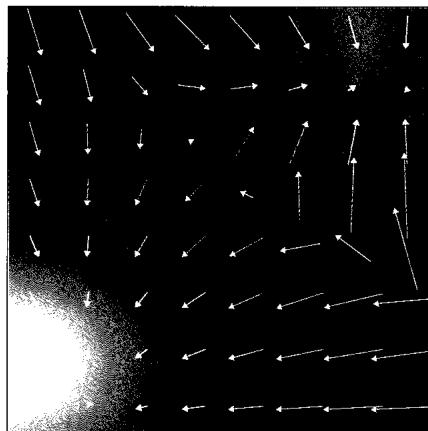  
图20.5 得分函数的示意图，图中显示了两种信息的融合：由高斯混合分布构成的二维分布，表示为热图；以及由式（20.42）定义的相应得分函数，其作为向量绘制在  $x$  值的规则网格上

我们对这个等式的两边关于  $x$  积分并取指数，则可以得到  $q(x) = Kp(x)$ ，其中  $K$  是一个独立于  $x$  的常数。所以如果我们能学习到一个得分函数的模型  $s(x, w)$ ，就可以重建原始数据分布，所得结果与之前的相比，最多相差一个常数倍数。

### 20.3.1 得分损失函数

为了训练这样的模型，需要定义一个损失函数，用于将模型得分函数  $s(x, w)$  匹配到旨在生成数据的分布  $p(x)$  的得分函数  $\nabla_x \ln p(x)$  。这样一个损失函数的例子是计算模型得分和真实得分之间的期望平方误差，其由下式给出：

$$
J (\boldsymbol {w}) = \frac {1}{2} \int \left\| \boldsymbol {s} (\boldsymbol {x}, \boldsymbol {w}) - \nabla_ {\boldsymbol {x}} \ln p (\boldsymbol {x}) \right\| ^ {2} p (\boldsymbol {x}) d \boldsymbol {x} \tag {20.43}
$$

正如我们在讨论基于能量的模型时所看到的（参见14.3.1小节），得分函数不要求相关的概率密度被归一化，因为归一化常数被梯度算子移除了，所以我们在模型选择上有相当大的灵活性。使用深度神经网络表示得分函数  $s(x, w)$  的方法有两种。  $s$  的每个元素  $s_i$  都对应于  $x$  中的一个元素  $x_i$ ，所以第一种方法是使用一个输入数量和输出数量相同的网络。然而，得分函数定义为标量函数（对数概率密度函数）的梯度，这是一类受限的函数（见习题20.14）。另一种方法是使用一个拥有单一输出的网络  $\phi(x)$ ，然后使用自动微分计算  $\nabla_x \phi(x)$  。然而，这方法需要进行两次反向传播，因此计算成本更高。大多数应用通常采用第一种方法（见习题20.15）。

### 20.3.2 修改得分损失

损失函数[式（20.43）]的一个问题是不能直接最小化，因为我们不知道真实的数据得分  $\nabla_{x}\ln p(\pmb {x})$  。我们所知的只是有限的数据集  $\mathcal{D} = (x_1,\dots ,x_N)$  ，从中可以构建如下经验分布：

$$
p _ {\mathcal {D}} (\boldsymbol {x}) = \frac {1}{N} \sum_ {n = 1} ^ {N} \delta \left(\boldsymbol {x} - \boldsymbol {x} _ {n}\right) \tag {20.44}
$$

这里的  $\delta(x)$  是狄拉克 delta 函数，我们可以将其形象地理解为在  $x = 0$  处无限高的“尖峰”，它具有以下性质：

$$
\delta (\boldsymbol {x}) = 0, \quad \boldsymbol {x} \neq 0 \tag {20.45}
$$

$$
\int \delta (\boldsymbol {x}) d \boldsymbol {x} = 1 \tag {20.46}
$$

由于式（20.44）所示的函数不是  $x$  的可微函数，我们无法计算它的得分。但我们可以通过引入噪声模型来“抹平”数据点并给出密度的平滑、可微表示来解决这个问题，这称为Parzen估计器或核密度估计器（参见3.5.2小节），定义如下：

$$
q _ {\sigma} (z) = \int q (z | x, \sigma) p (x) d x \tag {20.47}
$$

其中  $q(z|x,\sigma)$  是噪声核。常见的核选择是高斯核：

$$
q (z \mid x, \sigma) = \mathcal {N} (z \mid x, \sigma^ {2} I) \tag {20.48}
$$

此时，我们不再最小化损失函数式（20.43），而是使用对应于平滑后的Parzen密度的损失函数，形式为

$$
J (\boldsymbol {w}) = \frac {1}{2} \int \left\| \boldsymbol {s} (\boldsymbol {z}, \boldsymbol {w}) - \nabla_ {\boldsymbol {z}} \ln q _ {\sigma} (\boldsymbol {z}) \right\| ^ {2} q _ {\sigma} (\boldsymbol {z}) d z \tag {20.49}
$$

一个关键结果是，通过将式（20.47）代入式（20.49），我们可以将这个损失函数重写为以下等价形式（Vincent, 2011）（见习题 20.17）：

$$
J (\boldsymbol {w}) = \frac {1}{2} \iint \left\| s (\boldsymbol {z}, \boldsymbol {w}) - \nabla_ {\boldsymbol {z}} \ln q (\boldsymbol {z} | \boldsymbol {x}, \sigma) \right\| ^ {2} q (\boldsymbol {z} | \boldsymbol {x}, \sigma) p (\boldsymbol {x}) d z d \boldsymbol {x} + c o n s t \tag {20.50}
$$

用经验分布式（20.44）代替  $p(x)$ ，可以得到

$$
J (\boldsymbol {w}) = \frac {1}{2 N} \sum_ {n = 1} ^ {N} \int \left\| s (\boldsymbol {z}, \boldsymbol {w}) - \nabla_ {\boldsymbol {z}} \ln q (\boldsymbol {z} | \boldsymbol {x} _ {n}, \sigma) \right\| ^ {2} q (\boldsymbol {z} | \boldsymbol {x} _ {n}, \sigma) d \boldsymbol {z} + \text {c o n s t} \tag {20.51}
$$

对于高斯核式（20.48），得分函数变为

$$
\nabla_ {z} \ln q (z | x, \sigma) = - \frac {1}{\sigma} \varepsilon \tag {20.52}
$$

其中  $\varepsilon = z - x\sim \mathcal{N}\big(z|\mathbf{0},I\big)$  。考虑特定的噪声模型[式（20.6）]，可以得到

$$
\nabla_ {z} \ln q (z | x, \sigma) = - \frac {1}{\sqrt {1 - \alpha_ {t}}} \varepsilon \tag {20.53}
$$

由此我们可以看出，损失函数式（20.50）衡量了神经网络预测与噪声  $\varepsilon$  之间的差异。

所以，该损失函数与去噪扩散模型中使用的损失函数式（20.37）拥有相同的最小值，得分函数  $s(z, w)$  扮演的角色与噪声预测网络  $g(z, w)$  相同，但前者做了常数缩放  $-1 / \sqrt{1 - \alpha_t}$  （Song and Ermon, 2019）。最小化式（20.50）的过程称为去噪得分匹配（denoise score matching），并且我们看到它与去噪扩散模型有着密切的联系。我们稍后讨论如何选择噪声方差  $\sigma^2$ 。

训练完基于得分的模型后，我们需要生成新的样本。朗之万动力学（Langevin dynamic）非常适用于基于得分函数的模型，因为它以得分函数（参见14.3节）为基础进行运算，无须依赖归一化的概率分布，参见图20.6。

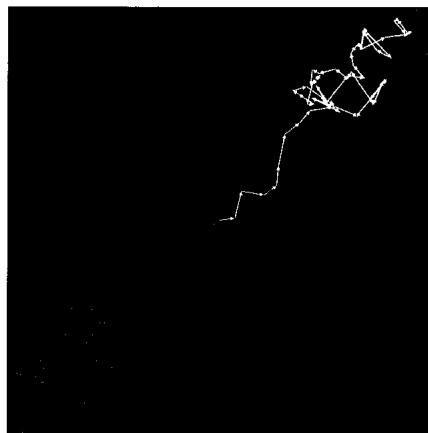  
图20.6 使用式（14.61）定义的朗之万动力学得到的采样轨迹，这里显示了三条都从图中心开始的采样轨迹

### 20.3.3 噪声方差

我们已经了解怎么从一组训练数据中学习得分函数，以及如何使用朗之万动力学方法从学习到的分布中进行采用并生成新的样本。然而，这种方法存在三个潜在的问题（Song and Ermon, 2019; Luo, 2022）（参见第16章）。第一，如果数据分布位于比数据空间维度更低的流形上，那么流形之外的点的概率密度将为零，此时因为  $\ln p(x)$  是未定义的，所以得分函数是未定义的。第二，在数据密度低的区域，得分函数的估计可能不准确，因为损失函数［式（20.43）］被密度加权了。一个不准确的得分函数会导致使用朗之万动力学方法采样时轨迹不佳。第三，即使有一个准确的得分函数，如果数据分布包括一系列不连续的混合分布，通过朗之万动力学方法也可能无法正确采样（见习题20.18）。

以上三个问题都可以通过选择核函数[式（20.48）]中使用的噪声方差  $\sigma^2$  的足够大值来解决，因为这会使数据分布平滑。然而，过大的方差会导致原始分布显著失真，导致得分函数建模失准。一个折中方案是引入方差序列  $\sigma_1^2 < \sigma_2^2 < \dots < \sigma_T^2$  （Song and Ermon, 2019），其中  $\sigma_1^2$  足够小，以便数据分布得到准确表示；而  $\sigma_T^2$  则足够大，以避免上述问题。然后修改得分网络，使其将方差作为额外的输入  $s(x, w, \sigma^2)$ ，并通过使用一个加权和形式的损失函数[式（20.51）]对其进行训练，其中的每一项表示相关网络与相应扰动数据集之间的误差。对于数据向量  $x_n$ ，损失函数的形式为

$$
\frac {1}{2} \sum_ {i = 1} ^ {L} \lambda (i) \int \left\| s (z, w, \sigma_ {i} ^ {2}) - \nabla_ {z} \ln q (z | x _ {n}, \sigma_ {i}) \right\| ^ {2} q (z | x _ {n}, \sigma_ {i}) d z \tag {20.54}
$$

其中  $\lambda (i)$  是权重系数。这个训练过程精确地对应于用来训练分层去噪网络的机制（参见20.2.1小节）。

训练完成后，可以通过依次对  $i = L, L - 1, \dots, 2, 1$  的每个模型逐个执行几步朗之万动力学方法进行采样并生成样本。这种技术称为退火朗之万动力学（annealed Langevin dynamics），类似于用来从去噪扩散概率模型中采样的算法20.2。

### 20.3.4 随机微分方程

在构建扩散模型的加噪过程时，使用大数量的步骤（通常为几千步）是有益处的。因此，我们需要考虑在无穷步数的极限情况下会发生什么，就像我们在引入神经微分方程时为无限深度的神经网络所做的那样（参见18.3.1小节）。在这种极限情况下，我们需要确保每一步的噪声方差  $\beta_{t}$  随着步长变小而同步变小。这引出了连续时间下扩散模型的理论框架，即随机微分方程（Stochastic Differential Equation，SDE）（Song et al., 2020）。去噪扩散概率模型和得分匹配模型都可以视为连续时间SDE的离散化实现。

我们可以将一般的SDE写成向量  $\pmb{z}$  的无穷小更新：

$$
\mathrm {d} z = \underbrace {\boldsymbol {f} (z , t) \mathrm {d} t} _ {\text {漂 移 项}} + \underbrace {\boldsymbol {g} (t) \mathrm {d} v} _ {\text {扩 散 项}} \tag {20.55}
$$

其中漂移项（drift term）是确定性的，类似于常微分方程（ODE），但扩散项（diffusion term）是随机的。这里的参数  $t$  常常称为“时间”，类比于物理系统中的时间。扩散模型的前向加噪过程[式（20.3）]，可以通过采取连续时间极限而写成形如式（20.55）的SDE（见习题20.19）。

对于SDE[式（20.55）]，存在一个对应的逆向SDE（Song et al., 2020），如下所示：

$$
\mathrm {d} z = \left\{f (z, t) - g ^ {2} (t) \nabla_ {z} \ln p (z) \right\} \mathrm {d} t + g (t) \mathrm {d} v \tag {20.56}
$$

其中  $\nabla_{z}\ln p(z)$  是得分函数。对于式（20.55）给出的SDE，应从  $t = T$  倒序求解至 $t = 0$  。

要想数值求解SDE，我们需要对时间变量进行离散化。最简单的方法是使用固定且等间距的时间步，这称为Euler-Maruyama求解器。对于反向SDE，我们可以先恢复朗之万方程的一种形式（参见14.3节），再采用更复杂的求解器，这些求解器使用了更灵活的离散化形式（Kloeden and Platen, 2013）。

对于所有由SDE支配的扩散过程，都存在一个相应的由ODE描述的确定性过程，其轨迹具有与SDE相同的边缘概率密度  $p(z|t)$  （Songetal.,2020）。对于形如式（20.56）的SDE，相应的ODE为

$$
\frac {\mathrm {d} z}{\mathrm {d} t} = f (z, t) - \frac {1}{2} g ^ {2} (t) \nabla_ {z} \ln p (z) \tag {20.57}
$$

ODE允许使用高效的自适应步长求解器以最大限度地减少函数评估次数。此外，ODE还允许将概率扩散模型与标准化流模型相关联，后者允许使用变量替换式（18.1）以精确计算对数似然（参见第18章）。

## 20.4 有引导的扩散

到目前为止，我们讨论的扩散模型主要用于表示从一组训练样本  $x_{1},\dots ,x_{N}$  中学习到的无条件密度  $p(x)$ ，这些样本是独立地从  $p(\boldsymbol {x})$  中抽取的。一旦模型训练好了，我们就可以从这个分布中生成新的样本。我们已经看到了一个从深度生成式模型中进行无条件采样的例子，用于人脸图像，如图1.3所示，该例从一个GAN模型中进行采样。

然而在许多应用中，我们希望从条件分布  $p(x|c)$  中进行采样，其中条件变量  $c$  可以是一个类标签或是描述目标图像内容的文字。这也构成了诸如图像超分辨率、图像修复、视频生成等许多其他应用的基础。实现这一点的最简单方法是将  $c$  视为去噪神经网络  $\pmb{g}(\pmb{z},\pmb{w},t,\pmb{c})$  的一个额外输入，然后使用匹配的  $\{\pmb{x}_n,\pmb{c}_n\}$  对来训练网络。这种方法的主要问题是，网络可能会对条件变量赋予的权重不足，甚至忽略条件变量，因此我

们需要一种方式来控制给予条件变量多少权重，并与样本多样性进行权衡。这种用以匹配条件信息的约束机制称为引导（guidance）。根据是否使用单独的分类器，引导主要有两种。

### 20.4.1 有分类器的引导

假设我们有一个训练好的分类器  $p(\boldsymbol {c}|\boldsymbol {x})$  ，下面从得分函数的角度考虑扩散模型。使用贝叶斯定理，我们可以将条件扩散模型的得分函数写成以下形式：

$$
\begin{array}{l} \nabla_ {x} \ln p (\boldsymbol {x} | \boldsymbol {c}) = \nabla_ {x} \ln \left\{\frac {p (\boldsymbol {c} | \boldsymbol {x}) p (\boldsymbol {x})}{p (\boldsymbol {c})} \right\} \tag {20.58} \\ = \nabla_ {x} \ln p (x) + \nabla_ {x} \ln p (c | x) \\ \end{array}
$$

这里我们利用了  $\nabla_{x}\ln p(c) = 0$  ，因为  $p(c)$  不依赖于  $\pmb{x}$  。式（20.58）中的第一项是常见的无条件得分函数，第二项则推动去噪过程朝着最大化给定标签  $\pmb{c}$  在分类器模型下的概率的方向前进（Dhariwal and Nichol, 2021）。我们可以通过引入一个超参数  $\lambda$  [称为引导尺度（guidance scale）]来控制赋予分类器梯度的权重。用于采样的得分函数随后变为

$$
\operatorname {s c o r e} (\boldsymbol {x}, \boldsymbol {c}, \lambda) = \nabla_ {\boldsymbol {x}} \ln p (\boldsymbol {x}) + \lambda \nabla_ {\boldsymbol {x}} \ln p (\boldsymbol {c} | \boldsymbol {x}) \tag {20.59}
$$

如果  $\lambda = 0$  ，则恢复原始的无条件扩散模型；而如果  $\lambda = 1$  ，则得到对应于条件分布  $p(x|c)$  的得分。当  $\lambda > 1$  时，模型被强烈引导遵守条件标签，我们也可能使用  $\lambda \gg 1$  的值，例如  $\lambda = 10$  。然而，这是以牺牲样本多样性为代价的，因为模型更倾向于“简单”的样本，即分类器能够正确分类的样本。

基于分类器的引导方法的一个问题是必须训练一个单独的分类器。此外，这个分类器需要能够对具有不同加噪程度的样本进行分类，而标准分类器是在干净的样本上进行训练的。因此，我们转向另一种无需独立分类器的引导方法，以避免使用单独的分类器。

### 20.4.2 无分类器的引导

用式（20.58）替换式（20.59）中的  $\nabla_{x}\ln p(c|x)$ ，即可将得分函数写成以下形式（见习题20.20）：

$$
\operatorname {s c o r e} (\boldsymbol {x}, \boldsymbol {c}, \lambda) = \lambda \nabla_ {\boldsymbol {x}} \ln p (\boldsymbol {x} | \boldsymbol {c}) + (1 - \lambda) \nabla_ {\boldsymbol {x}} \ln p (\boldsymbol {x}) \tag {20.60}
$$

对于  $0 < \lambda < 1$  ，上式代表了条件对数密度  $\ln p(c|x)$  和无条件对数密度  $\ln p(x)$  的凸组合；对于  $\lambda > 1$  ，来自无条件得分项的贡献变为负值，这意味着模型主动降低了生成那些忽略条件信息的样本的概率，而更倾向于生成考虑条件信息的样本。

更进一步，我们无须分别训练多个网络来对  $p(x|c)$  和  $p(x)$  进行建模，而是可以训练一个单独的条件模型，并在该模型中将条件变量  $\pmb{c}$  在训练过程中以一定概率设置

为一个空值，例如  $c = 0$ ，概率通常设置为  $10\% \sim 20\%$  。然后  $p(\pmb{x})$  由  $p(\pmb{x}|\pmb{c} = \pmb{0})$  表示。这在某种程度上类似于 dropout，dropout 会将一部分训练向量的所有条件输入都设为零（参见 9.6.1 小节）。

训练完成后，得分函数［式（20.60）]用来强化条件信息的权重。实践表明，无分类器的引导相比有分类器的引导可以提供更高的生成质量（Nichol et al., 2021; Saharia et al., 2022）。原因是分类器  $p(\boldsymbol{c}|\boldsymbol{x})$  可以忽略大部分输入向量  $\boldsymbol{x}$ ，只要能对  $\boldsymbol{c}$  做出良好预测即可；而无分类器的引导基于条件密度  $p(\boldsymbol{x}|\boldsymbol{c})$ ，其必须为  $\boldsymbol{x}$  的所有特征赋予高概率。

文本引导的扩散模型可以结合大语言模型的技术，把条件输入扩展为通用文本序列，即提示词（prompt），而非局限于预定义的类别标签（参见第12章）。这允许文本输入以两种方式影响去噪过程：第一，将基于Transformer的大语言模型的内部表示与去噪网络的输入连接起来；第二，允许去噪网络内的交叉注意力层关注文本标记序列。图20.7对基于文本提示的无分类器的引导做了说明。

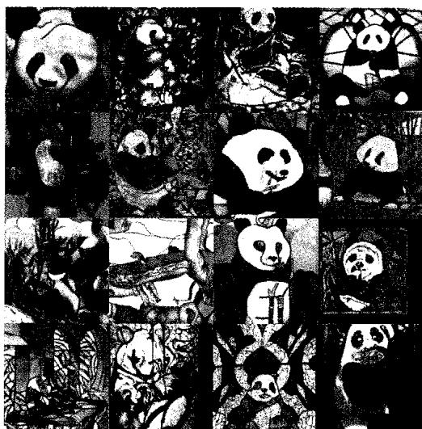  
图20.7基于文本提示的无分类器的引导，扩散模型由一个名为GLIDE的模型生成，使用的条件文本是“A stained glass window of a panda eating bamboo”（一只熊猫在吃竹子的彩绘玻璃窗）。左侧的样本是用  $\lambda = 0$  生成的（无引导，仅仅是纯条件模型），而右侧的样本是用  $\lambda = 3$  生成的［图片来源于Nichol et al. (2021)，经授权使用］

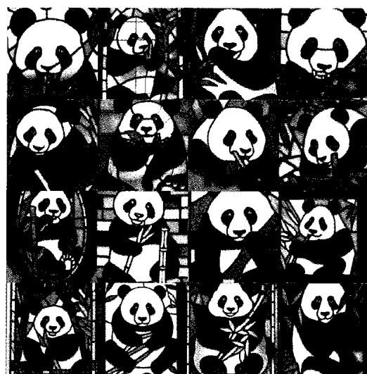

条件扩散模型的另一个应用是图像超分辨率，旨在将低分辨率图像转换为相应的高分辨率图像。这本质上是一个逆问题，单个低分辨率图像对应于多个高分辨率图像的解。实现方法是通过用低分辨率图像作为条件变量，对由高斯分布采样生成的高分辨率样本进行去噪（Saharia, Ho, et al., 2021），参见图 20.8。这些模型可以级联起来以实现非常高的图像分辨率（Ho et al., 2021），例如从  $64 \times 64$  到  $256 \times 256$  ，然后从  $256 \times 256$  到  $1024 \times 1024$  。每个阶段通常用一个 U-Net 架构（参见 10.5.4 小节），且当前 U-Net 都以前一阶段的最终去噪结果为条件。

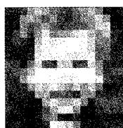

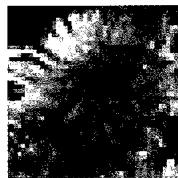  
输入图像

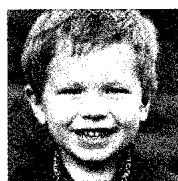

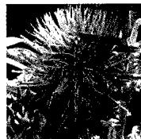  
输出图像  
图20.8 两个低分辨率图像以及由扩散模型生成的相应高分辨率图像。上面一行显示了一个  $16 \times 16$  的输入图像和相应的  $128 \times 128$  的输出图像，以及原始图像。下面一行显示了一个  $64 \times 64$  的输入图像和一个  $256 \times 256$  的输出图像，并与原始图像进行了对比[图片来源于Saharia, Ho et al.(2021)，经授权使用]

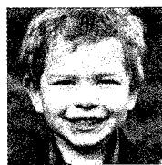

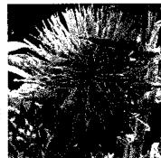  
原始图像

这种级联方式也适用于图像生成扩散模型，在这种模型中，首先在较低分辨率的图像上执行去噪操作，之后使用另一个独立的网络（可附加文本提示词输入）进行上采样，以生成最终的高分辨率图像（Nichol et al., 2021; Saharia et al., 2022）。由于去噪过程可能需要调用去噪网络数百次，与直接在高维空间中进行计算相比，级联方法能够大幅减少计算量。需要指出的是，这种方法依旧是在图像空间中直接进行操作的，只是分辨率较低而已。

对于在高分辨率图像空间中直接应用扩散模型所带来的高计算成本问题，另一种方法是使用潜扩散模型（latent diffusion model）（Rombach et al., 2021）。首先在无噪声图像上训练一个自编码器（autoencoder），以获得图像的低维表征并使参数固定操作。接下来训练一个U-Net网络，在低维空间中执行去噪操作，注意，这个空间本身并不能直接解释为图像。最后使用固定自编码器网络的输出部分将去噪表征映射到高分辨率图像空间。这种方法更有效地利用了低维空间，该空间可以专注于图像语义，并让解码器从去噪的低维表示中创建相应的清晰的高分辨率图像。

条件图像生成的其他应用还包括图像修复、去除裁剪、图像恢复、图像变形、图像风格转移、着色、去模糊和视频生成等（Yang, Srivastava, and Mandt, 2022）。图20.9展示了一个图像修复的例子。

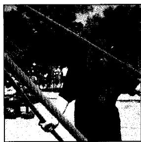  
图20.9 图像修复的一个例子。左侧是原始图像，中间是部分区域被移除的图像，右侧是经过修复处理的图像[图片来源于Saharia, Chan, Chang et al.(2021)，经授权使用]

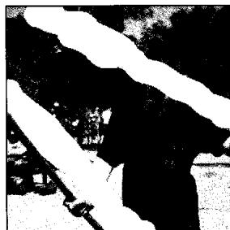

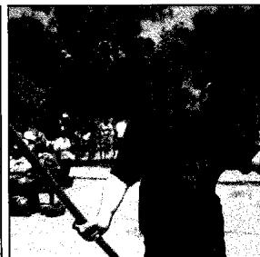

## 习题

20.1（ $\star$ ）使用式（20.3），以  $z_{t-1}$  的均值和协方差为变量，写出  $z_t$  的均值和协方差。证明当  $0 < \beta_t < 1$  时， $z_t$  的均值比  $z_{t-1}$  的均值更接近于零，并且  $z_t$  的协方差比  $z_{t-1}$  的协方差更接近于单位矩阵  $\pmb{I}$ 。  
20.2（ $\star$ ）证明式（20.1）可以等价地表示为式（20.2）。  
20.3（ $\star \star \star$ ）使用归纳法证明扩散模型前向过程的  $x_{t}$  的边缘分布由式（20.6）给出，其中  $\alpha_{t}$  由式（20.7）定义。首先验证当  $t = 1$  时式（20.6）成立。然后假设对于某个特定的  $t$  值，式（20.6）也成立，并且推导出  $t + 1$  时的相应结果。为此，最简单的方法是使用式（20.3）来写前向过程，并利用式（3.212）所示的结果，该结果显示两个独立的高斯随机变量之和本身就是一个高斯分布，在这个高斯分布中，均值和协方差是可加的。  
20.4（ $\star$ ）利用式（20.6），其中  $\alpha_{t}$  由式（20.7）定义，证明在极限  $T \to \infty$  下可以得到式（20.9）。  
20.5（ $\star \star$ ）考虑两个独立的随机变量  $a$  和  $b$  以及一个固定的标量  $\lambda$ ，证明

$$
\operatorname {c o v} [ a + b ] = \operatorname {c o v} [ a ] + \operatorname {c o v} [ b ] \tag {20.61}
$$

$$
\operatorname {c o v} [ \lambda a ] = \lambda^ {2} \operatorname {c o v} [ a ] \tag {20.62}
$$

然后进一步证明：如果  $z_{t - 1}$  的分布具有零均值和单位协方差，那么无论  $\beta_{t}$  的值如何，式（20.3）定义的  $z_{t}$  的分布都具有零均值和单位协方差。

20.6  $(\star \star \star)$  使用“配方法”这一技术从贝叶斯定理[式（20.13）]中推导出式（20.15）。首先注意式（20.13）右边分子中的两项，它们分别由式（20.4）和式（20.6）给出，并且它们都采用关于  $z_{t-1}$  的二次函数的指数形式。因此所需的分布是高斯分布，我们只需要求出其均值和协方差即可。为此，请只考虑指数中依赖于  $z_{t-1}$  的项，注意两个指数的乘积等于这两个指数之和的指数形式。把所有在关于  $z_{t-1}$  的二次项以及关于  $z_{t-1}$  的一次项收集起来，然后重新整理成  $\left(z_{t-1} - m_t\right)^{\mathrm{T}} S_t^{-1} \left(z_{t-1} - m_t\right)$  的形式。最后通过观察，求出  $m_t(x, z_t)$  和  $S_t$  的表达式。注意，与  $z_{t-1}$  无关的加法项可以忽略不计。  
20.7（ $\star \star \star$ ）证明扩散模型中正向加噪过程的条件分布  $q(z|z_{t-1})$  的逆，在噪声方差较小时可以近似为高斯分布。考虑由贝叶斯定理[式（20.11）]给出的逆条件分布  $q(z_{t-1}|z_t)$ ，而正向分布  $q(z_t|z_{t-1})$  由式（20.4）给出。对式（20.11）的两边取对数，然后以  $z_t$  为中心对  $q(z_{t-1})$  进行泰勒展开，证明对于小的噪声方差  $\beta_t$ ，分布  $q(z_{t-1}|z_t)$  可以近似为均值为  $z_t$ 、协方差为  $\beta_t I$  的高斯分布。求出关于均值和协方差的最低阶修正项的表达式，将其表示为  $\beta_t$  的次展开形式。  
20.8（ $\star \star$ ）通过将概率的乘积法则[式（20.24）]代入扩散模型的ELBO定义[式

(20.22)]中，并利用KL散度的定义[式（20.23）]，验证对数似然函数可以写成下界和KL散度之和的形式[式（20.21）]。

20.9（ $\star \star$ ）验证扩散模型的ELBO[由式（20.31）给出]可以写成式（20.32）的形式，其中KL散度由式（20.23）定义。  
20.10（ $\star \star$ ）在推导式（20.32）给出的扩散模型的ELBO时，我们省略了式（20.26）右边的第一项和第三项，因为它们与  $\pmb{w}$  无关。同样，我们还省略了式（20.30）右边的第二项，因为它也与  $\pmb{w}$  无关。证明如果保留所有这些省略的项，就会导致ELBO的  $\mathcal{L}(\pmb{x})$  [由式（20.63）给出]中增加一个额外的项：

$$
\operatorname {K L} \left(q \left(z _ {T} \mid x\right) \| p \left(z _ {T}\right)\right) \tag {20.63}
$$

请注意加噪过程是这样构造的：设法使分布  $q(z_{T}|\boldsymbol{x})$  等于高斯分布  $\mathcal{N}(\boldsymbol{x}|\boldsymbol{0},\boldsymbol{I})$ 。同样，分布  $p(z_{T})$  定义为等同于  $\mathcal{N}(\boldsymbol{x}|\boldsymbol{0},\boldsymbol{I})$ ，因此式（20.63）中的两个分布相同，KL散度为0。

20.11（ $\star \star$ ）利用式（20.15）所代表的分布  $q(z_{t-1} | z_t, x)$  和式（20.18）所代表的分布  $p(z_{t-1} | z_t, w)$ ，证明出现在式（20.32）中的一致项中的KL散度由式（20.33）给出。  
20.12  $(\star \star)$  将式（20.34）代入式（20.16）中，重写均值  $m_{t}(x,z_{t})$  ，使其能够以原始数据向量  $\pmb{x}$  和噪声  $\varepsilon$  的形式来表示，参见式（20.35），其中  $\varepsilon$  由式（20.7）定义。  
20.13（ $\star \star$ ）证明扩散模型的ELBO中的重建项[式（20.38）]可以写成式（20.39）的形式。考虑用式（20.36）替换  $\mu(z_1, w, 1)$ ，并用式（20.1）替换  $x$ ，然后利用  $\alpha_1 = (1 - \beta_1)$ ，后者可以由式（20.7）得出。  
20.14（ $\star$ ）得分函数是由  $s(x) = \nabla_{x}p(x|w)$  定义的，因此它是一个与输入向量  $\mathbf{x}$  维度相同的向量。考虑一个矩阵，其元素由下式给出：

$$
M _ {i j} = \frac {\partial s _ {i}}{\partial x _ {j}} - \frac {\partial s _ {j}}{\partial x _ {i}} \tag {20.64}
$$

证明如果通过取梯度  $s = \nabla_{x}\phi (x)$  来定义得分函数，其中  $\phi (\pmb {x})$  是具有单一输出变量的神经网络的输出，那么对于所有  $i,j$ ，矩阵元素  $M_{ij}$  都为0。请注意，如果得分函数  $s(x) = \nabla_{x}p(x|w)$  直接用一个深度神经网络来表示，并且输入与输出的数量相同，那么只有对角线矩阵元素  $M_{ii} = 0$ ，因此网络的输出不一定是某标量函数的梯度。

20.15  $(\star \star)$  考虑使用一个深度神经网络  $s(x, w)$  来表示得分函数[由式（20.42）定义]，其中  $x$  和  $s$  的维度为  $D$ 。比较以下两种情况在计算得分时的计算复杂度：一种是具有  $D$  个输出且直接用来表示得分函数的网络，另一种是计算单一标量函数  $\phi(x, w)$ ，并通过自动微分间接计算得分函数的网络。证明通常后一种方法的

计算成本更高。

20.16（ $\star \star \star$ ）我们无法直接最小化得分函数[式（20.43）]，因为我们不知道真实数据密度  $p(x)$  的函数形式，因此无法写出得分函数  $\nabla_{x}\ln p(x)$  的表达式。然而，通过使用分部积分（Hyvarinen, 2005），我们可以将式（20.43）改写为

$$
J (\boldsymbol {w}) = \int \left\{\nabla \cdot \boldsymbol {s} (\boldsymbol {x}, \boldsymbol {w}) + \frac {1}{2} \left\| \boldsymbol {s} (\boldsymbol {x}, \boldsymbol {w}) \right\| ^ {2} \right\} p (\boldsymbol {x}) d \boldsymbol {x} + c o n s t \tag {20.65}
$$

其中常数项const不依赖于网络参数  $\pmb{w}$  ，散度  $\nabla \cdot s(x,w)$  定义如下：

$$
\nabla \cdot \boldsymbol {s} = \sum_ {i = 1} ^ {D} \frac {\partial s _ {i}}{\partial x _ {i}} = \sum_ {i = 1} ^ {D} \frac {\partial^ {2} \ln p (\boldsymbol {x})}{\partial x _ {i} ^ {2}} \tag {20.66}
$$

其中  $D$  是  $\pmb{x}$  的维度。首先展开式（20.43）中的平方项，注意涉及  $\left\| s(x, w)\right\|^2$  的项已经出现在式（20.43）中，而涉及  $\left\| s_D\right\|^2$  的项可以吸收到加法常数中，这里我们定义  $s_D = \nabla \ln p_D(x)$  。考虑下式对两个函数乘积的导数。

$$
\frac {\mathrm {d}}{\mathrm {d} x} \left\{p (x) g (x) \right\} = \frac {\mathrm {d} p (x)}{\mathrm {d} x} g (x) + p (x) \frac {\mathrm {d} g (x)}{\mathrm {d} x} \tag {20.67}
$$

对式（20.67）的两边关于  $x$  进行积分并整理，得出分部积分公式：

$$
\int_ {- \infty} ^ {\infty} \frac {\mathrm {d} p (x)}{\mathrm {d} x} g (x) \mathrm {d} x = - \int_ {- \infty} ^ {\infty} \frac {\mathrm {d} g (x)}{\mathrm {d} x} p (x) \mathrm {d} x \tag {20.68}
$$

假设  $p(\infty) = p(-\infty) = 0$  。将此结果与定义  $\boldsymbol{s}_{\mathcal{D}} = \nabla \ln p(\boldsymbol{x})$  一起应用到涉及 $\boldsymbol{s}(\boldsymbol{x},\boldsymbol{w})^{\mathrm{T}}\boldsymbol{s}_{\mathcal{D}}$  的项以完成证明。请注意，计算式（20.66）中的二阶导数时，需要对每个导数进行一次反向传播，因此总的计算成本会随数据空间维度  $D$  呈二次方增长（Martens,Sutskever,and Swersky,2012）。因此，该损失函数不能直接应用于高维空间，于是切片得分匹配（Song et al.,2019）等技术被开发出来以解决这种低效问题。

20.17（ $\star \star$ ）证明：忽略加性常数，得分函数损失[式（20.50）]与式（20.49）是等价的。首先展开式（20.49）中的平方项，然后利用式（20.47）证明式（20.49）中的  $s^{\mathrm{T}}s$  项与通过展开式（20.50）中的平方项所得到的相应项是相同的。另请注意，式（20.49）中  $\left\| \nabla_z\ln q\right\|^2$  这一项与  $\pmb{w}$  无关，同样，式（20.50）中的相应项也与  $\pmb{w}$  无关，因此这些项可以视为损失函数中的加性常数，它们在训练中不起作用。最后考虑式（20.49）中的交叉项。通过使用式（20.47）替换  $q(z)$ ，证明这等于式（20.50）中相应的交叉项，从而证明这两个损失函数在忽略加性常数的情况下是相等的。

20.18（ $\star$ ）考虑一个概率分布，它由两个互斥的分布（换言之，当其中一个非零时，另一个必定为零）混合而成，形式为

$$
p (\boldsymbol {x}) = \lambda p _ {A} (\boldsymbol {x}) + (1 - \lambda) p _ {B} (\boldsymbol {x}) \tag {20.69}
$$

证明当针对任何给定点  $x$  计算由式（20.42）定义的得分函数时，混合系数  $\lambda$  不会出现。由此可知，由式（14.61）定义的朗之万动力学方法不会以正确的比例从这两个分布中采样。如正文所述，我们可以通过添加来自宽泛分布的噪声来解决这个问题。

20.19（ $\star \star$ ）在离散步骤，扩散模型中的正向加噪过程由式（20.3）定义。这里我们取连续时间极限，并将其转换为随机微分方程（SDE）。为此，首先引入一个连续变化的方差函数  $\beta(t)$ ，使得  $\beta_t = \beta(t) \Delta t$ 。通过对式（20.3）右边第一项中的平方根进行泰勒展开，证明无穷小的更新可以写成如下形式：

$$
\mathrm {d} z = - \frac {1}{2} \beta (t) z \mathrm {d} t + \sqrt {\beta (t)} \mathrm {d} v \tag {20.70}
$$

这是一般随机微分方程[式（20.55）]的特殊情况。

20.20（ $\star$ ）用式（20.58）替换  $\nabla_{x}\ln p(c|x)$ ，证明式（20.59）中的得分函数可以写成式（20.60）的形式。
